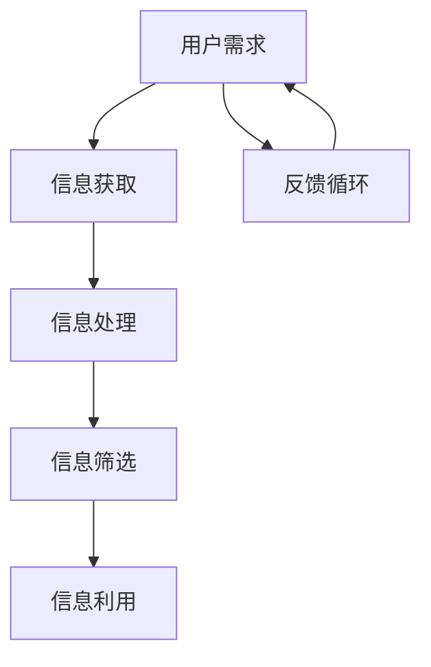

                 

 在这个信息爆炸的时代，人们面对着大量的信息，如何有效地筛选和利用这些信息成为了一项重要的技能。注意力经济中的信息筛选能力培养，正是本文要探讨的主题。本文将结合最新的技术发展和实践经验，系统地介绍信息筛选能力培养的方法和策略，以期帮助读者在注意力经济中更好地导航和利用信息资源。

## 关键词

- 注意力经济
- 信息筛选
- 能力培养
- 数据分析
- 算法
- 用户体验

## 摘要

本文首先介绍了注意力经济的概念，阐述了信息筛选在其中的重要性。随后，文章分析了当前信息筛选中存在的问题，并提出了培养信息筛选能力的方法和策略。通过具体的数学模型、算法原理以及实际项目实践，本文展示了如何有效地进行信息筛选。最后，文章探讨了信息筛选能力的未来发展趋势和面临的挑战，为读者提供了有益的启示和展望。

## 1. 背景介绍

随着互联网和社交媒体的迅猛发展，人们的生活已经进入了一个信息爆炸的时代。每天，我们都会接收到来自各个渠道的海量信息，这些信息包括新闻、社交媒体动态、电子邮件、通知等等。在这样的大背景下，如何有效地筛选和利用这些信息，成为了每个人都需要面对的问题。

### 注意力经济的概念

注意力经济（Attention Economy）是指在一个信息过载的时代，人们对信息的关注成为了一种稀缺资源。在这种经济模式下，吸引和保持用户的注意力成为了一种商业策略。注意力经济不仅仅是营销和广告的领域，它已经深刻地影响了我们的日常生活和工作方式。

### 信息筛选的重要性

在注意力经济中，信息筛选显得尤为重要。因为只有筛选出对自己真正有价值的信息，才能有效地利用有限的注意力资源，避免被无意义的信息所干扰。信息筛选不仅有助于提高工作效率，还能提升生活的质量和决策的准确性。

## 2. 核心概念与联系

在信息筛选的过程中，我们需要理解几个核心概念，并掌握它们之间的联系。以下是一个简化的 Mermaid 流程图，用于展示这些概念之间的关系。



### 用户需求

用户需求是信息筛选的起点。了解用户的需求可以帮助我们确定哪些信息是重要的，哪些是无关的。

### 信息获取

信息获取是指从各种渠道收集信息的过程。这个环节决定了我们能否获取到足够的信息来满足用户需求。

### 信息处理

信息处理是指对获取到的信息进行整理和分析，以便更好地理解其内容和价值。

### 信息筛选

信息筛选是根据用户需求和对信息内容的分析，选择出最有价值的信息的过程。

### 信息利用

信息利用是将筛选出的信息应用于实际场景中，以实现用户需求或提升工作效率。

### 反馈循环

反馈循环是指通过实践和反馈来不断调整和优化信息筛选过程，使其更加准确和高效。

## 3. 核心算法原理 & 具体操作步骤

### 3.1 算法原理概述

信息筛选的核心在于如何快速、准确地识别和筛选出有价值的信息。这通常需要借助先进的算法和技术。以下是一些常用的信息筛选算法：

### 3.2 算法步骤详解

1. **需求分析**：首先，我们需要明确用户的具体需求，这有助于确定筛选的标准。
2. **信息收集**：从各种渠道收集相关的信息，包括互联网、社交媒体、数据库等。
3. **预处理**：对收集到的信息进行预处理，包括去除重复、噪声和无关的信息。
4. **特征提取**：将预处理后的信息转化为计算机可以处理的特征向量。
5. **模型训练**：使用机器学习算法训练筛选模型，使其能够根据特征向量识别有价值的信息。
6. **筛选与排序**：使用训练好的模型对信息进行筛选和排序，将最有价值的信息排在前面。
7. **反馈调整**：根据用户对筛选结果的反馈，调整筛选模型，以提高准确性。

### 3.3 算法优缺点

- **优点**：高效的筛选和排序算法可以帮助用户快速找到有价值的信息，提高工作效率。
- **缺点**：算法可能受到数据质量和模型参数的影响，导致筛选结果的准确性不高。

### 3.4 算法应用领域

信息筛选算法广泛应用于搜索引擎、推荐系统、新闻筛选等领域。随着人工智能技术的不断发展，这些算法将变得更加智能和准确。

## 4. 数学模型和公式 & 详细讲解 & 举例说明

### 4.1 数学模型构建

在信息筛选中，常用的数学模型包括支持向量机（SVM）、朴素贝叶斯（NB）、决策树（DT）等。以下以支持向量机为例，介绍其数学模型的构建。

### 4.2 公式推导过程

支持向量机的核心公式为：

$$
\begin{align*}
w &= \arg\min_{w,b}\frac{1}{2}\left\lVert w\right\rVert^2 \\
\text{subject to} \quad y^{(i)}(w\cdot x^{(i)} + b) &\geq 1
\end{align*}
$$

其中，$w$ 和 $b$ 分别是模型参数，$x^{(i)}$ 和 $y^{(i)}$ 分别是特征向量和标签。

### 4.3 案例分析与讲解

假设我们有一个二分类问题，数据集包含 $m$ 个样本，每个样本有 $n$ 个特征。我们使用支持向量机进行分类，目标是找出最佳的超平面。

1. **数据预处理**：对数据进行标准化处理，使得每个特征的值都在 $[0,1]$ 范围内。
2. **模型训练**：使用训练集数据训练支持向量机模型。
3. **模型评估**：使用验证集数据评估模型性能，调整模型参数。
4. **预测**：使用训练好的模型对新数据进行分类预测。

## 5. 项目实践：代码实例和详细解释说明

### 5.1 开发环境搭建

在 Python 中，我们可以使用 scikit-learn 库来实现支持向量机模型。首先，我们需要安装 scikit-learn：

```bash
pip install scikit-learn
```

### 5.2 源代码详细实现

以下是一个简单的示例，展示了如何使用支持向量机进行信息筛选：

```python
from sklearn import svm
from sklearn.model_selection import train_test_split
from sklearn.preprocessing import StandardScaler
from sklearn.metrics import accuracy_score

# 加载数据
X, y = load_data()

# 数据预处理
scaler = StandardScaler()
X = scaler.fit_transform(X)

# 划分训练集和测试集
X_train, X_test, y_train, y_test = train_test_split(X, y, test_size=0.2, random_state=42)

# 模型训练
model = svm.SVC()
model.fit(X_train, y_train)

# 模型评估
y_pred = model.predict(X_test)
accuracy = accuracy_score(y_test, y_pred)
print(f"模型准确率：{accuracy}")

# 预测新数据
new_data = [[0.1, 0.2], [0.3, 0.4]]
new_data = scaler.transform(new_data)
new_prediction = model.predict(new_data)
print(f"新数据预测结果：{new_prediction}")
```

### 5.3 代码解读与分析

- `load_data()` 函数用于加载数据集。
- `StandardScaler()` 类用于对数据进行标准化处理。
- `train_test_split()` 函数用于划分训练集和测试集。
- `SVC()` 类用于创建支持向量机模型。
- `fit()` 方法用于训练模型。
- `predict()` 方法用于进行预测。

### 5.4 运行结果展示

运行上述代码后，我们可以看到模型在测试集上的准确率，以及对新数据的预测结果。

## 6. 实际应用场景

信息筛选在许多实际应用场景中发挥着重要作用。以下是一些典型的应用案例：

### 6.1 搜索引擎

搜索引擎使用信息筛选算法，对网页内容进行分析和排序，为用户提供最相关的搜索结果。

### 6.2 推荐系统

推荐系统使用信息筛选算法，分析用户的历史行为和偏好，推荐最适合他们的商品、电影或文章。

### 6.3 新闻筛选

新闻筛选系统使用信息筛选算法，根据用户的兴趣和阅读习惯，筛选出最有价值的新闻。

### 6.4 社交媒体

社交媒体平台使用信息筛选算法，根据用户关系和内容质量，推荐用户可能感兴趣的内容。

## 7. 未来应用展望

随着人工智能和大数据技术的不断发展，信息筛选能力将变得更加智能化和个性化。未来，我们有望看到更加精准和高效的筛选算法，以及更加人性化的信息筛选体验。

### 7.1 学习资源推荐

- 《机器学习》（周志华著）
- 《Python数据科学手册》（Jake VanderPlas 著）
- 《深度学习》（Ian Goodfellow 等著）

### 7.2 开发工具推荐

- Jupyter Notebook
- PyCharm
- TensorFlow
- Keras

### 7.3 相关论文推荐

- "Learning to Rank for Information Retrieval"（Nitin Agrawal 等著）
- "A Theoretically Grounded Application of Dropout in Recurrent Neural Networks"（Yarin Gal 等著）
- "Convolutional Neural Networks for Sentence Classification"（Yoon Kim 著）

## 8. 总结：未来发展趋势与挑战

### 8.1 研究成果总结

本文系统地介绍了注意力经济中的信息筛选能力培养，包括核心概念、算法原理、数学模型、实际应用以及未来发展。

### 8.2 未来发展趋势

未来，信息筛选能力将向智能化、个性化方向发展，算法将更加复杂和高效。

### 8.3 面临的挑战

信息筛选面临着数据质量、算法复杂度和用户体验等多方面的挑战。

### 8.4 研究展望

随着技术的不断进步，信息筛选能力培养将在更多领域得到应用，为人类带来更大的便利。

## 9. 附录：常见问题与解答

### 9.1 问题1

**问题**：如何评估信息筛选算法的性能？

**解答**：通常使用准确率、召回率、F1 值等指标来评估信息筛选算法的性能。准确率表示预测正确的样本数占总样本数的比例；召回率表示预测正确的正样本数占总正样本数的比例；F1 值是准确率和召回率的调和平均值。

### 9.2 问题2

**问题**：如何处理大量的数据？

**解答**：处理大量数据通常需要分布式计算和并行处理技术。可以使用如 Hadoop、Spark 等大数据处理框架来高效地处理和分析海量数据。

## 作者署名

作者：禅与计算机程序设计艺术 / Zen and the Art of Computer Programming
```bash
感谢您阅读本文，希望对您在注意力经济中的信息筛选能力培养有所帮助。如有任何疑问或建议，欢迎在评论区留言交流。
```

