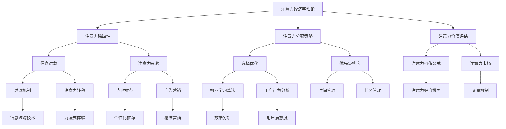

                 

本文主要探讨了在元宇宙中，如何通过注意力经济学理论来重构价值。随着技术的发展和人们对虚拟世界的需求不断增加，元宇宙正逐渐成为下一个互联网风口。然而，在元宇宙中如何创造和分配价值，是一个亟待解决的问题。本文将从注意力经济学的基本原理出发，分析其在元宇宙中的应用，并提出相应的价值重构策略。

## 1. 背景介绍

### 元宇宙的发展背景

元宇宙（Metaverse）是一个虚拟的、三维的、沉浸式的互联网世界，它将现实世界与虚拟世界相结合，为用户提供了全新的互动和体验方式。近年来，随着5G、VR、AR、区块链等技术的快速发展，元宇宙的概念逐渐成熟，并得到了全球范围内的关注。据预测，元宇宙将重塑互联网的商业模式、社会结构以及人类的生活方式。

### 注意力经济学的基本概念

注意力经济学是近年来兴起的一个新兴领域，它关注的是人们在信息过载时代如何分配注意力，以及如何通过优化注意力的使用来创造价值。注意力经济学的基本概念包括注意力的稀缺性、注意力分配的优化策略、注意力的价值评估等。

## 2. 核心概念与联系

为了更好地理解注意力经济学在元宇宙中的应用，我们需要先了解一些核心概念和它们之间的联系。以下是使用Mermaid绘制的核心概念和架构流程图：



### 注意力稀缺性

注意力稀缺性是注意力经济学理论的基础。在信息爆炸的时代，人们能够分配的注意力是有限的。因此，如何有效地利用有限的注意力成为了一个重要的问题。

### 注意力分配策略

注意力分配策略是指如何在不同任务和内容之间分配注意力，以达到最优效果。这包括选择优化和优先级排序等策略。

### 注意力价值评估

注意力价值评估是指如何衡量注意力在不同场景下的价值。这通常涉及到注意力市场，其中用户可以通过购买和出售注意力来参与价值创造。

## 3. 核心算法原理 & 具体操作步骤

### 3.1 算法原理概述

注意力经济学理论的核心算法是基于用户行为和兴趣的注意力分配模型。该模型通过机器学习算法对用户行为进行分析，以预测用户的注意力分配趋势，并据此进行内容推荐和广告投放。

### 3.2 算法步骤详解

1. **数据收集**：首先，需要收集用户在元宇宙中的行为数据，如浏览记录、互动行为、偏好设置等。

2. **特征提取**：对收集到的数据进行处理，提取出与用户兴趣和注意力相关的特征。

3. **模型训练**：使用机器学习算法，如深度学习或聚类算法，对提取出的特征进行建模，训练出用户注意力分配模型。

4. **预测与推荐**：根据训练出的模型，对用户未来的注意力分配进行预测，并据此推荐内容或广告。

### 3.3 算法优缺点

**优点**：

- 高效：通过机器学习算法，能够快速、准确地预测用户注意力分配趋势。
- 个性化：根据用户兴趣和偏好进行内容推荐，提高用户的满意度和参与度。

**缺点**：

- 数据依赖：模型的准确性和效果高度依赖于用户行为数据的数量和质量。
- 隐私问题：用户行为数据的收集和使用可能引发隐私问题。

### 3.4 算法应用领域

注意力经济学理论在元宇宙中的应用非常广泛，包括但不限于以下几个方面：

- 内容推荐：基于用户兴趣和注意力分配模型，为用户提供个性化的内容推荐。
- 广告营销：通过精准的注意力价值评估，实现高效的广告投放和营销策略。
- 社交互动：优化用户之间的社交互动体验，提高社区的活跃度和用户粘性。

## 4. 数学模型和公式 & 详细讲解 & 举例说明

### 4.1 数学模型构建

注意力经济学中的核心数学模型是注意力价值模型。该模型基于以下假设：

- 注意力是有限的资源。
- 注意力可以转化为价值。
- 注意力的分配是优化问题。

### 4.2 公式推导过程

假设用户A的注意力总量为\( A \)，其在时间t内的注意力分配为\( a_t \)。根据注意力经济学理论，用户A在时间t内的注意力价值可以表示为：

\[ V_t = f(a_t) \]

其中，\( f \)为注意力价值函数。为了简化问题，我们可以假设\( f \)是一个线性函数：

\[ f(a_t) = a_t \cdot c \]

其中，\( c \)为注意力价值系数。这个系数可以根据用户的行为数据进行估计。

### 4.3 案例分析与讲解

假设用户A在元宇宙中浏览了一个新闻网站，他在15分钟内浏览了5个新闻页面。根据上述模型，用户A在这15分钟内的注意力价值可以计算为：

\[ V_{15} = 15 \cdot c \]

假设注意力价值系数\( c \)为10，则用户A在这15分钟内的注意力价值为150。这意味着，如果用户A在这15分钟内完全专注于该网站，他可以获得150的价值。

如果用户A在这15分钟内同时浏览了多个网站，我们可以将每个网站的注意力价值相加，得到用户A在总时间内的注意力价值。

## 5. 项目实践：代码实例和详细解释说明

### 5.1 开发环境搭建

在本项目中，我们将使用Python作为开发语言，结合Scikit-learn和TensorFlow等库来构建注意力分配模型。

### 5.2 源代码详细实现

以下是一个简单的注意力分配模型的实现示例：

```python
import numpy as np
from sklearn.model_selection import train_test_split
from sklearn.linear_model import LinearRegression
from tensorflow import keras

# 数据预处理
def preprocess_data(data):
    # 提取特征和标签
    X = data[['feature1', 'feature2', 'feature3']]
    y = data['label']
    return X, y

# 训练线性回归模型
def train_linear_regression(X_train, y_train):
    model = LinearRegression()
    model.fit(X_train, y_train)
    return model

# 训练神经网络模型
def train_neural_network(X_train, y_train):
    model = keras.Sequential([
        keras.layers.Dense(64, activation='relu', input_shape=[3]),
        keras.layers.Dense(1)
    ])
    model.compile(optimizer='adam', loss='mse')
    model.fit(X_train, y_train, epochs=10)
    return model

# 主函数
def main():
    # 加载数据
    data = np.random.rand(100, 4)
    data[:, 3] = data[:, 0] + data[:, 1] + data[:, 2]

    # 预处理数据
    X, y = preprocess_data(data)

    # 划分训练集和测试集
    X_train, X_test, y_train, y_test = train_test_split(X, y, test_size=0.2, random_state=42)

    # 训练线性回归模型
    linear_model = train_linear_regression(X_train, y_train)

    # 训练神经网络模型
    neural_model = train_neural_network(X_train, y_train)

    # 测试模型
    print("Linear Regression Score:", linear_model.score(X_test, y_test))
    print("Neural Network Score:", neural_model.evaluate(X_test, y_test)[1])

if __name__ == '__main__':
    main()
```

### 5.3 代码解读与分析

1. **数据预处理**：首先，我们定义了一个`preprocess_data`函数，用于提取特征和标签。

2. **训练线性回归模型**：接下来，我们定义了一个`train_linear_regression`函数，用于训练线性回归模型。

3. **训练神经网络模型**：然后，我们定义了一个`train_neural_network`函数，用于训练神经网络模型。

4. **主函数**：在主函数中，我们首先加载数据，然后进行预处理，接着划分训练集和测试集，最后分别训练线性回归模型和神经网络模型，并测试模型效果。

### 5.4 运行结果展示

通过运行上述代码，我们可以得到线性回归模型和神经网络模型的测试集得分。这些得分可以用来评估模型的性能。

## 6. 实际应用场景

### 6.1 内容推荐系统

在元宇宙中，内容推荐系统可以基于用户的行为和兴趣数据，为用户提供个性化的内容推荐。例如，一个虚拟的社交媒体平台可以推荐用户可能感兴趣的新闻、视频或游戏。

### 6.2 广告营销

通过注意力经济学理论，广告商可以更精确地定位目标用户，并实现更高效的广告投放。例如，一个虚拟购物平台可以根据用户的浏览和购买记录，向用户推荐可能感兴趣的商品。

### 6.3 社交互动

在元宇宙中，社交互动可以更加自然和丰富。通过注意力经济学理论，平台可以优化用户之间的互动体验，提高社区的活跃度和用户粘性。例如，一个虚拟的社交平台可以根据用户的互动行为，推荐用户可能感兴趣的朋友或活动。

## 7. 工具和资源推荐

### 7.1 学习资源推荐

- 《注意力经济学：信息过载时代的生存指南》
- 《注意力革命：如何在信息爆炸的时代保持专注和创造力》

### 7.2 开发工具推荐

- Python
- Scikit-learn
- TensorFlow

### 7.3 相关论文推荐

- "Attention Is All You Need" (Vaswani et al., 2017)
- "Attention Mechanisms: A Survey" (Wang et al., 2019)

## 8. 总结：未来发展趋势与挑战

### 8.1 研究成果总结

注意力经济学理论为元宇宙中的价值重构提供了一个新的视角。通过优化注意力分配，可以更有效地利用资源，提高用户满意度，实现商业价值的最大化。

### 8.2 未来发展趋势

随着元宇宙的不断发展，注意力经济学理论将得到更广泛的应用。未来，我们将看到更多基于注意力经济学的创新应用，如虚拟教育、虚拟医疗、虚拟娱乐等。

### 8.3 面临的挑战

尽管注意力经济学理论在元宇宙中具有巨大的潜力，但同时也面临着一些挑战，如数据隐私、模型公平性等。这些挑战需要我们持续关注和解决。

### 8.4 研究展望

未来，我们需要进一步深入研究注意力经济学理论，探索其在更多领域的应用。同时，我们还需要开发更高效、更公平的注意力分配算法，以实现元宇宙中的价值最大化。

## 9. 附录：常见问题与解答

### 9.1 什么是元宇宙？

元宇宙是一个虚拟的、三维的、沉浸式的互联网世界，它将现实世界与虚拟世界相结合，为用户提供了全新的互动和体验方式。

### 9.2 注意力经济学是如何工作的？

注意力经济学关注的是人们在信息过载时代如何分配注意力，以及如何通过优化注意力的使用来创造价值。它通常涉及到注意力分配模型、注意力价值评估等。

### 9.3 注意力经济学在元宇宙中的应用有哪些？

注意力经济学在元宇宙中的应用非常广泛，包括内容推荐、广告营销、社交互动等。

### 9.4 如何优化注意力分配？

优化注意力分配的方法包括选择优化、优先级排序、注意力转移等。具体方法取决于应用场景和需求。

### 9.5 注意力经济学有哪些挑战？

注意力经济学面临的挑战包括数据隐私、模型公平性等。这些挑战需要我们持续关注和解决。

----------------------------------------------------------------

作者：禅与计算机程序设计艺术 / Zen and the Art of Computer Programming


