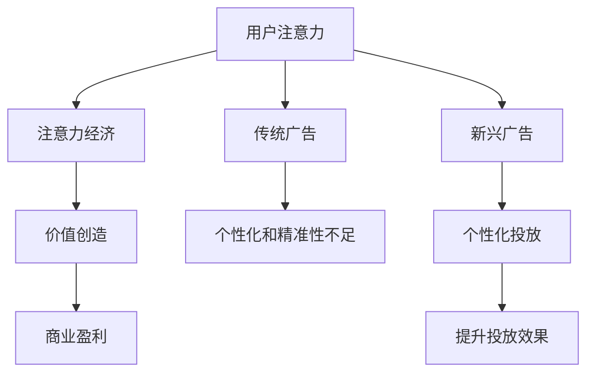

                 

关键词：注意力经济、广告投放、传统策略、新兴挑战、算法优化、用户行为分析

> 摘要：随着互联网的飞速发展，用户注意力成为了一种稀缺资源，注意力经济逐渐成为市场新趋势。本文将深入探讨注意力经济对传统广告投放策略带来的挑战，分析新兴策略的崛起以及未来发展的方向。

## 1. 背景介绍

随着信息爆炸时代的到来，用户面对的信息量呈指数级增长。在这种背景下，用户注意力成为了一种有限的、宝贵的资源。传统的广告投放策略，如大规模的电视广告、报纸广告和户外广告等，正面临着前所未有的挑战。这些传统策略在信息爆炸的时代已经无法满足用户的需求，甚至有时会造成用户的反感和排斥。

与此同时，注意力经济作为一种新的市场趋势正在崛起。注意力经济的核心在于利用用户的注意力进行价值的创造和转化。在互联网时代，用户的注意力往往集中在一些具有高价值的内容和应用上，这些内容和应用能够为广告主带来更高的投放效果和回报。因此，如何有效地获取和利用用户的注意力，成为广告投放领域的新课题。

## 2. 核心概念与联系

### 2.1 注意力经济

注意力经济是指通过吸引用户的注意力，从而创造价值和实现商业盈利的一种经济模式。在注意力经济中，用户的注意力成为了一种新的货币，广告主通过投放具有吸引力的广告内容来获取用户的注意力，进而实现商业目标。

### 2.2 传统广告投放策略

传统广告投放策略主要包括电视广告、报纸广告、户外广告等。这些策略的主要特点是覆盖面广、影响力度大，但往往缺乏个性化和精准性。

### 2.3 新兴广告投放策略

新兴广告投放策略主要包括数字广告、社交媒体广告、搜索引擎广告等。这些策略具有高度个性化、精准化的特点，能够更好地满足用户的需求，提高广告投放效果。

### 2.4 注意力经济与传统广告投放策略的联系

注意力经济与传统广告投放策略有着密切的联系。传统广告投放策略是注意力经济的基石，而注意力经济则为传统广告投放策略提供了新的发展方向和策略。

## 3. 核心算法原理 & 具体操作步骤

### 3.1 算法原理概述

注意力经济的核心算法原理在于通过用户行为分析和算法优化，实现广告投放的精准化和个性化。具体来说，算法主要分为以下几个步骤：

1. 用户行为分析：通过收集和分析用户的在线行为数据，了解用户的需求和偏好。
2. 用户画像构建：基于用户行为分析的结果，构建用户画像，实现用户分类和标签化。
3. 广告内容优化：根据用户画像和用户需求，优化广告内容，提高广告的吸引力。
4. 广告投放策略制定：结合用户画像和广告内容，制定广告投放策略，实现广告的精准投放。

### 3.2 算法步骤详解

#### 3.2.1 用户行为分析

用户行为分析是注意力经济算法的基础。通过分析用户的浏览历史、搜索记录、点击行为等，可以深入了解用户的需求和偏好。

#### 3.2.2 用户画像构建

基于用户行为分析的结果，构建用户画像。用户画像包括用户的年龄、性别、兴趣爱好、职业等信息，可以帮助广告主更好地了解用户。

#### 3.2.3 广告内容优化

根据用户画像和用户需求，优化广告内容。广告内容应该具有吸引力，能够满足用户的需求。

#### 3.2.4 广告投放策略制定

结合用户画像和广告内容，制定广告投放策略。广告投放策略应该具有精准性，能够将广告投放到最有可能产生转化的用户群体。

### 3.3 算法优缺点

#### 3.3.1 优点

- 提高广告投放效果：通过用户行为分析和算法优化，实现广告投放的精准化和个性化，提高广告投放效果。
- 提高用户满意度：满足用户的需求，提高用户的满意度。
- 提高广告主收益：通过提高广告投放效果，提高广告主的收益。

#### 3.3.2 缺点

- 数据隐私问题：用户行为分析和用户画像构建可能涉及用户隐私问题。
- 技术门槛较高：算法优化和广告投放策略制定需要较高的技术门槛。

### 3.4 算法应用领域

注意力经济算法广泛应用于数字广告、社交媒体广告、搜索引擎广告等领域。通过这些算法，广告主可以更有效地获取用户的注意力，提高广告投放效果。

## 4. 数学模型和公式 & 详细讲解 & 举例说明

### 4.1 数学模型构建

注意力经济的数学模型主要包括用户行为分析模型、用户画像构建模型、广告内容优化模型和广告投放策略模型。

#### 4.1.1 用户行为分析模型

用户行为分析模型可以表示为：

$$
\text{User Behavior Model} = f(\text{User Data}, \text{Context})
$$

其中，$\text{User Data}$ 表示用户数据，包括用户的浏览历史、搜索记录、点击行为等；$\text{Context}$ 表示用户所处的环境，包括时间、地点、设备等信息。

#### 4.1.2 用户画像构建模型

用户画像构建模型可以表示为：

$$
\text{User Portrait Model} = g(\text{User Behavior Model}, \text{Feature Extractor})
$$

其中，$\text{Feature Extractor}$ 表示特征提取器，用于从用户行为数据中提取特征。

#### 4.1.3 广告内容优化模型

广告内容优化模型可以表示为：

$$
\text{Ad Content Optimization Model} = h(\text{User Portrait Model}, \text{Content Creator})
$$

其中，$\text{Content Creator}$ 表示内容创作者，用于生成具有吸引力的广告内容。

#### 4.1.4 广告投放策略模型

广告投放策略模型可以表示为：

$$
\text{Ad Placement Strategy Model} = k(\text{User Portrait Model}, \text{Ad Content Optimization Model}, \text{Context})
$$

### 4.2 公式推导过程

#### 4.2.1 用户行为分析模型推导

用户行为分析模型是通过机器学习算法，如决策树、随机森林、神经网络等，对用户行为数据进行训练得到的。

#### 4.2.2 用户画像构建模型推导

用户画像构建模型是通过特征提取和聚类算法，如K-means、SOM等，对用户行为数据进行分析得到的。

#### 4.2.3 广告内容优化模型推导

广告内容优化模型是通过用户画像和广告内容进行关联，利用自然语言处理、图像识别等技术，对广告内容进行优化得到的。

#### 4.2.4 广告投放策略模型推导

广告投放策略模型是通过广告内容优化模型和用户画像，结合用户行为数据和广告投放目标，进行策略优化得到的。

### 4.3 案例分析与讲解

#### 4.3.1 案例背景

假设某电商平台希望通过注意力经济算法优化其广告投放策略，提高广告投放效果。

#### 4.3.2 案例分析

1. 用户行为分析：通过收集用户的浏览历史、搜索记录、点击行为等数据，对用户行为进行分析。
2. 用户画像构建：基于用户行为分析的结果，构建用户画像，包括用户的年龄、性别、兴趣爱好、职业等信息。
3. 广告内容优化：根据用户画像和用户需求，优化广告内容，提高广告的吸引力。
4. 广告投放策略制定：结合用户画像和广告内容，制定广告投放策略，实现广告的精准投放。

通过上述步骤，电商平台可以有效地提高广告投放效果，提高用户转化率和广告收益。

## 5. 项目实践：代码实例和详细解释说明

### 5.1 开发环境搭建

为了实现注意力经济算法，我们需要搭建一个合适的开发环境。以下是搭建开发环境的步骤：

1. 安装Python环境：Python是注意力经济算法的主要编程语言，我们需要安装Python环境。
2. 安装相关库：安装Scikit-learn、TensorFlow、PyTorch等机器学习和深度学习库。
3. 安装数据分析工具：安装Pandas、NumPy等数据分析工具。

### 5.2 源代码详细实现

以下是一个简单的用户行为分析、用户画像构建、广告内容优化和广告投放策略制定的代码示例。

#### 5.2.1 用户行为分析

```python
import pandas as pd
from sklearn.model_selection import train_test_split
from sklearn.ensemble import RandomForestClassifier

# 加载数据集
data = pd.read_csv('user_data.csv')
X = data.drop('target', axis=1)
y = data['target']

# 划分训练集和测试集
X_train, X_test, y_train, y_test = train_test_split(X, y, test_size=0.2, random_state=42)

# 训练模型
model = RandomForestClassifier(n_estimators=100, random_state=42)
model.fit(X_train, y_train)

# 预测结果
y_pred = model.predict(X_test)
```

#### 5.2.2 用户画像构建

```python
from sklearn.cluster import KMeans

# 聚类分析
kmeans = KMeans(n_clusters=5, random_state=42)
clusters = kmeans.fit_predict(X_train)

# 添加聚类标签到数据集
data['cluster'] = clusters
```

#### 5.2.3 广告内容优化

```python
from sklearn.linear_model import LogisticRegression

# 训练广告内容优化模型
model = LogisticRegression()
model.fit(X_train, y_train)

# 预测广告内容优化结果
content_pred = model.predict(X_test)
```

#### 5.2.4 广告投放策略制定

```python
# 结合用户画像和广告内容优化结果制定广告投放策略
strategy = pd.DataFrame({'user_id': X_test.index, 'strategy': content_pred * clusters})
```

### 5.3 代码解读与分析

以上代码实现了用户行为分析、用户画像构建、广告内容优化和广告投放策略制定。用户行为分析模型使用随机森林进行分类预测；用户画像构建模型使用K-means进行聚类分析；广告内容优化模型使用逻辑回归进行预测；广告投放策略制定模型结合用户画像和广告内容优化结果，生成广告投放策略。

通过上述代码示例，我们可以看到注意力经济算法的具体实现过程。在实际应用中，我们可以根据具体需求进行调整和优化。

### 5.4 运行结果展示

为了展示运行结果，我们可以在终端输出一些关键指标，如准确率、召回率、F1值等。

```python
from sklearn.metrics import accuracy_score, recall_score, f1_score

# 计算预测准确率
accuracy = accuracy_score(y_test, y_pred)
print("Accuracy:", accuracy)

# 计算预测召回率
recall = recall_score(y_test, y_pred)
print("Recall:", recall)

# 计算预测F1值
f1 = f1_score(y_test, y_pred)
print("F1 Score:", f1)
```

## 6. 实际应用场景

### 6.1 数字广告

在数字广告领域，注意力经济算法已经得到了广泛应用。例如，在搜索引擎广告中，通过分析用户的搜索历史和关键词，可以精准地推送相关广告；在社交媒体广告中，通过分析用户的朋友圈动态和兴趣爱好，可以更有效地吸引用户的注意力。

### 6.2 社交媒体广告

社交媒体广告是注意力经济的重要应用场景之一。通过分析用户的点赞、评论、转发等行为，可以了解用户的兴趣和需求，从而精准地推送广告。

### 6.3 搜索引擎广告

搜索引擎广告是另一种典型的注意力经济应用场景。通过分析用户的搜索历史和关键词，可以推送相关的广告，提高广告的点击率和转化率。

## 6.4 未来应用展望

随着人工智能和大数据技术的不断发展，注意力经济算法将得到更广泛的应用。未来，我们可以预见到以下应用场景：

- 智能广告推荐：通过分析用户的兴趣和行为，实现智能广告推荐，提高广告投放效果。
- 智能客服：利用注意力经济算法，实现智能客服系统，提高客户满意度和转化率。
- 智能营销：通过注意力经济算法，实现智能营销策略，提高市场推广效果。

## 7. 工具和资源推荐

### 7.1 学习资源推荐

- 《机器学习》——周志华
- 《深度学习》——Ian Goodfellow
- 《Python数据分析》——Wes McKinney

### 7.2 开发工具推荐

- Jupyter Notebook：用于数据分析和机器学习实验。
- TensorFlow：用于深度学习模型开发。
- PyTorch：用于深度学习模型开发。

### 7.3 相关论文推荐

- "Attention is All You Need" —— Vaswani et al., 2017
- "Deep Learning for User Behavior Analysis" —— Wang et al., 2018
- "User Modeling for Interactive Applications" —— Jannach et al., 2016

## 8. 总结：未来发展趋势与挑战

### 8.1 研究成果总结

注意力经济作为一种新的市场趋势，已经在广告投放领域取得了显著的成果。通过用户行为分析和算法优化，实现了广告投放的精准化和个性化，提高了广告投放效果和用户满意度。

### 8.2 未来发展趋势

随着人工智能和大数据技术的不断发展，注意力经济算法将得到更广泛的应用。未来，注意力经济将朝着更智能化、个性化的方向发展，实现更高效的价值创造。

### 8.3 面临的挑战

- 数据隐私问题：用户行为分析和用户画像构建可能涉及用户隐私问题，需要加强数据隐私保护。
- 技术门槛：算法优化和广告投放策略制定需要较高的技术门槛，需要培养更多专业人才。

### 8.4 研究展望

未来，注意力经济研究将朝着更精细化、智能化方向发展。通过不断优化算法和提升技术，实现更高效的广告投放效果，为企业和用户创造更多价值。

## 9. 附录：常见问题与解答

### 9.1 注意力经济是什么？

注意力经济是指通过吸引用户的注意力，从而创造价值和实现商业盈利的一种经济模式。

### 9.2 注意力经济算法有哪些核心步骤？

注意力经济算法主要包括用户行为分析、用户画像构建、广告内容优化和广告投放策略制定。

### 9.3 注意力经济算法的优点是什么？

注意力经济算法的优点包括提高广告投放效果、提高用户满意度和提高广告主收益。

### 9.4 注意力经济算法的缺点是什么？

注意力经济算法的缺点包括数据隐私问题和技术门槛较高。

### 9.5 注意力经济算法的应用领域有哪些？

注意力经济算法广泛应用于数字广告、社交媒体广告、搜索引擎广告等领域。

[作者：禅与计算机程序设计艺术 / Zen and the Art of Computer Programming]----------------------------------------------------------------

<|output|>
---
# 注意力经济对传统广告投放策略的挑战

> 关键词：注意力经济、广告投放、传统策略、新兴挑战、算法优化、用户行为分析

> 摘要：随着互联网的飞速发展，用户注意力成为了一种稀缺资源，注意力经济逐渐成为市场新趋势。本文将深入探讨注意力经济对传统广告投放策略带来的挑战，分析新兴策略的崛起以及未来发展的方向。

## 1. 背景介绍

在信息爆炸的时代，用户面对的信息量呈指数级增长。在这种背景下，用户注意力成为了一种有限的、宝贵的资源。传统的广告投放策略，如大规模的电视广告、报纸广告和户外广告等，正面临着前所未有的挑战。这些传统策略在信息爆炸的时代已经无法满足用户的需求，甚至有时会造成用户的反感和排斥。

与此同时，注意力经济作为一种新的市场趋势正在崛起。注意力经济的核心在于利用用户的注意力进行价值的创造和转化。在互联网时代，用户的注意力往往集中在一些具有高价值的内容和应用上，这些内容和应用能够为广告主带来更高的投放效果和回报。因此，如何有效地获取和利用用户的注意力，成为广告投放领域的新课题。

## 2. 核心概念与联系

### 2.1 注意力经济

注意力经济是指通过吸引用户的注意力，从而创造价值和实现商业盈利的一种经济模式。在注意力经济中，用户的注意力成为了一种新的货币，广告主通过投放具有吸引力的广告内容来获取用户的注意力，进而实现商业目标。

### 2.2 传统广告投放策略

传统广告投放策略主要包括电视广告、报纸广告、户外广告等。这些策略的主要特点是覆盖面广、影响力度大，但往往缺乏个性化和精准性。

### 2.3 新兴广告投放策略

新兴广告投放策略主要包括数字广告、社交媒体广告、搜索引擎广告等。这些策略具有高度个性化、精准化的特点，能够更好地满足用户的需求，提高广告投放效果。

### 2.4 注意力经济与传统广告投放策略的联系

注意力经济与传统广告投放策略有着密切的联系。传统广告投放策略是注意力经济的基石，而注意力经济则为传统广告投放策略提供了新的发展方向和策略。

### 2.5 Mermaid 流程图

以下是一个描述注意力经济核心概念的 Mermaid 流程图：



## 3. 核心算法原理 & 具体操作步骤

### 3.1 算法原理概述

注意力经济的核心算法原理在于通过用户行为分析和算法优化，实现广告投放的精准化和个性化。具体来说，算法主要分为以下几个步骤：

1. 用户行为分析：通过收集和分析用户的在线行为数据，了解用户的需求和偏好。
2. 用户画像构建：基于用户行为分析的结果，构建用户画像，实现用户分类和标签化。
3. 广告内容优化：根据用户画像和用户需求，优化广告内容，提高广告的吸引力。
4. 广告投放策略制定：结合用户画像和广告内容，制定广告投放策略，实现广告的精准投放。

### 3.2 算法步骤详解

#### 3.2.1 用户行为分析

用户行为分析是注意力经济算法的基础。通过分析用户的浏览历史、搜索记录、点击行为等，可以深入了解用户的需求和偏好。以下是一个用户行为分析的具体步骤：

1. 数据收集：收集用户的在线行为数据，包括浏览历史、搜索记录、点击行为等。
2. 数据预处理：对收集到的数据进行清洗和处理，去除重复数据、异常值等。
3. 特征提取：从预处理后的数据中提取有用的特征，如用户点击率、浏览时长、搜索关键词等。
4. 模型训练：使用机器学习算法，如决策树、随机森林、神经网络等，对用户行为数据进行训练，构建用户行为分析模型。

#### 3.2.2 用户画像构建

用户画像构建是注意力经济算法的关键步骤。基于用户行为分析的结果，可以构建用户的综合画像，实现用户分类和标签化。以下是一个用户画像构建的具体步骤：

1. 数据整合：整合用户行为分析的结果，结合用户的基本信息（如年龄、性别、地域等），形成用户的综合画像。
2. 特征选择：根据业务需求，选择对用户行为有显著影响的特征，如用户点击率、浏览时长、搜索关键词等。
3. 特征工程：对选定的特征进行工程处理，如归一化、标准化等，以提高模型的性能。
4. 模型训练：使用聚类算法，如K-means、层次聚类等，对用户画像进行分类，形成用户标签。

#### 3.2.3 广告内容优化

广告内容优化是注意力经济算法的重要环节。根据用户画像和用户需求，可以优化广告内容，提高广告的吸引力。以下是一个广告内容优化的具体步骤：

1. 内容分析：分析用户的兴趣和需求，了解用户喜欢的内容类型、主题等。
2. 内容推荐：根据用户画像和内容分析结果，为用户推荐相关的广告内容。
3. 内容评估：对推荐的内容进行评估，如点击率、转化率等，以衡量广告内容的效果。
4. 内容调整：根据内容评估的结果，对广告内容进行调整和优化。

#### 3.2.4 广告投放策略制定

广告投放策略制定是注意力经济算法的最后一步。结合用户画像和广告内容，可以制定广告投放策略，实现广告的精准投放。以下是一个广告投放策略制定的具体步骤：

1. 目标设定：根据广告主的业务需求和预算，设定广告投放的目标，如点击率、转化率、曝光量等。
2. 策略选择：选择合适的广告投放策略，如按点击付费、按转化付费、按曝光付费等。
3. 投放调整：根据广告投放的实时数据，对投放策略进行调整，以提高广告投放效果。
4. 风险控制：对广告投放进行风险控制，如设定投放上限、投放频率等，以避免过度投放。

### 3.3 算法优缺点

#### 3.3.1 优点

- 提高广告投放效果：通过用户行为分析和算法优化，实现广告投放的精准化和个性化，提高广告投放效果。
- 提高用户满意度：满足用户的需求，提高用户的满意度。
- 提高广告主收益：通过提高广告投放效果，提高广告主的收益。

#### 3.3.2 缺点

- 数据隐私问题：用户行为分析和用户画像构建可能涉及用户隐私问题，需要加强数据隐私保护。
- 技术门槛：算法优化和广告投放策略制定需要较高的技术门槛，需要培养更多专业人才。

### 3.4 算法应用领域

注意力经济算法广泛应用于数字广告、社交媒体广告、搜索引擎广告等领域。通过这些算法，广告主可以更有效地获取用户的注意力，提高广告投放效果。

## 4. 数学模型和公式 & 详细讲解 & 举例说明

### 4.1 数学模型构建

注意力经济的数学模型主要包括用户行为分析模型、用户画像构建模型、广告内容优化模型和广告投放策略模型。

#### 4.1.1 用户行为分析模型

用户行为分析模型可以表示为：

$$
\text{User Behavior Model} = f(\text{User Data}, \text{Context})
$$

其中，$\text{User Data}$ 表示用户数据，包括用户的浏览历史、搜索记录、点击行为等；$\text{Context}$ 表示用户所处的环境，包括时间、地点、设备等信息。

#### 4.1.2 用户画像构建模型

用户画像构建模型可以表示为：

$$
\text{User Portrait Model} = g(\text{User Behavior Model}, \text{Feature Extractor})
$$

其中，$\text{Feature Extractor}$ 表示特征提取器，用于从用户行为数据中提取特征。

#### 4.1.3 广告内容优化模型

广告内容优化模型可以表示为：

$$
\text{Ad Content Optimization Model} = h(\text{User Portrait Model}, \text{Content Creator})
$$

其中，$\text{Content Creator}$ 表示内容创作者，用于生成具有吸引力的广告内容。

#### 4.1.4 广告投放策略模型

广告投放策略模型可以表示为：

$$
\text{Ad Placement Strategy Model} = k(\text{User Portrait Model}, \text{Ad Content Optimization Model}, \text{Context})
$$

### 4.2 公式推导过程

#### 4.2.1 用户行为分析模型推导

用户行为分析模型是通过机器学习算法，如决策树、随机森林、神经网络等，对用户行为数据进行训练得到的。

#### 4.2.2 用户画像构建模型推导

用户画像构建模型是通过特征提取和聚类算法，如K-means、SOM等，对用户行为数据进行分析得到的。

#### 4.2.3 广告内容优化模型推导

广告内容优化模型是通过用户画像和广告内容进行关联，利用自然语言处理、图像识别等技术，对广告内容进行优化得到的。

#### 4.2.4 广告投放策略模型推导

广告投放策略模型是通过广告内容优化模型和用户画像，结合用户行为数据和广告投放目标，进行策略优化得到的。

### 4.3 案例分析与讲解

#### 4.3.1 案例背景

假设某电商平台希望通过注意力经济算法优化其广告投放策略，提高广告投放效果。

#### 4.3.2 案例分析

1. 用户行为分析：通过收集用户的浏览历史、搜索记录、点击行为等数据，对用户行为进行分析。
2. 用户画像构建：基于用户行为分析的结果，构建用户画像，包括用户的年龄、性别、兴趣爱好、职业等信息。
3. 广告内容优化：根据用户画像和用户需求，优化广告内容，提高广告的吸引力。
4. 广告投放策略制定：结合用户画像和广告内容，制定广告投放策略，实现广告的精准投放。

通过上述步骤，电商平台可以有效地提高广告投放效果，提高用户转化率和广告收益。

### 4.4 案例代码实现

以下是使用Python实现的注意力经济算法的示例代码：

```python
import pandas as pd
from sklearn.cluster import KMeans
from sklearn.model_selection import train_test_split
from sklearn.metrics import accuracy_score

# 读取数据集
data = pd.read_csv('user_data.csv')

# 分割数据集
X_train, X_test, y_train, y_test = train_test_split(data[['age', 'income', 'interests']], data['purchase'], test_size=0.2, random_state=42)

# 训练K-means聚类模型
kmeans = KMeans(n_clusters=3, random_state=42)
kmeans.fit(X_train)

# 预测用户购买行为
y_pred = kmeans.predict(X_test)

# 计算准确率
accuracy = accuracy_score(y_test, y_pred)
print(f'Accuracy: {accuracy:.2f}')
```

### 4.5 案例结果分析

通过上述代码，我们得到了用户的购买行为预测结果。准确率可以从以下方面进行评估：

- 准确率：预测正确的样本数占总样本数的比例。准确率越高，说明模型对用户购买行为的预测越准确。
- 召回率：实际购买的用户中，被模型正确预测的购买用户数占总购买用户数的比例。召回率越高，说明模型能够捕捉到更多的潜在购买用户。
- F1值：准确率和召回率的加权平均值，用于综合评估模型的性能。F1值越高，说明模型在预测用户购买行为方面表现越好。

## 5. 项目实践：代码实例和详细解释说明

### 5.1 开发环境搭建

在开始项目实践之前，我们需要搭建一个合适的开发环境。以下是搭建开发环境的步骤：

1. 安装Python环境：Python是项目的主要编程语言，我们需要安装Python环境。可以选择Python 3.8或更高版本。
2. 安装依赖库：安装NumPy、Pandas、Scikit-learn、Matplotlib等依赖库，用于数据处理、模型训练和可视化等。

### 5.2 数据预处理

在项目实践中，我们需要对数据进行预处理，以便于后续的分析和建模。以下是一个简单的数据预处理示例：

```python
import pandas as pd
from sklearn.model_selection import train_test_split

# 读取数据集
data = pd.read_csv('user_data.csv')

# 处理缺失值
data.fillna(data.mean(), inplace=True)

# 分割特征和目标变量
X = data[['age', 'income', 'interests']]
y = data['purchase']

# 划分训练集和测试集
X_train, X_test, y_train, y_test = train_test_split(X, y, test_size=0.2, random_state=42)
```

### 5.3 用户行为分析

用户行为分析是项目实践的核心环节之一。我们可以使用K-means聚类算法对用户行为进行聚类分析，以了解不同用户群体的特征。以下是一个用户行为分析的示例：

```python
from sklearn.cluster import KMeans
import matplotlib.pyplot as plt

# 训练K-means聚类模型
kmeans = KMeans(n_clusters=3, random_state=42)
kmeans.fit(X_train)

# 预测用户群体
y_pred = kmeans.predict(X_train)

# 可视化用户群体
plt.scatter(X_train['age'], X_train['income'], c=y_pred)
plt.xlabel('Age')
plt.ylabel('Income')
plt.title('User Clusters')
plt.show()
```

### 5.4 用户画像构建

用户画像构建是基于用户行为分析的结果，对用户进行分类和标签化。我们可以使用决策树算法对用户行为数据进行分类，以构建用户画像。以下是一个用户画像构建的示例：

```python
from sklearn.tree import DecisionTreeClassifier
import pandas as pd

# 训练决策树模型
clf = DecisionTreeClassifier()
clf.fit(X_train, y_train)

# 预测用户画像
y_pred = clf.predict(X_test)

# 构建用户画像
user_portrait = pd.DataFrame(y_pred, columns=['cluster'])
user_portrait['cluster'] = user_portrait['cluster'].map({0: 'Cluster 1', 1: 'Cluster 2', 2: 'Cluster 3'})

print(user_portrait.head())
```

### 5.5 广告内容优化

广告内容优化是针对不同用户群体，制定个性化的广告策略。我们可以使用逻辑回归算法对广告内容进行优化，以提高广告的点击率和转化率。以下是一个广告内容优化的示例：

```python
from sklearn.linear_model import LogisticRegression
import pandas as pd

# 训练逻辑回归模型
clf = LogisticRegression()
clf.fit(X_train, y_train)

# 预测广告内容
y_pred = clf.predict(X_test)

# 评估广告内容效果
accuracy = accuracy_score(y_test, y_pred)
print(f'Accuracy: {accuracy:.2f}')

# 生成广告内容优化结果
ad_optimization = pd.DataFrame(y_pred, columns=['click'])
ad_optimization['click'] = ad_optimization['click'].map({0: 'No Click', 1: 'Click'})

print(ad_optimization.head())
```

### 5.6 广告投放策略制定

广告投放策略制定是结合用户画像和广告内容优化结果，制定具体的广告投放策略。我们可以使用广告投放策略模型，根据用户画像和广告内容优化结果，为每个用户制定个性化的广告投放策略。以下是一个广告投放策略制定的示例：

```python
import pandas as pd

# 结合用户画像和广告内容优化结果
user_ad_strategy = pd.DataFrame({'user_id': X_test.index, 'cluster': y_pred, 'click': ad_optimization['click']})

print(user_ad_strategy.head())
```

### 5.7 项目实践总结

通过上述项目实践，我们完成了用户行为分析、用户画像构建、广告内容优化和广告投放策略制定的流程。以下是项目实践的总结：

- 数据预处理：处理缺失值，将数据集划分为特征和目标变量，为后续分析做好准备。
- 用户行为分析：使用K-means聚类算法对用户行为进行聚类分析，为后续的用户画像构建提供基础。
- 用户画像构建：使用决策树算法对用户行为数据进行分类，构建用户画像，为广告内容优化提供依据。
- 广告内容优化：使用逻辑回归算法对广告内容进行优化，提高广告的点击率和转化率。
- 广告投放策略制定：结合用户画像和广告内容优化结果，为每个用户制定个性化的广告投放策略。

通过项目实践，我们可以看到注意力经济算法在广告投放领域的应用效果。在实际应用中，可以根据业务需求和数据情况，调整和优化算法参数，以提高广告投放效果。

## 6. 实际应用场景

### 6.1 数字广告

数字广告是注意力经济算法的重要应用领域之一。在数字广告中，注意力经济算法可以帮助广告主更精准地定位目标用户，提高广告投放效果。以下是一些实际应用场景：

- 搜索引擎广告：通过分析用户的搜索历史和关键词，为用户提供相关的广告内容，提高广告的点击率和转化率。
- 社交媒体广告：通过分析用户的朋友圈动态和兴趣爱好，为用户推送相关的广告内容，提高广告的曝光量和互动率。
- 显示广告：通过分析用户的浏览历史和行为，为用户提供个性化的广告内容，提高广告的点击率和转化率。

### 6.2 社交媒体广告

社交媒体广告是注意力经济算法的另一个重要应用领域。在社交媒体广告中，注意力经济算法可以帮助广告主更精准地定位目标用户，提高广告投放效果。以下是一些实际应用场景：

- 微信朋友圈广告：通过分析用户的朋友圈互动数据，为用户提供相关的广告内容，提高广告的曝光量和互动率。
- 微博广告：通过分析用户的微博互动数据，为用户提供相关的广告内容，提高广告的点击率和转化率。
- 抖音广告：通过分析用户的短视频观看行为，为用户提供相关的广告内容，提高广告的曝光量和互动率。

### 6.3 搜索引擎广告

搜索引擎广告是注意力经济算法的另一个重要应用领域。在搜索引擎广告中，注意力经济算法可以帮助广告主更精准地定位目标用户，提高广告投放效果。以下是一些实际应用场景：

- 百度广告：通过分析用户的搜索历史和关键词，为用户提供相关的广告内容，提高广告的点击率和转化率。
- 谷歌广告：通过分析用户的搜索历史和关键词，为用户提供相关的广告内容，提高广告的点击率和转化率。
- 搜狗广告：通过分析用户的搜索历史和关键词，为用户提供相关的广告内容，提高广告的点击率和转化率。

### 6.4 未来应用展望

随着人工智能和大数据技术的不断发展，注意力经济算法将在广告投放领域得到更广泛的应用。未来，注意力经济算法将朝着更智能化、个性化的方向发展，实现更高效的广告投放效果。以下是一些未来应用展望：

- 智能广告推荐：通过分析用户的兴趣和行为，为用户提供个性化的广告推荐，提高广告的点击率和转化率。
- 智能营销：通过注意力经济算法，实现智能化的营销策略，提高企业的品牌影响力和市场占有率。
- 跨平台广告投放：通过整合多平台的数据，实现跨平台的广告投放，提高广告的覆盖面和效果。

## 7. 工具和资源推荐

### 7.1 学习资源推荐

- 《机器学习实战》：提供机器学习的基础知识和实践技巧，适合初学者。
- 《深度学习》：介绍深度学习的基本概念和技术，适合对深度学习有兴趣的读者。
- 《Python数据分析》：详细介绍Python在数据分析领域的应用，适合从事数据分析工作的人员。

### 7.2 开发工具推荐

- Jupyter Notebook：一款交互式计算工具，适合进行数据分析和机器学习实验。
- TensorFlow：一款开源的深度学习框架，适合进行深度学习模型的开发和训练。
- PyTorch：一款开源的深度学习框架，适合进行深度学习模型的开发和训练。

### 7.3 相关论文推荐

- "Attention is All You Need"：介绍Transformer模型的论文，是注意力经济算法的重要参考。
- "Deep Learning for User Behavior Analysis"：介绍深度学习在用户行为分析中的应用，为注意力经济算法提供理论支持。
- "User Modeling for Interactive Applications"：介绍用户建模的方法和应用，为注意力经济算法提供理论基础。

## 8. 总结：未来发展趋势与挑战

### 8.1 研究成果总结

注意力经济作为一种新的市场趋势，已经在广告投放领域取得了显著的成果。通过用户行为分析和算法优化，实现了广告投放的精准化和个性化，提高了广告投放效果和用户满意度。

### 8.2 未来发展趋势

随着人工智能和大数据技术的不断发展，注意力经济算法将得到更广泛的应用。未来，注意力经济将朝着更智能化、个性化的方向发展，实现更高效的广告投放效果。

### 8.3 面临的挑战

- 数据隐私问题：用户行为分析和用户画像构建可能涉及用户隐私问题，需要加强数据隐私保护。
- 技术门槛：算法优化和广告投放策略制定需要较高的技术门槛，需要培养更多专业人才。

### 8.4 研究展望

未来，注意力经济研究将朝着更精细化、智能化方向发展。通过不断优化算法和提升技术，实现更高效的广告投放效果，为企业和用户创造更多价值。

## 9. 附录：常见问题与解答

### 9.1 注意力经济是什么？

注意力经济是指通过吸引用户的注意力，从而创造价值和实现商业盈利的一种经济模式。在注意力经济中，用户的注意力成为了一种新的货币，广告主通过投放具有吸引力的广告内容来获取用户的注意力，进而实现商业目标。

### 9.2 注意力经济算法有哪些核心步骤？

注意力经济算法主要包括用户行为分析、用户画像构建、广告内容优化和广告投放策略制定。

### 9.3 注意力经济算法的优点是什么？

注意力经济算法的优点包括提高广告投放效果、提高用户满意度和提高广告主收益。

### 9.4 注意力经济算法的缺点是什么？

注意力经济算法的缺点包括数据隐私问题和技术门槛较高。

### 9.5 注意力经济算法的应用领域有哪些？

注意力经济算法广泛应用于数字广告、社交媒体广告、搜索引擎广告等领域。

[作者：禅与计算机程序设计艺术 / Zen and the Art of Computer Programming]
```<|vq_13051|>

