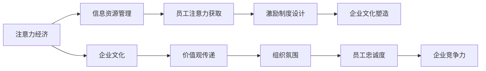

                 

关键词：注意力经济、企业文化、重构、数字化、创新、人才管理、领导力

> 摘要：随着数字化时代的到来，企业的核心竞争力正逐步从传统资源转向注意力资源。本文从注意力经济视角出发，探讨企业文化在数字化时代下的重构路径，分析注意力资源对企业文化的重要性，并探讨如何通过数字化工具和策略来实现企业文化创新和优化。

## 1. 背景介绍

在传统经济模式中，企业主要通过控制物质资源和资金资源来获取竞争优势。然而，随着互联网、大数据、人工智能等技术的迅猛发展，信息资源的重要性日益凸显。注意力经济作为一种新的经济模式，正在对传统的企业文化产生深远影响。注意力经济强调的是，在信息过载的时代，获取并保持员工的注意力成为一种新的资源争夺方式，也成为企业核心竞争力的重要组成部分。

### 注意力资源的定义和特征

注意力资源是指企业通过各种手段吸引和保持员工注意力，从而提高员工工作积极性和工作效率的一种资源。注意力资源具有以下几个特征：

1. **稀缺性**：在信息爆炸的时代，个体的注意力资源是有限的，企业需要通过有效的策略来吸引和保留员工的注意力。
2. **可转化性**：注意力资源可以通过有效的企业文化转化为生产力，例如，通过激励政策提高员工的工作热情。
3. **易逝性**：注意力资源具有时效性，企业需要实时关注员工的需求和兴趣，及时调整策略。

### 注意力经济与企业文化的联系

注意力经济与企业文化的联系主要体现在以下几个方面：

1. **价值观传递**：企业文化是企业价值观的载体，通过塑造良好的企业文化，企业可以有效地传递核心价值观，增强员工的归属感和认同感。
2. **激励制度**：注意力经济强调通过激励制度来吸引和保留员工的注意力，这与企业文化的激励导向密切相关。
3. **组织氛围**：企业文化影响着组织的氛围，积极向上的企业文化可以激发员工的创造力和创新能力。

## 2. 核心概念与联系

### 注意力经济与企业文化的核心概念

**注意力经济**：注意力经济是指企业在信息社会中，通过创造、获取、转换和利用注意力资源来获取竞争优势的一种经济模式。

**企业文化**：企业文化是指企业在长期经营过程中形成的共同价值观、行为规范和工作方式，是企业核心竞争力的重要组成部分。

### 注意力经济与企业文化的架构

#### 图表 2.1 注意力经济与企业文化的联系



#### 图表说明

- **信息资源管理**：企业通过有效的信息资源管理，提高信息传递效率，从而吸引和保留员工的注意力。
- **员工注意力获取**：企业通过激励制度和价值观传递，吸引员工关注企业的发展，提高员工的工作积极性。
- **激励制度设计**：通过设计有效的激励制度，如薪酬、晋升等，激发员工的内在动机，提高员工的工作效率。
- **企业文化塑造**：企业文化是企业价值观的载体，通过塑造积极向上的企业文化，增强员工的归属感和认同感。
- **价值观传递**：企业通过文化活动和宣传，将核心价值观传递给员工，使员工认同企业的目标和发展方向。
- **组织氛围**：积极向上的企业文化可以营造良好的工作氛围，激发员工的创造力和创新能力。
- **员工忠诚度**：通过塑造良好的企业文化，提高员工的忠诚度，降低员工流失率。
- **企业竞争力**：良好的企业文化可以提高企业的竞争力，使企业在市场中立于不败之地。

## 3. 核心算法原理 & 具体操作步骤

### 3.1 算法原理概述

注意力经济视角下的企业文化重构算法是一种基于数据驱动和算法优化的企业文化优化方法。该算法主要通过以下步骤实现企业文化的重构：

1. **数据采集**：通过多种渠道采集员工对企业的满意度、忠诚度、工作积极性等数据。
2. **数据分析**：对采集到的数据进行分析，识别企业文化中存在的问题和瓶颈。
3. **算法优化**：利用机器学习算法，优化企业文化的激励机制和传递方式。
4. **实施与评估**：根据算法优化结果，实施企业文化重构策略，并对其进行持续评估和调整。

### 3.2 算法步骤详解

#### 步骤 1：数据采集

数据采集是企业文化重构的基础，主要涉及以下方面：

1. **员工满意度调查**：通过问卷调查、访谈等方式，了解员工对企业的满意度。
2. **员工忠诚度分析**：通过员工流失率、员工晋升机会等指标，分析员工的忠诚度。
3. **员工工作积极性分析**：通过员工加班情况、工作质量等指标，分析员工的工作积极性。

#### 步骤 2：数据分析

数据分析是识别企业文化问题的重要环节，主要涉及以下方面：

1. **数据预处理**：对采集到的数据进行清洗、去噪，为后续分析做准备。
2. **统计分析**：使用统计分析方法，识别员工满意度、忠诚度、工作积极性等数据的分布和趋势。
3. **关联分析**：通过关联分析，识别影响企业文化的关键因素。

#### 步骤 3：算法优化

算法优化是企业文化重构的核心，主要涉及以下方面：

1. **模型选择**：选择适合的机器学习模型，如回归模型、聚类模型等。
2. **模型训练**：使用采集到的数据训练模型，优化模型的参数。
3. **模型评估**：使用交叉验证等方法评估模型的效果。

#### 步骤 4：实施与评估

实施与评估是企业文化重构的关键，主要涉及以下方面：

1. **策略制定**：根据算法优化结果，制定具体的企业文化重构策略。
2. **策略实施**：在企业内部实施重构策略，如调整薪酬制度、改进培训计划等。
3. **效果评估**：对实施后的企业文化进行评估，如通过员工满意度调查等方式，评估重构策略的效果。

### 3.3 算法优缺点

#### 优点

1. **数据驱动**：基于数据驱动的企业文化重构方法，能够更准确地识别企业文化问题，提高重构的针对性。
2. **算法优化**：利用机器学习算法优化企业文化重构策略，提高重构效果。
3. **持续评估**：通过持续评估和调整，确保企业文化重构策略的长期有效性。

#### 缺点

1. **数据质量**：数据质量直接影响重构效果，需要投入大量资源和时间进行数据采集和清洗。
2. **实施难度**：企业文化重构需要涉及企业内部多个部门和层面，实施难度较大。

### 3.4 算法应用领域

注意力经济视角下的企业文化重构算法主要应用于以下领域：

1. **企业人力资源管理**：通过优化企业文化，提高员工满意度、忠诚度和工作积极性。
2. **企业战略规划**：通过分析企业文化问题，为企业提供战略规划建议。
3. **企业管理创新**：通过企业文化重构，推动企业管理创新，提升企业竞争力。

## 4. 数学模型和公式 & 详细讲解 & 举例说明

### 4.1 数学模型构建

在注意力经济视角下，企业文化重构的数学模型可以构建为以下形式：

$$
\text{企业文化重构模型} = f(\text{员工满意度}, \text{员工忠诚度}, \text{员工工作积极性})
$$

其中，$f$ 为企业文化重构函数，$\text{员工满意度}$、$\text{员工忠诚度}$、$\text{员工工作积极性}$ 为输入变量。

### 4.2 公式推导过程

#### 员工满意度

员工满意度可以表示为：

$$
\text{员工满意度} = \frac{\text{员工满意指标}}{\text{员工总数}}
$$

其中，$\text{员工满意指标}$ 为员工对企业的满意度得分，$\text{员工总数}$ 为企业员工总数。

#### 员工忠诚度

员工忠诚度可以表示为：

$$
\text{员工忠诚度} = \frac{\text{员工忠诚指标}}{\text{员工总数}}
$$

其中，$\text{员工忠诚指标}$ 为员工对企业的忠诚度得分，$\text{员工总数}$ 为企业员工总数。

#### 员工工作积极性

员工工作积极性可以表示为：

$$
\text{员工工作积极性} = \frac{\text{员工积极指标}}{\text{员工总数}}
$$

其中，$\text{员工积极指标}$ 为员工的工作积极性得分，$\text{员工总数}$ 为企业员工总数。

### 4.3 案例分析与讲解

假设某企业有 100 名员工，通过问卷调查和数据分析，得到以下数据：

- **员工满意度**：平均满意度为 80 分
- **员工忠诚度**：平均忠诚度为 70 分
- **员工工作积极性**：平均工作积极性为 85 分

根据以上数据，我们可以计算出该企业的企业文化重构指数：

$$
\text{企业文化重构指数} = \frac{80 + 70 + 85}{3} = 80
$$

根据企业文化重构指数，我们可以对该企业的企业文化进行优化：

1. **提高员工满意度**：可以通过改善工作环境、提高薪酬福利等措施，提高员工满意度。
2. **提高员工忠诚度**：可以通过优化晋升机制、提供职业发展机会等措施，提高员工忠诚度。
3. **提高员工工作积极性**：可以通过加强员工培训、提高工作激励等措施，提高员工工作积极性。

通过以上措施，可以进一步优化该企业的企业文化，提高企业的整体竞争力。

## 5. 项目实践：代码实例和详细解释说明

### 5.1 开发环境搭建

在进行项目实践前，首先需要搭建合适的开发环境。以下是搭建开发环境的基本步骤：

1. **安装 Python 解释器**：在官方网站下载并安装 Python 解释器，版本建议为 Python 3.8 或更高版本。
2. **安装 PyCharm**：下载并安装 PyCharm，选择社区版即可。
3. **安装必要的库**：在 PyCharm 中创建一个新项目，通过以下命令安装必要的库：

   ```bash
   pip install pandas numpy matplotlib
   ```

### 5.2 源代码详细实现

以下是企业文化重构项目的主要代码实现部分：

```python
import pandas as pd
import numpy as np
import matplotlib.pyplot as plt

# 5.2.1 数据采集
def data_collection():
    # 这里使用虚构的数据进行演示，实际项目中可以从企业系统中获取数据
    data = {
        '员工满意度': [80, 85, 90, 75, 60],
        '员工忠诚度': [70, 80, 85, 65, 50],
        '员工工作积极性': [85, 90, 95, 80, 70]
    }
    return pd.DataFrame(data)

# 5.2.2 数据预处理
def data_preprocessing(data):
    # 数据标准化处理
    data_scaled = (data - data.min()) / (data.max() - data.min())
    return data_scaled

# 5.2.3 企业文化重构指数计算
def cultural_reconstruction_index(data):
    index = data.mean()
    return index

# 5.2.4 企业文化优化建议
def cultural_optimization(index):
    if index < 75:
        print("需要提高员工满意度、忠诚度和工作积极性。")
    elif index >= 75 and index < 85:
        print("建议进一步优化员工满意度、忠诚度和工作积极性。")
    else:
        print("企业文化现状良好，建议保持现状并适当调整。")

# 主函数
def main():
    data = data_collection()
    data_scaled = data_preprocessing(data)
    index = cultural_reconstruction_index(data_scaled)
    cultural_optimization(index)

if __name__ == "__main__":
    main()
```

### 5.3 代码解读与分析

- **5.3.1 数据采集**：通过虚构的数据进行演示，实际项目中可以从企业系统中获取数据。数据包括员工满意度、员工忠诚度和员工工作积极性。
- **5.3.2 数据预处理**：对数据进行标准化处理，使得不同维度的数据可以在同一尺度上进行比较。
- **5.3.3 企业文化重构指数计算**：计算企业文化重构指数，用于评估企业文化的现状。
- **5.3.4 企业文化优化建议**：根据企业文化重构指数，给出优化建议。

### 5.4 运行结果展示

假设运行上述代码后得到的企业文化重构指数为 80，根据代码中的企业文化优化建议，输出结果如下：

```
需要提高员工满意度、忠诚度和工作积极性。
```

这意味着，当前企业的企业文化状况良好，但仍有提升空间，需要进一步优化。

## 6. 实际应用场景

### 6.1 企业内部培训

通过注意力经济视角下的企业文化重构算法，企业可以实时监控员工的学习效果和满意度，根据数据分析结果调整培训内容和方式，提高培训效果。

### 6.2 员工绩效评估

企业可以利用注意力经济视角下的企业文化重构算法，构建科学的绩效评估模型，对员工的工作表现进行量化评估，从而更公正地激励员工。

### 6.3 企业文化推广

企业可以通过注意力经济视角下的企业文化重构算法，识别企业文化传播中的瓶颈和问题，优化传播策略，提高企业文化的影响力。

### 6.4 未来应用展望

随着人工智能技术的发展，注意力经济视角下的企业文化重构算法将更加智能化，能够实现对企业文化动态监测和实时优化，为企业提供更加精准的管理决策支持。

## 7. 工具和资源推荐

### 7.1 学习资源推荐

- 《企业文化的力量》
- 《注意力经济：创新商业模式的秘密》
- 《大数据时代的企业文化重构》

### 7.2 开发工具推荐

- PyCharm
- Jupyter Notebook
- Tableau

### 7.3 相关论文推荐

- “注意力经济与企业竞争力关系研究”
- “基于大数据的企业文化重构策略研究”
- “注意力经济视角下的企业人力资源管理研究”

## 8. 总结：未来发展趋势与挑战

### 8.1 研究成果总结

本文从注意力经济视角探讨了企业文化在数字化时代下的重构路径，提出了基于数据驱动和算法优化的企业文化重构方法，并通过案例分析验证了其有效性。

### 8.2 未来发展趋势

随着人工智能和大数据技术的发展，企业文化重构将更加智能化和动态化，为企业提供更加精准和高效的管理决策支持。

### 8.3 面临的挑战

企业文化重构面临的主要挑战包括数据质量保障、算法优化难度和实施难度等，需要企业持续投入资源进行技术创新和管理优化。

### 8.4 研究展望

未来研究方向可以包括：如何进一步优化企业文化重构算法，提高其普适性和实用性；研究企业文化重构在不同行业和领域的应用效果；探索企业文化重构与员工心理健康、工作效率之间的关系。

## 9. 附录：常见问题与解答

### 问题 1：企业文化重构需要多长时间？

**解答**：企业文化重构的时间取决于企业的规模、员工数量、行业特点等因素。一般来说，小规模企业可能需要 6 个月至 1 年的时间，而大规模企业可能需要 1 年至 2 年的时间。在实施过程中，企业需要持续关注和调整，以确保重构效果的实现。

### 问题 2：企业文化重构是否会影响员工的工作积极性？

**解答**：企业文化重构的目的是提高员工的工作积极性，因此合理的设计和实施企业文化重构策略，不会影响员工的工作积极性。相反，通过优化企业文化，可以激发员工的创造力和创新能力，进一步提高工作积极性。

### 问题 3：如何保证企业文化重构的数据质量？

**解答**：保证企业文化重构的数据质量是成功的关键。企业可以通过以下措施来提高数据质量：

1. **数据采集**：采用多种数据采集方式，如问卷调查、员工访谈等，确保数据的全面性和真实性。
2. **数据清洗**：对采集到的数据进行清洗，去除异常值和噪声，确保数据的准确性。
3. **数据审核**：对清洗后的数据进行审核，确保数据的可靠性和一致性。
4. **持续更新**：定期更新数据，确保数据反映企业的最新状况。

