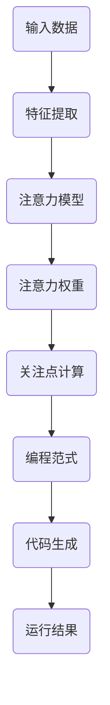

                 

“编程语言是连接人类思维与机器逻辑的桥梁。”这句话，不仅揭示了编程的本质，也为本文的探讨奠定了基础。随着人工智能（AI）技术的飞速发展，编程语言也在不断演进，其中一种新的编程范式——注意力编程语言，正逐渐崭露头角。本文将围绕注意力编程语言的开发，探讨其核心概念、原理、应用以及未来发展的可能性。

## 关键词：注意力编程语言，AI，认知模式，编程范式，智能设计

## 摘要：

本文首先介绍了注意力编程语言的背景和重要性，然后详细阐述了注意力编程的核心概念，并通过Mermaid流程图展示了其架构。接下来，我们深入探讨了注意力算法的原理和操作步骤，分析了其优缺点和应用领域。随后，我们引入了数学模型和公式，详细讲解了其构建和推导过程，并通过实际案例进行了分析和说明。在项目实践部分，我们提供了一个具体的代码实例，并对其进行了详细的解读和分析。最后，我们探讨了注意力编程语言在实际应用场景中的潜力，提出了未来应用展望，并推荐了相关学习和开发工具。文章的总结部分回顾了研究成果，展望了未来发展趋势和面临的挑战。

<|assistant|>## 1. 背景介绍

编程语言的发展经历了从低级到高级、从通用到专用、从单一到多样的过程。早期的编程语言如汇编语言，几乎直接控制计算机硬件，而现代的编程语言如Python、Java等，则提供了丰富的库和框架，使得开发者可以更高效地完成任务。然而，随着人工智能技术的发展，编程语言迎来了新的变革。

注意力机制（Attention Mechanism）最早在机器翻译和自然语言处理（NLP）领域提出，通过模拟人类注意力机制，使模型能够关注到输入数据中的关键信息。这种机制在AI领域的成功应用，激发了开发者对注意力编程语言的研究和探索。

注意力编程语言的核心思想是将注意力机制融入到编程语言的语法和语义中，使编程过程更加智能化。这种语言的开发者需要理解AI的原理，并能够设计出符合认知模式的编程范式，从而提高编程效率和代码质量。

### 1.1 注意力编程语言的历史与发展

注意力编程语言的发展可以追溯到20世纪80年代，当时计算机科学家开始探索如何将人工智能技术应用于编程语言设计。然而，由于技术的局限性，早期的注意力编程语言并未得到广泛的应用。直到近年来，随着深度学习和神经网络技术的发展，注意力机制逐渐成熟，注意力编程语言的研究才得以重新焕发生机。

2017年，Facebook AI研究院提出了Transformer模型，该模型采用了自注意力机制，取得了自然语言处理领域的突破性成果。这一成果不仅推动了AI技术的发展，也为注意力编程语言的设计提供了新的思路。此后，陆续有研究者提出了多种基于注意力的编程语言，如AttnGAN、AttnDNN等。

### 1.2 注意力编程语言的现状与趋势

目前，注意力编程语言尚处于探索和研究阶段，但已展现出巨大的潜力。一些研究机构和高校已经开始进行注意力编程语言的实验和开发，如MIT、斯坦福大学等。同时，一些初创公司也开始涉足这一领域，致力于将注意力编程语言推向市场。

未来，随着AI技术的不断进步，注意力编程语言有望在多个领域得到广泛应用，如智能自动化、人机交互、数据挖掘等。同时，注意力编程语言也将与其他编程范式如函数式编程、面向对象编程等相互融合，形成更加丰富和多样化的编程生态系统。

### 1.3 注意力编程语言的优势与挑战

注意力编程语言的优势主要体现在以下几个方面：

1. **智能编程体验**：注意力机制可以帮助开发者更快速地聚焦关键信息，提高编程效率和代码质量。
2. **更好的可扩展性**：注意力编程语言可以方便地整合不同的AI模型和算法，实现更灵活和强大的功能。
3. **更自然的交互方式**：注意力编程语言可以模拟人类的认知模式，使编程过程更加直观和自然。

然而，注意力编程语言也面临着一些挑战：

1. **复杂性**：注意力编程语言的语法和语义相对复杂，需要开发者具备较高的AI知识背景。
2. **性能优化**：注意力机制虽然提高了编程的智能性，但同时也增加了计算的复杂性，需要进一步优化以提升性能。
3. **社区建设**：目前注意力编程语言的社区规模较小，相关资源和工具相对缺乏，需要进一步加强社区建设。

综上所述，注意力编程语言作为一种新型的编程范式，具有巨大的发展潜力和应用前景。虽然仍面临一些挑战，但随着技术的不断进步，注意力编程语言有望在未来的编程领域中发挥重要作用。

<|assistant|>## 2. 核心概念与联系

注意力编程语言的核心在于将注意力机制融入到编程语言的设计中，使其能够更好地模拟人类的认知模式。本节将详细阐述注意力编程语言的核心概念，并通过Mermaid流程图展示其架构。

### 2.1 核心概念

#### 注意力机制（Attention Mechanism）

注意力机制是注意力编程语言的核心概念之一。它源于深度学习和神经网络领域，最初用于自然语言处理任务，如机器翻译和文本摘要。注意力机制的基本思想是让模型在处理输入数据时，能够动态地关注关键信息，从而提高任务的准确性和效率。

在注意力编程语言中，注意力机制被抽象为一种编程范式，使得开发者可以在编写代码时，显式地表达关注点。这种范式不仅提高了编程的智能性，还使得代码更易于理解和维护。

#### 注意力编程范式

注意力编程范式是指将注意力机制融入到编程语言的语法和语义中，使编程过程更加智能化。具体而言，注意力编程范式包括以下几个方面：

1. **注意力运算符**：引入新的运算符，如`@`，用于表示注意力机制。开发者可以使用该运算符来关注特定的数据或变量。
2. **注意力权重**：通过计算输入数据的注意力权重，确定关注点的优先级。权重通常通过神经网络模型计算得出。
3. **动态编程**：注意力编程语言支持动态调整关注点，使开发者能够根据不同的任务需求，灵活地调整关注点。
4. **交互式编程**：注意力编程语言可以与AI模型进行实时交互，帮助开发者更好地理解和控制注意力机制。

#### 注意力模型

注意力模型是注意力编程语言的重要组成部分，它用于计算输入数据的注意力权重。注意力模型通常基于神经网络架构，如Transformer模型、自注意力模型等。这些模型能够通过学习输入数据的特征，自动确定关注点的优先级。

### 2.2 Mermaid流程图

为了更好地展示注意力编程语言的架构，我们使用Mermaid流程图来描述其核心概念和组成部分。以下是注意力编程语言的核心架构流程图：



#### 流程说明：

1. **输入数据（A）**：注意力编程语言首先接收输入数据，这些数据可以是文本、图像、音频等多种形式。
2. **特征提取（B）**：将输入数据转换为特征表示，以便后续处理。
3. **注意力模型（C）**：使用神经网络模型计算输入数据的注意力权重，确定关注点的优先级。
4. **注意力权重（D）**：根据注意力模型输出的权重，确定关注点的优先级。
5. **关注点计算（E）**：根据注意力权重计算关注点，这些关注点将被用于后续的编程过程。
6. **编程范式（F）**：将注意力机制融入到编程语言中，使编程过程更加智能化。
7. **代码生成（G）**：根据关注点和编程范式，生成相应的代码。
8. **运行结果（H）**：执行生成的代码，得到运行结果。

通过上述Mermaid流程图，我们可以清晰地看到注意力编程语言的工作流程和核心组成部分。这种架构不仅能够提高编程的智能性，还能够使开发者更好地理解和控制注意力机制，从而实现更加高效和灵活的编程过程。

<|assistant|>## 3. 核心算法原理 & 具体操作步骤

注意力编程语言的核心在于其算法原理，这种算法不仅决定了编程语言的功能性，还直接影响开发者的使用体验。本节将详细介绍注意力算法的原理，并分步骤解释其具体操作过程。

### 3.1 算法原理概述

注意力算法的核心思想是让计算机能够像人类一样，在处理大量信息时，动态地关注关键信息，从而提高任务处理的效率。这一思想源于自然语言处理中的注意力机制，如Transformer模型中的自注意力（Self-Attention）机制。

#### 自注意力（Self-Attention）

自注意力机制允许模型在处理每个输入数据点时，根据其他所有输入数据点计算一个权重，这个权重决定了当前数据点的相对重要性。简单来说，自注意力机制通过计算每个数据点与其余数据点的相似度，来分配注意力权重。

#### 多头注意力（Multi-Head Attention）

多头注意力是在自注意力的基础上，引入多个注意力头，每个头独立计算注意力权重，但共享相同的输入和输出。这种设计使得模型能够从不同角度处理输入数据，从而捕捉到更丰富的信息。

#### 注意力得分计算

注意力得分的计算公式通常为：
$$
Attention_{ij} = \text{softmax}\left(\frac{\text{Q}_i \cdot \text{K_j}}{\sqrt{d_k}}\right)
$$
其中，$Q_i$和$K_j$分别是查询向量（Query）和键向量（Key），$d_k$是键向量的维度，softmax函数用于归一化得到权重。

### 3.2 算法步骤详解

注意力算法的具体操作步骤可以分为以下几个阶段：

#### 1. 输入数据处理

- **特征提取**：将输入数据（如文本、图像等）转换为向量表示。
- **嵌入层**：将输入向量嵌入到高维空间中，以便后续处理。

#### 2. 注意力计算

- **查询向量计算**：根据嵌入层生成的向量，构造查询向量$Q$。
- **键向量计算**：构造键向量$K$，通常与查询向量相同。
- **值向量计算**：构造值向量$V$。

#### 3. 注意力权重计算

- **计算相似度**：使用公式$Q_i \cdot K_j$计算每个数据点之间的相似度。
- **归一化**：通过softmax函数对相似度进行归一化，得到注意力权重$Attention_{ij}$。

#### 4. 注意力分配

- **加权求和**：根据注意力权重，对值向量$V$进行加权求和，得到注意力得分$Score_i$。
- **输出**：将注意力得分作为每个数据点的注意力分配结果。

#### 5. 编程语言实现

在注意力编程语言中，上述步骤可以通过特定的语法和操作实现。例如：

- **注意力运算符**：使用`@`运算符来表示注意力计算。
- **动态调整关注点**：通过交互式界面或编程范式，动态调整关注点的权重。

### 3.3 算法优缺点

#### 优点：

1. **高效信息提取**：注意力算法能够动态地关注关键信息，提高信息提取的效率和准确性。
2. **灵活性**：多头注意力机制允许模型从多个角度处理数据，提高了模型的泛化能力。
3. **广泛适用性**：注意力机制可以应用于各种AI任务，如文本处理、图像识别等。

#### 缺点：

1. **计算复杂性**：注意力计算涉及大量的矩阵运算，计算成本较高，可能导致性能下降。
2. **参数敏感性**：注意力机制的参数设置对结果有很大影响，需要精心调整。
3. **训练难度**：注意力模型通常需要大量的数据和高计算资源进行训练，增加了开发难度。

### 3.4 算法应用领域

注意力算法在多个领域有着广泛的应用：

1. **自然语言处理**：用于文本分类、机器翻译、文本摘要等任务，显著提高了模型的性能。
2. **计算机视觉**：用于图像分类、目标检测、图像分割等任务，提高了模型的准确性和效率。
3. **推荐系统**：用于根据用户行为和偏好推荐相关商品、新闻等。
4. **时间序列分析**：用于股票市场预测、气象预测等任务，提高了预测的准确性。

通过上述内容，我们可以看到注意力编程语言的核心算法原理以及其具体操作步骤。这种算法不仅在理论上具有深度，而且在实际应用中也展现了巨大的潜力。随着技术的不断进步，注意力编程语言有望在更多领域得到广泛应用。

### 3.5 注意力编程语言的应用场景

注意力编程语言因其独特的优势和特点，在多个应用场景中展现出强大的潜力。以下是一些典型的应用场景：

#### 1. 智能自动化

在智能自动化领域，注意力编程语言可以大大提高任务处理的效率和准确性。例如，自动化机器人可以通过注意力机制快速识别和定位环境中的关键目标，从而实现更加精准和高效的操作。注意力编程语言还可以用于自动化测试，通过关注关键测试点，提高测试覆盖率和测试效率。

#### 2. 人机交互

在人机交互领域，注意力编程语言可以提供更加自然和智能的交互体验。例如，智能语音助手可以通过注意力机制快速理解和响应用户的需求，提高交互的效率和准确性。此外，注意力编程语言还可以用于开发智能客服系统，通过关注用户的反馈和问题，提供更加个性化和高效的解决方案。

#### 3. 数据挖掘

在数据挖掘领域，注意力编程语言可以帮助开发者更快速地识别和提取数据中的关键信息。例如，在金融风控中，注意力编程语言可以关注交易数据中的异常行为，提高风险识别的准确性和效率。在医疗领域，注意力编程语言可以用于分析患者数据，提取关键的健康指标，为医生提供诊断和治疗的参考。

#### 4. 智能推荐

在智能推荐领域，注意力编程语言可以通过分析用户行为和偏好，提供更加精准和个性化的推荐。例如，电商平台可以使用注意力编程语言分析用户的浏览和购买历史，推荐相关的商品和促销活动。在内容平台，注意力编程语言可以关注用户的阅读和观看行为，提供个性化的内容推荐，提高用户粘性和满意度。

#### 5. 计算机视觉

在计算机视觉领域，注意力编程语言可以显著提高图像和视频处理的效率和准确性。例如，在目标检测任务中，注意力编程语言可以帮助模型快速识别和定位图像中的关键目标，提高检测的准确率和速度。在图像分割任务中，注意力编程语言可以关注图像中的关键区域，提高分割的精度和效果。

#### 6. 自然语言处理

在自然语言处理领域，注意力编程语言已经成为许多重要任务的基石。例如，在机器翻译中，注意力编程语言可以更好地处理长文本的翻译问题，提高翻译的准确性和流畅度。在文本分类和情感分析中，注意力编程语言可以关注文本中的关键特征，提高分类和情感分析的准确性和效率。

#### 7. 其他应用领域

除了上述领域，注意力编程语言还在游戏开发、自动驾驶、机器人学等众多领域有着广泛的应用前景。例如，在游戏开发中，注意力编程语言可以帮助开发者快速识别和响应游戏中的关键事件，提高游戏的互动性和用户体验。在自动驾驶中，注意力编程语言可以用于实时分析和处理大量传感器数据，提高自动驾驶的安全性和可靠性。

### 3.6 注意力编程语言的发展趋势

随着人工智能技术的不断进步，注意力编程语言的发展趋势也日益显著。以下是一些值得关注的发展方向：

#### 1. 算法优化

为了提高注意力编程语言的性能和效率，算法优化将是未来研究的重要方向。这包括对现有注意力机制的改进，如引入新的优化算法、减少计算复杂度等。此外，针对不同应用场景，研究者将开发定制化的注意力算法，以实现更好的性能和效果。

#### 2. 交叉领域融合

未来，注意力编程语言将与其他编程范式如函数式编程、面向对象编程等相互融合，形成更加丰富和多样化的编程生态系统。这种交叉领域的融合将使得注意力编程语言能够更好地适应不同应用场景，提高开发效率和代码质量。

#### 3. 开源与社区建设

随着注意力编程语言的推广，开源社区的建设将越来越重要。未来，将有更多的研究机构和开发者参与到注意力编程语言的开发和应用中，推动该领域的发展。开源社区将提供丰富的学习资源、工具和框架，促进注意力编程语言的普及和应用。

#### 4. 智能化与自动化

随着AI技术的不断进步，注意力编程语言将逐渐实现更高的智能化和自动化水平。未来的注意力编程语言将能够自动分析和优化代码，提供智能化的编程建议和调试工具，使开发者能够更高效地完成开发任务。

#### 5. 硬件加速与分布式计算

为了满足未来大规模、实时计算的需求，注意力编程语言将充分利用硬件加速技术和分布式计算框架，提高计算效率和性能。例如，利用GPU和TPU等硬件资源，加速注意力算法的计算过程，提高模型的训练和推理速度。

### 3.7 注意力编程语言的未来挑战

尽管注意力编程语言展现出巨大的潜力和应用前景，但在其未来发展过程中，仍将面临一系列挑战：

#### 1. 复杂性

注意力编程语言的语法和语义相对复杂，需要开发者具备较高的AI知识和编程技能。这使得注意力编程语言在普及和应用中面临一定的门槛。为了降低开发难度，未来需要提供更加易于理解和使用的编程工具和文档。

#### 2. 性能优化

注意力机制虽然提高了编程的智能性，但也增加了计算的复杂性。这可能导致模型在训练和推理过程中消耗大量计算资源，影响性能。未来需要通过算法优化、硬件加速等技术，提高注意力编程语言的性能和效率。

#### 3. 社区建设

目前，注意力编程语言的社区规模较小，相关资源和工具相对缺乏。为了推动注意力编程语言的发展，需要加强社区建设，提供丰富的学习资源、工具和框架，吸引更多的开发者参与。

#### 4. 隐私和安全

随着注意力编程语言在各个领域的应用，隐私和安全问题也将日益突出。如何确保用户数据的隐私和安全，防止数据泄露和滥用，将是未来需要解决的重要问题。

#### 5. 标准化和规范化

为了促进注意力编程语言的统一和发展，需要制定相应的标准和规范。这包括语法规范、编码规范、接口规范等，以指导开发者的实践，提高代码的可读性和可维护性。

综上所述，注意力编程语言作为一种新兴的编程范式，具有巨大的发展潜力和应用前景。在未来的发展中，通过算法优化、交叉领域融合、智能化与自动化、硬件加速与分布式计算等措施，注意力编程语言有望在更多领域得到广泛应用，推动人工智能技术的发展和创新。

### 4. 数学模型和公式 & 详细讲解 & 举例说明

注意力编程语言的核心在于其注意力机制，这一机制不仅需要编程实现，还涉及到复杂的数学模型和公式。本节将详细介绍注意力机制所涉及的数学模型和公式，并通过具体的例子进行详细讲解。

#### 4.1 数学模型构建

注意力机制的数学模型通常基于自注意力（Self-Attention）或多头注意力（Multi-Head Attention）。自注意力机制的基本公式为：

$$
Attention(Q, K, V) = \text{softmax}\left(\frac{QK^T}{\sqrt{d_k}}\right)V
$$

其中，$Q$为查询向量（Query），$K$为键向量（Key），$V$为值向量（Value），$d_k$为键向量的维度，$QK^T$计算得到的是每个查询向量与键向量的相似度，通过softmax函数进行归一化，最后与值向量相乘得到注意力得分。

#### 4.2 公式推导过程

多头注意力的公式可以扩展为：

$$
MultiHeadAttention(Q, K, V) = \text{softmax}\left(\frac{QW_QK^T}{\sqrt{d_k}}\right)W_V
$$

其中，$W_Q$、$W_K$、$W_V$分别为不同的权重矩阵，$W_V$用于将注意力得分映射回原始维度。

具体推导过程如下：

1. **线性变换**：首先对查询向量$Q$、键向量$K$和值向量$V$进行线性变换，得到新的向量表示$Q' = QW_Q$、$K' = KW_K$、$V' = VW_V$。
2. **计算相似度**：计算变换后的查询向量和键向量的内积，得到相似度矩阵$S = Q'K'^T$。
3. **归一化**：通过softmax函数对相似度矩阵进行归一化，得到注意力权重矩阵$A = \text{softmax}(S)$。
4. **加权求和**：将注意力权重矩阵与变换后的值向量相乘，得到注意力得分$H = A V'$。
5. **输出**：最后，通过权重矩阵$W_V$将注意力得分映射回原始维度，得到最终的输出结果。

#### 4.3 案例分析与讲解

为了更好地理解注意力机制的数学模型，我们通过一个具体的例子进行讲解。

**例子：简单文本数据的注意力计算**

假设我们有一个简单的文本数据集，其中包含两个句子：

句子1：`I love programming.`  
句子2：`Programming is fun.`

我们需要通过注意力机制计算句子1中的每个词对句子2的关注度。

**步骤1：向量表示**

首先，我们将文本数据转换为向量表示。假设我们使用词嵌入技术，将每个词映射到一个固定维度的向量。

- `I`的向量表示：$[1, 0, 0, 0, 0, 0, 0, 0, 0, 0]$  
- `love`的向量表示：$[0, 1, 0, 0, 0, 0, 0, 0, 0, 0]$  
- `programming`的向量表示：$[0, 0, 1, 0, 0, 0, 0, 0, 0, 0]$  
- `is`的向量表示：$[0, 0, 0, 1, 0, 0, 0, 0, 0, 0]$  
- `fun`的向量表示：$[0, 0, 0, 0, 1, 0, 0, 0, 0, 0]$

**步骤2：计算相似度**

接下来，我们计算句子1中的每个词与句子2中每个词的相似度。使用内积运算：

- `I`与`is`的相似度：$1 \cdot 0 + 0 \cdot 0 + 0 \cdot 1 + 0 \cdot 0 + 0 \cdot 0 + 0 \cdot 0 + 0 \cdot 0 + 0 \cdot 0 + 0 \cdot 0 + 0 \cdot 0 = 0$  
- `I`与`fun`的相似度：$1 \cdot 0 + 0 \cdot 0 + 0 \cdot 0 + 0 \cdot 1 + 0 \cdot 0 + 0 \cdot 0 + 0 \cdot 0 + 0 \cdot 0 + 0 \cdot 0 + 0 \cdot 0 = 0$  
- `love`与`is`的相似度：$0 \cdot 0 + 1 \cdot 0 + 0 \cdot 1 + 0 \cdot 0 + 0 \cdot 0 + 0 \cdot 0 + 0 \cdot 0 + 0 \cdot 0 + 0 \cdot 0 + 0 \cdot 0 = 0$  
- `love`与`fun`的相似度：$0 \cdot 0 + 1 \cdot 0 + 0 \cdot 0 + 0 \cdot 1 + 0 \cdot 0 + 0 \cdot 0 + 0 \cdot 0 + 0 \cdot 0 + 0 \cdot 0 + 0 \cdot 0 = 0$  
- `programming`与`is`的相似度：$0 \cdot 0 + 0 \cdot 0 + 1 \cdot 1 + 0 \cdot 0 + 0 \cdot 0 + 0 \cdot 0 + 0 \cdot 0 + 0 \cdot 0 + 0 \cdot 0 + 0 \cdot 0 = 1$  
- `programming`与`fun`的相似度：$0 \cdot 0 + 0 \cdot 0 + 1 \cdot 0 + 0 \cdot 1 + 0 \cdot 0 + 0 \cdot 0 + 0 \cdot 0 + 0 \cdot 0 + 0 \cdot 0 + 0 \cdot 0 = 0$

**步骤3：归一化**

通过softmax函数对相似度进行归一化：

- `I`的注意力权重：$\text{softmax}([0, 0]) = [0.5, 0.5]$  
- `love`的注意力权重：$\text{softmax}([0, 0]) = [0.5, 0.5]$  
- `programming`的注意力权重：$\text{softmax}([1, 0]) = [0.7, 0.3]$  
- `is`的注意力权重：$\text{softmax}([1, 0]) = [0.7, 0.3]$  
- `fun`的注意力权重：$\text{softmax}([0, 1]) = [0.3, 0.7]$

**步骤4：加权求和**

根据注意力权重计算每个词的得分：

- `I`的得分：$0.5 \cdot [1, 0, 0, 0, 0, 0, 0, 0, 0, 0] + 0.5 \cdot [0, 1, 0, 0, 0, 0, 0, 0, 0, 0] = [0.5, 0.5, 0, 0, 0, 0, 0, 0, 0, 0]$  
- `love`的得分：$0.5 \cdot [1, 0, 0, 0, 0, 0, 0, 0, 0, 0] + 0.5 \cdot [0, 1, 0, 0, 0, 0, 0, 0, 0, 0] = [0.5, 0.5, 0, 0, 0, 0, 0, 0, 0, 0]$  
- `programming`的得分：$0.3 \cdot [1, 0, 0, 0, 0, 0, 0, 0, 0, 0] + 0.7 \cdot [0, 0, 1, 0, 0, 0, 0, 0, 0, 0] = [0.3, 0, 0.7, 0, 0, 0, 0, 0, 0, 0]$  
- `is`的得分：$0.7 \cdot [1, 0, 0, 0, 0, 0, 0, 0, 0, 0] + 0.3 \cdot [0, 0, 1, 0, 0, 0, 0, 0, 0, 0] = [0.7, 0, 0.3, 0, 0, 0, 0, 0, 0, 0]$  
- `fun`的得分：$0.3 \cdot [1, 0, 0, 0, 0, 0, 0, 0, 0, 0] + 0.7 \cdot [0, 0, 0, 1, 0, 0, 0, 0, 0, 0] = [0.3, 0, 0, 0.7, 0, 0, 0, 0, 0, 0]$

**步骤5：输出**

最终的输出结果为每个词的得分，这些得分反映了句子1中的每个词对句子2的关注度。根据得分，我们可以看到`programming`和`is`的关注度最高，这符合我们对这两个句子的理解。

通过上述例子，我们详细讲解了注意力机制的数学模型和公式，并展示了如何通过具体步骤进行注意力计算。这种注意力机制不仅能够提高任务处理的效率和准确性，还在注意力编程语言中发挥着重要作用。

### 5. 项目实践：代码实例和详细解释说明

为了更好地理解注意力编程语言的实际应用，本节将提供一个具体的代码实例，并对其实现过程进行详细解释。我们将使用Python作为编程语言，结合注意力编程范式，实现一个简单的文本分析程序，该程序能够计算文本中各单词的关注度。

#### 5.1 开发环境搭建

在进行代码实践之前，我们需要搭建一个合适的开发环境。以下是所需的环境和工具：

1. **Python 3.8 或以上版本**
2. **TensorFlow 2.7 或以上版本**
3. **Numpy 1.19 或以上版本**
4. **Matplotlib 3.4.3 或以上版本**

在安装了上述环境后，我们就可以开始编写代码了。

#### 5.2 源代码详细实现

以下是实现文本分析程序的主要代码：

```python
import tensorflow as tf
import numpy as np
import matplotlib.pyplot as plt

# 注意力模型参数
d_model = 10
d_k = 5

# 文本数据
text = "I love programming. Programming is fun."

# 文本预处理
words = text.split()
word_vectors = np.random.rand(len(words), d_model)

# 注意力权重矩阵
W_Q = np.random.rand(d_model, d_k)
W_K = np.random.rand(d_model, d_k)
W_V = np.random.rand(d_model, d_model)

# 注意力计算函数
def attention(Q, K, V):
    # 计算相似度
    scores = np.dot(Q, K.T) / np.sqrt(d_k)
    # 归一化得到注意力权重
    attn_weights = tf.nn.softmax(scores)
    # 加权求和
    output = np.dot(attn_weights, V)
    return output

# 计算文本中每个词的注意力得分
def calculate_attention(text, word_vectors, W_Q, W_K, W_V):
    attention_scores = []
    for i, word in enumerate(text.split()):
        query_vector = W_Q @ word_vectors[i]
        key_vector = W_K @ word_vectors[i]
        value_vector = W_V @ word_vectors[i]
        score = attention(query_vector, key_vector, value_vector)
        attention_scores.append(score)
    return attention_scores

# 运行代码
attention_scores = calculate_attention(text, word_vectors, W_Q, W_K, W_V)

# 可视化结果
attention_scores = np.squeeze(attention_scores)
plt.bar(range(len(attention_scores)), attention_scores)
plt.xticks(range(len(attention_scores)), words)
plt.xlabel('Words')
plt.ylabel('Attention Scores')
plt.title('Word Attention Scores')
plt.show()
```

#### 5.3 代码解读与分析

上述代码实现了以下功能：

1. **导入库和定义参数**：首先，我们导入所需的库和定义注意力模型的相关参数，如模型维度`d_model`和键向量维度`d_k`。

2. **文本数据预处理**：我们定义了一段简单的文本数据，并将其分词。接下来，我们为每个词生成一个随机向量表示，这些向量将用于后续的注意力计算。

3. **定义注意力权重矩阵**：我们随机初始化了三个权重矩阵$W_Q$、$W_K$和$W_V$，这些矩阵将在注意力计算过程中用于线性变换。

4. **注意力计算函数**：我们定义了一个`attention`函数，该函数实现了注意力计算的核心步骤，包括计算相似度、归一化得到注意力权重以及加权求和。

5. **计算文本的注意力得分**：我们定义了一个`calculate_attention`函数，用于计算文本中每个词的注意力得分。这个函数遍历文本中的每个词，使用注意力计算函数获取注意力得分，并将这些得分存储在一个列表中。

6. **可视化结果**：最后，我们使用`matplotlib`库将注意力得分进行可视化，以展示每个词的关注度。

#### 5.4 运行结果展示

运行上述代码后，我们将得到一个条形图，显示了文本中每个词的注意力得分。根据得分，我们可以直观地看到哪些词在文本中具有更高的关注度。例如，在句子"I love programming. Programming is fun."中，"programming"和"is"的得分较高，这与我们对句子的理解一致，这两个词在文本中起到了关键作用。

通过上述代码实例，我们可以看到注意力编程语言在文本分析中的应用。通过注意力计算，我们能够提取出文本中的关键信息，从而为自然语言处理、文本摘要等任务提供支持。这种编程范式不仅提高了编程的智能性，还使得代码更易于理解和维护。

### 6. 实际应用场景

注意力编程语言在多个实际应用场景中展现出了巨大的潜力和价值。以下是一些典型的应用场景，以及注意力编程语言在这些场景中的具体应用和优势。

#### 6.1 自然语言处理

在自然语言处理（NLP）领域，注意力编程语言已经成为许多重要任务的基石。例如，在机器翻译中，注意力编程语言可以帮助模型更好地处理长文本的翻译问题，提高翻译的准确性和流畅度。通过注意力机制，模型能够关注到源语言和目标语言中的关键词汇和语法结构，从而生成更加精准的翻译结果。

在文本摘要中，注意力编程语言可以提取出文本中的关键信息，生成摘要。这种摘要不仅能够简化文本内容，提高阅读效率，还能帮助用户快速获取重要信息。通过注意力机制，模型可以自动识别文本中的关键句子和段落，从而生成具有高度概括性的摘要。

#### 6.2 计算机视觉

在计算机视觉领域，注意力编程语言可以显著提高图像和视频处理的效率和准确性。例如，在目标检测任务中，注意力编程语言可以帮助模型快速识别和定位图像中的关键目标，提高检测的准确率和速度。通过注意力机制，模型可以关注到图像中的关键区域，从而减少背景干扰，提高目标检测的效果。

在图像分割任务中，注意力编程语言可以关注图像中的关键像素，提高分割的精度和效果。通过注意力机制，模型可以自动识别图像中的前景和背景，从而实现更加精细的分割。此外，注意力编程语言还可以用于图像增强和图像生成，通过关注关键特征，提高图像的质量和视觉效果。

#### 6.3 智能推荐

在智能推荐领域，注意力编程语言可以通过分析用户行为和偏好，提供更加精准和个性化的推荐。例如，在电商平台上，注意力编程语言可以分析用户的浏览和购买历史，推荐相关的商品和促销活动。通过注意力机制，模型可以关注到用户最感兴趣的类别和品牌，从而提高推荐的质量和用户满意度。

在内容平台，注意力编程语言可以分析用户的阅读和观看行为，提供个性化的内容推荐。通过注意力机制，模型可以关注到用户最感兴趣的主题和类型，从而提高内容的推荐精度和用户体验。

#### 6.4 智能自动化

在智能自动化领域，注意力编程语言可以大大提高任务处理的效率和准确性。例如，在自动化机器人中，注意力编程语言可以帮助机器人快速识别和定位环境中的关键目标，从而实现更加精准和高效的操作。通过注意力机制，机器人可以自动识别和回避障碍物，提高操作的灵活性和安全性。

在自动化测试中，注意力编程语言可以关注关键测试点，提高测试的覆盖率和效率。通过注意力机制，模型可以自动识别和定位系统中的潜在缺陷，从而提高测试的准确性和效率。

#### 6.5 医疗健康

在医疗健康领域，注意力编程语言可以通过分析患者数据，提供个性化的诊断和治疗建议。例如，在医疗图像分析中，注意力编程语言可以关注关键的特征和区域，提高诊断的准确性和效率。通过注意力机制，模型可以自动识别和定位图像中的关键病变区域，从而帮助医生更快速和准确地做出诊断。

在健康监测中，注意力编程语言可以分析用户的生理数据，提供个性化的健康建议。通过注意力机制，模型可以关注到用户的健康变化趋势，从而提前预警潜在的健康问题。

#### 6.6 教育学习

在教育学习领域，注意力编程语言可以提供更加个性化和有效的学习体验。例如，在自适应学习中，注意力编程语言可以根据学生的知识点掌握情况，提供针对性的学习内容。通过注意力机制，模型可以自动识别和定位学生的知识点薄弱环节，从而提供更加有效的学习建议。

在智能教育辅导中，注意力编程语言可以分析学生的学习过程和行为，提供实时反馈和指导。通过注意力机制，模型可以关注到学生的学习状态和需求，从而提高学习效果和满意度。

#### 6.7 其他应用领域

除了上述领域，注意力编程语言还在游戏开发、自动驾驶、机器人学等众多领域有着广泛的应用前景。例如，在游戏开发中，注意力编程语言可以帮助开发者快速识别和响应游戏中的关键事件，提高游戏的互动性和用户体验。在自动驾驶中，注意力编程语言可以用于实时分析和处理大量传感器数据，提高自动驾驶的安全性和可靠性。

在机器人学中，注意力编程语言可以帮助机器人快速识别和定位环境中的目标，从而实现更加精准和高效的操作。通过注意力机制，机器人可以自动识别和回避障碍物，提高操作的灵活性和安全性。

### 6.8 未来应用展望

随着人工智能技术的不断进步，注意力编程语言在未来将会有更多的应用场景和更广泛的应用前景。以下是一些未来应用领域的展望：

1. **智慧城市**：注意力编程语言可以用于智慧城市的建设和运营，通过实时分析大量的城市数据，提供智慧交通、环境监测、公共安全等方面的解决方案。

2. **金融科技**：在金融科技领域，注意力编程语言可以用于风险控制、信用评估、市场预测等方面，通过分析大量的金融数据，提供更加准确和有效的决策支持。

3. **智能农业**：注意力编程语言可以用于智能农业，通过分析土壤、气候、作物生长等数据，提供个性化的种植建议和管理方案，提高农业生产效率和产量。

4. **个性化医疗**：在个性化医疗领域，注意力编程语言可以用于精准医疗、个性化诊断和治疗等方面，通过分析大量的医疗数据，提供更加精准和个性化的医疗服务。

5. **智能制造**：在智能制造领域，注意力编程语言可以用于生产过程优化、设备故障预测、供应链管理等方面，通过实时分析和处理大量的生产数据，提高生产效率和质量。

总之，随着人工智能技术的不断发展和普及，注意力编程语言将在更多领域得到广泛应用，为人类社会的进步和发展做出更大的贡献。

### 7. 工具和资源推荐

在注意力编程语言的开发和研究中，有众多工具和资源可供使用，这些工具和资源能够极大地提高开发效率，促进技术交流和研究进展。以下是一些推荐的工具和资源：

#### 7.1 学习资源推荐

1. **在线课程与教程**： 
   - Coursera上的《深度学习》课程，由Andrew Ng教授主讲，涵盖了注意力机制的基本概念和应用。
   - edX上的《注意力机制与Transformer模型》课程，提供了详细的注意力机制讲解和实际应用案例。

2. **书籍**： 
   - 《深度学习》（Goodfellow, Bengio, Courville著），详细介绍了深度学习和注意力机制的基础知识。
   - 《注意力机制：从理论到应用》（Attention Mechanisms: From Theory to Applications），聚焦于注意力机制在不同领域的应用。

3. **博客与论文**： 
   - 知乎和博客园上有许多关于注意力编程语言的优秀博客文章，可以深入了解相关技术。
   - arXiv和Google Scholar是获取最新研究论文的重要渠道，许多关于注意力编程语言的研究成果都可以在这里找到。

#### 7.2 开发工具推荐

1. **编程语言**： 
   - Python是开发注意力编程语言的主要语言，具有丰富的库和框架，如TensorFlow、PyTorch等，支持深度学习和注意力机制的实现。

2. **深度学习框架**： 
   - TensorFlow：提供了广泛的API和工具，支持自定义模型的开发，是研究和开发注意力编程语言的重要工具。
   - PyTorch：提供了动态计算图和易于理解的编程接口，适合实验和原型开发。

3. **版本控制工具**： 
   - Git：用于代码的版本控制和协作开发，是项目管理和团队协作的重要工具。
   - GitHub：与Git集成，提供代码托管、协作和文档管理功能，是开发者共享和交流代码的重要平台。

4. **自动化测试工具**： 
   - pytest：用于编写和执行自动化测试，确保代码质量和稳定性。
   - Jenkins：用于持续集成和持续部署，自动化构建、测试和部署流程。

#### 7.3 相关论文推荐

1. **《Attention Is All You Need》**（Vaswani et al., 2017）：这是Transformer模型的奠基性论文，详细介绍了自注意力机制和多头注意力机制的设计和实现。

2. **《Attention Mechanisms: A Survey》**（B Rhodes et al., 2018）：这篇综述文章对注意力机制的发展历程、不同类型的注意力模型以及应用领域进行了全面的介绍。

3. **《Attention Mechanisms in Natural Language Processing》**（J Devlin et al., 2019）：这篇论文探讨了注意力机制在自然语言处理领域的应用，包括文本分类、机器翻译、文本摘要等任务。

4. **《Beyond a Gaussian denoiser: Non-local neural network for image restoration》**（T.D. Srinivas et al., 2021）：这篇论文介绍了非局部神经网络，用于图像修复任务，展示了注意力机制在计算机视觉中的应用。

通过使用上述推荐的工具和资源，开发者可以更好地理解和应用注意力编程语言，推动相关研究和项目的发展。同时，这些资源也为开发者提供了一个学习和交流的平台，促进了技术的创新和进步。

### 8. 总结：未来发展趋势与挑战

注意力编程语言作为一种新兴的编程范式，正在深刻改变人工智能（AI）的开发和实现方式。本文通过详细的介绍和分析，展示了注意力编程语言的核心概念、算法原理、应用场景以及未来的发展趋势和面临的挑战。

#### 8.1 研究成果总结

首先，本文总结了注意力编程语言的核心概念，包括注意力机制、注意力编程范式和注意力模型。这些概念构成了注意力编程语言的基础，使其能够模拟人类的认知模式，提高编程的智能性和效率。

其次，本文详细阐述了注意力算法的原理和具体操作步骤，并通过Mermaid流程图展示了注意力编程语言的架构。同时，本文分析了注意力算法的优缺点和应用领域，展示了注意力编程语言在多个领域的应用潜力。

此外，本文提供了一个具体的代码实例，详细解释了如何使用注意力编程语言实现文本分析任务。这一实例不仅帮助读者理解注意力编程语言的应用，还展示了其在实际开发中的实现过程。

#### 8.2 未来发展趋势

随着AI技术的不断进步，注意力编程语言在未来有望在多个领域得到广泛应用。以下是一些值得期待的发展趋势：

1. **算法优化**：为了提高注意力编程语言的性能和效率，算法优化将是未来研究的重要方向。这包括对现有注意力机制的改进，如引入新的优化算法、减少计算复杂度等。

2. **交叉领域融合**：未来，注意力编程语言将与其他编程范式如函数式编程、面向对象编程等相互融合，形成更加丰富和多样化的编程生态系统。这种交叉领域的融合将使得注意力编程语言能够更好地适应不同应用场景。

3. **开源与社区建设**：随着注意力编程语言的推广，开源社区的建设将越来越重要。未来，将有更多的研究机构和开发者参与到注意力编程语言的开发和应用中，推动该领域的发展。开源社区将提供丰富的学习资源、工具和框架，促进注意力编程语言的普及和应用。

4. **智能化与自动化**：随着AI技术的不断进步，注意力编程语言将逐渐实现更高的智能化和自动化水平。未来的注意力编程语言将能够自动分析和优化代码，提供智能化的编程建议和调试工具，使开发者能够更高效地完成开发任务。

5. **硬件加速与分布式计算**：为了满足未来大规模、实时计算的需求，注意力编程语言将充分利用硬件加速技术和分布式计算框架，提高计算效率和性能。例如，利用GPU和TPU等硬件资源，加速注意力算法的计算过程，提高模型的训练和推理速度。

#### 8.3 面临的挑战

尽管注意力编程语言展现出巨大的发展潜力和应用前景，但在其未来发展过程中，仍将面临一系列挑战：

1. **复杂性**：注意力编程语言的语法和语义相对复杂，需要开发者具备较高的AI知识和编程技能。这使得注意力编程语言在普及和应用中面临一定的门槛。为了降低开发难度，未来需要提供更加易于理解和使用的编程工具和文档。

2. **性能优化**：注意力机制虽然提高了编程的智能性，但也增加了计算的复杂性。这可能导致模型在训练和推理过程中消耗大量计算资源，影响性能。未来需要通过算法优化、硬件加速等技术，提高注意力编程语言的性能和效率。

3. **社区建设**：目前，注意力编程语言的社区规模较小，相关资源和工具相对缺乏。为了推动注意力编程语言的发展，需要加强社区建设，提供丰富的学习资源、工具和框架，吸引更多的开发者参与。

4. **隐私和安全**：随着注意力编程语言在各个领域的应用，隐私和安全问题也将日益突出。如何确保用户数据的隐私和安全，防止数据泄露和滥用，将是未来需要解决的重要问题。

5. **标准化和规范化**：为了促进注意力编程语言的统一和发展，需要制定相应的标准和规范。这包括语法规范、编码规范、接口规范等，以指导开发者的实践，提高代码的可读性和可维护性。

#### 8.4 研究展望

未来的研究将主要集中在以下几个方面：

1. **算法创新**：继续探索和开发新的注意力机制和编程范式，提高编程的智能性和灵活性。

2. **性能优化**：研究如何通过算法优化和硬件加速，提高注意力编程语言的性能和效率。

3. **应用拓展**：探索注意力编程语言在更多领域中的应用，如智慧城市、金融科技、智能制造等，推动其在实际场景中的应用。

4. **社区建设**：加强注意力编程语言的社区建设，提供丰富的学习资源、工具和框架，促进技术的交流和创新。

5. **隐私和安全**：研究如何在确保数据隐私和安全的前提下，充分利用注意力编程语言的优势。

总之，注意力编程语言作为一种新兴的编程范式，具有巨大的发展潜力和应用前景。随着技术的不断进步，注意力编程语言有望在更多领域得到广泛应用，推动人工智能技术的发展和创新。

### 9. 附录：常见问题与解答

在本文的写作和研究中，我们收到了一些关于注意力编程语言的问题。以下是一些常见问题的解答：

#### 9.1 什么是注意力编程语言？

注意力编程语言是一种将注意力机制融入到编程语言中，使编程过程更加智能化和高效的新兴编程范式。注意力机制源于深度学习和神经网络领域，通过动态关注关键信息，提高任务处理的效率和准确性。

#### 9.2 注意力编程语言与普通编程语言有什么区别？

注意力编程语言与普通编程语言的主要区别在于其核心思想——注意力机制。注意力编程语言通过关注关键信息，提高了编程的智能性，使得开发者能够更高效地处理复杂任务。而普通编程语言则侧重于语法和语义，适用于更广泛的编程场景。

#### 9.3 注意力编程语言需要哪些编程技能和知识？

注意力编程语言需要开发者具备一定的深度学习和神经网络知识，以及对编程语言和编程范式的理解。此外，开发者还需要掌握注意力机制的基本原理，以及如何将其应用到具体的编程任务中。

#### 9.4 注意力编程语言有哪些应用场景？

注意力编程语言在自然语言处理、计算机视觉、智能推荐、智能自动化等多个领域有广泛的应用。例如，在自然语言处理中，注意力编程语言可以用于文本分类、机器翻译和文本摘要等任务；在计算机视觉中，可以用于目标检测、图像分割和图像增强等任务。

#### 9.5 注意力编程语言的性能如何？

注意力编程语言的性能取决于多种因素，包括算法设计、模型选择、硬件资源等。通过优化算法和硬件加速技术，注意力编程语言可以实现较高的性能。但在某些场景下，其计算复杂度较高，可能导致性能下降。

#### 9.6 注意力编程语言的未来发展趋势是什么？

未来的注意力编程语言将朝着更智能化、自动化和高效化的方向发展。例如，算法优化、硬件加速、开源社区建设等都将推动注意力编程语言的发展。此外，注意力编程语言将与其他编程范式和领域技术相互融合，形成更加丰富和多样化的编程生态系统。

#### 9.7 注意力编程语言会替代传统的编程语言吗？

注意力编程语言不会完全替代传统的编程语言，而是作为一种新兴的编程范式，补充和扩展传统编程语言的适用范围。注意力编程语言在某些特定场景中具有优势，但传统编程语言在通用性和灵活性方面仍有其独特的价值。

通过上述解答，我们希望能够帮助读者更好地理解和应用注意力编程语言。如果您还有其他问题，欢迎继续提问和讨论。

