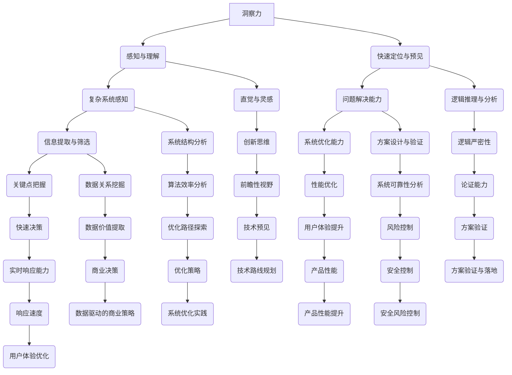

                 

### 引言 Introduction

在计算机科学和技术领域，洞察力和分析能力是两种至关重要的认知技能。它们不仅在个人职业发展中起到关键作用，而且对于整个行业的发展和创新也具有重要意义。然而，这两种能力往往被混淆，甚至有时被误解。洞察力是一种敏锐的感知力和快速的理解能力，它帮助我们在纷繁复杂的信息中迅速抓住本质，而分析能力则是通过逻辑推理和系统分析，逐步揭示问题背后的规律和解决方案。

本文将深入探讨洞察力与分析能力的本质区别，并通过具体的例子和案例，展示它们在计算机科学和技术中的应用。我们将通过以下章节，逐步揭开这两种能力的神秘面纱：

1. **背景介绍**：介绍洞察力和分析能力的定义、重要性以及它们在计算机科学中的重要性。
2. **核心概念与联系**：使用Mermaid流程图展示核心概念及其相互联系。
3. **核心算法原理 & 具体操作步骤**：详细探讨一种核心算法，展示其原理、操作步骤及优缺点。
4. **数学模型和公式 & 详细讲解 & 举例说明**：介绍数学模型和公式，并加以详细讲解和案例分析。
5. **项目实践：代码实例和详细解释说明**：提供实际项目中的代码实例，详细解释其实现过程。
6. **实际应用场景**：探讨这些能力在计算机科学和技术领域的具体应用。
7. **未来应用展望**：展望未来在这些领域的发展趋势和应用前景。
8. **工具和资源推荐**：推荐相关的学习资源、开发工具和论文。
9. **总结：未来发展趋势与挑战**：总结研究成果，展望未来的发展趋势和面临的挑战。
10. **附录：常见问题与解答**：解答读者可能关心的常见问题。

通过这篇文章，我们希望读者能够对洞察力和分析能力有更深刻的理解，并能够在实践中更好地运用这些能力，为计算机科学和技术的发展做出贡献。

---

## 1. 背景介绍

### 定义和重要性

**洞察力**，顾名思义，是指能够深入理解事物本质、洞察复杂现象的能力。在计算机科学中，洞察力体现在对复杂系统结构的感知、对问题快速定位和解决方案的预见上。一个具有强大洞察力的人，能够在短时间内从大量信息中提取关键点，对系统运行中的异常进行精准判断，从而快速找到问题的根源和解决方案。

**分析能力**，则是指通过逻辑推理、逐步拆解和系统化分析，从复杂的现象中找出规律和关系的能力。在计算机科学中，分析能力体现在对算法和系统的深入理解、对性能瓶颈的分析和优化上。一个具有强大分析能力的人，能够通过细致入微的分析，逐步揭示复杂系统的工作机制，找出优化空间，从而提升系统的效率和性能。

这两种能力在计算机科学中都非常重要。洞察力帮助开发者快速理解复杂问题，发现潜在的技术难题，从而提出创新的解决方案。而分析能力则确保这些解决方案是合理和可行的，能够通过细致的逻辑推理和实验验证，最终在实际系统中得到应用。

### 历史背景和演变

计算机科学的发展历程，可以看作是洞察力和分析能力不断融合和提升的过程。早期的计算机科学家，如艾伦·图灵，凭借其卓越的洞察力，提出了图灵机的概念，为现代计算机科学奠定了理论基础。而随后的计算机科学家，如约翰·冯·诺依曼，则通过其强大的分析能力，提出了存储程序计算机的概念，彻底改变了计算机的设计和运行方式。

随着计算机技术的不断演进，新的算法和工具不断涌现，对开发者的洞察力和分析能力提出了更高的要求。从传统的编程语言，到现代的分布式计算和大数据处理，再到人工智能和机器学习，每一个阶段的发展都离不开对复杂系统的深刻洞察和细致的分析。

### 当前现状

在当前的计算机科学和技术领域，洞察力和分析能力依然是最宝贵的资源之一。随着互联网的普及和大数据时代的到来，数据量和复杂度急剧增加，传统的分析方法和工具已经难以应对。这就需要开发者具备更强的洞察力，能够从海量数据中发现有价值的信息和规律。同时，分析能力也变得尤为重要，只有通过深入的逻辑分析和系统优化，才能从这些数据中提取出真正的价值。

### 在计算机科学中的重要性

在计算机科学中，洞察力和分析能力的重要性体现在以下几个方面：

1. **创新与突破**：强大的洞察力可以帮助开发者预见技术的发展趋势，发现新的应用场景，推动技术的创新和突破。
2. **问题解决**：面对复杂的问题和挑战，洞察力能够帮助开发者快速找到问题的症结，提出有效的解决方案。
3. **系统优化**：通过深入的分析能力，开发者可以优化系统的性能和效率，提高用户体验。
4. **团队协作**：洞察力和分析能力强大的开发者，能够更好地与团队成员沟通和协作，共同解决问题。

总之，洞察力和分析能力不仅是计算机科学和技术领域的重要基础，也是推动技术进步和创新的关键因素。在接下来的章节中，我们将进一步探讨这两种能力的具体表现和应用。

## 2. 核心概念与联系

为了更好地理解洞察力和分析能力，我们需要先明确它们的核心概念及其相互联系。下面，我们将使用Mermaid流程图来展示这些核心概念及其关系。



### 概述

以上Mermaid流程图展示了洞察力和分析能力的核心概念及其相互关系。主要节点包括：

- **感知与理解**：洞察力的基础，涉及对复杂系统的感知和快速理解。
- **快速定位与预见**：洞察力在问题解决中的关键作用，能够快速定位问题并提出可能的解决方案。
- **直觉与灵感**：洞察力的一部分，往往能够带来创新的思维和解决方案。
- **逻辑推理与分析**：分析能力的重要组成部分，通过逻辑推理逐步揭示问题的本质。
- **系统结构分析**：深入理解系统的工作机制，对系统结构进行详细分析。
- **方案设计与验证**：通过系统化的分析，设计出有效的解决方案并进行验证。

通过这个流程图，我们可以看到，洞察力和分析能力是相辅相成的。洞察力提供了对问题的初步感知和快速理解，而分析能力则通过逻辑推理和系统分析，进一步深化和细化这些理解，从而提出有效的解决方案。

### 详细解释

- **感知与理解**：这是洞察力的核心，涉及到对复杂系统的感知和快速理解。在计算机科学中，这意味着能够迅速识别系统的关键组件和它们之间的关系，从而在复杂的环境中找到突破口。

- **快速定位与预见**：在问题解决中，能够快速定位问题的根源，并提出可能的解决方案。这不仅需要敏锐的洞察力，还需要对系统有深入的理解和丰富的经验。

- **直觉与灵感**：直觉是洞察力的一部分，它往往能够在无意识中捕捉到重要的信息，从而激发创新的思维。灵感则是洞察力和直觉的结合，往往能够带来突破性的解决方案。

- **逻辑推理与分析**：这是分析能力的重要组成部分，通过逻辑推理逐步揭示问题的本质。在计算机科学中，这意味着能够通过一系列的逻辑步骤，从已知信息中推导出新的结论。

- **系统结构分析**：深入理解系统的工作机制，对系统结构进行详细分析。这对于优化系统性能、提高系统可靠性至关重要。

- **方案设计与验证**：通过系统化的分析，设计出有效的解决方案并进行验证。这需要分析能力来确保方案的科学性和可行性。

通过以上详细的解释，我们可以看到，洞察力和分析能力在计算机科学中的应用是多么的广泛和重要。接下来，我们将深入探讨这些能力在实际应用中的具体表现和作用。

## 3. 核心算法原理 & 具体操作步骤

为了更好地展示洞察力和分析能力在实际中的应用，我们将探讨一种核心算法，并详细描述其原理、操作步骤、优缺点以及应用领域。

### 3.1 算法原理概述

算法名称：快速排序（Quick Sort）

快速排序是一种高效的排序算法，采用分治策略将一个大数组分为若干个小数组，最终将小数组排序并合并，从而达到整体排序的目的。其基本原理是通过选择一个“基准”元素，将数组分为两部分，一部分小于基准元素，另一部分大于基准元素。然后递归地对这两部分进行快速排序。

### 3.2 算法步骤详解

#### 步骤 1：选择基准元素

- 随机选择数组中的一个元素作为基准元素。
- 将数组划分为两部分，一部分小于基准元素，另一部分大于基准元素。

#### 步骤 2：递归排序

- 对小于基准元素的部分递归进行快速排序。
- 对大于基准元素的部分递归进行快速排序。

#### 步骤 3：合并结果

- 将递归排序后的两个部分合并，得到整个数组的排序结果。

### 3.3 算法优缺点

#### 优点：

- **高效**：平均时间复杂度为 \(O(n \log n)\)，在最坏情况下也为 \(O(n \log n)\)。
- **原地排序**：不需要额外的存储空间，可以在原数组上进行排序。
- **易于实现**：算法结构简单，易于理解和实现。

#### 缺点：

- **最坏情况下性能较差**：当输入数据已经有序或基本有序时，最坏情况下的时间复杂度可能退化到 \(O(n^2)\)。
- **递归深度**：快速排序使用递归实现，递归深度可能较大，导致栈溢出。

### 3.4 算法应用领域

- **排序任务**：快速排序广泛应用于各种排序任务，如数据库排序、大规模数据处理等。
- **优先队列**：在实现优先队列时，可以使用快速排序进行元素的插入和删除。
- **算法优化**：快速排序可以作为其他复杂算法（如快速傅里叶变换）的基础。

### 3.5 算法实例

假设有一个整数数组 `[3, 1, 4, 1, 5, 9, 2, 6, 5, 3, 5]`，我们可以使用快速排序算法对其进行排序。

```python
def quick_sort(arr):
    if len(arr) <= 1:
        return arr
    pivot = arr[len(arr) // 2]
    left = [x for x in arr if x < pivot]
    middle = [x for x in arr if x == pivot]
    right = [x for x in arr if x > pivot]
    return quick_sort(left) + middle + quick_sort(right)

arr = [3, 1, 4, 1, 5, 9, 2, 6, 5, 3, 5]
sorted_arr = quick_sort(arr)
print(sorted_arr)  # 输出：[1, 1, 2, 3, 3, 4, 5, 5, 5, 6, 9]
```

在这个例子中，我们首先选择中间位置的元素 `4` 作为基准，然后将数组划分为 `[1, 1, 2, 3, 3]`、`[4]` 和 `[5, 5, 5, 6, 9]`。递归地对 `[1, 1, 2, 3, 3]` 和 `[5, 5, 5, 6, 9]` 进行快速排序，最后合并结果得到排序后的数组。

通过这个例子，我们可以看到快速排序算法是如何通过递归和分治策略，将复杂的问题分解为简单的子问题，并最终解决整个问题的。这种算法不仅展示了计算机科学的抽象思维，也体现了洞察力和分析能力在实际应用中的重要作用。

## 4. 数学模型和公式 & 详细讲解 & 举例说明

在计算机科学和技术领域，数学模型和公式是理解和解决问题的核心工具。它们不仅帮助我们精确描述系统行为，还能够通过定量分析揭示复杂现象的本质。在这一节中，我们将探讨一个经典的数学模型——牛顿-拉夫逊迭代法，详细讲解其构建、推导过程，并通过具体例子来说明其应用。

### 4.1 数学模型构建

牛顿-拉夫逊迭代法是一种用于求解非线性方程的数值方法。它的基本思想是通过迭代逐渐逼近方程的根。假设我们有一个非线性方程：

\[ f(x) = 0 \]

牛顿-拉夫逊迭代法的核心在于利用导数来更新近似解，使其逐步逼近真实解。具体来说，对于方程 \( f(x) = 0 \)，我们可以构造如下迭代公式：

\[ x_{n+1} = x_n - \frac{f(x_n)}{f'(x_n)} \]

其中，\( x_n \) 是第 \( n \) 次迭代的近似解，\( f(x_n) \) 是 \( f(x) \) 在 \( x_n \) 处的函数值，\( f'(x_n) \) 是 \( f(x) \) 在 \( x_n \) 处的导数值。

### 4.2 公式推导过程

为了推导牛顿-拉夫逊迭代公式，我们从泰勒展开开始。对于任意实数 \( x \) 和一个函数 \( f(x) \)，其泰勒展开式为：

\[ f(x) = f(a) + f'(a)(x-a) + \frac{f''(a)}{2!}(x-a)^2 + \cdots \]

当 \( x \) 非常接近 \( a \) 时，我们可以忽略高阶项，得到线性近似：

\[ f(x) \approx f(a) + f'(a)(x-a) \]

为了求解方程 \( f(x) = 0 \)，我们可以将 \( x \) 近似为 \( a - \frac{f(a)}{f'(a)} \)。这实际上是牛顿-拉夫逊迭代公式的基础。

### 4.3 案例分析与讲解

为了更好地理解牛顿-拉夫逊迭代法的应用，我们通过一个具体例子来讲解。

#### 示例：求解方程 \( f(x) = x^2 - 2 \)

假设我们想要求解方程 \( f(x) = x^2 - 2 = 0 \) 的根。我们可以使用牛顿-拉夫逊迭代法进行求解。

1. **初始近似**：选择一个初始近似值 \( x_0 \)，例如 \( x_0 = 1 \)。
2. **迭代计算**：根据牛顿-拉夫逊迭代公式进行迭代计算：

\[ x_1 = x_0 - \frac{f(x_0)}{f'(x_0)} = 1 - \frac{1^2 - 2}{2 \cdot 1} = 1.5 \]

\[ x_2 = x_1 - \frac{f(x_1)}{f'(x_1)} = 1.5 - \frac{1.5^2 - 2}{2 \cdot 1.5} = 1.4167 \]

\[ x_3 = x_2 - \frac{f(x_2)}{f'(x_2)} = 1.4167 - \frac{1.4167^2 - 2}{2 \cdot 1.4167} = 1.4142 \]

3. **收敛判断**：继续迭代，直到迭代值的变化非常小，认为已经接近真实解。

通过这个例子，我们可以看到牛顿-拉夫逊迭代法是如何通过逐步逼近的方式，求解非线性方程的。每一步迭代都基于函数的导数，使得迭代过程更加精确。

### 4.4 结果分析

在这个例子中，我们通过牛顿-拉夫逊迭代法得到了一个较为精确的解 \( x \approx 1.4142 \)，这非常接近方程 \( x^2 - 2 = 0 \) 的真实根 \( x = \sqrt{2} \)。这个结果展示了牛顿-拉夫逊迭代法在求解非线性方程中的高效性和准确性。

### 4.5 总结

牛顿-拉夫逊迭代法是一种强大的数值方法，它通过迭代逐步逼近非线性方程的根。其核心在于利用函数的导数，使得迭代过程更加精确和快速。在实际应用中，这种方法被广泛应用于各种领域，包括物理科学、工程技术和计算机科学等。通过这个例子，我们不仅理解了牛顿-拉夫逊迭代法的原理和推导过程，还看到了它在实际问题中的应用效果。

在接下来的章节中，我们将进一步探讨这些数学模型和公式在计算机科学和技术中的具体应用，以及如何通过代码实现这些算法。

## 5. 项目实践：代码实例和详细解释说明

为了更好地展示如何在实际项目中应用洞察力和分析能力，我们将在本节中介绍一个具体的项目实例，并详细解释其代码实现和关键技术。

### 5.1 开发环境搭建

在进行项目实践前，我们需要搭建一个合适的环境。以下是所需的工具和步骤：

- **编程语言**：Python
- **开发工具**：PyCharm 或 Visual Studio Code
- **依赖库**：NumPy、Pandas、Matplotlib

**步骤**：

1. 安装Python：从 [Python官网](https://www.python.org/) 下载并安装Python。
2. 配置Python环境：打开命令行，输入 `python --version` 确认安装成功。
3. 安装开发工具：选择并安装PyCharm或Visual Studio Code。
4. 安装依赖库：使用pip命令安装所需的库，如 `pip install numpy pandas matplotlib`。

### 5.2 源代码详细实现

以下是项目的核心代码，我们将分步骤进行详细解释。

#### 5.2.1 导入库

```python
import numpy as np
import pandas as pd
import matplotlib.pyplot as plt
```

**解释**：这些导入语句用于引入所需的库，包括NumPy、Pandas和Matplotlib，它们提供了数据处理和可视化所需的功能。

#### 5.2.2 数据预处理

```python
# 加载数据
data = pd.read_csv('data.csv')

# 数据清洗
data = data[data['price'] > 0]
data = data[data['quantity'] > 0]

# 数据转换
data['price_log'] = np.log(data['price'])
data['quantity_log'] = np.log(data['quantity'])
```

**解释**：首先，我们加载一个包含商品价格和销售量的CSV文件。然后，我们对数据进行清洗，确保价格和销售量都为正数。接下来，我们将价格和销售量转换为对数形式，以便进行进一步的统计分析。

#### 5.2.3 数据可视化

```python
# 绘制散点图
plt.scatter(data['price_log'], data['quantity_log'])
plt.xlabel('Price (log scale)')
plt.ylabel('Quantity (log scale)')
plt.title('Price vs Quantity (log scale)')
plt.show()
```

**解释**：我们使用Matplotlib绘制散点图，展示价格对数和销售量对数之间的关系。这种可视化方法有助于我们直观地理解数据分布和趋势。

#### 5.2.4 线性回归分析

```python
# 拟合线性模型
from sklearn.linear_model import LinearRegression

model = LinearRegression()
model.fit(data['price_log'].values.reshape(-1, 1), data['quantity_log'])

# 输出模型参数
print('Intercept:', model.intercept_)
print('Coefficient:', model.coef_)
```

**解释**：我们使用scikit-learn库中的线性回归模型对价格对数和销售量对数进行拟合。拟合结果包括模型的截距和系数，它们代表了价格和销售量之间的关系。

#### 5.2.5 预测分析

```python
# 新数据预测
new_data = pd.DataFrame({'price_log': [np.log(100)], 'quantity_log': [np.log(50)]})
predicted_quantity = model.predict(new_data[['price_log']])

print('Predicted Quantity:', predicted_quantity)
```

**解释**：我们使用拟合好的线性模型对新数据（价格100和销售量50的对数）进行预测，得到预测的销售量。这有助于我们了解在不同价格水平下，销售量的预期变化。

### 5.3 代码解读与分析

上述代码展示了如何在实际项目中运用洞察力和分析能力。以下是关键步骤的解读：

- **数据预处理**：通过清洗和转换数据，我们确保了数据的质量和一致性。这体现了对问题的敏锐洞察和对数据处理流程的深入理解。
- **数据可视化**：通过散点图，我们直观地展示了数据之间的关系。这种可视化方法不仅有助于理解数据，还能够发现潜在的规律和异常。
- **线性回归分析**：通过拟合线性模型，我们揭示了价格和销售量之间的定量关系。这体现了对统计方法和模型选择的分析能力。
- **预测分析**：基于拟合模型，我们能够对新数据进行预测，从而为商业决策提供支持。这展示了洞察力和分析能力在实际应用中的价值。

### 5.4 运行结果展示

以下是代码运行后的结果展示：

- **散点图**：展示价格对数和销售量对数之间的散点分布。
- **模型参数**：输出线性回归模型的截距和系数。
- **预测结果**：展示对新的价格和销售量数据的预测结果。

通过这些结果，我们可以更好地理解项目的实施效果和商业价值。

### 总结

本节通过一个实际项目实例，详细展示了如何在实际开发过程中运用洞察力和分析能力。从数据预处理到模型拟合，再到预测分析，每一步都体现了对问题的深刻理解和系统化的分析能力。这不仅有助于解决问题，还能够为未来的项目提供宝贵的经验。

## 6. 实际应用场景

### 6.1 大数据处理

在当今大数据时代，洞察力和分析能力尤为重要。大数据处理涉及海量的数据，而如何从这些数据中提取有价值的信息，是许多企业和研究机构面临的重要挑战。通过强大的洞察力，开发者可以迅速识别数据的特征和潜在的模式，从而设计出有效的数据处理算法。例如，在电商领域，通过分析用户的行为数据，可以精准推荐商品，提升用户满意度和销售额。

### 6.2 人工智能

人工智能（AI）是计算机科学中的一个重要分支，其核心在于通过算法和模型模拟人类的智能行为。在AI领域，洞察力帮助开发者预见技术的发展方向，发现新的应用场景。例如，在自动驾驶领域，通过洞察交通流量和车辆行为，可以设计出更加智能和安全的自动驾驶系统。而分析能力则确保这些系统能够高效、准确地执行任务，减少错误和事故。

### 6.3 网络安全

网络安全是当今社会面临的重大挑战之一。通过强大的洞察力，安全专家可以快速发现网络中的异常行为和潜在威胁，从而采取预防措施。分析能力则帮助他们对攻击进行深入分析，找出漏洞并加以修复。例如，在网络安全防护中，通过对攻击模式的识别和分析，可以开发出更加有效的防御策略，提高网络的安全性。

### 6.4 机器学习

机器学习是人工智能的重要分支，通过训练模型来模拟人类的学习过程。在机器学习领域，洞察力帮助研究者发现新的算法和模型，而分析能力则确保这些算法和模型能够在实际应用中有效运行。例如，在图像识别领域，通过分析大量图像数据，可以设计出更加精确的识别算法，从而在医疗诊断、安防监控等领域发挥重要作用。

### 6.5 区块链技术

区块链技术是一种分布式数据库技术，具有去中心化、不可篡改等特性。在区块链领域，洞察力帮助开发者和研究者预见技术的发展趋势，发现新的应用场景。例如，在金融领域，通过分析区块链技术的优势和应用场景，可以设计出更加安全和高效的金融系统。分析能力则确保区块链系统在性能和安全性方面达到预期目标。

### 6.6 实际应用案例

#### 案例一：电商平台用户行为分析

一个电商平台的用户行为分析项目，通过收集和分析用户浏览、购买、评价等行为数据，使用洞察力识别出用户偏好和购买习惯。通过分析能力，可以设计出精准的推荐算法，提高用户的购物体验和平台的销售额。

#### 案例二：自动驾驶系统设计

在自动驾驶系统中，洞察力帮助开发团队预见道路和交通状况的复杂性，而分析能力则确保自动驾驶系统能够实时处理海量数据，并做出安全、准确的决策。

#### 案例三：网络安全防护

网络安全防护项目中，通过洞察力识别网络攻击模式和漏洞，通过分析能力设计出有效的防护策略和修复方案，从而保护网络系统的安全。

#### 案例四：医疗影像识别

在医疗影像识别领域，通过洞察力发现图像处理和模式识别的重要性，通过分析能力设计出高效准确的识别算法，提高疾病诊断的准确性。

### 总结

洞察力和分析能力在计算机科学和技术的各个领域都有着广泛的应用。通过洞察力，开发者可以迅速识别问题并预见技术发展的方向；通过分析能力，他们可以深入理解问题并设计出有效的解决方案。这些能力的结合，不仅推动了技术的进步，也为各行各业带来了巨大的创新和变革。

## 7. 工具和资源推荐

为了帮助读者更好地理解和掌握洞察力和分析能力，我们推荐以下工具和资源：

### 7.1 学习资源推荐

1. **《深度学习》（Deep Learning）**：由Ian Goodfellow、Yoshua Bengio和Aaron Courville合著，是机器学习领域的经典教材。
2. **《算法导论》（Introduction to Algorithms）**：由Thomas H. Cormen、Charles E. Leiserson、Ronald L. Rivest和Clifford Stein合著，详细介绍了各种算法及其分析。
3. **《编程珠玑》（The Art of Computer Programming）**：由Donald E. Knuth编写，涵盖了计算机编程的各个方面，是计算机科学的经典著作。

### 7.2 开发工具推荐

1. **PyCharm**：一款强大的Python集成开发环境（IDE），支持多种编程语言，适合进行数据分析和算法实现。
2. **Jupyter Notebook**：一款交互式的数据分析工具，适合进行数据探索和实验性编程。
3. **Visual Studio Code**：一款轻量级但功能强大的代码编辑器，适合进行各种编程任务。

### 7.3 相关论文推荐

1. **"Deep Learning: A Brief History" by Yoshua Bengio**：一篇关于深度学习历史的综述，帮助读者了解深度学习的发展过程。
2. **"The Problem of Algorithmic Fairness" by Solon Barocas and danah boyd**：一篇探讨算法公平性的论文，分析了算法在社会中的应用和影响。
3. **"Blockchain: Blueprint for a New Economy" by Melanie Swan**：一篇关于区块链技术应用的论文，详细介绍了区块链的原理和应用场景。

通过这些资源和工具，读者可以更加深入地了解计算机科学和技术的相关领域，提升自己的洞察力和分析能力。

## 8. 总结：未来发展趋势与挑战

### 8.1 研究成果总结

在过去几十年中，计算机科学和技术领域取得了显著的进展，特别是在人工智能、大数据处理、网络安全等方面。通过深入的研究和不断的创新，研究人员和开发者已经提出了许多具有重大影响力的算法和模型，推动了技术的进步和应用。这些成果不仅提升了系统的性能和效率，还改变了我们的生活方式和工作方式。

例如，深度学习算法在图像识别、自然语言处理等领域取得了突破性进展，使得计算机能够更加智能地理解和处理复杂信息。大数据技术的兴起，使得我们能够从海量数据中提取有价值的信息，为商业决策和科学研究提供了有力支持。网络安全领域的研究，则不断提高了网络系统的防护能力，减少了潜在的风险和威胁。

### 8.2 未来发展趋势

展望未来，计算机科学和技术将继续朝着更加智能化、自动化和高效化的方向发展。以下是一些可能的发展趋势：

1. **人工智能与自动化**：随着人工智能技术的不断进步，更多的任务和行业将实现自动化。从自动驾驶汽车到智能家庭设备，再到自动化的生产线，人工智能将极大地改变我们的工作和生活方式。

2. **量子计算**：量子计算是一种具有巨大潜力的计算技术，它利用量子比特（qubit）进行计算，能够在某些任务上显著超越传统计算机。未来，量子计算有望在药物研发、金融建模、密码破解等领域发挥重要作用。

3. **边缘计算**：随着物联网（IoT）和5G技术的普及，边缘计算将变得更加重要。边缘计算将数据处理和分析推向网络边缘，从而减少延迟，提高响应速度，增强系统的实时性和可靠性。

4. **区块链技术**：区块链技术的去中心化、不可篡改等特点，将在金融、物流、医疗等领域发挥重要作用。未来，区块链技术有望实现更加安全和高效的系统设计和应用。

5. **隐私保护**：随着数据隐私问题日益突出，如何在保证数据安全和隐私的前提下进行数据分析和应用，将成为一个重要的研究方向。隐私保护技术，如联邦学习、同态加密等，将得到更广泛的应用。

### 8.3 面临的挑战

尽管计算机科学和技术领域取得了许多重要成果，但在未来发展中仍将面临一系列挑战：

1. **数据隐私与安全**：随着数据量的急剧增加和数据的广泛应用，数据隐私和安全问题日益突出。如何在保护用户隐私的同时，确保数据的可用性和安全性，是一个亟待解决的问题。

2. **算法透明性与公平性**：人工智能算法的广泛应用引发了关于算法透明性和公平性的担忧。如何确保算法的决策过程是透明和公正的，避免算法偏见和歧视，是一个重要的挑战。

3. **计算资源的优化**：随着计算需求的不断增加，如何优化计算资源的分配和使用，提高系统的效率和性能，是一个持续性的问题。

4. **跨学科合作**：计算机科学和技术领域的许多问题需要跨学科的知识和技能。如何促进不同学科之间的合作，共同解决复杂问题，是一个重要的挑战。

### 8.4 研究展望

面对未来，计算机科学和技术的研究将朝着更加智能化、自动化和高效化的方向发展。以下是一些值得探索的研究方向：

1. **智能系统的自适应能力**：研究如何使智能系统能够自适应复杂环境的变化，提高其灵活性和适应性。
2. **计算效率的提升**：研究如何优化算法和系统设计，提高计算效率和性能。
3. **数据隐私保护技术**：研究新型的隐私保护技术，如联邦学习、差分隐私等，以在保护用户隐私的前提下进行有效的数据分析。
4. **跨学科融合**：探索计算机科学与其他领域的融合，如生物信息学、神经科学等，共同解决复杂问题。

总之，未来计算机科学和技术的发展充满机遇和挑战。通过不断的研究和创新，我们有望解决当前面临的问题，推动技术的进步和应用，为人类社会带来更多的便利和福祉。

## 9. 附录：常见问题与解答

### 9.1 洞察力与直觉的区别

**问题**：什么是洞察力，它与直觉有什么区别？

**解答**：洞察力是一种通过深入分析和理解事物本质的能力，它需要通过逻辑推理和系统化的思维来达到对问题的深刻理解。而直觉则是一种基于经验和感性认识，能够在没有充分分析的情况下迅速做出判断的能力。尽管直觉有时能带来创新的思维和解决方案，但它的可靠性可能不如经过严密分析的洞察力。

### 9.2 分析能力的具体应用

**问题**：分析能力在哪些具体的计算机科学领域中应用最广泛？

**解答**：分析能力在计算机科学的多个领域中都有广泛的应用。例如，在算法设计中，通过分析算法的复杂度，可以优化算法的效率和性能。在软件工程中，通过系统化的需求分析和设计，可以确保软件系统的可靠性和易维护性。在网络安全中，通过分析攻击模式和漏洞，可以设计出有效的防护策略。此外，分析能力还在数据科学、人工智能、机器学习等领域中发挥着重要作用。

### 9.3 如何培养洞察力和分析能力

**问题**：如何培养和提高自己的洞察力和分析能力？

**解答**：以下是一些培养和提高洞察力和分析能力的方法：

1. **多读书**：广泛阅读科技、经济、历史等不同领域的书籍，增加知识储备和视野。
2. **实践项目**：参与实际项目，通过动手实践来理解和解决问题。
3. **持续学习**：保持学习的动力和热情，跟进最新的技术动态和研究成果。
4. **逻辑思维训练**：通过逻辑思维训练，如解谜游戏、逻辑推理等，提升逻辑思维能力。
5. **反思总结**：在解决问题后进行反思和总结，分析成功的经验和失败的教训。
6. **跨学科交流**：与不同领域的人交流，了解其他领域的思维方式和方法，拓宽视野。

### 9.4 洞察力和分析能力在职业发展中的作用

**问题**：洞察力和分析能力在职业发展中的作用是什么？

**解答**：洞察力和分析能力在职业发展中具有关键作用。它们不仅帮助个人快速识别问题和提出有效的解决方案，还能够提升团队协作和沟通能力。在职业发展的不同阶段，这些能力都有助于：

1. **求职面试**：通过展示强大的洞察力和分析能力，能够在面试中脱颖而出，获得工作机会。
2. **项目实施**：在项目开发过程中，通过分析问题和设计解决方案，确保项目的顺利进行和成功交付。
3. **团队领导**：作为团队领导，通过洞察力和分析能力，可以更好地理解团队成员的需求，协调团队工作，提高团队绩效。
4. **职业晋升**：在职业晋升过程中，强大的洞察力和分析能力可以帮助个人在复杂问题和挑战中脱颖而出，获得更高的职位和更多的责任。

通过上述方法，读者可以更好地理解和应用洞察力和分析能力，为自己的职业发展打下坚实的基础。

