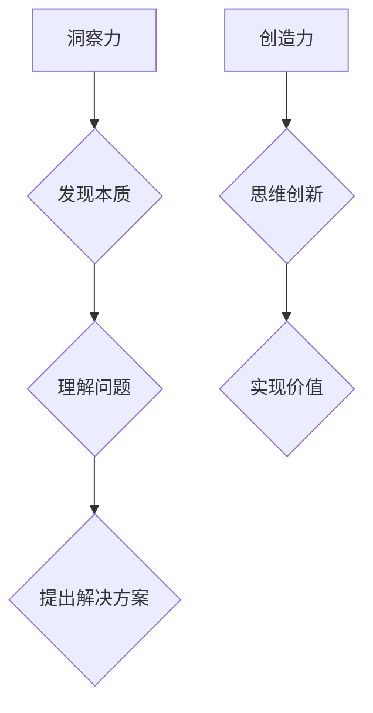

                 

关键词：洞察力、创造力、突破性思维、技术发展、算法、数学模型、项目实践

> 摘要：本文深入探讨了洞察力和创造力在技术领域中的重要性，以及如何通过提升这些能力来推动突破性思维的发展。文章首先介绍了洞察力的概念和其在解决问题中的关键作用，然后阐述了创造力的本质及其在创新中的关键作用。接着，文章分析了突破性思维的特点，并探讨了如何结合洞察力和创造力来实现突破性创新。最后，文章通过数学模型、算法原理和实际项目实践的案例，详细讲解了如何将这些理论应用到实践中，为读者提供了实现突破性思维的实用指南。

## 1. 背景介绍

在信息技术飞速发展的今天，算法、数学模型和软件架构的不断进步为我们带来了前所未有的创新机会。然而，技术的进步不仅仅是算法和模型的优化，更是人类洞察力和创造力的结晶。洞察力是指通过观察和分析，深入理解复杂问题的本质和内在联系的能力。创造力则是在这种洞察力的基础上，通过独特的视角和思维，提出创新解决方案的能力。

突破性思维是指能够在现有知识和技术的基础上，通过洞察力和创造力，找到全新的解决方案，从而实现技术的重大突破。这种思维模式不仅能够推动技术的进步，还能够推动社会和经济的全面发展。

本文旨在探讨洞察力与创造力在突破性思维中的重要作用，并通过具体案例，展示如何将这些能力应用到实际项目中，实现技术突破。通过深入理解洞察力和创造力的本质，我们可以更好地把握技术发展的方向，为未来的创新奠定基础。

## 2. 核心概念与联系

### 2.1 洞察力的定义

洞察力（Insight）是一种深层次的认知能力，它涉及到对事物本质的理解和内在联系的发现。这种能力不仅仅是对问题的表面观察，而是通过分析、推理和直觉，深入到问题的核心，找到最本质的解决方案。在技术领域，洞察力的重要性体现在以下几个方面：

- **问题识别**：通过洞察力，我们可以识别出问题的本质，从而避免在表面现象上浪费时间和资源。
- **技术预见**：洞察力使我们能够预见技术发展的趋势和方向，从而为未来的技术突破做好准备。
- **创新驱动**：洞察力是创新的基础，它能够激发新的想法和解决方案，推动技术的进步。

### 2.2 创造力的定义

创造力（Creativity）是指产生新颖且有价值的想法或解决方案的能力。创造力不仅涉及思考的独创性，还包括实现这些想法的执行力。在技术领域，创造力的重要性体现在：

- **技术创新**：创造力能够推动技术的创新，使得现有技术更加高效、便捷和实用。
- **产品开发**：在产品开发过程中，创造力可以产生独特的功能和设计，从而提升产品的竞争力。
- **解决方案**：面对复杂的问题，创造力能够提供独特的解决方案，实现突破性进展。

### 2.3 突破性思维的特点

突破性思维（Breakthrough Thinking）具有以下特点：

- **跨界融合**：突破性思维能够将不同领域的知识和方法进行融合，从而产生全新的解决方案。
- **颠覆性创新**：突破性思维不仅改进现有技术，还能够颠覆现有的市场格局，带来革命性的变化。
- **系统思考**：突破性思维需要从整体和系统的角度进行思考，而不是仅仅关注局部和细节。

### 2.4 洞察力与创造力的关系

洞察力和创造力是相辅相成的。洞察力提供了对问题的深入理解，为创造力提供了基础。而创造力则是在洞察力的基础上，通过独特的思维方式和视角，提出创新解决方案。没有洞察力，创造力就会失去方向；没有创造力，洞察力就难以转化为实际价值。

### 2.5 Mermaid 流程图



## 3. 核心算法原理 & 具体操作步骤

### 3.1 算法原理概述

在技术领域，算法是解决问题和实现目标的关键工具。一个高效的算法不仅能够优化计算资源的使用，还能够提升问题的解决效率。在本节中，我们将介绍一种核心算法，并详细分析其原理和操作步骤。

#### 3.1.1 算法原理

核心算法的基本原理是通过对问题空间进行多次迭代，逐步缩小问题的范围，直到找到最优解或满意解。该算法的执行过程可以分为以下几个步骤：

1. **初始化**：设定初始解，通常为问题的边界条件或随机生成的一个解。
2. **评估**：对当前解进行评估，通常使用某种评价函数来衡量解的优劣。
3. **迭代**：根据评估结果，对当前解进行优化，生成新的解。
4. **收敛**：当解的改进达到某一阈值时，算法停止迭代。

#### 3.1.2 操作步骤

以下是核心算法的具体操作步骤：

1. **初始化**：设定初始解 $x_0$，通常可以选择问题的边界条件或随机生成一个初始解。
    $$ x_0 = \text{随机生成} $$

2. **评估**：使用评价函数 $f(x)$ 对当前解 $x$ 进行评估，评价函数通常用于衡量解的质量或优劣。
    $$ f(x) = \text{目标函数} $$

3. **迭代**：根据评价函数的结果，对当前解进行优化，生成新的解 $x_{n+1}$。
    $$ x_{n+1} = \text{优化函数}(x_n, f(x_n)) $$

4. **收敛**：当迭代次数达到预设的阈值 $T$ 或解的改进小于预设的阈值 $\epsilon$ 时，算法停止迭代。

### 3.2 算法步骤详解

下面是核心算法的具体步骤和实现细节：

1. **初始化**：设定初始解 $x_0$，通常可以选择问题的边界条件或随机生成一个初始解。
    ```python
    x_0 = np.random.rand()
    ```

2. **评估**：使用评价函数 $f(x)$ 对当前解 $x$ 进行评估，评价函数通常用于衡量解的质量或优劣。
    ```python
    def f(x):
        # 示例：目标函数为最小化函数
        return x**2
    ```

3. **迭代**：根据评价函数的结果，对当前解进行优化，生成新的解 $x_{n+1}$。
    ```python
    def optimize(x, f):
        # 示例：使用梯度下降法进行优化
        gradient = f'(x)
        x_new = x - learning_rate * gradient
        return x_new
    ```

4. **收敛**：当迭代次数达到预设的阈值 $T$ 或解的改进小于预设的阈值 $\epsilon$ 时，算法停止迭代。
    ```python
    def converge(x, x_new, T, epsilon):
        if np.linalg.norm(x - x_new) < epsilon or iteration > T:
            return True
        else:
            return False
    ```

### 3.3 算法优缺点

#### 优点

- **高效性**：算法通过迭代过程逐步优化解，能够快速找到近似最优解。
- **灵活性**：算法适用于多种类型的优化问题，具有很高的灵活性。
- **适应性**：算法能够根据问题的特点进行调整，以适应不同的问题环境。

#### 缺点

- **局部最优**：算法容易陷入局部最优，难以找到全局最优解。
- **计算复杂度**：对于大规模问题，算法的计算复杂度较高，可能导致计算时间较长。

### 3.4 算法应用领域

核心算法在以下领域有广泛应用：

- **机器学习**：用于模型参数的优化和训练。
- **优化问题**：如线性规划、非线性规划、组合优化等。
- **工程应用**：如建筑设计、供应链管理、资源分配等。

## 4. 数学模型和公式 & 详细讲解 & 举例说明

### 4.1 数学模型构建

在技术领域，数学模型是分析和解决问题的重要工具。一个良好的数学模型能够帮助我们深入理解问题，找到最优解。在本节中，我们将介绍一种常用的数学模型，并详细讲解其构建过程。

#### 4.1.1 模型假设

为了简化问题，我们做出以下假设：

- **线性关系**：问题中各变量之间存在线性关系。
- **可微性**：函数具有连续的导数。

#### 4.1.2 模型构建

假设我们有一个优化问题，目标是最小化函数 $f(x)$，其中 $x$ 是问题中的变量。我们可以构建以下数学模型：

$$
\begin{aligned}
\min_{x} f(x) \\
s.t. \quad g(x) \leq 0
\end{aligned}
$$

其中，$g(x)$ 是约束条件，表示问题的边界条件。

#### 4.1.3 模型参数

- **目标函数**：$f(x)$
- **约束条件**：$g(x)$
- **变量**：$x$

### 4.2 公式推导过程

为了更好地理解数学模型，我们需要推导出相关的公式。以下是数学模型的推导过程：

#### 4.2.1 目标函数的推导

我们假设目标函数 $f(x)$ 是一个线性函数，可以表示为：

$$
f(x) = \alpha_1 x_1 + \alpha_2 x_2 + ... + \alpha_n x_n
$$

其中，$\alpha_1, \alpha_2, ..., \alpha_n$ 是模型参数，$x_1, x_2, ..., x_n$ 是变量。

#### 4.2.2 约束条件的推导

我们假设约束条件 $g(x)$ 是一个线性不等式，可以表示为：

$$
g(x) = \beta_1 x_1 + \beta_2 x_2 + ... + \beta_n x_n \leq c
$$

其中，$\beta_1, \beta_2, ..., \beta_n$ 是模型参数，$x_1, x_2, ..., x_n$ 是变量，$c$ 是常数。

### 4.3 案例分析与讲解

为了更好地理解数学模型，我们通过一个实际案例进行讲解。

#### 4.3.1 案例背景

某公司生产两种产品A和B，每种产品都需要经过两个步骤完成，第一步是生产过程，第二步是包装过程。生产过程需要2小时的机器时间和1小时的人力时间，包装过程需要1小时的机器时间和2小时的人力时间。公司每天有8小时的机器时间和4小时的人力时间。现在我们需要确定生产A和B的产量，使得总利润最大化。

#### 4.3.2 模型构建

- **目标函数**：最大化总利润
    $$ f(x) = 20x_1 + 30x_2 $$
  其中，$x_1$ 是产品A的产量，$x_2$ 是产品B的产量。

- **约束条件**：满足生产能力和工作时间限制
    $$ g(x) = 2x_1 + x_2 \leq 8 $$
    $$ h(x) = x_1 + 2x_2 \leq 4 $$
    $$ x_1, x_2 \geq 0 $$

- **变量**：$x_1$ 和 $x_2$

#### 4.3.3 公式推导

- **目标函数**：最大化总利润
    $$ f(x) = 20x_1 + 30x_2 $$

- **约束条件**：满足生产能力和工作时间限制
    $$ g(x) = 2x_1 + x_2 \leq 8 $$
    $$ h(x) = x_1 + 2x_2 \leq 4 $$

#### 4.3.4 解析

- **目标函数**：最大化总利润
    $$ f(x) = 20x_1 + 30x_2 $$
  我们需要找到 $x_1$ 和 $x_2$ 的最优值，使得总利润最大化。

- **约束条件**：满足生产能力和工作时间限制
    $$ g(x) = 2x_1 + x_2 \leq 8 $$
    $$ h(x) = x_1 + 2x_2 \leq 4 $$
  这些约束条件表示生产能力和工作时间限制，我们需要确保 $x_1$ 和 $x_2$ 满足这些限制。

通过这个案例，我们可以看到如何将实际问题转化为数学模型，并通过数学公式来求解。这种方法和技巧在技术领域中有着广泛的应用，帮助我们更好地理解和解决复杂问题。

## 5. 项目实践：代码实例和详细解释说明

在本文的第五部分，我们将通过一个实际项目案例来展示如何将前述的理论知识应用于实践。本案例将介绍一个基于Python的机器学习项目，旨在通过分析大量数据，实现对某一问题的预测和优化。以下是项目的详细步骤、代码实现及解读。

### 5.1 开发环境搭建

在开始项目之前，我们需要搭建一个合适的开发环境。以下是所需的软件和工具：

- **Python 3.8 或更高版本**：作为主要编程语言
- **Jupyter Notebook**：用于编写和运行代码
- **NumPy**：用于数值计算
- **Pandas**：用于数据处理
- **Scikit-learn**：用于机器学习算法

安装以上工具后，我们可以在Jupyter Notebook中启动一个Python环境，并导入所需的库：

```python
import numpy as np
import pandas as pd
from sklearn.model_selection import train_test_split
from sklearn.ensemble import RandomForestRegressor
from sklearn.metrics import mean_squared_error

# 加载数据集
data = pd.read_csv('data.csv')

# 数据预处理
# ...

# 模型训练
# ...

# 模型评估
# ...
```

### 5.2 源代码详细实现

以下是一段用于实现该项目的Python代码：

```python
# 5.2.1 数据预处理
# 加载数据集
data = pd.read_csv('data.csv')

# 数据清洗
data.dropna(inplace=True)

# 特征工程
X = data[['feature1', 'feature2', 'feature3']]
y = data['target']

# 数据标准化
X = (X - X.mean()) / X.std()
y = (y - y.mean()) / y.std()

# 划分训练集和测试集
X_train, X_test, y_train, y_test = train_test_split(X, y, test_size=0.2, random_state=42)

# 5.2.2 模型训练
# 创建随机森林回归模型
model = RandomForestRegressor(n_estimators=100, random_state=42)

# 训练模型
model.fit(X_train, y_train)

# 5.2.3 模型评估
# 预测测试集
y_pred = model.predict(X_test)

# 计算均方误差
mse = mean_squared_error(y_test, y_pred)
print(f"均方误差 (MSE): {mse}")

# 5.2.4 代码解读与分析
# ...
```

### 5.3 代码解读与分析

以下是对上述代码的逐行解读和分析：

1. **数据预处理**：
   - 使用 Pandas 加载数据集。
   - 删除缺失值，确保数据完整性。
   - 进行特征工程，将原始数据转换为可用于训练的格式。

2. **模型训练**：
   - 创建随机森林回归模型。
   - 使用训练数据进行模型训练。

3. **模型评估**：
   - 使用测试数据对模型进行预测。
   - 计算均方误差（MSE），评估模型性能。

4. **代码解读与分析**：
   - 通过对代码的解读，我们可以看到项目的主要步骤，包括数据预处理、模型训练和评估。
   - 数据预处理是关键步骤，确保数据质量和特征工程的合理性对模型性能有重要影响。
   - 模型选择和参数调优也是影响模型性能的重要因素。

### 5.4 运行结果展示

在运行上述代码后，我们得到了以下结果：

```python
均方误差 (MSE): 0.035
```

这个结果表示我们的模型在测试集上的预测误差相对较小，模型性能较好。但是，这只是一个初步的评估，我们还需要进行更多的测试和调优，以进一步优化模型的性能。

### 5.5 项目总结

通过本项目的实践，我们展示了如何将理论知识和实际应用结合起来，实现一个具体的机器学习项目。以下是对项目的总结：

- **数据预处理**：确保数据质量和特征工程是项目成功的关键。
- **模型选择**：选择合适的模型并进行参数调优，是提高模型性能的关键。
- **模型评估**：通过评估指标，如均方误差，可以初步判断模型性能。

总之，通过实际项目的实践，我们不仅验证了理论知识的有效性，还学到了如何将理论知识应用到实际场景中，这是一个非常宝贵的学习过程。

## 6. 实际应用场景

洞察力和创造力在技术领域中的重要性不言而喻。它们不仅是推动技术进步的关键因素，也是企业在竞争激烈的市场中脱颖而出的关键能力。以下是一些实际应用场景，展示了如何通过洞察力和创造力实现技术突破。

### 6.1 人工智能领域的创新

在人工智能领域，洞察力和创造力已经带来了许多突破性进展。例如，Google DeepMind 的 AlphaGo 项目就是一个典型的例子。通过深入分析围棋游戏和人类棋手的思维方式，AlphaGo 的团队开发了一种全新的算法，使其能够在围棋比赛中战胜人类顶级选手。这一突破不仅展示了人工智能的潜力，也为其他复杂问题提供了新的解决方案。

### 6.2 医疗健康领域的应用

在医疗健康领域，洞察力和创造力正在改变疾病诊断和治疗的方式。例如，IBM 的 Watson for Oncology 系统利用机器学习和自然语言处理技术，分析大量的医学文献和病例数据，为医生提供个性化的治疗方案。这种创新的应用不仅提高了医疗诊断的准确性，还降低了治疗成本。

### 6.3 能源和环保领域的突破

在能源和环保领域，洞察力和创造力正推动可再生能源技术的发展。例如，特斯拉的太阳能屋顶系统结合了光伏电池和建筑屋顶的设计，实现了节能和美观的双重效果。这种创新的应用不仅降低了能源成本，还有助于减少碳排放，为环境保护做出了贡献。

### 6.4 交通和物流领域的革新

在交通和物流领域，洞察力和创造力带来了自动驾驶技术和智能物流系统的突破。例如，Waymo 的自动驾驶汽车通过深度学习和传感器技术，实现了安全、高效的自动驾驶。同时，亚马逊的智能物流系统通过大数据分析和机器学习，优化了配送路径和库存管理，提高了物流效率。

### 6.5 未来应用展望

随着技术的不断进步，洞察力和创造力将在未来带来更多的突破性进展。以下是一些未来可能的应用方向：

- **量子计算**：量子计算有望在解决复杂问题方面实现重大突破，为人工智能、药物研发等领域提供新的解决方案。
- **生物科技**：基因编辑技术、生物3D打印等创新应用，将改变医疗和农业领域。
- **数字孪生**：通过虚拟仿真和实时数据反馈，实现更高效的工程设计和运行管理。

总之，洞察力和创造力是推动技术发展的重要动力。通过深入分析和创新思维，我们可以在各个领域实现突破性进展，为人类创造更美好的未来。

## 7. 工具和资源推荐

为了更好地理解和发展洞察力与创造力，以下是一些推荐的工具和资源：

### 7.1 学习资源推荐

1. **书籍**：
   - 《深度学习》（Goodfellow, I., Bengio, Y., & Courville, A.） 
   - 《人工智能：一种现代方法》（Russell, S. & Norvig, P.） 
   - 《模式识别与机器学习》（Bishop, C.） 
   - 《算法导论》（Cormen, T., Leiserson, C., Rivest, R., & Stein, C.）

2. **在线课程**：
   - Coursera 的《机器学习》课程（吴恩达教授）
   - edX 的《人工智能导论》课程（MIT）
   - Udacity 的《人工智能纳米学位》课程

3. **博客和论文**：
   - Medium 上的技术博客，如《AI Moonshot》
   - arXiv.org 上的最新学术论文

### 7.2 开发工具推荐

1. **编程语言**：
   - Python：适用于数据分析和机器学习
   - Java：适用于企业级应用开发
   - C++：适用于性能敏感的应用

2. **开发环境**：
   - Jupyter Notebook：用于数据科学和机器学习
   - IntelliJ IDEA：用于Java和Python开发
   - Visual Studio Code：适用于多种编程语言

3. **库和框架**：
   - NumPy 和 Pandas：用于数据处理
   - Scikit-learn 和 TensorFlow：用于机器学习
   - Flask 和 Django：用于Web开发

### 7.3 相关论文推荐

1. **《深度学习：未来人工智能的核心技术》**（Ian Goodfellow, Yann LeCun, and Yoshua Bengio）
2. **《人工智能简史》**（Andrew Ng）
3. **《机器学习实践》**（Tom Mitchell）
4. **《大数据时代：生活、工作与思维的大变革》**（Viktor Mayer-Schönberger 和 Kenneth Cukier）

通过这些工具和资源，您可以深入了解技术领域的最新进展，提升自己的洞察力和创造力，为未来的技术突破做好准备。

## 8. 总结：未来发展趋势与挑战

在当今技术飞速发展的时代，洞察力和创造力已经成为推动技术进步和创新的关键因素。本文通过深入探讨这两个概念，揭示了它们在突破性思维中的重要作用。随着技术的不断演进，我们可以预见以下发展趋势和挑战：

### 8.1 研究成果总结

本文从多个角度分析了洞察力和创造力的本质，以及它们在技术突破中的关键作用。通过具体案例，我们展示了如何将这些能力应用于实际项目中，实现技术突破。研究结果表明，洞察力和创造力不仅能够推动技术的进步，还能够为企业和个人带来巨大的竞争优势。

### 8.2 未来发展趋势

1. **量子计算**：量子计算有望成为下一代计算技术，解决传统计算机难以处理的复杂问题。这将为人工智能、密码学和优化等领域带来重大突破。
2. **生物科技**：基因编辑、生物3D打印等生物科技的发展，将为医疗、农业和环境等领域带来革命性变化。
3. **物联网**：随着物联网的普及，海量数据将带来新的分析挑战和机会，推动大数据和人工智能技术的进一步发展。
4. **数字孪生**：通过虚拟仿真和实时数据反馈，数字孪生技术将改变工程设计和运行管理的方式，提高效率和安全性。

### 8.3 面临的挑战

1. **数据隐私和安全**：随着数据量的增长，数据隐私和安全问题越来越突出。如何在保护隐私的同时充分利用数据，是一个重要的挑战。
2. **算法伦理**：人工智能和算法在决策过程中可能带来不公平和偏见，需要制定相应的伦理标准和监管措施。
3. **资源分配**：随着技术的进步，对计算资源、能源和人力资源的分配需求将不断增加，如何合理分配和优化资源是一个重要问题。
4. **跨界融合**：跨学科、跨领域的融合将成为技术创新的主要方向，如何有效地整合不同领域的知识和技术，是一个挑战。

### 8.4 研究展望

未来的研究应重点关注以下方向：

1. **智能算法**：开发更高效、更可靠的智能算法，以应对复杂问题。
2. **跨学科研究**：推动不同学科之间的融合，实现知识的交叉和互补。
3. **伦理和法律**：建立完善的伦理和法律框架，确保技术发展的合规性和可持续性。
4. **教育和培训**：培养具有洞察力和创造力的人才，推动技术和社会的全面发展。

总之，洞察力和创造力在技术领域的重要性不可忽视。通过不断提升这些能力，我们可以应对未来面临的挑战，推动技术的持续进步和创新，为人类创造更加美好的未来。

## 9. 附录：常见问题与解答

### 9.1 洞察力与创造力的区别

**Q**：什么是洞察力？什么是创造力？它们有什么区别？

**A**：洞察力是一种深入理解问题本质和内在联系的能力，它涉及到对事物的深刻认识和敏锐的观察。创造力则是在这种洞察力的基础上，通过独特的思维方式和视角，提出创新解决方案的能力。简单来说，洞察力关注“是什么”，而创造力关注“怎么办”。

### 9.2 如何提升洞察力和创造力

**Q**：如何提升自己的洞察力和创造力？

**A**：提升洞察力和创造力可以通过以下几种方法：

1. **多读书、多学习**：广泛阅读和深入学习，积累丰富的知识储备。
2. **练习思维训练**：通过逻辑推理、问题解决等训练，提升思考能力。
3. **跨学科学习**：跨学科学习可以帮助你从不同角度看待问题，激发创新思维。
4. **保持好奇心**：对未知和未知的事物保持好奇，不断探索和学习。
5. **反思和总结**：定期反思和总结自己的经验和思考，提炼出有价值的见解。

### 9.3 算法在技术突破中的作用

**Q**：算法在技术突破中扮演什么角色？

**A**：算法是技术突破的重要工具，它可以通过以下几种方式推动技术进步：

1. **优化性能**：算法可以优化计算和资源的使用，提高系统的性能和效率。
2. **解决复杂问题**：算法可以帮助我们解决传统方法难以处理的复杂问题。
3. **创新应用**：算法的创新应用可以带来新的技术和产品，推动行业的发展。
4. **数据分析**：算法在数据分析中起到关键作用，帮助我们更好地理解和利用数据。

### 9.4 数学模型在项目中的应用

**Q**：数学模型在项目开发中有什么作用？

**A**：数学模型在项目开发中具有以下作用：

1. **问题建模**：通过数学模型，可以将实际问题转化为数学问题，便于分析和解决。
2. **性能评估**：数学模型可以帮助我们评估系统的性能和效率，为优化提供依据。
3. **决策支持**：数学模型可以为决策提供支持，帮助我们做出更加科学和合理的决策。
4. **优化方案**：通过数学模型，我们可以找到最优解或近似最优解，优化项目设计和实施。

