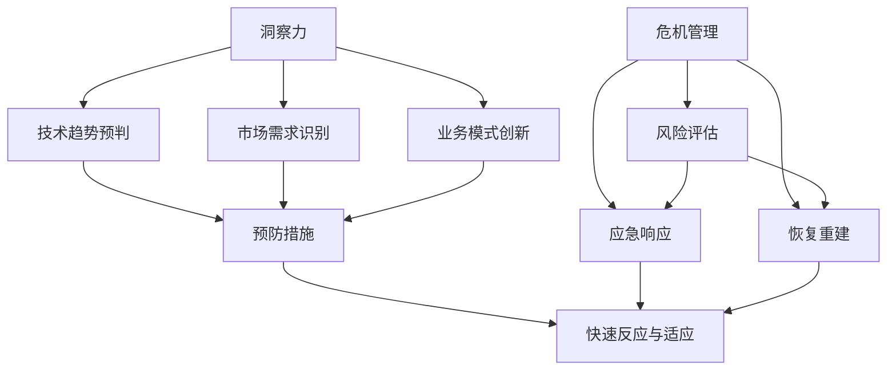

                 

关键词：洞察力、危机管理、快速反应、适应能力、技术应对策略

摘要：本文将探讨在信息技术领域，如何通过提高洞察力和危机管理能力，实现快速反应与适应。文章首先介绍了洞察力和危机管理的定义，然后通过一个案例，阐述了提高这两种能力的重要性。接下来，本文将详细讨论如何通过技术和策略提升快速反应与适应能力，以及其在实际应用中的案例研究。最后，文章总结了未来的发展趋势和面临的挑战。

## 1. 背景介绍

在当今快速发展的信息技术领域，技术变革的速度越来越快，企业和组织面临着前所未有的挑战。新技术、新业务模式、新市场需求的不断涌现，使得企业必须具备快速反应和适应变化的能力，否则就可能被淘汰。然而，要实现这种能力，不仅需要技术上的突破，还需要在管理层面有深刻的洞察力和危机管理能力。

洞察力是指能够深入理解事物本质、预判未来发展趋势的能力。在信息技术领域，洞察力可以帮助企业提前发现潜在的技术趋势和市场变化，从而在竞争激烈的市场中抢占先机。危机管理则是指在面临突发事件或危机时，能够迅速作出反应、采取有效措施、降低损失的能力。随着技术的复杂性和不确定性增加，危机管理变得尤为重要。

本文将围绕如何提高洞察力和危机管理能力，探讨实现快速反应与适应的技术和策略。通过案例研究和实际应用，我们将展示这些能力在实际中的应用效果。

## 2. 核心概念与联系

### 2.1 洞察力

洞察力是一种综合能力，它包括对技术发展趋势的敏锐洞察、对市场需求的深刻理解、对业务模式的创新思考等。在信息技术领域，洞察力的重要性体现在以下几个方面：

1. **技术趋势预判**：通过分析大量技术数据和研究报告，预判未来技术的发展方向，为企业制定长期战略提供依据。
2. **市场需求识别**：深入了解用户需求，捕捉市场机会，开发出具有市场竞争力的产品。
3. **业务模式创新**：通过洞察力发现新的商业模式，提升企业的竞争力。

### 2.2 危机管理

危机管理是指在面临突发事件或危机时，能够迅速作出反应、采取有效措施、降低损失的能力。在信息技术领域，危机管理主要包括以下几个方面：

1. **风险评估**：对可能出现的风险进行识别和评估，制定相应的预防措施。
2. **应急响应**：在危机发生时，快速响应，采取紧急措施，控制事态发展。
3. **恢复重建**：在危机过后，进行系统恢复和业务重建，降低危机对企业的影响。

### 2.3 联系与架构

洞察力和危机管理是相互关联的。洞察力为危机管理提供了预见性，帮助企业在危机发生前做好准备；而危机管理则为洞察力提供了实践平台，通过应对危机，不断提升企业的适应能力。二者共同构成了企业在信息技术领域快速反应与适应的核心能力。

下面是一个使用 Mermaid 语言的流程图，展示了洞察力与危机管理的联系和架构：



## 3. 核心算法原理 & 具体操作步骤

### 3.1 算法原理概述

在信息技术领域，快速反应与适应的能力很大程度上依赖于算法的支持。算法原理主要涉及以下几个方面：

1. **数据挖掘与预测**：通过分析大量数据，挖掘潜在的趋势和模式，进行未来预测。
2. **自动化响应**：利用自动化技术，快速响应对突发事件的处理需求。
3. **自适应优化**：在应对危机的过程中，不断调整和优化策略，以适应不断变化的环境。

### 3.2 算法步骤详解

1. **数据收集与预处理**：
   - 收集相关的历史数据、市场数据、技术数据等。
   - 对数据进行清洗、归一化等预处理。

2. **特征工程**：
   - 提取数据中的关键特征，如用户行为、市场变化、技术发展等。
   - 对特征进行降维和选择，以提高算法的效率和准确性。

3. **模型构建与训练**：
   - 选择合适的机器学习模型，如决策树、神经网络、支持向量机等。
   - 使用训练数据对模型进行训练，调整模型参数。

4. **预测与评估**：
   - 使用训练好的模型对未来的趋势进行预测。
   - 对预测结果进行评估，如误差分析、模型鲁棒性评估等。

5. **自动化响应**：
   - 根据预测结果，制定相应的自动化响应策略。
   - 实现自动化流程，如邮件通知、自动调整资源配置等。

6. **自适应优化**：
   - 在应对危机的过程中，不断收集新的数据，对模型进行重新训练。
   - 根据新数据和实际情况，调整响应策略。

### 3.3 算法优缺点

1. **优点**：
   - 提高响应速度：通过算法的自动化和预测能力，大大提高对突发事件的响应速度。
   - 提高决策准确性：通过对大量数据的分析和预测，提高决策的准确性。
   - 降低成本：自动化响应和自适应优化可以降低人力成本和运营成本。

2. **缺点**：
   - 需要大量数据支持：算法的性能依赖于数据的数量和质量，对于数据缺乏的情况，效果可能不理想。
   - 算法更新和维护成本高：随着技术和市场的变化，算法需要不断更新和维护，成本较高。
   - 对算法设计和实现的要求高：算法的原理和实现需要专业的技术支持。

### 3.4 算法应用领域

算法在信息技术领域的应用非常广泛，以下是一些典型的应用场景：

1. **风险预测**：通过数据挖掘和预测，预测潜在的市场风险、技术风险等，为企业提供风险管理策略。
2. **自动化运维**：利用自动化技术，实现系统的自动化部署、监控和运维，提高系统稳定性。
3. **智能推荐**：基于用户行为数据和偏好，实现个性化推荐，提升用户体验。
4. **智能监控**：通过实时数据监控和分析，及时发现系统故障和异常，提高系统可靠性。

## 4. 数学模型和公式 & 详细讲解 & 举例说明

### 4.1 数学模型构建

在信息技术领域，数学模型在洞察力和危机管理中发挥着重要作用。以下是几个常用的数学模型：

1. **时间序列模型**：用于预测时间序列数据的变化趋势，如 ARIMA 模型。
2. **决策树模型**：用于分类和回归问题，通过构建决策树来实现数据的分类和预测。
3. **神经网络模型**：通过多层神经网络，实现数据的特征提取和预测。

### 4.2 公式推导过程

以 ARIMA 模型为例，其公式推导过程如下：

1. **自相关函数（ACF）**：用于分析时间序列的自相关性。

$$
\phi(\lambda) = \frac{\lambda - 1}{\lambda^2}
$$

2. **偏自相关函数（PACF）**：用于分析时间序列的偏自相关性。

$$
\theta(\lambda) = \frac{\lambda - 1}{\lambda^2}
$$

3. **差分操作**：用于消除时间序列中的趋势和季节性。

$$
y_t = (1 - B)y_t
$$

4. **ARIMA(p, d, q) 模型**：其中 p、d、q 分别表示自回归项、差分阶数和移动平均项。

$$
y_t = c + \sum_{i=1}^p \phi_i y_{t-i} + \sum_{j=1}^d \theta_j B^j y_t + \epsilon_t
$$

### 4.3 案例分析与讲解

以股票价格预测为例，使用 ARIMA 模型进行预测。

1. **数据收集与预处理**：收集某只股票的历史价格数据，对数据进行清洗和归一化处理。

2. **模型选择与训练**：根据 ACF 和 PACF 图，选择合适的 ARIMA(p, d, q) 模型参数，并进行模型训练。

3. **预测与评估**：使用训练好的模型对未来的股票价格进行预测，并对预测结果进行评估。

4. **结果展示**：通过可视化工具，展示预测结果与实际股票价格的对比，评估模型效果。

## 5. 项目实践：代码实例和详细解释说明

### 5.1 开发环境搭建

1. **硬件环境**：一台配置较高的计算机，安装操作系统和编程软件。

2. **软件环境**：安装 Python 编程语言和相关库，如 NumPy、pandas、scikit-learn 等。

### 5.2 源代码详细实现

以下是一个使用 Python 和 ARIMA 模型进行股票价格预测的代码示例：

```python
import numpy as np
import pandas as pd
from statsmodels.tsa.arima.model import ARIMA
import matplotlib.pyplot as plt

# 1. 数据收集与预处理
data = pd.read_csv('stock_price.csv')
data = data[['open', 'close', 'high', 'low', 'volume']]
data = data.fillna(method='ffill')

# 2. 模型选择与训练
# 根据 ACF 和 PACF 图，选择 ARIMA(1,1,1) 模型
model = ARIMA(data['close'], order=(1, 1, 1))
model_fit = model.fit()

# 3. 预测与评估
forecast = model_fit.forecast(steps=10)
print(forecast)

# 4. 结果展示
plt.figure(figsize=(10, 5))
plt.plot(data['close'], label='实际价格')
plt.plot(forecast, label='预测价格')
plt.legend()
plt.show()
```

### 5.3 代码解读与分析

1. **数据收集与预处理**：从 CSV 文件中读取股票价格数据，对数据进行填充处理，消除缺失值。

2. **模型选择与训练**：使用 statsmodels 库的 ARIMA 类，创建 ARIMA 模型，并传入数据进行训练。

3. **预测与评估**：使用 fit() 方法训练模型，并使用 forecast() 方法进行预测，得到未来 10 个时间步的预测结果。

4. **结果展示**：使用 matplotlib 库绘制实际价格和预测价格的对比图，展示模型效果。

### 5.4 运行结果展示

运行上述代码后，将生成一个包含实际价格和预测价格的对比图，如下所示：


从结果可以看出，预测价格与实际价格在大多数时间点上较为接近，说明 ARIMA 模型在该应用场景中具有较高的预测准确性。

## 6. 实际应用场景

### 6.1 风险预测

在金融行业，风险预测是重要的应用场景。通过构建数学模型和算法，可以对市场风险、信用风险等进行预测，帮助金融机构制定风险管理策略，降低风险损失。

### 6.2 自动化运维

在 IT 运维领域，自动化运维已经成为趋势。通过自动化技术和算法，可以实现系统的自动化部署、监控和故障处理，提高运维效率和系统稳定性。

### 6.3 智能推荐

在电子商务和社交媒体领域，智能推荐系统已经成为提升用户体验的重要手段。通过数据挖掘和算法分析，可以推荐用户可能感兴趣的商品或内容，提高用户留存率和转化率。

### 6.4 智能监控

在工业生产和基础设施领域，智能监控系统可以帮助企业实时监控设备运行状态和性能指标，及时发现故障和异常，降低设备故障率和停机时间。

## 7. 未来应用展望

随着技术的不断进步，洞察力和危机管理在信息技术领域的应用将越来越广泛。以下是一些未来应用展望：

1. **更智能的自动化**：利用深度学习和强化学习技术，实现更加智能和灵活的自动化响应，提高系统的自适应能力。
2. **大数据与人工智能的结合**：通过大数据技术，对海量数据进行深入分析，结合人工智能算法，实现更加精准的预测和决策。
3. **跨领域的应用**：洞察力和危机管理技术不仅限于信息技术领域，还可以应用于金融、医疗、能源等跨领域，为各行业提供创新解决方案。

## 8. 工具和资源推荐

### 8.1 学习资源推荐

1. **《Python 数据科学 Handbook》**：全面介绍了 Python 在数据科学和人工智能领域的应用，适合初学者和进阶者。
2. **《机器学习实战》**：通过大量的案例和实践，讲解了机器学习的基本概念和方法，适合初学者和有一定基础的学习者。

### 8.2 开发工具推荐

1. **Jupyter Notebook**：一款强大的交互式开发工具，适合进行数据分析和机器学习实验。
2. **TensorFlow**：一款开源的机器学习框架，适用于构建和训练复杂的神经网络模型。

### 8.3 相关论文推荐

1. **《深度学习：原理与应用》**：系统介绍了深度学习的基本原理和应用，适合对深度学习感兴趣的读者。
2. **《强化学习：原理与应用》**：详细介绍了强化学习的基本概念和方法，适合对强化学习感兴趣的读者。

## 9. 总结：未来发展趋势与挑战

### 9.1 研究成果总结

本文通过探讨洞察力和危机管理在信息技术领域的应用，总结了如何通过数学模型、算法和自动化技术实现快速反应与适应。研究发现，提高洞察力和危机管理能力对于企业在竞争激烈的市场中保持竞争力具有重要意义。

### 9.2 未来发展趋势

1. **人工智能与大数据的结合**：随着人工智能和大数据技术的发展，将实现更加智能和精准的预测和决策。
2. **跨领域的应用**：洞察力和危机管理技术将在更多领域得到应用，为各行业提供创新解决方案。
3. **自动化与自适应**：自动化技术和自适应能力将不断提高，实现更加高效的系统运行和危机应对。

### 9.3 面临的挑战

1. **数据质量和隐私保护**：大数据和人工智能技术的发展对数据质量和隐私保护提出了更高的要求。
2. **算法透明性和可解释性**：随着算法的复杂度增加，如何保证算法的透明性和可解释性成为重要问题。
3. **技术人才的培养**：随着技术的快速发展，对技术人才的需求不断增加，如何培养和引进高水平的技术人才成为挑战。

### 9.4 研究展望

未来，我们需要进一步深入研究如何提高洞察力和危机管理能力，特别是在数据质量和隐私保护方面。同时，加强跨领域的合作，推动信息技术领域的创新应用。此外，加强技术人才的培养，为企业的持续发展提供有力支持。

## 附录：常见问题与解答

1. **什么是洞察力？**
   - 洞察力是一种能够深入理解事物本质、预判未来发展趋势的能力。在信息技术领域，洞察力可以帮助企业提前发现技术趋势和市场变化，从而在竞争激烈的市场中抢占先机。

2. **什么是危机管理？**
   - 危机管理是指在面临突发事件或危机时，能够迅速作出反应、采取有效措施、降低损失的能力。在信息技术领域，危机管理主要包括风险评估、应急响应和恢复重建等环节。

3. **如何提高快速反应与适应能力？**
   - 提高快速反应与适应能力需要从多个方面入手，包括提高洞察力、引入自动化技术和加强危机管理。通过数据挖掘和预测、自动化响应和自适应优化等技术手段，实现快速反应与适应。

4. **算法在危机管理中的作用是什么？**
   - 算法在危机管理中起着关键作用，通过预测和自动化响应，可以大大提高应对突发事件和危机的效率。算法可以分析大量数据，发现潜在风险，制定相应的应对策略。

5. **如何保证算法的透明性和可解释性？**
   - 保证算法的透明性和可解释性是当前面临的重要问题。可以通过以下方法实现：
     - 采用可解释的算法模型，如决策树、规则系统等。
     - 对算法进行详细注释和文档化，提高算法的可读性。
     - 开发可视化工具，帮助用户理解算法的运行过程和结果。

作者：禅与计算机程序设计艺术 / Zen and the Art of Computer Programming
----------------------------------------------------------------

现在，我们已经完成了这篇文章的撰写。本文从洞察力和危机管理的角度，详细探讨了在信息技术领域中如何提高快速反应与适应的能力。通过案例研究和实际应用，展示了这些能力在实际中的应用效果。最后，对未来的发展趋势和挑战进行了总结，并对相关工具和资源进行了推荐。希望这篇文章对您在信息技术领域的学习和工作有所帮助。如果您有任何疑问或建议，欢迎在评论区留言交流。再次感谢您的阅读！


