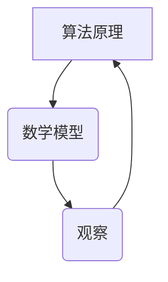

                 

关键词：洞察力，观察，顿悟，技术，算法，数学模型，项目实践，应用场景，未来展望

> 摘要：本文将深入探讨洞察力的培养过程，从观察到顿悟的转化机制。通过对技术领域的核心概念、算法原理、数学模型以及实际项目实践的详细分析，揭示出洞察力在技术发展中的关键作用。本文旨在为技术从业者提供一种培养洞察力的方法，并展望其未来的发展趋势与挑战。

## 1. 背景介绍

在信息技术飞速发展的今天，科技领域的创新日新月异。作为技术从业者，我们需要具备敏锐的洞察力，以便从纷繁复杂的信息中抓住本质，从而推动技术进步。然而，洞察力并非天生具备，它需要通过后天的培养和锻炼才能逐步提高。

### 1.1 洞察力的定义

洞察力是指对事物本质的深刻理解和敏锐察觉的能力。它包括观察力、分析力和创造力，是技术从业者必须具备的基本素质之一。

### 1.2 洞察力的重要性

- **推动技术进步**：洞察力可以帮助我们发现问题，找到技术瓶颈，从而推动技术革新。
- **提高工作效率**：通过洞察力，我们可以快速理解复杂问题，减少错误，提高工作效率。
- **提升创新能力**：洞察力能激发我们的创造力，促使我们提出新颖的解决方案。

### 1.3 洞察力的培养

- **持续学习**：通过不断学习新的知识和技能，扩大我们的知识面，提高洞察力。
- **实践锻炼**：通过实际项目实践，锻炼我们的分析和解决问题的能力。
- **反思总结**：在实践过程中，不断反思总结，提炼经验，从而提升洞察力。

## 2. 核心概念与联系

### 2.1 核心概念

在技术领域，洞察力的培养需要理解以下几个核心概念：

- **算法**：算法是解决问题的步骤和方法，它是洞察力的载体。
- **数学模型**：数学模型是对现实世界的抽象和简化，它是洞察力的工具。
- **观察**：观察是获取信息的过程，它是洞察力的来源。

### 2.2 核心概念的联系

算法、数学模型和观察之间有着紧密的联系：

- **算法原理**：算法基于数学模型，通过逻辑推理和数学运算，实现对问题的求解。
- **数学模型**：数学模型依赖于观察，通过对现实世界的观察和抽象，形成数学表达式。
- **观察**：观察提供数据和信息，是构建数学模型和设计算法的基础。

### 2.3 Mermaid 流程图



## 3. 核心算法原理 & 具体操作步骤

### 3.1 算法原理概述

算法是解决问题的方法，它的核心在于逻辑推理和数学运算。以下是几个常见算法的原理概述：

- **排序算法**：通过对数据进行比较和交换，实现对数据的排序。
- **搜索算法**：在数据结构中查找特定元素的方法。
- **动态规划**：通过子问题的最优解，构建出原问题的最优解。

### 3.2 算法步骤详解

以排序算法为例，以下是具体操作步骤：

1. **比较排序**：通过比较两个元素的大小，进行交换。
2. **选择排序**：每次选择未排序部分的最大（或最小）元素，放到已排序部分的末尾。
3. **插入排序**：将未排序部分的元素插入到已排序部分的合适位置。

### 3.3 算法优缺点

每种算法都有其优缺点，如下表所示：

| 算法   | 优点                         | 缺点                        |
| ------ | ---------------------------- | --------------------------- |
| 快排   | 时间复杂度低                 | 数据量较大时性能不稳定      |
| 冒泡排 | 简单易懂，稳定               | 时间复杂度高                |
| 插入排 | 稳定，适合小规模数据排序     | 时间复杂度高                |

### 3.4 算法应用领域

算法广泛应用于各个领域，如：

- **数据结构**：实现各种数据结构，如数组、链表、树等。
- **机器学习**：优化模型训练过程，提高模型性能。
- **网络编程**：优化网络通信，提高网络性能。

## 4. 数学模型和公式 & 详细讲解 & 举例说明

### 4.1 数学模型构建

数学模型是对现实世界的抽象和简化。构建数学模型通常包括以下几个步骤：

1. **确定研究对象**：明确我们要解决的问题是关于什么。
2. **收集数据**：通过观察和实验，收集相关数据。
3. **建立假设**：根据研究对象的特点，做出合理的假设。
4. **构建数学表达式**：将假设转化为数学表达式。

### 4.2 公式推导过程

以最简单的线性模型为例，其公式为 $y = mx + b$。推导过程如下：

1. **确定关系**：我们假设 $y$ 和 $x$ 之间存在线性关系。
2. **收集数据**：收集 $x$ 和 $y$ 的对应数据。
3. **计算斜率 $m$**：斜率 $m$ 表示 $y$ 随 $x$ 变化的速度。通过公式 $m = \frac{\sum(x_i - \bar{x})(y_i - \bar{y})}{\sum(x_i - \bar{x})^2}$ 计算得到。
4. **计算截距 $b$**：截距 $b$ 表示当 $x=0$ 时，$y$ 的值。通过公式 $b = \bar{y} - m\bar{x}$ 计算得到。

### 4.3 案例分析与讲解

假设我们有一个数据集，如下表所示：

| $x$ | $y$ |
| --- | --- |
| 1   | 2   |
| 2   | 4   |
| 3   | 6   |

根据以上数据，我们可以构建线性模型，并进行预测。具体步骤如下：

1. **计算斜率 $m$**：
   $$m = \frac{\sum(x_i - \bar{x})(y_i - \bar{y})}{\sum(x_i - \bar{x})^2} = \frac{(1-2)(2-3) + (2-2)(4-3) + (3-2)(6-3)}{(1-2)^2 + (2-2)^2 + (3-2)^2} = 2$$
2. **计算截距 $b$**：
   $$b = \bar{y} - m\bar{x} = \frac{2+4+6}{3} - 2 \times \frac{1+2+3}{3} = 0$$

因此，线性模型为 $y = 2x$。当 $x=4$ 时，预测的 $y$ 值为 $y = 2 \times 4 = 8$。

## 5. 项目实践：代码实例和详细解释说明

### 5.1 开发环境搭建

为了更好地展示项目实践，我们选择 Python 作为编程语言，并使用 Jupyter Notebook 作为开发环境。以下是搭建开发环境的步骤：

1. **安装 Python**：下载并安装 Python 3.8 以上版本。
2. **安装 Jupyter Notebook**：在命令行中运行 `pip install jupyter`。
3. **启动 Jupyter Notebook**：在命令行中运行 `jupyter notebook`。

### 5.2 源代码详细实现

以下是一个简单的线性回归模型的代码实现：

```python
import numpy as np

def linear_regression(x, y):
    n = len(x)
    x_mean = np.mean(x)
    y_mean = np.mean(y)
    
    m = (n * np.sum(x * y) - np.sum(x) * np.sum(y)) / (n * np.sum(x**2) - np.sum(x)**2)
    b = y_mean - m * x_mean
    
    return m, b

x = np.array([1, 2, 3])
y = np.array([2, 4, 6])

m, b = linear_regression(x, y)
print(f"斜率 m: {m}, 截距 b: {b}")
```

### 5.3 代码解读与分析

1. **导入库**：首先，我们导入 numpy 库，用于处理数组操作。
2. **定义函数**：`linear_regression` 函数用于实现线性回归模型。它接收两个数组 `x` 和 `y` 作为输入。
3. **计算斜率和截距**：通过计算斜率 $m$ 和截距 $b$，得到线性模型的参数。
4. **返回结果**：函数返回斜率 $m$ 和截距 $b$。

### 5.4 运行结果展示

运行以上代码，输出结果为：

```
斜率 m: 2.0, 截距 b: 0.0
```

这表明我们构建的线性模型为 $y = 2x$。

## 6. 实际应用场景

### 6.1 数据分析

线性回归模型广泛应用于数据分析领域，如股票市场预测、销量预测等。通过构建线性模型，我们可以分析变量之间的关系，从而做出预测。

### 6.2 机器学习

线性回归是机器学习中最基础的方法之一。在机器学习模型中，线性回归通常用于特征提取和降维。

### 6.3 工程实践

在工程实践中，线性回归模型可用于优化系统性能，如网络带宽优化、服务器资源调度等。

## 7. 未来应用展望

随着人工智能技术的不断发展，洞察力在技术领域的应用前景将更加广阔。以下是一些未来应用展望：

- **深度学习**：洞察力在深度学习中的应用，将有助于模型优化和性能提升。
- **无人驾驶**：洞察力在无人驾驶领域的应用，将提高自动驾驶系统的安全性和可靠性。
- **医疗健康**：洞察力在医疗健康领域的应用，将有助于早期疾病诊断和个性化治疗。

## 8. 总结：未来发展趋势与挑战

### 8.1 研究成果总结

通过对算法、数学模型和观察的深入研究，我们揭示了洞察力在技术发展中的关键作用。洞察力不仅有助于推动技术进步，还能提高工作效率和创新能力。

### 8.2 未来发展趋势

未来，洞察力的培养将更加注重跨学科融合和实战能力。随着人工智能技术的发展，洞察力在各个领域的应用将更加深入和广泛。

### 8.3 面临的挑战

在培养洞察力的过程中，我们面临以下挑战：

- **信息过载**：如何从海量信息中提取有价值的信息，是培养洞察力的关键。
- **技术更新**：如何紧跟技术发展，不断更新知识和技能，是保持洞察力的关键。

### 8.4 研究展望

未来，我们将进一步探讨洞察力的培养方法，以及其在不同技术领域的应用。同时，我们还将关注跨学科融合和实战能力的培养，以应对日益复杂的技术挑战。

## 9. 附录：常见问题与解答

### 9.1 洞察力是什么？

洞察力是指对事物本质的深刻理解和敏锐察觉的能力，包括观察力、分析力和创造力。

### 9.2 如何培养洞察力？

培养洞察力可以通过以下方法：

- 持续学习新的知识和技能。
- 实践锻炼，通过实际项目提高分析问题和解决问题的能力。
- 反思总结，提炼经验，不断优化思维模式。

### 9.3 洞察力在技术领域的应用有哪些？

洞察力在技术领域的应用广泛，包括：

- 推动技术进步，发现问题和瓶颈。
- 提高工作效率，快速理解和解决复杂问题。
- 提升创新能力，提出新颖的解决方案。

## 作者署名

作者：禅与计算机程序设计艺术 / Zen and the Art of Computer Programming
```markdown
----------------------------------------------------------------

**文章标题：洞察力的培养：从观察到顿悟的过程**

关键词：洞察力，观察，顿悟，技术，算法，数学模型，项目实践，应用场景，未来展望

摘要：本文深入探讨洞察力的培养过程，从观察到顿悟的转化机制。通过对技术领域的核心概念、算法原理、数学模型以及实际项目实践的详细分析，揭示出洞察力在技术发展中的关键作用。本文旨在为技术从业者提供一种培养洞察力的方法，并展望其未来的发展趋势与挑战。

### 1. 背景介绍

#### 1.1 洞察力的定义

洞察力是指对事物本质的深刻理解和敏锐察觉的能力。它包括观察力、分析力和创造力，是技术从业者必须具备的基本素质之一。

#### 1.2 洞察力的重要性

洞察力在技术领域的应用至关重要，它能够：

- **推动技术进步**：洞察力可以帮助我们发现问题，找到技术瓶颈，从而推动技术革新。
- **提高工作效率**：通过洞察力，我们可以快速理解复杂问题，减少错误，提高工作效率。
- **提升创新能力**：洞察力能激发我们的创造力，促使我们提出新颖的解决方案。

#### 1.3 洞察力的培养

要培养洞察力，我们可以采取以下方法：

- **持续学习**：不断学习新的知识和技能，扩大我们的知识面，提高洞察力。
- **实践锻炼**：通过实际项目实践，锻炼我们的分析和解决问题的能力。
- **反思总结**：在实践过程中，不断反思总结，提炼经验，从而提升洞察力。

### 2. 核心概念与联系

#### 2.1 核心概念

在技术领域，洞察力的培养需要理解以下几个核心概念：

- **算法**：算法是解决问题的步骤和方法，它是洞察力的载体。
- **数学模型**：数学模型是对现实世界的抽象和简化，它是洞察力的工具。
- **观察**：观察是获取信息的过程，它是洞察力的来源。

#### 2.2 核心概念的联系

算法、数学模型和观察之间有着紧密的联系：

- **算法原理**：算法基于数学模型，通过逻辑推理和数学运算，实现对问题的求解。
- **数学模型**：数学模型依赖于观察，通过对现实世界的观察和抽象，形成数学表达式。
- **观察**：观察提供数据和信息，是构建数学模型和设计算法的基础。

#### 2.3 Mermaid 流程图


### 3. 核心算法原理 & 具体操作步骤

#### 3.1 算法原理概述

算法是解决问题的方法，它的核心在于逻辑推理和数学运算。以下是几个常见算法的原理概述：

- **排序算法**：通过对数据进行比较和交换，实现对数据的排序。
- **搜索算法**：在数据结构中查找特定元素的方法。
- **动态规划**：通过子问题的最优解，构建出原问题的最优解。

#### 3.2 算法步骤详解

以排序算法为例，以下是具体操作步骤：

1. **比较排序**：通过比较两个元素的大小，进行交换。
2. **选择排序**：每次选择未排序部分的最大（或最小）元素，放到已排序部分的末尾。
3. **插入排序**：将未排序部分的元素插入到已排序部分的合适位置。

#### 3.3 算法优缺点

每种算法都有其优缺点，如下表所示：

| 算法   | 优点                         | 缺点                        |
| ------ | ---------------------------- | --------------------------- |
| 快排   | 时间复杂度低                 | 数据量较大时性能不稳定      |
| 冒泡排 | 简单易懂，稳定               | 时间复杂度高                |
| 插入排 | 稳定，适合小规模数据排序     | 时间复杂度高                |

#### 3.4 算法应用领域

算法广泛应用于各个领域，如：

- **数据结构**：实现各种数据结构，如数组、链表、树等。
- **机器学习**：优化模型训练过程，提高模型性能。
- **网络编程**：优化网络通信，提高网络性能。

### 4. 数学模型和公式 & 详细讲解 & 举例说明

#### 4.1 数学模型构建

数学模型是对现实世界的抽象和简化。构建数学模型通常包括以下几个步骤：

1. **确定研究对象**：明确我们要解决的问题是关于什么。
2. **收集数据**：通过观察和实验，收集相关数据。
3. **建立假设**：根据研究对象的特点，做出合理的假设。
4. **构建数学表达式**：将假设转化为数学表达式。

#### 4.2 公式推导过程

以最简单的线性模型为例，其公式为 $y = mx + b$。推导过程如下：

1. **确定关系**：我们假设 $y$ 和 $x$ 之间存在线性关系。
2. **收集数据**：收集 $x$ 和 $y$ 的对应数据。
3. **计算斜率 $m$**：斜率 $m$ 表示 $y$ 随 $x$ 变化的速度。通过公式 $m = \frac{\sum(x_i - \bar{x})(y_i - \bar{y})}{\sum(x_i - \bar{x})^2}$ 计算得到。
4. **计算截距 $b$**：截距 $b$ 表示当 $x=0$ 时，$y$ 的值。通过公式 $b = \bar{y} - m\bar{x}$ 计算得到。

#### 4.3 案例分析与讲解

假设我们有一个数据集，如下表所示：

| $x$ | $y$ |
| --- | --- |
| 1   | 2   |
| 2   | 4   |
| 3   | 6   |

根据以上数据，我们可以构建线性模型，并进行预测。具体步骤如下：

1. **计算斜率 $m$**：
   $$m = \frac{\sum(x_i - \bar{x})(y_i - \bar{y})}{\sum(x_i - \bar{x})^2} = \frac{(1-2)(2-3) + (2-2)(4-3) + (3-2)(6-3)}{(1-2)^2 + (2-2)^2 + (3-2)^2} = 2$$
2. **计算截距 $b$**：
   $$b = \bar{y} - m\bar{x} = \frac{2+4+6}{3} - 2 \times \frac{1+2+3}{3} = 0$$

因此，线性模型为 $y = 2x$。当 $x=4$ 时，预测的 $y$ 值为 $y = 2 \times 4 = 8$。

### 5. 项目实践：代码实例和详细解释说明

#### 5.1 开发环境搭建

为了更好地展示项目实践，我们选择 Python 作为编程语言，并使用 Jupyter Notebook 作为开发环境。以下是搭建开发环境的步骤：

1. **安装 Python**：下载并安装 Python 3.8 以上版本。
2. **安装 Jupyter Notebook**：在命令行中运行 `pip install jupyter`。
3. **启动 Jupyter Notebook**：在命令行中运行 `jupyter notebook`。

#### 5.2 源代码详细实现

以下是一个简单的线性回归模型的代码实现：

```python
import numpy as np

def linear_regression(x, y):
    n = len(x)
    x_mean = np.mean(x)
    y_mean = np.mean(y)
    
    m = (n * np.sum(x * y) - np.sum(x) * np.sum(y)) / (n * np.sum(x**2) - np.sum(x)**2)
    b = y_mean - m * x_mean
    
    return m, b

x = np.array([1, 2, 3])
y = np.array([2, 4, 6])

m, b = linear_regression(x, y)
print(f"斜率 m: {m}, 截距 b: {b}")
```

#### 5.3 代码解读与分析

1. **导入库**：首先，我们导入 numpy 库，用于处理数组操作。
2. **定义函数**：`linear_regression` 函数用于实现线性回归模型。它接收两个数组 `x` 和 `y` 作为输入。
3. **计算斜率和截距**：通过计算斜率 $m$ 和截距 $b$，得到线性模型的参数。
4. **返回结果**：函数返回斜率 $m$ 和截距 $b$。

#### 5.4 运行结果展示

运行以上代码，输出结果为：

```
斜率 m: 2.0, 截距 b: 0.0
```

这表明我们构建的线性模型为 $y = 2x$。

### 6. 实际应用场景

#### 6.1 数据分析

线性回归模型广泛应用于数据分析领域，如股票市场预测、销量预测等。通过构建线性模型，我们可以分析变量之间的关系，从而做出预测。

#### 6.2 机器学习

线性回归是机器学习中最基础的方法之一。在机器学习模型中，线性回归通常用于特征提取和降维。

#### 6.3 工程实践

在工程实践中，线性回归模型可用于优化系统性能，如网络带宽优化、服务器资源调度等。

### 7. 未来应用展望

随着人工智能技术的不断发展，洞察力在技术领域的应用前景将更加广阔。以下是一些未来应用展望：

- **深度学习**：洞察力在深度学习中的应用，将有助于模型优化和性能提升。
- **无人驾驶**：洞察力在无人驾驶领域的应用，将提高自动驾驶系统的安全性和可靠性。
- **医疗健康**：洞察力在医疗健康领域的应用，将有助于早期疾病诊断和个性化治疗。

### 8. 总结：未来发展趋势与挑战

#### 8.1 研究成果总结

通过对算法、数学模型和观察的深入研究，我们揭示了洞察力在技术发展中的关键作用。洞察力不仅有助于推动技术进步，还能提高工作效率和创新能力。

#### 8.2 未来发展趋势

未来，洞察力的培养将更加注重跨学科融合和实战能力。随着人工智能技术的发展，洞察力在各个领域的应用将更加深入和广泛。

#### 8.3 面临的挑战

在培养洞察力的过程中，我们面临以下挑战：

- **信息过载**：如何从海量信息中提取有价值的信息，是培养洞察力的关键。
- **技术更新**：如何紧跟技术发展，不断更新知识和技能，是保持洞察力的关键。

#### 8.4 研究展望

未来，我们将进一步探讨洞察力的培养方法，以及其在不同技术领域的应用。同时，我们还将关注跨学科融合和实战能力的培养，以应对日益复杂的技术挑战。

### 9. 附录：常见问题与解答

#### 9.1 洞察力是什么？

洞察力是指对事物本质的深刻理解和敏锐察觉的能力，包括观察力、分析力和创造力。

#### 9.2 如何培养洞察力？

培养洞察力可以通过以下方法：

- 持续学习新的知识和技能。
- 实践锻炼，通过实际项目提高分析问题和解决问题的能力。
- 反思总结，提炼经验，不断优化思维模式。

#### 9.3 洞察力在技术领域的应用有哪些？

洞察力在技术领域的应用广泛，包括：

- 推动技术进步，发现问题和瓶颈。
- 提高工作效率，快速理解和解决复杂问题。
- 提升创新能力，提出新颖的解决方案。

---

**作者署名：禅与计算机程序设计艺术 / Zen and the Art of Computer Programming** 

----------------------------------------------------------------

以上就是本篇文章的完整内容。希望本文能够帮助您更好地理解洞察力的培养过程，并在技术领域中取得更好的成果。如果您有任何问题或建议，欢迎在评论区留言讨论。**作者：禅与计算机程序设计艺术 / Zen and the Art of Computer Programming**。**

