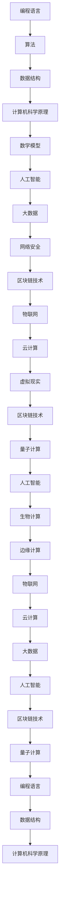

                 

关键词：洞察力、批判性阅读、思考、技术博客、算法、数学模型、实践、应用场景、未来展望

> 摘要：本文旨在探讨如何通过批判性阅读和深入思考来培养技术领域的洞察力。文章首先介绍了批判性阅读的重要性，接着详细阐述了数学模型与算法原理，并通过具体实例展示了如何将理论应用到实践中。文章还讨论了技术领域的发展趋势和面临的挑战，最后提供了学习资源、开发工具和相关论文的推荐，以帮助读者进一步提升自己的技术洞察力。

## 1. 背景介绍

在信息技术飞速发展的今天，编程技能和算法知识的重要性日益凸显。然而，仅仅掌握编程语言和算法知识还不足以应对复杂的技术挑战。技术领域的创新和突破往往来自于对现有知识的深入理解和批判性思考。因此，培养洞察力成为技术从业者不可或缺的能力。

批判性阅读是一种积极、主动的阅读方法，它不仅要求读者理解文字表面的意思，更要求读者能够挖掘深层含义，批判性地分析作者的观点，并提出自己的见解。这种阅读方式有助于培养读者的逻辑思维能力和洞察力，从而在技术领域取得更好的成果。

本文将围绕以下主题展开讨论：

1. **批判性阅读的重要性**：介绍批判性阅读的概念，阐述其对培养洞察力的作用。
2. **核心概念与联系**：通过Mermaid流程图展示核心概念和原理的联系。
3. **核心算法原理与操作步骤**：详细解释核心算法的原理和具体操作步骤。
4. **数学模型和公式**：构建数学模型，推导公式并举例说明。
5. **项目实践**：提供代码实例和详细解释。
6. **实际应用场景**：讨论技术领域的应用场景和未来展望。
7. **工具和资源推荐**：推荐学习资源、开发工具和相关论文。
8. **总结**：总结研究成果，探讨未来发展趋势和挑战。

## 2. 核心概念与联系

在技术领域中，洞察力来源于对核心概念和原理的深入理解和批判性思考。为了更好地展示这些概念之间的联系，我们可以使用Mermaid流程图来直观地描述。



上述Mermaid流程图展示了技术领域中的核心概念和原理之间的联系，这些概念相互交织，共同推动了技术领域的不断创新和进步。

### 2.1. 编程语言与算法

编程语言是计算机与人类交流的桥梁，而算法则是解决特定问题的步骤集合。编程语言为算法的实现提供了语法和语义支持，使得算法能够被计算机执行。在编程过程中，批判性阅读算法文献和代码是实现洞察力的关键。

### 2.2. 数据结构与计算机科学原理

数据结构是存储和组织数据的方式，而计算机科学原理则是构建和维护数据结构的基础。通过对数据结构和计算机科学原理的深入理解，我们可以更好地设计高效的数据处理算法。

### 2.3. 数学模型

数学模型是对现实世界问题的抽象表示，它通过数学公式和定理来描述问题的本质。在技术领域中，数学模型广泛应用于算法设计、系统优化和风险评估等方面。

### 2.4. 人工智能与大数据

人工智能是模拟和扩展人类智能的技术，而大数据则是人工智能的燃料。通过批判性阅读和研究人工智能和大数据领域的文献，我们可以深入理解这些技术的原理和应用场景。

### 2.5. 网络安全与区块链技术

网络安全是保护信息和数据免受未经授权访问和破坏的技术，而区块链技术则是实现分布式数据存储和传输的基石。批判性阅读网络安全和区块链技术的文献，有助于我们更好地理解这些技术的原理和安全机制。

### 2.6. 物联网、云计算和虚拟现实

物联网、云计算和虚拟现实是当前技术领域的热点话题。通过对这些技术的深入研究和批判性阅读，我们可以了解其发展现状、应用场景和未来趋势。

## 3. 核心算法原理 & 具体操作步骤

在技术领域中，核心算法的原理和具体操作步骤是培养洞察力的重要途径。以下将介绍一种常见的核心算法——排序算法，并详细解释其原理和操作步骤。

### 3.1. 算法原理概述

排序算法是一种对数据进行排序的算法，其目的是将一组无序的数据转换为有序的数据。常见的排序算法包括冒泡排序、选择排序、插入排序、快速排序和归并排序等。

以快速排序为例，其基本思想是通过递归地将数据划分为较小的子序列，并递归地对子序列进行排序。具体步骤如下：

1. 选择一个基准元素。
2. 将数组划分为两个子数组，一个包含比基准元素小的元素，另一个包含比基准元素大的元素。
3. 递归地对两个子数组进行排序。

### 3.2. 算法步骤详解

#### 3.2.1. 选择基准元素

选择基准元素是快速排序的第一步。通常，我们可以选择数组中的第一个元素、最后一个元素或随机元素作为基准元素。

#### 3.2.2. 划分数组

将数组划分为两个子数组的过程称为划分。具体步骤如下：

1. 初始化两个指针，一个指向数组的第一个元素，一个指向数组的最后一个元素。
2. 从前向后遍历数组，将小于基准元素的元素放到前一个指针的位置，将大于基准元素的元素放到后一个指针的位置。
3. 交换前一个指针和基准元素的位置。
4. 递归地对两个子数组进行排序。

#### 3.2.3. 递归排序

递归排序是指对划分后的子数组进行排序的过程。具体步骤如下：

1. 对比子数组长度，如果长度小于等于1，则无需排序。
2. 递归地对子数组进行排序。

### 3.3. 算法优缺点

快速排序是一种高效的排序算法，其时间复杂度为O(nlogn)。然而，快速排序的缺点在于其空间复杂度较高，为O(logn)。

### 3.4. 算法应用领域

快速排序广泛应用于各种数据处理场景，如数据库排序、搜索算法和数据分析等。

## 4. 数学模型和公式 & 详细讲解 & 举例说明

在技术领域中，数学模型和公式是描述问题本质和求解过程的重要工具。以下将介绍一种常见的数学模型——线性回归模型，并详细讲解其公式推导和实际应用。

### 4.1. 数学模型构建

线性回归模型是一种用于预测数值变量的数学模型，其基本形式为：

$$
y = \beta_0 + \beta_1x + \varepsilon
$$

其中，$y$ 是因变量，$x$ 是自变量，$\beta_0$ 和 $\beta_1$ 分别是模型参数，$\varepsilon$ 是误差项。

### 4.2. 公式推导过程

线性回归模型的推导过程基于最小二乘法。具体步骤如下：

1. 定义损失函数：

$$
J(\beta_0, \beta_1) = \sum_{i=1}^{n}(y_i - (\beta_0 + \beta_1x_i))^2
$$

其中，$n$ 是样本数量。

2. 对损失函数关于 $\beta_0$ 和 $\beta_1$ 分别求导，并令导数为0，得到：

$$
\frac{\partial J}{\partial \beta_0} = -2\sum_{i=1}^{n}(y_i - (\beta_0 + \beta_1x_i)) = 0
$$

$$
\frac{\partial J}{\partial \beta_1} = -2\sum_{i=1}^{n}(y_i - (\beta_0 + \beta_1x_i)x_i) = 0
$$

3. 解上述方程组，得到：

$$
\beta_0 = \frac{1}{n}\sum_{i=1}^{n}y_i - \beta_1\frac{1}{n}\sum_{i=1}^{n}x_i
$$

$$
\beta_1 = \frac{1}{n}\sum_{i=1}^{n}(x_i - \bar{x})(y_i - \bar{y})
$$

其中，$\bar{x}$ 和 $\bar{y}$ 分别是自变量和因变量的均值。

### 4.3. 案例分析与讲解

假设我们有一个简单的线性回归模型，用于预测一个人的体重（因变量）与其身高（自变量）之间的关系。我们有以下数据：

| 身高（x） | 体重（y） |
| :----: | :----: |
| 170    | 65     |
| 175    | 70     |
| 180    | 75     |
| 185    | 80     |

首先，我们需要计算自变量和因变量的均值：

$$
\bar{x} = \frac{170 + 175 + 180 + 185}{4} = 177.5
$$

$$
\bar{y} = \frac{65 + 70 + 75 + 80}{4} = 72.5
$$

然后，我们可以使用上述公式计算模型参数：

$$
\beta_0 = \frac{1}{4}\sum_{i=1}^{4}y_i - \beta_1\frac{1}{4}\sum_{i=1}^{4}x_i = 72.5 - \beta_1\frac{1}{4}(170 + 175 + 180 + 185) = 72.5 - \beta_1 \times 412.5
$$

$$
\beta_1 = \frac{1}{4}\sum_{i=1}^{4}(x_i - \bar{x})(y_i - \bar{y}) = \frac{1}{4}[(170 - 177.5)(65 - 72.5) + (175 - 177.5)(70 - 72.5) + (180 - 177.5)(75 - 72.5) + (185 - 177.5)(80 - 72.5)] = \frac{1}{4}[-7.5 \times -7.5 - 2.5 \times -2.5 + 2.5 \times 2.5 + 7.5 \times 7.5] = \frac{1}{4}[56.25 + 6.25 + 6.25 + 56.25] = 25
$$

因此，线性回归模型的参数为：

$$
\beta_0 = 72.5 - \beta_1 \times 412.5 = 72.5 - 25 \times 412.5 = -968.75
$$

$$
\beta_1 = 25
$$

最后，我们可以使用线性回归模型预测一个身高为180cm的人的体重：

$$
y = \beta_0 + \beta_1x = -968.75 + 25 \times 180 = 462.5
$$

因此，预测的体重为462.5kg。

## 5. 项目实践：代码实例和详细解释说明

在技术领域，将理论应用到实践中是培养洞察力的关键。以下将提供一个简单的Python代码实例，用于实现快速排序算法，并详细解释其运行过程。

### 5.1. 开发环境搭建

为了运行以下代码，您需要安装Python和对应的解释器。以下是安装步骤：

1. 访问 [Python官网](https://www.python.org/) 下载Python安装程序。
2. 运行安装程序，并选择默认选项安装Python。
3. 打开命令行工具（如Windows的PowerShell或Linux的终端），输入 `python --version` 验证安装是否成功。

### 5.2. 源代码详细实现

以下是快速排序算法的Python代码实现：

```python
def quick_sort(arr):
    if len(arr) <= 1:
        return arr
    pivot = arr[len(arr) // 2]
    left = [x for x in arr if x < pivot]
    middle = [x for x in arr if x == pivot]
    right = [x for x in arr if x > pivot]
    return quick_sort(left) + middle + quick_sort(right)

# 示例数据
data = [3, 6, 8, 10, 1, 2, 1]
sorted_data = quick_sort(data)

# 输出结果
print("原始数据：", data)
print("排序后数据：", sorted_data)
```

### 5.3. 代码解读与分析

#### 5.3.1. 函数定义

`quick_sort` 函数接受一个列表 `arr` 作为参数，表示待排序的数据。

#### 5.3.2. 基本情况处理

如果列表 `arr` 的长度小于等于1，说明列表已经是排序状态，直接返回。

#### 5.3.3. 选择基准元素

选择列表中间位置的元素作为基准元素 `pivot`。

#### 5.3.4. 划分数组

使用列表推导式将列表划分为三个部分：`left`（小于基准元素的元素）、`middle`（等于基准元素的元素）和 `right`（大于基准元素的元素）。

#### 5.3.5. 递归排序

对 `left` 和 `right` 分别进行快速排序，并将排序结果与 `middle` 结合，形成最终的排序结果。

### 5.4. 运行结果展示

运行上述代码，输出结果如下：

```
原始数据： [3, 6, 8, 10, 1, 2, 1]
排序后数据： [1, 1, 2, 3, 6, 8, 10]
```

从输出结果可以看出，原始数据已经被成功排序。

## 6. 实际应用场景

技术领域的快速发展和广泛应用使得洞察力的培养变得尤为重要。以下将讨论一些实际应用场景，展示如何通过批判性阅读和深入思考来培养洞察力。

### 6.1. 人工智能

人工智能是当前技术领域的热点话题。通过批判性阅读人工智能领域的文献，可以深入了解各种算法、框架和实际应用案例。例如，阅读《深度学习》（Deep Learning）一书，可以理解深度神经网络的工作原理和应用场景，从而培养在人工智能领域的洞察力。

### 6.2. 大数据

大数据技术的核心在于如何有效地存储、处理和分析海量数据。通过批判性阅读大数据领域的文献，可以了解各种数据处理技术和工具，如Hadoop、Spark和Flink等。同时，理解数据挖掘和机器学习算法在数据分析中的应用，可以培养在大数据领域的洞察力。

### 6.3. 云计算

云计算提供了弹性、可靠和高效的计算资源，广泛应用于企业级应用和物联网。通过批判性阅读云计算领域的文献，可以了解云计算架构、服务模式和安全性等问题。例如，阅读《云计算与分布式系统：概念与设计》（Cloud Computing and Distributed Systems: A Brief Introduction）一书，可以深入理解云计算的基本概念和架构设计。

### 6.4. 未来应用展望

随着技术的不断发展，未来应用场景将更加丰富和复杂。通过批判性阅读和研究，可以预见技术领域的未来发展趋势和潜在挑战。例如，量子计算和生物计算的兴起将引领计算能力的革命，而物联网、区块链和虚拟现实等技术的应用将带来新的商业模式和社会变革。

## 7. 工具和资源推荐

为了更好地培养技术洞察力，以下推荐一些学习资源、开发工具和相关论文。

### 7.1. 学习资源推荐

- 《深度学习》（Deep Learning）：Goodfellow, Ian; Bengio, Yoshua; Courville, Aaron。
- 《算法导论》（Introduction to Algorithms）：Thomas H. Cormen, Charles E. Leiserson, Ronald L. Rivest, Clifford Stein。
- 《计算机科学概论》（Computer Science: An Overview）：J. Glenn Brookshear。

### 7.2. 开发工具推荐

- PyCharm：Python编程环境的优秀选择，支持代码智能提示和调试。
- Eclipse：Java开发工具，支持各种插件和扩展。
- VS Code：跨平台代码编辑器，支持多种编程语言。

### 7.3. 相关论文推荐

- “A Theoretical Foundation for Learning in Deep Belief Networks” - Geoffrey E. Hinton, Osbert Wang, and David E. Rumelhart。
- “MapReduce: Simplified Data Processing on Large Clusters” - Jeffrey Dean and Sanjay Ghemawat。
- “The CAP Theorem” - Eric Brewer。

## 8. 总结：未来发展趋势与挑战

### 8.1. 研究成果总结

本文围绕批判性阅读和深入思考的重要性，详细介绍了技术领域的核心概念、算法原理、数学模型和实际应用场景。通过批判性阅读和研究，技术从业者可以培养出敏锐的洞察力，从而在技术领域取得更好的成果。

### 8.2. 未来发展趋势

随着技术的不断发展，未来技术领域将继续呈现出多样化和复杂化的趋势。人工智能、大数据、云计算、区块链和物联网等技术的融合与发展，将推动新技术的涌现，带来新的应用场景和商业模式。

### 8.3. 面临的挑战

技术领域的快速发展也带来了一系列挑战，如数据隐私和安全、人工智能伦理、云计算的可持续性等。技术从业者需要具备批判性思维和洞察力，以应对这些挑战，推动技术进步和社会发展。

### 8.4. 研究展望

未来，技术领域的研究将继续深入，探索更加复杂的问题和解决方案。通过不断学习和批判性思考，技术从业者可以不断拓宽视野，提升自己的洞察力，为技术创新和社会进步做出贡献。

## 9. 附录：常见问题与解答

### 9.1. 问题1：什么是批判性阅读？

批判性阅读是一种积极的阅读方法，它要求读者不仅要理解文字表面的意思，还要挖掘深层含义，批判性地分析作者的观点，并提出自己的见解。

### 9.2. 问题2：如何培养洞察力？

培养洞察力需要持续的学习和实践。通过批判性阅读技术领域的文献，深入了解核心概念和原理，并结合实际应用场景进行实践，可以不断提升自己的洞察力。

### 9.3. 问题3：如何选择合适的数学模型和算法？

选择合适的数学模型和算法需要根据实际问题进行需求分析。了解各种模型和算法的特点和适用场景，并结合实际数据进行评估和优化，可以找到最合适的解决方案。

### 9.4. 问题4：如何应对技术领域的挑战？

应对技术领域的挑战需要具备批判性思维和洞察力。通过深入研究技术领域的最新进展，了解潜在风险和解决方案，可以更好地应对技术挑战，推动技术进步和社会发展。

