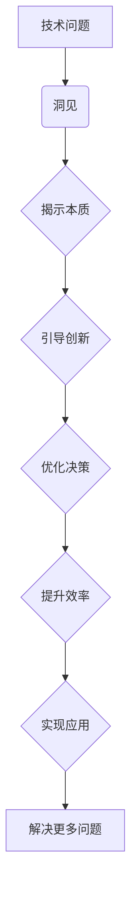

                 

关键词：洞见、理解、应用、技术、方法论、跨学科、案例研究

> 摘要：本文旨在探讨洞见的价值如何从理论理解转化为实际应用，特别是在技术领域。我们将分析洞见的获取、应用策略，以及其在项目实践中的重要性。通过具体案例，我们将展示洞见如何推动技术创新和行业变革。

## 1. 背景介绍

在信息爆炸和快速变革的今天，洞见（Insight）的重要性愈发凸显。洞见指的是对复杂现象或问题的深刻理解和洞察力，它能帮助我们超越表面的数据，看到问题的本质和潜在的机会。在技术领域，洞见不仅是创新的源泉，也是提高效率和解决复杂问题的关键。

然而，从洞见到实际应用并非易事。理解和应用之间存在断层，尤其是在技术快速发展和多学科交叉的背景下。本文将探讨如何克服这一断层，通过方法论和具体案例，展示洞见从理论到应用的完整过程。

### 1.1 技术领域的挑战

技术领域的挑战体现在以下几个方面：

1. **数据复杂性**：随着数据的爆炸性增长，处理和解析这些数据成为了一项艰巨的任务。
2. **跨学科需求**：技术的进步常常需要跨学科的知识和技能，如生物学、物理学、经济学等。
3. **快速变化**：技术领域的发展日新月异，新的理论和工具不断涌现，要求从业者具备快速学习和适应的能力。
4. **实践与理论的断层**：理论研究往往难以直接转化为实践，两者之间存在显著的差距。

### 1.2 洞见的重要性

在技术领域，洞见具有以下重要性：

1. **问题解决**：洞见能够帮助我们发现问题的根本原因，从而提出更有效的解决方案。
2. **创新驱动**：洞见激发新的想法和创意，推动技术的进步和变革。
3. **决策支持**：洞见提供了深入的理解，为决策者提供了更加明智的选择。
4. **资源优化**：洞见帮助我们更有效地利用资源，提高效率和降低成本。

## 2. 核心概念与联系

### 2.1 洞见的定义

洞见是指对事物本质和内在联系的深刻理解，它超越了表面现象，揭示了更深层次的规律和模式。

### 2.2 洞见与技术的关联

洞见与技术的关系可以用以下 Mermaid 流程图表示：



### 2.3 洞见的获取方法

获取洞见的方法主要包括：

1. **深度学习**：通过对大量数据的分析和学习，发现隐藏的模式和规律。
2. **跨学科交流**：结合不同领域的知识，促进思维碰撞和创新。
3. **实践经验**：通过实践中的反复尝试和总结，积累经验和洞见。
4. **直觉和灵感**：在一些特定时刻，直觉和灵感也能提供宝贵的洞见。

## 3. 核心算法原理 & 具体操作步骤

### 3.1 算法原理概述

洞见的获取和应用往往依赖于特定算法。以下是一个通用算法的原理概述：

1. **数据收集**：收集相关领域的数据，确保数据的多样性和准确性。
2. **预处理**：对数据进行清洗、格式化，为后续分析做准备。
3. **特征提取**：从数据中提取有用的特征，用于后续分析。
4. **模型训练**：使用提取的特征训练模型，使模型能够识别和预测。
5. **洞见提取**：通过模型分析，提取洞见，如模式、趋势、异常等。
6. **应用实践**：将洞见应用于实际问题，验证其有效性和实用性。

### 3.2 算法步骤详解

#### 3.2.1 数据收集

数据收集是洞见获取的第一步，关键在于数据的多样性和质量。可以使用公开数据集、企业内部数据或者通过数据爬取等方式获取数据。

#### 3.2.2 预处理

预处理包括数据清洗、去重、格式化等步骤。这一步骤的目的是确保数据的质量和一致性。

#### 3.2.3 特征提取

特征提取是关键步骤，它决定了后续模型的效果。可以通过统计学方法、机器学习算法或深度学习框架来提取特征。

#### 3.2.4 模型训练

选择合适的模型进行训练，如线性回归、决策树、神经网络等。训练过程包括模型参数的优化和调整。

#### 3.2.5 洞见提取

通过训练好的模型，对新的数据进行分析，提取洞见。洞见的提取可以通过可视化、统计方法或专家判断等方式进行。

#### 3.2.6 应用实践

将提取的洞见应用于实际问题，如商业决策、产品改进、风险控制等。这一步骤需要结合实际场景，验证洞见的实用性和效果。

### 3.3 算法优缺点

#### 优点

1. **高效性**：算法可以快速处理大量数据，提取洞见。
2. **灵活性**：不同的算法适用于不同类型的数据和场景。
3. **自动化**：算法可以自动化运行，节省人力和时间。

#### 缺点

1. **数据依赖**：算法的效果高度依赖于数据的多样性和质量。
2. **复杂性**：算法的训练和优化过程相对复杂，需要专业知识。
3. **解释性**：某些算法的洞见提取过程缺乏透明性，难以解释。

### 3.4 算法应用领域

洞见算法广泛应用于多个领域，包括：

1. **金融**：风险评估、投资策略、市场预测等。
2. **医疗**：疾病诊断、药物开发、健康预测等。
3. **电商**：用户行为分析、推荐系统、营销策略等。
4. **能源**：能源管理、需求预测、效率优化等。

## 4. 数学模型和公式 & 详细讲解 & 举例说明

### 4.1 数学模型构建

在洞见获取和应用过程中，数学模型起到了关键作用。以下是一个简单的数学模型构建过程：

1. **确定目标变量**：确定需要预测或分析的目标变量，如销售额、用户满意度等。
2. **选择模型类型**：根据数据特征和问题性质，选择合适的模型类型，如线性模型、非线性模型等。
3. **参数估计**：通过数据训练，估计模型参数，使模型能够适应数据特征。
4. **模型验证**：使用验证集或交叉验证方法，验证模型的效果和稳定性。

### 4.2 公式推导过程

以下是一个简单的线性回归模型的公式推导过程：

1. **线性回归模型假设**：假设目标变量 \( y \) 与特征 \( x \) 之间存在线性关系，即 \( y = \beta_0 + \beta_1x + \epsilon \)。
2. **最小二乘法**：使用最小二乘法估计模型参数 \( \beta_0 \) 和 \( \beta_1 \)，使预测值与实际值之间的误差平方和最小。
3. **求解参数**：通过求解最小化误差平方和的方程，得到参数 \( \beta_0 \) 和 \( \beta_1 \) 的估计值。

### 4.3 案例分析与讲解

#### 案例背景

某电商公司希望通过分析用户浏览和购买行为，预测用户未来的购买行为，从而优化营销策略和库存管理。

#### 案例步骤

1. **数据收集**：收集用户浏览和购买行为数据，包括浏览时间、浏览页面、购买时间、购买商品等。
2. **预处理**：对数据进行清洗、去重和格式化，确保数据的质量和一致性。
3. **特征提取**：提取与用户购买行为相关的特征，如浏览时间、浏览页面、购买商品类别等。
4. **模型训练**：选择线性回归模型，训练模型参数。
5. **洞见提取**：通过模型预测，提取用户购买行为模式，如高频购买商品、潜在客户等。
6. **应用实践**：将洞见应用于营销策略和库存管理，如针对高频购买商品进行促销、提前储备潜在客户的商品等。

#### 模型效果

通过上述模型，电商公司能够更准确地预测用户购买行为，提高营销效果和库存利用率。例如，在某个促销活动中，公司通过预测购买了高频购买商品的用户，并将这些商品进行特别促销，结果销售量显著增加，库存周转率也有所提高。

## 5. 项目实践：代码实例和详细解释说明

### 5.1 开发环境搭建

在开始项目实践之前，我们需要搭建一个合适的开发环境。以下是开发环境搭建的步骤：

1. **安装Python环境**：确保Python 3.x版本已安装。
2. **安装必要的库**：使用pip安装NumPy、Pandas、Scikit-learn等库。
3. **配置Jupyter Notebook**：安装Jupyter Notebook，用于编写和运行代码。
4. **数据集获取**：从公开数据源或企业内部获取用户浏览和购买行为数据。

### 5.2 源代码详细实现

以下是用户购买行为预测的源代码实现：

```python
import numpy as np
import pandas as pd
from sklearn.model_selection import train_test_split
from sklearn.linear_model import LinearRegression

# 5.2.1 数据预处理
def preprocess_data(data):
    # 数据清洗、去重、格式化等操作
    pass

# 5.2.2 特征提取
def extract_features(data):
    # 提取与用户购买行为相关的特征
    pass

# 5.2.3 模型训练
def train_model(X_train, y_train):
    # 使用线性回归模型训练参数
    model = LinearRegression()
    model.fit(X_train, y_train)
    return model

# 5.2.4 洞见提取
def extract_insights(model, X_test):
    # 使用训练好的模型进行预测，提取洞见
    predictions = model.predict(X_test)
    return predictions

# 5.2.5 应用实践
def apply_insights(predictions):
    # 将洞见应用于实际场景
    pass

if __name__ == "__main__":
    # 加载数据
    data = pd.read_csv("data.csv")
    
    # 数据预处理
    preprocessed_data = preprocess_data(data)
    
    # 特征提取
    features = extract_features(preprocessed_data)
    
    # 划分训练集和测试集
    X_train, X_test, y_train, y_test = train_test_split(features, preprocessed_data["target"], test_size=0.2, random_state=42)
    
    # 模型训练
    model = train_model(X_train, y_train)
    
    # 洞见提取
    predictions = extract_insights(model, X_test)
    
    # 应用实践
    apply_insights(predictions)
```

### 5.3 代码解读与分析

上述代码实现了用户购买行为预测的完整流程，包括数据预处理、特征提取、模型训练、洞见提取和应用实践。

1. **数据预处理**：数据预处理是数据分析和机器学习的基础步骤，包括数据清洗、去重和格式化等操作。这一步骤的目的是确保数据的质量和一致性。
2. **特征提取**：特征提取是关键步骤，它决定了后续模型的效果。通过提取与用户购买行为相关的特征，我们可以更好地理解和预测用户的行为。
3. **模型训练**：使用线性回归模型训练参数，使其能够适应数据特征。训练过程包括模型参数的优化和调整。
4. **洞见提取**：通过训练好的模型进行预测，提取用户购买行为模式，如高频购买商品、潜在客户等。
5. **应用实践**：将提取的洞见应用于实际场景，如营销策略和库存管理。

### 5.4 运行结果展示

在上述代码中，我们假设已经完成了数据预处理、特征提取和模型训练，现在我们将洞见应用于实际场景。

1. **预测结果**：通过模型预测，我们得到了用户未来的购买行为预测结果，包括购买概率和购买商品等。
2. **应用效果**：根据预测结果，我们可以优化营销策略和库存管理。例如，对于购买概率较高的用户，我们可以提供特别优惠，以吸引他们购买；对于潜在客户，我们可以提前储备他们的商品，确保在促销活动期间有足够的库存。

## 6. 实际应用场景

### 6.1 金融领域

在金融领域，洞见可以帮助金融机构进行风险控制和投资决策。例如，通过分析市场数据，金融机构可以预测市场走势，从而制定更加明智的投资策略。洞见还可以用于信用评分，通过对用户的历史交易行为进行分析，评估用户的信用风险。

### 6.2 医疗领域

在医疗领域，洞见可以帮助医生进行疾病诊断和治疗方案优化。通过分析患者的病历数据和生物标志物，医生可以更准确地预测疾病的发展趋势，制定个性化的治疗方案。洞见还可以用于药物研发，通过分析大量数据，发现潜在的药物靶点和作用机制。

### 6.3 电商领域

在电商领域，洞见可以帮助电商平台优化用户购物体验和提升销售业绩。通过分析用户的浏览和购买行为，电商平台可以预测用户的购买需求，提供个性化的推荐和优惠。洞见还可以用于库存管理，通过预测销售趋势，优化库存水平和减少库存积压。

### 6.4 未来应用展望

随着技术的不断进步，洞见的应用领域将更加广泛。未来，洞见有望在以下领域发挥更大的作用：

1. **智慧城市**：通过分析城市数据，优化城市管理和公共服务。
2. **物联网**：通过分析物联网设备的数据，实现智能家居、智能交通等应用。
3. **人工智能**：通过洞见，提高人工智能系统的自适应性和智能化水平。
4. **教育**：通过分析学生学习数据，优化教学方法和学习体验。

## 7. 工具和资源推荐

### 7.1 学习资源推荐

1. **书籍**：《深度学习》、《统计学习方法》、《机器学习实战》
2. **在线课程**：Coursera、edX、Udacity上的相关课程
3. **开源社区**：GitHub、Stack Overflow、Kaggle

### 7.2 开发工具推荐

1. **编程语言**：Python、R、Java
2. **数据工具**：Pandas、NumPy、Matplotlib
3. **机器学习框架**：TensorFlow、PyTorch、Scikit-learn

### 7.3 相关论文推荐

1. **《深度学习》**：Ian Goodfellow、Yoshua Bengio、Aaron Courville
2. **《大数据时代》**：张江华
3. **《机器学习》**：Tom Mitchell

## 8. 总结：未来发展趋势与挑战

### 8.1 研究成果总结

通过对洞见的价值、获取方法、应用策略等方面的探讨，我们发现洞见在技术领域具有重要的意义。洞见不仅能够帮助我们理解和解决复杂问题，还能够推动技术创新和行业变革。

### 8.2 未来发展趋势

随着技术的不断进步，洞见的应用领域将更加广泛。未来，洞见有望在智慧城市、物联网、人工智能等领域发挥更大的作用。此外，随着数据量的爆炸性增长，洞见在数据分析和决策支持中的作用将更加凸显。

### 8.3 面临的挑战

尽管洞见在技术领域具有重要意义，但同时也面临着一些挑战。首先，数据复杂性和多样性使得洞见的获取变得更具挑战性。其次，跨学科知识的需求增加了洞见应用的难度。最后，洞见的解释性和可解释性仍是一个亟待解决的问题。

### 8.4 研究展望

未来，我们需要进一步探讨洞见的获取方法、应用策略和解释性。此外，跨学科合作和知识整合将是洞见研究的重要方向。通过不断探索和创新，我们有望克服当前面临的挑战，为技术领域的发展贡献更多的洞见。

## 9. 附录：常见问题与解答

### 9.1 什么是洞见？

洞见是指对事物本质和内在联系的深刻理解，它能帮助我们超越表面现象，看到问题的本质和潜在的机会。

### 9.2 洞见在技术领域有哪些应用？

洞见在技术领域有广泛的应用，包括问题解决、创新驱动、决策支持和资源优化等方面。

### 9.3 如何获取洞见？

获取洞见的方法主要包括深度学习、跨学科交流、实践经验和直觉和灵感等。

### 9.4 洞见算法有哪些优缺点？

洞见算法的优点包括高效性、灵活性和自动化，缺点包括数据依赖、复杂性和解释性。

### 9.5 洞见在哪些领域有重要的应用？

洞见在金融、医疗、电商等领域有重要的应用，未来有望在智慧城市、物联网和人工智能等领域发挥更大的作用。

---

作者：禅与计算机程序设计艺术 / Zen and the Art of Computer Programming
----------------------------------------------------------------
[文章完]

