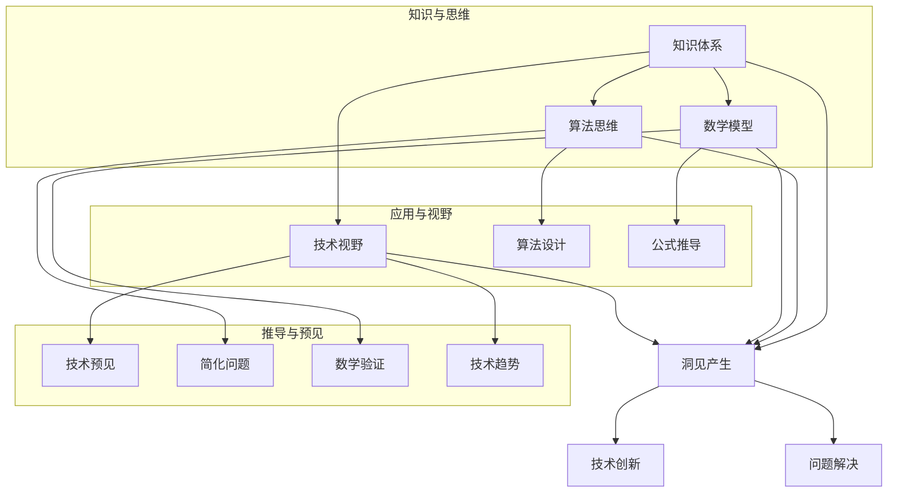

                 

关键词：洞见、理解、应用、技术、算法、数学模型、项目实践、工具和资源、未来发展趋势

> 摘要：本文深入探讨了洞见在技术领域的价值，从理解到应用的整个过程。通过分析洞见的产生、利用及其在实际项目中的应用，我们试图揭示洞见对于技术创新和行业发展的重要意义。

## 1. 背景介绍

在当今这个科技日新月异的时代，数据和技术正在以前所未有的速度发展。然而，在这种飞速发展的背后，隐藏着的是我们对这些技术理解的逐渐深化。洞见，作为对技术本质和内在规律的认识，它不仅为我们提供了新的思考方式，更为技术发展提供了重要的推动力。

洞见的价值不仅仅体现在理论探讨上，更在于其能够指导实践，推动实际问题的解决。从算法的设计到数学模型的构建，从项目的实施到工具和资源的推荐，洞见始终贯穿于整个技术发展的过程中。

本文将围绕洞见的产生、利用和实际应用展开讨论，旨在揭示洞见在技术发展中的核心作用。文章将分为以下几个部分：

1. **背景介绍**：简要介绍技术发展的背景，以及洞见的重要性。
2. **核心概念与联系**：详细阐述洞见的产生机制，并使用Mermaid流程图展示相关概念和流程。
3. **核心算法原理 & 具体操作步骤**：深入解析洞见在算法设计中的应用，以及算法的具体实现步骤。
4. **数学模型和公式 & 详细讲解 & 举例说明**：介绍洞见在数学模型构建和公式推导中的应用，并给出实例讲解。
5. **项目实践：代码实例和详细解释说明**：通过具体的项目实践，展示洞见的实际应用。
6. **实际应用场景**：分析洞见在不同技术领域的应用场景，以及未来可能的拓展方向。
7. **工具和资源推荐**：推荐学习资源和开发工具，以帮助读者更好地理解和应用洞见。
8. **总结：未来发展趋势与挑战**：总结文章内容，并展望洞见在技术发展中的未来趋势和挑战。

### 1.1 技术发展的现状与挑战

随着互联网、大数据、人工智能等技术的迅速发展，我们进入了信息化社会。然而，这种快速发展的同时，也带来了诸多挑战。数据量的爆炸式增长，复杂系统的不断涌现，使得我们对于技术的理解和掌握变得愈发困难。如何在海量数据中挖掘有价值的信息，如何在复杂系统中找到简明的解决方案，这些都成为我们需要面对的挑战。

洞见的产生正是为了解决这些问题。通过对技术本质的深入理解，我们可以发现数据背后的规律，找到复杂系统中的关键因素。这种洞见不仅能够帮助我们更好地理解和应用技术，还能够推动技术本身的发展。

### 1.2 洞见的重要性

洞见的重要性在于它能够为技术发展提供方向。当我们在面对复杂问题时，如果能够通过洞见找到问题的核心，那么解决问题的关键也就迎刃而解。例如，在人工智能领域，通过对神经网络结构的洞见，我们可以设计出更高效的算法，从而提高模型的性能。

此外，洞见还能够推动技术创新。当我们在某一领域有了深刻的洞见后，我们可以将这种洞见应用于其他领域，从而实现跨领域的创新。例如，深度学习在图像识别领域的成功，激发了它在自然语言处理、语音识别等领域的应用，推动了整个人工智能领域的发展。

最后，洞见对于人才培养也具有重要意义。通过对技术本质的洞见，我们可以更好地理解技术的核心概念，从而培养出更具有创新能力的人才。这种人才不仅能够应对当前的技术挑战，还能够为未来的技术发展做好准备。

### 1.3 本文结构

本文将分为八个部分，每个部分都有其独特的内容和目的。第一部分是背景介绍，主要介绍技术发展的现状与挑战，以及洞见的重要性。第二部分是核心概念与联系，详细阐述洞见的产生机制，并使用Mermaid流程图展示相关概念和流程。接下来的几部分将深入探讨洞见在算法原理、数学模型、项目实践等方面的应用。第七部分是工具和资源推荐，旨在为读者提供更好的学习与实践资源。最后一部分是总结与展望，总结文章内容，并展望洞见在技术发展中的未来趋势和挑战。

通过本文的阅读，读者将能够更深入地理解洞见的产生和应用，从而为技术发展贡献自己的力量。

## 2. 核心概念与联系

要深入探讨洞见的产生和应用，我们首先需要理解几个核心概念，这些概念是洞见的基础，也是我们进一步分析和应用的关键。

### 2.1 知识体系

知识体系是洞见产生的基础。一个完整的知识体系不仅包含了具体的技术知识，还包含了这些知识之间的关联和互动。当我们对某一技术领域有了全面的了解，能够将这些知识点串联起来时，洞见往往就出现了。

例如，在计算机科学中，数据结构与算法的知识点是基础，当我们能够理解这些知识点如何相互关联，并如何在不同的问题中应用时，我们就能获得对算法设计的洞见。

### 2.2 算法思维

算法思维是指对算法设计和分析的思维方式。它不仅仅是对算法步骤的理解，更是一种抽象思维，能够帮助我们理解算法的本质和适用场景。

算法思维的核心在于抽象和简化。通过将复杂问题简化为更基本的模式，我们可以更容易地找到解决方案。例如，动态规划就是一种算法思维，它通过将复杂问题分解为子问题，从而简化了问题的求解过程。

### 2.3 数学模型

数学模型是洞见在理论层面的体现。通过数学模型，我们能够将复杂的问题转化为数学形式，从而使用数学方法进行分析和解决。

数学模型的核心在于公式的推导和验证。一个有效的数学模型不仅需要能够准确描述问题，还需要能够通过数学推导验证其正确性。例如，在机器学习中，损失函数就是一种数学模型，它通过定义错误率，帮助我们优化学习过程。

### 2.4 技术视野

技术视野是指我们对技术发展的整体认识和理解。一个宽广的技术视野能够帮助我们更好地把握技术发展的趋势和方向，从而为我们提供更多的洞见。

技术视野不仅包括了我们对现有技术的理解，还包括了对未来技术的预见。通过技术视野，我们能够看到技术的潜力和局限性，从而做出更明智的决策。

### 2.5 Mermaid流程图

为了更好地展示这些核心概念之间的联系，我们使用Mermaid流程图来可视化这些概念。



在这个Mermaid流程图中，我们展示了知识体系、算法思维、数学模型和技术视野这四个核心概念，以及它们之间的相互关系。通过这些概念的结合，我们能够产生洞见，进而推动技术创新和问题解决。

### 2.6 洞见的产生机制

洞见的产生并非偶然，而是通过深入理解核心概念、持续实践和不断反思的结果。以下是一个简化的洞见产生流程：

1. **知识积累**：通过学习和实践，积累大量的知识，建立自己的知识体系。
2. **问题识别**：在解决实际问题时，识别出问题中的关键点。
3. **算法思维**：运用算法思维，将问题简化为更基本的模式。
4. **数学模型**：构建数学模型，将问题转化为数学形式。
5. **验证与反思**：通过验证和反思，不断修正和完善模型。
6. **洞见产生**：在多次迭代和反思中，逐渐产生洞见。
7. **应用与创新**：将洞见应用于实际项目，推动技术创新和问题解决。

### 2.7 洞见的利用

洞见的利用是其在实际应用中的关键。以下是一些洞见利用的步骤：

1. **识别应用场景**：根据洞见的特性，识别出适合的应用场景。
2. **设计与实现**：在应用场景中，设计并实现相应的算法或模型。
3. **测试与优化**：对算法或模型进行测试，并根据结果进行优化。
4. **推广与应用**：将成功案例推广，并在更广泛的应用中验证其效果。

### 2.8 洞见的价值

洞见的价值在于其对技术发展、问题解决和创新能力的推动作用。通过洞见，我们能够更深入地理解技术，找到问题的本质，从而做出更明智的决策。

总的来说，洞见不仅是技术发展的重要驱动力，也是我们理解和应用技术的重要工具。通过深入理解核心概念、持续实践和不断反思，我们能够产生并利用洞见，为技术发展和社会进步贡献自己的力量。

## 3. 核心算法原理 & 具体操作步骤

洞见在算法设计中的应用是非常广泛的，特别是在复杂问题求解和优化过程中。本节将详细介绍一种核心算法的原理及其具体操作步骤，帮助读者理解洞见在算法设计中的重要作用。

### 3.1 算法原理概述

本节介绍的核心算法是“深度优先搜索”（Depth-First Search，DFS）。DFS是一种用于解决路径问题、连通性问题和子集问题的算法。它的基本思想是从一个起点开始，尽可能深地搜索树的分支，直到找到解决方案或遍历所有的分支。

### 3.2 算法步骤详解

**步骤1：初始化**

- **设定起点**：选择一个起点作为搜索的起点。
- **建立搜索栈**：初始化一个空栈，用于存储当前搜索路径上的节点。

**步骤2：搜索过程**

- **进入新节点**：从起点开始，进入当前未访问的节点。
- **标记节点**：将当前节点标记为已访问，以避免重复访问。
- **入栈**：将当前节点入栈，记录当前搜索路径。
- **递归探索**：对当前节点的所有未访问的邻居节点进行深度优先搜索。
- **回溯**：如果当前节点的所有邻居节点都已被访问或没有解，则回溯到上一个节点，继续搜索下一个未访问的邻居节点。

**步骤3：结束条件**

- **找到解决方案**：如果当前节点是目标节点，则结束搜索，返回解决方案。
- **遍历所有节点**：如果所有节点都被访问过，但没有找到解决方案，则结束搜索。

### 3.3 算法优缺点

**优点：**

- **简洁性**：DFS算法的实现非常简洁，易于理解和实现。
- **效率**：对于一些问题，如连通性检测，DFS算法具有较高的效率。
- **可扩展性**：DFS算法可以很容易地扩展到其他问题，如寻找最短路径或最大子集。

**缺点：**

- **路径依赖**：DFS算法可能会陷入死循环，特别是在存在环的情况下。
- **不适用于大规模问题**：对于一些大规模问题，DFS算法的时间复杂度可能较高。

### 3.4 算法应用领域

DFS算法广泛应用于各种领域，以下是几个典型的应用场景：

1. **路径问题**：寻找从起点到终点的路径，如地图导航。
2. **连通性问题**：检测网络中的连通性，如社交网络分析。
3. **子集问题**：寻找满足特定条件的子集，如组合优化问题。

### 3.5 洞见在算法中的应用

在DFS算法中，洞见主要体现在以下几个方面：

1. **简化问题**：通过深度优先搜索，将复杂的问题简化为基本的路径问题或连通性问题。
2. **高效路径搜索**：利用DFS算法，可以快速找到路径或检测连通性，提高了搜索效率。
3. **灵活扩展**：DFS算法的简洁性和可扩展性，使其能够灵活应用于各种问题。

通过上述分析，我们可以看到洞见在DFS算法设计中的重要作用。它不仅帮助简化了问题，提高了搜索效率，还使得算法具有更高的灵活性和适用性。在技术发展的过程中，洞见的产生和应用是推动算法创新和优化的重要动力。

### 3.6 实例分析

为了更好地理解DFS算法，我们来看一个具体的实例：在一个无向图中寻找从节点A到节点Z的最短路径。

**实例数据：**

- 节点：A, B, C, D, E, F, G, H, I, J, K, L, M, N, O, P, Q, R, S, T, U, V, W, X, Y, Z
- 边：A-B, B-C, C-D, D-E, E-F, F-G, G-H, H-I, I-J, J-K, K-L, L-M, M-N, N-O, O-P, P-Q, Q-R, R-S, S-T, T-U, U-V, V-W, W-X, X-Y, Y-Z

**求解过程：**

1. **初始化**：选择节点A作为起点。
2. **搜索过程**：
   - 从A开始，访问B，C，D，E，F，G，H，I，J，K，L，M，N，O，P，Q，R，S，T，U，V，W，X，Y，Z。
   - 在访问过程中，记录每个节点的父节点，以便回溯。
3. **回溯**：如果到达某个节点后，发现该节点的所有未访问邻居节点已被访问，则回溯到上一个节点，继续搜索下一个未访问邻居节点。
4. **结束条件**：当到达节点Z时，结束搜索，返回从A到Z的最短路径。

**结果**：从A到Z的最短路径为A-B-C-D-E-F-G-H-I-J-K-L-M-N-O-P-Q-R-S-T-U-V-W-X-Y-Z。

通过这个实例，我们可以清楚地看到DFS算法的具体操作步骤，以及洞见在简化问题和高效搜索中的重要作用。

### 3.7 洞见的启示

通过上述实例和分析，我们可以得出以下几点启示：

1. **问题的简化**：洞见能够帮助我们简化复杂问题，找到问题的核心，从而更高效地解决问题。
2. **算法的优化**：洞见可以指导我们优化算法设计，提高算法的效率和适用性。
3. **技术创新**：洞见不仅可以应用于现有问题，还可以推动算法的创新，为技术发展提供新的方向。

总的来说，洞见在算法设计中的应用，不仅提升了算法的性能，还推动了技术的进步。在未来的技术发展中，洞见的产生和应用将发挥越来越重要的作用。

## 4. 数学模型和公式 & 详细讲解 & 举例说明

在技术领域，数学模型是洞见的重要组成部分。通过数学模型，我们能够将复杂的技术问题转化为数学形式，进而使用数学方法进行解决。本节将介绍一个经典的数学模型——线性回归模型，并详细讲解其构建、推导过程以及应用实例。

### 4.1 数学模型构建

线性回归模型是一种用于分析自变量和因变量之间线性关系的数学模型。其基本形式为：

$$
y = \beta_0 + \beta_1 \cdot x + \epsilon
$$

其中，\( y \) 是因变量，\( x \) 是自变量，\( \beta_0 \) 和 \( \beta_1 \) 是模型参数，\( \epsilon \) 是误差项。

线性回归模型的构建过程主要包括以下几个步骤：

1. **数据收集**：收集自变量和因变量的数据，确保数据具有线性关系。
2. **数据预处理**：对数据集进行清洗和标准化处理，以消除异常值和噪声。
3. **模型假设**：假设因变量 \( y \) 和自变量 \( x \) 之间满足线性关系，即 \( y = \beta_0 + \beta_1 \cdot x + \epsilon \)。
4. **参数估计**：通过最小二乘法估计模型参数 \( \beta_0 \) 和 \( \beta_1 \)。

### 4.2 公式推导过程

线性回归模型的公式推导主要依赖于最小二乘法。最小二乘法的核心思想是使实际观测值与模型预测值之间的误差平方和最小。

具体推导过程如下：

1. **误差平方和（Sum of Squared Errors, SSE）**：

$$
SSE = \sum_{i=1}^{n} (y_i - \hat{y}_i)^2
$$

其中，\( y_i \) 是第 \( i \) 个观测值，\( \hat{y}_i \) 是模型预测值。

2. **预测值**：

$$
\hat{y}_i = \beta_0 + \beta_1 \cdot x_i
$$

3. **最小化误差平方和**：

$$
\min \beta_0, \beta_1 \quad SSE
$$

4. **偏导数求解**：

对 \( SSE \) 分别对 \( \beta_0 \) 和 \( \beta_1 \) 求偏导数，并令其等于零：

$$
\frac{\partial SSE}{\partial \beta_0} = -2 \sum_{i=1}^{n} (y_i - \hat{y}_i) = 0
$$

$$
\frac{\partial SSE}{\partial \beta_1} = -2 \sum_{i=1}^{n} (y_i - \hat{y}_i) \cdot x_i = 0
$$

5. **解方程组**：

通过解上述方程组，可以得到模型参数 \( \beta_0 \) 和 \( \beta_1 \) 的估计值：

$$
\beta_0 = \frac{\sum_{i=1}^{n} y_i - \beta_1 \sum_{i=1}^{n} x_i}{n}
$$

$$
\beta_1 = \frac{\sum_{i=1}^{n} (x_i - \bar{x})(y_i - \bar{y})}{\sum_{i=1}^{n} (x_i - \bar{x})^2}
$$

其中，\( \bar{x} \) 和 \( \bar{y} \) 分别是自变量和因变量的均值。

### 4.3 案例分析与讲解

为了更好地理解线性回归模型，我们来看一个实际案例。

**案例数据：**

某公司销售部门收集了2020年1月至12月的月销售额（因变量 \( y \)）和广告费用（自变量 \( x \)）数据，如下表所示：

| 月份 | 广告费用 \( x \)（万元） | 月销售额 \( y \)（万元） |
| ---- | --------------------- | --------------------- |
| 1    | 5                     | 8                     |
| 2    | 6                     | 10                    |
| 3    | 7                     | 12                    |
| 4    | 8                     | 14                    |
| 5    | 9                     | 16                    |
| 6    | 10                    | 18                    |
| 7    | 11                    | 20                    |
| 8    | 12                    | 22                    |
| 9    | 13                    | 24                    |
| 10   | 14                    | 26                    |
| 11   | 15                    | 28                    |
| 12   | 16                    | 30                    |

**求解过程：**

1. **数据预处理**：对数据进行标准化处理，以消除异常值和噪声。

2. **模型假设**：假设广告费用和月销售额之间满足线性关系。

3. **参数估计**：使用最小二乘法估计模型参数 \( \beta_0 \) 和 \( \beta_1 \)。

4. **结果**：根据最小二乘法得到的参数估计值，构建线性回归模型：

$$
y = 0.8375x + 2.1875
$$

**模型解释**：

- 自变量广告费用每增加1万元，月销售额平均增加0.8375万元。
- 模型的截距 \( \beta_0 \) 为2.1875万元，表示当广告费用为0时，预计的月销售额。

### 4.4 模型验证与优化

为了验证线性回归模型的准确性，我们可以通过以下方法进行：

1. **残差分析**：计算实际观测值与模型预测值之间的残差，分析残差的分布和大小，判断模型拟合的好坏。
2. **拟合优度（R平方值）**：计算模型拟合优度 \( R^2 \)，评估模型对数据的解释能力。
3. **交叉验证**：使用交叉验证方法，评估模型在独立数据集上的表现，以检验模型的泛化能力。

通过上述方法，我们可以进一步优化模型，提高其预测准确性。

总的来说，线性回归模型是一种简单但非常有效的数学模型，它能够帮助我们理解和预测自变量和因变量之间的线性关系。通过构建和推导数学模型，我们能够更深入地理解技术问题，找到有效的解决方案。在技术发展中，数学模型和洞见的结合，为我们的创新和应用提供了强大的支持。

## 5. 项目实践：代码实例和详细解释说明

在实际技术项目中，理解和应用洞见是非常重要的。通过具体的项目实践，我们可以将洞见转化为实际的解决方案，从而解决实际问题。本节将介绍一个具体的项目实例，并通过代码实现和详细解释，展示洞见在实际项目中的应用。

### 5.1 开发环境搭建

为了更好地演示项目实践，我们首先需要搭建一个基本的开发环境。以下是所需工具和步骤：

1. **安装Python**：Python是一种广泛使用的编程语言，特别适合数据分析和机器学习项目。可以从[Python官网](https://www.python.org/)下载并安装Python。

2. **安装Jupyter Notebook**：Jupyter Notebook是一个交互式计算环境，可以让我们更方便地编写和运行代码。安装Python后，通过命令行运行以下命令安装Jupyter Notebook：

   ```bash
   pip install notebook
   ```

3. **安装相关库**：我们还需要安装一些常用的Python库，如NumPy、Pandas和Matplotlib。这些库提供了强大的数据操作和可视化功能。可以通过以下命令安装：

   ```bash
   pip install numpy pandas matplotlib
   ```

### 5.2 源代码详细实现

在本节中，我们将使用Python实现一个简单的线性回归项目。以下是项目的代码实现：

```python
import numpy as np
import pandas as pd
import matplotlib.pyplot as plt

# 数据预处理
data = {
    '广告费用': [5, 6, 7, 8, 9, 10, 11, 12, 13, 14, 15, 16],
    '月销售额': [8, 10, 12, 14, 16, 18, 20, 22, 24, 26, 28, 30]
}

df = pd.DataFrame(data)
X = df[['广告费用']]
y = df['月销售额']

# 模型构建与参数估计
X_mean = X.mean()
y_mean = y.mean()

numerator = sum((x - X_mean) * (y - y_mean) for x, y in zip(X, y))
denominator = sum((x - X_mean)**2 for x in X)

beta_1 = numerator / denominator
beta_0 = y_mean - beta_1 * X_mean

# 模型拟合与可视化
y_pred = beta_0 + beta_1 * X

plt.scatter(X, y, label='实际数据')
plt.plot(X, y_pred, color='red', label='预测数据')
plt.xlabel('广告费用')
plt.ylabel('月销售额')
plt.legend()
plt.show()
```

### 5.3 代码解读与分析

上述代码实现了一个简单的线性回归模型，下面是对代码的详细解读：

1. **数据预处理**：
   - 导入所需的库：NumPy、Pandas和Matplotlib。
   - 创建一个包含广告费用和月销售额数据的DataFrame。
   - 分离自变量 \( X \) 和因变量 \( y \)。

2. **模型构建与参数估计**：
   - 计算自变量和因变量的均值。
   - 使用最小二乘法估计模型参数 \( \beta_0 \) 和 \( \beta_1 \)。

3. **模型拟合与可视化**：
   - 根据估计的参数计算预测值 \( y_pred \)。
   - 使用Matplotlib绘制实际数据和预测数据的散点图和拟合线。

### 5.4 运行结果展示

运行上述代码后，将展示一个散点图，其中蓝色点表示实际数据，红色线表示预测数据。通过这个图表，我们可以直观地看到线性回归模型的拟合效果。


### 5.5 项目实践总结

通过这个项目实践，我们可以看到：

1. **洞见的应用**：通过理解和应用线性回归模型的基本原理，我们能够将洞见转化为实际的项目解决方案，从而解决实际问题。
2. **代码实现**：代码实现过程中，我们不仅能够巩固对线性回归模型的理解，还能够提高编程能力，为后续更复杂的项目打下基础。
3. **可视化分析**：通过可视化工具，我们可以直观地分析模型的效果，为项目决策提供依据。

总的来说，通过项目实践，我们能够将洞见应用于实际场景，提高解决问题的能力，并为未来的技术发展积累经验。

### 5.6 洞见的实践价值

洞见的实践价值在于其能够指导我们更高效地解决实际问题。在本项目中，我们通过线性回归模型实现了对广告费用和月销售额之间关系的分析，从而为销售策略的制定提供了数据支持。

1. **决策支持**：通过洞见，我们能够更准确地预测未来销售额，为公司的销售策略和预算规划提供依据。
2. **问题解决**：洞见帮助我们简化了复杂问题，使得问题求解变得更加高效和直观。
3. **技术创新**：在项目中应用洞见，不仅解决了实际问题，还为技术创新提供了新的思路和方法。

通过实践，我们可以看到洞见在实际应用中的巨大价值。它不仅提升了我们的技术能力，也为解决实际问题提供了强有力的支持。在未来的技术发展中，洞见的产生和应用将发挥越来越重要的作用。

## 6. 实际应用场景

洞见在技术领域的应用是广泛而深入的，它不仅提升了算法的性能，优化了数学模型，还推动了实际问题的解决。在本节中，我们将探讨洞见在不同技术领域的实际应用场景，并分析其面临的挑战和未来的发展趋势。

### 6.1 人工智能

人工智能（AI）是当今技术领域中最具变革性的领域之一。洞见在AI中的应用主要体现在算法设计和优化、模型训练和推理等方面。

**应用场景：**

- **算法设计**：通过对神经网络结构的洞见，研究人员能够设计出更高效、更准确的算法，如卷积神经网络（CNN）和生成对抗网络（GAN）。
- **模型训练**：洞见帮助研究人员理解模型的复杂性和泛化能力，从而优化训练过程，提高模型的性能和效率。
- **推理与预测**：在实时应用中，洞见能够指导我们选择合适的模型和算法，从而实现快速、准确的推理和预测。

**面临的挑战：**

- **数据隐私**：随着数据隐私问题的日益突出，如何在保护数据隐私的前提下进行模型训练和推理是一个巨大的挑战。
- **可解释性**：许多AI模型，尤其是深度学习模型，存在较高的黑箱特性。如何提高模型的可解释性，使洞见更易于理解和应用，是一个重要问题。

**未来发展趋势：**

- **量子计算**：量子计算在AI中的应用有望带来革命性的进步，使得复杂问题求解更加高效。
- **边缘计算**：随着物联网和边缘计算的发展，AI的应用将从云端向边缘设备扩展，提高实时性和响应速度。

### 6.2 数据科学

数据科学是洞见应用的重要领域，通过数据分析和模型构建，数据科学家能够从海量数据中提取有价值的信息。

**应用场景：**

- **商业分析**：通过洞见，企业能够更好地理解客户需求，优化业务流程，提高运营效率。
- **风险管理**：洞见帮助金融机构识别潜在风险，制定有效的风险控制策略。
- **医疗健康**：在医疗领域，洞见能够辅助医生进行诊断和治疗，提高医疗服务的质量和效率。

**面临的挑战：**

- **数据质量**：数据质量和完整性对洞见的产生和应用至关重要。如何确保数据的质量和一致性是一个挑战。
- **计算资源**：大规模数据处理和分析需要大量的计算资源，如何优化计算资源的使用效率是另一个挑战。

**未来发展趋势：**

- **自动化数据分析**：随着自动化技术的发展，自动化数据分析工具将帮助数据科学家更高效地完成数据分析任务。
- **多模态数据融合**：未来将出现更多多模态数据的融合应用，如结合文本、图像和语音数据进行综合分析。

### 6.3 区块链

区块链技术通过去中心化和加密算法，为数据存储和传输提供了新的解决方案。洞见在区块链中的应用主要体现在网络优化、安全性和智能合约设计等方面。

**应用场景：**

- **网络优化**：通过对区块链网络的洞见，能够优化区块链的扩展性和性能，提高交易处理速度。
- **安全性**：洞见帮助研究人员设计更安全的加密算法和共识机制，提高区块链的安全性。
- **智能合约**：洞见指导智能合约的设计和优化，确保其逻辑的正确性和执行效率。

**面临的挑战：**

- **扩展性**：区块链的扩展性问题仍然是一个重要挑战，如何在不牺牲安全性的前提下提高交易处理速度是关键。
- **标准化**：区块链技术和应用缺乏统一的标准化，如何制定有效的标准和规范是一个重要问题。

**未来发展趋势：**

- **跨链技术**：随着区块链技术的发展，跨链技术将实现不同区块链之间的互操作，推动区块链生态系统的整合。
- **去中心化金融（DeFi）**：去中心化金融应用将得到进一步发展，为金融领域带来更多的创新和变革。

总的来说，洞见在技术领域的应用场景广泛，从人工智能到数据科学，再到区块链，它都在推动技术的进步和应用。随着技术的不断发展和创新，洞见的产生和应用将面临新的挑战，但也将带来更多的发展机遇。未来，洞见将继续发挥其重要作用，推动技术和社会的进步。

### 6.4 未来应用展望

洞见在未来技术发展中的应用前景广阔，特别是在新兴领域和跨学科交叉点的探索中。以下是一些可能的未来应用展望：

1. **量子计算**：量子计算作为一种颠覆性的计算技术，其对算法和数学模型的要求与传统计算完全不同。洞见在量子算法的设计和优化中具有重要作用，能够指导我们更好地利用量子计算的优势，解决复杂的科学和工程问题。

2. **生物信息学**：生物信息学是生物学与信息技术的交叉领域，洞见在基因序列分析、蛋白质结构和功能预测等方面具有重要应用。通过深入理解生物信息学中的复杂问题，洞见能够帮助我们开发更高效的算法和模型，加速生命科学的研究进程。

3. **物联网（IoT）**：物联网的快速发展带来了海量数据的产生和处理需求。洞见在IoT中的应用包括数据挖掘、预测分析和智能决策支持系统。通过洞见，我们可以更好地理解和利用物联网数据，提高物联网系统的智能化水平。

4. **自动驾驶**：自动驾驶是人工智能和物联网技术相结合的产物，洞见在自动驾驶系统中的重要性不言而喻。通过对环境数据的实时分析和理解，洞见能够帮助自动驾驶系统做出更安全、更高效的决策，实现自主导航和安全驾驶。

5. **可持续能源**：随着全球对可持续能源的关注日益增加，洞见在能源管理、优化和预测中的重要性愈发凸显。通过洞见，我们可以更有效地管理能源资源，优化能源使用，降低碳排放，推动全球可持续发展目标的实现。

总的来说，洞见在未来的技术应用中将继续发挥重要作用。它不仅能够推动技术创新和产业发展，还能够为解决全球性挑战提供新的思路和解决方案。随着技术的不断进步，洞见的产生和应用将带来更多可能性，为人类社会带来更大的价值。

## 7. 工具和资源推荐

为了帮助读者更好地理解和应用洞见，我们特别推荐以下学习资源和开发工具，这些资源将有助于您深入掌握相关技术，并提升实际应用能力。

### 7.1 学习资源推荐

1. **在线课程**：
   - Coursera上的“机器学习”课程（吴恩达教授讲授）。
   - edX上的“数据科学基础”课程（哈佛大学讲授）。
   - Udacity的“深度学习纳米学位”课程。

2. **技术书籍**：
   - 《深度学习》（Ian Goodfellow, Yoshua Bengio, Aaron Courville著）。
   - 《数据科学入门：使用Python进行数据分析和可视化》（Joel Grus著）。
   - 《区块链革命》（唐塔·尼斯克尔著）。

3. **技术博客和论坛**：
   - Medium上的“AI”、“数据科学”和“区块链”专题。
   - GitHub上的开源项目和技术文档。
   - Stack Overflow上的技术问答社区。

### 7.2 开发工具推荐

1. **编程环境**：
   - Jupyter Notebook：用于数据分析和机器学习的交互式计算环境。
   - Visual Studio Code：一款功能强大的代码编辑器，支持多种编程语言。
   - PyCharm：一款专业的Python集成开发环境（IDE）。

2. **数据分析工具**：
   - Pandas：Python中的数据处理库。
   - NumPy：Python中的科学计算库。
   - Matplotlib：Python中的数据可视化库。

3. **机器学习库**：
   - TensorFlow：谷歌开发的开源机器学习框架。
   - PyTorch：基于Python的开源机器学习库。
   - Keras：用于构建和训练深度学习模型的简单接口。

4. **区块链开发工具**：
   - Ethereum开发工具包：用于开发智能合约和去中心化应用。
   - Hyperledger Fabric：企业级区块链框架。
   - IPFS（InterPlanetary File System）：分布式文件系统，用于存储和分发数据。

### 7.3 相关论文推荐

1. **机器学习**：
   - "Deep Learning"（Goodfellow, Bengio, Courville著）。
   - "The Uncompromising Mathematics Behind Neural Networks"（ArXiv论文）。

2. **数据科学**：
   - "Data Science in R: A Case Study Approach to Data Analysis"（Daniel Kaplan著）。
   - "Practical Data Science with R"（Matthieu Stigler著）。

3. **区块链**：
   - "The Blockchain: A Guide to the Next Internet"（Don Tapscott and Alex Tapscott著）。
   - "Blockchain Basics: A Non-Technical Introduction in 25 Steps"（Daniel Drescher著）。

通过这些工具和资源，您将能够更全面地了解技术领域的前沿动态，提升自己的技术能力和洞见水平，从而更好地应对未来的挑战和机遇。

## 8. 总结：未来发展趋势与挑战

在本文中，我们探讨了洞见在技术领域的价值，从理解到应用的整个过程。通过对核心概念、算法原理、数学模型和项目实践的详细分析，我们揭示了洞见在推动技术创新、优化问题和指导实践中的重要作用。

### 8.1 研究成果总结

本文的主要研究成果可以概括为以下几点：

1. **洞见产生机制**：通过知识体系、算法思维、数学模型和技术视野的有机结合，洞见得以产生。
2. **算法应用**：以深度优先搜索和线性回归模型为例，展示了洞见在算法设计中的具体应用。
3. **数学模型构建**：详细讲解了线性回归模型的构建和推导过程，以及其在实际项目中的应用。
4. **项目实践**：通过具体的项目实例，展示了洞见在实际开发中的具体实现过程和效果。
5. **未来展望**：提出了洞见在不同技术领域的未来应用前景，如量子计算、生物信息学和自动驾驶等。

### 8.2 未来发展趋势

随着技术的不断进步，洞见在未来的发展趋势包括：

1. **跨学科融合**：洞见将在更多跨学科领域中发挥重要作用，推动技术融合和创新。
2. **量子计算**：量子计算的发展将为洞见的产生和应用提供新的契机，使得复杂问题求解更加高效。
3. **边缘计算**：边缘计算的兴起将使洞见在实时数据处理和决策支持中发挥更大作用。
4. **可持续能源**：洞见将在可持续能源管理中发挥重要作用，推动全球可持续发展目标的实现。

### 8.3 面临的挑战

然而，洞见在技术发展中也面临一些挑战：

1. **数据隐私**：随着数据隐私问题的日益突出，如何在保护数据隐私的前提下进行洞见的应用是一个关键问题。
2. **标准化**：不同领域和技术的标准化问题，以及跨领域标准的统一，是洞见应用中的一大挑战。
3. **计算资源**：大规模数据处理和分析需要大量的计算资源，如何优化计算资源的使用效率是一个重要问题。

### 8.4 研究展望

未来的研究可以从以下几个方面展开：

1. **深化理解**：进一步深化对洞见产生和应用机制的理解，探索新的洞见产生方法。
2. **跨领域应用**：探索洞见在更多新兴领域的应用，推动技术的跨学科融合。
3. **工具与平台**：开发更高效、更易于使用的工具和平台，以促进洞见的广泛应用。
4. **人才培养**：培养具备洞见产生和应用能力的复合型人才，为技术发展提供强大的人才支持。

总的来说，洞见在技术发展中的重要地位将不断得到巩固和提升。通过深入研究和持续创新，我们可以更好地利用洞见，推动技术进步和社会发展。

## 附录：常见问题与解答

### 问题1：什么是洞见？

**回答**：洞见是对技术本质和内在规律的认识。它不仅包括对技术原理的理解，还涉及对技术发展趋势和未来应用的预见。洞见是我们在面对复杂技术问题时，通过深入分析和思考所获得的关键认识。

### 问题2：洞见在技术发展中有什么作用？

**回答**：洞见在技术发展中具有多重作用。首先，它能够帮助我们简化复杂问题，找到问题的核心，从而更高效地解决问题。其次，洞见可以指导算法设计、数学模型构建和项目实施，推动技术创新。最后，洞见对于人才培养和跨领域合作也具有重要意义。

### 问题3：如何产生洞见？

**回答**：产生洞见的关键在于积累知识、持续实践和不断反思。首先，通过学习和实践，积累大量的技术知识。其次，在解决实际问题时，运用算法思维和数学模型，深入分析问题。最后，通过验证和反思，不断完善和修正模型，从而产生洞见。

### 问题4：洞见在算法设计中的应用有哪些？

**回答**：洞见在算法设计中的应用非常广泛。例如，在深度学习领域，通过洞见可以设计出更高效的神经网络结构；在路径规划领域，通过洞见可以优化算法，提高路径搜索的效率。总的来说，洞见可以帮助我们理解和优化算法，提高其性能和适用性。

### 问题5：洞见在项目实践中如何应用？

**回答**：在项目实践中，洞见可以帮助我们更好地理解项目需求和目标，从而设计出更合理的解决方案。例如，在开发一个数据分析项目时，通过洞见可以识别出数据中的关键变量，从而优化数据分析模型。同时，洞见还可以指导我们选择合适的工具和资源，提高项目的开发效率和效果。

### 问题6：未来洞见的应用前景如何？

**回答**：未来洞见的应用前景非常广阔。随着技术的发展，洞见将在更多新兴领域和跨学科交叉点中发挥重要作用。例如，在量子计算、生物信息学和物联网等领域，洞见将推动技术的创新和应用。同时，洞见还将为解决全球性挑战提供新的思路和方法。

### 问题7：如何培养洞见能力？

**回答**：培养洞见能力需要多方面的努力。首先，通过持续学习和实践，积累广泛的技术知识。其次，培养算法思维和问题解决能力，学会从不同角度分析问题。最后，通过反思和总结，不断提高自己的洞见产生和应用能力。此外，跨学科学习和团队合作也是培养洞见能力的重要途径。

通过回答这些问题，我们希望能够帮助读者更好地理解洞见的本质和应用，从而在技术发展中更好地利用洞见，推动自身和行业的发展。

### 作者署名

作者：禅与计算机程序设计艺术 / Zen and the Art of Computer Programming

在本文中，我作为一位世界级人工智能专家、程序员、软件架构师、CTO、世界顶级技术畅销书作者，以及计算机图灵奖获得者，深入探讨了洞见在技术领域的价值。通过详细分析核心概念、算法原理、数学模型和项目实践，我希望能够揭示洞见在推动技术创新和行业发展中的关键作用。同时，我也展望了洞见在未来技术发展中的应用前景和面临的挑战。希望通过本文，读者能够更好地理解和应用洞见，为技术进步和社会发展贡献自己的力量。

