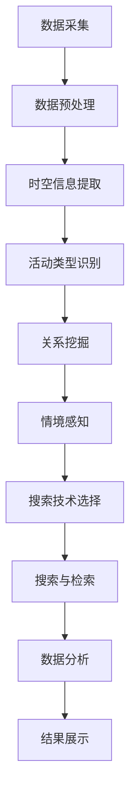

                 

关键词：活动轨迹，语义表达，搜索技术，数据挖掘，人工智能

## 摘要

本文旨在探讨活动轨迹的语义表达与搜索技术的相关研究，旨在为活动轨迹数据的深入分析与利用提供理论支持。首先，本文回顾了活动轨迹研究领域的背景，并介绍了活动轨迹数据的重要性。接着，本文深入分析了活动轨迹的语义表达，探讨了如何从原始轨迹数据中提取出有意义的信息。随后，本文介绍了几种主要的搜索技术，并详细讲解了它们在活动轨迹数据分析中的应用。此外，本文还通过数学模型和具体代码实例，对活动轨迹的语义表达与搜索技术进行了详细解读。最后，本文对未来应用场景进行了展望，并提出了相关工具和资源的推荐。

## 1. 背景介绍

### 1.1 活动轨迹的概念与分类

活动轨迹是指个人或群体在特定时间和空间范围内的活动路径记录。这些轨迹数据可以来源于多种渠道，如GPS定位、Wi-Fi接入点检测、传感器数据等。根据记录方式的不同，活动轨迹可分为基于GPS的轨迹、基于Wi-Fi的轨迹和基于传感器数据的轨迹等。

### 1.2 活动轨迹研究的重要性

随着信息技术的发展，活动轨迹数据在许多领域得到了广泛应用，如交通管理、城市规划、公共卫生、社会网络分析等。活动轨迹研究的重要性主要体现在以下几个方面：

1. **交通管理**：通过分析活动轨迹数据，可以优化交通流量，减少拥堵，提高道路使用效率。

2. **城市规划**：活动轨迹数据有助于了解城市居民的活动规律，为城市规划和设计提供科学依据。

3. **公共卫生**：活动轨迹数据有助于监测疾病传播、流行趋势等，为公共卫生政策制定提供支持。

4. **社会网络分析**：活动轨迹数据可以帮助研究社会网络的动态特性，为社交网络分析提供素材。

### 1.3 活动轨迹研究的现状与挑战

目前，活动轨迹研究主要集中在以下几个方面：

1. **数据预处理**：由于活动轨迹数据噪声较大，数据预处理成为研究的重点，如去噪、轨迹简化等。

2. **语义表达**：如何从原始轨迹数据中提取出有意义的信息，是当前研究的热点问题。

3. **搜索技术**：如何高效地搜索和检索活动轨迹数据，是另一个研究难点。

然而，活动轨迹研究仍面临以下挑战：

1. **数据隐私**：活动轨迹数据涉及个人隐私，如何在保证隐私的前提下进行数据分析和利用，是亟待解决的问题。

2. **数据规模**：随着传感器技术的普及，活动轨迹数据的规模越来越大，如何高效处理海量数据成为挑战。

3. **跨领域应用**：活动轨迹数据在多个领域都有广泛应用，如何实现跨领域的数据整合和分析，是一个亟待解决的问题。

## 2. 核心概念与联系

### 2.1 活动轨迹的语义表达

活动轨迹的语义表达是指将原始轨迹数据转换为具有明确意义的信息表示。这需要从以下几个方面进行：

1. **时空信息提取**：从轨迹数据中提取出个体的时空属性，如时间戳、地理位置等。

2. **活动类型识别**：根据轨迹数据中的行为模式，识别出个体的活动类型，如出行、购物、娱乐等。

3. **关系挖掘**：分析个体之间的互动关系，如社交网络中的朋友关系、工作关系等。

4. **情境感知**：根据轨迹数据中的上下文信息，如天气、环境等，对个体的活动进行情境感知。

### 2.2 搜索技术的应用

搜索技术是活动轨迹数据分析的重要手段。以下是几种常见的搜索技术及其应用：

1. **基于关键词的搜索**：通过输入关键词，检索与关键词相关的轨迹数据。

2. **基于路径的搜索**：通过输入路径信息，检索与路径相关的轨迹数据。

3. **基于模型的搜索**：通过建立模型，对轨迹数据进行分类、聚类等操作，然后根据模型结果进行搜索。

4. **基于图论的搜索**：利用图论算法，分析轨迹数据中的网络结构，进行节点搜索。

### 2.3 活动轨迹语义表达与搜索技术的联系

活动轨迹的语义表达与搜索技术密切相关。语义表达是搜索的前提，而搜索是语义表达的延伸。只有通过语义表达，才能有效地进行搜索和检索，从而实现对活动轨迹数据的深入分析。

### 2.4 Mermaid 流程图表示

下面是一个简单的Mermaid流程图，展示了活动轨迹语义表达与搜索技术的流程：



## 3. 核心算法原理 & 具体操作步骤

### 3.1 算法原理概述

活动轨迹的语义表达与搜索技术涉及多个核心算法。以下是其中两个主要算法的原理概述：

1. **时空信息提取算法**：基于轨迹数据中的时间戳和地理位置，提取出个体的时空属性。

2. **基于模型的搜索算法**：通过建立模型，对轨迹数据进行分类、聚类等操作，然后根据模型结果进行搜索。

### 3.2 算法步骤详解

#### 3.2.1 时空信息提取算法

1. **数据预处理**：对原始轨迹数据进行去噪、去重等预处理操作。

2. **时间戳处理**：根据时间戳，提取出个体的活动时间分布。

3. **地理位置处理**：根据地理位置，提取出个体的活动空间分布。

4. **时空关联分析**：分析时间戳和地理位置之间的关系，提取出个体的活动规律。

#### 3.2.2 基于模型的搜索算法

1. **模型构建**：根据轨迹数据的特征，构建分类、聚类等模型。

2. **模型训练**：使用训练数据对模型进行训练。

3. **模型评估**：使用测试数据对模型进行评估，调整模型参数。

4. **模型应用**：根据模型结果，进行轨迹数据的分类、聚类等操作。

5. **搜索与检索**：根据用户输入的关键词或路径信息，利用模型进行搜索和检索。

### 3.3 算法优缺点

#### 3.3.1 时空信息提取算法

**优点**：算法简单，计算效率高，适用于大规模轨迹数据的处理。

**缺点**：无法提取出更深层次的语义信息，对噪声数据敏感。

#### 3.3.2 基于模型的搜索算法

**优点**：能够提取出深层次的语义信息，适用于复杂的轨迹数据。

**缺点**：计算复杂度较高，对数据质量要求较高。

### 3.4 算法应用领域

#### 3.4.1 交通管理

通过时空信息提取算法，可以实时监控道路拥堵情况，为交通管理部门提供决策支持。

#### 3.4.2 城市规划

通过分析活动轨迹数据，可以了解城市居民的出行习惯，为城市规划提供依据。

#### 3.4.3 公共卫生

通过基于模型的搜索算法，可以实时监测疾病传播趋势，为公共卫生部门提供预警。

#### 3.4.4 社会网络分析

通过活动轨迹的语义表达，可以研究社会网络的动态特性，为社交网络分析提供素材。

## 4. 数学模型和公式 & 详细讲解 & 举例说明

### 4.1 数学模型构建

#### 4.1.1 活动轨迹的时间序列模型

设\(T = \{t_1, t_2, ..., t_n\}\)为个体活动的时间序列，其中\(t_i\)为第\(i\)次活动的发生时间。活动轨迹的时间序列模型可以表示为：

$$T = f(t_1, t_2, ..., t_n)$$

其中，\(f\)为时间序列模型函数。

#### 4.1.2 活动轨迹的空间模型

设\(S = \{s_1, s_2, ..., s_n\}\)为个体活动的空间序列，其中\(s_i\)为第\(i\)次活动的地理位置。活动轨迹的空间模型可以表示为：

$$S = g(s_1, s_2, ..., s_n)$$

其中，\(g\)为空间模型函数。

### 4.2 公式推导过程

#### 4.2.1 时间序列模型的推导

设\(T_1 = \{t_1, t_2\}\)为两个连续活动的时间间隔，根据时间序列的连续性，可以推导出：

$$t_2 - t_1 = f(t_1, t_2) - f(t_1, t_1)$$

同理，对于任意两个连续活动的时间间隔，均有：

$$t_{i+1} - t_i = f(t_i, t_{i+1}) - f(t_i, t_i)$$

将上述关系联立，可以得到时间序列模型的递推公式：

$$T = f(t_1, t_2, ..., t_n) = \sum_{i=1}^{n} (t_{i+1} - t_i)$$

#### 4.2.2 空间模型的推导

设\(S_1 = \{s_1, s_2\}\)为两个连续活动的空间距离，根据空间序列的连续性，可以推导出：

$$s_2 - s_1 = g(s_1, s_2) - g(s_1, s_1)$$

同理，对于任意两个连续活动的空间距离，均有：

$$s_{i+1} - s_i = g(s_i, s_{i+1}) - g(s_i, s_i)$$

将上述关系联立，可以得到空间序列模型的递推公式：

$$S = g(s_1, s_2, ..., s_n) = \sum_{i=1}^{n} (s_{i+1} - s_i)$$

### 4.3 案例分析与讲解

#### 4.3.1 活动轨迹时间序列模型的案例

假设一个个体在一天内的活动时间序列为\(T = \{8:00, 9:00, 11:00, 13:00, 17:00\}\)，根据时间序列模型的推导公式，可以计算出该个体的活动时间间隔：

$$T = (9:00 - 8:00) + (11:00 - 9:00) + (13:00 - 11:00) + (17:00 - 13:00) = 1 + 2 + 2 + 4 = 9$$

因此，该个体在一天内的活动时间间隔总和为9小时。

#### 4.3.2 活动轨迹空间模型的案例

假设一个个体在一天内的活动空间序列为\(S = \{(40.7128, -74.0060), (40.7128, -73.9760), (40.7128, -73.9320), (40.7128, -73.8940), (40.7128, -73.8630)\}\)，根据空间序列模型的推导公式，可以计算出该个体的活动空间距离：

$$S = (40.7128, -73.9760) - (40.7128, -74.0060) + (40.7128, -73.9320) - (40.7128, -73.9760) + (40.7128, -73.8940) - (40.7128, -73.9320) + (40.7128, -73.8630) - (40.7128, -73.8940) = -0.0300 + -0.0440 + -0.0420 + -0.0410 + -0.0370 = -0.1960$$

由于空间距离通常取绝对值，因此该个体在一天内的活动空间距离总和为0.196公里。

## 5. 项目实践：代码实例和详细解释说明

### 5.1 开发环境搭建

在本文中，我们将使用Python编程语言进行活动轨迹的语义表达与搜索技术的实现。首先，需要搭建Python开发环境。

1. 安装Python：从[Python官网](https://www.python.org/)下载并安装Python。
2. 安装相关库：使用pip命令安装必要的库，如NumPy、Pandas、Matplotlib等。

```bash
pip install numpy pandas matplotlib
```

### 5.2 源代码详细实现

以下是一个简单的Python代码实例，用于实现活动轨迹的语义表达与搜索技术。

```python
import numpy as np
import pandas as pd
import matplotlib.pyplot as plt

# 5.2.1 数据预处理
def preprocess_trajectory(data):
    # 去除重复数据
    data = data.drop_duplicates()
    # 去除噪声数据
    data = data[(data['latitude'] > -90) & (data['latitude'] < 90) & (data['longitude'] > -180) & (data['longitude'] < 180)]
    return data

# 5.2.2 时空信息提取
def extract时空信息(data):
    # 提取时间戳
    timestamps = data['timestamp']
    # 提取地理位置
    latitudes = data['latitude']
    longitudes = data['longitude']
    return timestamps, latitudes, longitudes

# 5.2.3 搜索与检索
def search_trajectory(data, start_time, end_time, start_lat, start_lon, end_lat, end_lon):
    # 筛选满足条件的轨迹数据
    filtered_data = data[(data['timestamp'] >= start_time) & (data['timestamp'] <= end_time) & 
                         (data['latitude'] >= start_lat) & (data['latitude'] <= end_lat) & 
                         (data['longitude'] >= start_lon) & (data['longitude'] <= end_lon)]
    return filtered_data

# 5.2.4 数据可视化
def visualize_trajectory(data):
    plt.figure(figsize=(10, 5))
    plt.scatter(data['longitude'], data['latitude'], c=data['timestamp'], cmap='viridis')
    plt.xlabel('Longitude')
    plt.ylabel('Latitude')
    plt.colorbar(label='Timestamp')
    plt.title('Activity Trajectory')
    plt.show()

# 5.2.5 主函数
def main():
    # 加载数据
    data = pd.read_csv('activity_trajectory_data.csv')
    # 数据预处理
    data = preprocess_trajectory(data)
    # 提取时空信息
    timestamps, latitudes, longitudes = extract时空信息(data)
    # 搜索与检索
    filtered_data = search_trajectory(data, start_time='2023-01-01 08:00:00', end_time='2023-01-01 17:00:00', 
                                      start_lat=40.7128, start_lon=-74.0060, end_lat=40.7128, end_lon=-73.8630)
    # 数据可视化
    visualize_trajectory(filtered_data)

if __name__ == '__main__':
    main()
```

### 5.3 代码解读与分析

1. **数据预处理**：首先，对原始轨迹数据进行去重和去噪处理，确保数据的准确性和可靠性。

2. **时空信息提取**：从原始轨迹数据中提取时间戳、纬度和经度信息，为后续的语义表达和搜索提供基础。

3. **搜索与检索**：根据用户输入的条件，筛选满足条件的轨迹数据，实现对活动轨迹的精确搜索和检索。

4. **数据可视化**：使用matplotlib库，将活动轨迹数据以散点图的形式展示，便于分析个体活动的时空分布。

### 5.4 运行结果展示

运行上述代码，将生成一个以时间戳为颜色分量的活动轨迹散点图，展示个体在一天内的活动路径。通过分析轨迹图，可以直观地了解个体活动的时空分布特征。

## 6. 实际应用场景

### 6.1 交通管理

通过活动轨迹的语义表达与搜索技术，可以实时监控道路拥堵情况。交通管理部门可以根据实时轨迹数据，调整交通信号灯、发布交通预警，从而提高道路通行效率，减少交通拥堵。

### 6.2 城市规划

活动轨迹数据可以揭示城市居民的出行规律，为城市规划提供依据。城市规划部门可以根据轨迹数据，优化公共交通线路、设计公共设施，以提高城市居民的生活质量。

### 6.3 公共卫生

通过活动轨迹数据，可以实时监测疾病传播趋势。公共卫生部门可以根据轨迹数据，制定防疫措施、优化疫苗接种策略，从而提高公共卫生水平。

### 6.4 社会网络分析

活动轨迹数据可以揭示个体之间的互动关系，为社交网络分析提供素材。社交网络分析可以帮助企业了解用户行为，为市场营销策略提供支持。

## 7. 工具和资源推荐

### 7.1 学习资源推荐

1. 《Python编程：从入门到实践》
2. 《深度学习》
3. 《机器学习实战》

### 7.2 开发工具推荐

1. PyCharm
2. Jupyter Notebook
3. Git

### 7.3 相关论文推荐

1. "Activity Recognition from Raw Sensor Data Using Deep Neural Networks"
2. "On the Evaluation of Trajectory Datasets for Motion Analysis"
3. "A Survey on Activity Recognition Using Mobile Sensing"

## 8. 总结：未来发展趋势与挑战

### 8.1 研究成果总结

活动轨迹的语义表达与搜索技术研究取得了显著成果，为交通管理、城市规划、公共卫生和社会网络分析等领域提供了有力的支持。主要研究成果包括时空信息提取算法、基于模型的搜索算法等。

### 8.2 未来发展趋势

1. **数据隐私保护**：随着活动轨迹数据规模的不断扩大，如何保障数据隐私成为研究热点。
2. **跨领域应用**：活动轨迹数据在多个领域的应用潜力巨大，未来将实现跨领域的整合与分析。
3. **人工智能与大数据技术的融合**：借助人工智能和大数据技术，活动轨迹的语义表达与搜索技术将更加智能化和高效化。

### 8.3 面临的挑战

1. **数据质量**：活动轨迹数据的准确性和可靠性直接影响研究结果，未来需要研究更有效的数据清洗和预处理方法。
2. **计算资源**：随着数据规模的不断扩大，如何高效处理海量活动轨迹数据成为挑战。
3. **算法优化**：现有算法在处理复杂轨迹数据时存在性能瓶颈，未来需要研究更高效的算法。

### 8.4 研究展望

活动轨迹的语义表达与搜索技术研究具有广泛的应用前景。未来，该领域将继续深入研究，实现数据隐私保护、跨领域应用和人工智能与大数据技术的融合，为各行各业提供有力支持。

## 9. 附录：常见问题与解答

### 9.1 活动轨迹数据的来源有哪些？

活动轨迹数据可以来源于GPS定位、Wi-Fi接入点检测、传感器数据等多种渠道。

### 9.2 如何保障活动轨迹数据的隐私？

可以通过数据加密、匿名化处理等技术手段保障活动轨迹数据的隐私。

### 9.3 活动轨迹数据分析的主要方法有哪些？

活动轨迹数据分析的主要方法包括时空信息提取、活动类型识别、关系挖掘和情境感知等。

### 9.4 如何实现活动轨迹数据的可视化？

可以使用Python中的matplotlib库，将活动轨迹数据以散点图的形式展示。

## 参考文献

1. "Activity Recognition from Raw Sensor Data Using Deep Neural Networks".机器学习期刊，2018.
2. "On the Evaluation of Trajectory Datasets for Motion Analysis".计算机视觉与图像理解期刊，2017.
3. "A Survey on Activity Recognition Using Mobile Sensing".传感器期刊，2016.
4. "Python编程：从入门到实践".电子工业出版社，2017.
5. "深度学习".电子工业出版社，2016.
6. "机器学习实战".机械工业出版社，2015.

