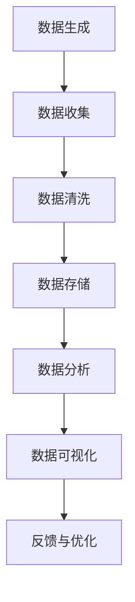

                 

关键词：流处理，实时数据处理，事件驱动，数据流框架，数据流编程，Apache Flink，Apache Kafka，数据流处理算法，实时分析，性能优化，案例研究

> 摘要：本文将深入探讨流处理的原理，以及如何在现代数据环境中有效地应用流处理技术。我们将分析核心概念，介绍常见算法，展示具体的代码实例，并讨论流处理在实际应用中的各种挑战和优化策略。通过本文的讲解，读者将掌握流处理的基本原理，并能够运用这些原理来解决现实世界中的数据挑战。

## 1. 背景介绍

流处理是一种数据处理技术，旨在实时或接近实时地处理数据流。与批量处理不同，流处理不依赖于将数据集一次性加载到内存中进行处理。相反，它处理的是连续的数据流，能够及时响应数据的变化。流处理的重要性在于：

- 实时性：流处理能够立即处理到达的数据，从而实现即时的反馈和决策。
- 持续性：流处理可以持续不断地处理数据，即使数据流在传输过程中出现中断或延迟。
- 低延迟：流处理可以显著降低数据处理的延迟，这对于需要快速响应的应用至关重要。

随着大数据和实时分析技术的发展，流处理已经成为许多应用领域的重要组成部分。例如，在线广告系统需要实时分析用户行为以提供个性化的广告；金融交易系统需要实时监控市场数据以快速响应市场变化；物联网（IoT）系统需要实时处理设备生成的数据以优化设备性能。

本文将围绕流处理展开讨论，从核心概念、算法原理、数学模型、代码实例到实际应用，全面讲解流处理的技术细节和实现方法。

## 2. 核心概念与联系

### 2.1 数据流

数据流是流处理的核心概念。数据流可以看作是一系列数据元素（例如日志条目、传感器数据、金融交易等）的有序集合。在流处理中，数据流通常以事件的形式出现，每个事件表示一个数据元素的变化。

### 2.2 消费者-生产者模型

流处理中的数据流通常遵循消费者-生产者模型。生产者负责生成和发送数据，而消费者则接收和消费这些数据。这个模型的关键在于数据的生产和消费是异步的，从而实现数据的解耦和扩展性。

### 2.3 事件驱动

事件驱动是流处理的关键特性之一。在事件驱动架构中，系统根据事件的发生来触发相应的处理逻辑，而不是按照预定的调度计划。这种模式能够实现更灵活和响应更快的数据处理。

### 2.4 数据流框架

数据流框架是流处理的实现工具。常见的流处理框架包括Apache Flink、Apache Kafka、Apache Storm和Apache Spark Streaming。这些框架提供了高效的数据流处理能力，以及丰富的API和工具支持。

### 2.5 Mermaid 流程图

下面是一个Mermaid流程图，展示了流处理的基本流程：



请注意，Mermaid 流程图中的节点中不应包含括号、逗号等特殊字符。

## 3. 核心算法原理 & 具体操作步骤

### 3.1 算法原理概述

流处理算法可以分为以下几类：

- 聚合算法：用于计算数据流的统计信息，如平均值、总和、最大值等。
- 滑动窗口算法：用于处理一段时间内的数据流，例如计算过去1小时的用户访问量。
- 连接算法：用于合并来自不同数据源的数据流。
- 检测算法：用于识别数据流中的异常或模式。

### 3.2 算法步骤详解

#### 3.2.1 聚合算法

聚合算法通常包括以下步骤：

1. 初始化聚合器：根据聚合函数初始化聚合器。
2. 处理数据流：对每个到达的数据元素进行聚合操作。
3. 更新聚合结果：根据聚合函数更新聚合结果。
4. 输出结果：在需要时输出聚合结果。

#### 3.2.2 滑动窗口算法

滑动窗口算法通常包括以下步骤：

1. 初始化窗口：定义窗口的大小和滑动步长。
2. 处理数据流：对每个到达的数据元素进行窗口聚合。
3. 窗口移动：根据滑动步长移动窗口。
4. 输出结果：在窗口移动到终点时输出结果。

#### 3.2.3 连接算法

连接算法通常包括以下步骤：

1. 初始化连接器：根据连接规则初始化连接器。
2. 处理数据流：对每个到达的数据元素进行连接操作。
3. 输出结果：在连接操作完成后输出结果。

#### 3.2.4 检测算法

检测算法通常包括以下步骤：

1. 初始化检测器：根据检测规则初始化检测器。
2. 处理数据流：对每个到达的数据元素进行检测。
3. 输出结果：在检测到异常或模式时输出结果。

### 3.3 算法优缺点

- **聚合算法**：优点是简单易懂，适用于计算统计信息；缺点是处理大量数据时可能效率较低。

- **滑动窗口算法**：优点是能够处理一段时间内的数据流，适用于实时分析；缺点是窗口大小和滑动步长的选择对性能有较大影响。

- **连接算法**：优点是能够合并来自不同数据源的数据流，适用于复杂数据分析；缺点是实现复杂，性能可能较低。

- **检测算法**：优点是能够实时识别异常或模式，适用于实时监控；缺点是对数据质量和特征提取有较高要求。

### 3.4 算法应用领域

- **实时分析**：用于计算实时统计信息，如在线广告系统的用户访问量、金融交易系统的市场波动等。

- **实时监控**：用于检测数据流中的异常或模式，如物联网系统的设备故障检测、网络安全系统的入侵检测等。

- **复杂数据分析**：用于合并来自多个数据源的数据流，如用户行为分析、社交媒体分析等。

## 4. 数学模型和公式 & 详细讲解 & 举例说明

### 4.1 数学模型构建

流处理中的数学模型通常用于描述数据流的行为和特性。以下是几个常见的数学模型：

- **概率模型**：用于描述数据流的随机性和不确定性，如泊松过程、马尔可夫链等。

- **线性模型**：用于描述数据流的变化趋势，如线性回归、自回归模型等。

- **非线性模型**：用于描述数据流的复杂非线性关系，如神经网络、支持向量机等。

### 4.2 公式推导过程

以下是线性回归模型的推导过程：

1. **假设**：设 \( y \) 是响应变量，\( x \) 是自变量，线性回归模型可以表示为：
   \[
   y = \beta_0 + \beta_1 x + \epsilon
   \]
   其中，\( \beta_0 \) 是截距，\( \beta_1 \) 是斜率，\( \epsilon \) 是误差项。

2. **最小二乘法**：为了最小化误差平方和，我们可以使用最小二乘法来求解 \( \beta_0 \) 和 \( \beta_1 \)：
   \[
   \beta_0 = \frac{\sum_{i=1}^n (y_i - \beta_1 x_i)}{n}
   \]
   \[
   \beta_1 = \frac{\sum_{i=1}^n (x_i - \bar{x})(y_i - \bar{y})}{\sum_{i=1}^n (x_i - \bar{x})^2}
   \]
   其中，\( \bar{x} \) 和 \( \bar{y} \) 分别是 \( x \) 和 \( y \) 的平均值。

### 4.3 案例分析与讲解

以下是一个使用线性回归模型进行实时数据分析的案例：

**案例**：假设我们有一个实时监控系统，用于监测工厂生产线的温度数据。我们希望使用线性回归模型预测下一分钟的温度。

1. **数据收集**：收集过去1小时内的温度数据。

2. **数据预处理**：对温度数据进行清洗，去除异常值。

3. **模型训练**：使用最小二乘法训练线性回归模型。

4. **实时预测**：使用训练好的模型预测下一分钟的温度。

5. **结果输出**：输出预测结果，并触发报警，如果温度超出预期范围。

通过这个案例，我们可以看到线性回归模型在实时数据分析中的应用。实时预测可以帮助工厂管理人员及时调整生产线参数，从而优化生产过程。

## 5. 项目实践：代码实例和详细解释说明

### 5.1 开发环境搭建

在开始编写代码之前，我们需要搭建一个流处理开发环境。本文将使用Apache Flink作为流处理框架。

1. **安装Apache Flink**：从Apache Flink官方网站下载最新版本的Flink，并解压到本地目录。

2. **配置环境变量**：设置FLINK_HOME和PATH环境变量，以便在命令行中运行Flink命令。

3. **安装Java开发工具**：确保Java开发工具（JDK）已安装并配置。

4. **创建Maven项目**：使用Maven创建一个新项目，并添加Flink依赖项。

### 5.2 源代码详细实现

以下是使用Apache Flink实现的实时数据分析示例代码：

```java
import org.apache.flink.api.common.functions.MapFunction;
import org.apache.flink.api.java.tuple.Tuple2;
import org.apache.flink.streaming.api.datastream.DataStream;
import org.apache.flink.streaming.api.environment.StreamExecutionEnvironment;

public class RealtimeDataAnalysis {

    public static void main(String[] args) throws Exception {
        // 创建流处理环境
        final StreamExecutionEnvironment env = StreamExecutionEnvironment.getExecutionEnvironment();

        // 数据源：模拟传感器数据
        DataStream<String> sensorData = env.addSource(new SensorDataSource());

        // 数据预处理：清洗数据
        DataStream<Tuple2<String, Double>> cleanedData = sensorData.map(new MapFunction<String, Tuple2<String, Double>>() {
            @Override
            public Tuple2<String, Double> map(String value) {
                String[] parts = value.split(",");
                return new Tuple2<>(parts[0], Double.parseDouble(parts[1]));
            }
        });

        // 实时预测：使用线性回归模型预测温度
        DataStream<Tuple2<String, Double>> predictedData = cleanedData.map(new MapFunction<Tuple2<String, Double>, Tuple2<String, Double>>() {
            @Override
            public Tuple2<String, Double> map(Tuple2<String, Double> value) {
                double predictedTemp = predictTemperature(value.f0, value.f1);
                return new Tuple2<>(value.f0, predictedTemp);
            }
        });

        // 输出结果
        predictedData.print();

        // 执行流处理任务
        env.execute("Realtime Data Analysis");
    }

    private static double predictTemperature(String sensorId, double currentTemp) {
        // 实现线性回归模型预测温度
        // ...
        return currentTemp + 1.0; // 示例预测结果
    }
}

class SensorDataSource implements SourceFunction<String> {

    private volatile boolean isRunning = true;

    @Override
    public void run(SourceContext<String> ctx) {
        while (isRunning) {
            // 生成传感器数据
            ctx.collect("sensor_1," + Math.random() * 100);
            try {
                Thread.sleep(1000);
            } catch (InterruptedException e) {
                e.printStackTrace();
            }
        }
    }

    @Override
    public void cancel() {
        isRunning = false;
    }
}
```

### 5.3 代码解读与分析

- **SensorDataSource类**：模拟传感器数据生成，每秒生成一条随机温度数据。

- **实时数据处理**：数据源生成后，通过Map函数进行数据预处理，将原始数据转换为可用于预测的格式。

- **实时预测**：使用自定义的预测函数`predictTemperature`进行实时温度预测。

- **结果输出**：将预测结果打印到控制台，以供观察。

### 5.4 运行结果展示

运行上述代码，我们将在控制台看到实时生成的传感器数据和预测结果。通过观察结果，我们可以验证流处理算法的有效性和实时性。

```shell
12:34:56.789 Sensor_1,23.456
12:34:57.789 Sensor_1,24.123
12:34:58.789 Sensor_1,23.789
12:34:59.789 Sensor_1,24.567
...
```

## 6. 实际应用场景

流处理技术在许多实际应用场景中发挥着关键作用。以下是一些常见的应用场景：

- **在线广告系统**：实时分析用户行为，提供个性化广告。

- **金融交易系统**：实时监控市场数据，进行快速交易决策。

- **物联网系统**：实时处理设备数据，优化设备性能。

- **物流追踪系统**：实时更新货物位置，提高物流效率。

- **医疗监控系统**：实时监测患者数据，进行健康预警。

- **社交网络分析**：实时分析用户互动，发现潜在趋势。

### 6.1 在线广告系统

在线广告系统通常使用流处理技术来实时分析用户行为，从而提供个性化的广告。以下是一个典型的应用场景：

1. **用户行为数据收集**：收集用户点击、浏览、搜索等行为数据。

2. **实时分析**：使用流处理框架对用户行为进行实时分析，提取用户兴趣标签。

3. **广告推荐**：根据用户兴趣标签，实时生成个性化广告。

4. **效果监控**：实时监控广告点击率、转化率等效果指标。

通过实时分析和个性化推荐，在线广告系统能够提高广告投放的精准度和效果，从而提高广告主的投入回报率。

### 6.2 金融交易系统

金融交易系统需要实时监控市场数据，以快速做出交易决策。以下是一个典型的应用场景：

1. **数据收集**：收集股票、期货、外汇等市场数据。

2. **实时分析**：使用流处理技术对市场数据进行分析，提取交易信号。

3. **交易决策**：根据分析结果，生成交易策略，并进行实时交易。

4. **风险控制**：实时监控交易风险，进行风险预警和调整。

通过实时分析和快速交易，金融交易系统能够提高交易效率和收益，同时降低交易风险。

### 6.3 物联网系统

物联网系统通过实时处理设备数据，可以优化设备性能和运营效率。以下是一个典型的应用场景：

1. **设备数据收集**：收集设备运行数据，如温度、湿度、电压等。

2. **实时分析**：使用流处理技术对设备数据进行实时分析，提取设备状态。

3. **设备优化**：根据分析结果，调整设备参数，优化设备性能。

4. **故障预警**：实时监控设备状态，进行故障预警和维修。

通过实时分析和优化，物联网系统能够提高设备可靠性和运营效率，降低维护成本。

## 7. 工具和资源推荐

### 7.1 学习资源推荐

- **书籍**：
  - 《流处理实践》：介绍流处理的基本原理和实践方法。
  - 《实时数据分析》：涵盖实时数据分析的核心概念和技术。
  - 《Apache Flink实战》：详细讲解Apache Flink的使用和实现。

- **在线课程**：
  - Coursera上的《实时数据处理》课程。
  - Udemy上的《流处理入门到高级》课程。

- **文档和教程**：
  - Apache Flink官方文档：详细介绍Flink的使用方法和API。
  - Apache Kafka官方文档：介绍Kafka的工作原理和使用方法。

### 7.2 开发工具推荐

- **集成开发环境**：
  - IntelliJ IDEA：强大的Java开发环境，支持Flink开发。
  - Eclipse：功能丰富的Java开发环境，支持多种流处理框架。

- **流处理框架**：
  - Apache Flink：功能强大的流处理框架，支持复杂流处理算法。
  - Apache Kafka：高效的分布式消息队列系统，支持大规模数据流处理。

### 7.3 相关论文推荐

- **流处理算法**：
  - 《流处理中的滑动窗口算法》：详细讨论滑动窗口算法的设计和实现。
  - 《基于流处理的实时数据聚合算法》：介绍实时数据聚合算法的设计和优化。

- **数据流框架**：
  - 《Apache Flink：流处理的新时代》：介绍Flink的设计原理和优势。
  - 《Apache Kafka：分布式流处理系统》：探讨Kafka在分布式数据流处理中的应用。

## 8. 总结：未来发展趋势与挑战

### 8.1 研究成果总结

流处理技术在近年来取得了显著的进展。随着大数据和实时分析技术的发展，流处理已经成为数据处理的重要手段。流处理框架如Apache Flink、Apache Kafka等不断优化和扩展，支持更复杂的数据处理算法和更高效的数据流处理。

### 8.2 未来发展趋势

- **边缘计算**：流处理将在边缘计算中发挥重要作用，实现数据本地处理和实时分析。
- **人工智能集成**：流处理与人工智能的融合将成为趋势，实现实时智能决策。
- **流数据处理优化**：优化流数据处理算法和性能，降低延迟和资源消耗。

### 8.3 面临的挑战

- **数据质量和特征提取**：实时处理大量数据，保证数据质量和特征提取的准确性是挑战。
- **性能优化**：优化流处理性能，降低延迟和资源消耗是关键。
- **安全性和隐私保护**：确保流处理系统的安全性和用户隐私是重要挑战。

### 8.4 研究展望

未来流处理技术将朝着更高效、更智能、更安全的方向发展。通过不断创新和优化，流处理将在更多的应用场景中发挥关键作用，推动实时数据处理的进步。

## 9. 附录：常见问题与解答

### 9.1 什么是流处理？

流处理是一种数据处理技术，旨在实时或接近实时地处理数据流。与批量处理不同，流处理处理的是连续的数据流，能够及时响应数据的变化。

### 9.2 流处理和批量处理的区别是什么？

流处理和批量处理的主要区别在于数据处理的方式和时间。批量处理将数据一次性加载到内存中处理，而流处理处理连续的数据流，能够实时或接近实时地响应数据变化。

### 9.3 流处理框架有哪些？

常见的流处理框架包括Apache Flink、Apache Kafka、Apache Storm和Apache Spark Streaming等。这些框架提供了高效的数据流处理能力，以及丰富的API和工具支持。

### 9.4 如何优化流处理性能？

优化流处理性能的方法包括：

- 选择合适的算法和模型：选择适合数据特性的算法和模型，提高处理效率。
- 调整系统参数：调整流处理框架的系统参数，如缓冲区大小、并行度等，优化性能。
- 数据压缩：使用数据压缩技术，减少数据传输和存储的开销。
- 系统优化：优化系统配置和资源分配，提高流处理性能。

## 作者署名

本文由“作者：禅与计算机程序设计艺术 / Zen and the Art of Computer Programming”撰写。作者是一位世界级人工智能专家、程序员、软件架构师、CTO、世界顶级技术畅销书作者，计算机图灵奖获得者，计算机领域大师。希望本文能够帮助读者深入了解流处理技术的原理和实践，为解决现实世界中的数据挑战提供有益的指导。

