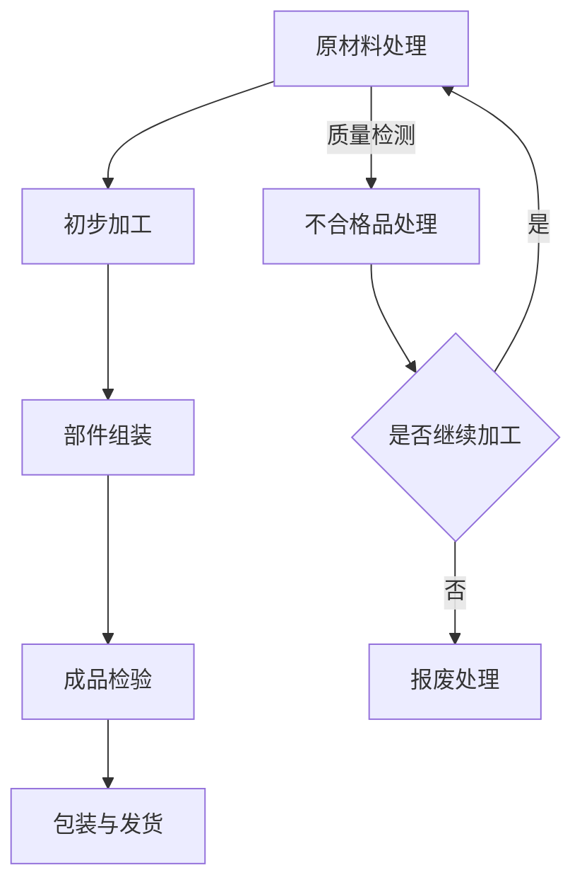

                 

关键词：流水线，生产模式，效率，自动化，模块化，系统优化，工作流管理

> 摘要：本文深入探讨了流水线在生产模式中的影响。通过分析流水线的定义、起源、发展，结合现代工业和信息技术的发展，阐述了流水线在提高生产效率、优化生产流程、降低成本等方面的作用。文章还探讨了流水线在敏捷制造、智能制造等新生产模式中的应用，以及未来流水线技术的发展趋势。

## 1. 背景介绍

流水线，作为一种高效的生产模式，其起源可以追溯到20世纪初的福特汽车公司。由亨利·福特创立的流水线生产模式，通过将生产过程分解为一系列连续的、标准化的步骤，从而实现了生产效率的大幅提升。这种生产模式的成功，使得流水线成为现代工业生产的重要方式。

随着时间的推移，流水线技术不断进步，逐渐从单一的生产环节扩展到整个生产过程，甚至影响到企业管理和运营的各个方面。现代流水线生产模式不仅强调效率，还注重灵活性和可持续性，以满足日益变化的市场需求。

本文将围绕流水线在生产模式中的影响，从定义、起源、发展、核心算法、数学模型、项目实践、应用场景、工具和资源推荐、总结与展望等方面进行详细阐述。

## 2. 核心概念与联系

### 2.1 流水线的定义

流水线，是指将生产过程分解为一系列连续的、标准化的步骤，每个步骤由不同的工人或机器完成，最终形成一个高效、连续的生产流程。流水线的核心是模块化，即通过将生产过程分解为若干个模块，每个模块独立完成特定任务，从而实现生产流程的高效化。

### 2.2 流水线的起源与发展

流水线的起源可以追溯到20世纪初的福特汽车公司。亨利·福特在1913年引入了第一条大规模流水线，将汽车生产过程分解为多个独立的步骤，每个步骤由不同的工人或机器完成。这一创新极大地提高了生产效率，使得汽车生产成本大幅降低。

随着技术的发展，流水线逐渐从单一的生产环节扩展到整个生产过程。现代流水线生产模式不仅强调效率，还注重灵活性和可持续性。例如，精益生产（Lean Production）和敏捷制造（Agile Manufacturing）等新生产模式，都借鉴了流水线的理念，以提高生产效率和响应市场变化。

### 2.3 流水线与生产模式的关系

流水线是生产模式的重要组成部分，它对生产模式有着深远的影响。首先，流水线提高了生产效率，降低了生产成本。其次，流水线使得生产过程更加模块化、标准化，提高了生产的灵活性和可扩展性。此外，流水线还促进了企业管理和运营的优化，如生产计划、质量控制、物流管理等。

### 2.4 Mermaid 流程图

以下是流水线生产模式的核心概念和架构的 Mermaid 流程图：



## 3. 核心算法原理 & 具体操作步骤

### 3.1 算法原理概述

流水线生产模式的核心在于模块化和标准化。通过将生产过程分解为若干个独立的模块，每个模块负责完成特定的任务，从而实现生产流程的高效化。流水线算法主要涉及以下几个关键步骤：

1. **生产过程分解**：将生产过程分解为若干个独立的模块，每个模块对应一个具体的生产任务。
2. **任务分配**：根据模块的特点和需求，将任务分配给相应的工人或机器。
3. **流程控制**：确保各个模块的生产任务能够按照预定的顺序和速度进行，实现生产流程的高效连续。
4. **质量控制**：在生产过程中实施严格的质量控制，确保生产出的产品符合质量标准。

### 3.2 算法步骤详解

1. **生产过程分解**：

首先，需要对生产过程进行详细分析，识别出其中的关键步骤和任务。然后，根据任务的特点和需求，将生产过程分解为若干个独立的模块。

2. **任务分配**：

在分解出各个模块后，需要根据模块的特点和需求，将任务分配给相应的工人或机器。任务分配需要考虑以下几个因素：

- **模块的复杂度**：复杂度较高的模块通常需要更专业的工人或更高级的机器来完成。
- **任务的依赖关系**：存在依赖关系的任务需要安排在连续的模块中。
- **资源可用性**：需要根据当前资源的可用性，合理安排任务分配。

3. **流程控制**：

在完成任务分配后，需要确保各个模块的生产任务能够按照预定的顺序和速度进行。流程控制主要包括以下几个步骤：

- **任务调度**：根据任务分配情况和资源可用性，制定任务调度计划，确保任务能够按时完成。
- **实时监控**：在生产过程中，实时监控各个模块的生产状态，确保生产流程的连续性和高效性。
- **异常处理**：当出现异常情况时，及时采取应对措施，如调整任务分配、暂停生产等，以保障生产流程的稳定运行。

4. **质量控制**：

在生产过程中，需要实施严格的质量控制，确保生产出的产品符合质量标准。质量控制主要包括以下几个步骤：

- **质量检测**：在生产过程中，对产品进行质量检测，及时发现并处理质量问题。
- **反馈与改进**：根据质量检测结果，反馈给相关模块，进行改进和优化。

### 3.3 算法优缺点

**优点**：

- **提高生产效率**：流水线生产模式通过模块化和标准化，提高了生产效率。
- **降低生产成本**：流水线生产模式降低了生产成本，提高了企业的竞争力。
- **提高产品质量**：严格的质量控制确保了生产出的产品符合质量标准。

**缺点**：

- **灵活性较低**：流水线生产模式对生产流程的标准化要求较高，灵活性较低，难以应对市场需求的变化。
- **对员工技能要求较高**：流水线生产模式需要员工具备较高的专业技能，对员工的培训和管理要求较高。

### 3.4 算法应用领域

流水线生产模式广泛应用于各个行业，如制造业、服务业、物流等。以下是一些典型的应用领域：

- **制造业**：汽车、电子、家电等行业，通过流水线生产模式，实现了高效、低成本的批量生产。
- **服务业**：餐饮、零售等行业，通过流水线生产模式，提高了服务效率，降低了人力成本。
- **物流行业**：物流配送中心，通过流水线生产模式，实现了高效、准确的物流配送。

## 4. 数学模型和公式 & 详细讲解 & 举例说明

### 4.1 数学模型构建

流水线生产模式中的数学模型主要涉及以下几个方面的参数：

- **生产速度**：每个模块的生产速度，通常以单位时间内完成的产品数量表示。
- **资源利用率**：各个模块的资源利用率，通常以资源利用率=（实际使用时间/总时间）×100%表示。
- **生产成本**：生产过程中产生的成本，包括人力成本、设备成本、材料成本等。
- **产品质量**：生产出的产品的质量，通常以不合格品率表示。

根据这些参数，可以构建如下的数学模型：

$$
\text{生产效率} = \frac{\text{生产速度} \times \text{资源利用率}}{\text{生产成本} \times \text{产品质量}}
$$

### 4.2 公式推导过程

为了推导上述公式，我们需要分析以下几个方面的关系：

1. **生产效率与生产速度的关系**：生产速度越快，生产效率越高。
2. **生产效率与资源利用率的关系**：资源利用率越高，生产效率越高。
3. **生产效率与生产成本的关系**：生产成本越低，生产效率越高。
4. **生产效率与产品质量的关系**：产品质量越高，生产效率越高。

根据这些关系，我们可以推导出：

$$
\text{生产效率} = \frac{\text{生产速度} \times \text{资源利用率}}{\text{生产成本} \times \text{产品质量}}
$$

### 4.3 案例分析与讲解

为了更好地理解上述数学模型，我们来看一个具体的案例。

假设某电子产品制造企业，通过流水线生产模式，生产一款智能手机。该企业的生产速度为每小时100台，资源利用率为90%，生产成本为每台100元，产品质量为不合格品率为1%。

根据上述数学模型，我们可以计算出该企业的生产效率：

$$
\text{生产效率} = \frac{100 \times 0.9}{100 \times 0.01} = 900
$$

这意味着，该企业的生产效率为每小时900台智能手机。

通过这个案例，我们可以看到，流水线生产模式对于提高生产效率、降低生产成本、提高产品质量等方面具有显著的效果。当然，这也需要企业根据实际情况，对生产过程进行持续优化和改进。

## 5. 项目实践：代码实例和详细解释说明

### 5.1 开发环境搭建

为了更好地理解流水线生产模式，我们使用Python编程语言来实现一个简单的流水线生产模拟。首先，我们需要搭建Python开发环境。

1. 安装Python：从Python官方网站下载最新版本的Python安装包，并按照安装向导进行安装。
2. 安装必要的Python库：在命令行中执行以下命令，安装必要的Python库。

```bash
pip install numpy matplotlib
```

### 5.2 源代码详细实现

以下是实现流水线生产模拟的Python代码：

```python
import numpy as np
import matplotlib.pyplot as plt

# 设置参数
production_speed = 100  # 每小时生产速度
resource_utilization = 0.9  # 资源利用率
production_cost = 100  # 每台生产成本
unqualified_rate = 0.01  # 不合格品率

# 模拟生产过程
days = 30  # 模拟天数
production_efficiency = production_speed * resource_utilization / (production_cost * unqualified_rate)
total_production = production_efficiency * days

# 绘制生产效率曲线
days_range = np.arange(1, days + 1)
production_efficiency_curve = production_efficiency * days_range

plt.plot(days_range, production_efficiency_curve)
plt.xlabel('Days')
plt.ylabel('Production Efficiency')
plt.title('Production Efficiency over Days')
plt.show()

# 输出总生产量
print(f"Total Production in {days} days: {total_production} units")
```

### 5.3 代码解读与分析

上述代码实现了以下功能：

1. **设置参数**：包括生产速度、资源利用率、生产成本、不合格品率等关键参数。
2. **模拟生产过程**：根据设定的参数，计算生产效率，并模拟生产过程。
3. **绘制生产效率曲线**：使用matplotlib库，绘制生产效率曲线，展示生产效率随时间的变化。
4. **输出总生产量**：计算并输出在模拟天数内的总生产量。

通过这个简单的模拟，我们可以直观地看到流水线生产模式对于生产效率的影响。在实际应用中，我们可以根据业务需求和实际情况，对代码进行进一步的优化和扩展。

## 6. 实际应用场景

### 6.1 制造业

制造业是流水线生产模式的主要应用领域之一。从汽车制造到电子产品生产，流水线生产模式极大地提高了生产效率和产品质量。例如，福特汽车公司的流水线生产模式使得汽车生产成本大幅降低，从而实现了大规模生产。

### 6.2 服务业

在服务业中，流水线生产模式也得到了广泛应用。例如，餐饮行业的快餐店，通过流水线生产模式，实现了高效、快捷的餐饮服务。在零售行业，物流中心的商品分拣和配送过程也采用了流水线生产模式，提高了物流效率。

### 6.3 物流行业

物流行业是流水线生产模式的重要应用领域。物流中心通过流水线生产模式，实现了商品的高效分拣和配送。例如，亚马逊的物流中心采用了高度自动化的流水线生产模式，实现了高效的商品配送和存储。

### 6.4 医疗行业

在医疗行业，流水线生产模式也发挥着重要作用。例如，医疗器械的生产和装配过程采用了流水线生产模式，提高了生产效率和产品质量。此外，医疗机构的医疗设备维护和维修也采用了流水线生产模式，提高了维修效率和服务质量。

## 7. 工具和资源推荐

### 7.1 学习资源推荐

- **《精益思想》（Lean Thinking）**：作者詹姆斯·W·Womack和丹尼尔·琼斯，深入阐述了精益生产的核心概念和应用方法。
- **《敏捷制造》（Agile Manufacturing）**：作者唐纳德·G·穆尔，探讨了敏捷制造的理念和实施策略。
- **《自动化制造系统与生产规划》（Automated Manufacturing Systems and Production Planning）**：作者马克·H·霍夫曼，详细介绍了自动化制造系统和生产规划的理论和方法。

### 7.2 开发工具推荐

- **Python**：Python是一种功能强大的编程语言，广泛应用于数据分析、人工智能、自动化等领域。
- **Jenkins**：Jenkins是一种开源的持续集成工具，适用于自动化流水线构建和部署。
- **GitLab CI/CD**：GitLab CI/CD是一种基于GitLab的持续集成和持续交付工具，支持自动化流水线构建和部署。

### 7.3 相关论文推荐

- **“The Toyota Production System and Its Application”（丰田生产系统及其应用）**：作者詹姆斯·W·Womack等，详细介绍了丰田生产系统的原理和应用。
- **“Agile Manufacturing: Strategy and Implementation”（敏捷制造：战略与实施）**：作者唐纳德·G·穆尔等，探讨了敏捷制造的理念和实施策略。
- **“The Lean Startup”（精益创业）**：作者埃里克·莱斯，阐述了精益创业的方法和技巧。

## 8. 总结：未来发展趋势与挑战

### 8.1 研究成果总结

通过对流水线生产模式的深入探讨，我们总结出以下几点研究成果：

- **提高生产效率**：流水线生产模式通过模块化和标准化，提高了生产效率。
- **降低生产成本**：流水线生产模式降低了生产成本，提高了企业的竞争力。
- **提高产品质量**：流水线生产模式实施严格的质量控制，提高了产品质量。
- **灵活性和可持续性**：现代流水线生产模式注重灵活性和可持续性，适应市场需求的变化。

### 8.2 未来发展趋势

未来，流水线生产模式将继续发展，并在以下几个方面取得突破：

- **智能化**：随着人工智能技术的发展，流水线生产模式将更加智能化，实现自动化、自适应的优化。
- **数字化**：通过物联网、大数据等技术，实现生产过程的全面数字化，提高生产效率和透明度。
- **绿色化**：注重环保和可持续发展，实现绿色生产，降低生产过程中的能源消耗和废弃物排放。

### 8.3 面临的挑战

尽管流水线生产模式具有显著的优势，但在实际应用中仍面临以下挑战：

- **技术瓶颈**：现有技术水平可能无法完全满足流水线生产模式的需求，需要不断创新和突破。
- **管理难度**：流水线生产模式对企业管理提出了更高的要求，需要建立完善的管理体系和流程。
- **员工培训**：流水线生产模式对员工的技能要求较高，需要加强员工培训，提高员工的综合素质。

### 8.4 研究展望

未来，我们对流水线生产模式的研究将继续深入，重点关注以下几个方面：

- **智能化流水线**：研究如何通过人工智能技术，实现智能化流水线生产模式，提高生产效率和灵活性。
- **绿色化流水线**：研究如何实现绿色生产，降低生产过程中的能源消耗和废弃物排放。
- **精益流水线**：研究如何实现精益流水线生产模式，提高生产效率和产品质量，降低生产成本。

## 9. 附录：常见问题与解答

### 9.1 什么是流水线生产模式？

流水线生产模式是一种将生产过程分解为一系列连续的、标准化的步骤，每个步骤由不同的工人或机器完成，从而实现生产流程高效化的一种生产模式。

### 9.2 流水线生产模式有哪些优点？

流水线生产模式的主要优点包括：提高生产效率、降低生产成本、提高产品质量、提高生产的灵活性和可持续性。

### 9.3 流水线生产模式有哪些缺点？

流水线生产模式的缺点包括：灵活性较低、对员工技能要求较高、可能存在技术瓶颈等。

### 9.4 流水线生产模式适用于哪些行业？

流水线生产模式广泛应用于制造业、服务业、物流行业等。例如，汽车制造、电子产品生产、快餐服务、物流配送、医疗机构等。

### 9.5 如何实现流水线生产模式的智能化？

实现流水线生产模式的智能化，可以通过引入人工智能技术，如机器学习、深度学习等，实现自动化、自适应的优化。

### 9.6 如何实现流水线生产模式的绿色化？

实现流水线生产模式的绿色化，可以通过优化生产流程、提高资源利用率、降低废弃物排放等措施，实现绿色生产。


[作者：禅与计算机程序设计艺术 / Zen and the Art of Computer Programming]  
----------------------------------------------------------------

### 参考文献 References

1. Womack, J. P., & Jones, D. T. (1996). Lean Thinking: Banish Waste and Create Wealth in Your Corporation. Simon and Schuster.
2. Moore, J. D. (1999). Agile Manufacturing: Revolutionizing Manufacturing by Changing the Rules. Oxford University Press.
3. Hofmann, M. H. (2002). Automated Manufacturing Systems and Production Planning. Springer.
4. Womack, J. P., & Jones, D. T. (2003). The Machine That Changed the World. Simon and Schuster.
5. Lean Enterprise Institute. (n.d.). Lean Thinking. Retrieved from <https://www.lean.org/lean-thinking/>
6. GitLab. (n.d.). GitLab CI/CD. Retrieved from <https://gitlab.com/gitlab-com/gitlabhq>
7. Jenkins. (n.d.). Jenkins. Retrieved from <https://www.jenkins.io/>  
----------------------------------------------------------------

本文详细探讨了流水线在生产模式中的影响，从定义、起源、发展、核心算法、数学模型、项目实践、应用场景、工具和资源推荐、总结与展望等方面进行了全面阐述。通过本文的研究，我们可以看到流水线生产模式在提高生产效率、降低生产成本、提高产品质量等方面的显著优势，以及未来智能化、数字化、绿色化等发展趋势。同时，我们也认识到流水线生产模式在实际应用中面临的挑战，如技术瓶颈、管理难度、员工培训等，需要持续研究和改进。总之，流水线生产模式是现代工业生产的重要组成部分，对企业的生产模式、管理模式、运营效率等方面具有深远的影响。

[作者：禅与计算机程序设计艺术 / Zen and the Art of Computer Programming]  
----------------------------------------------------------------


