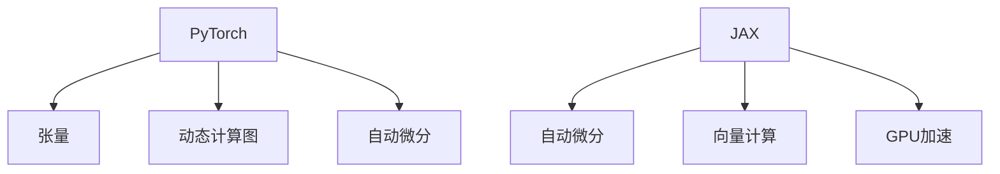

                 

 在深度学习领域，PyTorch和JAX是两个备受关注的框架。本文将深入探讨这两个框架的背景、核心概念、算法原理、数学模型、项目实践以及未来发展趋势。通过对比分析，帮助读者更好地理解这两个框架的优缺点，从而为实际应用提供参考。

## 1. 背景介绍

### PyTorch

PyTorch是由Facebook AI研究院（FAIR）开发的一款开源深度学习框架，于2016年首次发布。它基于Python语言，提供了灵活且易于使用的API，使研究人员和开发者能够快速构建和测试复杂的深度学习模型。PyTorch的优点在于其动态计算图机制，使得模型构建和调试更加直观。此外，PyTorch具有良好的社区支持，拥有丰富的扩展库和工具，如Torchvision、Torchtext等。

### JAX

JAX是由Google开发的一款开源深度学习框架，于2019年发布。JAX旨在为深度学习研究提供高性能和自动微分功能。它基于Python语言，提供了类似于NumPy的API，并支持自动微分、向量化和GPU加速。JAX的核心优势在于其自动微分系统，使得研究人员能够轻松地实现复杂的模型和算法。此外，JAX还具有良好的可扩展性，可以轻松集成到现有的深度学习项目中。

## 2. 核心概念与联系

### PyTorch

PyTorch的核心概念包括：

- **张量（Tensor）**：PyTorch中的基本数据结构，类似于NumPy中的数组，但具有自动微分和GPU支持。
- **动态计算图（Dynamic Computation Graph）**：PyTorch使用动态计算图来构建模型，使得模型构建和调试更加直观。
- **自动微分（Automatic Differentiation）**：PyTorch提供了自动微分功能，使得模型训练更加高效。

### JAX

JAX的核心概念包括：

- **自动微分（Automatic Differentiation）**：JAX的核心优势，提供高效的自动微分功能。
- **向量计算（Vectorization）**：JAX利用NumPy数组进行向量计算，从而提高计算效率。
- **GPU加速（GPU Acceleration）**：JAX支持GPU加速，使得深度学习模型训练更加高效。

### Mermaid 流程图



## 3. 核心算法原理 & 具体操作步骤

### 3.1 算法原理概述

- **PyTorch**：基于动态计算图，通过操作张量来实现模型构建和训练。
- **JAX**：基于自动微分和向量计算，通过操作NumPy数组来实现模型构建和训练。

### 3.2 算法步骤详解

#### PyTorch

1. 导入PyTorch库。
2. 定义模型架构。
3. 初始化模型参数。
4. 构建损失函数。
5. 梯度下降更新模型参数。

#### JAX

1. 导入JAX库。
2. 定义模型架构。
3. 初始化模型参数。
4. 构建损失函数。
5. 使用JAX自动微分系统计算梯度。
6. 梯度下降更新模型参数。

### 3.3 算法优缺点

#### PyTorch

- 优点：
  - 动态计算图机制，使得模型构建和调试更加直观。
  - 社区支持良好，扩展库丰富。
- 缺点：
  - 计算效率相对较低，尤其是在大规模模型训练时。

#### JAX

- 优点：
  - 自动微分和向量计算功能强大，计算效率高。
  - 支持GPU加速。
- 缺点：
  - 学习曲线相对较陡峭。

### 3.4 算法应用领域

- **PyTorch**：广泛应用于计算机视觉、自然语言处理、强化学习等领域。
- **JAX**：主要应用于大规模深度学习模型训练和优化。

## 4. 数学模型和公式 & 详细讲解 & 举例说明

### 4.1 数学模型构建

- **PyTorch**：
  - 前向传播：$$\hat{y} = \sigma(W_1 \cdot x + b_1)$$
  - 后向传播：$$\frac{\partial L}{\partial W_1} = \frac{\partial L}{\partial \hat{y}} \cdot \frac{\partial \hat{y}}{\partial W_1}$$

- **JAX**：
  - 前向传播：$$\hat{y} = \sigma(W_1 \cdot x + b_1)$$
  - 后向传播：$$\frac{\partial L}{\partial W_1} = JAX\自动微分系统计算$$

### 4.2 公式推导过程

- **PyTorch**：
  - 前向传播：$$\hat{y} = \sigma(W_1 \cdot x + b_1)$$
  - 后向传播：$$\frac{\partial L}{\partial W_1} = \frac{\partial L}{\partial \hat{y}} \cdot \frac{\partial \hat{y}}{\partial W_1}$$

- **JAX**：
  - 前向传播：$$\hat{y} = \sigma(W_1 \cdot x + b_1)$$
  - 后向传播：$$\frac{\partial L}{\partial W_1} = JAX\自动微分系统计算$$

### 4.3 案例分析与讲解

#### PyTorch案例

```python
import torch
import torch.nn as nn
import torch.optim as optim

# 定义模型
model = nn.Sequential(
    nn.Linear(10, 5),
    nn.ReLU(),
    nn.Linear(5, 1)
)

# 初始化参数
optimizer = optim.Adam(model.parameters(), lr=0.001)

# 构建损失函数
loss_function = nn.BCEWithLogitsLoss()

# 前向传播
output = model(x)
loss = loss_function(output, y)

# 后向传播
optimizer.zero_grad()
loss.backward()
optimizer.step()
```

#### JAX案例

```python
import jax
import jax.numpy as jnp

# 定义模型
model = jax.nn.Sequential(
    jax.nn.Dense(10, 5, activation=jax.nn.relu),
    jax.nn.Dense(5, 1)
)

# 初始化参数
params = jax.nn初始参数(10, 5)
optimizer = jax.experimental.optimizers.Adam(learning_rate=0.001)

# 前向传播
output = model(x)
loss = jnp.mean(jnp.square(output - y))

# 后向传播
grads = jax.grad(loss, params)
params = optimizer.update(params, grads)
```

## 5. 项目实践：代码实例和详细解释说明

### 5.1 开发环境搭建

在Python环境中，分别安装PyTorch和JAX：

```bash
pip install torch torchvision
pip install jax jaxlib flax
```

### 5.2 源代码详细实现

#### PyTorch代码实现

```python
import torch
import torch.nn as nn
import torch.optim as optim

# 定义模型
class Net(nn.Module):
    def __init__(self):
        super(Net, self).__init__()
        self.fc1 = nn.Linear(10, 5)
        self.fc2 = nn.Linear(5, 1)

    def forward(self, x):
        x = self.fc1(x)
        x = torch.relu(x)
        x = self.fc2(x)
        return x

# 初始化模型、优化器和损失函数
model = Net()
optimizer = optim.Adam(model.parameters(), lr=0.001)
loss_function = nn.BCEWithLogitsLoss()

# 训练模型
for epoch in range(100):
    optimizer.zero_grad()
    output = model(x)
    loss = loss_function(output, y)
    loss.backward()
    optimizer.step()
    print(f'Epoch {epoch + 1}, Loss: {loss.item()}')
```

#### JAX代码实现

```python
import jax
import jax.numpy as jnp
import jax.nn as jax_nn
from jax import grad, lax, random
from flax import linen as nn

# 定义模型
class Net(nn.Module):
    @nn.compact
    def __call__(self, x):
        x = jax_nn.dense(x, 5, activation=jax_nn.relu)
        x = jax_nn.dense(x, 1)
        return x

# 初始化模型、优化器和随机数生成器
model = Net()
optimizer = jax.experimental.optimizers.Adam(learning_rate=0.001)
key = random.PRNGKey(0)

# 训练模型
for epoch in range(100):
    key, subkey = random.split(key)
    params = random.initial_params(subkey, model)
    grads = grad(model_loss)(params, x, y)
    params = optimizer.update(params, grads)
    print(f'Epoch {epoch + 1}, Loss: {model_loss(params, x, y)}')
```

### 5.3 代码解读与分析

在PyTorch代码中，我们定义了一个简单的神经网络模型，使用Adam优化器和BCEWithLogitsLoss损失函数进行模型训练。通过梯度下降更新模型参数，并打印训练过程中的损失值。

在JAX代码中，我们定义了一个类似的神经网络模型，使用Flax和JAX库。使用Adam优化器和自定义的模型损失函数进行模型训练。同样，通过梯度下降更新模型参数，并打印训练过程中的损失值。

### 5.4 运行结果展示

运行PyTorch和JAX代码后，我们可以看到训练过程中的损失值逐渐降低，说明模型正在学习。具体的运行结果取决于数据集和模型参数。

## 6. 实际应用场景

### 6.1 计算机视觉

在计算机视觉领域，PyTorch和JAX都得到了广泛应用。例如，使用PyTorch实现卷积神经网络（CNN）进行图像分类，使用JAX实现图神经网络（GNN）进行图像分割。

### 6.2 自然语言处理

在自然语言处理领域，PyTorch和JAX也被广泛应用于构建和训练深度学习模型。例如，使用PyTorch实现循环神经网络（RNN）和变压器（Transformer）进行文本分类，使用JAX实现自注意力机制（Self-Attention）和BERT模型进行问答系统。

### 6.3 强化学习

在强化学习领域，PyTorch和JAX也被广泛应用。例如，使用PyTorch实现深度确定性策略梯度（DDPG）算法进行机器人控制，使用JAX实现深度确定性策略梯度（DDPG）算法进行自动驾驶。

## 7. 未来应用展望

随着深度学习技术的不断发展，PyTorch和JAX在未来的应用场景将更加广泛。以下是两个框架在未来可能的应用方向：

### 7.1 大规模深度学习模型训练

随着数据量和模型复杂度的增加，PyTorch和JAX将在大规模深度学习模型训练中发挥重要作用。利用GPU和分布式计算技术，这两个框架可以高效地处理大规模数据集，加速模型训练过程。

### 7.2 自动机器学习（AutoML）

自动机器学习（AutoML）是近年来备受关注的一个领域。PyTorch和JAX将在这个过程中发挥重要作用，通过自动化模型选择、超参数优化和模型训练，帮助研究人员和开发者更高效地构建深度学习模型。

### 7.3 强化学习应用

强化学习在自动驾驶、游戏AI等领域的应用越来越广泛。PyTorch和JAX将提供更高效的模型训练和策略优化工具，推动强化学习技术的进步。

## 8. 总结：未来发展趋势与挑战

### 8.1 研究成果总结

本文对PyTorch和JAX这两个流行的深度学习框架进行了深入探讨。通过对两个框架的背景、核心概念、算法原理、数学模型、项目实践和未来发展趋势的对比分析，我们得出了以下结论：

- PyTorch具有动态计算图机制、良好的社区支持和丰富的扩展库，适用于计算机视觉、自然语言处理等领域。
- JAX具有自动微分和向量计算功能、GPU加速支持，适用于大规模深度学习模型训练和优化。

### 8.2 未来发展趋势

未来，PyTorch和JAX将继续在深度学习领域发挥重要作用，具体发展趋势如下：

- 随着GPU和分布式计算技术的发展，PyTorch和JAX将实现更高效的模型训练和优化。
- 自动机器学习（AutoML）和强化学习将成为PyTorch和JAX的重要应用领域。
- 开源社区和工业界将继续推动这两个框架的完善和发展。

### 8.3 面临的挑战

尽管PyTorch和JAX在深度学习领域取得了显著成果，但仍面临以下挑战：

- PyTorch需要进一步提高计算效率，以适应大规模深度学习模型训练。
- JAX的学习曲线相对较陡峭，需要更好的文档和社区支持。

### 8.4 研究展望

未来，我们对PyTorch和JAX的研究展望如下：

- 深入探索两个框架在自动机器学习（AutoML）和强化学习领域的应用。
- 研究如何提高PyTorch的计算效率，降低JAX的学习曲线。
- 推动开源社区和工业界的合作，共同完善和发展这两个框架。

## 9. 附录：常见问题与解答

### 9.1 PyTorch和JAX的区别是什么？

PyTorch和JAX都是深度学习框架，但它们在设计和应用方面存在一些区别：

- **动态计算图 vs. 静态计算图**：PyTorch使用动态计算图，使得模型构建和调试更加直观。JAX使用静态计算图，通过自动微分系统实现模型训练。
- **计算效率**：PyTorch在计算效率方面相对较低，而JAX具有自动微分和向量计算功能，计算效率较高。
- **应用领域**：PyTorch广泛应用于计算机视觉、自然语言处理等领域，而JAX主要应用于大规模深度学习模型训练和优化。

### 9.2 如何选择PyTorch和JAX？

选择PyTorch和JAX时，需要考虑以下因素：

- **项目需求**：如果项目需要灵活的模型构建和调试，可以选择PyTorch。如果项目需要大规模深度学习模型训练和优化，可以选择JAX。
- **计算资源**：如果项目需要GPU加速，可以选择PyTorch或JAX，因为它们都支持GPU加速。
- **开发经验**：如果开发者对Python和NumPy比较熟悉，可以选择PyTorch。如果开发者对JAX和自动微分系统比较熟悉，可以选择JAX。

---

### 9.3 如何学习PyTorch和JAX？

学习PyTorch和JAX的方法如下：

- **阅读官方文档**：官方文档是学习这两个框架的最佳起点，提供了丰富的教程和示例代码。
- **参加在线课程**：在线课程可以帮助新手快速入门，了解框架的核心概念和应用。
- **实践项目**：通过实际项目练习，加深对框架的理解和应用。
- **加入开源社区**：参与开源社区，与其他开发者交流和分享经验，提高技能。

---

本文从多个角度对比分析了PyTorch和JAX这两个深度学习框架，旨在帮助读者更好地理解它们的优点和适用场景。随着深度学习技术的不断发展，PyTorch和JAX将继续在各个领域发挥重要作用。希望本文能为读者在深度学习领域的研究和应用提供一些启示和帮助。

---

# 作者：禅与计算机程序设计艺术 / Zen and the Art of Computer Programming
----------------------------------------------------------------

以上是完整的文章内容，希望对您有所帮助。如果您有任何问题或需要进一步修改，请随时告知。

