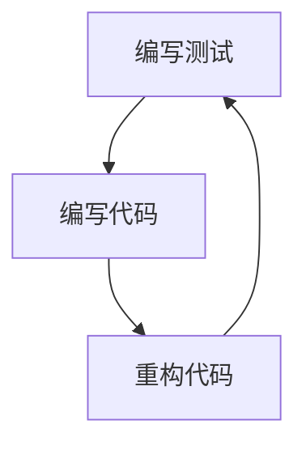

                 

测试驱动开发（Test-Driven Development，简称TDD）是一种软件开发的方法论，它强调编写测试来驱动代码的开发。通过TDD，开发者可以更早地发现并修复错误，提高代码质量，同时也可以促进良好的编程习惯。本文将详细介绍TDD的背景、核心概念、算法原理、实践步骤，并探讨其在实际应用中的表现与未来发展趋势。

## 文章关键词
- 测试驱动开发（TDD）
- 软件开发方法论
- 单元测试
- 集成测试
- 测试覆盖率
- 质量保障

## 文章摘要
本文旨在为开发者提供一个全面的TDD指南，包括其背景和核心概念，以及详细的实践步骤和技巧。通过本文的阅读，开发者可以更好地理解TDD的优势，并掌握实施TDD的方法，从而提升软件开发的效率和质量。

### 1. 背景介绍

测试驱动开发（TDD）起源于敏捷开发（Agile Development）方法论。敏捷开发强调快速响应变化、持续交付高质量软件和促进客户满意度。TDD作为敏捷开发的重要实践之一，旨在通过编写测试来驱动开发过程，确保代码的可靠性和可维护性。

TDD的主要目标是：
- 提高代码质量
- 减少bug数量
- 提升开发效率和团队协作
- 促进良好的编程习惯

TDD的基本流程包括三个阶段：编写测试、编写代码、重构代码。这三个阶段循环进行，每个循环称为一个迭代。

### 2. 核心概念与联系

为了更好地理解TDD，我们需要先了解以下几个核心概念：

#### 2.1 单元测试

单元测试是对软件中最小功能单元的测试，通常是一个函数、方法或类。单元测试的目标是验证单元的正确性，确保其在各种情况下都能正确执行。

#### 2.2 集成测试

集成测试是在多个模块或组件集成后进行的测试，目的是确保不同模块或组件之间的接口和交互能够正确工作。

#### 2.3 测试覆盖率

测试覆盖率是衡量测试全面性的指标，通常用百分比表示。高测试覆盖率意味着代码的大部分功能都经过了测试。

#### 2.4 测试金字塔

测试金字塔是一种测试优先级的模型，强调单元测试应该占大部分，集成测试和端到端测试应相对较少。这种模型有助于确保测试的有效性和高效性。

下面是一个简化的Mermaid流程图，展示了TDD的核心概念和流程：



### 3. 核心算法原理 & 具体操作步骤

#### 3.1 算法原理概述

TDD的核心算法原理可以概括为“红-绿-重构”三部曲：

- **红**：编写测试，确保测试失败。
- **绿**：编写代码，使测试通过。
- **重构**：优化代码，确保测试仍然通过。

这种循环迭代的过程有助于逐步完善代码，并保持代码的质量。

#### 3.2 算法步骤详解

下面是TDD的具体操作步骤：

1. **需求分析**：理解需求，确定功能点。
2. **编写测试**：根据需求编写测试，确保测试失败。
3. **编写代码**：编写最小化代码，使测试通过。
4. **重构代码**：优化代码，确保测试仍然通过。
5. **重复步骤2-4**：继续编写新的测试和代码，进行重构。

#### 3.3 算法优缺点

**优点**：
- 提高代码质量：通过编写测试，可以确保代码的正确性和可靠性。
- 减少bug数量：早期发现并修复错误，降低后期修复成本。
- 促进协作：测试驱动开发鼓励团队协作，共同维护代码质量。

**缺点**：
- 初始学习曲线：开发者需要适应TDD的流程和习惯。
- 代码初期冗余：测试代码和实际代码的初始比例较高，可能导致代码冗余。
- 可能影响开发进度：在某些情况下，编写测试可能需要额外时间，影响开发进度。

#### 3.4 算法应用领域

TDD适用于大多数软件开发项目，尤其适用于复杂系统、高风险项目和高可靠性要求的系统。例如，金融系统、医疗系统、航天系统等领域，TDD可以帮助确保软件的正确性和可靠性。

### 4. 数学模型和公式 & 详细讲解 & 举例说明

在TDD中，测试覆盖率是一个重要的数学模型。测试覆盖率可以通过以下公式计算：

$$
测试覆盖率 = \frac{测试代码覆盖的行数}{总代码行数} \times 100%
$$

#### 4.1 数学模型构建

测试覆盖率的构建基于以下两个参数：

- **测试代码覆盖的行数**：指的是测试用例中执行到的代码行数。
- **总代码行数**：指的是软件中所有代码的行数。

#### 4.2 公式推导过程

测试覆盖率的公式可以通过以下步骤推导：

1. **确定测试代码覆盖的行数**：通过执行测试用例，记录每个测试用例执行到的代码行数。
2. **确定总代码行数**：统计软件中所有代码的行数。
3. **计算测试覆盖率**：将测试代码覆盖的行数除以总代码行数，并乘以100%，得到测试覆盖率。

#### 4.3 案例分析与讲解

假设一个软件中有1000行代码，通过执行测试用例，发现其中800行代码被测试覆盖。那么，该软件的测试覆盖率可以计算为：

$$
测试覆盖率 = \frac{800}{1000} \times 100% = 80%
$$

这意味着该软件的测试覆盖率达到了80%。

### 5. 项目实践：代码实例和详细解释说明

下面我们将通过一个简单的项目实例，展示如何使用TDD进行开发。

#### 5.1 开发环境搭建

首先，我们需要搭建一个开发环境。这里我们选择Python作为开发语言，并使用PyTest作为测试框架。

#### 5.2 源代码详细实现

我们以一个简单的函数为例，实现一个计算两个数字之和的功能。

```python
def add(a, b):
    return a + b
```

接下来，我们按照TDD的流程进行开发。

1. **编写测试**：

```python
def test_add():
    assert add(1, 2) == 3
    assert add(-1, -2) == -3
```

2. **编写代码**：

我们编写最小化代码，使测试通过。

```python
def add(a, b):
    return a + b
```

3. **重构代码**：

我们优化代码，使其更简洁。

```python
def add(a, b):
    return a + b
```

4. **重复步骤2-3**：

我们继续编写新的测试，并根据测试结果重构代码。

```python
def test_add():
    assert add(1, 2) == 3
    assert add(-1, -2) == -3
    assert add(0, 0) == 0
```

经过多次迭代，我们最终得到一个简洁、可靠的函数。

#### 5.3 代码解读与分析

在TDD中，测试代码和实际代码的关系是紧密相连的。测试代码负责验证实际代码的正确性，而实际代码则负责实现业务逻辑。

通过TDD，我们可以确保每个功能点都被充分测试，从而提高代码的质量和可靠性。同时，TDD也有助于发现和修复早期错误，降低后期修复成本。

### 6. 实际应用场景

TDD在实际开发中的应用非常广泛。以下是一些典型的应用场景：

- **Web开发**：在Web开发中，TDD可以帮助确保前后端交互的正确性，提高用户体验。
- **移动应用开发**：在移动应用开发中，TDD可以确保应用在各种设备和操作系统上的兼容性。
- **金融系统开发**：在金融系统中，TDD可以确保交易过程的准确性和安全性。
- **嵌入式系统开发**：在嵌入式系统开发中，TDD可以确保系统的稳定性和可靠性。

### 7. 未来应用展望

随着软件开发的复杂性和规模不断扩大，TDD在未来将发挥越来越重要的作用。以下是一些未来应用展望：

- **自动化测试**：随着自动化测试技术的发展，TDD将更加自动化，降低开发者的工作负担。
- **人工智能集成**：TDD可以与人工智能技术相结合，实现智能化的测试和代码优化。
- **持续集成与持续部署**：TDD将更好地与持续集成（CI）和持续部署（CD）相结合，实现更高效的软件开发流程。

### 8. 工具和资源推荐

为了更好地实践TDD，以下是一些建议的工具和资源：

- **开发工具**：如Visual Studio Code、PyCharm等。
- **测试框架**：如PyTest、JUnit等。
- **书籍**：《测试驱动开发：使用Python》《敏捷开发实践指南》等。
- **在线资源**：如TDD.net、Stack Overflow等。

### 9. 总结：未来发展趋势与挑战

TDD作为一种先进的软件开发方法论，已经在全球范围内得到广泛应用。未来，TDD将继续发展和完善，与自动化测试、人工智能等技术相结合，为软件开发带来更多可能性。

然而，TDD也面临一些挑战，如开发者的适应能力、测试覆盖率的平衡等。为了克服这些挑战，开发者需要持续学习和实践，不断提升自己的技能。

### 10. 附录：常见问题与解答

#### Q：TDD是否适用于所有项目？

A：TDD适用于大多数项目，尤其是复杂、高风险的项目。但对于一些简单项目，TDD可能过于繁琐。

#### Q：如何确保测试覆盖率？

A：可以通过编写多种类型的测试（如单元测试、集成测试等）来提高测试覆盖率。同时，制定合理的测试策略和计划也是提高测试覆盖率的重要手段。

#### Q：TDD是否会影响开发进度？

A：在初期，TDD可能会增加开发时间，但随着时间的推移，TDD可以帮助减少后期修复成本，从而提高整体开发效率。

---

作者：禅与计算机程序设计艺术 / Zen and the Art of Computer Programming
----------------------------------------------------------------

### 结论 Conclusion

测试驱动开发（TDD）是一种强有力的软件开发方法论，它通过测试来驱动开发流程，确保代码质量，提高开发效率。本文详细介绍了TDD的背景、核心概念、算法原理、实践步骤和实际应用场景。通过TDD，开发者可以更好地应对复杂性和变化，确保软件的正确性和可靠性。未来，TDD将继续发展，与更多先进技术相结合，为软件开发带来更多价值。希望本文能为您的软件开发实践提供有益的指导。

