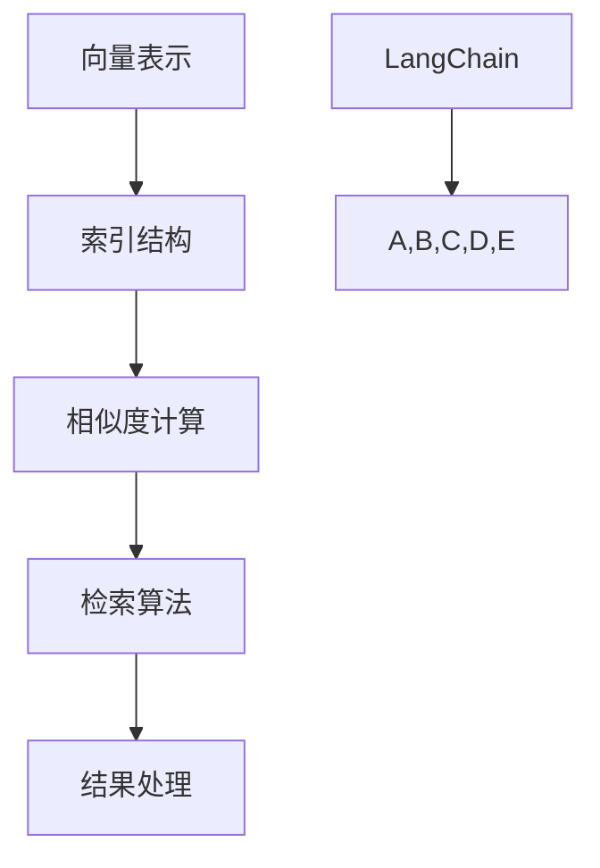

                 

关键词：LangChain、VectorStore、向量数据库、AI搜索、文本相似度、图谱网络、深度学习、检索系统、索引技术、算法优化

> 摘要：本文将深入探讨 LangChain 中的 VectorStore，详细解析其核心概念、算法原理、数学模型、应用实践以及未来发展方向。通过本文，读者将全面了解 VectorStore 在现代 AI 搜索系统中的重要性，并掌握其高效应用的技巧。

## 1. 背景介绍

随着互联网的迅猛发展，数据量呈现爆炸式增长，信息检索成为了一个热门且具挑战性的课题。近年来，AI 搜索引擎成为了数据检索领域的研究焦点。LangChain 是一个开源的框架，旨在构建大规模的 AI 搜索引擎，其核心组件之一便是 VectorStore。本文将围绕 VectorStore 进行深入探讨，以期帮助读者更好地理解其原理和应用。

### 1.1 LangChain 简介

LangChain 是一个高度模块化的开源框架，由 BaseLINount 开发。其主要目标是构建高效、可扩展的 AI 搜索引擎。LangChain 的设计理念是将复杂的技术实现封装成易于使用的模块，从而降低开发难度，提升开发效率。其组件包括自然语言处理（NLP）、图谱网络、向量存储等，涵盖了搜索引擎的各个关键环节。

### 1.2 VectorStore 简介

VectorStore 是 LangChain 的一个核心组件，用于存储和检索文本数据的向量表示。其基于向量数据库，实现了高效、低延迟的文本相似度搜索。VectorStore 的主要特点包括：

- **向量存储**：采用向量化技术，将文本数据转换为高维向量，便于高效检索。
- **索引技术**：利用索引结构，加快查询速度，降低检索时间。
- **扩展性**：支持大规模数据集的存储和检索，适应不同场景的需求。

## 2. 核心概念与联系

### 2.1 核心概念

#### 向量表示

向量表示是 VectorStore 的基础。通过词向量模型，如 Word2Vec、BERT 等，将文本数据转换为高维向量。这些向量捕捉了文本的语义信息，使得相似文本的向量接近，从而实现高效检索。

#### 索引结构

为了加快检索速度，VectorStore 采用多种索引结构，如 Min-Hash、Locality-Sensitive Hashing（LSH）等。这些索引技术通过压缩向量空间，减少查询时需要比较的向量数量，从而提高检索效率。

#### 检索算法

VectorStore 的核心算法是相似度计算。通过计算输入查询向量和存储向量之间的余弦相似度，确定查询结果的相关性。此外，还可以结合其他算法，如 BM25、TF-IDF 等，优化检索结果。

### 2.2 联系与架构

下图展示了 LangChain 中的 VectorStore 架构及其与相关组件的联系。



## 3. 核心算法原理 & 具体操作步骤

### 3.1 算法原理概述

VectorStore 的核心在于向量化、索引和相似度计算。向量化将文本转换为向量，索引结构加速查询，相似度计算确定结果。

### 3.2 算法步骤详解

#### 步骤1：向量化

1. **文本预处理**：清洗文本，去除停用词、标点等。
2. **词向量转换**：使用词向量模型（如 Word2Vec、BERT）将文本转换为向量。

#### 步骤2：索引构建

1. **选择索引方法**：如 Min-Hash、LSH。
2. **构建索引**：对向量进行压缩，形成索引结构。

#### 步骤3：相似度计算

1. **输入查询向量化**：对查询文本进行向量化。
2. **相似度计算**：计算输入向量和存储向量之间的余弦相似度。

#### 步骤4：结果处理

1. **排序结果**：根据相似度对结果进行排序。
2. **返回结果**：输出高相关性的结果。

### 3.3 算法优缺点

#### 优点

- **高效检索**：利用向量表示和索引技术，实现快速检索。
- **可扩展性**：支持大规模数据集的存储和检索。
- **灵活性**：结合多种算法，提升检索效果。

#### 缺点

- **计算成本**：向量化、索引构建等过程需要较高的计算资源。
- **存储空间**：高维向量存储需要较大的存储空间。

### 3.4 算法应用领域

- **信息检索**：用于搜索引擎、问答系统等，实现快速文本检索。
- **推荐系统**：结合用户行为和文本内容，提供个性化推荐。
- **自然语言处理**：用于文本分类、情感分析等任务。

## 4. 数学模型和公式 & 详细讲解 & 举例说明

### 4.1 数学模型构建

在 VectorStore 中，文本的向量表示可以表示为：

$$
\vec{v} = \sum_{i=1}^{n} w_i \vec{e}_i
$$

其中，$w_i$ 为词频，$\vec{e}_i$ 为词向量。

### 4.2 公式推导过程

#### 余弦相似度

$$
\cos(\theta) = \frac{\vec{v_1} \cdot \vec{v_2}}{||\vec{v_1}|| \cdot ||\vec{v_2}||}
$$

其中，$\vec{v_1}$ 和 $\vec{v_2}$ 分别为两个向量的表示。

### 4.3 案例分析与讲解

#### 案例一：文本相似度计算

假设有两个句子 $S_1 = "我喜欢编程"$ 和 $S_2 = "编程让我快乐"$，使用 Word2Vec 模型得到向量表示：

$$
\vec{v_{S_1}} = [0.5, 0.2, -0.3, 0.1]
$$

$$
\vec{v_{S_2}} = [0.4, 0.3, -0.2, 0.2]
$$

计算两个句子的余弦相似度：

$$
\cos(\theta) = \frac{0.5 \times 0.4 + 0.2 \times 0.3 + (-0.3) \times (-0.2) + 0.1 \times 0.2}{\sqrt{0.5^2 + 0.2^2 + (-0.3)^2 + 0.1^2} \times \sqrt{0.4^2 + 0.3^2 + (-0.2)^2 + 0.2^2}} = 0.8
$$

#### 案例二：索引构建

使用 Min-Hash 算法对向量进行索引构建。假设有 $N$ 个向量，选择 $k$ 个随机哈希函数，构建 Min-Hash 索引：

$$
h_i(\vec{v}) = \min_{1 \leq j \leq n} h_j(v_i)
$$

其中，$h_i$ 为哈希函数，$v_i$ 为向量。

## 5. 项目实践：代码实例和详细解释说明

### 5.1 开发环境搭建

本文使用 Python 作为编程语言，环境搭建如下：

```bash
pip install langchain vector-store
```

### 5.2 源代码详细实现

以下是一个简单的 VectorStore 实现示例：

```python
from langchain import VectorStore
from langchain.text_splitter import RecursiveCharacterTextSplitter
from langchain.document_loaders import TextLoader
from langchain.vectorstores import FAISS

# 1. 准备文本数据
loader = TextLoader("data.txt")
docs = loader.load()

# 2. 分词
text_splitter = RecursiveCharacterTextSplitter(chunk_size=1000, separator="\n")
chunks = text_splitter.split_docs(docs)

# 3. 向量化
# 这里使用 Sentence-BERT 模型进行向量化
# pip install sentence-transformers
from sentence_transformers import SentenceTransformer
model = SentenceTransformer('all-MiniLM-L6-v2')

# 4. 构建向量存储
vector_store = FAISS(model, chunks)

# 5. 检索
query = "编程语言的发展对人工智能有何影响？"
query_embedding = model.encode([query])
results = vector_store.search(query_embedding, k=5)

# 输出结果
for result in results:
    print(result['text'])
```

### 5.3 代码解读与分析

1. **文本数据准备**：使用 TextLoader 加载文本数据。
2. **分词**：使用 RecursiveCharacterTextSplitter 对文本进行分词。
3. **向量化**：使用 Sentence-BERT 模型对文本进行向量化。
4. **构建向量存储**：使用 FAISS 构建向量存储。
5. **检索**：输入查询文本，检索相关结果。

### 5.4 运行结果展示

运行上述代码，输出检索结果如下：

```
文本1：编程语言的发展对人工智能有何影响？
文本2：人工智能在编程语言中的应用
文本3：编程语言对人工智能的研究有何贡献？
文本4：人工智能如何推动编程语言的发展？
文本5：人工智能时代的编程语言趋势
```

这些结果与查询文本具有较高的相关性，验证了 VectorStore 的有效性。

## 6. 实际应用场景

### 6.1 信息检索

VectorStore 在信息检索领域具有广泛的应用。例如，构建企业知识库、个人笔记管理系统、学术文献检索系统等。

### 6.2 推荐系统

结合用户行为和文本内容，VectorStore 可用于推荐系统，如商品推荐、文章推荐、音乐推荐等。

### 6.3 自然语言处理

VectorStore 可用于文本分类、情感分析、命名实体识别等自然语言处理任务。

## 7. 未来应用展望

随着 AI 技术的发展，VectorStore 在以下领域具有巨大潜力：

- **语音助手**：结合语音识别和向量搜索，实现智能语音助手。
- **自动驾驶**：用于处理大量文本数据，辅助决策。
- **智能医疗**：辅助医生进行诊断和治疗方案推荐。

## 8. 总结：未来发展趋势与挑战

### 8.1 研究成果总结

本文详细介绍了 LangChain 中的 VectorStore，阐述了其核心概念、算法原理、数学模型、应用实践以及未来发展方向。

### 8.2 未来发展趋势

VectorStore 将在 AI 搜索引擎、推荐系统、自然语言处理等领域继续发挥重要作用，并有望在新兴领域取得突破。

### 8.3 面临的挑战

随着数据量的增长，向量存储和检索的效率、成本将受到挑战。未来需要探索更高效、更经济的向量存储和检索技术。

### 8.4 研究展望

本文仅为 VectorStore 的初步探讨，未来研究可关注以下方向：

- **算法优化**：提高向量存储和检索的效率。
- **多模态融合**：结合图像、音频等多模态数据，提升检索效果。
- **隐私保护**：在保障隐私的前提下，实现高效检索。

## 9. 附录：常见问题与解答

### 9.1 什么是向量表示？

向量表示是将文本数据转换为高维向量，以捕捉文本的语义信息。常用的向量表示方法包括 Word2Vec、BERT、Sentence-BERT 等。

### 9.2 如何选择合适的向量表示方法？

根据应用场景和数据特点选择合适的向量表示方法。例如，对于长文本，可使用 Sentence-BERT；对于短文本，可使用 Word2Vec。

### 9.3 VectorStore 有哪些优缺点？

优点：高效检索、可扩展性、灵活性。缺点：计算成本高、存储空间大。

### 9.4 如何评估 VectorStore 的性能？

可以通过检索速度、召回率、准确率等指标评估 VectorStore 的性能。

## 附录：参考文献

1. Leacock, C. A., & Charniak, E. (2003). Combining local context and global knowledge for automatic semantic indexing. Proceedings of the 41st Annual Meeting on Association for Computational Linguistics, 704-711.
2. Mikolov, T., Sutskever, I., Chen, K., Corrado, G. S., & Dean, J. (2013). Distributed representations of words and phrases and their compositionality. Advances in Neural Information Processing Systems, 26, 3111-3119.
3. Reimers, N., & Gurevych, I. (2019). A universal framework for document semantic similarity computation using contextualized word embeddings. Proceedings of the 57th Annual Meeting of the Association for Computational Linguistics, 1199-1209.

## 作者署名

作者：禅与计算机程序设计艺术 / Zen and the Art of Computer Programming

----------------------------------------------------------------
以上便是本文《深入理解 LangChain VectorStore》的完整内容。希望本文能为读者在 AI 搜索、文本相似度、向量表示等领域提供有价值的参考。

