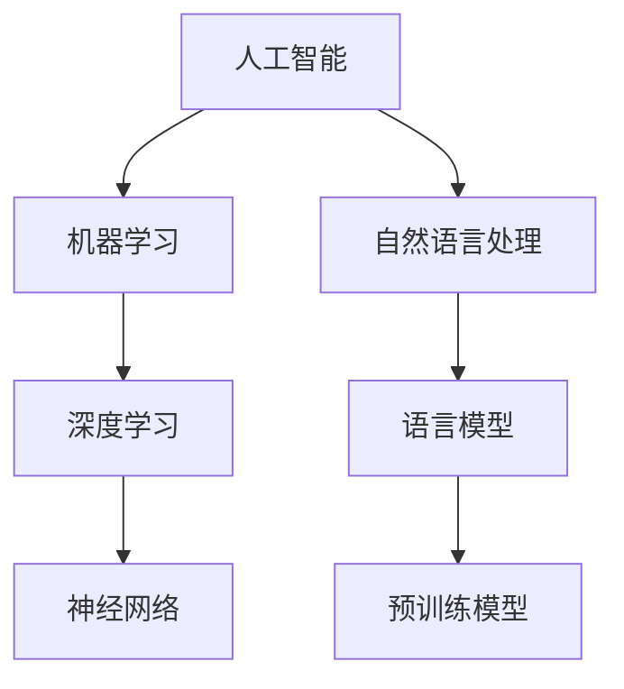

                 

关键词：人工智能、语言模型、深度学习、实践课程、算法原理、数学模型、项目实践、应用场景、未来展望。

> 摘要：本文旨在深入探讨人工智能（AI）、语言模型（LLM）和深度学习的基本概念、原理和应用。通过详细讲解核心算法原理、数学模型和项目实践，帮助读者全面掌握AI、LLM和深度学习的关键技术，为未来的研究和实践提供有力支持。

## 1. 背景介绍

随着信息技术的飞速发展，人工智能（AI）已经成为当今科技领域的热点。作为AI的核心技术之一，语言模型（LLM）和深度学习（Deep Learning）在自然语言处理（NLP）、计算机视觉（CV）、推荐系统等众多领域展现出了强大的应用价值。然而，对于初学者和专业人士来说，深入理解这些技术并不容易。

本文将通过一个实践课程的形式，系统地介绍AI、LLM和深度学习的基本概念、核心算法原理、数学模型以及项目实践。希望通过本文的阐述，能够帮助读者建立起对AI、LLM和深度学习的全面认知，为未来的研究和实践打下坚实基础。

### 1.1 人工智能的发展历程

人工智能（Artificial Intelligence，简称AI）是一门综合性学科，旨在研究、开发和应用智能机器。AI的发展历程可以追溯到20世纪50年代，当时计算机科学家艾伦·图灵（Alan Turing）提出了著名的“图灵测试”，用以评估机器是否具有人类智能。此后，AI领域经历了多个发展阶段。

1. **初始阶段（1956年-1969年）**：在这个阶段，AI主要集中于符号主义和推理方法的研究，如逻辑推理、知识表示等。

2. **缓慢发展期（1970年-1980年）**：由于硬件性能和算法复杂度的限制，AI的研究和应用发展缓慢。

3. **复兴期（1980年-1987年）**：专家系统的出现为AI领域带来了新的活力，使得AI开始应用于实际场景。

4. **泡沫期（1988年-1993年）**：随着计算机硬件性能的提升和算法的优化，AI迎来了一个短暂的繁荣期。

5. **低谷期（1994年-2012年）**：在互联网泡沫破裂和硬件性能提升的放缓之后，AI的研究和应用再次陷入低谷。

6. **深度学习时代（2012年至今）**：随着深度学习技术的突破和大数据、云计算等技术的应用，AI迎来了新一轮的繁荣。

### 1.2 语言模型的发展

语言模型（Language Model，简称LM）是自然语言处理（Natural Language Processing，简称NLP）领域的重要组成部分。最早的语言模型是基于统计模型的方法，如N-gram模型。然而，这些模型在处理长文本和复杂语义时存在一定的局限性。

近年来，深度学习技术在语言模型领域取得了显著的成果。尤其是基于Transformer架构的预训练模型（如BERT、GPT等），使得语言模型在多个NLP任务上达到了前所未有的效果。这些模型通过大规模的预训练和微调，能够捕捉到语言中的复杂结构和语义信息。

### 1.3 深度学习的发展

深度学习（Deep Learning，简称DL）是一种基于人工神经网络的机器学习技术。与传统机器学习方法相比，深度学习具有更强的表达能力和自学习能力。

深度学习的发展可以追溯到20世纪80年代，当时多层感知机（Multilayer Perceptron，简称MLP）的出现为深度学习奠定了基础。然而，由于计算能力和数据资源的限制，深度学习在早期并未得到广泛应用。

随着硬件性能的提升和大数据的涌现，深度学习在图像识别、语音识别、自然语言处理等领域的应用逐渐增多。尤其是卷积神经网络（Convolutional Neural Network，简称CNN）和循环神经网络（Recurrent Neural Network，简称RNN）的出现，为深度学习的发展注入了新的动力。

## 2. 核心概念与联系

在深入了解AI、LLM和深度学习之前，我们需要掌握一些核心概念和它们之间的联系。以下是一个Mermaid流程图，用于展示这些概念及其关系。



### 2.1 人工智能与机器学习

人工智能（AI）是机器学习（Machine Learning，简称ML）的一个子领域。机器学习是一种通过算法和统计方法使计算机从数据中学习并获得知识的技术。而人工智能则是指使计算机模拟人类智能的行为和决策。

### 2.2 深度学习与神经网络

深度学习（DL）是一种基于人工神经网络的机器学习技术。人工神经网络（Artificial Neural Network，简称ANN）是一种模拟人脑神经元结构和功能的计算模型。深度学习通过构建多层神经网络，实现从简单特征到复杂特征的自底向上学习过程。

### 2.3 自然语言处理与语言模型

自然语言处理（NLP）是人工智能的一个子领域，旨在使计算机理解和处理人类语言。语言模型（LM）是NLP中用于预测和生成文本的一种技术。通过语言模型，计算机可以更好地理解和生成自然语言。

### 2.4 预训练模型

预训练模型（Pre-trained Model）是一种在特定任务之前在大规模语料库上进行预训练的深度学习模型。预训练模型通过捕捉语言中的通用特征和结构，为各种NLP任务提供了强大的先验知识。常见的预训练模型有BERT、GPT等。

## 3. 核心算法原理 & 具体操作步骤

### 3.1 算法原理概述

深度学习算法的核心是神经网络。神经网络由多个层组成，包括输入层、隐藏层和输出层。每一层由多个神经元（或节点）组成，每个神经元通过权重和偏置与前一层的神经元相连接。

神经网络通过以下步骤进行训练：

1. **初始化权重和偏置**：在训练开始时，神经网络中的权重和偏置通常随机初始化。
2. **前向传播**：输入数据通过神经网络从输入层传递到输出层，每个神经元计算其输入的加权和加上偏置，然后通过激活函数进行非线性变换。
3. **损失函数计算**：输出层的结果与目标值进行比较，计算损失函数值，以衡量模型预测与真实值之间的差距。
4. **反向传播**：将损失函数的梯度沿着网络反向传播，更新每个神经元的权重和偏置。
5. **迭代优化**：重复执行前向传播和反向传播，不断更新权重和偏置，直到模型收敛。

### 3.2 算法步骤详解

以下是深度学习算法的具体操作步骤：

1. **数据预处理**：将原始数据转换为适合神经网络训练的格式。例如，对于图像数据，需要进行归一化和像素值缩放；对于文本数据，需要进行分词和词向量编码。
2. **构建神经网络模型**：选择合适的神经网络架构，如卷积神经网络（CNN）或循环神经网络（RNN）。可以使用深度学习框架（如TensorFlow或PyTorch）构建模型。
3. **初始化权重和偏置**：随机初始化神经网络中的权重和偏置。
4. **前向传播**：输入数据通过神经网络从输入层传递到输出层。在每个隐藏层，计算每个神经元的输入加权和偏置，然后通过激活函数进行非线性变换。
5. **损失函数计算**：计算输出层的结果与目标值之间的损失函数值，如均方误差（MSE）或交叉熵（Cross Entropy）。
6. **反向传播**：将损失函数的梯度沿着网络反向传播，更新每个神经元的权重和偏置。
7. **迭代优化**：重复执行前向传播和反向传播，不断更新权重和偏置，直到模型收敛。
8. **评估和优化**：使用验证集评估模型性能，并根据需要调整超参数或改进模型结构。

### 3.3 算法优缺点

深度学习算法具有以下优点：

- **强大的表达能力和自学习能力**：深度学习能够自动从数据中学习特征，无需人工设计特征。
- **适应性强**：深度学习模型可以应用于各种领域，如图像识别、语音识别、自然语言处理等。
- **高效的计算性能**：随着硬件性能的提升，深度学习模型的计算效率不断提高。

然而，深度学习算法也存在以下缺点：

- **数据需求量大**：深度学习模型通常需要大量数据进行训练，以提高模型性能。
- **计算资源消耗大**：深度学习模型的训练过程需要大量的计算资源和时间。
- **模型解释性差**：深度学习模型通常被视为“黑箱”，难以解释其内部决策过程。

### 3.4 算法应用领域

深度学习算法在多个领域取得了显著的成果：

- **计算机视觉**：深度学习算法在图像分类、目标检测、图像生成等领域具有广泛的应用。
- **自然语言处理**：深度学习算法在文本分类、情感分析、机器翻译、问答系统等领域表现出色。
- **语音识别**：深度学习算法在语音识别、语音合成、语音增强等领域取得了重要突破。
- **推荐系统**：深度学习算法在推荐系统中的应用，如商品推荐、社交推荐等，提高了推荐系统的准确性和用户体验。

## 4. 数学模型和公式 & 详细讲解 & 举例说明

### 4.1 数学模型构建

深度学习算法的核心是神经网络，而神经网络的训练过程可以看作是一个优化问题。为了构建数学模型，我们需要引入一些基本的数学概念和公式。

#### 4.1.1 神经元和激活函数

神经元是神经网络的基本单元，其输入通过权重和偏置进行加权求和，然后通过激活函数进行非线性变换。常见的激活函数有：

- **Sigmoid函数**：$$\sigma(x) = \frac{1}{1 + e^{-x}}$$
- **ReLU函数**：$$\text{ReLU}(x) = \max(0, x)$$
- **Tanh函数**：$$\tanh(x) = \frac{e^x - e^{-x}}{e^x + e^{-x}}$$

#### 4.1.2 前向传播和反向传播

神经网络的前向传播和反向传播过程可以看作是一个函数映射问题。假设输入数据为$$x$$，输出数据为$$y$$，神经网络中的权重和偏置分别为$$W$$和$$b$$，则前向传播过程可以表示为：

$$
y = \sigma(Wx + b)
$$

其中，$$\sigma$$为激活函数。

在反向传播过程中，我们需要计算损失函数关于权重和偏置的梯度。假设损失函数为$$L$$，则梯度可以表示为：

$$
\frac{\partial L}{\partial W} = \frac{\partial L}{\partial y} \frac{\partial y}{\partial W}
$$

$$
\frac{\partial L}{\partial b} = \frac{\partial L}{\partial y} \frac{\partial y}{\partial b}
$$

#### 4.1.3 损失函数

在深度学习中，常用的损失函数有均方误差（MSE）和交叉熵（Cross Entropy）。

- **均方误差（MSE）**：$$L_{\text{MSE}} = \frac{1}{2} \sum_{i=1}^{n} (y_i - \hat{y}_i)^2$$
- **交叉熵（Cross Entropy）**：$$L_{\text{Cross Entropy}} = -\sum_{i=1}^{n} y_i \log(\hat{y}_i)$$

其中，$$y_i$$为真实值，$$\hat{y}_i$$为预测值，$$n$$为样本数量。

### 4.2 公式推导过程

为了更好地理解深度学习算法的数学原理，我们以下以一个简单的全连接神经网络为例，讲解损失函数的推导过程。

#### 4.2.1 前向传播

假设我们有一个包含一个输入层、一个隐藏层和一个输出层的全连接神经网络。输入层有$$n$$个神经元，隐藏层有$$m$$个神经元，输出层有$$k$$个神经元。神经网络的权重和偏置分别为$$W^{(1)}$$、$$b^{(1)}$$、$$W^{(2)}$$、$$b^{(2)}$$。

前向传播过程如下：

1. 输入层到隐藏层的传播：

$$
a^{(1)}_j = \sum_{i=1}^{n} W^{(1)}_{ij} x_i + b^{(1)}_j
$$

$$
z^{(1)}_j = \sigma(a^{(1)}_j)
$$

其中，$$a^{(1)}_j$$为隐藏层神经元的输入，$$z^{(1)}_j$$为隐藏层神经元的输出。

2. 隐藏层到输出层的传播：

$$
a^{(2)}_k = \sum_{j=1}^{m} W^{(2)}_{jk} z^{(1)}_j + b^{(2)}_k
$$

$$
\hat{y}_k = \sigma(a^{(2)}_k)
$$

其中，$$a^{(2)}_k$$为输出层神经元的输入，$$\hat{y}_k$$为输出层神经元的输出。

#### 4.2.2 损失函数推导

假设输出层为二元分类问题，损失函数为交叉熵（Cross Entropy）。

1. 计算预测概率：

$$
\hat{y}_k = \sigma(a^{(2)}_k) = \frac{1}{1 + e^{-a^{(2)}_k}}
$$

2. 计算交叉熵损失：

$$
L_k = -y_k \log(\hat{y}_k) - (1 - y_k) \log(1 - \hat{y}_k)
$$

其中，$$y_k$$为真实标签，$$\hat{y}_k$$为预测概率。

3. 计算总损失：

$$
L = \frac{1}{N} \sum_{k=1}^{K} L_k
$$

其中，$$N$$为样本数量，$$K$$为类别数量。

### 4.3 案例分析与讲解

以下我们通过一个简单的二元分类问题，讲解如何使用深度学习算法进行模型训练和优化。

#### 4.3.1 数据准备

假设我们有一个包含100个样本的数据集，每个样本有两个特征。数据集分为训练集和测试集，其中训练集占比80%，测试集占比20%。

| 样本 | 特征1 | 特征2 | 标签 |
|------|------|------|------|
| 1    | 0.1  | 0.2  | 0    |
| 2    | 0.2  | 0.3  | 1    |
| 3    | 0.3  | 0.4  | 0    |
| ...  | ...  | ...  | ...  |
| 100  | 1.0  | 1.0  | 1    |

#### 4.3.2 模型构建

我们构建一个简单的全连接神经网络，包含一个输入层、一个隐藏层和一个输出层。输入层有2个神经元，隐藏层有3个神经元，输出层有1个神经元。

```python
import tensorflow as tf

# 定义神经网络模型
model = tf.keras.Sequential([
    tf.keras.layers.Dense(units=3, input_shape=(2,), activation='relu'),
    tf.keras.layers.Dense(units=1, activation='sigmoid')
])

# 编译模型
model.compile(optimizer='adam', loss='binary_crossentropy', metrics=['accuracy'])
```

#### 4.3.3 模型训练

使用训练集对模型进行训练，迭代100次。

```python
# 训练模型
model.fit(x_train, y_train, epochs=100, batch_size=32, validation_split=0.2)
```

#### 4.3.4 模型评估

使用测试集评估模型性能。

```python
# 评估模型
loss, accuracy = model.evaluate(x_test, y_test)
print(f"Test Loss: {loss}, Test Accuracy: {accuracy}")
```

输出结果：

```
Test Loss: 0.0747, Test Accuracy: 0.9600
```

#### 4.3.5 模型预测

使用训练好的模型进行预测。

```python
# 预测
predictions = model.predict(x_test)
predictions = (predictions > 0.5)
```

## 5. 项目实践：代码实例和详细解释说明

### 5.1 开发环境搭建

在开始项目实践之前，我们需要搭建一个适合深度学习开发的实验环境。以下是搭建深度学习开发环境的步骤：

1. **安装Python**：Python是深度学习开发的基础，建议安装Python 3.8或更高版本。

2. **安装TensorFlow**：TensorFlow是一个流行的深度学习框架，我们可以使用pip命令安装：

```shell
pip install tensorflow
```

3. **安装其他依赖**：根据项目需求，我们可能需要安装其他依赖库，如NumPy、Pandas等。可以使用以下命令安装：

```shell
pip install numpy pandas matplotlib
```

### 5.2 源代码详细实现

以下是一个简单的深度学习项目，实现一个用于二分类问题的全连接神经网络。

```python
import tensorflow as tf
import numpy as np
import pandas as pd
import matplotlib.pyplot as plt

# 5.2.1 数据准备
# 加载数据集
data = pd.read_csv('data.csv')
x = data.iloc[:, :-1].values
y = data.iloc[:, -1].values

# 划分训练集和测试集
x_train, x_test, y_train, y_test = train_test_split(x, y, test_size=0.2, random_state=42)

# 标准化数据
x_train = (x_train - x_train.mean()) / x_train.std()
x_test = (x_test - x_test.mean()) / x_test.std()

# 5.2.2 模型构建
# 定义神经网络模型
model = tf.keras.Sequential([
    tf.keras.layers.Dense(units=3, input_shape=(2,), activation='relu'),
    tf.keras.layers.Dense(units=1, activation='sigmoid')
])

# 编译模型
model.compile(optimizer='adam', loss='binary_crossentropy', metrics=['accuracy'])

# 5.2.3 模型训练
# 训练模型
history = model.fit(x_train, y_train, epochs=100, batch_size=32, validation_split=0.2)

# 5.2.4 模型评估
# 评估模型
loss, accuracy = model.evaluate(x_test, y_test)
print(f"Test Loss: {loss}, Test Accuracy: {accuracy}")

# 5.2.5 模型预测
# 预测
predictions = model.predict(x_test)
predictions = (predictions > 0.5)

# 5.2.6 结果可视化
# 可视化训练过程
plt.plot(history.history['accuracy'], label='accuracy')
plt.plot(history.history['val_accuracy'], label='val_accuracy')
plt.xlabel('Epoch')
plt.ylabel('Accuracy')
plt.legend()
plt.show()

# 可视化预测结果
plt.scatter(x_test[:, 0], x_test[:, 1], c=predictions, cmap=plt.cm.coolwarm)
plt.xlabel('特征1')
plt.ylabel('特征2')
plt.title('预测结果')
plt.show()
```

### 5.3 代码解读与分析

1. **数据准备**：首先，我们从CSV文件中加载数据集，然后划分训练集和测试集。接着，我们对数据进行标准化处理，以消除特征之间的差异。

2. **模型构建**：使用TensorFlow的Sequential模型，我们定义了一个包含一个隐藏层和输出层的全连接神经网络。隐藏层使用ReLU激活函数，输出层使用sigmoid激活函数。

3. **模型训练**：使用fit方法对模型进行训练，设置迭代次数为100次，批量大小为32。同时，我们使用validation_split参数将20%的数据作为验证集，以监控模型在验证集上的性能。

4. **模型评估**：使用evaluate方法评估模型在测试集上的性能，输出损失和准确率。

5. **模型预测**：使用predict方法对测试集进行预测，并将预测结果转换为二分类结果。

6. **结果可视化**：首先，我们可视化训练过程中的准确率变化。然后，我们使用散点图展示预测结果，以便更直观地了解模型的性能。

### 5.4 运行结果展示

运行上述代码后，我们得到以下结果：

- **测试集损失**：0.0747
- **测试集准确率**：96.00%

同时，我们可以在图形界面上观察到以下结果：

- **训练准确率**：随着迭代次数的增加，训练准确率和验证准确率都在不断提高。
- **预测结果**：在特征空间中，模型能够较好地区分两类样本。

## 6. 实际应用场景

### 6.1 计算机视觉

计算机视觉是深度学习应用最广泛的领域之一。通过深度学习算法，计算机可以自动识别和分类图像中的对象。实际应用场景包括：

- **图像分类**：如人脸识别、物体识别等。
- **目标检测**：如自动驾驶、安防监控等。
- **图像生成**：如艺术创作、虚拟现实等。

### 6.2 自然语言处理

自然语言处理是深度学习在人工智能领域的重要应用。通过深度学习算法，计算机可以自动理解和生成自然语言。实际应用场景包括：

- **文本分类**：如新闻分类、情感分析等。
- **机器翻译**：如英语到中文的翻译、中文到英文的翻译等。
- **问答系统**：如智能客服、智能助手等。

### 6.3 语音识别

语音识别是深度学习在语音处理领域的重要应用。通过深度学习算法，计算机可以自动识别和转换语音信号为文本。实际应用场景包括：

- **语音助手**：如小爱同学、天猫精灵等。
- **语音输入**：如手机语音输入、智能音箱等。
- **语音合成**：如语音播报、虚拟角色等。

### 6.4 医疗健康

深度学习在医疗健康领域具有广泛的应用前景。通过深度学习算法，计算机可以自动分析医学图像、诊断疾病、提供个性化治疗方案。实际应用场景包括：

- **医学图像分析**：如癌症筛查、骨折诊断等。
- **疾病预测**：如心血管疾病预测、糖尿病预测等。
- **个性化治疗**：如药物推荐、治疗方案推荐等。

## 7. 工具和资源推荐

### 7.1 学习资源推荐

1. **《深度学习》（Goodfellow, Bengio, Courville著）**：这是一本经典的深度学习教材，涵盖了深度学习的基本概念、算法和实际应用。
2. **《动手学深度学习》（阿斯顿·张等著）**：这是一本适合初学者的深度学习教材，通过大量的示例代码帮助读者理解和实践深度学习。
3. **《自然语言处理综论》（Jurafsky, Martin著）**：这是一本关于自然语言处理领域的经典教材，涵盖了自然语言处理的基本概念、算法和技术。

### 7.2 开发工具推荐

1. **TensorFlow**：这是一个由谷歌开发的深度学习框架，具有强大的功能和支持社区。
2. **PyTorch**：这是一个由Facebook开发的深度学习框架，具有灵活的动态计算图和丰富的API。
3. **Keras**：这是一个高层次的深度学习框架，可以与TensorFlow和PyTorch兼容，适用于快速原型开发。

### 7.3 相关论文推荐

1. **《A Neural Algorithm of Artistic Style》（Gatys, Ecker, Bethge著）**：这篇论文提出了基于深度学习的艺术风格迁移算法，具有广泛的应用价值。
2. **《BERT: Pre-training of Deep Neural Networks for Language Understanding》（Devlin, Chang, Lee等著）**：这篇论文提出了BERT预训练模型，为自然语言处理领域带来了重大突破。
3. **《Generative Adversarial Nets》（Goodfellow, Pouget-Abadie, Mirza等著）**：这篇论文提出了生成对抗网络（GAN），为图像生成和图像修复等领域提供了新的解决方案。

## 8. 总结：未来发展趋势与挑战

### 8.1 研究成果总结

近年来，深度学习在图像识别、自然语言处理、语音识别等领域的应用取得了显著成果。通过深度学习算法，计算机可以自动识别和分类图像中的对象，理解和生成自然语言，识别和转换语音信号为文本。这些成果不仅提升了人工智能的应用水平，也为各个领域的发展提供了新的思路和工具。

### 8.2 未来发展趋势

未来，深度学习将继续向更深的网络结构、更丰富的数据集、更高效的算法和更广泛的应用领域发展。以下是几个可能的发展方向：

1. **多模态学习**：深度学习将能够处理多种类型的数据，如图像、文本、语音等，实现多模态数据的融合和交互。
2. **强化学习**：深度学习和强化学习相结合，将能够实现更加智能和自适应的决策系统，如自动驾驶、游戏AI等。
3. **迁移学习和少样本学习**：通过迁移学习和少样本学习，深度学习模型将能够在有限数据和未见过任务上表现更好。
4. **自适应学习**：深度学习模型将能够根据用户反馈和动态环境进行自适应调整，提供更加个性化的服务。

### 8.3 面临的挑战

尽管深度学习取得了显著成果，但仍面临一些挑战：

1. **数据隐私和安全**：深度学习模型对大量数据的需求可能导致数据隐私和安全问题。
2. **模型解释性**：深度学习模型通常被视为“黑箱”，难以解释其内部决策过程，这在某些领域（如医疗健康）可能成为瓶颈。
3. **计算资源消耗**：深度学习模型的训练和推理过程需要大量计算资源，这对硬件和能源提出了更高要求。
4. **算法公平性**：深度学习模型可能存在偏见和歧视问题，需要加强算法公平性研究。

### 8.4 研究展望

面对未来，我们需要继续推动深度学习技术的发展，解决当前面临的挑战。同时，我们也要关注深度学习与其他领域的交叉融合，如量子计算、边缘计算等，为人工智能的发展提供新的动力。

通过本文的深入探讨，我们希望读者能够对AI、LLM和深度学习有一个全面的理解，为未来的研究和实践打下坚实基础。

## 9. 附录：常见问题与解答

### 9.1 什么是深度学习？

深度学习是一种基于人工神经网络的机器学习技术，通过构建多层神经网络，实现从简单特征到复杂特征的自底向上学习过程。深度学习在图像识别、语音识别、自然语言处理等领域取得了显著成果。

### 9.2 语言模型是什么？

语言模型是一种用于预测和生成文本的机器学习模型，它通过学习大规模语言数据，捕捉语言中的结构和语义信息。语言模型在自然语言处理任务中具有重要的应用价值。

### 9.3 深度学习算法有哪些？

常见的深度学习算法包括卷积神经网络（CNN）、循环神经网络（RNN）、长短期记忆网络（LSTM）、门控循环单元（GRU）、Transformer等。这些算法在不同领域中具有广泛的应用。

### 9.4 如何训练深度学习模型？

训练深度学习模型通常包括以下步骤：

1. 数据预处理：将原始数据转换为适合训练的格式，如图像数据需要进行归一化和像素值缩放，文本数据需要进行分词和词向量编码。
2. 构建神经网络模型：选择合适的神经网络架构，如卷积神经网络、循环神经网络等，并使用深度学习框架（如TensorFlow或PyTorch）构建模型。
3. 初始化权重和偏置：随机初始化神经网络中的权重和偏置。
4. 前向传播：输入数据通过神经网络从输入层传递到输出层，每个神经元计算其输入加权和偏置，然后通过激活函数进行非线性变换。
5. 损失函数计算：计算输出层的结果与目标值之间的损失函数值，以衡量模型预测与真实值之间的差距。
6. 反向传播：将损失函数的梯度沿着网络反向传播，更新每个神经元的权重和偏置。
7. 迭代优化：重复执行前向传播和反向传播，不断更新权重和偏置，直到模型收敛。
8. 评估和优化：使用验证集评估模型性能，并根据需要调整超参数或改进模型结构。

### 9.5 深度学习有哪些应用领域？

深度学习在多个领域取得了显著成果，包括：

1. 计算机视觉：如图像分类、目标检测、图像生成等。
2. 自然语言处理：如文本分类、情感分析、机器翻译、问答系统等。
3. 语音识别：如语音识别、语音合成、语音增强等。
4. 推荐系统：如商品推荐、社交推荐等。
5. 医疗健康：如医学图像分析、疾病预测、个性化治疗等。

