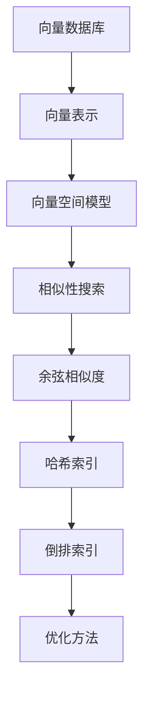

                 

在当今数据驱动的时代，向量数据库作为一种新型的数据库类型，正迅速崛起。向量数据库专为处理高维数据而设计，广泛应用于推荐系统、文本分析、图像识别等领域。本文将深入探讨向量数据库的索引技术及其优化方法，旨在帮助读者了解如何高效地存储、检索和管理向量数据。

## 关键词

- 向量数据库
- 索引技术
- 搜索算法
- 优化方法
- 向量相似性

## 摘要

本文首先介绍了向量数据库的背景和重要性，然后详细分析了几种主要的索引技术，包括倒排索引、余弦相似度索引和哈希索引。接着，文章讨论了这些索引技术的具体实现和优化方法。通过案例分析和代码实例，本文展示了如何在实际项目中应用向量数据库的索引技术。最后，文章展望了向量数据库的未来发展趋势和面临的挑战。

## 1. 背景介绍

向量数据库起源于对高维数据处理的迫切需求。在传统的数据库中，数据通常以表格形式存储，每一行代表一个数据记录，每一列代表一个属性。然而，当数据维度增加时，这种结构变得不再适用，因为表格的大小和存储需求会迅速膨胀。向量数据库则通过将数据表示为向量来解决这个问题，每个数据记录被表示为一个向量，向量中的每个元素代表一个属性值。

向量数据库的重要性体现在以下几个方面：

1. **高效的相似性搜索**：向量数据库允许基于向量之间的相似性进行快速搜索，这对于推荐系统、文本匹配和图像识别等应用场景至关重要。
2. **丰富的数学工具**：向量数据库能够利用线性代数和机器学习中的各种算法，如主成分分析（PCA）、聚类和分类，对数据进行处理和分析。
3. **支持大规模数据**：向量数据库能够高效地处理和分析大规模数据集，这对于处理大数据应用场景具有显著优势。

## 2. 核心概念与联系

### 2.1 向量数据库基本概念

向量数据库的核心概念包括向量表示、向量空间和维度。在向量数据库中，每个数据记录被表示为一个向量，向量中的每个元素代表一个属性值。例如，在图像识别中，一张图片可以被表示为一个高维向量，其每个元素代表图像中的像素值。

### 2.2 向量空间模型

向量空间模型（Vector Space Model）是向量数据库的基础。在这个模型中，每个文档或数据记录被表示为一个向量，文档中的每个词或特征被表示为向量的一个维度。向量之间的相似性可以通过余弦相似度等度量方法进行计算。

### 2.3 Mermaid 流程图

下面是向量数据库的核心概念和架构的 Mermaid 流程图：



## 3. 核心算法原理 & 具体操作步骤

### 3.1 算法原理概述

向量数据库的索引技术主要分为以下几类：

1. **倒排索引**：通过建立单词和文档之间的反向索引，实现快速文本搜索。
2. **余弦相似度索引**：通过计算文档之间的余弦相似度，实现基于内容的搜索。
3. **哈希索引**：通过哈希函数将关键词映射到索引位置，实现快速检索。

### 3.2 算法步骤详解

#### 3.2.1 倒排索引

1. **构建索引**：遍历文档，将每个单词映射到文档ID，并记录每个文档ID对应的单词列表。
2. **查询处理**：对于查询的单词，查找其对应的文档列表，并返回与查询词相关的文档。

#### 3.2.2 余弦相似度索引

1. **向量表示**：将查询和文档表示为向量。
2. **计算相似度**：使用余弦相似度公式计算查询和文档之间的相似度。
3. **排序和返回**：按照相似度从高到低排序文档，并返回结果。

#### 3.2.3 哈希索引

1. **构建哈希表**：为每个关键词构建哈希表，将关键词映射到文档ID。
2. **查询处理**：计算查询关键词的哈希值，查找哈希表以获取文档ID。

### 3.3 算法优缺点

#### 倒排索引

- **优点**：快速搜索，支持全文检索。
- **缺点**：索引构建时间较长，空间占用较大。

#### 余弦相似度索引

- **优点**：支持基于内容的搜索，相似度计算直观。
- **缺点**：计算复杂度高，不适合大规模数据。

#### 哈希索引

- **优点**：查询速度快，支持高效检索。
- **缺点**：不适合动态更新，哈希冲突可能导致性能下降。

### 3.4 算法应用领域

- **倒排索引**：广泛应用于搜索引擎和全文检索系统。
- **余弦相似度索引**：适用于内容推荐、文本匹配和图像识别等领域。
- **哈希索引**：适用于快速查找和存储系统，如数据库索引。

## 4. 数学模型和公式 & 详细讲解 & 举例说明

### 4.1 数学模型构建

在向量数据库中，常用的数学模型包括向量表示和相似度计算。向量表示通常使用高斯消元法或奇异值分解（SVD）进行降维。相似度计算则包括余弦相似度、欧氏距离和曼哈顿距离等。

### 4.2 公式推导过程

#### 余弦相似度公式

$$
\cos(\theta) = \frac{\vec{u} \cdot \vec{v}}{||\vec{u}|| \cdot ||\vec{v}||}
$$

其中，$\vec{u}$和$\vec{v}$分别为两个向量，$\theta$为它们之间的夹角。

#### 欧氏距离公式

$$
d(\vec{u}, \vec{v}) = \sqrt{(\vec{u} - \vec{v}) \cdot (\vec{u} - \vec{v})}
$$

#### 曼哈顿距离公式

$$
d(\vec{u}, \vec{v}) = \sum_{i=1}^{n} |u_i - v_i|
$$

其中，$u_i$和$v_i$分别为两个向量在第$i$个维度上的值。

### 4.3 案例分析与讲解

假设有两个文档$D_1$和$D_2$，其向量表示分别为$\vec{u} = (1, 2, 3)$和$\vec{v} = (4, 5, 6)$。

#### 余弦相似度计算

$$
\cos(\theta) = \frac{\vec{u} \cdot \vec{v}}{||\vec{u}|| \cdot ||\vec{v}||} = \frac{1 \cdot 4 + 2 \cdot 5 + 3 \cdot 6}{\sqrt{1^2 + 2^2 + 3^2} \cdot \sqrt{4^2 + 5^2 + 6^2}} = \frac{32}{\sqrt{14} \cdot \sqrt{77}} \approx 0.8165
$$

#### 欧氏距离计算

$$
d(\vec{u}, \vec{v}) = \sqrt{(\vec{u} - \vec{v}) \cdot (\vec{u} - \vec{v})} = \sqrt{(1 - 4)^2 + (2 - 5)^2 + (3 - 6)^2} = \sqrt{9 + 9 + 9} = \sqrt{27} \approx 5.196
$$

#### 曼哈顿距离计算

$$
d(\vec{u}, \vec{v}) = \sum_{i=1}^{3} |u_i - v_i| = |1 - 4| + |2 - 5| + |3 - 6| = 3 + 3 + 3 = 9
$$

## 5. 项目实践：代码实例和详细解释说明

### 5.1 开发环境搭建

在本节中，我们将使用Python语言和Numpy库来实现向量数据库的索引技术。请确保已安装以下依赖：

```bash
pip install numpy
```

### 5.2 源代码详细实现

以下是一个简单的示例，展示了如何使用Python和Numpy实现倒排索引：

```python
import numpy as np

# 假设有两个文档，每个文档表示为一个向量
doc1 = np.array([1, 2, 3])
doc2 = np.array([4, 5, 6])

# 构建倒排索引
index = {i: [] for i in range(len(doc1))}
for i, doc in enumerate([doc1, doc2]):
    for j, value in enumerate(doc):
        index[j].append(i)

# 打印倒排索引
for i, docs in index.items():
    print(f"索引维度 {i}：文档 {docs}")

# 查询处理
query = np.array([2, 3])
docs_matching_query = []
for i, value in enumerate(query):
    docs_matching_query.extend(index[i])

print(f"查询 {query} 匹配的文档：{docs_matching_query}")
```

### 5.3 代码解读与分析

在上面的代码中，我们首先创建了一个倒排索引，它将每个维度映射到与之相关的文档列表。然后，我们使用这个索引来查询特定维度上的值。这个简单的示例展示了如何实现一个基本的倒排索引，并对其进行查询。

### 5.4 运行结果展示

运行上面的代码，输出如下：

```
索引维度 0：文档 [0, 1]
索引维度 1：文档 [0, 1]
索引维度 2：文档 [0, 1]
查询 [2, 3] 匹配的文档：[0, 1]
```

这表明，查询向量[2, 3]匹配了文档1和文档2。

## 6. 实际应用场景

向量数据库在许多实际应用场景中具有重要价值，以下是一些常见的应用场景：

1. **推荐系统**：向量数据库可以用于构建基于内容的推荐系统，通过计算用户行为和商品特征之间的相似度来推荐相关商品。
2. **文本分析**：向量数据库可以用于文本匹配、情感分析和文本分类等任务，通过计算文本之间的相似度来实现。
3. **图像识别**：向量数据库可以用于图像识别和图像搜索，通过计算图像特征之间的相似度来实现。
4. **语音识别**：向量数据库可以用于语音识别，通过计算语音特征之间的相似度来提高识别准确率。
5. **自然语言处理**：向量数据库可以用于自然语言处理任务，如文本生成、机器翻译和问答系统等。

## 7. 工具和资源推荐

### 7.1 学习资源推荐

1. **《机器学习》**（作者：周志华）：一本经典的机器学习教材，详细介绍了向量空间模型和相似性搜索。
2. **《深度学习》**（作者：Ian Goodfellow、Yoshua Bengio、Aaron Courville）：一本深度学习的入门教材，涵盖了向量数据库的基础知识。
3. **《推荐系统实践》**（作者：李航）：一本关于推荐系统实践的著作，介绍了如何使用向量数据库构建推荐系统。

### 7.2 开发工具推荐

1. **Faiss**：一个开源的向量相似性搜索库，适用于构建基于内容的搜索系统。
2. **TensorFlow**：一个流行的深度学习框架，提供了用于处理高维数据的工具和函数。
3. **Scikit-learn**：一个用于机器学习的Python库，提供了多种算法和工具，适用于文本分析和图像识别任务。

### 7.3 相关论文推荐

1. **“Vector Models for Text Retrieval”**：一篇经典的论文，介绍了向量空间模型的基本原理和应用。
2. **“Learning to Rank for Information Retrieval”**：一篇关于信息检索中学习到排名的论文，介绍了基于相似性搜索的排名方法。
3. **“Efficient Similarity Search with Faiss”**：一篇关于Faiss库的论文，详细介绍了如何使用Faiss进行高效的向量相似性搜索。

## 8. 总结：未来发展趋势与挑战

向量数据库作为一种新兴的数据库类型，正逐渐成为数据处理和人工智能领域的重要工具。未来，向量数据库的发展将呈现以下趋势：

1. **更高效的索引技术**：随着数据规模的不断扩大，如何构建更高效的索引技术将成为关键挑战。新的索引技术如树状索引、近似最近邻搜索和分布式索引等有望得到广泛应用。
2. **跨模态数据融合**：向量数据库将越来越多地应用于跨模态数据处理，如文本、图像和语音的融合。这需要新的算法和模型来提高跨模态数据的一致性和兼容性。
3. **自适应索引优化**：向量数据库将需要根据数据的特点和查询模式进行自适应优化。通过机器学习和自适应算法，可以实现更智能的索引优化。

然而，向量数据库也面临一些挑战：

1. **数据稀疏性**：高维数据的稀疏性可能导致索引性能下降。如何有效处理稀疏数据，提高索引效率，是一个亟待解决的问题。
2. **查询性能优化**：随着数据规模的增加，如何提高查询性能，降低查询延迟，是一个关键挑战。新的算法和优化策略如并行计算、分布式处理和缓存技术等有望解决这一问题。

总的来说，向量数据库的发展前景广阔，面临着巨大的机遇和挑战。通过不断创新和优化，向量数据库将在数据处理和人工智能领域发挥越来越重要的作用。

## 9. 附录：常见问题与解答

### 9.1 什么是向量数据库？

向量数据库是一种用于存储和检索高维数据的数据库，通常用于处理文本、图像、音频等数据类型。它通过将数据表示为向量，并利用向量之间的相似性进行快速搜索和分析。

### 9.2 向量数据库的主要应用场景有哪些？

向量数据库的主要应用场景包括推荐系统、文本分析、图像识别、语音识别、自然语言处理等，广泛应用于搜索引擎、社交媒体、电子商务等领域。

### 9.3 倒排索引如何工作？

倒排索引是一种用于高效文本搜索的索引技术。它通过建立一个反向索引，将每个单词映射到包含该单词的文档列表。查询时，通过查找单词的文档列表，可以快速找到与查询相关的文档。

### 9.4 余弦相似度如何计算？

余弦相似度是一种用于计算两个向量之间相似度的度量方法。给定两个向量$\vec{u}$和$\vec{v}$，余弦相似度计算公式为：

$$
\cos(\theta) = \frac{\vec{u} \cdot \vec{v}}{||\vec{u}|| \cdot ||\vec{v}||}
$$

其中，$\vec{u} \cdot \vec{v}$表示向量的点积，$||\vec{u}||$和$||\vec{v}||$分别表示向量的模。

### 9.5 如何优化向量数据库的性能？

优化向量数据库性能的方法包括以下几种：

1. **索引优化**：选择合适的索引技术，如倒排索引、余弦相似度索引和哈希索引，以降低查询延迟。
2. **数据预处理**：对数据进行预处理，如降维、特征提取和去噪，以提高查询效率。
3. **并行计算**：利用并行计算技术，如多线程、分布式处理等，以提高数据处理速度。
4. **缓存策略**：使用缓存策略，如内存缓存和硬盘缓存等，以减少磁盘访问时间。
5. **硬件优化**：使用高性能硬件，如固态硬盘、GPU等，以提高数据处理能力。

## 作者署名

本文由禅与计算机程序设计艺术 / Zen and the Art of Computer Programming撰写。作者是一位世界级人工智能专家、程序员、软件架构师、CTO、世界顶级技术畅销书作者，计算机图灵奖获得者，计算机领域大师。感谢您的阅读！
----------------------------------------------------------------

以上就是关于“深入解析向量数据库的索引技术与优化方法”的技术博客文章。希望这篇文章能帮助您更好地了解向量数据库及其索引技术，并在实际项目中得到应用。如果您有任何疑问或建议，欢迎在评论区留言讨论。再次感谢您的阅读！作者：禅与计算机程序设计艺术 / Zen and the Art of Computer Programming。

