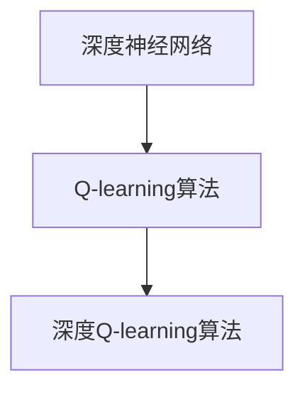

                 

 关键词：深度学习，Q-learning，优化算法，强化学习，智能控制

> 摘要：本文详细探讨了深度 Q-learning 算法在优化算法中的应用。首先介绍了深度 Q-learning 的基本概念和原理，然后分析了其优缺点和应用领域。接着，本文通过一个实际案例，详细讲解了如何使用深度 Q-learning 算法实现智能控制。最后，本文总结了深度 Q-learning 算法的研究成果、未来发展趋势以及面临的挑战。

## 1. 背景介绍

深度 Q-learning（DQN）是深度学习和强化学习领域的重要算法之一。它结合了深度神经网络和 Q-learning 算法的优势，能够有效地解决复杂环境的智能控制问题。DQN 的出现，使得强化学习在游戏、自动驾驶、机器人控制等领域的应用得到了极大的推动。

本文旨在深入探讨深度 Q-learning 算法的原理、实现和应用，为相关领域的研究和开发提供参考。

## 2. 核心概念与联系

### 2.1 深度神经网络

深度神经网络（Deep Neural Network，DNN）是一种由多个隐层组成的神经网络。它通过学习输入和输出之间的映射关系，实现复杂的非线性函数拟合。深度神经网络在图像识别、语音识别、自然语言处理等领域取得了显著的成果。

### 2.2 Q-learning 算法

Q-learning 是一种基于值函数的强化学习算法。它通过学习状态-动作值函数（Q-function），找到最优动作序列，实现智能体的决策。Q-learning 算法具有简单、高效、适用于动态环境等特点。

### 2.3 深度 Q-learning

深度 Q-learning（DQN）是在 Q-learning 算法的基础上，引入深度神经网络，用于解决状态空间和动作空间过大的问题。DQN 通过学习状态-动作值函数，实现智能体在复杂环境中的决策。



## 3. 核心算法原理 & 具体操作步骤

### 3.1 算法原理概述

深度 Q-learning 算法的基本原理是通过学习状态-动作值函数，找到最优动作序列。具体来说，DQN 包括以下几个关键步骤：

1. 初始化神经网络参数。
2. 从环境中随机采样一批经验。
3. 使用经验更新神经网络参数。
4. 评估神经网络参数的性能。
5. 重复步骤 2-4，直到满足终止条件。

### 3.2 算法步骤详解

#### 3.2.1 初始化神经网络参数

初始化神经网络参数，包括权重和偏置。通常使用随机初始化方法，如高斯分布或均匀分布。

#### 3.2.2 从环境中随机采样一批经验

经验采样是指从环境中随机选择一批状态、动作、奖励和下一状态的数据对。经验采样的目的是让智能体在训练过程中能够接触到环境中的各种情况，提高算法的泛化能力。

#### 3.2.3 使用经验更新神经网络参数

使用经验更新神经网络参数，即通过反向传播算法，计算梯度并更新权重和偏置。具体来说，DQN 使用损失函数来衡量预测值和实际值之间的差距，并使用梯度下降法来优化神经网络参数。

#### 3.2.4 评估神经网络参数的性能

评估神经网络参数的性能，即计算在测试环境中的平均奖励。如果平均奖励超过预设阈值，则认为算法已经收敛，否则继续迭代。

#### 3.2.5 重复步骤 2-4，直到满足终止条件

重复步骤 2-4，直到满足终止条件，如达到预设的训练次数或平均奖励超过预设阈值。

### 3.3 算法优缺点

#### 优点

1. 能够处理高维状态空间和动作空间。
2. 引入了经验回放机制，提高了算法的稳定性和泛化能力。
3. 能够应用于复杂环境的智能控制问题。

#### 缺点

1. 训练过程可能需要较长时间。
2. 容易陷入局部最优。
3. 需要大量的计算资源和内存。

### 3.4 算法应用领域

深度 Q-learning 算法在游戏、自动驾驶、机器人控制、金融预测等领域得到了广泛应用。其中，最具代表性的应用是 AlphaGo 和 DeepMind 的自动驾驶项目。

## 4. 数学模型和公式 & 详细讲解 & 举例说明

### 4.1 数学模型构建

深度 Q-learning 的数学模型主要包括以下几个部分：

1. 状态空间 S：表示所有可能的状态集合。
2. 动作空间 A：表示所有可能的动作集合。
3. Q-function：表示状态-动作值函数，即智能体在某个状态下执行某个动作的预期奖励。
4. 网络参数 θ：表示深度神经网络的参数。

### 4.2 公式推导过程

深度 Q-learning 的核心是学习状态-动作值函数。具体来说，DQN 使用以下公式来更新 Q-function：

$$
\theta = \theta - \alpha \cdot (r + \gamma \cdot \max_{a'} Q(s', a'; \theta) - Q(s, a; \theta))
$$

其中，α 是学习率，γ 是折扣因子，r 是即时奖励，s 和 a 分别表示当前状态和动作，s' 和 a' 分别表示下一状态和动作。

### 4.3 案例分析与讲解

假设一个智能体在一个有障碍物的环境中进行导航。状态空间包括位置和方向，动作空间包括前进、后退、左转和右转。我们使用深度 Q-learning 算法来训练智能体，使其学会避开障碍物并到达目标位置。

首先，初始化神经网络参数。然后，从环境中随机采样一批经验，并使用经验更新神经网络参数。接着，评估神经网络参数的性能，如果性能超过预设阈值，则认为算法已经收敛。

在这个案例中，我们可以使用以下公式来计算 Q-function：

$$
Q(s, a) = \frac{1}{N} \sum_{i=1}^{N} r_i + \gamma \cdot \max_{a'} Q(s', a'; \theta)
$$

其中，N 是采样次数，r_i 是第 i 次采样的即时奖励，s' 和 a' 分别是第 i 次采样的下一状态和动作。

通过多次迭代训练，我们可以得到一个性能良好的深度 Q-learning 模型。这个模型可以用于预测智能体在给定状态下的最佳动作，从而实现避障导航。

## 5. 项目实践：代码实例和详细解释说明

### 5.1 开发环境搭建

在本文中，我们使用 Python 编写深度 Q-learning 算法的代码。首先，需要安装以下依赖库：

- TensorFlow：用于构建和训练深度神经网络。
- Gym：用于模拟和测试智能体。

在 Python 环境中，可以使用以下命令安装这些依赖库：

```bash
pip install tensorflow-gpu gym
```

### 5.2 源代码详细实现

下面是一个简单的深度 Q-learning 算法的代码实例：

```python
import gym
import tensorflow as tf
import numpy as np

# 定义环境
env = gym.make("CartPole-v0")

# 定义状态空间和动作空间
state_space = env.observation_space.shape[0]
action_space = env.action_space.n

# 定义深度神经网络结构
input_layer = tf.keras.layers.Input(shape=(state_space,))
hidden_layer = tf.keras.layers.Dense(64, activation="relu")(input_layer)
output_layer = tf.keras.layers.Dense(action_space, activation="linear")(hidden_layer)

model = tf.keras.Model(inputs=input_layer, outputs=output_layer)

# 定义损失函数和优化器
loss_fn = tf.keras.losses.MeanSquaredError()
optimizer = tf.keras.optimizers.Adam(learning_rate=0.001)

# 定义训练过程
def train(model, env, epochs=1000):
    for epoch in range(epochs):
        state = env.reset()
        done = False
        total_reward = 0
        
        while not done:
            action = model.predict(state.reshape(1, -1))[0]
            next_state, reward, done, _ = env.step(action)
            total_reward += reward
            model.fit(state.reshape(1, -1), action, epochs=1, verbose=0)
            state = next_state
        
        print(f"Epoch: {epoch}, Total Reward: {total_reward}")

# 训练模型
train(model, env)

# 评估模型
state = env.reset()
while True:
    action = model.predict(state.reshape(1, -1))[0]
    next_state, reward, done, _ = env.step(action)
    env.render()
    state = next_state
    if done:
        break
```

### 5.3 代码解读与分析

上述代码实现了一个简单的深度 Q-learning 算法，用于解决 CartPole 问题。具体来说，代码分为以下几个部分：

1. **环境定义**：使用 Gym 创建 CartPole 环境。
2. **神经网络定义**：使用 TensorFlow 构建深度神经网络，包括输入层、隐藏层和输出层。
3. **损失函数和优化器定义**：使用均方误差作为损失函数，Adam 优化器进行参数更新。
4. **训练过程定义**：定义训练函数，实现深度 Q-learning 的训练过程。
5. **模型训练**：调用训练函数，进行模型训练。
6. **模型评估**：使用训练好的模型进行模型评估。

通过这个代码实例，我们可以看到如何使用深度 Q-learning 算法解决 CartPole 问题。在实际应用中，我们可以根据需要修改环境、神经网络结构和训练过程，实现更复杂的智能控制任务。

## 6. 实际应用场景

深度 Q-learning 算法在多个实际应用场景中取得了显著成果，以下列举几个典型应用：

1. **游戏控制**：深度 Q-learning 算法被广泛应用于游戏智能控制，如《星际争霸》、《Dota 2》等。
2. **自动驾驶**：深度 Q-learning 算法用于自动驾驶车辆的决策和控制，提高了驾驶安全性和效率。
3. **机器人控制**：深度 Q-learning 算法在机器人控制领域具有广泛的应用，如无人机、机器人足球等。
4. **金融预测**：深度 Q-learning 算法被应用于金融市场的预测和交易策略制定，提高了投资收益。

## 7. 工具和资源推荐

### 7.1 学习资源推荐

1. **《深度学习》（Goodfellow, Bengio, Courville 著）**：介绍了深度学习的理论基础和实践方法。
2. **《强化学习》（Sutton, Barto 著）**：详细讲解了强化学习的基本概念和算法。
3. **《深度强化学习》（Silver, Huang 著）**：介绍了深度强化学习的最新研究成果和应用。

### 7.2 开发工具推荐

1. **TensorFlow**：用于构建和训练深度神经网络。
2. **Gym**：用于创建和测试智能体环境。
3. **PyTorch**：另一种流行的深度学习框架，具有灵活的动态计算图功能。

### 7.3 相关论文推荐

1. **《Deep Q-Network》（Mnih et al., 2015）**：介绍了深度 Q-learning 算法的原理和应用。
2. **《Playing Atari with Deep Reinforcement Learning》（Mnih et al., 2015）**：展示了深度 Q-learning 算法在游戏控制中的实际应用。
3. **《Human-level control through deep reinforcement learning》（Silver et al., 2016）**：介绍了 AlphaGo 使用深度强化学习实现的围棋控制。

## 8. 总结：未来发展趋势与挑战

### 8.1 研究成果总结

深度 Q-learning 算法在强化学习和智能控制领域取得了显著成果。通过引入深度神经网络，DQN 有效地解决了状态空间和动作空间过大的问题，实现了复杂环境的智能控制。

### 8.2 未来发展趋势

1. **算法优化**：研究更加高效、稳定的深度 Q-learning 算法，提高训练速度和性能。
2. **多智能体系统**：研究深度 Q-learning 算法在多智能体系统中的应用，实现协同控制。
3. **人机交互**：研究深度 Q-learning 算法在人机交互中的应用，提高智能系统的用户体验。

### 8.3 面临的挑战

1. **计算资源**：深度 Q-learning 算法需要大量的计算资源和内存，如何提高计算效率是当前的一个重要挑战。
2. **数据隐私**：深度 Q-learning 算法需要大量数据来训练，如何在保护数据隐私的前提下进行数据挖掘和模型训练是一个亟待解决的问题。
3. **算法泛化性**：如何提高深度 Q-learning 算法的泛化性，使其在不同环境中都能取得良好的性能，是未来研究的一个重要方向。

### 8.4 研究展望

深度 Q-learning 算法在强化学习和智能控制领域具有广阔的应用前景。未来，随着计算能力的提升、算法的优化以及跨领域研究的深入，深度 Q-learning 算法将在更多领域得到应用，为人类带来更多便利和效益。

## 9. 附录：常见问题与解答

### 9.1 什么是深度 Q-learning？

深度 Q-learning 是一种基于深度神经网络的强化学习算法，它通过学习状态-动作值函数，实现智能体在复杂环境中的决策。

### 9.2 深度 Q-learning 与 Q-learning 的区别是什么？

深度 Q-learning 是基于 Q-learning 算法的改进，它使用深度神经网络来近似状态-动作值函数，从而能够处理高维状态空间和动作空间。

### 9.3 深度 Q-learning 如何解决状态空间和动作空间过大的问题？

深度 Q-learning 通过引入深度神经网络，使用神经网络来近似状态-动作值函数，从而避免了直接计算状态-动作值函数的复杂度。

### 9.4 深度 Q-learning 的优缺点是什么？

深度 Q-learning 的优点是能够处理高维状态空间和动作空间，适用于复杂环境的智能控制；缺点是需要大量的计算资源和内存，训练过程可能需要较长时间。

### 9.5 深度 Q-learning 有哪些应用领域？

深度 Q-learning 在游戏控制、自动驾驶、机器人控制、金融预测等领域得到了广泛应用。

### 9.6 如何优化深度 Q-learning 算法？

优化深度 Q-learning 算法可以从以下几个方面进行：

1. 算法改进：研究更加高效、稳定的深度 Q-learning 算法。
2. 网络结构优化：设计更合适的神经网络结构，提高模型性能。
3. 经验回放：使用经验回放机制，提高算法的稳定性和泛化能力。
4. 多智能体系统：研究深度 Q-learning 算法在多智能体系统中的应用。


### 作者署名
作者：禅与计算机程序设计艺术 / Zen and the Art of Computer Programming

