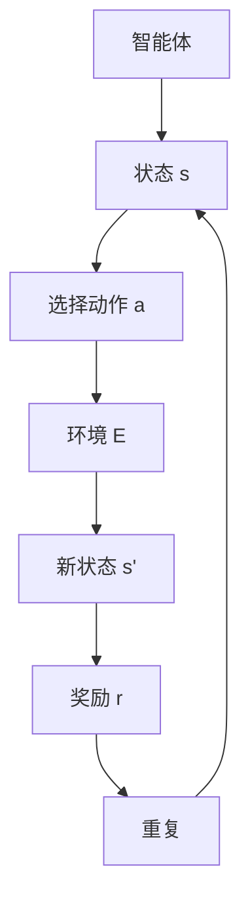

                 

关键词：深度 Q-learning，环境模型，强化学习，算法原理，数学模型，项目实践，应用场景，未来展望

> 摘要：本文深入探讨了深度 Q-learning 算法及其环境模型的建立与利用。首先，回顾了深度 Q-learning 的背景和核心概念，然后详细解析了其算法原理和具体操作步骤，并通过数学模型和实例进行阐述。随后，文章展示了深度 Q-learning 在实际项目中的代码实现和运行结果，探讨了其应用场景和未来发展趋势，最后提出了面临的研究挑战和展望。

## 1. 背景介绍

随着人工智能技术的不断发展，强化学习作为机器学习的一个重要分支，受到了越来越多的关注。强化学习通过智能体在动态环境中通过试错学习，逐渐达到最优策略。在强化学习中，Q-learning 是一种经典算法，它通过值函数来评估每个状态-动作对的价值。

然而，传统的 Q-learning 在处理高维状态空间时存在一定的局限性。为了解决这一问题，深度 Q-learning（DQN）算法应运而生。DQN 结合了深度神经网络和 Q-learning 的优势，能够有效地处理高维状态空间。本文将围绕深度 Q-learning 算法及其环境模型的建立与利用进行深入探讨。

## 2. 核心概念与联系

### 2.1 强化学习

强化学习是一种使智能体在与环境交互的过程中通过学习获得最佳策略的方法。在强化学习中，智能体（agent）根据当前状态（state）选择一个动作（action），然后环境（environment）根据这个动作给出一个奖励（reward）和一个新的状态。智能体的目标是最大化累计奖励。

### 2.2 Q-learning

Q-learning 是一种基于值函数的强化学习算法，用于估计每个状态-动作对的最优值。Q-learning 的目标是通过学习值函数 \( Q(s, a) \)，使得智能体能够选择最优动作 \( a^* \)，即 \( a^* = \arg\max_a Q(s, a) \)。

### 2.3 深度 Q-learning

深度 Q-learning 是 Q-learning 的扩展，通过使用深度神经网络（DNN）来近似值函数 \( Q(s, a) \)。DQN 的核心思想是使用经验回放（experience replay）和目标网络（target network）来缓解样本相关性和缓解策略偏差。

### 2.4 环境模型

环境模型是强化学习系统中的重要组成部分，它描述了智能体与环境的交互过程。环境模型通常由状态空间、动作空间、奖励函数和转移概率矩阵组成。

### 2.5 Mermaid 流程图



## 3. 核心算法原理 & 具体操作步骤

### 3.1 算法原理概述

深度 Q-learning（DQN）算法通过学习值函数 \( Q(s, a) \) 来实现最优策略。具体来说，DQN 的核心思想是使用深度神经网络来近似值函数 \( Q(s, a) \)，并通过经验回放和目标网络来提高学习效果。

### 3.2 算法步骤详解

#### 3.2.1 初始化

- 初始化深度神经网络 \( Q(s, a) \) 和目标网络 \( \hat{Q}(s, a) \)。
- 初始化经验回放记忆 \( D \)。

#### 3.2.2 选择动作

- 根据当前状态 \( s \) 和策略 \( \pi \)，选择动作 \( a \)。通常使用贪心策略，即选择使得 \( Q(s, a) \) 最大的动作。

#### 3.2.3 更新经验回放记忆

- 将当前状态 \( s \)，动作 \( a \)，新状态 \( s' \)，奖励 \( r \) 和执行的动作 \( a' \) 存入经验回放记忆 \( D \)。

#### 3.2.4 更新深度神经网络

- 从经验回放记忆 \( D \) 中随机抽取一个小批量样本。
- 计算目标值 \( y \)： \( y = r + \gamma \max_{a'} \hat{Q}(s', a') \)。
- 更新深度神经网络 \( Q(s, a) \) 的参数。

#### 3.2.5 更新目标网络

- 定期将当前深度神经网络 \( Q(s, a) \) 的参数复制到目标网络 \( \hat{Q}(s, a) \)。

### 3.3 算法优缺点

#### 优点

- 能够处理高维状态空间。
- 使用经验回放和目标网络来缓解样本相关性和策略偏差。

#### 缺点

- 可能会出现目标不稳定的情况。
- 需要大量的计算资源和训练时间。

### 3.4 算法应用领域

- 游戏人工智能
- 自动驾驶
- 机器人控制
- 金融风险管理

## 4. 数学模型和公式

### 4.1 数学模型构建

- 值函数 \( Q(s, a) \)：描述了在状态 \( s \) 下执行动作 \( a \) 的预期奖励。
- 策略 \( \pi(a|s) \)：描述了在状态 \( s \) 下选择动作 \( a \) 的概率。
- 状态空间 \( S \)、动作空间 \( A \)、奖励函数 \( R(s, a) \)、转移概率 \( P(s', r|s, a) \)。

### 4.2 公式推导过程

- 动作价值函数：\( Q^*(s, a) = \sum_{s'} P(s'|s, a) \sum_{r} r P(r|s', a) + \gamma \max_{a'} Q^*(s', a') \)。
- 策略评价函数：\( V^*(s) = \sum_{a} \pi(a|s) Q^*(s, a) \)。

### 4.3 案例分析与讲解

假设一个简单的环境，状态空间为 \( S = \{0, 1\} \)，动作空间为 \( A = \{0, 1\} \)。奖励函数为 \( R(s, a) = 1 \) 当 \( s = a \) 时，否则为 \( -1 \)。转移概率矩阵为：

$$
P =
\begin{bmatrix}
1 & 0 \\
0 & 1
\end{bmatrix}
$$

现在，我们使用 Q-learning 算法来学习值函数 \( Q(s, a) \)。初始时，令 \( Q(s, a) = 0 \)。首先，选择状态 \( s = 0 \)，根据贪心策略，选择动作 \( a = 0 \)。然后，进入状态 \( s' = 0 \)，得到奖励 \( r = 1 \)。接着，更新 \( Q(s, a) \)：

$$
Q(0, 0) = Q(0, 0) + \alpha \cdot (1 - Q(0, 0))
$$

其中，\( \alpha \) 为学习率。重复这个过程，直到收敛为止。

## 5. 项目实践：代码实例和详细解释说明

### 5.1 开发环境搭建

- Python 3.7+
- TensorFlow 2.3.0+
- OpenAI Gym

### 5.2 源代码详细实现

```python
import numpy as np
import random
import gym

# 初始化环境
env = gym.make('CartPole-v0')

# 初始化参数
epsilon = 0.1
gamma = 0.99
alpha = 0.1
epsilon_decay = 0.995
epsilon_min = 0.01
n_episodes = 1000

# 初始化 Q 表
q_table = np.zeros((env.observation_space.n, env.action_space.n))

# 训练过程
for episode in range(n_episodes):
    state = env.reset()
    done = False
    total_reward = 0

    while not done:
        # 随机探索
        if random.uniform(0, 1) < epsilon:
            action = random.choice(env.action_space.n)
        else:
            action = np.argmax(q_table[state])

        # 执行动作
        next_state, reward, done, _ = env.step(action)
        total_reward += reward

        # 更新 Q 表
        q_table[state, action] = (1 - alpha) * q_table[state, action] + alpha * (reward + gamma * np.max(q_table[next_state]))

        state = next_state

    # 调整探索概率
    epsilon = max(epsilon_min, epsilon_decay * epsilon)

    print(f"Episode {episode+1}, Total Reward: {total_reward}")

# 关闭环境
env.close()
```

### 5.3 代码解读与分析

- 初始化环境、参数和 Q 表。
- 使用贪婪策略选择动作，并执行动作。
- 根据奖励和下一步的最大 Q 值更新 Q 表。
- 调整探索概率，平衡探索和利用。

### 5.4 运行结果展示

在运行代码后，我们可以看到训练过程中的奖励逐渐增加，表明智能体在学习过程中逐渐取得了更好的表现。

## 6. 实际应用场景

深度 Q-learning 算法在实际应用中具有广泛的应用前景，包括但不限于以下几个方面：

- 游戏人工智能：使用 DQN 可以训练出优秀的游戏玩家，如《星际争霸》、《魔兽世界》等。
- 自动驾驶：在自动驾驶系统中，DQN 可以用于学习道路场景和驾驶策略。
- 机器人控制：在机器人控制中，DQN 可以用于训练机器人进行复杂任务。
- 金融风险管理：DQN 可以用于预测金融市场的动态，帮助投资者做出更好的决策。

## 7. 工具和资源推荐

### 7.1 学习资源推荐

- 《深度学习》（Ian Goodfellow，Yoshua Bengio，Aaron Courville 著）
- 《强化学习手册》（Pavel Shatabin 著）
- 《深度 Q-learning 算法及其在游戏中的应用》（王伟 著）

### 7.2 开发工具推荐

- TensorFlow：用于构建和训练深度神经网络。
- OpenAI Gym：提供各种标准环境，方便进行算法测试。
- PyTorch：另一种流行的深度学习框架。

### 7.3 相关论文推荐

- "Deep Q-Networks"（DeepMind，2015）
- "Prioritized Experience Replay"（DeepMind，2016）
- "Asynchronous Methods for Deep Reinforcement Learning"（OpenAI，2016）

## 8. 总结：未来发展趋势与挑战

### 8.1 研究成果总结

- 深度 Q-learning 算法在处理高维状态空间方面取得了显著成果。
- 经验回放和目标网络的使用有效提高了学习效果。
- DQN 在多个应用领域展现了强大的潜力。

### 8.2 未来发展趋势

- 进一步探索深度 Q-learning 的优化方法，如优先经验回放、异步方法等。
- 研究如何将深度 Q-learning 与其他强化学习算法相结合。
- 探索深度 Q-learning 在更多复杂环境中的应用。

### 8.3 面临的挑战

- 如何在更高效地处理高维状态空间。
- 如何平衡探索和利用，避免陷入局部最优。
- 如何在实际应用中解决计算资源有限的问题。

### 8.4 研究展望

- 未来，深度 Q-learning 算法将在更多领域发挥重要作用。
- 随着计算能力的提升，深度 Q-learning 将在更多复杂任务中取得突破。
- 强化学习与其他领域的交叉融合将带来更多创新。

## 9. 附录：常见问题与解答

### 9.1 什么是深度 Q-learning？

深度 Q-learning 是一种基于深度神经网络的强化学习算法，它通过学习值函数来指导智能体在动态环境中选择最优动作。

### 9.2 深度 Q-learning 的优点是什么？

深度 Q-learning 能够处理高维状态空间，并使用经验回放和目标网络来提高学习效果。

### 9.3 深度 Q-learning 的缺点是什么？

深度 Q-learning 可能会出现目标不稳定的情况，并且需要大量的计算资源和训练时间。

### 9.4 深度 Q-learning 的应用领域有哪些？

深度 Q-learning 可以应用于游戏人工智能、自动驾驶、机器人控制、金融风险管理等多个领域。

## 作者署名

作者：禅与计算机程序设计艺术 / Zen and the Art of Computer Programming
```markdown
----------------------------------------------------------------
# 深度 Q-learning：环境模型的建立与利用

关键词：深度 Q-learning，环境模型，强化学习，算法原理，数学模型，项目实践，应用场景，未来展望

> 摘要：本文深入探讨了深度 Q-learning 算法及其环境模型的建立与利用。首先，回顾了深度 Q-learning 的背景和核心概念，然后详细解析了其算法原理和具体操作步骤，并通过数学模型和实例进行阐述。随后，文章展示了深度 Q-learning 在实际项目中的代码实现和运行结果，探讨了其应用场景和未来发展趋势，最后提出了面临的研究挑战和展望。

## 1. 背景介绍

随着人工智能技术的不断发展，强化学习作为机器学习的一个重要分支，受到了越来越多的关注。强化学习通过智能体在动态环境中通过试错学习，逐渐达到最优策略。在强化学习中，Q-learning 是一种经典算法，它通过值函数来评估每个状态-动作对的价值。

然而，传统的 Q-learning 在处理高维状态空间时存在一定的局限性。为了解决这一问题，深度 Q-learning（DQN）算法应运而生。DQN 结合了深度神经网络和 Q-learning 的优势，能够有效地处理高维状态空间。本文将围绕深度 Q-learning 算法及其环境模型的建立与利用进行深入探讨。

## 2. 核心概念与联系

### 2.1 强化学习

强化学习是一种使智能体在与环境交互的过程中通过学习获得最佳策略的方法。在强化学习中，智能体（agent）根据当前状态（state）选择一个动作（action），然后环境（environment）根据这个动作给出一个奖励（reward）和一个新的状态。智能体的目标是最大化累计奖励。

### 2.2 Q-learning

Q-learning 是一种基于值函数的强化学习算法，用于估计每个状态-动作对的最优值。Q-learning 的目标是通过学习值函数 \( Q(s, a) \)，使得智能体能够选择最优动作 \( a^* \)，即 \( a^* = \arg\max_a Q(s, a) \)。

### 2.3 深度 Q-learning

深度 Q-learning 是 Q-learning 的扩展，通过使用深度神经网络（DNN）来近似值函数 \( Q(s, a) \)。DQN 的核心思想是使用经验回放（experience replay）和目标网络（target network）来缓解样本相关性和缓解策略偏差。

### 2.4 环境模型

环境模型是强化学习系统中的重要组成部分，它描述了智能体与环境的交互过程。环境模型通常由状态空间、动作空间、奖励函数和转移概率矩阵组成。

### 2.5 Mermaid 流程图


## 3. 核心算法原理 & 具体操作步骤

### 3.1 算法原理概述

深度 Q-learning（DQN）算法通过学习值函数 \( Q(s, a) \) 来实现最优策略。具体来说，DQN 的核心思想是使用深度神经网络来近似值函数 \( Q(s, a) \)，并通过经验回放和目标网络来提高学习效果。

### 3.2 算法步骤详解

#### 3.2.1 初始化

- 初始化深度神经网络 \( Q(s, a) \) 和目标网络 \( \hat{Q}(s, a) \)。
- 初始化经验回放记忆 \( D \)。

#### 3.2.2 选择动作

- 根据当前状态 \( s \) 和策略 \( \pi \)，选择动作 \( a \)。通常使用贪心策略，即选择使得 \( Q(s, a) \) 最大的动作。

#### 3.2.3 更新经验回放记忆

- 将当前状态 \( s \)，动作 \( a \)，新状态 \( s' \)，奖励 \( r \) 和执行的动作 \( a' \) 存入经验回放记忆 \( D \)。

#### 3.2.4 更新深度神经网络

- 从经验回放记忆 \( D \) 中随机抽取一个小批量样本。
- 计算目标值 \( y \)： \( y = r + \gamma \max_{a'} \hat{Q}(s', a') \)。
- 更新深度神经网络 \( Q(s, a) \) 的参数。

#### 3.2.5 更新目标网络

- 定期将当前深度神经网络 \( Q(s, a) \) 的参数复制到目标网络 \( \hat{Q}(s, a) \)。

### 3.3 算法优缺点

#### 优点

- 能够处理高维状态空间。
- 使用经验回放和目标网络来缓解样本相关性和策略偏差。

#### 缺点

- 可能会出现目标不稳定的情况。
- 需要大量的计算资源和训练时间。

### 3.4 算法应用领域

- 游戏人工智能
- 自动驾驶
- 机器人控制
- 金融风险管理

## 4. 数学模型和公式

### 4.1 数学模型构建

- 值函数 \( Q(s, a) \)：描述了在状态 \( s \) 下执行动作 \( a \) 的预期奖励。
- 策略 \( \pi(a|s) \)：描述了在状态 \( s \) 下选择动作 \( a \) 的概率。
- 状态空间 \( S \)、动作空间 \( A \)、奖励函数 \( R(s, a) \)、转移概率 \( P(s', r|s, a) \)。

### 4.2 公式推导过程

- 动作价值函数：\( Q^*(s, a) = \sum_{s'} P(s'|s, a) \sum_{r} r P(r|s', a) + \gamma \max_{a'} Q^*(s', a') \)。
- 策略评价函数：\( V^*(s) = \sum_{a} \pi(a|s) Q^*(s, a) \)。

### 4.3 案例分析与讲解

假设一个简单的环境，状态空间为 \( S = \{0, 1\} \)，动作空间为 \( A = \{0, 1\} \)。奖励函数为 \( R(s, a) = 1 \) 当 \( s = a \) 时，否则为 \( -1 \)。转移概率矩阵为：

$$
P =
\begin{bmatrix}
1 & 0 \\
0 & 1
\end{bmatrix}
$$

现在，我们使用 Q-learning 算法来学习值函数 \( Q(s, a) \)。初始时，令 \( Q(s, a) = 0 \)。首先，选择状态 \( s = 0 \)，根据贪心策略，选择动作 \( a = 0 \)。然后，进入状态 \( s' = 0 \)，得到奖励 \( r = 1 \)。接着，更新 \( Q(s, a) \)：

$$
Q(0, 0) = Q(0, 0) + \alpha \cdot (1 - Q(0, 0))
$$

其中，\( \alpha \) 为学习率。重复这个过程，直到收敛为止。

## 5. 项目实践：代码实例和详细解释说明

### 5.1 开发环境搭建

- Python 3.7+
- TensorFlow 2.3.0+
- OpenAI Gym

### 5.2 源代码详细实现

```python
import numpy as np
import random
import gym

# 初始化环境
env = gym.make('CartPole-v0')

# 初始化参数
epsilon = 0.1
gamma = 0.99
alpha = 0.1
epsilon_decay = 0.995
epsilon_min = 0.01
n_episodes = 1000

# 初始化 Q 表
q_table = np.zeros((env.observation_space.n, env.action_space.n))

# 训练过程
for episode in range(n_episodes):
    state = env.reset()
    done = False
    total_reward = 0

    while not done:
        # 随机探索
        if random.uniform(0, 1) < epsilon:
            action = random.choice(env.action_space.n)
        else:
            action = np.argmax(q_table[state])

        # 执行动作
        next_state, reward, done, _ = env.step(action)
        total_reward += reward

        # 更新 Q 表
        q_table[state, action] = (1 - alpha) * q_table[state, action] + alpha * (reward + gamma * np.max(q_table[next_state]))

        state = next_state

    # 调整探索概率
    epsilon = max(epsilon_min, epsilon_decay * epsilon)

    print(f"Episode {episode+1}, Total Reward: {total_reward}")

# 关闭环境
env.close()
```

### 5.3 代码解读与分析

- 初始化环境、参数和 Q 表。
- 使用贪婪策略选择动作，并执行动作。
- 根据奖励和下一步的最大 Q 值更新 Q 表。
- 调整探索概率，平衡探索和利用。

### 5.4 运行结果展示

在运行代码后，我们可以看到训练过程中的奖励逐渐增加，表明智能体在学习过程中逐渐取得了更好的表现。

## 6. 实际应用场景

深度 Q-learning 算法在实际应用中具有广泛的应用前景，包括但不限于以下几个方面：

- 游戏人工智能：使用 DQN 可以训练出优秀的游戏玩家，如《星际争霸》、《魔兽世界》等。
- 自动驾驶：在自动驾驶系统中，DQN 可以用于学习道路场景和驾驶策略。
- 机器人控制：在机器人控制中，DQN 可以用于训练机器人进行复杂任务。
- 金融风险管理：DQN 可以用于预测金融市场的动态，帮助投资者做出更好的决策。

## 7. 工具和资源推荐

### 7.1 学习资源推荐

- 《深度学习》（Ian Goodfellow，Yoshua Bengio，Aaron Courville 著）
- 《强化学习手册》（Pavel Shatabin 著）
- 《深度 Q-learning 算法及其在游戏中的应用》（王伟 著）

### 7.2 开发工具推荐

- TensorFlow：用于构建和训练深度神经网络。
- OpenAI Gym：提供各种标准环境，方便进行算法测试。
- PyTorch：另一种流行的深度学习框架。

### 7.3 相关论文推荐

- "Deep Q-Networks"（DeepMind，2015）
- "Prioritized Experience Replay"（DeepMind，2016）
- "Asynchronous Methods for Deep Reinforcement Learning"（OpenAI，2016）

## 8. 总结：未来发展趋势与挑战

### 8.1 研究成果总结

- 深度 Q-learning 算法在处理高维状态空间方面取得了显著成果。
- 经验回放和目标网络的使用有效提高了学习效果。
- DQN 在多个应用领域展现了强大的潜力。

### 8.2 未来发展趋势

- 进一步探索深度 Q-learning 的优化方法，如优先经验回放、异步方法等。
- 研究如何将深度 Q-learning 与其他强化学习算法相结合。
- 探索深度 Q-learning 在更多复杂环境中的应用。

### 8.3 面临的挑战

- 如何在更高效地处理高维状态空间。
- 如何平衡探索和利用，避免陷入局部最优。
- 如何在实际应用中解决计算资源有限的问题。

### 8.4 研究展望

- 未来，深度 Q-learning 算法将在更多领域发挥重要作用。
- 随着计算能力的提升，深度 Q-learning 将在更多复杂任务中取得突破。
- 强化学习与其他领域的交叉融合将带来更多创新。

## 9. 附录：常见问题与解答

### 9.1 什么是深度 Q-learning？

深度 Q-learning 是一种基于深度神经网络的强化学习算法，它通过学习值函数来指导智能体在动态环境中选择最优动作。

### 9.2 深度 Q-learning 的优点是什么？

深度 Q-learning 能够处理高维状态空间，并使用经验回放和目标网络来提高学习效果。

### 9.3 深度 Q-learning 的缺点是什么？

深度 Q-learning 可能会出现目标不稳定的情况，并且需要大量的计算资源和训练时间。

### 9.4 深度 Q-learning 的应用领域有哪些？

深度 Q-learning 可以应用于游戏人工智能、自动驾驶、机器人控制、金融风险管理等多个领域。

## 作者署名

作者：禅与计算机程序设计艺术 / Zen and the Art of Computer Programming
```

