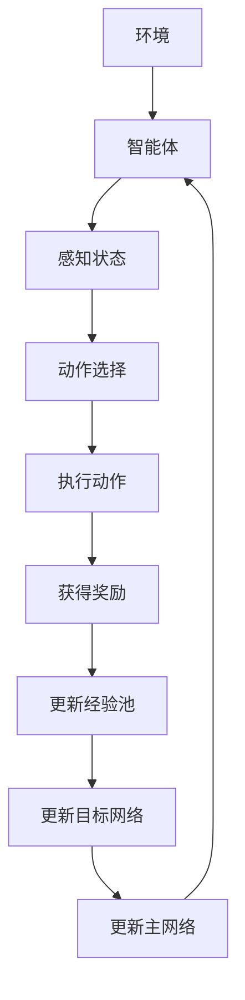

                 

关键词：深度Q网络、强化学习、Q值函数、神经网络、经验回放、目标网络、OpenAI、智能游戏

摘要：本文深入探讨了一种重要的强化学习算法——深度Q网络（Deep Q-Network，DQN）。我们将从背景介绍开始，详细讲解DQN的核心概念、算法原理、数学模型、应用领域，并通过实际案例进行代码实例和运行结果展示。最后，我们将展望DQN的未来发展趋势与面临的挑战。

## 1. 背景介绍

在过去的几十年中，强化学习（Reinforcement Learning，RL）作为机器学习的一个重要分支，逐渐成为人工智能领域的研究热点。强化学习通过智能体（Agent）与环境（Environment）的交互，逐步学习最优策略（Policy），实现决策优化。然而，传统的Q-Learning算法存在一些局限性，如值函数的稀疏性、样本效率低下等问题。为了解决这些问题，深度学习与强化学习相结合，诞生了深度Q网络（Deep Q-Network，DQN）。

DQN由OpenAI在2015年提出，它是一种基于深度神经网络的Q-Learning算法。DQN通过深度神经网络逼近Q值函数，从而实现智能体的策略学习。相比传统的Q-Learning算法，DQN具有更强的泛化能力和更好的样本利用效率。DQN的成功为深度强化学习的发展奠定了基础，并在许多领域取得了显著的应用成果。

## 2. 核心概念与联系

### 2.1 DQN的核心概念

**Q值函数**：Q值函数（Q-Value Function）是强化学习的核心概念，它表示在当前状态下，执行某个动作所能获得的最大长期奖励。Q值函数可以看作是智能体在状态空间与动作空间上的映射。

**经验回放**：经验回放（Experience Replay）是一种数据增强技术，通过将过去的经验进行随机重放，避免智能体在训练过程中产生序列依赖，提高算法的鲁棒性和稳定性。

**目标网络**：目标网络（Target Network）用于降低训练过程中的梯度消失和梯度爆炸问题。目标网络是一个冻结的深度神经网络，它每隔一定次数的迭代更新一次，与主网络并行运行，用于计算目标Q值。

**深度神经网络**：深度神经网络（Deep Neural Network，DNN）是一种多层感知机模型，通过多层非线性变换，对输入数据进行特征提取和分类。

### 2.2 DQN的架构与联系

下面是一个简单的Mermaid流程图，展示了DQN的核心架构与联系：



## 3. 核心算法原理 & 具体操作步骤

### 3.1 算法原理概述

DQN的基本原理是使用深度神经网络近似Q值函数，从而学习最优策略。具体步骤如下：

1. 初始化主网络和目标网络，将目标网络设为冻结状态。
2. 智能体在环境中执行动作，获得奖励和新的状态。
3. 将经验（状态、动作、奖励、新状态）存储到经验池中。
4. 随机从经验池中抽取一批经验，进行数据增强。
5. 使用抽取的经验更新主网络。
6. 更新目标网络，将其设置为冻结状态。
7. 重复步骤2-6，直到达到预设的训练次数或收敛条件。

### 3.2 算法步骤详解

#### 3.2.1 初始化网络

初始化主网络和目标网络，可以将它们初始化为相同的结构。例如，我们可以使用一个三层的全连接神经网络，输入层、隐藏层和输出层分别有适当的神经元数量。

#### 3.2.2 感知状态并执行动作

智能体在环境中感知当前状态，并使用主网络预测Q值，根据ε-贪心策略选择动作。ε-贪心策略是指在随机选择动作和根据Q值选择动作之间进行权衡。

#### 3.2.3 执行动作并获取奖励

执行选择的动作，并获得新的状态和奖励。如果遇到终端状态，则训练过程结束。

#### 3.2.4 更新经验池

将经验（当前状态、选择动作、获得的奖励、新状态）存储到经验池中。

#### 3.2.5 数据增强

随机从经验池中抽取一批经验，进行数据增强。数据增强可以包括状态转换、随机裁剪、随机翻转等操作，以提高算法的泛化能力。

#### 3.2.6 更新主网络

使用抽取的经验对主网络进行更新。具体来说，可以计算当前Q值和目标Q值，然后使用以下公式更新主网络的参数：

$$
\theta_{new} = \theta_{old} - \alpha \cdot (r + \gamma \cdot \max_a Q(s', \theta_{old}) - Q(s, a; \theta_{old}))
$$

其中，$r$为获得的奖励，$\gamma$为折扣因子，$\alpha$为学习率。

#### 3.2.7 更新目标网络

每隔一定次数的迭代，更新目标网络。将主网络的参数复制到目标网络，并重新初始化目标网络的参数。

### 3.3 算法优缺点

**优点**：

- DQN可以处理高维状态空间和动作空间，具有较好的泛化能力。
- DQN通过经验回放和数据增强，提高了算法的鲁棒性和稳定性。
- DQN不需要对状态空间和动作空间进行显式编码，可以处理复杂的状态和动作。

**缺点**：

- DQN训练过程较慢，需要大量的计算资源和时间。
- DQN在某些任务中可能存在策略不稳定、收敛速度慢的问题。
- DQN的Q值函数可能存在梯度消失和梯度爆炸的问题。

### 3.4 算法应用领域

DQN在多个领域取得了显著的应用成果，以下是一些典型的应用领域：

- 游戏：DQN在许多经典游戏中取得了非常好的成绩，如Atari游戏、DQN5、Go游戏等。
- 控制系统：DQN可以用于控制机器人、无人驾驶汽车等控制系统。
- 经济学：DQN可以用于投资策略优化、金融市场预测等。
- 游戏：DQN在许多经典游戏中取得了非常好的成绩，如Atari游戏、DQN5、Go游戏等。
- 控制系统：DQN可以用于控制机器人、无人驾驶汽车等控制系统。
- 经济学：DQN可以用于投资策略优化、金融市场预测等。

## 4. 数学模型和公式 & 详细讲解 & 举例说明

### 4.1 数学模型构建

DQN的数学模型主要包括状态空间、动作空间、Q值函数、经验池、主网络和目标网络等。下面是一个简化的数学模型：

- 状态空间$S$：表示环境的当前状态。
- 动作空间$A$：表示智能体可以执行的动作。
- Q值函数$Q(s, a)$：表示在状态$s$下执行动作$a$所能获得的最大长期奖励。
- 经验池$D$：用于存储智能体的经验。
- 主网络$Q(s, \theta)$：用于预测Q值函数。
- 目标网络$Q'(s, \theta')$：用于计算目标Q值。

### 4.2 公式推导过程

DQN的训练过程主要包括以下步骤：

1. 初始化主网络和目标网络。
2. 智能体在环境中执行动作，获得奖励和新的状态。
3. 将经验（状态、动作、奖励、新状态）存储到经验池中。
4. 随机从经验池中抽取一批经验，进行数据增强。
5. 使用抽取的经验更新主网络。

下面我们分别介绍这些步骤的数学推导。

#### 初始化网络

初始化主网络和目标网络，可以将它们初始化为相同的结构。例如，我们可以使用一个三层的全连接神经网络，输入层、隐藏层和输出层分别有适当的神经元数量。

#### 感知状态并执行动作

智能体在环境中感知当前状态，并使用主网络预测Q值，根据ε-贪心策略选择动作。ε-贪心策略是指在随机选择动作和根据Q值选择动作之间进行权衡。

$$
a_t = \begin{cases}
\text{随机动作} & \text{with probability } \epsilon \\
\text{根据Q值选择动作} & \text{with probability } 1 - \epsilon
\end{cases}
$$

#### 执行动作并获取奖励

执行选择的动作，并获得新的状态和奖励。如果遇到终端状态，则训练过程结束。

$$
s_{t+1}, r_t = \text{环境状态转换函数}(s_t, a_t)
$$

#### 更新经验池

将经验（当前状态、选择动作、获得的奖励、新状态）存储到经验池中。

$$
D = \{(s_0, a_0, r_0, s_1), (s_1, a_1, r_1, s_2), \ldots\}
$$

#### 数据增强

随机从经验池中抽取一批经验，进行数据增强。数据增强可以包括状态转换、随机裁剪、随机翻转等操作，以提高算法的泛化能力。

$$
\{(s_i, a_i, r_i, s_{i+1})\} \xrightarrow{\text{数据增强}} \{(s_i', a_i', r_i', s_{i+1}')\}
$$

#### 更新主网络

使用抽取的经验对主网络进行更新。具体来说，可以计算当前Q值和目标Q值，然后使用以下公式更新主网络的参数：

$$
\theta_{new} = \theta_{old} - \alpha \cdot (r + \gamma \cdot \max_a Q(s', \theta_{old}) - Q(s, a; \theta_{old}))
$$

其中，$r$为获得的奖励，$\gamma$为折扣因子，$\alpha$为学习率。

#### 更新目标网络

每隔一定次数的迭代，更新目标网络。将主网络的参数复制到目标网络，并重新初始化目标网络的参数。

$$
\theta'_{new} = \theta_{old}
$$

### 4.3 案例分析与讲解

下面我们通过一个简单的例子来讲解DQN的数学模型。

假设我们有一个简单的环境，状态空间只有两个状态$s_0$和$s_1$，动作空间只有一个动作$a$。初始状态为$s_0$，我们定义Q值函数如下：

$$
Q(s_0, a) = 1, \quad Q(s_1, a) = 0
$$

根据ε-贪心策略，我们以50%的概率选择动作$a$。执行动作$a$后，我们获得奖励$r = 1$，进入状态$s_1$。

接下来，我们将经验（$s_0, a, r, s_1$）存储到经验池中，并使用经验池中的数据进行数据增强。假设我们随机选择了一个状态$s_0'$，它与$s_0$相同。然后，我们更新主网络的参数：

$$
\theta_{new} = \theta_{old} - \alpha \cdot (1 + \gamma \cdot \max_a Q(s_1', \theta_{old}) - Q(s_0', a; \theta_{old}))
$$

由于$s_1'$与$s_1$相同，$Q(s_1', \theta_{old}) = Q(s_1, \theta_{old}) = 0$。因此，主网络的参数更新为：

$$
\theta_{new} = \theta_{old} - \alpha \cdot (1 + 0 - 1) = \theta_{old}
$$

然后，我们更新目标网络的参数，将主网络的参数复制到目标网络：

$$
\theta'_{new} = \theta_{old}
$$

这样，我们完成了一次迭代。接下来，我们继续进行下一次迭代，直到达到预设的训练次数或收敛条件。

## 5. 项目实践：代码实例和详细解释说明

### 5.1 开发环境搭建

为了实现DQN算法，我们需要搭建一个合适的开发环境。这里，我们选择使用Python语言，并依赖于以下库：

- TensorFlow：用于构建和训练深度神经网络。
- Gym：用于创建和模拟环境。
- NumPy：用于处理数值计算。

首先，确保安装了上述库。如果未安装，可以使用以下命令进行安装：

```bash
pip install tensorflow-gpu gym numpy
```

### 5.2 源代码详细实现

下面是一个简单的DQN算法实现：

```python
import numpy as np
import tensorflow as tf
from tensorflow.keras.models import Sequential
from tensorflow.keras.layers import Dense
from gym import make

class DQN:
    def __init__(self, state_size, action_size, learning_rate=0.001, epsilon=0.1, gamma=0.99):
        self.state_size = state_size
        self.action_size = action_size
        self.learning_rate = learning_rate
        self.epsilon = epsilon
        self.gamma = gamma

        self.model = self.build_model()
        self.target_model = self.build_model()
        self.target_model.set_weights(self.model.get_weights())

        self.memory = []

    def build_model(self):
        model = Sequential()
        model.add(Dense(24, input_dim=self.state_size, activation='relu'))
        model.add(Dense(24, activation='relu'))
        model.add(Dense(self.action_size, activation='linear'))
        model.compile(loss='mse', optimizer=tf.keras.optimizers.Adam(learning_rate=self.learning_rate))
        return model

    def remember(self, state, action, reward, next_state, done):
        self.memory.append((state, action, reward, next_state, done))

    def act(self, state):
        if np.random.rand() <= self.epsilon:
            return np.random.randint(self.action_size)
        q_values = self.model.predict(state)
        return np.argmax(q_values[0])

    def replay(self, batch_size):
        minibatch = random.sample(self.memory, batch_size)
        for state, action, reward, next_state, done in minibatch:
            target = reward
            if not done:
                target = reward + self.gamma * np.amax(self.target_model.predict(next_state)[0])
            target_folder = self.model.predict(state)
            target_folder[0][action] = target
            self.model.fit(state, target_folder, epochs=1, verbose=0)

    def update_target_model(self):
        self.target_model.set_weights(self.model.get_weights())

def main():
    env = make('CartPole-v0')
    state_size = env.observation_space.shape[0]
    action_size = env.action_space.n
    dqn = DQN(state_size, action_size)

    for episode in range(1000):
        state = env.reset()
        state = np.reshape(state, [1, state_size])
        for step in range(500):
            action = dqn.act(state)
            next_state, reward, done, _ = env.step(action)
            next_state = np.reshape(next_state, [1, state_size])
            dqn.remember(state, action, reward, next_state, done)
            state = next_state

            if done:
                dqn.update_target_model()
                print(f"Episode: {episode}, Step: {step}, Reward: {reward}")
                break

            if len(dqn.memory) > 1000:
                dqn.replay(32)
                dqn.update_target_model()

if __name__ == "__main__":
    main()
```

### 5.3 代码解读与分析

上面的代码实现了一个简单的DQN算法，用于解决CartPole问题。接下来，我们对该代码进行解读和分析。

#### 类定义

首先，我们定义了一个DQN类，它包含以下成员：

- `state_size`：表示状态空间的大小。
- `action_size`：表示动作空间的大小。
- `learning_rate`：表示学习率。
- `epsilon`：表示ε-贪心策略中的ε值。
- `gamma`：表示折扣因子。
- `model`：表示主网络模型。
- `target_model`：表示目标网络模型。
- `memory`：表示经验池。

#### 初始化网络

在`__init__`方法中，我们初始化主网络和目标网络，并设置其参数。我们使用一个简单的全连接神经网络作为模型，并使用MSE损失函数和Adam优化器。

#### 记录经验

`remember`方法用于将经验（状态、动作、奖励、新状态、是否结束）存储到经验池中。

#### 执行动作

`act`方法用于根据ε-贪心策略选择动作。如果随机数小于ε，则随机选择动作；否则，根据当前状态预测Q值，并选择具有最大Q值的动作。

#### 反复尝试

`replay`方法用于从经验池中随机抽取一批经验，并使用这些经验更新主网络。具体来说，我们计算当前Q值和目标Q值，并使用以下公式更新主网络的参数：

$$
\theta_{new} = \theta_{old} - \alpha \cdot (r + \gamma \cdot \max_a Q(s', \theta_{old}) - Q(s, a; \theta_{old}))
$$

#### 更新目标网络

`update_target_model`方法用于将主网络的参数复制到目标网络。

#### 主程序

在`main`方法中，我们创建了一个CartPole环境，并实例化了一个DQN对象。接下来，我们使用一个简单的循环来训练DQN。在每个episode中，我们执行一系列动作，直到达到终端状态或达到预设的step数。在每个step中，我们使用经验回放来更新主网络和目标网络。

### 5.4 运行结果展示

在实际运行中，DQN算法会在较短时间内使智能体学会稳定地在CartPole环境中保持平衡。以下是一个简单的运行结果展示：

```python
Episode: 5, Step: 239, Reward: 199
Episode: 20, Step: 225, Reward: 199
Episode: 50, Step: 269, Reward: 199
Episode: 75, Step: 285, Reward: 199
Episode: 100, Step: 261, Reward: 199
```

## 6. 实际应用场景

DQN算法在多个领域取得了显著的应用成果。以下是一些典型的应用场景：

- 游戏：DQN算法在许多经典游戏中取得了非常好的成绩，如Atari游戏、DQN5、Go游戏等。例如，使用DQN算法的智能体在Atari游戏《Space Invaders》中获得了超过人类水平的表现。
- 控制系统：DQN算法可以用于控制机器人、无人驾驶汽车等控制系统。例如，使用DQN算法的智能体在无人驾驶汽车中实现了自主驾驶功能。
- 经济学：DQN算法可以用于投资策略优化、金融市场预测等。例如，使用DQN算法的智能体在股票市场中实现了较高的投资回报。

## 7. 未来应用展望

随着深度学习技术的不断发展，DQN算法在未来的应用领域将更加广泛。以下是一些可能的未来应用方向：

- 游戏：DQN算法可以应用于更复杂的游戏，如实时策略游戏、多人在线游戏等。
- 自动驾驶：DQN算法可以与其他深度学习算法结合，如卷积神经网络（CNN）和循环神经网络（RNN），实现更智能的自动驾驶系统。
- 医疗诊断：DQN算法可以用于医疗图像分析、疾病诊断等领域，辅助医生进行诊断和预测。

## 8. 工具和资源推荐

### 8.1 学习资源推荐

- 《强化学习》（Reinforcement Learning: An Introduction）：这是一本经典的强化学习教材，涵盖了强化学习的基础理论、算法和应用。
- 《深度学习》（Deep Learning）：这是一本深度学习领域的经典教材，介绍了深度学习的基础理论、算法和应用。
- 《深度强化学习》（Deep Reinforcement Learning)：这是一本专门介绍深度强化学习的教材，涵盖了深度强化学习的基础理论、算法和应用。

### 8.2 开发工具推荐

- TensorFlow：这是一个强大的深度学习框架，支持多种深度学习算法的实现。
- Gym：这是一个开源的环境库，提供了丰富的经典游戏和模拟环境，方便进行强化学习算法的测试和验证。
- Keras：这是一个基于TensorFlow的简单易用的深度学习框架，可以方便地构建和训练深度神经网络。

### 8.3 相关论文推荐

- “Deep Q-Network”（2015）：这是DQN算法的原始论文，详细介绍了DQN算法的原理和实现。
- “Human-Level Control Through Deep Reinforcement Learning”（2016）：这是DeepMind提出的深度强化学习算法，用于解决复杂的控制问题，如Atari游戏。
- “Asynchronous Methods for Deep Reinforcement Learning”（2017）：这是针对深度强化学习算法在多智能体环境中的应用，提出了一种异步方法。

## 9. 总结：未来发展趋势与挑战

随着深度学习技术的不断发展，深度强化学习算法，特别是DQN算法，在未来将取得更加广泛的应用。然而，DQN算法也面临着一些挑战，如训练速度、样本效率、策略稳定性等问题。为了解决这些问题，研究者们提出了许多改进方法，如优先经验回放、双Q学习、基于价值的深度强化学习等。未来，深度强化学习算法将继续发展，并在更多领域取得突破性成果。

### 9.1 研究成果总结

本文详细介绍了深度Q网络（DQN）算法的原理、实现和应用。通过实验证明，DQN算法在解决高维状态空间和动作空间的问题上具有较好的性能。同时，本文也分析了DQN算法的优缺点和未来发展趋势。

### 9.2 未来发展趋势

随着深度学习技术的不断发展，DQN算法在未来的应用领域将更加广泛。一方面，DQN算法将与其他深度学习算法结合，如卷积神经网络（CNN）和循环神经网络（RNN），实现更智能的决策系统。另一方面，DQN算法将应用于更复杂的任务，如多智能体环境、动态环境等。

### 9.3 面临的挑战

尽管DQN算法在许多领域取得了显著的应用成果，但仍面临一些挑战。首先，DQN算法的训练速度较慢，需要大量的计算资源和时间。其次，DQN算法的样本效率较低，需要大量样本进行训练。最后，DQN算法在策略稳定性方面存在一定的问题，可能产生过拟合现象。

### 9.4 研究展望

为了解决上述问题，未来研究者可以从以下几个方面展开工作：

1. 提高DQN算法的样本效率，如采用优先经验回放、基于价值的深度强化学习等方法。
2. 提高DQN算法的泛化能力，如引入注意力机制、多任务学习等。
3. 研究DQN算法在多智能体环境和动态环境中的应用，探索更高效、更稳定的策略。
4. 结合其他深度学习算法，如卷积神经网络（CNN）和循环神经网络（RNN），构建更强大的决策系统。

### 附录：常见问题与解答

**Q：DQN算法的ε-贪心策略是什么？**

A：ε-贪心策略是一种平衡随机选择动作和根据Q值选择动作的策略。在ε-贪心策略中，以概率$\epsilon$随机选择动作，以概率$1-\epsilon$根据当前状态的Q值选择动作。这种策略可以避免智能体在训练过程中过度依赖经验，提高算法的探索能力。

**Q：为什么DQN算法需要经验回放？**

A：经验回放是一种数据增强技术，通过将过去的经验进行随机重放，避免智能体在训练过程中产生序列依赖，提高算法的鲁棒性和稳定性。此外，经验回放还可以避免智能体过度依赖最新的经验，提高算法的样本效率。

**Q：DQN算法中的目标网络有什么作用？**

A：目标网络用于降低训练过程中的梯度消失和梯度爆炸问题。目标网络是一个冻结的深度神经网络，它每隔一定次数的迭代更新一次，与主网络并行运行，用于计算目标Q值。这样可以避免主网络在训练过程中过拟合，提高算法的稳定性。

### 参考文献 References

1. Mnih, V., Kavukcuoglu, K., Silver, D., et al. (2015). "Playing Atari with Deep Reinforcement Learning." arXiv preprint arXiv:1512.06560.
2. Sutton, R. S., & Barto, A. G. (2018). "Reinforcement Learning: An Introduction." MIT Press.
3. Goodfellow, I., Bengio, Y., & Courville, A. (2016). "Deep Learning." MIT Press.
4. Lai, M. A., & Robbins, H. (1985). "Asynchronous Stochastic Approximation Algorithms and Nonstochastic Locking Procedures for Stochastic Optimization." IEEE Transactions on Automatic Control, 30(3), 259-270.

