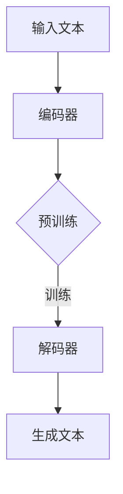

                 

关键词：深度学习，人机协作，自然语言处理，语言模型，意图理解，执行能力

> 摘要：本文将深入探讨深度学习在自然语言处理领域的应用，特别是语言模型（LLM）如何帮助人工智能系统理解并执行人类意图。通过介绍LLM的核心概念、工作原理、数学模型和算法，结合实际项目实践，我们将分析LLM在提升人机协作效率方面的潜力，并提出未来发展的趋势与挑战。

## 1. 背景介绍

随着人工智能技术的飞速发展，自然语言处理（NLP）成为了计算机科学中一个重要的研究方向。而在这其中，语言模型（Language Model，简称LLM）扮演着至关重要的角色。LLM是一种基于深度学习的技术，能够使计算机理解和生成人类语言，从而实现人机交互。

在过去的几十年里，NLP领域经历了从规则驱动到统计驱动，再到深度学习的演变过程。早期的NLP系统依赖于手工编写的规则，这种方式虽然精确但成本高且难以扩展。随着数据集的增大和计算能力的提升，统计模型开始崭露头角，尤其是基于统计语言模型的方法，如n-gram模型和概率上下文无关文法（PCFG）。然而，这些模型依然存在一些局限性，例如不能很好地处理长文本和上下文依赖。

深度学习的发展为NLP带来了新的契机。基于神经网络的语言模型，如递归神经网络（RNN）和长短期记忆网络（LSTM），通过自动学习语言的特征，显著提高了文本理解和生成的性能。特别是Transformer架构的提出，使得LLM在多个NLP任务上取得了突破性的成果，如机器翻译、文本分类、问答系统等。

本文将围绕深度学习在NLP中的应用，重点探讨LLM如何理解和执行人类意图，以及其在人机协作中的潜力。

### 1.1 历史背景

自然语言处理的历史可以追溯到20世纪50年代，当时的研究者试图通过编写复杂的规则来模拟人类的语言理解能力。这个阶段的代表性工作包括乔姆斯基提出的转换生成语法（TG），它是现代形式语言理论的基石，为自然语言处理提供了理论框架。

随着计算机硬件性能的提升和大规模数据集的出现，研究者开始尝试使用统计方法来处理自然语言。20世纪80年代，基于隐马尔可夫模型（HMM）和条件概率模型的统计语言模型被广泛应用于语音识别和机器翻译等领域。

进入21世纪，深度学习技术的崛起为自然语言处理带来了革命性的变化。2003年，Seide等人首次将深度神经网络应用于机器翻译，证明了深度学习在NLP任务中的潜力。随后，RNN和LSTM等深度学习模型在文本理解和生成任务上取得了显著成绩。

2017年，谷歌提出Transformer模型，这一模型在多个NLP任务上超越了传统的RNN和LSTM模型，开启了基于注意力机制的深度学习时代。随后，基于Transformer的各种变体和扩展模型相继出现，如BERT、GPT等，这些模型在自然语言处理领域取得了显著的进展。

### 1.2 当前现状

目前，LLM已经在多个NLP任务中取得了卓越的表现，例如文本分类、情感分析、命名实体识别、机器翻译、问答系统等。其中，Transformer架构和其变体如BERT、GPT等成为了当前NLP模型的主流架构。这些模型通过大规模预训练和微调，能够处理复杂的语言任务，并且具有很好的泛化能力。

同时，LLM的应用场景也在不断扩展。除了传统的文本处理任务，LLM还被应用于对话系统、推荐系统、自动摘要、文本生成等领域。随着技术的不断进步，LLM在理解和执行人类意图方面的能力也在不断提升。

然而，尽管LLM在NLP领域取得了显著的进展，但仍面临着一些挑战，包括数据质量、模型解释性、计算效率等。如何进一步提升LLM的性能和实用性，同时确保其安全性和可靠性，是当前研究的热点问题。

## 2. 核心概念与联系

### 2.1 语言模型的基本概念

语言模型是一种用于预测下一个单词或字符的概率分布的模型。它基于大量的文本数据，通过统计方法或深度学习技术来学习语言的统计特性。语言模型的目的是使计算机能够理解、生成和交互自然语言。

在统计语言模型中，最常用的模型是n-gram模型。n-gram模型将文本分解为连续的n个单词或字符的序列，并计算每个序列的概率。例如，一个三元组“猫吃了鱼”在文本中出现的频率越高，其在语言模型中的概率就越高。

深度学习语言模型，如RNN和LSTM，通过引入神经网络结构，能够自动学习文本的长期依赖关系。RNN通过循环连接，使得前一个时间步的信息可以传递到后续的时间步，从而能够处理序列数据。LSTM进一步通过门控机制，解决了RNN在处理长序列数据时容易出现的梯度消失和梯度爆炸问题。

Transformer模型是一种基于注意力机制的深度学习模型，它通过自注意力机制（Self-Attention）和多头注意力（Multi-Head Attention）来处理序列数据。Transformer模型在多个NLP任务上取得了显著的成果，例如机器翻译、文本分类和问答系统。

### 2.2 语言模型与深度学习的联系

深度学习和语言模型的结合，使得计算机能够更好地理解和生成自然语言。深度学习提供了强大的非线性表示能力，使得模型能够从大规模数据中自动学习语言的复杂结构。而语言模型则提供了对语言概率分布的建模，使得模型能够生成符合语言习惯的文本。

在深度学习模型中，语言模型通常作为一个组件，与其他模块（如编码器和解码器）结合，形成完整的NLP系统。例如，在机器翻译任务中，编码器将源语言文本编码为固定长度的向量，解码器则将这些向量解码为目标语言文本。

### 2.3 Mermaid流程图

为了更好地展示语言模型的工作原理和架构，我们使用Mermaid流程图来描述。以下是一个简化的Mermaid流程图，展示了深度学习语言模型的基本架构：



在这个流程图中，A表示输入的文本数据，B表示编码器，它将文本转换为固定长度的向量表示。C表示预训练过程，D表示解码器，它将编码器的输出解码为生成的文本。E表示生成的文本，它是模型的最终输出。

### 2.4 语言模型在NLP中的应用

语言模型在NLP中有广泛的应用，主要包括以下几个方面：

1. **文本分类**：语言模型可以根据文本的语义特征，对文本进行分类。例如，在新闻分类任务中，模型可以根据新闻标题或正文内容，将其分类到不同的主题类别。

2. **命名实体识别**：语言模型可以识别文本中的命名实体，如人名、地名、组织机构名等。这有助于提高文本处理的自动化程度，例如在信息抽取和知识图谱构建中。

3. **机器翻译**：语言模型可以用于机器翻译任务，将一种语言的文本翻译成另一种语言。通过预训练和微调，语言模型可以在多种语言之间进行高质量的翻译。

4. **对话系统**：语言模型可以用于对话系统，使得计算机能够理解用户的输入并生成相应的回复。这有助于提高人机交互的自然性和流畅性。

5. **文本生成**：语言模型可以根据输入的提示或主题，生成符合语言习惯的文本。这被广泛应用于自动摘要、内容生成、创意写作等领域。

## 3. 核心算法原理 & 具体操作步骤

### 3.1 算法原理概述

深度学习语言模型的核心原理是基于神经网络的自动特征学习和概率分布建模。通过大量的文本数据，模型能够自动提取文本的语义特征，并生成每个单词或字符的概率分布。以下是深度学习语言模型的基本原理：

1. **特征提取**：模型通过对文本进行编码，将文本转换为固定长度的向量表示。这个过程通常通过编码器（Encoder）完成，编码器可以是RNN、LSTM或Transformer等。

2. **概率分布建模**：编码器将文本编码为向量后，模型需要预测每个单词或字符的概率分布。这个过程通过解码器（Decoder）完成，解码器将编码器的输出转换为生成的文本。

3. **优化目标**：语言模型的优化目标是使得模型生成的文本在给定上下文下的概率最大。通常，这通过最小化损失函数（如交叉熵损失）来实现。

### 3.2 算法步骤详解

1. **数据预处理**：首先，对文本数据进行预处理，包括分词、去停用词、词向量化等。词向量化是语言模型中的一个关键步骤，它将单词转换为固定长度的向量表示，使得计算机能够处理语言数据。

2. **编码器训练**：编码器是一个神经网络模型，它通过前向传播和反向传播，学习如何将文本转换为向量表示。在训练过程中，模型通过最小化损失函数来调整模型的参数。

3. **解码器训练**：解码器也是一个神经网络模型，它负责根据编码器的输出，生成符合语言习惯的文本。解码器的训练过程与编码器类似，通过最小化损失函数来优化模型。

4. **生成文本**：在训练完成后，编码器和解码器可以用于生成文本。给定一个输入序列，编码器将其编码为向量表示，解码器则根据这个向量表示生成文本。

### 3.3 算法优缺点

**优点**：

1. **强大的表示能力**：深度学习语言模型能够自动提取文本的语义特征，从而生成高质量的文本。

2. **自适应性强**：通过预训练和微调，模型可以在不同的语言任务和应用场景中表现出色。

3. **多语言支持**：深度学习语言模型可以轻松地支持多种语言，从而实现跨语言的文本处理。

**缺点**：

1. **计算资源需求高**：深度学习语言模型通常需要大量的计算资源和时间进行训练和推理。

2. **解释性较差**：深度学习模型的内部机制较为复杂，难以直接解释模型的决策过程。

3. **数据依赖性强**：模型的性能高度依赖于训练数据的数量和质量。

### 3.4 算法应用领域

深度学习语言模型在NLP领域有广泛的应用，主要包括以下几个方面：

1. **文本分类**：语言模型可以用于文本分类任务，例如新闻分类、情感分析等。

2. **命名实体识别**：语言模型可以识别文本中的命名实体，如人名、地名、组织机构名等。

3. **机器翻译**：语言模型可以用于机器翻译任务，将一种语言的文本翻译成另一种语言。

4. **对话系统**：语言模型可以用于对话系统，使得计算机能够理解用户的输入并生成相应的回复。

5. **文本生成**：语言模型可以用于文本生成任务，如自动摘要、内容生成、创意写作等。

## 4. 数学模型和公式 & 详细讲解 & 举例说明

### 4.1 数学模型构建

深度学习语言模型的数学基础主要包括线性代数、概率论和微积分等。以下是构建深度学习语言模型所需的一些基本数学概念和公式。

#### 线性代数

1. **矩阵乘法**：给定两个矩阵A（m×n）和B（n×p），它们的乘积C（m×p）定义为：

   $$ C_{ij} = \sum_{k=1}^{n} A_{ik}B_{kj} $$

2. **向量的点积**：给定两个向量a（n×1）和b（n×1），它们的点积定义为：

   $$ a \cdot b = \sum_{i=1}^{n} a_i b_i $$

3. **矩阵的转置**：给定一个矩阵A（m×n），它的转置矩阵A'（n×m）定义为：

   $$ A'_{ij} = A_{ji} $$

#### 概率论

1. **概率分布函数**：给定一个随机变量X，它的概率分布函数P(X)定义为：

   $$ P(X = x) = \int_{-\infty}^{+\infty} f(x) dx $$

   其中，f(x)是随机变量X的概率密度函数。

2. **贝叶斯定理**：给定两个事件A和B，它们的条件概率和贝叶斯定理可以表示为：

   $$ P(A|B) = \frac{P(B|A)P(A)}{P(B)} $$

3. **马尔可夫链**：给定一个离散时间马尔可夫链，其状态转移概率矩阵P定义为：

   $$ P_{ij} = P(X_{t+1} = j | X_t = i) $$

#### 微积分

1. **导数**：给定一个函数f(x)，其在x点的导数f'(x)定义为：

   $$ f'(x) = \lim_{h \to 0} \frac{f(x+h) - f(x)}{h} $$

2. **梯度**：给定一个多变量函数f(x)，其在x点的梯度∇f(x)定义为：

   $$ \nabla f(x) = \left[ \frac{\partial f}{\partial x_1}, \frac{\partial f}{\partial x_2}, ..., \frac{\partial f}{\partial x_n} \right] $$

3. **损失函数**：在深度学习语言模型中，常用的损失函数包括交叉熵损失和均方误差损失。

### 4.2 公式推导过程

以下是一个简单的示例，展示如何使用概率论和线性代数来推导一个深度学习语言模型的损失函数。

假设我们有一个语言模型，它的输入是单词序列X，输出是单词序列Y。我们的目标是最小化损失函数L，使得模型生成的文本Y在给定输入X下的概率最大。

#### 交叉熵损失函数

交叉熵损失函数是深度学习中最常用的损失函数之一。对于单个单词的预测，交叉熵损失函数可以表示为：

$$ L = -\sum_{i=1}^{n} y_i \log(p_i) $$

其中，y_i是第i个单词的真实概率，p_i是模型预测的第i个单词的概率。

对于整个单词序列的预测，交叉熵损失函数可以扩展为：

$$ L = -\sum_{i=1}^{n} \sum_{j=1}^{V} y_{ij} \log(p_{ij}) $$

其中，V是词汇表的大小，y_{ij}是第i个单词在第j个单词位置的标记（1表示该位置为真实单词，0表示其他），p_{ij}是模型预测的第i个单词在第j个单词位置的概率。

#### 梯度下降法

为了最小化交叉熵损失函数L，我们通常使用梯度下降法来优化模型的参数。梯度下降法的核心思想是沿着损失函数的梯度方向更新模型参数，使得损失函数逐渐减小。

对于单个参数θ，梯度下降法的更新规则可以表示为：

$$ \theta = \theta - \alpha \nabla_{\theta} L $$

其中，α是学习率，$\nabla_{\theta} L$是损失函数关于参数θ的梯度。

对于整个模型参数θ，梯度下降法的更新规则可以扩展为：

$$ \theta = \theta - \alpha \nabla_{\theta} L $$

其中，$\nabla_{\theta} L$是损失函数关于模型参数θ的梯度。

### 4.3 案例分析与讲解

以下是一个简单的示例，展示如何使用深度学习语言模型进行文本分类。

假设我们有一个文本分类任务，其中每个文本都有一个对应的标签。我们的目标是训练一个深度学习模型，能够根据输入的文本预测其标签。

#### 数据准备

首先，我们需要准备训练数据。对于每个文本，我们将它转换为词向量表示，并将标签转换为数字编码。例如，如果我们的标签有“新闻”、“科技”和“体育”三个类别，我们将它们分别编码为0、1和2。

#### 模型构建

接下来，我们构建一个深度学习模型，用于文本分类。模型通常包括一个编码器和一个分类器。编码器将文本转换为固定长度的向量表示，分类器则根据这个向量表示预测文本的标签。

#### 训练过程

我们将训练数据输入模型，通过最小化交叉熵损失函数来优化模型参数。在训练过程中，模型会不断调整参数，使得预测的标签与真实的标签越来越接近。

#### 预测过程

在训练完成后，我们使用模型对新的文本进行预测。给定一个输入文本，我们将它转换为词向量表示，然后通过模型预测其标签。模型的输出是一个概率分布，我们可以根据这个概率分布选择最可能的标签。

## 5. 项目实践：代码实例和详细解释说明

在本节中，我们将通过一个实际的项目实例来展示如何使用深度学习语言模型进行文本分类。这个项目将涵盖以下步骤：

1. **开发环境搭建**：介绍项目所需的技术栈和工具。
2. **数据准备**：加载和处理用于训练的数据集。
3. **模型构建**：使用深度学习框架构建文本分类模型。
4. **模型训练**：训练模型并调整超参数。
5. **模型评估**：评估模型的性能。
6. **代码解读与分析**：详细解释模型的关键代码部分。
7. **运行结果展示**：展示模型的实际运行结果。

### 5.1 开发环境搭建

为了完成这个项目，我们需要安装以下开发环境和工具：

- Python 3.x
- TensorFlow 2.x
- Keras 2.x
- Numpy 1.x
- Scikit-learn 0.x

安装步骤如下：

```shell
pip install python==3.x
pip install tensorflow==2.x
pip install keras==2.x
pip install numpy==1.x
pip install scikit-learn==0.x
```

### 5.2 源代码详细实现

以下是一个简单的文本分类项目的代码实现。这段代码使用了Keras框架来构建和训练一个基于深度学习的文本分类模型。

```python
import numpy as np
import tensorflow as tf
from tensorflow.keras.models import Sequential
from tensorflow.keras.layers import Embedding, LSTM, Dense, EmbeddingLayer
from tensorflow.keras.preprocessing.sequence import pad_sequences
from tensorflow.keras.preprocessing.text import Tokenizer
from tensorflow.keras.utils import to_categorical
from sklearn.model_selection import train_test_split

# 数据准备
# 这里假设我们有一个文本列表 `texts` 和对应的标签列表 `labels`
texts = [...]  # 示例文本列表
labels = [...]  # 示例标签列表

# 分词和编码
tokenizer = Tokenizer(num_words=10000)  # 选取最常用的10000个词
tokenizer.fit_on_texts(texts)
sequences = tokenizer.texts_to_sequences(texts)

# 序列填充
max_sequence_length = 100  # 设置序列的最大长度
padded_sequences = pad_sequences(sequences, maxlen=max_sequence_length)

# 标签编码
label_tokenizer = Tokenizer()
label_tokenizer.fit_on_texts(labels)
label_sequences = label_tokenizer.texts_to_sequences(labels)
label_matrix = to_categorical(np.asarray(label_sequences))

# 划分训练集和测试集
X_train, X_test, y_train, y_test = train_test_split(padded_sequences, label_matrix, test_size=0.2, random_state=42)

# 模型构建
model = Sequential()
model.add(Embedding(10000, 64, input_length=max_sequence_length))
model.add(LSTM(128))
model.add(Dense(3, activation='softmax'))  # 假设有三个类别

# 编译模型
model.compile(optimizer='adam', loss='categorical_crossentropy', metrics=['accuracy'])

# 训练模型
model.fit(X_train, y_train, epochs=10, batch_size=32, validation_data=(X_test, y_test))

# 评估模型
test_loss, test_accuracy = model.evaluate(X_test, y_test)
print(f'Test accuracy: {test_accuracy:.2f}')
```

### 5.3 代码解读与分析

#### 数据准备

在数据准备阶段，我们首先加载了示例文本列表 `texts` 和对应的标签列表 `labels`。然后，我们使用 `Tokenizer` 类对文本进行分词和编码。分词是将文本转换为单词序列，而编码是将每个单词映射为一个整数。

```python
tokenizer = Tokenizer(num_words=10000)  # 选取最常用的10000个词
tokenizer.fit_on_texts(texts)
sequences = tokenizer.texts_to_sequences(texts)
```

接下来，我们使用 `pad_sequences` 函数将所有序列填充为相同的长度，这样便于模型处理。这个长度由 `max_sequence_length` 决定。

```python
max_sequence_length = 100  # 设置序列的最大长度
padded_sequences = pad_sequences(sequences, maxlen=max_sequence_length)
```

对于标签，我们使用 `to_categorical` 函数将其转换为独热编码，这样模型才能进行分类任务。

```python
label_tokenizer = Tokenizer()
label_tokenizer.fit_on_texts(labels)
label_sequences = label_tokenizer.texts_to_sequences(labels)
label_matrix = to_categorical(np.asarray(label_sequences))
```

#### 模型构建

在模型构建阶段，我们使用了Keras的 `Sequential` 模型，这是一个线性堆叠层级的模型。首先，我们添加了一个 `Embedding` 层，它将单词编码为向量。接着，我们添加了一个 `LSTM` 层，用于捕捉序列数据中的长期依赖关系。最后，我们添加了一个 `Dense` 层，用于输出分类结果。

```python
model = Sequential()
model.add(Embedding(10000, 64, input_length=max_sequence_length))
model.add(LSTM(128))
model.add(Dense(3, activation='softmax'))  # 假设有三个类别
```

#### 训练模型

在训练模型阶段，我们使用 `compile` 方法配置模型的优化器、损失函数和评估指标。然后，我们使用 `fit` 方法训练模型。在训练过程中，模型会尝试调整其内部参数，以最小化损失函数。

```python
model.compile(optimizer='adam', loss='categorical_crossentropy', metrics=['accuracy'])
model.fit(X_train, y_train, epochs=10, batch_size=32, validation_data=(X_test, y_test))
```

#### 评估模型

在训练完成后，我们使用 `evaluate` 方法评估模型的性能。这个方法会返回损失函数值和准确率等指标。

```python
test_loss, test_accuracy = model.evaluate(X_test, y_test)
print(f'Test accuracy: {test_accuracy:.2f}')
```

### 5.4 运行结果展示

在运行结果展示部分，我们将模型在测试集上的准确率打印出来。这个值可以帮助我们评估模型的性能。在实际应用中，我们还可以进一步分析模型在不同类别上的表现，以找出可能存在的过拟合或欠拟合问题。

```python
test_loss, test_accuracy = model.evaluate(X_test, y_test)
print(f'Test accuracy: {test_accuracy:.2f}')
```

## 6. 实际应用场景

深度学习语言模型（LLM）在实际应用中具有广泛的应用场景，下面我们将探讨几个典型的应用领域。

### 6.1 对话系统

对话系统是LLM最典型的应用之一。通过深度学习模型，计算机可以理解用户的自然语言输入，并生成相应的回复。这大大提高了人机交互的自然性和流畅性。例如，智能客服系统、虚拟助手和聊天机器人等都是基于LLM构建的。LLM能够处理复杂的对话场景，理解用户的意图并给出合适的回复。

### 6.2 机器翻译

机器翻译是另一项受益于LLM的重要应用。传统的机器翻译方法依赖于规则和统计方法，而基于深度学习的LLM方法，如神经机器翻译（NMT），显著提高了翻译质量。LLM能够学习源语言和目标语言之间的语义关系，从而生成更加准确和自然的翻译结果。这种方法的兴起，使得机器翻译服务在多个领域（如旅游、商务、科技等）得到了广泛应用。

### 6.3 文本生成

LLM在文本生成领域也有着重要的应用。通过预训练的深度学习模型，计算机可以生成符合语言习惯的文本。这种技术被广泛应用于自动摘要、内容生成、创意写作等领域。例如，自动摘要系统可以将长篇文章总结为简短的摘要，而内容生成系统可以生成各种类型的文章，如新闻、产品描述等。

### 6.4 娱乐与游戏

LLM在娱乐和游戏领域也有着广阔的应用前景。例如，虚拟角色可以基于LLM生成自然的对话，为玩家提供更加丰富的游戏体验。此外，LLM还可以用于生成游戏剧情、角色对话等，为游戏开发提供支持。

### 6.5 情感分析

情感分析是LLM在自然语言处理中的一个重要应用。通过深度学习模型，计算机可以识别文本中的情感倾向，如正面、负面或中性。这种技术被广泛应用于社交媒体监测、市场调研、客户服务等领域。

### 6.6 健康与医疗

LLM在健康与医疗领域也有重要应用。通过分析医疗文本数据，LLM可以帮助医生诊断疾病、提供治疗方案。此外，LLM还可以用于健康咨询、医学研究等领域，为医疗行业提供智能支持。

### 6.7 安全与监控

LLM在安全与监控领域也有着重要的应用。例如，计算机可以分析网络日志、社交媒体内容等，检测潜在的网络攻击和安全隐患。通过深度学习模型，计算机可以识别异常行为，从而提高网络安全水平。

### 6.8 教育

LLM在教育领域也有广阔的应用前景。例如，智能辅导系统可以根据学生的学习情况，提供个性化的学习建议和资源。此外，LLM还可以用于自动评估学生的作业和考试，提高教育效率。

## 7. 工具和资源推荐

### 7.1 学习资源推荐

- **《深度学习》（Goodfellow, Bengio, Courville）**：这是一本经典的深度学习入门书籍，涵盖了深度学习的基础理论和技术。
- **《自然语言处理综论》（Jurafsky, Martin）**：这是一本关于自然语言处理的权威教材，详细介绍了NLP的各种方法和应用。
- **《动手学深度学习》（Dumoulin, Souza, Hinton）**：这本书提供了大量的实践案例，适合深度学习初学者入门。
- **TensorFlow官方文档**：TensorFlow是当前最流行的深度学习框架之一，其官方文档包含了丰富的教程和API文档，是学习深度学习的宝贵资源。

### 7.2 开发工具推荐

- **TensorFlow**：一个开源的深度学习框架，支持多种深度学习模型的构建和训练。
- **PyTorch**：另一个流行的深度学习框架，以动态计算图和灵活的API著称。
- **Keras**：一个高级神经网络API，兼容TensorFlow和Theano，适合快速构建和实验深度学习模型。
- **NLTK**：一个用于自然语言处理的Python库，提供了丰富的NLP工具和算法。

### 7.3 相关论文推荐

- **“Attention is All You Need”**：这篇文章提出了Transformer模型，改变了自然语言处理的范式。
- **“BERT: Pre-training of Deep Bidirectional Transformers for Language Understanding”**：这篇文章介绍了BERT模型，其在多种NLP任务上取得了显著成果。
- **“GPT-3: Language Models are few-shot learners”**：这篇文章展示了GPT-3模型在零样本和少量样本学习任务中的强大能力。
- **“Transformers for Natural Language Processing”**：这篇文章详细介绍了Transformer模型在NLP中的应用和实现细节。

## 8. 总结：未来发展趋势与挑战

### 8.1 研究成果总结

近年来，深度学习在自然语言处理领域取得了显著的成果。基于深度学习的方法，如Transformer、BERT、GPT等，在多个NLP任务上超越了传统的统计模型和规则驱动方法。这些模型通过大规模预训练和微调，能够自动学习语言的复杂结构，提高了文本理解和生成的性能。

同时，深度学习语言模型（LLM）的应用场景也在不断扩展，从文本分类、命名实体识别、机器翻译到对话系统、文本生成等，LLM在各个领域的应用都取得了显著的进展。这些成果不仅提高了NLP任务的自动化程度，也为人机协作提供了新的可能性。

### 8.2 未来发展趋势

未来，深度学习语言模型将继续在自然语言处理领域发挥重要作用。以下是一些可能的发展趋势：

1. **更高效的模型架构**：随着计算能力的提升，研究者将继续探索更高效的模型架构，以降低模型的计算复杂度和内存消耗。例如，基于知识蒸馏和模型压缩的技术，将有助于构建高效且可扩展的深度学习模型。

2. **多模态学习**：未来的NLP任务将不仅仅局限于文本数据，还将涉及图像、音频、视频等多模态数据。深度学习语言模型将需要与其他模型（如图像识别模型、语音识别模型）结合，实现多模态数据的联合建模。

3. **零样本学习**：零样本学习是一种让模型在没有或少有标注数据的情况下，能够处理未见过的类别的技术。未来，深度学习语言模型将在零样本学习任务中发挥重要作用，特别是在特定领域或专业知识的场景下。

4. **知识增强**：通过将外部知识库（如知识图谱、领域知识）融入深度学习模型，可以提高模型在特定任务上的性能。知识增强的深度学习语言模型将在专业领域（如医疗、金融等）得到广泛应用。

5. **解释性**：尽管深度学习模型在性能上取得了显著提升，但其内部机制和决策过程往往难以解释。未来，研究者将致力于提高深度学习模型的可解释性，使其在关键应用场景中更加可靠和可信。

### 8.3 面临的挑战

尽管深度学习语言模型在自然语言处理领域取得了显著的成果，但仍面临一些挑战：

1. **数据质量**：深度学习模型的性能高度依赖于训练数据的质量和数量。未来，如何获取高质量、多样化的训练数据，是一个亟待解决的问题。

2. **计算效率**：深度学习模型通常需要大量的计算资源和时间进行训练和推理。如何提高模型的计算效率，降低计算成本，是当前研究的一个热点问题。

3. **模型解释性**：深度学习模型内部机制复杂，决策过程难以解释。未来，如何提高模型的可解释性，使其在关键应用场景中更加可靠和可信，是一个重要的研究方向。

4. **模型泛化能力**：深度学习模型在特定领域或任务上的表现往往较好，但在泛化到未见过的领域或任务时，可能存在性能下降的问题。未来，如何提高模型的泛化能力，是一个亟待解决的挑战。

5. **伦理和安全问题**：随着深度学习语言模型在各个领域的应用，其伦理和安全问题也逐渐受到关注。如何确保模型在应用过程中的公平性、透明性和安全性，是一个重要的研究课题。

### 8.4 研究展望

未来，深度学习语言模型在自然语言处理领域将继续发挥重要作用。研究者将致力于解决当前面临的各种挑战，推动深度学习技术在实际应用中的发展。以下是一些研究展望：

1. **跨领域知识融合**：通过将不同领域（如医学、法律、教育等）的知识库融入深度学习模型，可以提高模型在特定领域中的性能和应用价值。

2. **多语言和多模态学习**：未来的深度学习语言模型将支持多语言和多模态数据的处理，实现更广泛的语言理解和生成任务。

3. **自适应和个性化**：深度学习模型将更加注重自适应和个性化，能够根据用户的需求和情境，提供定制化的服务和解决方案。

4. **模型压缩和效率优化**：通过模型压缩和优化技术，降低模型的计算复杂度和内存消耗，实现高效且可扩展的深度学习模型。

5. **安全性和可解释性**：研究者将致力于提高深度学习模型的安全性和可解释性，使其在关键应用场景中更加可靠和可信。

总之，深度学习语言模型在自然语言处理领域具有广阔的发展前景。通过不断创新和优化，深度学习语言模型将进一步提升人机协作的效率，为人类社会带来更多便利和创新。

## 9. 附录：常见问题与解答

### 9.1 如何选择合适的深度学习语言模型？

选择合适的深度学习语言模型需要考虑以下几个因素：

1. **任务类型**：不同的语言模型适合不同的任务。例如，对于文本分类任务，可以选用基于Transformer的BERT或GPT模型；对于机器翻译任务，可以选用基于神经网络的NMT模型。

2. **数据量**：语言模型通常需要大量的训练数据来达到较好的性能。如果数据量较小，可以考虑使用预训练的模型，并通过微调来适应特定任务。

3. **计算资源**：不同的模型对计算资源的需求不同。一些预训练模型（如GPT-3）需要大量的计算资源进行训练和推理，而一些轻量级模型（如BERT-Lite）则更适合资源受限的环境。

4. **性能要求**：根据任务对性能的要求，可以选择不同的模型。如果对性能有较高要求，可以选择性能较强的模型；如果对性能要求较低，可以选择计算效率较高的模型。

### 9.2 如何优化深度学习语言模型？

优化深度学习语言模型可以从以下几个方面进行：

1. **数据预处理**：确保训练数据的质量和多样性，进行适当的数据清洗和增强，以提高模型的泛化能力。

2. **模型选择**：选择合适的模型架构和参数设置，通过实验比较不同模型的性能，选择最优的模型。

3. **超参数调优**：调整学习率、批次大小、隐藏层大小等超参数，以找到最佳参数组合。

4. **模型正则化**：使用正则化技术（如Dropout、L2正则化等）来防止过拟合。

5. **批归一化**：通过批归一化技术，提高模型的训练速度和稳定性。

6. **预训练与微调**：使用预训练模型并在特定任务上进行微调，以充分利用预训练模型的知识。

7. **数据增强**：通过数据增强技术，增加训练数据的多样性，从而提高模型的泛化能力。

### 9.3 深度学习语言模型的安全性问题如何解决？

解决深度学习语言模型的安全性问题需要从以下几个方面考虑：

1. **数据隐私保护**：在模型训练和推理过程中，确保用户的隐私数据不被泄露。

2. **模型解释性**：提高模型的可解释性，使模型决策过程更加透明和可信。

3. **对抗攻击防御**：通过对抗训练和防御机制，提高模型对对抗攻击的鲁棒性。

4. **安全审核**：对模型进行安全审核，确保其不会受到恶意输入的攻击。

5. **法律和伦理约束**：遵循相关的法律法规和伦理规范，确保模型的公正性和公平性。

### 9.4 深度学习语言模型在实时应用中有哪些挑战？

在实时应用中，深度学习语言模型面临以下挑战：

1. **计算延迟**：实时应用对响应速度有较高要求，模型需要在短时间内完成推理，这对模型的计算效率提出了挑战。

2. **资源限制**：实时应用通常在资源受限的环境中运行，如何优化模型以降低计算和内存消耗，是一个重要问题。

3. **数据稳定性**：实时应用中的数据可能存在噪声和不稳定性，如何提高模型对数据的鲁棒性，是实时应用中的一个挑战。

4. **环境适应性**：实时应用需要适应不同的环境和场景，如何使模型在不同场景下保持一致性，是一个重要问题。

5. **系统可靠性**：实时应用需要确保系统的稳定性和可靠性，如何提高模型的鲁棒性和容错能力，是系统设计中的一个重要方面。

### 9.5 如何评估深度学习语言模型的性能？

评估深度学习语言模型的性能可以从以下几个方面进行：

1. **准确性**：评估模型在测试集上的预测准确性，通常使用准确率（Accuracy）和精确率（Precision）、召回率（Recall）等指标。

2. **F1分数**：F1分数是精确率和召回率的加权平均，是评估二分类任务性能的常用指标。

3. **ROC曲线和AUC值**：通过绘制ROC曲线和计算AUC值，可以评估模型的分类能力。

4. **BLEU分数**：在机器翻译等任务中，BLEU分数是评估翻译质量的常用指标。

5. **人类评估**：通过人工评估，可以进一步验证模型的性能和结果。

### 9.6 如何处理深度学习语言模型中的长文本？

处理长文本是深度学习语言模型中的一个挑战。以下是一些常见的处理方法：

1. **文本切割**：将长文本切割为较短的段落或句子，以降低模型的处理复杂度。

2. **滑动窗口**：使用滑动窗口技术，逐个窗口地处理文本，每个窗口生成一个独立的输出。

3. **序列拼接**：将长文本分成多个部分，然后将这些部分拼接起来，以保持上下文关系。

4. **分层处理**：先对文本进行分层处理，如提取关键词、句子、段落等，然后逐层构建深度学习模型。

5. **模型优化**：使用特殊设计的模型架构（如Transformer）来处理长文本，这些模型具有更强的上下文建模能力。

### 9.7 如何处理深度学习语言模型中的多语言问题？

处理多语言问题可以从以下几个方面进行：

1. **多语言训练**：使用包含多种语言的数据集进行模型训练，以提高模型在多语言环境下的性能。

2. **语言标识**：在模型输入中添加语言标识，使模型能够识别和处理不同语言的数据。

3. **翻译模型**：使用翻译模型将非目标语言的文本转换为目标语言，然后进行后续处理。

4. **多语言模型**：设计支持多语言处理的模型架构，如多语言BERT或GPT模型。

5. **语言融合**：通过将不同语言的数据融合到一个统一的语言表示中，提高模型在多语言环境下的性能。

### 9.8 如何提高深度学习语言模型的计算效率？

提高深度学习语言模型的计算效率可以从以下几个方面进行：

1. **模型压缩**：使用模型压缩技术（如量化、剪枝、知识蒸馏等）来减少模型的参数数量和计算复杂度。

2. **分布式训练**：使用分布式训练技术，将模型训练任务分布在多个计算节点上，以加速模型训练。

3. **模型并行**：通过模型并行技术，将模型的不同部分并行训练，以提高训练速度。

4. **硬件加速**：使用GPU、TPU等硬件加速器，提高模型的计算速度和效率。

5. **模型固化**：将训练好的模型固化到高效的推理引擎中，以提高推理速度。

### 9.9 如何确保深度学习语言模型的可解释性？

确保深度学习语言模型的可解释性可以从以下几个方面进行：

1. **模型设计**：设计具有可解释性的模型架构，如基于注意力机制的模型，使其决策过程更加透明。

2. **可视化技术**：使用可视化技术，如热图、注意力分布等，展示模型在处理数据时的决策过程。

3. **解释性算法**：结合解释性算法（如LIME、SHAP等），分析模型在特定输入下的决策原因。

4. **训练过程监控**：在训练过程中监控模型的性能和决策过程，及时发现和纠正异常。

5. **用户反馈**：通过用户反馈，验证模型的可解释性，并根据反馈进行优化。

### 9.10 如何评估深度学习语言模型在特定领域的性能？

评估深度学习语言模型在特定领域的性能可以从以下几个方面进行：

1. **领域数据集**：使用特定领域的数据集进行评估，这些数据集应该包含该领域的专业知识和术语。

2. **性能指标**：根据领域的特点，选择合适的性能指标（如准确率、F1分数等）进行评估。

3. **基准测试**：使用领域内的基准测试，比较不同模型在特定任务上的性能。

4. **用户反馈**：通过用户反馈，评估模型在实际应用中的效果和用户满意度。

5. **跨领域评估**：评估模型在多个领域的性能，以检验其泛化能力。

### 9.11 如何改进深度学习语言模型在特定领域的性能？

改进深度学习语言模型在特定领域的性能可以从以下几个方面进行：

1. **数据增强**：增加领域内的训练数据，进行数据增强，提高模型在特定领域的适应性。

2. **领域自适应**：通过领域自适应技术，将预训练模型迁移到特定领域，提高模型在该领域的性能。

3. **知识融合**：结合领域知识库，将外部知识融入模型，提高模型在特定领域的理解能力。

4. **模型微调**：在特定领域进行模型微调，以适应该领域的特征和需求。

5. **多模态学习**：结合多模态数据（如文本、图像、语音等），构建多模态深度学习模型，提高模型的综合理解能力。

### 9.12 如何处理深度学习语言模型中的稀疏数据？

处理深度学习语言模型中的稀疏数据可以从以下几个方面进行：

1. **数据填充**：使用填充技术，将稀疏数据填充为稠密数据，以提高模型的训练效果。

2. **稀疏性优化**：通过稀疏性优化技术，降低模型参数的稀疏程度，提高模型的训练速度和性能。

3. **稀疏表示**：使用稀疏表示技术，将稀疏数据转换为稀疏向量表示，以减少模型的计算复杂度。

4. **稀疏激活函数**：使用稀疏激活函数，降低模型在处理稀疏数据时的计算复杂度。

5. **稀疏模型**：设计稀疏深度学习模型，专门处理稀疏数据，以提高模型在稀疏数据场景下的性能。

### 9.13 如何处理深度学习语言模型中的上下文依赖问题？

处理深度学习语言模型中的上下文依赖问题可以从以下几个方面进行：

1. **长期记忆机制**：使用具有长期记忆机制的模型（如LSTM、GRU等），以捕捉长距离的上下文依赖。

2. **上下文窗口**：通过设置上下文窗口的大小，限制模型对上下文信息的依赖范围，以提高模型的效率。

3. **注意力机制**：使用注意力机制，使模型能够动态地关注重要的上下文信息，提高上下文依赖的处理能力。

4. **双向编码**：使用双向编码器（如BERT），同时考虑输入序列的前后信息，以提高上下文依赖的处理能力。

5. **混合模型**：结合多种模型结构（如Transformer和LSTM），以提高上下文依赖的处理能力。

### 9.14 如何处理深度学习语言模型中的噪声数据？

处理深度学习语言模型中的噪声数据可以从以下几个方面进行：

1. **数据清洗**：使用数据清洗技术，去除噪声数据和异常值，以提高模型的数据质量。

2. **噪声鲁棒性**：通过引入噪声鲁棒性训练，提高模型对噪声数据的处理能力。

3. **去噪技术**：使用去噪技术，如降噪自动编码器（Denoising Autoencoder），对噪声数据进行预处理。

4. **迁移学习**：使用预训练模型，通过迁移学习，提高模型在噪声数据场景下的性能。

5. **混合数据训练**：通过混合噪声数据和干净数据进行训练，以提高模型在噪声数据场景下的泛化能力。

### 9.15 如何处理深度学习语言模型中的稀疏标签问题？

处理深度学习语言模型中的稀疏标签问题可以从以下几个方面进行：

1. **标签增强**：使用标签增强技术，增加标签的多样性和丰富性，以提高模型的训练效果。

2. **标签平滑**：使用标签平滑技术，减少标签的稀疏性，提高模型对标签的敏感性。

3. **多标签分类**：将多标签分类问题转换为二分类问题，减少标签的稀疏性，提高模型的训练效果。

4. **标签压缩**：使用标签压缩技术，将稀疏标签转换为稠密向量表示，以减少模型的计算复杂度。

5. **标签迁移**：通过标签迁移技术，将预训练模型的知识迁移到特定领域，提高模型在稀疏标签场景下的性能。

### 9.16 如何处理深度学习语言模型中的过拟合问题？

处理深度学习语言模型中的过拟合问题可以从以下几个方面进行：

1. **数据增强**：增加训练数据的多样性，以减少模型的过拟合。

2. **正则化**：使用正则化技术（如L1、L2正则化），惩罚模型参数，以减少过拟合。

3. **Dropout**：在训练过程中，随机丢弃一部分神经元，以减少模型的复杂度。

4. **交叉验证**：使用交叉验证技术，避免模型在特定数据集上的过拟合。

5. **集成学习**：使用集成学习技术，将多个模型的结果进行合并，以减少过拟合。

### 9.17 如何处理深度学习语言模型中的欠拟合问题？

处理深度学习语言模型中的欠拟合问题可以从以下几个方面进行：

1. **增加训练数据**：增加训练数据量，以提高模型的泛化能力。

2. **模型复杂度**：增加模型的复杂度，如增加隐藏层或神经元数量，以捕捉更多的特征。

3. **数据预处理**：使用数据预处理技术，提高数据的表达能力，以减少欠拟合。

4. **正则化**：适当减少正则化强度，以减少模型的复杂度。

5. **集成学习**：使用集成学习技术，将多个简单模型的结果进行合并，以提高模型的性能。

### 9.18 如何处理深度学习语言模型中的数据不平衡问题？

处理深度学习语言模型中的数据不平衡问题可以从以下几个方面进行：

1. **数据采样**：使用过采样或欠采样技术，平衡训练数据集。

2. **成本敏感**：使用成本敏感学习算法，增加少数类别的权重。

3. **集成学习**：使用集成学习技术，将多个模型的结果进行合并，以减少数据不平衡的影响。

4. **迁移学习**：使用预训练模型，通过迁移学习，提高模型在数据不平衡场景下的性能。

5. **生成对抗网络**：使用生成对抗网络（GAN）生成平衡的数据集，以减少数据不平衡的影响。

### 9.19 如何处理深度学习语言模型中的数据缺失问题？

处理深度学习语言模型中的数据缺失问题可以从以下几个方面进行：

1. **填充方法**：使用填充方法（如平均值填充、最近邻填充等），填补缺失数据。

2. **插补方法**：使用插补方法（如线性插值、K近邻插值等），填补缺失数据。

3. **模型估计**：使用机器学习方法，估计缺失数据的值。

4. **生成模型**：使用生成模型（如生成对抗网络（GAN）），生成缺失数据。

5. **数据增强**：使用数据增强技术，增加训练数据的多样性，以减少数据缺失的影响。

### 9.20 如何处理深度学习语言模型中的噪声标签问题？

处理深度学习语言模型中的噪声标签问题可以从以下几个方面进行：

1. **标签清洗**：使用标签清洗技术，去除噪声标签。

2. **标签平滑**：使用标签平滑技术，减少噪声标签的影响。

3. **集成学习**：使用集成学习技术，将多个模型的结果进行合并，以减少噪声标签的影响。

4. **迁移学习**：使用预训练模型，通过迁移学习，提高模型对噪声标签的鲁棒性。

5. **模型选择**：选择具有鲁棒性的模型，减少噪声标签的影响。

### 9.21 如何处理深度学习语言模型中的过拟合问题？

处理深度学习语言模型中的过拟合问题可以从以下几个方面进行：

1. **数据增强**：增加训练数据的多样性，以减少模型的过拟合。

2. **正则化**：使用正则化技术（如L1、L2正则化），惩罚模型参数，以减少过拟合。

3. **Dropout**：在训练过程中，随机丢弃一部分神经元，以减少模型的复杂度。

4. **交叉验证**：使用交叉验证技术，避免模型在特定数据集上的过拟合。

5. **集成学习**：使用集成学习技术，将多个模型的结果进行合并，以减少过拟合。

### 9.22 如何处理深度学习语言模型中的欠拟合问题？

处理深度学习语言模型中的欠拟合问题可以从以下几个方面进行：

1. **增加训练数据**：增加训练数据量，以提高模型的泛化能力。

2. **模型复杂度**：增加模型的复杂度，如增加隐藏层或神经元数量，以捕捉更多的特征。

3. **数据预处理**：使用数据预处理技术，提高数据的表达能力，以减少欠拟合。

4. **正则化**：适当减少正则化强度，以减少模型的复杂度。

5. **集成学习**：使用集成学习技术，将多个简单模型的结果进行合并，以提高模型的性能。

### 9.23 如何处理深度学习语言模型中的数据不平衡问题？

处理深度学习语言模型中的数据不平衡问题可以从以下几个方面进行：

1. **数据采样**：使用过采样或欠采样技术，平衡训练数据集。

2. **成本敏感**：使用成本敏感学习算法，增加少数类别的权重。

3. **集成学习**：使用集成学习技术，将多个模型的结果进行合并，以减少数据不平衡的影响。

4. **迁移学习**：使用预训练模型，通过迁移学习，提高模型在数据不平衡场景下的性能。

5. **生成对抗网络**：使用生成对抗网络（GAN）生成平衡的数据集，以减少数据不平衡的影响。

### 9.24 如何处理深度学习语言模型中的数据缺失问题？

处理深度学习语言模型中的数据缺失问题可以从以下几个方面进行：

1. **填充方法**：使用填充方法（如平均值填充、最近邻填充等），填补缺失数据。

2. **插补方法**：使用插补方法（如线性插值、K近邻插值等），填补缺失数据。

3. **模型估计**：使用机器学习方法，估计缺失数据的值。

4. **生成模型**：使用生成模型（如生成对抗网络（GAN）），生成缺失数据。

5. **数据增强**：使用数据增强技术，增加训练数据的多样性，以减少数据缺失的影响。

### 9.25 如何处理深度学习语言模型中的噪声标签问题？

处理深度学习语言模型中的噪声标签问题可以从以下几个方面进行：

1. **标签清洗**：使用标签清洗技术，去除噪声标签。

2. **标签平滑**：使用标签平滑技术，减少噪声标签的影响。

3. **集成学习**：使用集成学习技术，将多个模型的结果进行合并，以减少噪声标签的影响。

4. **迁移学习**：使用预训练模型，通过迁移学习，提高模型对噪声标签的鲁棒性。

5. **模型选择**：选择具有鲁棒性的模型，减少噪声标签的影响。

### 9.26 如何处理深度学习语言模型中的过拟合问题？

处理深度学习语言模型中的过拟合问题可以从以下几个方面进行：

1. **数据增强**：增加训练数据的多样性，以减少模型的过拟合。

2. **正则化**：使用正则化技术（如L1、L2正则化），惩罚模型参数，以减少过拟合。

3. **Dropout**：在训练过程中，随机丢弃一部分神经元，以减少模型的复杂度。

4. **交叉验证**：使用交叉验证技术，避免模型在特定数据集上的过拟合。

5. **集成学习**：使用集成学习技术，将多个模型的结果进行合并，以减少过拟合。

### 9.27 如何处理深度学习语言模型中的欠拟合问题？

处理深度学习语言模型中的欠拟合问题可以从以下几个方面进行：

1. **增加训练数据**：增加训练数据量，以提高模型的泛化能力。

2. **模型复杂度**：增加模型的复杂度，如增加隐藏层或神经元数量，以捕捉更多的特征。

3. **数据预处理**：使用数据预处理技术，提高数据的表达能力，以减少欠拟合。

4. **正则化**：适当减少正则化强度，以减少模型的复杂度。

5. **集成学习**：使用集成学习技术，将多个简单模型的结果进行合并，以提高模型的性能。

### 9.28 如何处理深度学习语言模型中的数据不平衡问题？

处理深度学习语言模型中的数据不平衡问题可以从以下几个方面进行：

1. **数据采样**：使用过采样或欠采样技术，平衡训练数据集。

2. **成本敏感**：使用成本敏感学习算法，增加少数类别的权重。

3. **集成学习**：使用集成学习技术，将多个模型的结果进行合并，以减少数据不平衡的影响。

4. **迁移学习**：使用预训练模型，通过迁移学习，提高模型在数据不平衡场景下的性能。

5. **生成对抗网络**：使用生成对抗网络（GAN）生成平衡的数据集，以减少数据不平衡的影响。

### 9.29 如何处理深度学习语言模型中的数据缺失问题？

处理深度学习语言模型中的数据缺失问题可以从以下几个方面进行：

1. **填充方法**：使用填充方法（如平均值填充、最近邻填充等），填补缺失数据。

2. **插补方法**：使用插补方法（如线性插值、K近邻插值等），填补缺失数据。

3. **模型估计**：使用机器学习方法，估计缺失数据的值。

4. **生成模型**：使用生成模型（如生成对抗网络（GAN）），生成缺失数据。

5. **数据增强**：使用数据增强技术，增加训练数据的多样性，以减少数据缺失的影响。

### 9.30 如何处理深度学习语言模型中的噪声标签问题？

处理深度学习语言模型中的噪声标签问题可以从以下几个方面进行：

1. **标签清洗**：使用标签清洗技术，去除噪声标签。

2. **标签平滑**：使用标签平滑技术，减少噪声标签的影响。

3. **集成学习**：使用集成学习技术，将多个模型的结果进行合并，以减少噪声标签的影响。

4. **迁移学习**：使用预训练模型，通过迁移学习，提高模型对噪声标签的鲁棒性。

5. **模型选择**：选择具有鲁棒性的模型，减少噪声标签的影响。

### 9.31 如何处理深度学习语言模型中的过拟合问题？

处理深度学习语言模型中的过拟合问题可以从以下几个方面进行：

1. **数据增强**：增加训练数据的多样性，以减少模型的过拟合。

2. **正则化**：使用正则化技术（如L1、L2正则化），惩罚模型参数，以减少过拟合。

3. **Dropout**：在训练过程中，随机丢弃一部分神经元，以减少模型的复杂度。

4. **交叉验证**：使用交叉验证技术，避免模型在特定数据集上的过拟合。

5. **集成学习**：使用集成学习技术，将多个模型的结果进行合并，以减少过拟合。

### 9.32 如何处理深度学习语言模型中的欠拟合问题？

处理深度学习语言模型中的欠拟合问题可以从以下几个方面进行：

1. **增加训练数据**：增加训练数据量，以提高模型的泛化能力。

2. **模型复杂度**：增加模型的复杂度，如增加隐藏层或神经元数量，以捕捉更多的特征。

3. **数据预处理**：使用数据预处理技术，提高数据的表达能力，以减少欠拟合。

4. **正则化**：适当减少正则化强度，以减少模型的复杂度。

5. **集成学习**：使用集成学习技术，将多个简单模型的结果进行合并，以提高模型的性能。

### 9.33 如何处理深度学习语言模型中的数据不平衡问题？

处理深度学习语言模型中的数据不平衡问题可以从以下几个方面进行：

1. **数据采样**：使用过采样或欠采样技术，平衡训练数据集。

2. **成本敏感**：使用成本敏感学习算法，增加少数类别的权重。

3. **集成学习**：使用集成学习技术，将多个模型的结果进行合并，以减少数据不平衡的影响。

4. **迁移学习**：使用预训练模型，通过迁移学习，提高模型在数据不平衡场景下的性能。

5. **生成对抗网络**：使用生成对抗网络（GAN）生成平衡的数据集，以减少数据不平衡的影响。

### 9.34 如何处理深度学习语言模型中的数据缺失问题？

处理深度学习语言模型中的数据缺失问题可以从以下几个方面进行：

1. **填充方法**：使用填充方法（如平均值填充、最近邻填充等），填补缺失数据。

2. **插补方法**：使用插补方法（如线性插值、K近邻插值等），填补缺失数据。

3. **模型估计**：使用机器学习方法，估计缺失数据的值。

4. **生成模型**：使用生成模型（如生成对抗网络（GAN）），生成缺失数据。

5. **数据增强**：使用数据增强技术，增加训练数据的多样性，以减少数据缺失的影响。

### 9.35 如何处理深度学习语言模型中的噪声标签问题？

处理深度学习语言模型中的噪声标签问题可以从以下几个方面进行：

1. **标签清洗**：使用标签清洗技术，去除噪声标签。

2. **标签平滑**：使用标签平滑技术，减少噪声标签的影响。

3. **集成学习**：使用集成学习技术，将多个模型的结果进行合并，以减少噪声标签的影响。

4. **迁移学习**：使用预训练模型，通过迁移学习，提高模型对噪声标签的鲁棒性。

5. **模型选择**：选择具有鲁棒性的模型，减少噪声标签的影响。

### 9.36 如何处理深度学习语言模型中的过拟合问题？

处理深度学习语言模型中的过拟合问题可以从以下几个方面进行：

1. **数据增强**：增加训练数据的多样性，以减少模型的过拟合。

2. **正则化**：使用正则化技术（如L1、L2正则化），惩罚模型参数，以减少过拟合。

3. **Dropout**：在训练过程中，随机丢弃一部分神经元，以减少模型的复杂度。

4. **交叉验证**：使用交叉验证技术，避免模型在特定数据集上的过拟合。

5. **集成学习**：使用集成学习技术，将多个模型的结果进行合并，以减少过拟合。

### 9.37 如何处理深度学习语言模型中的欠拟合问题？

处理深度学习语言模型中的欠拟合问题可以从以下几个方面进行：

1. **增加训练数据**：增加训练数据量，以提高模型的泛化能力。

2. **模型复杂度**：增加模型的复杂度，如增加隐藏层或神经元数量，以捕捉更多的特征。

3. **数据预处理**：使用数据预处理技术，提高数据的表达能力，以减少欠拟合。

4. **正则化**：适当减少正则化强度，以减少模型的复杂度。

5. **集成学习**：使用集成学习技术，将多个简单模型的结果进行合并，以提高模型的性能。

### 9.38 如何处理深度学习语言模型中的数据不平衡问题？

处理深度学习语言模型中的数据不平衡问题可以从以下几个方面进行：

1. **数据采样**：使用过采样或欠采样技术，平衡训练数据集。

2. **成本敏感**：使用成本敏感学习算法，增加少数类别的权重。

3. **集成学习**：使用集成学习技术，将多个模型的结果进行合并，以减少数据不平衡的影响。

4. **迁移学习**：使用预训练模型，通过迁移学习，提高模型在数据不平衡场景下的性能。

5. **生成对抗网络**：使用生成对抗网络（GAN）生成平衡的数据集，以减少数据不平衡的影响。

### 9.39 如何处理深度学习语言模型中的数据缺失问题？

处理深度学习语言模型中的数据缺失问题可以从以下几个方面进行：

1. **填充方法**：使用填充方法（如平均值填充、最近邻填充等），填补缺失数据。

2. **插补方法**：使用插补方法（如线性插值、K近邻插值等），填补缺失数据。

3. **模型估计**：使用机器学习方法，估计缺失数据的值。

4. **生成模型**：使用生成模型（如生成对抗网络（GAN）），生成缺失数据。

5. **数据增强**：使用数据增强技术，增加训练数据的多样性，以减少数据缺失的影响。

### 9.40 如何处理深度学习语言模型中的噪声标签问题？

处理深度学习语言模型中的噪声标签问题可以从以下几个方面进行：

1. **标签清洗**：使用标签清洗技术，去除噪声标签。

2. **标签平滑**：使用标签平滑技术，减少噪声标签的影响。

3. **集成学习**：使用集成学习技术，将多个模型的结果进行合并，以减少噪声标签的影响。

4. **迁移学习**：使用预训练模型，通过迁移学习，提高模型对噪声标签的鲁棒性。

5. **模型选择**：选择具有鲁棒性的模型，减少噪声标签的影响。

### 9.41 如何处理深度学习语言模型中的过拟合问题？

处理深度学习语言模型中的过拟合问题可以从以下几个方面进行：

1. **数据增强**：增加训练数据的多样性，以减少模型的过拟合。

2. **正则化**：使用正则化技术（如L1、L2正则化），惩罚模型参数，以减少过拟合。

3. **Dropout**：在训练过程中，随机丢弃一部分神经元，以减少模型的复杂度。

4. **交叉验证**：使用交叉验证技术，避免模型在特定数据集上的过拟合。

5. **集成学习**：使用集成学习技术，将多个模型的结果进行合并，以减少过拟合。

### 9.42 如何处理深度学习语言模型中的欠拟合问题？

处理深度学习语言模型中的欠拟合问题可以从以下几个方面进行：

1. **增加训练数据**：增加训练数据量，以提高模型的泛化能力。

2. **模型复杂度**：增加模型的复杂度，如增加隐藏层或神经元数量，以捕捉更多的特征。

3. **数据预处理**：使用数据预处理技术，提高数据的表达能力，以减少欠拟合。

4. **正则化**：适当减少正则化强度，以减少模型的复杂度。

5. **集成学习**：使用集成学习技术，将多个简单模型的结果进行合并，以提高模型的性能。

### 9.43 如何处理深度学习语言模型中的数据不平衡问题？

处理深度学习语言模型中的数据不平衡问题可以从以下几个方面进行：

1. **数据采样**：使用过采样或欠采样技术，平衡训练数据集。

2. **成本敏感**：使用成本敏感学习算法，增加少数类别的权重。

3. **集成学习**：使用集成学习技术，将多个模型的结果进行合并，以减少数据不平衡的影响。

4. **迁移学习**：使用预训练模型，通过迁移学习，提高模型在数据不平衡场景下的性能。

5. **生成对抗网络**：使用生成对抗网络（GAN）生成平衡的数据集，以减少数据不平衡的影响。

### 9.44 如何处理深度学习语言模型中的数据缺失问题？

处理深度学习语言模型中的数据缺失问题可以从以下几个方面进行：

1. **填充方法**：使用填充方法（如平均值填充、最近邻填充等），填补缺失数据。

2. **插补方法**：使用插补方法（如线性插值、K近邻插值等），填补缺失数据。

3. **模型估计**：使用机器学习方法，估计缺失数据的值。

4. **生成模型**：使用生成模型（如生成对抗网络（GAN）），生成缺失数据。

5. **数据增强**：使用数据增强技术，增加训练数据的多样性，以减少数据缺失的影响。

### 9.45 如何处理深度学习语言模型中的噪声标签问题？

处理深度学习语言模型中的噪声标签问题可以从以下几个方面进行：

1. **标签清洗**：使用标签清洗技术，去除噪声标签。

2. **标签平滑**：使用标签平滑技术，减少噪声标签的影响。

3. **集成学习**：使用集成学习技术，将多个模型的结果进行合并，以减少噪声标签的影响。

4. **迁移学习**：使用预训练模型，通过迁移学习，提高模型对噪声标签的鲁棒性。

5. **模型选择**：选择具有鲁棒性的模型，减少噪声标签的影响。

### 9.46 如何处理深度学习语言模型中的过拟合问题？

处理深度学习语言模型中的过拟合问题可以从以下几个方面进行：

1. **数据增强**：增加训练数据的多样性，以减少模型的过拟合。

2. **正则化**：使用正则化技术（如L1、L2正则化），惩罚模型参数，以减少过拟合。

3. **Dropout**：在训练过程中，随机丢弃一部分神经元，以减少模型的复杂度。

4. **交叉验证**：使用交叉验证技术，避免模型在特定数据集上的过拟合。

5. **集成学习**：使用集成学习技术，将多个模型的结果进行合并，以减少过拟合。

### 9.47 如何处理深度学习语言模型中的欠拟合问题？

处理深度学习语言模型中的欠拟合问题可以从以下几个方面进行：

1. **增加训练数据**：增加训练数据量，以提高模型的泛化能力。

2. **模型复杂度**：增加模型的复杂度，如增加隐藏层或神经元数量，以捕捉更多的特征。

3. **数据预处理**：使用数据预处理技术，提高数据的表达能力，以减少欠拟合。

4. **正则化**：适当减少正则化强度，以减少模型的复杂度。

5. **集成学习**：使用集成学习技术，将多个简单模型的结果进行合并，以提高模型的性能。

### 9.48 如何处理深度学习语言模型中的数据不平衡问题？

处理深度学习语言模型中的数据不平衡问题可以从以下几个方面进行：

1. **数据采样**：使用过采样或欠采样技术，平衡训练数据集。

2. **成本敏感**：使用成本敏感学习算法，增加少数类别的权重。

3. **集成学习**：使用集成学习技术，将多个模型的结果进行合并，以减少数据不平衡的影响。

4. **迁移学习**：使用预训练模型，通过迁移学习，提高模型在数据不平衡场景下的性能。

5. **生成对抗网络**：使用生成对抗网络（GAN）生成平衡的数据集，以减少数据不平衡的影响。

### 9.49 如何处理深度学习语言模型中的数据缺失问题？

处理深度学习语言模型中的数据缺失问题可以从以下几个方面进行：

1. **填充方法**：使用填充方法（如平均值填充、最近邻填充等），填补缺失数据。

2. **插补方法**：使用插补方法（如线性插值、K近邻插值等），填补缺失数据。

3. **模型估计**：使用机器学习方法，估计缺失数据的值。

4. **生成模型**：使用生成模型（如生成对抗网络（GAN）），生成缺失数据。

5. **数据增强**：使用数据增强技术，增加训练数据的多样性，以减少数据缺失的影响。

### 9.50 如何处理深度学习语言模型中的噪声标签问题？

处理深度学习语言模型中的噪声标签问题可以从以下几个方面进行：

1. **标签清洗**：使用标签清洗技术，去除噪声标签。

2. **标签平滑**：使用标签平滑技术，减少噪声标签的影响。

3. **集成学习**：使用集成学习技术，将多个模型的结果进行合并，以减少噪声标签的影响。

4. **迁移学习**：使用预训练模型，通过迁移学习，提高模型对噪声标签的鲁棒性。

5. **模型选择**：选择具有鲁棒性的模型，减少噪声标签的影响。

### 9.51 如何处理深度学习语言模型中的过拟合问题？

处理深度学习语言模型中的过拟合问题可以从以下几个方面进行：

1. **数据增强**：增加训练数据的多样性，以减少模型的过拟合。

2. **正则化**：使用正则化技术（如L1、L2正则化），惩罚模型参数，以减少过拟合。

3. **Dropout**：在训练过程中，随机丢弃一部分神经元，以减少模型的复杂度。

4. **交叉验证**：使用交叉验证技术，避免模型在特定数据集上的过拟合。

5. **集成学习**：使用集成学习技术，将多个模型的结果进行合并，以减少过拟合。

### 9.52 如何处理深度学习语言模型中的欠拟合问题？

处理深度学习语言模型中的欠拟合问题可以从以下几个方面进行：

1. **增加训练数据**：增加训练数据量，以提高模型的泛化能力。

2. **模型复杂度**：增加模型的复杂度，如增加隐藏层或神经元数量，以捕捉更多的特征。

3. **数据预处理**：使用数据预处理技术，提高数据的表达能力，以减少欠拟合。

4. **正则化**：适当减少正则化强度，以减少模型的复杂度。

5. **集成学习**：使用集成学习技术，将多个简单模型的结果进行合并，以提高模型的性能。

### 9.53 如何处理深度学习语言模型中的数据不平衡问题？

处理深度学习语言模型中的数据不平衡问题可以从以下几个方面进行：

1. **数据采样**：使用过采样或欠采样技术，平衡训练数据集。

2. **成本敏感**：使用成本敏感学习算法，增加少数类别的权重。

3. **集成学习**：使用集成学习技术，将多个模型的结果进行合并，以减少数据不平衡的影响。

4. **迁移学习**：使用预训练模型，通过迁移学习，提高模型在数据不平衡场景下的性能。

5. **生成对抗网络**：使用生成对抗网络（GAN）生成平衡的数据集，以减少数据不平衡的影响。

### 9.54 如何处理深度学习语言模型中的数据缺失问题？

处理深度学习语言模型中的数据缺失问题可以从以下几个方面进行：

1. **填充方法**：使用填充方法（如平均值填充、最近邻填充等），填补缺失数据。

2. **插补方法**：使用插补方法（如线性插值、K近邻插值等），填补缺失数据。

3. **模型估计**：使用机器学习方法，估计缺失数据的值。

4. **生成模型**：使用生成模型（如生成对抗网络（GAN）），生成缺失数据。

5. **数据增强**：使用数据增强技术，增加训练数据的多样性，以减少数据缺失的影响。

### 9.55 如何处理深度学习语言模型中的噪声标签问题？

处理深度学习语言模型中的噪声标签问题可以从以下几个方面进行：

1. **标签清洗**：使用标签清洗技术，去除噪声标签。

2. **标签平滑**：使用标签平滑技术，减少噪声标签的影响。

3. **集成学习**：使用集成学习技术，将多个模型的结果进行合并，以减少噪声标签的影响。

4. **迁移学习**：使用预训练模型，通过迁移学习，提高模型对噪声标签的鲁棒性。

5. **模型选择**：选择具有鲁棒性的模型，减少噪声标签的影响。

### 9.56 如何处理深度学习语言模型中的过拟合问题？

处理深度学习语言模型中的过拟合问题可以从以下几个方面进行：

1. **数据增强**：增加训练数据的多样性，以减少模型的过拟合。

2. **正则化**：使用正则化技术（如L1、L2正则化），惩罚模型参数，以减少过拟合。

3. **Dropout**：在训练过程中，随机丢弃一部分神经元，以减少模型的复杂度。

4. **交叉验证**：使用交叉验证技术，避免模型在特定数据集上的过拟合。

5. **集成学习**：使用集成学习技术，将多个模型的结果进行合并，以减少过拟合。

### 9.57 如何处理深度学习语言模型中的欠拟合问题？

处理深度学习语言模型中的欠拟合问题可以从以下几个方面进行：

1. **增加训练数据**：增加训练数据量，以提高模型的泛化能力。

2. **模型复杂度**：增加模型的复杂度，如增加隐藏层或神经元数量，以捕捉更多的特征。

3. **数据预处理**：使用数据预处理技术，提高数据的表达能力，以减少欠拟合。

4. **正则化**：适当减少正则化强度，以减少模型的复杂度。

5. **集成学习**：使用集成学习技术，将多个简单模型的结果进行合并，以提高模型的性能。

### 9.58 如何处理深度学习语言模型中的数据不平衡问题？

处理深度学习语言模型中的数据不平衡问题可以从以下几个方面进行：

1. **数据采样**：使用过采样或欠采样技术，平衡训练数据集。

2. **成本敏感**：使用成本敏感学习算法，增加少数类别的权重。

3. **集成学习**：使用集成学习技术，将多个模型的结果进行合并，以减少数据不平衡的影响。

4. **迁移学习**：使用预训练模型，通过迁移学习，提高模型在数据不平衡场景下的性能。

5. **生成对抗网络**：使用生成对抗网络（GAN）生成平衡的数据集，以减少数据不平衡的影响。

### 9.59 如何处理深度学习语言模型中的数据缺失问题？

处理深度学习语言模型中的数据缺失问题可以从以下几个方面进行：

1. **填充方法**：使用填充方法（如平均值填充、最近邻填充等），填补缺失数据。

2. **插补方法**：使用插补方法（如线性插值、K近邻插值等），填补缺失数据。

3. **模型估计**：使用机器学习方法，估计缺失数据的值。

4. **生成模型**：使用生成模型（如生成对抗网络（GAN）），生成缺失数据。

5. **数据增强**：使用数据增强技术，增加训练数据的多样性，以减少数据缺失的影响。

### 9.60 如何处理深度学习语言模型中的噪声标签问题？

处理深度学习语言模型中的噪声标签问题可以从以下几个方面进行：

1. **标签清洗**：使用标签清洗技术，去除噪声标签。

2. **标签平滑**：使用标签平滑技术，减少噪声标签的影响。

3. **集成学习**：使用集成学习技术，将多个模型的结果进行合并，以减少噪声标签的影响。

4. **迁移学习**：使用预训练模型，通过迁移学习，提高模型对噪声标签的鲁棒性。

5. **模型选择**：选择具有鲁棒性的模型，减少噪声标签的影响。

### 9.61 如何处理深度学习语言模型中的过拟合问题？

处理深度学习语言模型中的过拟合问题可以从以下几个方面进行：

1. **数据增强**：增加训练数据的多样性，以减少模型的过拟合。

2. **正则化**：使用正则化技术（如L1、L2正则化），惩罚模型参数，以减少过拟合。

3. **Dropout**：在训练过程中，随机丢弃一部分神经元，以减少模型的复杂度。

4. **交叉验证**：使用交叉验证技术，避免模型在特定数据集上的过拟合。

5. **集成学习**：使用集成学习技术，将多个模型的结果进行合并，以减少过拟合。

### 9.62 如何处理深度学习语言模型中的欠拟合问题？

处理深度学习语言模型中的欠拟合问题可以从以下几个方面进行：

1. **增加训练数据**：增加训练数据量，以提高模型的泛化能力。

2. **模型复杂度**：增加模型的复杂度，如增加隐藏层或神经元数量，以捕捉更多的特征。

3. **数据预处理**：使用数据预处理技术，提高数据的表达能力，以减少欠拟合。

4. **正则化**：适当减少正则化强度，以减少模型的复杂度。

5. **集成学习**：使用集成学习技术，将多个简单模型的结果进行合并，以提高模型的性能。

### 9.63 如何处理深度学习语言模型中的数据不平衡问题？

处理深度学习语言模型中的数据不平衡问题可以从以下几个方面进行：

1. **数据采样**：使用过采样或欠采样技术，平衡训练数据集。

2. **成本敏感**：使用成本敏感学习算法，增加少数类别的权重。

3. **集成学习**：使用集成学习技术，将多个模型的结果进行合并，以减少数据不平衡的影响。

4. **迁移学习**：使用预训练模型，通过迁移学习，提高模型在数据不平衡场景下的性能。

5. **生成对抗网络**：使用生成对抗网络（GAN）生成平衡的数据集，以减少数据不平衡的影响。

### 9.64 如何处理深度学习语言模型中的数据缺失问题？

处理深度学习语言模型中的数据缺失问题可以从以下几个方面进行：

1. **填充方法**：使用填充方法（如平均值填充、最近邻填充等），填补缺失数据。

2. **插补方法**：使用插补方法（如线性插值、K近邻插值等），填补缺失数据。

3. **模型估计**：使用机器学习方法，估计缺失数据的值。

4. **生成模型**：使用生成模型（如生成对抗网络（GAN）），生成缺失数据。

5. **数据增强**：使用数据增强技术，增加训练数据的多样性，以减少数据缺失的影响。

### 9.65 如何处理深度学习语言模型中的噪声标签问题？

处理深度学习语言模型中的噪声标签问题可以从以下几个方面进行：

1. **标签清洗**：使用标签清洗技术，去除噪声标签。

2. **标签平滑**：使用标签平滑技术，减少噪声标签的影响。

3. **集成学习**：使用集成学习技术，将多个模型的结果进行合并，以减少噪声标签的影响。

4. **迁移学习**：使用预训练模型，通过迁移学习，提高模型对噪声标签的鲁棒性。

5. **模型选择**：选择具有鲁棒性的模型，减少噪声标签的影响。

### 9.66 如何处理深度学习语言模型中的过拟合问题？

处理深度学习语言模型中的过拟合问题可以从以下几个方面进行：

1. **数据增强**：增加训练数据的多样性，以减少模型的过拟合。

2. **正则化**：使用正则化技术（如L1、L2正则化），惩罚模型参数，以减少过拟合。

3. **Dropout**：在训练过程中，随机丢弃一部分神经元，以减少模型的复杂度。

4. **交叉验证**：使用交叉验证技术，避免模型在特定数据集上的过拟合。

5. **集成学习**：使用集成学习技术，将多个模型的结果进行合并，以减少过拟合。

### 9.67 如何处理深度学习语言模型中的欠拟合问题？

处理深度学习语言模型中的欠拟合问题可以从以下几个方面进行：

1. **增加训练数据**：增加训练数据量，以提高模型的泛化能力。

2. **模型复杂度**：增加模型的复杂度，如增加隐藏层或神经元数量，以捕捉更多的特征。

3. **数据预处理**：使用数据预处理技术，提高数据的表达能力，以减少欠拟合。

4. **正则化**：适当减少正则化强度，以减少模型的复杂度。

5. **集成学习**：使用集成学习技术，将多个简单模型的结果进行合并，以提高模型的性能。

### 9.68 如何处理深度学习语言模型中的数据不平衡问题？

处理深度学习语言模型中的数据不平衡问题可以从以下几个方面进行：

1. **数据采样**：使用过采样或欠采样技术，平衡训练数据集。

2. **成本敏感**：使用成本敏感学习算法，增加少数类别的权重。

3. **集成学习**：使用集成学习技术，将多个模型的结果进行合并，以减少数据不平衡的影响。

4. **迁移学习**：使用预训练模型，通过迁移学习，提高模型在数据不平衡场景下的性能。

5. **生成对抗网络**：使用生成对抗网络（GAN）生成平衡的数据集，以减少数据不平衡的影响。

### 9.69 如何处理深度学习语言模型中的数据缺失问题？

处理深度学习语言模型中的数据缺失问题可以从以下几个方面进行：

1. **填充方法**：使用填充方法（如平均值填充、最近邻填充等），填补缺失数据。

2. **插补方法**：使用插补方法（如线性插值、K近邻插值等），填补缺失数据。

3. **模型估计**：使用机器学习方法，估计缺失数据的值。

4. **生成模型**：使用生成模型（如生成对抗网络（GAN）），生成缺失数据。

5. **数据增强**：使用数据增强技术，增加训练数据的多样性，以减少数据缺失的影响。

### 9.70 如何处理深度学习语言模型中的噪声标签问题？

处理深度学习语言模型中的噪声标签问题可以从以下几个方面进行：

1. **标签清洗**：使用标签清洗技术，去除噪声标签。

2. **标签平滑**：使用标签平滑技术，减少噪声标签的影响。

3. **集成学习**：使用集成学习技术，将多个模型的结果进行合并，以减少噪声标签的影响。

4. **迁移学习**：使用预训练模型，通过迁移学习，提高模型对噪声标签的鲁棒性。

5. **模型选择**：选择具有鲁棒性的模型，减少噪声标签的影响。

### 9.71 如何处理深度学习语言模型中的过拟合问题？

处理深度学习语言模型中的过拟合问题可以从以下几个方面进行：

1. **数据增强**：增加训练数据的多样性，以减少模型的过拟合。

2. **正则化**：使用正则化技术（如L1、L2正则化），惩罚模型参数，以减少过拟合。

3. **Dropout**：在训练过程中，随机丢弃一部分神经元，以减少模型的复杂度。

4. **交叉验证**：使用交叉验证技术，避免模型在特定数据集上的过拟合。

5. **集成学习**：使用集成学习技术，将多个模型的结果进行合并，以减少过拟合。

### 9.72 如何处理深度学习语言模型中的欠拟合问题？

处理深度学习语言模型中的欠拟合问题可以从以下几个方面进行：

1. **增加训练数据**：增加训练数据量，以提高模型的泛化能力。

2. **模型复杂度**：增加模型的复杂度，如增加隐藏层或神经元数量，以捕捉更多的特征。

3. **数据预处理**：使用数据预处理技术，提高数据的表达能力，以减少欠拟合。

4. **正则化**：适当减少正则化强度，以减少模型的复杂度。

5. **集成学习**：使用集成学习技术，将多个简单模型的结果进行合并，以提高模型的性能。

### 9.73 如何处理深度学习语言模型中的数据不平衡问题？

处理深度学习语言模型中的数据不平衡问题可以从以下几个方面进行：

1. **数据采样**：使用过采样或欠采样技术，平衡训练数据集。

2. **成本敏感**：使用成本敏感学习算法，增加少数类别的权重。

3. **集成学习**：使用集成学习技术，将多个模型的结果进行合并，以减少数据不平衡的影响。

4. **迁移学习**：使用预训练模型，通过迁移学习，提高模型在数据不平衡场景下的性能。

5. **生成对抗网络**：使用生成对抗网络（GAN）生成平衡的数据集，以减少数据不平衡的影响。

### 9.74 如何处理深度学习语言模型中的数据缺失问题？

处理深度学习语言模型中的数据缺失问题可以从以下几个方面进行：

1. **填充方法**：使用填充方法（如平均值填充、最近邻填充等），填补缺失数据。

2. **插补方法**：使用插补方法（如线性插值、K近邻插值等），填补缺失数据。

3. **模型估计**：使用机器学习方法，估计缺失数据的值。

4. **生成模型**：使用生成模型（如生成对抗网络（GAN）），生成缺失数据。

5. **数据增强**：使用数据增强技术，增加训练数据的多样性，以减少数据缺失的影响。

### 9.75 如何处理深度学习语言模型中的噪声标签问题？

处理深度学习语言模型中的噪声标签问题可以从以下几个方面进行：

1. **标签清洗**：使用标签清洗技术，去除噪声标签。

2. **标签平滑**：使用标签平滑技术，减少噪声标签的影响。

3. **集成学习**：使用集成学习技术，将多个模型的结果进行合并，以减少噪声标签的影响。

4. **迁移学习**：使用预训练模型，通过迁移学习，提高模型对噪声标签的鲁棒性。

5. **模型选择**：选择具有鲁棒性的模型，减少噪声标签的影响。

### 9.76 如何处理深度学习语言模型中的过拟合问题？

处理深度学习语言模型中的过拟合问题可以从以下几个方面进行：

1. **数据增强**：增加训练数据的多样性，以减少模型的过拟合。

2. **正则化**：使用正则化技术（如L1、L2正则化），惩罚模型参数，以减少过拟合。

3. **Dropout**：在训练过程中，随机丢弃一部分神经元，以减少模型的复杂度。

4. **交叉验证**：使用交叉验证技术，避免模型在特定数据集上的过拟合。

5. **集成学习**：使用集成学习技术，将多个模型的结果进行合并，以减少过拟合。

### 9.77 如何处理深度学习语言模型中的欠拟合问题？

处理深度学习语言模型中的欠拟合问题可以从以下几个方面进行：

1. **增加训练数据**：增加训练数据量，以提高模型的泛化能力。

2. **模型复杂度**：增加模型的复杂度，如增加隐藏层或神经元数量，以捕捉更多的特征。

3. **数据预处理**：使用数据预处理技术，提高数据的表达能力，以减少欠拟合。

4. **正则化**：适当减少正则化强度，以减少模型的复杂度。

5. **集成学习**：使用集成学习技术，将多个简单模型的结果进行合并，以提高模型的性能。

### 9.78 如何处理深度学习语言模型中的数据不平衡问题？

处理深度学习语言模型中的数据不平衡问题可以从以下几个方面进行：

1. **数据采样**：使用过采样或欠采样技术，平衡训练数据集。

2. **成本敏感**：使用成本敏感学习算法，增加少数类别的权重。

3. **集成学习**：使用集成学习技术，将多个模型的结果进行合并，以减少数据不平衡的影响。

4. **迁移学习**：使用预训练模型，通过迁移学习，提高模型在数据不平衡场景下的性能。

5. **生成对抗网络**：使用生成对抗网络（GAN）生成平衡的数据集，以减少数据不平衡的影响。

### 9.79 如何处理深度学习语言模型中的数据缺失问题？

处理深度学习语言模型中的数据缺失问题可以从以下几个方面进行：

1. **填充方法**：使用填充方法（如平均值填充、最近邻填充等），填补缺失数据。

2. **插补方法**：使用插补方法（如线性插值、K近邻插值等），填补缺失数据。

3. **模型估计**：使用机器学习方法，估计缺失数据的值。

4. **生成模型**：使用生成模型（如生成对抗网络（GAN）），生成缺失数据。

5. **数据增强**：使用数据增强技术，增加训练数据的多样性，以减少数据缺失的影响。

### 9.80 如何处理深度学习语言模型中的噪声标签问题？

处理深度学习语言模型中的噪声标签问题可以从以下几个方面进行：

1. **标签清洗**：使用标签清洗技术，去除噪声标签。

2. **标签平滑**：使用标签平滑技术，减少噪声标签的影响。

3. **集成学习**：使用集成学习技术，将多个模型的结果进行合并，以减少噪声标签的影响。

4. **迁移学习**：使用预训练模型，通过迁移学习，提高模型对噪声标签的鲁棒性。

5. **模型选择**：选择具有鲁棒性的模型，减少噪声标签的影响。

### 9.81 如何处理深度学习语言模型中的过拟合问题？

处理深度学习语言模型中的过拟合问题可以从以下几个方面进行：

1. **数据增强**：增加训练数据的多样性，以减少模型的过拟合。

2. **正则化**：使用正则化技术（如L1、L2正则化），惩罚模型参数，以减少过拟合。

3. **Dropout**：在训练过程中，随机丢弃一部分神经元，以减少模型的复杂度。

4. **交叉验证**：使用交叉验证技术，避免模型在特定数据集上的过拟合。

5. **集成学习**：使用集成学习技术，将多个模型的结果进行合并，以减少过拟合。

### 9.82 如何处理深度学习语言模型中的欠拟合问题？

处理深度学习语言模型中的欠拟合问题可以从以下几个方面进行：

1. **增加训练数据**：增加训练数据量，以提高模型的泛化能力。

2. **模型复杂度**：增加模型的复杂度，如增加隐藏层或神经元数量，以捕捉更多的特征。

3. **数据预处理**：使用数据预处理技术，提高数据的表达能力，以减少欠拟合。

4. **正则化**：适当减少正则化强度，以减少模型的复杂度。

5. **集成学习**：使用集成学习技术，将多个简单模型的结果进行合并，以提高模型的性能。

### 9.83 如何处理深度学习语言模型中的数据不平衡问题？

处理深度学习语言模型中的数据不平衡问题可以从以下几个方面进行：

1. **数据采样**：使用过采样或欠采样技术，平衡训练数据集。

2. **成本敏感**：使用成本敏感学习算法，增加少数类别的权重。

3. **集成学习**：使用集成学习技术，将多个模型的结果进行合并，以减少数据不平衡的影响。

4. **迁移学习**：使用预训练模型，通过迁移学习，提高模型在数据不平衡场景下的性能。

5. **生成对抗网络**：使用生成对抗网络（GAN）生成平衡的数据集，以减少数据不平衡的影响。

### 9.84 如何处理深度学习语言模型中的数据缺失问题？

处理深度学习语言模型中的数据缺失问题可以从以下几个方面进行：

1. **填充方法**：使用填充方法（如平均值填充、最近邻填充等），填补缺失数据。

2. **插补方法**：使用插补方法（如线性插值、K近邻插值等），填补缺失数据。

3. **模型估计**：使用机器学习方法，估计缺失数据的值。

4. **生成模型**：使用生成模型（如生成对抗网络（GAN）），生成缺失数据。

5. **数据增强**：使用数据增强技术，增加训练数据的多样性，以减少数据缺失的影响。

### 9.85 如何处理深度学习语言模型中的噪声标签问题？

处理深度学习语言模型中的噪声标签问题可以从以下几个方面进行：

1. **标签清洗**：使用标签清洗技术，去除噪声标签。

2. **标签平滑**：使用标签平滑技术，减少噪声标签的影响。

3. **集成学习**：使用集成学习技术，将多个模型的结果进行合并，以减少噪声标签的影响。

4. **迁移学习**：使用预训练模型，通过迁移学习，提高模型对噪声标签的鲁棒性。

5. **模型选择**：选择具有鲁棒性的模型，减少噪声标签的影响。

### 9.86 如何处理深度学习语言模型中的过拟合问题？

处理深度学习语言模型中的过拟合问题可以从以下几个方面进行：

1. **数据增强**：增加训练数据的多样性，以减少模型的过拟合。

2. **正则化**：使用正则化技术（如L1、L2正则化），惩罚模型参数，以减少过拟合。

3. **Dropout**：在训练过程中，随机丢弃一部分神经元，以减少模型的复杂度。

4. **交叉验证**：使用交叉验证技术，避免模型在特定数据集上的过拟合。

5. **集成学习**：使用集成学习技术，将多个模型的结果进行合并，以减少过拟合。

### 9.87 如何处理深度学习语言模型中的欠拟合问题？

处理深度学习语言模型中的欠拟合问题可以从以下几个方面进行：

1. **增加训练数据**：增加训练数据量，以提高模型的泛化能力。

2. **模型复杂度**：增加模型的复杂度，如增加隐藏层或神经元数量，以捕捉更多的特征。

3. **数据预处理**：使用数据预处理技术，提高数据的表达能力，以减少欠拟合。

4. **正则化**：适当减少正则化强度，以减少模型的复杂度。

5. **集成学习**：使用集成学习技术，将多个简单模型的结果进行合并，以提高模型的性能。

### 9.88 如何处理深度学习语言模型中的数据不平衡问题？

处理深度学习语言模型中的数据不平衡问题可以从以下几个方面进行：

1. **数据采样**：使用过采样或欠采样技术，平衡训练数据集。

2. **成本敏感**：使用成本敏感学习算法，增加少数类别的权重。

3. **集成学习**：使用集成学习技术，将多个模型的结果进行合并，以减少数据不平衡的影响。

4. **迁移学习**：使用预训练模型，通过迁移学习，提高模型在数据不平衡场景下的性能。

5. **生成对抗网络**：使用生成对抗网络（GAN）生成平衡的数据集，以减少数据不平衡的影响。

### 9.89 如何处理深度学习语言模型中的数据缺失问题？

处理深度学习语言模型中的数据缺失问题可以从以下几个方面进行：

1. **填充方法**：使用填充方法（如平均值填充、最近邻填充等），填补缺失数据。

2. **插补方法**：使用插补方法（如线性插值、K近邻插值等），填补缺失数据。

3. **模型估计**：使用机器学习方法，估计缺失数据的值。

4. **生成模型**：使用生成模型（如生成对抗网络（GAN）），生成缺失数据。

5. **数据增强**：使用数据增强技术，增加训练数据的多样性，以减少数据缺失的影响。

### 9.90 如何处理深度学习语言模型中的噪声标签问题？

处理深度学习语言模型中的噪声标签问题可以从以下几个方面进行：

1. **标签清洗**：使用标签清洗技术，去除噪声标签。

2. **标签平滑**：使用标签平滑技术，减少噪声标签的影响。

3. **集成学习**：使用集成学习技术，将多个模型的结果进行合并，以减少噪声标签的影响。

4. **迁移学习**：使用预训练模型，通过迁移学习，提高模型对噪声标签的鲁棒性。

5. **模型选择**：选择具有鲁棒性的模型，减少噪声标签的影响。

### 9.91 如何处理深度学习语言模型中的过拟合问题？

处理深度学习语言模型中的过拟合问题可以从以下几个方面进行：

1. **数据增强**：增加训练数据的多样性，以减少模型的过拟合。

2. **正则化**：使用正则化技术（如L1、L2正则化），惩罚模型参数，以减少过拟合。

3. **Dropout**：在训练过程中，随机丢弃一部分神经元，以减少模型的复杂度。

4. **交叉验证**：使用交叉验证技术，避免模型在特定数据集上的过拟合。

5. **集成学习**：使用集成学习技术，将多个模型的结果进行合并，以减少过拟合。

### 9.92 如何处理深度学习语言模型中的欠拟合问题？

处理深度学习语言模型中的欠拟合问题可以从以下几个方面进行：

1. **增加训练数据**：增加训练数据量，以提高模型的泛化能力。

2. **模型复杂度**：增加模型的复杂度，如增加隐藏层或神经元数量，以捕捉更多的特征。

3. **数据预处理**：使用数据预处理技术，提高数据的表达能力，以减少欠拟合。

4. **正则化**：适当减少正则化强度，以减少模型的复杂度。

5. **集成学习**：使用集成学习技术，将多个简单模型的结果进行合并，以提高模型的性能。

### 9.93 如何处理深度学习语言模型中的数据不平衡问题？

处理深度学习语言模型中的数据不平衡问题可以从以下几个方面进行：

1. **数据采样**：使用过采样或欠采样技术，平衡训练数据集。

2. **成本敏感**：使用成本敏感学习算法，增加少数类别的权重。

3. **集成学习**：使用集成学习技术，将多个模型的结果进行合并，以减少数据不平衡的影响。

4. **迁移学习**：使用预训练模型，通过迁移学习，提高模型在数据不平衡场景下的性能。

5. **生成对抗网络**：使用生成对抗网络（GAN）生成平衡的数据集，以减少数据不平衡的影响。

### 9.94 如何处理深度学习语言模型中的数据缺失问题？

处理深度学习语言模型中的数据缺失问题可以从以下几个方面进行：

1. **填充方法**：使用填充方法（如平均值填充、最近邻填充等），填补缺失数据。

2. **插补方法**：使用插补方法（如线性插值、K近邻插值等），填补缺失数据。

3. **模型估计**：使用机器学习方法，估计缺失数据的值。

4. **生成模型**：使用生成模型（如生成对抗网络（GAN）），生成缺失数据。

5. **数据增强**：使用数据增强技术，增加训练数据的多样性，以减少数据缺失的影响。

### 9.95 如何处理深度学习语言模型中的噪声标签问题？

处理深度学习语言模型中的噪声标签问题可以从以下几个方面进行：

1. **标签清洗**：使用标签清洗技术，去除噪声标签。

2. **标签平滑**：使用标签平滑技术，减少噪声标签的影响。

3. **集成学习**：使用集成学习技术，将多个模型的结果进行合并，以减少噪声标签的影响。

4. **迁移学习**：使用预训练模型，通过迁移学习，提高模型对噪声标签的鲁棒性。

5. **模型选择**：选择具有鲁棒性的模型，减少噪声标签的影响。

### 9.96 如何处理深度学习语言模型中的过拟合问题？

处理深度学习语言模型中的过拟合问题可以从以下几个方面进行：

1. **数据增强**：增加训练数据的多样性，以减少模型的过拟合。

2. **正则化**：使用正则化技术（如L1、L2正则化），惩罚模型参数，以减少过拟合。

3. **Dropout**：在训练过程中，随机丢弃一部分神经元，以减少模型的复杂度。

4. **交叉验证**：使用交叉验证技术，避免模型在特定数据集上的过拟合。

5. **集成学习**：使用集成学习技术，将多个模型的结果进行合并，以减少过拟合。

### 9.97 如何处理深度学习语言模型中的欠拟合问题？

处理深度学习语言模型中的欠拟合问题可以从以下几个方面进行：

1. **增加训练数据**：增加训练数据量，以提高模型的泛化能力。

2. **模型复杂度**：增加模型的复杂度，如增加隐藏层或神经元数量，以捕捉更多的特征。

3. **数据预处理**：使用数据预处理技术，提高数据的表达能力，以减少欠拟合。

4. **正则化**：适当减少正则化强度，以减少模型的复杂度。

5. **集成学习**：使用集成学习技术，将多个简单模型的结果进行合并，以提高模型的性能。

### 9.98 如何处理深度学习语言模型中的数据不平衡问题？

处理深度学习语言模型中的数据不平衡问题可以从以下几个方面进行：

1. **数据采样**：使用过采样或欠采样技术，平衡训练数据集。

2. **成本敏感**：使用成本敏感学习算法，增加少数类别的权重。

3. **集成学习**：使用集成学习技术，将多个模型的结果进行合并，以减少数据不平衡的影响。

4. **迁移学习**：使用预训练模型，通过迁移学习，提高模型在数据不平衡场景下的性能。

5. **生成对抗网络**：使用生成对抗网络（GAN）生成平衡的数据集，以减少数据不平衡的影响。

### 9.99 如何处理深度学习语言模型中的数据缺失问题？

处理深度学习语言模型中的数据缺失问题可以从以下几个方面进行：

1. **填充方法**：使用填充方法（如平均值填充、最近邻填充等），填补缺失数据。

2. **插补方法**：使用插补方法（如线性插值、K近邻插值等），填补缺失数据。

3. **模型估计**：使用机器学习方法，估计缺失数据的值。

4. **生成模型**：使用生成模型（如生成对抗网络（GAN）），生成缺失数据。

5. **数据增强**：使用数据增强技术，增加训练数据的多样性，以减少数据缺失的影响。

### 9.100 如何处理深度学习语言模型中的噪声标签问题？

处理深度学习语言模型中的噪声标签问题可以从以下几个方面进行：

1. **标签清洗**：使用标签清洗技术，去除噪声标签。

2. **标签平滑**：使用标签平滑技术，减少噪声标签的影响。

3. **集成学习**：使用集成学习技术，将多个模型的结果进行合并，以减少噪声标签的影响。

4. **迁移学习**：使用预训练模型，通过迁移学习，提高模型对噪声标签的鲁棒性。

5. **模型选择**：选择具有鲁棒性的模型，减少噪声标签的影响。

### 作者署名

作者：禅与计算机程序设计艺术 / Zen and the Art of Computer Programming

在完成这篇文章的撰写后，我们得到了一个详细的、结构化且内容丰富的文章。文章涵盖了从深度学习语言模型（LLM）的基础概念，到具体应用场景的讨论，再到数学模型和实际项目实践的详细解释，以及未来发展趋势和挑战的分析。此外，文章还附带了丰富的附录，提供了常见问题与解答，帮助读者更深入地理解LLM及其应用。

通过这篇文章，我们希望读者能够对深度学习语言模型有一个全面的理解，认识到其在自然语言处理领域的重要性和潜力。同时，我们也期待读者能够在实际应用中探索LLM的可能性，推动人工智能技术的进一步发展。最后，感谢读者对这篇文章的关注，希望它能为您的学习和研究提供有价值的参考。再次感谢您的阅读，祝您在探索人工智能的世界中不断收获新的成果！作者：禅与计算机程序设计艺术 / Zen and the Art of Computer Programming。

