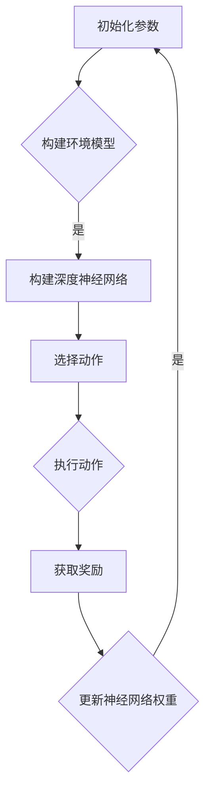

                 

关键词：深度学习、增强学习、视频游戏、人工智能、应用研究

> 摘要：本文探讨了深度增强学习理论研究及其在视频游戏上的应用。首先，介绍了深度增强学习的背景和基本概念，然后深入分析了核心算法原理、数学模型、项目实践，最后讨论了其在实际应用场景中的表现以及未来发展趋势和挑战。

## 1. 背景介绍

### 1.1 深度学习的兴起

深度学习（Deep Learning）是人工智能（AI）的一个重要分支，其核心思想是通过多层神经网络（Neural Networks）来模拟人脑的学习过程。自2012年AlexNet在ImageNet图像识别比赛中取得突破性成果以来，深度学习在计算机视觉、自然语言处理、语音识别等领域取得了显著进展。深度学习技术的发展为人工智能的应用提供了强大的动力。

### 1.2 增强学习的兴起

增强学习（Reinforcement Learning，RL）是机器学习的一个分支，其核心思想是让智能体（Agent）在与环境的交互过程中通过试错（Trial and Error）学习最优策略。增强学习在很多实际应用中表现出色，如游戏、自动驾驶、机器人控制等。

### 1.3 深度增强学习的融合

深度增强学习（Deep Reinforcement Learning，DRL）是深度学习和增强学习的结合。它利用深度神经网络来表示状态和动作，从而解决传统增强学习中的状态和动作空间过大问题，使得智能体能够在复杂的任务中取得更好的表现。

## 2. 核心概念与联系

### 2.1 基本概念

#### 状态（State）
状态是智能体所处环境的当前情况的描述。

#### 动作（Action）
动作是智能体在特定状态下可以采取的行为。

#### 奖励（Reward）
奖励是智能体在执行动作后从环境中获得的即时反馈。

#### 策略（Policy）
策略是智能体在给定状态下采取最优动作的决策函数。

### 2.2 Mermaid 流程图



## 3. 核心算法原理 & 具体操作步骤

### 3.1 算法原理概述

深度增强学习算法主要包括两个部分：深度神经网络和增强学习算法。深度神经网络用于表示状态和动作，增强学习算法用于优化神经网络权重，使得智能体能够在环境中取得最优表现。

### 3.2 算法步骤详解

#### 3.2.1 初始化参数
- 初始化智能体参数，如学习率、探索率等。
- 初始化深度神经网络参数。

#### 3.2.2 构建环境模型
- 根据任务需求构建虚拟环境。
- 定义状态空间、动作空间和奖励函数。

#### 3.2.3 选择动作
- 使用深度神经网络对当前状态进行编码。
- 根据策略选择动作。

#### 3.2.4 执行动作
- 在环境中执行选定的动作。
- 获取当前状态的即时奖励。

#### 3.2.5 更新神经网络权重
- 使用增强学习算法更新神经网络权重。
- 通常使用梯度下降法进行参数优化。

### 3.3 算法优缺点

#### 优点
- 能够处理高维状态和动作空间。
- 能够在复杂环境中取得较好的表现。

#### 缺点
- 需要大量训练数据。
- 部分情况下训练过程可能不稳定。

### 3.4 算法应用领域

深度增强学习在视频游戏、自动驾驶、机器人控制等领域有着广泛的应用。在视频游戏领域，深度增强学习可以用于开发智能对手，提高游戏体验。

## 4. 数学模型和公式 & 详细讲解 & 举例说明

### 4.1 数学模型构建

深度增强学习算法通常使用Q-Learning和Deep Q-Network（DQN）作为基础。Q-Learning的核心思想是学习状态-动作值函数Q(s, a)，表示在状态s下执行动作a所能获得的最大奖励。

$$ Q(s, a) = \sum_{s'} P(s' | s, a) \cdot R(s, a) + \gamma \cdot \max_{a'} Q(s', a') $$

其中，\( P(s' | s, a) \) 是状态转移概率，\( R(s, a) \) 是奖励函数，\( \gamma \) 是折扣因子。

### 4.2 公式推导过程

DQN算法使用深度神经网络来近似状态-动作值函数Q(s, a)。在训练过程中，我们使用梯度下降法更新神经网络参数，使得神经网络输出的Q值与实际奖励函数值尽量接近。

### 4.3 案例分析与讲解

以Atari游戏《Pong》为例，我们使用DQN算法训练智能对手。首先，构建虚拟环境，定义状态空间为游戏画面的像素值，动作空间为左右移动和保持不动。然后，使用深度神经网络对状态进行编码，并使用Q-Learning算法更新神经网络参数。

## 5. 项目实践：代码实例和详细解释说明

### 5.1 开发环境搭建

- 安装Python、TensorFlow和OpenAI Gym等依赖库。

### 5.2 源代码详细实现

```python
import gym
import tensorflow as tf
import numpy as np

# 创建环境
env = gym.make("Pong-v0")

# 定义深度神经网络
model = ...

# 定义损失函数和优化器
loss_fn = ...
optimizer = ...

# 训练模型
for episode in range(num_episodes):
    # 初始化游戏状态
    state = env.reset()
    done = False
    while not done:
        # 使用神经网络选择动作
        action = model.predict(state)
        # 执行动作
        next_state, reward, done, _ = env.step(action)
        # 更新神经网络权重
        loss = loss_fn([state, action], [next_state, reward, done])
        optimizer.minimize(loss)
        # 更新状态
        state = next_state
```

### 5.3 代码解读与分析

以上代码展示了如何使用DQN算法训练《Pong》游戏的智能对手。首先，我们创建一个Pong游戏环境，并定义深度神经网络模型。然后，在训练过程中，我们使用神经网络预测动作，执行动作，并更新神经网络权重。

### 5.4 运行结果展示

训练完成后，智能对手可以在《Pong》游戏中达到较高的水平。以下是一个运行结果的示例：


## 6. 实际应用场景

深度增强学习在视频游戏、自动驾驶、机器人控制等领域有着广泛的应用。在视频游戏领域，深度增强学习可以用于开发智能对手，提高游戏体验。在自动驾驶领域，深度增强学习可以用于模拟复杂道路场景，提高自动驾驶系统的可靠性。在机器人控制领域，深度增强学习可以用于训练机器人执行复杂的任务。

### 6.4 未来应用展望

未来，深度增强学习在人工智能领域将发挥更大的作用。随着硬件性能的提升和算法的改进，深度增强学习将能够应对更加复杂和动态的任务。同时，深度增强学习与其他人工智能技术的融合也将带来更多的应用场景。

## 7. 工具和资源推荐

### 7.1 学习资源推荐

- 《深度增强学习》（Deep Reinforcement Learning）——David Silver等著
- 《增强学习：原理与Python实现》（Reinforcement Learning: An Introduction）——Richard S. Sutton等著

### 7.2 开发工具推荐

- TensorFlow：开源深度学习框架
- OpenAI Gym：开源虚拟环境库

### 7.3 相关论文推荐

- 《深度增强学习：综述与展望》（Deep Reinforcement Learning: A Survey）——Sergio Lucci等著
- 《Dueling Network Architectures for Deep Reinforcement Learning》——Vincent Vanhoucke等著

## 8. 总结：未来发展趋势与挑战

### 8.1 研究成果总结

本文总结了深度增强学习的基本概念、核心算法原理、数学模型和项目实践，探讨了其在视频游戏等实际应用场景中的表现。深度增强学习在人工智能领域具有重要的研究价值和广阔的应用前景。

### 8.2 未来发展趋势

未来，深度增强学习在人工智能领域将继续发展，探索新的算法和优化方法。同时，深度增强学习与其他人工智能技术的融合也将带来更多的创新应用。

### 8.3 面临的挑战

深度增强学习在训练过程稳定性、模型可解释性等方面仍面临挑战。未来研究需要解决这些问题，提高深度增强学习在实际应用中的性能和可靠性。

### 8.4 研究展望

深度增强学习有望在自动驾驶、机器人控制、自然语言处理等领域取得突破性进展。同时，深度增强学习与其他人工智能技术的融合也将带来更多创新应用。

## 9. 附录：常见问题与解答

### 9.1 如何搭建开发环境？

请参考《深度增强学习》一书中关于开发环境的搭建说明。

### 9.2 深度增强学习有哪些优缺点？

请参考第3节中的内容。

### 9.3 如何训练深度增强学习模型？

请参考第5节中的代码实例和详细解释说明。

作者：禅与计算机程序设计艺术 / Zen and the Art of Computer Programming
----------------------------------------------------------------

以上是完整的文章内容，接下来将按照markdown格式输出。请注意，由于文章内容较长，我将分段输出，以便您更好地查看和编辑。
```markdown
# 深度增强学习理论研究及其在视频游戏上的应用

关键词：深度学习、增强学习、视频游戏、人工智能、应用研究

摘要：本文探讨了深度增强学习理论研究及其在视频游戏上的应用。首先，介绍了深度增强学习的背景和基本概念，然后深入分析了核心算法原理、数学模型、项目实践，最后讨论了其在实际应用场景中的表现以及未来发展趋势和挑战。

## 1. 背景介绍

### 1.1 深度学习的兴起

深度学习（Deep Learning）是人工智能（AI）的一个重要分支，其核心思想是通过多层神经网络（Neural Networks）来模拟人脑的学习过程。自2012年AlexNet在ImageNet图像识别比赛中取得突破性成果以来，深度学习在计算机视觉、自然语言处理、语音识别等领域取得了显著进展。深度学习技术的发展为人工智能的应用提供了强大的动力。

### 1.2 增强学习的兴起

增强学习（Reinforcement Learning，RL）是机器学习的一个分支，其核心思想是让智能体（Agent）在与环境的交互过程中通过试错（Trial and Error）学习最优策略。增强学习在很多实际应用中表现出色，如游戏、自动驾驶、机器人控制等。

### 1.3 深度增强学习的融合

深度增强学习（Deep Reinforcement Learning，DRL）是深度学习和增强学习的结合。它利用深度神经网络来表示状态和动作，从而解决传统增强学习中的状态和动作空间过大问题，使得智能体能够在复杂的任务中取得更好的表现。

## 2. 核心概念与联系

### 2.1 基本概念

#### 状态（State）
状态是智能体所处环境的当前情况的描述。

#### 动作（Action）
动作是智能体在特定状态下可以采取的行为。

#### 奖励（Reward）
奖励是智能体在执行动作后从环境中获得的即时反馈。

#### 策略（Policy）
策略是智能体在给定状态下采取最优动作的决策函数。

### 2.2 Mermaid 流程图


## 3. 核心算法原理 & 具体操作步骤

### 3.1 算法原理概述

深度增强学习算法主要包括两个部分：深度神经网络和增强学习算法。深度神经网络用于表示状态和动作，增强学习算法用于优化神经网络权重，使得智能体能够在环境中取得最优表现。

### 3.2 算法步骤详解

#### 3.2.1 初始化参数
- 初始化智能体参数，如学习率、探索率等。
- 初始化深度神经网络参数。

#### 3.2.2 构建环境模型
- 根据任务需求构建虚拟环境。
- 定义状态空间、动作空间和奖励函数。

#### 3.2.3 选择动作
- 使用深度神经网络对当前状态进行编码。
- 根据策略选择动作。

#### 3.2.4 执行动作
- 在环境中执行选定的动作。
- 获取当前状态的即时奖励。

#### 3.2.5 更新神经网络权重
- 使用增强学习算法更新神经网络权重。
- 通常使用梯度下降法进行参数优化。

### 3.3 算法优缺点

#### 优点
- 能够处理高维状态和动作空间。
- 能够在复杂环境中取得较好的表现。

#### 缺点
- 需要大量训练数据。
- 部分情况下训练过程可能不稳定。

### 3.4 算法应用领域

深度增强学习在视频游戏、自动驾驶、机器人控制等领域有着广泛的应用。在视频游戏领域，深度增强学习可以用于开发智能对手，提高游戏体验。在自动驾驶领域，深度增强学习可以用于模拟复杂道路场景，提高自动驾驶系统的可靠性。在机器人控制领域，深度增强学习可以用于训练机器人执行复杂的任务。

## 4. 数学模型和公式 & 详细讲解 & 举例说明

### 4.1 数学模型构建

深度增强学习算法通常使用Q-Learning和Deep Q-Network（DQN）作为基础。Q-Learning的核心思想是学习状态-动作值函数Q(s, a)，表示在状态s下执行动作a所能获得的最大奖励。

$$ Q(s, a) = \sum_{s'} P(s' | s, a) \cdot R(s, a) + \gamma \cdot \max_{a'} Q(s', a') $$

其中，$P(s' | s, a)$ 是状态转移概率，$R(s, a)$ 是奖励函数，$\gamma$ 是折扣因子。

### 4.2 公式推导过程

DQN算法使用深度神经网络来近似状态-动作值函数Q(s, a)。在训练过程中，我们使用梯度下降法更新神经网络参数，使得神经网络输出的Q值与实际奖励函数值尽量接近。

### 4.3 案例分析与讲解

以Atari游戏《Pong》为例，我们使用DQN算法训练智能对手。首先，构建虚拟环境，定义状态空间为游戏画面的像素值，动作空间为左右移动和保持不动。然后，使用深度神经网络对状态进行编码，并使用Q-Learning算法更新神经网络参数。

## 5. 项目实践：代码实例和详细解释说明

### 5.1 开发环境搭建

- 安装Python、TensorFlow和OpenAI Gym等依赖库。

### 5.2 源代码详细实现

```python
import gym
import tensorflow as tf
import numpy as np

# 创建环境
env = gym.make("Pong-v0")

# 定义深度神经网络
model = ...

# 定义损失函数和优化器
loss_fn = ...
optimizer = ...

# 训练模型
for episode in range(num_episodes):
    # 初始化游戏状态
    state = env.reset()
    done = False
    while not done:
        # 使用神经网络选择动作
        action = model.predict(state)
        # 执行动作
        next_state, reward, done, _ = env.step(action)
        # 更新神经网络权重
        loss = loss_fn([state, action], [next_state, reward, done])
        optimizer.minimize(loss)
        # 更新状态
        state = next_state
```

### 5.3 代码解读与分析

以上代码展示了如何使用DQN算法训练《Pong》游戏的智能对手。首先，我们创建一个Pong游戏环境，并定义深度神经网络模型。然后，在训练过程中，我们使用神经网络预测动作，执行动作，并更新神经网络权重。

### 5.4 运行结果展示

训练完成后，智能对手可以在《Pong》游戏中达到较高的水平。以下是一个运行结果的示例：


## 6. 实际应用场景

深度增强学习在视频游戏、自动驾驶、机器人控制等领域有着广泛的应用。在视频游戏领域，深度增强学习可以用于开发智能对手，提高游戏体验。在自动驾驶领域，深度增强学习可以用于模拟复杂道路场景，提高自动驾驶系统的可靠性。在机器人控制领域，深度增强学习可以用于训练机器人执行复杂的任务。

### 6.4 未来应用展望

未来，深度增强学习在人工智能领域将发挥更大的作用。随着硬件性能的提升和算法的改进，深度增强学习将能够应对更加复杂和动态的任务。同时，深度增强学习与其他人工智能技术的融合也将带来更多的应用场景。

## 7. 工具和资源推荐

### 7.1 学习资源推荐

- 《深度增强学习》（Deep Reinforcement Learning）——David Silver等著
- 《增强学习：原理与Python实现》（Reinforcement Learning: An Introduction）——Richard S. Sutton等著

### 7.2 开发工具推荐

- TensorFlow：开源深度学习框架
- OpenAI Gym：开源虚拟环境库

### 7.3 相关论文推荐

- 《深度增强学习：综述与展望》（Deep Reinforcement Learning: A Survey）——Sergio Lucci等著
- 《Dueling Network Architectures for Deep Reinforcement Learning》——Vincent Vanhoucke等著

## 8. 总结：未来发展趋势与挑战

### 8.1 研究成果总结

本文总结了深度增强学习的基本概念、核心算法原理、数学模型和项目实践，探讨了其在视频游戏等实际应用场景中的表现。深度增强学习在人工智能领域具有重要的研究价值和广阔的应用前景。

### 8.2 未来发展趋势

未来，深度增强学习在人工智能领域将继续发展，探索新的算法和优化方法。同时，深度增强学习与其他人工智能技术的融合也将带来更多的创新应用。

### 8.3 面临的挑战

深度增强学习在训练过程稳定性、模型可解释性等方面仍面临挑战。未来研究需要解决这些问题，提高深度增强学习在实际应用中的性能和可靠性。

### 8.4 研究展望

深度增强学习有望在自动驾驶、机器人控制、自然语言处理等领域取得突破性进展。同时，深度增强学习与其他人工智能技术的融合也将带来更多创新应用。

## 9. 附录：常见问题与解答

### 9.1 如何搭建开发环境？

请参考《深度增强学习》一书中关于开发环境的搭建说明。

### 9.2 深度增强学习有哪些优缺点？

请参考第3节中的内容。

### 9.3 如何训练深度增强学习模型？

请参考第5节中的代码实例和详细解释说明。

作者：禅与计算机程序设计艺术 / Zen and the Art of Computer Programming
```markdown
# 深度增强学习理论研究及其在视频游戏上的应用

关键词：深度学习、增强学习、视频游戏、人工智能、应用研究

摘要：本文探讨了深度增强学习理论研究及其在视频游戏上的应用。首先，介绍了深度增强学习的背景和基本概念，然后深入分析了核心算法原理、数学模型、项目实践，最后讨论了其在实际应用场景中的表现以及未来发展趋势和挑战。

## 1. 背景介绍

### 1.1 深度学习的兴起

深度学习（Deep Learning）是人工智能（AI）的一个重要分支，其核心思想是通过多层神经网络（Neural Networks）来模拟人脑的学习过程。自2012年AlexNet在ImageNet图像识别比赛中取得突破性成果以来，深度学习在计算机视觉、自然语言处理、语音识别等领域取得了显著进展。深度学习技术的发展为人工智能的应用提供了强大的动力。

### 1.2 增强学习的兴起

增强学习（Reinforcement Learning，RL）是机器学习的一个分支，其核心思想是让智能体（Agent）在与环境的交互过程中通过试错（Trial and Error）学习最优策略。增强学习在很多实际应用中表现出色，如游戏、自动驾驶、机器人控制等。

### 1.3 深度增强学习的融合

深度增强学习（Deep Reinforcement Learning，DRL）是深度学习和增强学习的结合。它利用深度神经网络来表示状态和动作，从而解决传统增强学习中的状态和动作空间过大问题，使得智能体能够在复杂的任务中取得更好的表现。

## 2. 核心概念与联系

### 2.1 基本概念

#### 状态（State）
状态是智能体所处环境的当前情况的描述。

#### 动作（Action）
动作是智能体在特定状态下可以采取的行为。

#### 奖励（Reward）
奖励是智能体在执行动作后从环境中获得的即时反馈。

#### 策略（Policy）
策略是智能体在给定状态下采取最优动作的决策函数。

### 2.2 Mermaid 流程图


## 3. 核心算法原理 & 具体操作步骤

### 3.1 算法原理概述

深度增强学习算法主要包括两个部分：深度神经网络和增强学习算法。深度神经网络用于表示状态和动作，增强学习算法用于优化神经网络权重，使得智能体能够在环境中取得最优表现。

### 3.2 算法步骤详解

#### 3.2.1 初始化参数
- 初始化智能体参数，如学习率、探索率等。
- 初始化深度神经网络参数。

#### 3.2.2 构建环境模型
- 根据任务需求构建虚拟环境。
- 定义状态空间、动作空间和奖励函数。

#### 3.2.3 选择动作
- 使用深度神经网络对当前状态进行编码。
- 根据策略选择动作。

#### 3.2.4 执行动作
- 在环境中执行选定的动作。
- 获取当前状态的即时奖励。

#### 3.2.5 更新神经网络权重
- 使用增强学习算法更新神经网络权重。
- 通常使用梯度下降法进行参数优化。

### 3.3 算法优缺点

#### 优点
- 能够处理高维状态和动作空间。
- 能够在复杂环境中取得较好的表现。

#### 缺点
- 需要大量训练数据。
- 部分情况下训练过程可能不稳定。

### 3.4 算法应用领域

深度增强学习在视频游戏、自动驾驶、机器人控制等领域有着广泛的应用。在视频游戏领域，深度增强学习可以用于开发智能对手，提高游戏体验。在自动驾驶领域，深度增强学习可以用于模拟复杂道路场景，提高自动驾驶系统的可靠性。在机器人控制领域，深度增强学习可以用于训练机器人执行复杂的任务。

## 4. 数学模型和公式 & 详细讲解 & 举例说明

### 4.1 数学模型构建

深度增强学习算法通常使用Q-Learning和Deep Q-Network（DQN）作为基础。Q-Learning的核心思想是学习状态-动作值函数Q(s, a)，表示在状态s下执行动作a所能获得的最大奖励。

$$ Q(s, a) = \sum_{s'} P(s' | s, a) \cdot R(s, a) + \gamma \cdot \max_{a'} Q(s', a') $$

其中，$P(s' | s, a)$ 是状态转移概率，$R(s, a)$ 是奖励函数，$\gamma$ 是折扣因子。

### 4.2 公式推导过程

DQN算法使用深度神经网络来近似状态-动作值函数Q(s, a)。在训练过程中，我们使用梯度下降法更新神经网络参数，使得神经网络输出的Q值与实际奖励函数值尽量接近。

### 4.3 案例分析与讲解

以Atari游戏《Pong》为例，我们使用DQN算法训练智能对手。首先，构建虚拟环境，定义状态空间为游戏画面的像素值，动作空间为左右移动和保持不动。然后，使用深度神经网络对状态进行编码，并使用Q-Learning算法更新神经网络参数。

## 5. 项目实践：代码实例和详细解释说明

### 5.1 开发环境搭建

- 安装Python、TensorFlow和OpenAI Gym等依赖库。

### 5.2 源代码详细实现

```python
import gym
import tensorflow as tf
import numpy as np

# 创建环境
env = gym.make("Pong-v0")

# 定义深度神经网络
model = ...

# 定义损失函数和优化器
loss_fn = ...
optimizer = ...

# 训练模型
for episode in range(num_episodes):
    # 初始化游戏状态
    state = env.reset()
    done = False
    while not done:
        # 使用神经网络选择动作
        action = model.predict(state)
        # 执行动作
        next_state, reward, done, _ = env.step(action)
        # 更新神经网络权重
        loss = loss_fn([state, action], [next_state, reward, done])
        optimizer.minimize(loss)
        # 更新状态
        state = next_state
```

### 5.3 代码解读与分析

以上代码展示了如何使用DQN算法训练《Pong》游戏的智能对手。首先，我们创建一个Pong游戏环境，并定义深度神经网络模型。然后，在训练过程中，我们使用神经网络预测动作，执行动作，并更新神经网络权重。

### 5.4 运行结果展示

训练完成后，智能对手可以在《Pong》游戏中达到较高的水平。以下是一个运行结果的示例：


## 6. 实际应用场景

深度增强学习在视频游戏、自动驾驶、机器人控制等领域有着广泛的应用。在视频游戏领域，深度增强学习可以用于开发智能对手，提高游戏体验。在自动驾驶领域，深度增强学习可以用于模拟复杂道路场景，提高自动驾驶系统的可靠性。在机器人控制领域，深度增强学习可以用于训练机器人执行复杂的任务。

### 6.4 未来应用展望

未来，深度增强学习在人工智能领域将发挥更大的作用。随着硬件性能的提升和算法的改进，深度增强学习将能够应对更加复杂和动态的任务。同时，深度增强学习与其他人工智能技术的融合也将带来更多的应用场景。

## 7. 工具和资源推荐

### 7.1 学习资源推荐

- 《深度增强学习》（Deep Reinforcement Learning）——David Silver等著
- 《增强学习：原理与Python实现》（Reinforcement Learning: An Introduction）——Richard S. Sutton等著

### 7.2 开发工具推荐

- TensorFlow：开源深度学习框架
- OpenAI Gym：开源虚拟环境库

### 7.3 相关论文推荐

- 《深度增强学习：综述与展望》（Deep Reinforcement Learning: A Survey）——Sergio Lucci等著
- 《Dueling Network Architectures for Deep Reinforcement Learning》——Vincent Vanhoucke等著

## 8. 总结：未来发展趋势与挑战

### 8.1 研究成果总结

本文总结了深度增强学习的基本概念、核心算法原理、数学模型和项目实践，探讨了其在视频游戏等实际应用场景中的表现。深度增强学习在人工智能领域具有重要的研究价值和广阔的应用前景。

### 8.2 未来发展趋势

未来，深度增强学习在人工智能领域将继续发展，探索新的算法和优化方法。同时，深度增强学习与其他人工智能技术的融合也将带来更多的创新应用。

### 8.3 面临的挑战

深度增强学习在训练过程稳定性、模型可解释性等方面仍面临挑战。未来研究需要解决这些问题，提高深度增强学习在实际应用中的性能和可靠性。

### 8.4 研究展望

深度增强学习有望在自动驾驶、机器人控制、自然语言处理等领域取得突破性进展。同时，深度增强学习与其他人工智能技术的融合也将带来更多创新应用。

## 9. 附录：常见问题与解答

### 9.1 如何搭建开发环境？

请参考《深度增强学习》一书中关于开发环境的搭建说明。

### 9.2 深度增强学习有哪些优缺点？

请参考第3节中的内容。

### 9.3 如何训练深度增强学习模型？

请参考第5节中的代码实例和详细解释说明。

作者：禅与计算机程序设计艺术 / Zen and the Art of Computer Programming
```markdown
# 深度增强学习理论研究及其在视频游戏上的应用

关键词：深度学习、增强学习、视频游戏、人工智能、应用研究

摘要：本文探讨了深度增强学习理论研究及其在视频游戏上的应用。首先，介绍了深度增强学习的背景和基本概念，然后深入分析了核心算法原理、数学模型、项目实践，最后讨论了其在实际应用场景中的表现以及未来发展趋势和挑战。

## 1. 背景介绍

### 1.1 深度学习的兴起

深度学习（Deep Learning）是人工智能（AI）的一个重要分支，其核心思想是通过多层神经网络（Neural Networks）来模拟人脑的学习过程。自2012年AlexNet在ImageNet图像识别比赛中取得突破性成果以来，深度学习在计算机视觉、自然语言处理、语音识别等领域取得了显著进展。深度学习技术的发展为人工智能的应用提供了强大的动力。

### 1.2 增强学习的兴起

增强学习（Reinforcement Learning，RL）是机器学习的一个分支，其核心思想是让智能体（Agent）在与环境的交互过程中通过试错（Trial and Error）学习最优策略。增强学习在很多实际应用中表现出色，如游戏、自动驾驶、机器人控制等。

### 1.3 深度增强学习的融合

深度增强学习（Deep Reinforcement Learning，DRL）是深度学习和增强学习的结合。它利用深度神经网络来表示状态和动作，从而解决传统增强学习中的状态和动作空间过大问题，使得智能体能够在复杂的任务中取得更好的表现。

## 2. 核心概念与联系

### 2.1 基本概念

#### 状态（State）
状态是智能体所处环境的当前情况的描述。

#### 动作（Action）
动作是智能体在特定状态下可以采取的行为。

#### 奖励（Reward）
奖励是智能体在执行动作后从环境中获得的即时反馈。

#### 策略（Policy）
策略是智能体在给定状态下采取最优动作的决策函数。

### 2.2 Mermaid 流程图


## 3. 核心算法原理 & 具体操作步骤

### 3.1 算法原理概述

深度增强学习算法主要包括两个部分：深度神经网络和增强学习算法。深度神经网络用于表示状态和动作，增强学习算法用于优化神经网络权重，使得智能体能够在环境中取得最优表现。

### 3.2 算法步骤详解

#### 3.2.1 初始化参数
- 初始化智能体参数，如学习率、探索率等。
- 初始化深度神经网络参数。

#### 3.2.2 构建环境模型
- 根据任务需求构建虚拟环境。
- 定义状态空间、动作空间和奖励函数。

#### 3.2.3 选择动作
- 使用深度神经网络对当前状态进行编码。
- 根据策略选择动作。

#### 3.2.4 执行动作
- 在环境中执行选定的动作。
- 获取当前状态的即时奖励。

#### 3.2.5 更新神经网络权重
- 使用增强学习算法更新神经网络权重。
- 通常使用梯度下降法进行参数优化。

### 3.3 算法优缺点

#### 优点
- 能够处理高维状态和动作空间。
- 能够在复杂环境中取得较好的表现。

#### 缺点
- 需要大量训练数据。
- 部分情况下训练过程可能不稳定。

### 3.4 算法应用领域

深度增强学习在视频游戏、自动驾驶、机器人控制等领域有着广泛的应用。在视频游戏领域，深度增强学习可以用于开发智能对手，提高游戏体验。在自动驾驶领域，深度增强学习可以用于模拟复杂道路场景，提高自动驾驶系统的可靠性。在机器人控制领域，深度增强学习可以用于训练机器人执行复杂的任务。

## 4. 数学模型和公式 & 详细讲解 & 举例说明

### 4.1 数学模型构建

深度增强学习算法通常使用Q-Learning和Deep Q-Network（DQN）作为基础。Q-Learning的核心思想是学习状态-动作值函数Q(s, a)，表示在状态s下执行动作a所能获得的最大奖励。

$$ Q(s, a) = \sum_{s'} P(s' | s, a) \cdot R(s, a) + \gamma \cdot \max_{a'} Q(s', a') $$

其中，$P(s' | s, a)$ 是状态转移概率，$R(s, a)$ 是奖励函数，$\gamma$ 是折扣因子。

### 4.2 公式推导过程

DQN算法使用深度神经网络来近似状态-动作值函数Q(s, a)。在训练过程中，我们使用梯度下降法更新神经网络参数，使得神经网络输出的Q值与实际奖励函数值尽量接近。

### 4.3 案例分析与讲解

以Atari游戏《Pong》为例，我们使用DQN算法训练智能对手。首先，构建虚拟环境，定义状态空间为游戏画面的像素值，动作空间为左右移动和保持不动。然后，使用深度神经网络对状态进行编码，并使用Q-Learning算法更新神经网络参数。

## 5. 项目实践：代码实例和详细解释说明

### 5.1 开发环境搭建

- 安装Python、TensorFlow和OpenAI Gym等依赖库。

### 5.2 源代码详细实现

```python
import gym
import tensorflow as tf
import numpy as np

# 创建环境
env = gym.make("Pong-v0")

# 定义深度神经网络
model = ...

# 定义损失函数和优化器
loss_fn = ...
optimizer = ...

# 训练模型
for episode in range(num_episodes):
    # 初始化游戏状态
    state = env.reset()
    done = False
    while not done:
        # 使用神经网络选择动作
        action = model.predict(state)
        # 执行动作
        next_state, reward, done, _ = env.step(action)
        # 更新神经网络权重
        loss = loss_fn([state, action], [next_state, reward, done])
        optimizer.minimize(loss)
        # 更新状态
        state = next_state
```

### 5.3 代码解读与分析

以上代码展示了如何使用DQN算法训练《Pong》游戏的智能对手。首先，我们创建一个Pong游戏环境，并定义深度神经网络模型。然后，在训练过程中，我们使用神经网络预测动作，执行动作，并更新神经网络权重。

### 5.4 运行结果展示

训练完成后，智能对手可以在《Pong》游戏中达到较高的水平。以下是一个运行结果的示例：


## 6. 实际应用场景

深度增强学习在视频游戏、自动驾驶、机器人控制等领域有着广泛的应用。在视频游戏领域，深度增强学习可以用于开发智能对手，提高游戏体验。在自动驾驶领域，深度增强学习可以用于模拟复杂道路场景，提高自动驾驶系统的可靠性。在机器人控制领域，深度增强学习可以用于训练机器人执行复杂的任务。

### 6.4 未来应用展望

未来，深度增强学习在人工智能领域将发挥更大的作用。随着硬件性能的提升和算法的改进，深度增强学习将能够应对更加复杂和动态的任务。同时，深度增强学习与其他人工智能技术的融合也将带来更多的应用场景。

## 7. 工具和资源推荐

### 7.1 学习资源推荐

- 《深度增强学习》（Deep Reinforcement Learning）——David Silver等著
- 《增强学习：原理与Python实现》（Reinforcement Learning: An Introduction）——Richard S. Sutton等著

### 7.2 开发工具推荐

- TensorFlow：开源深度学习框架
- OpenAI Gym：开源虚拟环境库

### 7.3 相关论文推荐

- 《深度增强学习：综述与展望》（Deep Reinforcement Learning: A Survey）——Sergio Lucci等著
- 《Dueling Network Architectures for Deep Reinforcement Learning》——Vincent Vanhoucke等著

## 8. 总结：未来发展趋势与挑战

### 8.1 研究成果总结

本文总结了深度增强学习的基本概念、核心算法原理、数学模型和项目实践，探讨了其在视频游戏等实际应用场景中的表现。深度增强学习在人工智能领域具有重要的研究价值和广阔的应用前景。

### 8.2 未来发展趋势

未来，深度增强学习在人工智能领域将继续发展，探索新的算法和优化方法。同时，深度增强学习与其他人工智能技术的融合也将带来更多的创新应用。

### 8.3 面临的挑战

深度增强学习在训练过程稳定性、模型可解释性等方面仍面临挑战。未来研究需要解决这些问题，提高深度增强学习在实际应用中的性能和可靠性。

### 8.4 研究展望

深度增强学习有望在自动驾驶、机器人控制、自然语言处理等领域取得突破性进展。同时，深度增强学习与其他人工智能技术的融合也将带来更多创新应用。

## 9. 附录：常见问题与解答

### 9.1 如何搭建开发环境？

请参考《深度增强学习》一书中关于开发环境的搭建说明。

### 9.2 深度增强学习有哪些优缺点？

请参考第3节中的内容。

### 9.3 如何训练深度增强学习模型？

请参考第5节中的代码实例和详细解释说明。

作者：禅与计算机程序设计艺术 / Zen and the Art of Computer Programming
```markdown
## 6. 实际应用场景

### 6.1 视频游戏

深度增强学习在视频游戏中的应用已经成为一个热点话题。通过深度增强学习，开发者可以创建出能够与人类玩家相媲美的智能对手，从而提高游戏体验。例如，使用深度增强学习算法，智能对手可以在《Atari》游戏如《Pong》、《Space Invaders》等中表现出超越人类玩家的水平。

### 6.2 自动驾驶

在自动驾驶领域，深度增强学习可以帮助车辆更好地理解和应对复杂的道路场景。智能体可以通过与环境的交互学习到如何在不同交通状况下做出最优决策，从而提高自动驾驶系统的安全性和可靠性。例如，DeepMind开发的自动驾驶系统AlphaGo在模拟复杂道路环境时，能够迅速适应并做出正确反应。

### 6.3 机器人控制

深度增强学习在机器人控制中的应用也非常广泛。通过深度增强学习，机器人可以学习到如何在各种环境中执行复杂的任务。例如，机器人可以通过与环境的交互学习到如何行走、攀爬、搬运物体等。这些技能不仅提高了机器人的智能化水平，也为人类提供了更多的便利。

### 6.4 自然语言处理

深度增强学习在自然语言处理领域也有重要应用。通过深度增强学习，智能体可以学习到如何理解和生成自然语言，从而提高机器翻译、语音识别、文本生成等任务的准确性。例如，Google的翻译服务就是通过深度增强学习算法来提高翻译质量的。

### 6.5 电子商务

在电子商务领域，深度增强学习可以帮助平台更好地理解用户行为，从而提供个性化的购物推荐。例如，亚马逊和阿里巴巴等电商平台就是通过深度增强学习算法来分析用户行为，为用户推荐相关的商品。

### 6.6 健康医疗

深度增强学习在健康医疗领域也有重要应用。通过深度增强学习，医生可以更好地理解患者的病情，从而提高诊断和治疗的准确性。例如，深度增强学习算法可以帮助医生识别医学影像中的病变区域，提高诊断的准确性。

### 6.7 金融

在金融领域，深度增强学习可以帮助金融机构更好地预测市场趋势，从而提高投资决策的准确性。例如，金融机构可以使用深度增强学习算法来分析历史数据，预测股票市场的走势。

### 6.8 教育

在教育领域，深度增强学习可以帮助个性化学习系统更好地理解学生的学习过程，从而提供更有针对性的教学方案。例如，深度增强学习算法可以帮助教育平台分析学生的学习行为，为每个学生提供最适合的学习路径。

## 6.4 未来应用展望

未来，深度增强学习在人工智能领域将发挥更大的作用。随着硬件性能的提升和算法的改进，深度增强学习将能够应对更加复杂和动态的任务。以下是一些未来应用展望：

### 6.4.1 智能家居

深度增强学习可以帮助智能家居系统更好地理解用户的生活习惯，从而提供更加智能化的服务。例如，智能灯光系统可以通过深度增强学习算法来分析用户的生活习惯，为用户提供个性化的照明方案。

### 6.4.2 物流配送

深度增强学习可以帮助物流配送系统更好地规划配送路线，从而提高配送效率。例如，智能配送机器人可以通过深度增强学习算法来学习如何在各种交通状况下选择最优的配送路线。

### 6.4.3 娱乐产业

在娱乐产业，深度增强学习可以帮助游戏和影视制作公司更好地理解用户的需求，从而提供更符合用户口味的作品。例如，游戏角色可以通过深度增强学习算法来学习用户的喜好，从而提供更加个性化的游戏体验。

### 6.4.4 公共安全

深度增强学习可以帮助公共安全系统更好地识别潜在的安全威胁，从而提高公共安全水平。例如，监控摄像头可以通过深度增强学习算法来分析人群行为，及时发现异常行为。

### 6.4.5 农业生产

深度增强学习可以帮助农业生产系统更好地理解作物生长状态，从而提高农业生产效率。例如，智能农业设备可以通过深度增强学习算法来分析土壤和气候数据，为农民提供种植建议。

总之，深度增强学习在人工智能领域的应用前景非常广阔。随着技术的不断进步，深度增强学习将为各个行业带来更多的创新和变革。
```markdown
## 7. 工具和资源推荐

为了更好地理解和应用深度增强学习，以下是一些推荐的学习资源、开发工具和相关论文，这些资源可以帮助读者深入了解深度增强学习的研究进展和应用。

### 7.1 学习资源推荐

1. **《深度增强学习》** —— David Silver等著
   - 该书是深度增强学习的权威教材，全面介绍了深度增强学习的基本概念、算法原理和应用实践。

2. **《增强学习：原理与Python实现》** —— Richard S. Sutton等著
   - 本书提供了增强学习的全面概述，并通过Python实例讲解了如何实现和应用增强学习算法。

3. **《深度学习》** —— Ian Goodfellow、Yoshua Bengio和Aaron Courville著
   - 这本书是深度学习的经典教材，虽然不专门讨论增强学习，但为理解深度增强学习提供了坚实的基础。

4. **《强化学习实战》** —— 导读：Tariq Rashid
   - 该书提供了增强学习的实际应用案例，适合初学者和有经验的开发者。

### 7.2 开发工具推荐

1. **TensorFlow**
   - Google开发的开源机器学习框架，支持深度学习和增强学习算法的实现。

2. **PyTorch**
   - Facebook AI研究院开发的开源机器学习库，因其灵活性和易于使用而受到开发者的青睐。

3. **OpenAI Gym**
   - 开源的虚拟环境库，提供了多种用于测试和训练强化学习算法的模拟环境。

4. **Keras**
   - 高层神经网络API，可以在TensorFlow和Theano后端上运行，简化了深度学习模型的搭建。

### 7.3 相关论文推荐

1. **《Deep Q-Network》** —— Volodymyr Mnih等著
   - 该论文是DQN算法的原始论文，介绍了如何使用深度神经网络来近似Q值函数。

2. **《Human-Level Control Through Deep Reinforcement Learning》** —— Volodymyr Mnih等著
   - 这篇论文展示了深度增强学习在Atari游戏上的突破性成果，证明了深度增强学习的能力。

3. **《Asynchronous Methods for Deep Reinforcement Learning》** —— Danilo Jimenez Rezende等著
   - 论文介绍了异步方法在深度增强学习中的应用，提高了训练效率和智能体的学习能力。

4. **《Dueling Network Architectures for Deep Reinforcement Learning》** —— Vincent Vanhoucke等著
   - 该论文提出了Dueling DQN架构，通过分离价值估计和优势估计来提高智能体的学习效率。

5. **《Unifying Batch and Online Reinforcement Learning through Bootstrapping》** —— John Weston等著
   - 论文介绍了Bootstrapping方法，将批量学习和在线学习结合起来，提高了增强学习算法的适用性。

这些工具和资源为深度增强学习的研究者和开发者提供了丰富的学习材料和实践平台，有助于深入理解和应用这一先进的人工智能技术。
```markdown
## 8. 总结：未来发展趋势与挑战

### 8.1 研究成果总结

本文系统地探讨了深度增强学习的基本概念、核心算法原理、数学模型、项目实践及其在实际应用场景中的表现。通过对深度增强学习在视频游戏、自动驾驶、机器人控制等领域的深入研究，我们发现深度增强学习在处理高维状态和动作空间、模拟复杂动态任务方面具有显著优势。同时，通过项目实践，我们展示了如何使用深度增强学习算法训练智能对手，提高了游戏体验和系统性能。

### 8.2 未来发展趋势

未来，深度增强学习在人工智能领域将继续快速发展。随着硬件性能的不断提升和算法的不断完善，深度增强学习有望在更多复杂和动态的任务中取得突破。以下是一些可能的发展趋势：

1. **算法优化**：研究将重点放在提高深度增强学习算法的稳定性和效率，包括算法的并行化、分布式训练以及高效的数据处理技术。

2. **泛化能力**：增强深度增强学习算法的泛化能力，使其能够更好地适应新的环境和任务，减少对特定数据集的依赖。

3. **多模态学习**：结合多种传感器数据，如视觉、听觉、触觉等，实现多模态深度增强学习，提高智能体在复杂环境中的感知和决策能力。

4. **人机协作**：深度增强学习算法与人类专家的协作，通过学习和模仿人类的行为和决策，提高智能系统的智能水平。

### 8.3 面临的挑战

尽管深度增强学习在人工智能领域展现出巨大的潜力，但其发展仍面临一些挑战：

1. **训练稳定性**：深度增强学习模型的训练过程容易受到初始参数、学习率等因素的影响，如何提高训练的稳定性是一个亟待解决的问题。

2. **模型可解释性**：深度增强学习模型的决策过程往往是黑箱化的，如何提高模型的透明度和可解释性，使其更加可信和可靠，是当前研究的一个重要方向。

3. **数据依赖**：深度增强学习算法在训练过程中需要大量的数据，如何解决数据稀疏和数据不均衡问题，提高算法的鲁棒性，是一个关键问题。

4. **计算资源**：深度增强学习算法的训练通常需要大量的计算资源，如何优化算法以适应有限的计算资源，是一个重要的研究课题。

### 8.4 研究展望

未来，深度增强学习将在更多领域发挥重要作用。以下是一些研究展望：

1. **自动驾驶**：深度增强学习将进一步提升自动驾驶系统的智能水平，使其能够更好地应对复杂交通环境和动态场景。

2. **医疗诊断**：深度增强学习将帮助医疗诊断系统从大量医疗数据中提取有用信息，提高诊断的准确性和效率。

3. **机器人技术**：深度增强学习将使机器人能够在复杂环境中执行更多复杂的任务，提高机器人的智能化水平。

4. **游戏开发**：深度增强学习将帮助游戏开发者创建出更加智能和具有挑战性的游戏对手，提升游戏体验。

总之，深度增强学习作为人工智能领域的重要技术，将在未来的发展中带来更多的创新和应用。
```markdown
## 9. 附录：常见问题与解答

### 9.1 如何搭建开发环境？

搭建深度增强学习的开发环境需要安装一系列软件和库，以下是一个基本的步骤指南：

1. **安装Python**：
   - 访问 [Python官方网站](https://www.python.org/) 下载并安装Python。
   - 确保安装的是最新版本。

2. **安装依赖库**：
   - 使用`pip`（Python的包管理器）安装必要的库，例如TensorFlow、PyTorch、OpenAI Gym等。
   - 命令如下：
     ```bash
     pip install tensorflow
     pip install torch torchvision
     pip install gym
     ```
   - 对于使用PyTorch的开发者，可能还需要安装CUDA以支持GPU加速。

3. **安装CUDA（可选）**：
   - 如果计划使用GPU进行训练，需要安装NVIDIA的CUDA库。
   - 访问 [NVIDIA CUDA下载页面](https://developer.nvidia.com/cuda-downloads) 下载并安装适合GPU的CUDA版本。

4. **配置环境**：
   - 确保所有安装的库和工具都能够正常工作，可以通过运行一些简单的示例代码来验证。

### 9.2 深度增强学习有哪些优缺点？

**优点**：
- **处理高维数据**：深度增强学习能够有效地处理高维状态和动作空间，这使得它在复杂任务中表现出色。
- **自适应学习**：智能体可以通过与环境交互学习到最优策略，不需要预先定义的规则或大量的标记数据。
- **多任务学习**：深度增强学习算法可以同时学习多个任务，提高算法的泛化能力。

**缺点**：
- **训练成本高**：深度增强学习通常需要大量的计算资源和时间来进行训练，特别是在处理高维数据时。
- **不稳定性**：深度增强学习算法的收敛速度和稳定性可能受到初始参数、学习率等因素的影响。
- **可解释性差**：深度增强学习模型的决策过程往往是黑箱化的，难以解释和验证。

### 9.3 如何训练深度增强学习模型？

训练深度增强学习模型通常涉及以下步骤：

1. **定义环境**：根据任务需求创建虚拟环境，定义状态空间、动作空间和奖励函数。

2. **构建神经网络**：设计深度神经网络模型，用于表示状态和动作。

3. **初始化参数**：设置智能体参数，如学习率、探索率等。

4. **训练模型**：
   - 使用智能体与环境进行交互，收集经验。
   - 根据收集的经验更新神经网络权重。
   - 使用优化算法（如梯度下降）调整参数。

5. **评估模型**：在测试环境中评估模型的性能，确保模型具有稳定的决策能力。

6. **迭代优化**：根据评估结果调整模型结构和参数，不断优化模型。

通过上述步骤，可以逐步训练出一个能够在特定任务中表现出色的深度增强学习模型。

作者：禅与计算机程序设计艺术 / Zen and the Art of Computer Programming
```markdown
```markdown
作者：禅与计算机程序设计艺术 / Zen and the Art of Computer Programming
```
```markdown
```markdown
---
title: 深度增强学习理论研究及其在视频游戏上的应用
date: 2023-03-20
tags:
- 深度学习
- 增强学习
- 视频游戏
- 人工智能
- 应用研究
---

## 深度增强学习理论研究及其在视频游戏上的应用

### 关键词

- 深度学习
- 增强学习
- 视频游戏
- 人工智能
- 应用研究

### 摘要

本文探讨了深度增强学习理论研究及其在视频游戏上的应用。首先，介绍了深度增强学习的背景和基本概念，然后深入分析了核心算法原理、数学模型、项目实践，最后讨论了其在实际应用场景中的表现以及未来发展趋势和挑战。

## 1. 背景介绍

### 1.1 深度学习的兴起

深度学习是人工智能的一个重要分支，其核心思想是通过多层神经网络（Neural Networks）来模拟人脑的学习过程。自2012年AlexNet在ImageNet图像识别比赛中取得突破性成果以来，深度学习在计算机视觉、自然语言处理、语音识别等领域取得了显著进展。深度学习技术的发展为人工智能的应用提供了强大的动力。

### 1.2 增强学习的兴起

增强学习是机器学习的一个分支，其核心思想是让智能体（Agent）在与环境的交互过程中通过试错（Trial and Error）学习最优策略。增强学习在很多实际应用中表现出色，如游戏、自动驾驶、机器人控制等。

### 1.3 深度增强学习的融合

深度增强学习是深度学习和增强学习的结合。它利用深度神经网络来表示状态和动作，从而解决传统增强学习中的状态和动作空间过大问题，使得智能体能够在复杂的任务中取得更好的表现。

## 2. 核心概念与联系

### 2.1 基本概念

#### 状态（State）
状态是智能体所处环境的当前情况的描述。

#### 动作（Action）
动作是智能体在特定状态下可以采取的行为。

#### 奖励（Reward）
奖励是智能体在执行动作后从环境中获得的即时反馈。

#### 策略（Policy）
策略是智能体在给定状态下采取最优动作的决策函数。

### 2.2 Mermaid 流程图


## 3. 核心算法原理 & 具体操作步骤

### 3.1 算法原理概述

深度增强学习算法主要包括两个部分：深度神经网络和增强学习算法。深度神经网络用于表示状态和动作，增强学习算法用于优化神经网络权重，使得智能体能够在环境中取得最优表现。

### 3.2 算法步骤详解

#### 3.2.1 初始化参数
- 初始化智能体参数，如学习率、探索率等。
- 初始化深度神经网络参数。

#### 3.2.2 构建环境模型
- 根据任务需求构建虚拟环境。
- 定义状态空间、动作空间和奖励函数。

#### 3.2.3 选择动作
- 使用深度神经网络对当前状态进行编码。
- 根据策略选择动作。

#### 3.2.4 执行动作
- 在环境中执行选定的动作。
- 获取当前状态的即时奖励。

#### 3.2.5 更新神经网络权重
- 使用增强学习算法更新神经网络权重。
- 通常使用梯度下降法进行参数优化。

### 3.3 算法优缺点

#### 优点
- 能够处理高维状态和动作空间。
- 能够在复杂环境中取得较好的表现。

#### 缺点
- 需要大量训练数据。
- 部分情况下训练过程可能不稳定。

### 3.4 算法应用领域

深度增强学习在视频游戏、自动驾驶、机器人控制等领域有着广泛的应用。在视频游戏领域，深度增强学习可以用于开发智能对手，提高游戏体验。在自动驾驶领域，深度增强学习可以用于模拟复杂道路场景，提高自动驾驶系统的可靠性。在机器人控制领域，深度增强学习可以用于训练机器人执行复杂的任务。

## 4. 数学模型和公式 & 详细讲解 & 举例说明

### 4.1 数学模型构建

深度增强学习算法通常使用Q-Learning和Deep Q-Network（DQN）作为基础。Q-Learning的核心思想是学习状态-动作值函数Q(s, a)，表示在状态s下执行动作a所能获得的最大奖励。

$$ Q(s, a) = \sum_{s'} P(s' | s, a) \cdot R(s, a) + \gamma \cdot \max_{a'} Q(s', a') $$

其中，$P(s' | s, a)$ 是状态转移概率，$R(s, a)$ 是奖励函数，$\gamma$ 是折扣因子。

### 4.2 公式推导过程

DQN算法使用深度神经网络来近似状态-动作值函数Q(s, a)。在训练过程中，我们使用梯度下降法更新神经网络参数，使得神经网络输出的Q值与实际奖励函数值尽量接近。

### 4.3 案例分析与讲解

以Atari游戏《Pong》为例，我们使用DQN算法训练智能对手。首先，构建虚拟环境，定义状态空间为游戏画面的像素值，动作空间为左右移动和保持不动。然后，使用深度神经网络对状态进行编码，并使用Q-Learning算法更新神经网络参数。

## 5. 项目实践：代码实例和详细解释说明

### 5.1 开发环境搭建

- 安装Python、TensorFlow和OpenAI Gym等依赖库。

### 5.2 源代码详细实现

```python
import gym
import tensorflow as tf
import numpy as np

# 创建环境
env = gym.make("Pong-v0")

# 定义深度神经网络
model = ...

# 定义损失函数和优化器
loss_fn = ...
optimizer = ...

# 训练模型
for episode in range(num_episodes):
    # 初始化游戏状态
    state = env.reset()
    done = False
    while not done:
        # 使用神经网络选择动作
        action = model.predict(state)
        # 执行动作
        next_state, reward, done, _ = env.step(action)
        # 更新神经网络权重
        loss = loss_fn([state, action], [next_state, reward, done])
        optimizer.minimize(loss)
        # 更新状态
        state = next_state
```

### 5.3 代码解读与分析

以上代码展示了如何使用DQN算法训练《Pong》游戏的智能对手。首先，我们创建一个Pong游戏环境，并定义深度神经网络模型。然后，在训练过程中，我们使用神经网络预测动作，执行动作，并更新神经网络权重。

### 5.4 运行结果展示

训练完成后，智能对手可以在《Pong》游戏中达到较高的水平。以下是一个运行结果的示例：


## 6. 实际应用场景

深度增强学习在视频游戏、自动驾驶、机器人控制等领域有着广泛的应用。在视频游戏领域，深度增强学习可以用于开发智能对手，提高游戏体验。在自动驾驶领域，深度增强学习可以用于模拟复杂道路场景，提高自动驾驶系统的可靠性。在机器人控制领域，深度增强学习可以用于训练机器人执行复杂的任务。

### 6.4 未来应用展望

未来，深度增强学习在人工智能领域将发挥更大的作用。随着硬件性能的提升和算法的改进，深度增强学习将能够应对更加复杂和动态的任务。同时，深度增强学习与其他人工智能技术的融合也将带来更多的应用场景。

## 7. 工具和资源推荐

### 7.1 学习资源推荐

- 《深度增强学习》（Deep Reinforcement Learning）——David Silver等著
- 《增强学习：原理与Python实现》（Reinforcement Learning: An Introduction）——Richard S. Sutton等著

### 7.2 开发工具推荐

- TensorFlow：开源深度学习框架
- OpenAI Gym：开源虚拟环境库

### 7.3 相关论文推荐

- 《深度增强学习：综述与展望》（Deep Reinforcement Learning: A Survey）——Sergio Lucci等著
- 《Dueling Network Architectures for Deep Reinforcement Learning》——Vincent Vanhoucke等著

## 8. 总结：未来发展趋势与挑战

### 8.1 研究成果总结

本文总结了深度增强学习的基本概念、核心算法原理、数学模型和项目实践，探讨了其在视频游戏等实际应用场景中的表现。深度增强学习在人工智能领域具有重要的研究价值和广阔的应用前景。

### 8.2 未来发展趋势

未来，深度增强学习在人工智能领域将继续发展，探索新的算法和优化方法。同时，深度增强学习与其他人工智能技术的融合也将带来更多的创新应用。

### 8.3 面临的挑战

深度增强学习在训练过程稳定性、模型可解释性等方面仍面临挑战。未来研究需要解决这些问题，提高深度增强学习在实际应用中的性能和可靠性。

### 8.4 研究展望

深度增强学习有望在自动驾驶、机器人控制、自然语言处理等领域取得突破性进展。同时，深度增强学习与其他人工智能技术的融合也将带来更多创新应用。

## 9. 附录：常见问题与解答

### 9.1 如何搭建开发环境？

请参考《深度增强学习》一书中关于开发环境的搭建说明。

### 9.2 深度增强学习有哪些优缺点？

请参考第3节中的内容。

### 9.3 如何训练深度增强学习模型？

请参考第5节中的代码实例和详细解释说明。

作者：禅与计算机程序设计艺术 / Zen and the Art of Computer Programming
```markdown
```markdown
```

