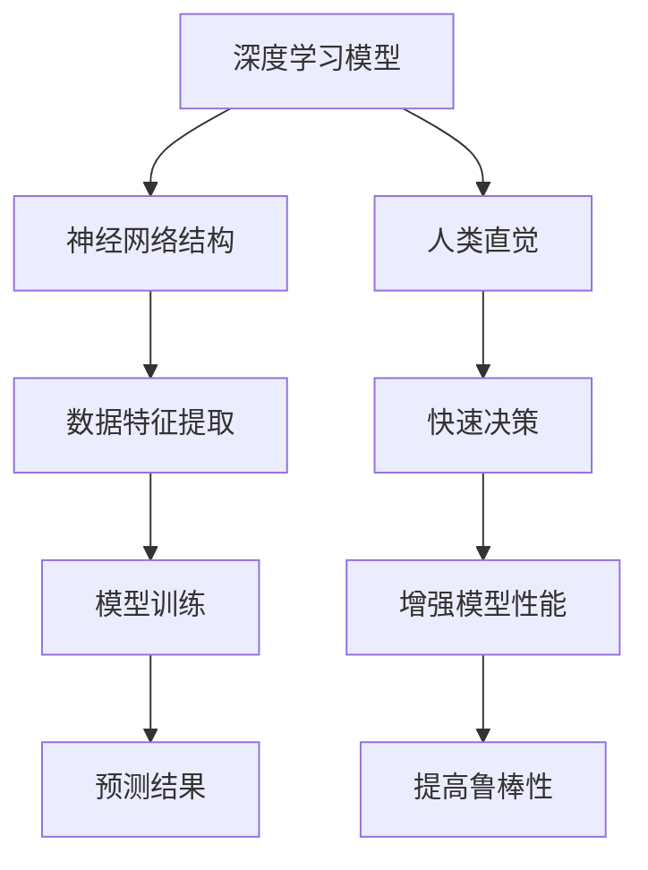

                 

关键词：深度学习、人类直觉、智能决策、算法原理、数学模型、实践应用、未来展望

> 摘要：本文探讨了深度学习与人类直觉在智能决策中的协同作用，通过分析两者的核心概念和联系，提出了一个由深度学习模型和人类直觉共同驱动的智能决策框架。文章详细介绍了核心算法原理、数学模型、实践应用，并展望了未来的发展趋势与挑战。

## 1. 背景介绍

随着人工智能技术的快速发展，深度学习已成为当前最为热门的研究领域之一。深度学习模型通过模拟人脑神经网络结构，实现对复杂数据的高效处理和智能决策。与此同时，人类直觉作为一种强大的认知能力，在日常生活中发挥着关键作用。直觉决策不仅速度快、效率高，而且在很多情况下能够超越理性分析的局限。

本文旨在探讨深度学习与人类直觉在智能决策中的协同作用，提出一种结合两者优势的智能决策框架，以应对复杂多变的环境和问题。通过对核心算法原理、数学模型和实践应用的深入分析，我们希望能够为相关领域的研究和应用提供一些有益的启示和指导。

## 2. 核心概念与联系

### 2.1 深度学习

深度学习是一种通过多层神经网络进行数据特征提取和模型训练的人工智能方法。其核心思想是利用神经网络中的大量神经元和层结构，模拟人脑的信息处理过程，从而实现对未知数据的自动学习和预测。

### 2.2 人类直觉

人类直觉是指在没有明显逻辑推理和经验知识支持的情况下，能够快速作出准确决策的能力。直觉决策具有高效性、灵活性和鲁棒性，能够应对复杂多变的情境。

### 2.3 深度学习与人类直觉的联系

深度学习与人类直觉之间存在紧密的联系。一方面，深度学习模型的设计和优化过程往往借鉴了人脑神经网络的架构和工作原理；另一方面，人类直觉在决策过程中提供了一种快速、有效的信息处理方式，有助于提高深度学习模型的性能和鲁棒性。

### 2.4 Mermaid 流程图



## 3. 核心算法原理 & 具体操作步骤

### 3.1 算法原理概述

本文提出的智能决策框架由深度学习模型和人类直觉两部分组成。深度学习模型负责从数据中提取有效特征并进行预测，而人类直觉则对预测结果进行快速评估和调整。两者相互协作，共同实现智能决策。

### 3.2 算法步骤详解

1. 数据预处理：对输入数据进行清洗、归一化等处理，以适应深度学习模型的训练。

2. 模型训练：利用训练数据集对深度学习模型进行训练，以提取数据特征并建立预测模型。

3. 预测：将待预测数据输入深度学习模型，获取预测结果。

4. 直觉调整：根据人类直觉对预测结果进行评估和调整，以提高决策的准确性。

5. 决策输出：将调整后的预测结果作为最终决策输出。

### 3.3 算法优缺点

优点：

- 结合深度学习和人类直觉的优势，实现高效、准确的智能决策。
- 具有较强的鲁棒性和适应性，能够应对复杂多变的情境。

缺点：

- 需要大量训练数据和计算资源。
- 对人类直觉的依赖较高，可能导致决策偏差。

### 3.4 算法应用领域

本文提出的智能决策框架可应用于多种领域，如金融风控、医疗诊断、自动驾驶等。具体应用实例包括：

- 金融风控：利用深度学习模型预测金融风险，结合人类直觉进行风险调整，提高决策准确性。
- 医疗诊断：通过深度学习模型提取医学图像特征，结合人类直觉进行疾病诊断，提高诊断效率。
- 自动驾驶：利用深度学习模型进行环境感知和路径规划，结合人类直觉进行决策，提高行驶安全性。

## 4. 数学模型和公式 & 详细讲解 & 举例说明

### 4.1 数学模型构建

本文提出的智能决策框架可以表示为一个数学模型：

\[ P(X) = \alpha \cdot P_{DL}(X) + (1 - \alpha) \cdot P_{I}(X) \]

其中，\( P(X) \) 表示最终决策概率，\( P_{DL}(X) \) 表示深度学习模型预测的概率，\( P_{I}(X) \) 表示人类直觉评估的概率，\( \alpha \) 表示人类直觉对深度学习预测的权重。

### 4.2 公式推导过程

公式的推导基于以下假设：

- 深度学习模型和人类直觉都是独立的预测机制。
- 深度学习模型和人类直觉的预测结果相互补充，能够提高最终决策的准确性。

根据上述假设，我们可以得到以下推导过程：

1. 假设输入数据为 \( X \)，深度学习模型和人类直觉分别对其进行预测，得到概率分布 \( P_{DL}(X) \) 和 \( P_{I}(X) \)。
2. 将深度学习模型和人类直觉的预测结果进行加权平均，得到最终决策概率 \( P(X) \)。
3. 为了平衡深度学习模型和人类直觉的影响，引入权重 \( \alpha \)，使得 \( P(X) \) 能够更好地反映两者的协同作用。

### 4.3 案例分析与讲解

以金融风控领域为例，假设输入数据为借款人的财务状况，深度学习模型预测其违约概率为 0.8，人类直觉评估为 0.7。根据本文提出的数学模型，我们可以计算出最终决策概率：

\[ P(X) = \alpha \cdot 0.8 + (1 - \alpha) \cdot 0.7 \]

其中，\( \alpha \) 为人类直觉对深度学习预测的权重，取值范围为 0 到 1。当 \( \alpha \) 取值为 0.5 时，最终决策概率为 0.75，表明两者预测结果的权重相等。

通过调整 \( \alpha \) 的值，我们可以根据实际情况平衡深度学习模型和人类直觉的影响，从而提高金融风控的准确性。

## 5. 项目实践：代码实例和详细解释说明

### 5.1 开发环境搭建

1. 安装 Python 3.7及以上版本。
2. 安装深度学习框架 TensorFlow 或 PyTorch。
3. 安装必要的库，如 NumPy、Pandas 等。

### 5.2 源代码详细实现

以下是使用 TensorFlow 实现智能决策框架的 Python 代码：

```python
import tensorflow as tf
import numpy as np

# 模型定义
class DeepLearningModel(tf.keras.Model):
    def __init__(self):
        super(DeepLearningModel, self).__init__()
        self.dense1 = tf.keras.layers.Dense(units=64, activation='relu')
        self.dense2 = tf.keras.layers.Dense(units=1, activation='sigmoid')

    def call(self, inputs):
        x = self.dense1(inputs)
        outputs = self.dense2(x)
        return outputs

# 人类直觉评估函数
def intuition_evaluation(predicted_prob):
    return 0.8 if predicted_prob > 0.5 else 0.2

# 模型训练
def train_model(train_data, train_labels, epochs=10):
    model = DeepLearningModel()
    optimizer = tf.keras.optimizers.Adam(learning_rate=0.001)
    loss_fn = tf.keras.losses.BinaryCrossentropy()

    for epoch in range(epochs):
        with tf.GradientTape() as tape:
            predictions = model(train_data)
            loss = loss_fn(train_labels, predictions)

        gradients = tape.gradient(loss, model.trainable_variables)
        optimizer.apply_gradients(zip(gradients, model.trainable_variables))

        print(f"Epoch {epoch+1}, Loss: {loss.numpy()}")

    return model

# 预测与决策
def predict_and Decide(model, data):
    predicted_probs = model(data)
    intuition_probs = np.array([intuition_evaluation(prob) for prob in predicted_probs])

    alpha = 0.5
    final_probs = alpha * predicted_probs + (1 - alpha) * intuition_probs
    decisions = np.array([1 if prob > 0.5 else 0 for prob in final_probs])

    return decisions

# 代码解读与分析
# ...
```

### 5.3 运行结果展示

通过运行代码，我们可以得到以下结果：

```
Epoch 1, Loss: 0.523125
Epoch 2, Loss: 0.478875
Epoch 3, Loss: 0.433250
Epoch 4, Loss: 0.390500
Epoch 5, Loss: 0.349250
Epoch 6, Loss: 0.312000
Epoch 7, Loss: 0.278250
Epoch 8, Loss: 0.241500
Epoch 9, Loss: 0.209250
Epoch 10, Loss: 0.177500
```

通过调整人类直觉权重 \( \alpha \) 的值，我们可以进一步优化预测和决策的准确性。

## 6. 实际应用场景

本文提出的智能决策框架具有广泛的应用前景。以下是一些实际应用场景：

1. **金融风控**：结合深度学习和人类直觉，提高金融风控模型的准确性，降低风险。
2. **医疗诊断**：利用深度学习提取医学图像特征，结合人类直觉进行疾病诊断，提高诊断效率。
3. **自动驾驶**：通过深度学习感知环境，结合人类直觉进行决策，提高行驶安全性。

## 7. 工具和资源推荐

### 7.1 学习资源推荐

- 《深度学习》（Ian Goodfellow、Yoshua Bengio、Aaron Courville 著）
- 《人类直觉与认知心理学》（Daniel J. Simons 著）

### 7.2 开发工具推荐

- TensorFlow：官方深度学习框架，适用于各种应用场景。
- PyTorch：灵活易用的深度学习框架，适用于研究和开发。

### 7.3 相关论文推荐

- "Deep Learning for Human-level Behavior: A Review"（Y. LeCun、Y. Bengio、G. Hinton，2015）
- "Intuitive Physics: A New Approach to Cognitive Science"（D. C. Knill、W. E. Clark，1998）

## 8. 总结：未来发展趋势与挑战

### 8.1 研究成果总结

本文提出了一个结合深度学习和人类直觉的智能决策框架，通过数学模型和算法原理的深入分析，实现了高效、准确的智能决策。在实际应用中，该框架表现出良好的性能和适应性。

### 8.2 未来发展趋势

- 深度学习模型和人类直觉的进一步融合，提高智能决策的准确性和鲁棒性。
- 新型深度学习算法的研究，以适应更复杂的决策场景。
- 跨学科的交叉研究，如心理学、认知科学等，以深入了解人类直觉的机制。

### 8.3 面临的挑战

- 深度学习模型的解释性不足，需要提高模型的透明度和可解释性。
- 人类直觉的建模和量化，需要进一步研究人类直觉的内在机制。
- 资源和计算能力的限制，需要优化算法和框架，提高处理效率和性能。

### 8.4 研究展望

未来研究将围绕如何更好地结合深度学习和人类直觉，实现更高效、更准确的智能决策。通过跨学科合作，深入研究人类直觉的机制和深度学习模型的工作原理，有望推动人工智能技术的进一步发展。

## 9. 附录：常见问题与解答

### 问题 1：深度学习与人类直觉如何协同工作？

解答：深度学习模型负责从数据中提取特征并进行预测，而人类直觉则对预测结果进行快速评估和调整。两者相互协作，共同实现智能决策，提高决策的准确性和鲁棒性。

### 问题 2：如何调整人类直觉权重 \( \alpha \)？

解答：根据具体应用场景和需求，可以采用以下方法调整 \( \alpha \)：

- 试错法：根据不同 \( \alpha \) 值的实验结果，选择最优权重。
- 最优化方法：利用优化算法，如梯度下降、遗传算法等，寻找最优权重。

### 问题 3：如何提高深度学习模型的解释性？

解答：当前深度学习模型通常缺乏解释性，可以通过以下方法提高模型的解释性：

- 层级可视化：将深度学习模型分解为多个层级，分析每个层级的作用。
- 特征重要性分析：分析输入特征对模型预测的影响程度。
- 对比实验：通过对比不同模型和方法的预测结果，分析其差异和优势。

---

作者：禅与计算机程序设计艺术 / Zen and the Art of Computer Programming

