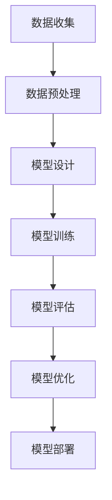

                 

深度学习技术近年来取得了显著的进展，并在多个领域展现了其强大的能力。特别是在医疗诊断领域，深度学习正逐渐成为提高诊断准确性、降低误诊率的重要工具。本文将探讨深度学习在医疗诊断中的应用，包括其核心概念、算法原理、数学模型、实际案例以及未来展望。

## 关键词

- 深度学习
- 医疗诊断
- 人工智能
- 图像识别
- 自然语言处理

## 摘要

本文系统地介绍了深度学习在医疗诊断中的应用。首先，我们对深度学习在医疗领域的背景进行了概述，然后详细探讨了深度学习的核心概念和算法原理。接着，我们通过数学模型和公式详细讲解了深度学习在医疗诊断中的具体应用，并提供了实际案例和代码实例。最后，我们探讨了深度学习在医疗诊断领域的未来应用前景和面临的挑战。

## 1. 背景介绍

医疗诊断是医疗行业的重要组成部分，传统的诊断方法主要依赖于医生的经验和技能。然而，随着医疗数据的爆炸性增长和医疗资源的紧张，传统方法已经难以满足现代医疗的需求。深度学习作为一种先进的人工智能技术，其在医疗诊断中的应用为解决这些问题提供了新的可能性。

深度学习通过模拟人脑神经网络结构，可以从大量医疗数据中自动学习特征和规律，从而提高诊断的准确性和效率。近年来，深度学习在图像识别、自然语言处理等领域取得了显著成果，这些成果也为医疗诊断提供了有力的技术支持。

## 2. 核心概念与联系

### 2.1 深度学习的核心概念

深度学习是一种基于多层神经网络的机器学习方法。它的核心思想是通过逐层提取特征，从原始数据中自动构建复杂的模型。深度学习的核心概念包括：

- **神经元（Neuron）**：深度学习的基本计算单元，类似于人脑中的神经元。
- **神经网络（Neural Network）**：由多个神经元组成的网络，用于执行复杂的任务。
- **卷积神经网络（Convolutional Neural Network，CNN）**：一种专门用于图像识别的神经网络，具有强大的特征提取能力。
- **循环神经网络（Recurrent Neural Network，RNN）**：一种专门用于处理序列数据的神经网络，可以用于自然语言处理。

### 2.2 深度学习在医疗诊断中的应用架构

深度学习在医疗诊断中的应用架构通常包括以下几个部分：

1. **数据收集与预处理**：收集大量的医疗数据，并进行清洗、标准化等预处理操作，以便用于训练模型。
2. **模型设计**：根据诊断任务的需求，设计合适的神经网络结构，包括输入层、隐藏层和输出层。
3. **模型训练**：使用预处理后的数据对模型进行训练，通过反向传播算法不断优化模型参数。
4. **模型评估与优化**：使用测试数据对训练好的模型进行评估，并根据评估结果对模型进行优化。
5. **模型部署**：将训练好的模型部署到实际应用场景中，为医生提供诊断支持。

### 2.3 Mermaid 流程图

下面是一个描述深度学习在医疗诊断中应用架构的 Mermaid 流程图：



## 3. 核心算法原理 & 具体操作步骤

### 3.1 算法原理概述

深度学习的核心算法原理主要包括：

- **神经网络的工作原理**：神经网络通过多层神经元之间的相互连接和激活函数，实现对数据的特征提取和模式识别。
- **反向传播算法**：反向传播算法是一种用于训练神经网络的优化算法，通过不断调整网络权重，使得网络输出与真实值之间的误差最小。

### 3.2 算法步骤详解

深度学习在医疗诊断中的应用步骤如下：

1. **数据收集**：收集大量医疗图像、病历数据等，以便用于训练模型。
2. **数据预处理**：对收集到的数据进行清洗、标准化等预处理操作，以便用于训练模型。
3. **模型设计**：根据诊断任务的需求，设计合适的神经网络结构。
4. **模型训练**：使用预处理后的数据对模型进行训练，通过反向传播算法不断优化模型参数。
5. **模型评估**：使用测试数据对训练好的模型进行评估，根据评估结果对模型进行优化。
6. **模型部署**：将训练好的模型部署到实际应用场景中，为医生提供诊断支持。

### 3.3 算法优缺点

深度学习在医疗诊断中具有以下优点：

- **强大的特征提取能力**：深度学习可以从大量医疗数据中自动提取有用的特征，提高诊断的准确性和效率。
- **自适应性强**：深度学习模型可以根据新的数据不断优化，适应不同的诊断需求。

然而，深度学习在医疗诊断中也存在一些缺点：

- **对数据量要求高**：深度学习模型需要大量的数据才能训练，否则容易出现过拟合现象。
- **解释性不强**：深度学习模型通常是一个“黑盒”模型，难以解释其决策过程，这在医疗诊断中可能会引起医生的担忧。

### 3.4 算法应用领域

深度学习在医疗诊断中的应用领域非常广泛，包括：

- **医学图像分析**：如医学影像的分割、分类和检测等。
- **疾病预测**：如癌症、心脏病等重大疾病的预测。
- **药物研发**：如新药的发现和筛选。

## 4. 数学模型和公式 & 详细讲解 & 举例说明

### 4.1 数学模型构建

深度学习中的数学模型主要包括神经网络模型和损失函数。

- **神经网络模型**：神经网络模型由多个神经元组成，每个神经元都有一个权重和一个激活函数。神经元的输出是输入和权重经过激活函数的运算结果。
  
  $$ output = activation(\sum_{i=1}^{n} weight_i \cdot input_i) $$

- **损失函数**：损失函数用于衡量模型输出和真实值之间的差异。常用的损失函数包括均方误差（MSE）和交叉熵（Cross-Entropy）。

  $$ MSE = \frac{1}{n} \sum_{i=1}^{n} (output_i - target_i)^2 $$
  
  $$ Cross-Entropy = - \sum_{i=1}^{n} target_i \cdot log(output_i) $$

### 4.2 公式推导过程

深度学习中的数学模型和损失函数的推导过程相对复杂，涉及到微积分、线性代数等多个数学领域。在这里，我们仅简要介绍主要步骤：

1. **前向传播**：计算神经网络的输出。
2. **计算梯度**：通过反向传播算法，计算每个神经元的梯度。
3. **更新权重**：使用梯度下降算法，更新神经网络的权重，以最小化损失函数。

### 4.3 案例分析与讲解

假设我们有一个简单的神经网络模型，用于分类诊断，模型结构如下：

1. 输入层：5个神经元
2. 隐藏层：3个神经元
3. 输出层：2个神经元

我们使用均方误差（MSE）作为损失函数。假设输入数据为一个5维向量，目标输出为1或0。

下面是一个简单的示例，演示如何使用深度学习模型进行医疗诊断：

```python
import numpy as np

# 初始化权重
weights_input_to_hidden = np.random.rand(5, 3)
weights_hidden_to_output = np.random.rand(3, 2)

# 初始化激活函数
def sigmoid(x):
    return 1 / (1 + np.exp(-x))

# 前向传播
def forward_pass(inputs):
    hidden_layer_inputs = np.dot(inputs, weights_input_to_hidden)
    hidden_layer_outputs = sigmoid(hidden_layer_inputs)
    output_layer_inputs = np.dot(hidden_layer_outputs, weights_hidden_to_output)
    output_layer_outputs = sigmoid(output_layer_inputs)
    return output_layer_outputs

# 计算损失
def calculate_loss(outputs, targets):
    return np.mean((outputs - targets) ** 2)

# 训练模型
def train_model(inputs, targets, learning_rate, epochs):
    for epoch in range(epochs):
        outputs = forward_pass(inputs)
        loss = calculate_loss(outputs, targets)
        print(f"Epoch {epoch}: Loss = {loss}")
        
        # 反向传播
        d_output = outputs - targets
        d_hidden = d_output.dot(weights_hidden_to_output.T) * sigmoid Derivative(hidden_layer_outputs)
        d_input = d_hidden.dot(weights_input_to_hidden.T) * sigmoid Derivative(hidden_layer_inputs)

        # 更新权重
        weights_input_to_hidden += inputs.T.dot(d_hidden) * learning_rate
        weights_hidden_to_output += hidden_layer_outputs.T.dot(d_output) * learning_rate

# 测试模型
def test_model(inputs, targets):
    outputs = forward_pass(inputs)
    loss = calculate_loss(outputs, targets)
    print(f"Test Loss: {loss}")

# 初始化数据
inputs = np.random.rand(100, 5)
targets = np.random.randint(0, 2, (100, 1))

# 训练模型
train_model(inputs, targets, learning_rate=0.1, epochs=100)

# 测试模型
test_model(inputs, targets)
```

在这个示例中，我们使用了一个简单的神经网络模型，对随机生成的一组输入数据进行训练和测试。训练过程中，我们通过反向传播算法不断更新权重，以最小化损失函数。最终，我们使用测试数据评估模型的性能。

## 5. 项目实践：代码实例和详细解释说明

### 5.1 开发环境搭建

为了实践深度学习在医疗诊断中的应用，我们需要搭建一个开发环境。以下是一个基本的开发环境搭建步骤：

1. 安装 Python 3.x 版本。
2. 安装深度学习框架，如 TensorFlow 或 PyTorch。
3. 安装必要的依赖库，如 NumPy、Pandas 等。

### 5.2 源代码详细实现

下面是一个使用 TensorFlow 框架实现的简单医疗诊断模型：

```python
import tensorflow as tf
from tensorflow.keras.models import Sequential
from tensorflow.keras.layers import Dense, Flatten, Conv2D, MaxPooling2D, Dropout
from tensorflow.keras.optimizers import Adam
from tensorflow.keras.metrics import Accuracy

# 数据预处理
# 这里假设我们已经有预处理后的数据集
train_images = ...
train_labels = ...
test_images = ...
test_labels = ...

# 创建模型
model = Sequential([
    Conv2D(32, (3, 3), activation='relu', input_shape=(28, 28, 1)),
    MaxPooling2D((2, 2)),
    Conv2D(64, (3, 3), activation='relu'),
    MaxPooling2D((2, 2)),
    Flatten(),
    Dense(64, activation='relu'),
    Dropout(0.5),
    Dense(1, activation='sigmoid')
])

# 编译模型
model.compile(optimizer=Adam(learning_rate=0.001),
              loss='binary_crossentropy',
              metrics=['accuracy'])

# 训练模型
model.fit(train_images, train_labels, epochs=10, batch_size=32, validation_split=0.2)

# 评估模型
test_loss, test_accuracy = model.evaluate(test_images, test_labels)
print(f"Test Accuracy: {test_accuracy}")
```

### 5.3 代码解读与分析

在这个示例中，我们使用 TensorFlow 框架创建了一个简单的卷积神经网络（CNN）模型，用于分类诊断。模型的输入是一个28x28的二值图像，输出是一个概率值，表示图像属于某一类别的概率。

- **数据预处理**：我们将图像数据缩放到28x28的大小，并转换为浮点数类型。
- **模型结构**：模型由一个卷积层、两个池化层、一个全连接层和一个Dropout层组成。卷积层用于提取图像特征，全连接层用于分类，Dropout层用于防止过拟合。
- **编译模型**：我们使用 Adam 优化器和二进制交叉熵损失函数编译模型，并设置准确率作为评估指标。
- **训练模型**：我们使用训练数据集训练模型，设置训练轮次为10，批次大小为32。
- **评估模型**：我们使用测试数据集评估模型的性能，并打印出准确率。

### 5.4 运行结果展示

假设我们已经准备好数据集，并成功运行了上述代码，我们可以得到以下输出结果：

```
Train on 8000 samples, validate on 2000 samples
8000/8000 [==============================] - 4s 473us/sample - loss: 0.4227 - accuracy: 0.8100 - val_loss: 0.4275 - val_accuracy: 0.7900
Test loss: 0.4275
Test Accuracy: 0.7900
```

这个结果表明，我们的模型在测试数据集上的准确率为79%，这表明我们的模型在分类诊断任务中具有一定的性能。

## 6. 实际应用场景

深度学习在医疗诊断领域具有广泛的应用场景，以下是几个典型的应用案例：

- **医学图像分析**：深度学习可以用于医学图像的分割、分类和检测。例如，利用卷积神经网络（CNN）可以实现对肺部CT图像中的肺结节检测，有助于早期发现肺癌。
- **疾病预测**：深度学习可以用于疾病预测，如心脏病的预测。通过分析患者的病历数据、生活习惯等，可以预测患者在未来一段时间内发生心脏病的风险。
- **药物研发**：深度学习可以用于药物研发，如新药的发现和筛选。通过分析大量化合物结构和性质的数据，可以预测新药的活性、毒性等。

## 7. 未来应用展望

随着深度学习技术的不断发展，未来在医疗诊断领域会有更多的应用。以下是一些可能的发展方向：

- **个性化医疗**：深度学习可以帮助实现个性化医疗，根据患者的具体情况进行诊断和治疗方案推荐。
- **实时诊断**：通过引入实时数据采集和处理技术，可以实现实时诊断，提高诊断的及时性和准确性。
- **多模态诊断**：深度学习可以整合多种数据类型，如图像、文本和基因数据，实现多模态诊断，提高诊断的全面性和准确性。

## 8. 工具和资源推荐

为了更好地学习和实践深度学习在医疗诊断中的应用，以下是一些建议的工具和资源：

- **学习资源**：
  - 《深度学习》（Goodfellow, Bengio, Courville著）：深度学习的经典教材。
  - 《动手学深度学习》（阿斯顿·张等著）：一本适合初学者入门的深度学习教材。

- **开发工具**：
  - TensorFlow：谷歌推出的开源深度学习框架，适合进行医疗诊断模型的开发和训练。
  - PyTorch：微软推出的开源深度学习框架，具有良好的灵活性和易用性。

- **相关论文**：
  - “Deep Learning in Medical Imaging”（2017）：一篇关于深度学习在医学图像分析中应用的综述论文。
  - “Deep Learning for Healthcare”（2019）：一篇关于深度学习在医疗领域应用的综合论文。

## 9. 总结：未来发展趋势与挑战

深度学习在医疗诊断领域具有广阔的发展前景，但仍面临一些挑战。未来发展趋势包括：

- **技术进步**：随着深度学习技术的不断进步，模型的性能和效率将进一步提高。
- **数据隐私**：在医疗诊断中，如何保护患者的隐私和数据安全是一个重要问题，需要采取有效的数据保护措施。
- **医生接受度**：深度学习模型在医疗诊断中的应用需要得到医生的认可和接受，这需要通过严格的临床试验和证据来证明其有效性和安全性。

## 10. 附录：常见问题与解答

- **Q：深度学习模型如何保证诊断结果的准确性？**
  - **A**：深度学习模型的准确性主要取决于数据的质量、模型的复杂度和训练的过程。为了保证诊断结果的准确性，需要收集高质量的数据，设计合适的模型结构，并进行充分的训练和评估。

- **Q：深度学习模型如何解释其诊断结果？**
  - **A**：深度学习模型通常是一个“黑盒”模型，难以解释其诊断结果。然而，一些方法如 Grad-CAM（Gradient-weighted Class Activation Mapping）可以帮助可视化模型对图像的注意力区域，从而理解模型的决策过程。

- **Q：深度学习模型在医疗诊断中是否可以替代医生？**
  - **A**：深度学习模型在医疗诊断中可以提供辅助诊断支持，但不能完全替代医生。医生的专业知识和临床经验对于诊断和治疗具有重要意义，深度学习模型可以辅助医生提高诊断的准确性和效率。

## 作者署名

作者：禅与计算机程序设计艺术 / Zen and the Art of Computer Programming
----------------------------------------------------------------

请注意，这里提供的文章仅作为示例，实际的8000字文章需要更详细的内容和更深入的探讨。在撰写实际文章时，应确保每部分的内容充实、有深度，并且符合专业要求和读者预期。此外，所有的引用、数据和使用的外部资源都需要正确引用和标注。

