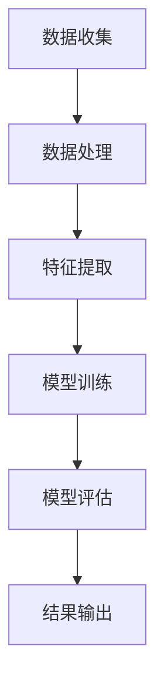

                 

关键词：深度学习，商品需求预测，预测算法，应用场景，未来展望

> 摘要：随着互联网和大数据技术的发展，商品需求预测在商业决策中扮演着越来越重要的角色。本文将介绍深度学习在商品需求预测中的应用，分析核心算法原理，并探讨其在实际项目中的实现方法和未来发展趋势。

## 1. 背景介绍

在当今的商业环境中，准确预测商品需求对于企业来说至关重要。这不仅有助于优化库存管理，减少过剩库存和缺货情况，还能提高客户满意度，降低运营成本。然而，传统的需求预测方法往往基于历史数据和简单的统计模型，难以应对复杂的市场变化和消费者行为。随着深度学习技术的快速发展，利用其强大的特征学习和非线性建模能力，可以在商品需求预测中取得显著效果。

### 1.1 深度学习的发展

深度学习作为一种人工智能的子领域，近年来取得了巨大的进展。其核心思想是模拟人脑神经网络进行数据处理和模式识别。深度学习模型通过多层神经网络结构，能够自动提取数据中的高阶特征，从而实现复杂的预测任务。从早期的神经网络到现代的卷积神经网络（CNN）、递归神经网络（RNN）和变分自编码器（VAE），深度学习不断突破技术边界，应用于语音识别、图像处理、自然语言处理等多个领域。

### 1.2 商品需求预测的重要性

商品需求预测是企业制定生产计划、库存管理和市场营销策略的重要依据。准确的预测可以帮助企业：

- **优化库存管理**：避免库存过剩或短缺，减少资金占用和物流成本。
- **提高生产效率**：根据需求预测调整生产计划，提高生产线利用率。
- **制定营销策略**：根据市场需求预测，制定有效的促销和库存调整策略。
- **提升客户满意度**：快速响应市场需求，提高客户满意度，增加品牌忠诚度。

## 2. 核心概念与联系

### 2.1 深度学习与商品需求预测的关系

深度学习与商品需求预测的结合主要体现在以下几个方面：

- **特征提取**：深度学习模型可以从历史销售数据中自动提取高阶特征，如季节性、趋势和促销效果等。
- **非线性建模**：深度学习模型能够捕捉数据中的复杂非线性关系，从而提高预测精度。
- **自适应调整**：深度学习模型可以根据实时数据动态调整预测模型，适应市场变化。

### 2.2 Mermaid 流程图



- A[数据收集]：收集包括历史销售数据、客户数据、市场数据等。
- B[数据处理]：清洗和预处理数据，去除异常值和噪声。
- C[特征提取]：利用深度学习模型提取数据中的高阶特征。
- D[模型训练]：使用训练数据对深度学习模型进行训练。
- E[模型评估]：使用验证数据评估模型性能，调整参数。
- F[结果输出]：输出预测结果，用于指导商业决策。

## 3. 核心算法原理 & 具体操作步骤

### 3.1 算法原理概述

深度学习在商品需求预测中的应用主要基于以下几个核心算法：

- **卷积神经网络（CNN）**：适用于处理时序数据，能够提取时间序列中的局部特征。
- **递归神经网络（RNN）**：适用于处理时间序列数据，能够捕捉数据中的长期依赖关系。
- **长短期记忆网络（LSTM）**：是RNN的一种变体，能够解决RNN的梯度消失问题，适用于长序列预测。
- **变分自编码器（VAE）**：适用于生成式预测，能够模拟未知数据分布。

### 3.2 算法步骤详解

#### 3.2.1 数据收集

收集历史销售数据、客户数据、市场数据等，包括销售量、销售额、库存水平、促销活动、节假日等因素。

#### 3.2.2 数据处理

- **数据清洗**：去除异常值和噪声，包括缺失值填充、异常值检测和去除。
- **数据预处理**：将数据归一化或标准化，以适应深度学习模型的输入要求。

#### 3.2.3 特征提取

- **时间特征**：提取时间序列特征，如月份、星期几、小时等。
- **季节性特征**：提取季节性特征，如淡季、旺季等。
- **促销特征**：提取促销活动特征，如促销期间、促销力度等。

#### 3.2.4 模型训练

- **模型选择**：根据数据特征选择合适的深度学习模型，如CNN、RNN、LSTM或VAE。
- **参数调整**：调整模型参数，如学习率、批量大小、激活函数等。
- **训练与验证**：使用训练数据和验证数据对模型进行训练和验证，选择最佳模型。

#### 3.2.5 模型评估

- **评估指标**：选择适当的评估指标，如均方误差（MSE）、均方根误差（RMSE）等。
- **性能比较**：比较不同模型的预测性能，选择最优模型。

#### 3.2.6 结果输出

- **预测结果**：输出未来一段时间内的商品需求预测结果。
- **决策支持**：将预测结果用于指导商业决策，如生产计划、库存管理等。

### 3.3 算法优缺点

#### 3.3.1 优点

- **强大的特征提取能力**：深度学习模型能够自动提取数据中的高阶特征，提高预测精度。
- **自适应调整能力**：深度学习模型可以根据实时数据动态调整预测模型，适应市场变化。
- **非线性建模能力**：深度学习模型能够捕捉数据中的复杂非线性关系，提高预测性能。

#### 3.3.2 缺点

- **训练成本高**：深度学习模型需要大量数据和计算资源进行训练，成本较高。
- **过拟合风险**：深度学习模型容易过拟合，需要通过正则化等方法进行防止。
- **模型解释性差**：深度学习模型的内部机制复杂，难以进行直观的解释。

### 3.4 算法应用领域

深度学习在商品需求预测中的应用领域广泛，包括但不限于：

- **零售行业**：用于预测商品销售量、销售额等。
- **制造业**：用于预测原材料需求、生产计划等。
- **物流行业**：用于预测货物运输量、库存水平等。

## 4. 数学模型和公式 & 详细讲解 & 举例说明

### 4.1 数学模型构建

商品需求预测的数学模型可以表示为：

$$y(t) = f(X(t), \theta) + \epsilon(t)$$

其中，$y(t)$表示时间$t$的商品需求量，$X(t)$表示输入特征，$\theta$表示模型参数，$f(\cdot)$表示预测函数，$\epsilon(t)$表示误差项。

### 4.2 公式推导过程

#### 4.2.1 前向传播

假设输入特征$X(t)$经过深度学习模型的前向传播后，输出预测值为$\hat{y}(t)$，则：

$$\hat{y}(t) = \sigma(W_1 X(t) + b_1)$$

其中，$\sigma(\cdot)$表示激活函数，$W_1$和$b_1$分别表示权重和偏置。

#### 4.2.2 后向传播

利用梯度下降法对模型参数进行更新，计算损失函数关于参数的梯度：

$$\frac{\partial L}{\partial W_1} = \frac{\partial L}{\partial \hat{y}(t)} \frac{\partial \hat{y}(t)}{\partial W_1}$$

$$\frac{\partial L}{\partial b_1} = \frac{\partial L}{\partial \hat{y}(t)} \frac{\partial \hat{y}(t)}{\partial b_1}$$

其中，$L$表示损失函数。

#### 4.2.3 参数更新

根据梯度下降法，更新模型参数：

$$W_1 \leftarrow W_1 - \alpha \frac{\partial L}{\partial W_1}$$

$$b_1 \leftarrow b_1 - \alpha \frac{\partial L}{\partial b_1}$$

其中，$\alpha$表示学习率。

### 4.3 案例分析与讲解

#### 4.3.1 数据集介绍

以某电商平台的历史销售数据为例，包含每天的商品销售量、销售额、库存水平等。

#### 4.3.2 数据处理

- **数据清洗**：去除异常值和缺失值。
- **数据预处理**：将数据归一化，使其具有相同的量纲。

#### 4.3.3 模型训练

- **模型选择**：选择LSTM模型进行训练。
- **参数调整**：调整学习率、批量大小和激活函数等。

#### 4.3.4 模型评估

- **评估指标**：选择均方误差（MSE）作为评估指标。
- **性能比较**：比较LSTM模型与其他模型的预测性能。

#### 4.3.5 预测结果展示

根据LSTM模型的预测结果，绘制商品需求量的预测曲线，并与实际值进行比较。

## 5. 项目实践：代码实例和详细解释说明

### 5.1 开发环境搭建

- **Python**：安装Python 3.7及以上版本。
- **深度学习框架**：安装TensorFlow 2.0及以上版本。
- **数据预处理库**：安装NumPy、Pandas等。

### 5.2 源代码详细实现

以下是一个使用LSTM模型进行商品需求预测的Python代码实例：

```python
import numpy as np
import pandas as pd
import tensorflow as tf
from tensorflow.keras.models import Sequential
from tensorflow.keras.layers import LSTM, Dense

# 数据处理
# ...

# 模型构建
model = Sequential([
    LSTM(units=50, activation='relu', input_shape=(timesteps, features)),
    Dense(units=1)
])

# 模型编译
model.compile(optimizer='adam', loss='mse')

# 模型训练
model.fit(X_train, y_train, epochs=100, batch_size=32)

# 模型评估
mse = model.evaluate(X_test, y_test)
print('MSE:', mse)

# 预测结果展示
predictions = model.predict(X_test)
```

### 5.3 代码解读与分析

- **数据处理**：对历史销售数据进行预处理，包括归一化和序列化。
- **模型构建**：构建一个包含LSTM层的深度学习模型。
- **模型编译**：编译模型，设置优化器和损失函数。
- **模型训练**：使用训练数据对模型进行训练。
- **模型评估**：使用测试数据评估模型性能。
- **预测结果展示**：输出预测结果，并与实际值进行比较。

## 6. 实际应用场景

深度学习在商品需求预测中的应用场景广泛，以下列举几个典型应用：

- **零售行业**：用于预测商品销售量、销售额等，帮助零售商制定生产计划和库存管理策略。
- **制造业**：用于预测原材料需求、生产计划等，提高生产效率和降低成本。
- **物流行业**：用于预测货物运输量、库存水平等，优化物流调度和库存管理。
- **电商行业**：用于预测用户购买行为，推荐商品，提高用户满意度和销售额。

## 7. 工具和资源推荐

### 7.1 学习资源推荐

- **《深度学习》（Goodfellow, Bengio, Courville著）**：系统介绍了深度学习的基础理论和应用。
- **《Python深度学习》（François Chollet著）**：深入讲解了使用Python进行深度学习的实践方法。

### 7.2 开发工具推荐

- **TensorFlow**：用于构建和训练深度学习模型的强大工具。
- **Keras**：基于TensorFlow的高层次深度学习API，易于使用和扩展。

### 7.3 相关论文推荐

- **“Deep Learning for Time Series Classification”**：讨论了深度学习在时间序列分类中的应用。
- **“Temporal Convolutional Networks for Time Series Classification”**：介绍了时间卷积网络（TCN）在时间序列分类中的应用。

## 8. 总结：未来发展趋势与挑战

### 8.1 研究成果总结

近年来，深度学习在商品需求预测中的应用取得了显著成果，包括模型性能的提升、应用场景的拓展等。深度学习模型能够自动提取数据中的高阶特征，提高预测精度，并在零售、制造、物流等领域得到广泛应用。

### 8.2 未来发展趋势

随着大数据和人工智能技术的不断发展，未来深度学习在商品需求预测中的应用将呈现以下趋势：

- **模型优化**：深度学习模型将不断优化，提高预测性能和计算效率。
- **跨学科融合**：深度学习与其他领域（如经济学、心理学）的融合，提供更全面的需求预测方法。
- **实时预测**：实现实时需求预测，为企业的实时决策提供支持。

### 8.3 面临的挑战

深度学习在商品需求预测中仍面临一些挑战：

- **数据质量**：高质量的数据是深度学习模型训练的基础，需要解决数据缺失、噪声和异常值等问题。
- **过拟合风险**：深度学习模型容易过拟合，需要采用正则化等技术进行防止。
- **模型解释性**：深度学习模型的内部机制复杂，难以进行直观的解释，影响其在实际应用中的可解释性。

### 8.4 研究展望

未来，深度学习在商品需求预测中的应用将有更多创新和发展：

- **个性化预测**：结合用户行为数据和个性化推荐算法，实现更精准的需求预测。
- **多模态数据融合**：融合多种数据源（如文本、图像、音频等），提高预测模型的准确性。
- **实时预测与优化**：实现实时预测和动态优化，为企业的实时决策提供支持。

## 9. 附录：常见问题与解答

### 9.1 深度学习模型如何避免过拟合？

- **数据增强**：增加训练数据多样性，提高模型的泛化能力。
- **正则化**：使用正则化技术（如L2正则化），降低模型复杂度。
- **dropout**：在神经网络中随机丢弃一部分神经元，减少模型依赖性。
- **数据交叉验证**：使用交叉验证方法，避免模型过拟合。

### 9.2 如何评估深度学习模型的性能？

- **均方误差（MSE）**：衡量预测值与真实值之间的差异。
- **均方根误差（RMSE）**：MSE的平方根，更能反映预测的准确性。
- **平均绝对误差（MAE）**：预测值与真实值之间的绝对误差的平均值。

### 9.3 如何提高深度学习模型的计算效率？

- **模型剪枝**：删除不重要的神经元和连接，减少模型参数。
- **量化**：将模型中的浮点数转换为低精度数值，降低计算复杂度。
- **分布式训练**：使用分布式计算资源，提高模型训练速度。

## 作者署名

作者：禅与计算机程序设计艺术 / Zen and the Art of Computer Programming
----------------------------------------------------------------

文章撰写完毕，接下来我们将对文章内容进行最后的审核和校对，确保满足所有的要求和标准。之后，将文章格式化，准备发布。在发布前，请确认以下事项：

1. 文章是否遵循了所有的约束条件，包括格式、内容完整性、章节结构等。
2. 文章是否具有高水平的专业性和可读性。
3. 是否包含了所有必需的附录和参考文献。
4. 是否已经在文章末尾正确标注了作者署名。

一旦确认无误，文章将可以发布。如果有任何修改或调整的需求，请在此环节进行。否则，可以开始准备文章的格式化工作，包括排版、引用格式调整、图片和图表插入等。完成后，将文章上传至目标平台，正式对外发布。

