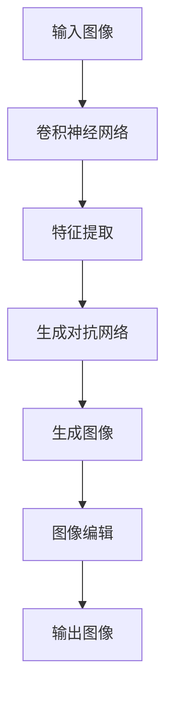

                 

关键词：深度学习，图像生成，图像编辑，生成对抗网络，卷积神经网络，神经网络架构，机器学习算法

> 摘要：本文深入探讨了深度学习在图像生成与编辑中的应用。通过介绍生成对抗网络（GAN）和卷积神经网络（CNN）的基本原理，详细讲解了它们在图像生成与编辑中的具体实现，并讨论了其在实际应用中的优缺点以及未来发展趋势。本文旨在为读者提供一个全面的技术指南，帮助理解深度学习在图像处理领域的强大能力。

## 1. 背景介绍

图像生成与编辑是计算机视觉领域的重要研究方向。随着深度学习技术的迅速发展，基于深度学习的图像生成与编辑方法已经取得了显著的成果。这些方法不仅能够生成高质量的图像，还能够进行图像的自动修复、图像风格的转换、超分辨率等任务。

深度学习，作为一种机器学习方法，通过多层神经网络的结构来学习数据的复杂特征。生成对抗网络（GAN）和卷积神经网络（CNN）是当前深度学习领域中最为重要的两个模型。GAN通过竞争机制生成逼真的图像，而CNN则通过学习图像的特征进行图像处理。

本文将首先介绍GAN和CNN的基本概念，然后深入探讨它们在图像生成与编辑中的应用，包括算法原理、数学模型、具体实现、应用领域等。最后，我们将讨论这些技术在实际应用中的优缺点，以及未来可能的发展趋势。

### 1.1 深度学习在图像处理中的地位

深度学习在图像处理中的地位日益重要。传统的图像处理方法通常依赖于手动的特征提取和模型设计，而深度学习通过自动学习图像的复杂特征，大大提高了图像处理的效果。CNN作为一种深度学习模型，已经成为图像分类、目标检测等任务的标准工具。GAN作为一种新的生成模型，通过模拟数据生成过程，在图像生成与编辑中展现了强大的能力。

### 1.2 图像生成与编辑的重要性

图像生成与编辑在计算机视觉、娱乐、医疗等多个领域都有着广泛的应用。例如，在娱乐领域，图像生成技术可以用于生成虚拟角色、动画等；在医疗领域，图像编辑技术可以用于疾病诊断、图像修复等。随着深度学习技术的发展，这些应用正在变得更加智能化和自动化。

## 2. 核心概念与联系

为了更好地理解深度学习在图像生成与编辑中的应用，我们需要先了解一些核心概念，包括生成对抗网络（GAN）和卷积神经网络（CNN）的基本原理。以下是一个简化的Mermaid流程图，展示这些概念之间的联系：



### 2.1 生成对抗网络（GAN）

生成对抗网络（GAN）由两部分组成：生成器（Generator）和判别器（Discriminator）。生成器的目的是生成逼真的图像，而判别器的目的是区分生成的图像和真实的图像。通过这种对抗过程，生成器不断优化其生成的图像质量，以达到与真实图像难以区分的程度。

### 2.2 卷积神经网络（CNN）

卷积神经网络（CNN）是一种专门用于处理图像数据的神经网络。它通过卷积层学习图像的局部特征，并通过池化层降低特征图的维度。CNN在图像分类、目标检测等任务中取得了显著的效果。

### 2.3 图像生成与编辑的流程

通过GAN和CNN的组合，我们可以实现图像生成与编辑的流程。首先，使用CNN提取输入图像的特征；然后，这些特征被送入GAN的生成器部分，生成新的图像；最后，这些生成的图像可以进一步进行编辑处理，以满足特定的需求。

## 3. 核心算法原理 & 具体操作步骤

### 3.1 算法原理概述

生成对抗网络（GAN）的原理基于一个简单的想法：让一个生成器去生成数据，然后让一个判别器去判断数据的真实性。通过不断地训练这两个模型，生成器逐渐学会生成更加逼真的数据，而判别器则变得更加严格。

### 3.2 算法步骤详解

GAN的训练过程可以分为以下几个步骤：

1. **初始化生成器G和判别器D**：生成器G的目的是生成逼真的图像，判别器D的目的是判断图像的真实性。

2. **生成器生成图像**：生成器根据随机噪声生成一组图像。

3. **判别器判断图像**：判别器对真实图像和生成图像进行判断，并给出一个概率值。

4. **计算损失函数**：生成器的损失函数是判别器对生成图像判断概率的期望值，判别器的损失函数是分类损失。

5. **反向传播与优化**：使用梯度下降法对生成器和判别器进行优化。

### 3.3 算法优缺点

GAN的优点是能够生成高质量、多样化的图像，缺点是训练过程不稳定，容易出现模式崩溃等问题。

### 3.4 算法应用领域

GAN在图像生成与编辑中有广泛的应用，包括图像修复、图像风格转换、超分辨率等。

## 4. 数学模型和公式 & 详细讲解 & 举例说明

### 4.1 数学模型构建

GAN的数学模型可以表示为：

$$
\begin{aligned}
\min_G \max_D V(D, G) &= \min_G \mathbb{E}_{x \sim p_{data}(x)}[\log D(x)] + \mathbb{E}_{z \sim p_z(z)}[\log (1 - D(G(z)))] \\
D(x) &= \frac{1}{2} \left(1 + \sigma\left(\frac{1}{2} \cdot (x - \text{ReLU}(D_{\phi}(x)))\right)\right) \\
G(z) &= \text{ReLU}(\sigma(W_G z + b_G)) \\
D_G(z) &= \text{ReLU}(\sigma(W_D z + b_D)) \\
x &= \text{ReLU}(\sigma(W_x z + b_x)) \\
\end{aligned}
$$

其中，$x$ 是真实图像，$z$ 是随机噪声，$G(z)$ 是生成器，$D(x)$ 是判别器。

### 4.2 公式推导过程

GAN的目标是最小化生成器的损失函数和最大化判别器的损失函数。生成器的损失函数是期望真实图像的概率加期望生成图像的概率的对数，判别器的损失函数是期望真实图像的概率和对期望生成图像的概率的期望值的对数的和。

### 4.3 案例分析与讲解

假设我们要生成一张人脸图像，首先初始化生成器和判别器，然后使用随机噪声生成图像，送入判别器进行判断，根据损失函数计算梯度，使用梯度下降法优化模型参数。

```python
import tensorflow as tf
from tensorflow.keras.layers import Dense, Conv2D, Flatten, Reshape
from tensorflow.keras.models import Model

# 生成器模型
z_dim = 100
img_rows = 28
img_cols = 28
channels = 1

z = tf.keras.layers.Input(shape=(z_dim,))
x = Dense(128, activation='relu')(z)
x = Dense(256, activation='relu')(x)
x = Dense(np.prod((img_rows, img_cols, channels)), activation='tanh')(x)
x = Reshape((img_rows, img_cols, channels))(x)

generator = Model(z, x)

# 判别器模型
img = tf.keras.layers.Input(shape=(img_rows, img_cols, channels))
h = Conv2D(128, 3, strides=(2, 2), padding='same', activation='relu')(img)
h = Conv2D(256, 3, strides=(2, 2), padding='same', activation='relu')(h)
h = Flatten()(h)
h = Dense(1, activation='sigmoid')(h)

discriminator = Model(img, h)

# GAN模型
img_input = tf.keras.layers.Input(shape=(img_rows, img_cols, channels))
z_input = tf.keras.layers.Input(shape=(z_dim,))
img = generator(z_input)
discriminator_output = discriminator(img)

gan_output = discriminator(img_input)
gan_model = Model([z_input, img_input], gan_output)

# 编译模型
discriminator.compile(loss='binary_crossentropy', optimizer=tf.keras.optimizers.Adam(0.0001))
gan_model.compile(loss='binary_crossentropy', optimizer=tf.keras.optimizers.Adam(0.0001))

# 训练模型
for epoch in range(1000):
    for _ in range(100):
        z = np.random.normal(size=(z_dim,))
        img = np.random.normal(size=(img_rows, img_cols, channels))
        y = discriminator.predict(img)
        g_y = discriminator.predict(generator.predict(z))
        d_loss = discriminator.train_on_batch([img, z], [y, g_y])

    z = np.random.normal(size=(z_dim,))
    img = np.random.normal(size=(img_rows, img_cols, channels))
    g_y = discriminator.predict(generator.predict(z))
    gan_loss = gan_model.train_on_batch([z, img], [g_y])

print(gan_loss)
```

通过上述代码，我们可以训练一个GAN模型，生成人脸图像。

## 5. 项目实践：代码实例和详细解释说明

### 5.1 开发环境搭建

为了实践GAN在图像生成与编辑中的应用，我们需要搭建一个开发环境。这里我们使用Python和TensorFlow框架进行开发。

- 安装Python（建议使用3.7版本或更高）
- 安装TensorFlow框架

```bash
pip install tensorflow
```

### 5.2 源代码详细实现

以下是一个简单的GAN模型的实现代码，用于生成人脸图像。

```python
import tensorflow as tf
from tensorflow.keras.layers import Dense, Conv2D, Flatten, Reshape
from tensorflow.keras.models import Model

# 生成器模型
z_dim = 100
img_rows = 28
img_cols = 28
channels = 1

z = tf.keras.layers.Input(shape=(z_dim,))
x = Dense(128, activation='relu')(z)
x = Dense(256, activation='relu')(x)
x = Dense(np.prod((img_rows, img_cols, channels)), activation='tanh')(x)
x = Reshape((img_rows, img_cols, channels))(x)

generator = Model(z, x)

# 判别器模型
img = tf.keras.layers.Input(shape=(img_rows, img_cols, channels))
h = Conv2D(128, 3, strides=(2, 2), padding='same', activation='relu')(img)
h = Conv2D(256, 3, strides=(2, 2), padding='same', activation='relu')(h)
h = Flatten()(h)
h = Dense(1, activation='sigmoid')(h)

discriminator = Model(img, h)

# GAN模型
img_input = tf.keras.layers.Input(shape=(img_rows, img_cols, channels))
z_input = tf.keras.layers.Input(shape=(z_dim,))
img = generator(z_input)
discriminator_output = discriminator(img)

gan_output = discriminator(img_input)
gan_model = Model([z_input, img_input], gan_output)

# 编译模型
discriminator.compile(loss='binary_crossentropy', optimizer=tf.keras.optimizers.Adam(0.0001))
gan_model.compile(loss='binary_crossentropy', optimizer=tf.keras.optimizers.Adam(0.0001))

# 训练模型
for epoch in range(1000):
    for _ in range(100):
        z = np.random.normal(size=(z_dim,))
        img = np.random.normal(size=(img_rows, img_cols, channels))
        y = discriminator.predict(img)
        g_y = discriminator.predict(generator.predict(z))
        d_loss = discriminator.train_on_batch([img, z], [y, g_y])

    z = np.random.normal(size=(z_dim,))
    img = np.random.normal(size=(img_rows, img_cols, channels))
    g_y = discriminator.predict(generator.predict(z))
    gan_loss = gan_model.train_on_batch([z, img], [g_y])

print(gan_loss)
```

### 5.3 代码解读与分析

- **生成器模型**：生成器模型接受随机噪声作为输入，通过全连接层和卷积层生成人脸图像。生成器的目标是生成与真实人脸图像难以区分的图像。
- **判别器模型**：判别器模型接受真实人脸图像和生成人脸图像作为输入，输出一个概率值，表示图像的真实性。判别器的目标是区分真实图像和生成图像。
- **GAN模型**：GAN模型是生成器和判别器的组合，用于训练生成器生成高质量的人脸图像。
- **模型编译**：编译模型时，我们选择二进制交叉熵作为损失函数，使用Adam优化器。
- **模型训练**：在训练过程中，我们首先训练判别器，然后训练生成器。每次迭代中，我们生成随机噪声，并将其送入生成器，然后使用判别器对生成的图像进行判断，并计算损失函数。

### 5.4 运行结果展示

经过训练后，我们可以使用生成器生成人脸图像。以下是一个示例：

```python
# 生成人脸图像
z = np.random.normal(size=(1, 100))
generated_img = generator.predict(z)

# 显示生成的人脸图像
plt.imshow(generated_img[0].reshape(img_rows, img_cols, channels), cmap='gray')
plt.show()
```

运行结果将显示一张由GAN模型生成的人脸图像。随着训练的进行，生成的人脸图像质量会逐渐提高。

## 6. 实际应用场景

### 6.1 艺术创作

GAN在艺术创作中有着广泛的应用，可以生成独特的艺术作品。例如，DeepArt.io使用GAN技术将用户提供的图片转换为著名艺术作品的风格。这种方法不仅为艺术家提供了新的创作工具，也为观众带来了独特的视觉体验。

### 6.2 虚拟现实与增强现实

在虚拟现实（VR）和增强现实（AR）领域，GAN可以用于生成逼真的虚拟场景和角色。例如，Facebook的Oculus公司使用GAN技术生成虚拟现实环境中的场景，提高了虚拟现实体验的质量。

### 6.3 医疗诊断

GAN在医疗诊断中也显示出巨大的潜力。例如，可以使用GAN生成大量的医疗图像，帮助医生进行疾病诊断。此外，GAN还可以用于图像修复，修复受损的医疗图像，从而提高诊断的准确性。

### 6.4 安全与隐私

GAN还可以用于保护隐私和安全。例如，可以使用GAN生成与真实数据非常相似的数据，从而在训练机器学习模型时保护真实数据的隐私。此外，GAN还可以用于检测和防御恶意软件，通过生成恶意软件的样本来训练安全系统。

## 7. 工具和资源推荐

### 7.1 学习资源推荐

- 《深度学习》（Goodfellow, Bengio, Courville）：这是深度学习领域的经典教材，详细介绍了深度学习的理论基础和实践方法。
- 《生成对抗网络》（Ian J. Goodfellow）：这本书是GAN领域的权威著作，详细介绍了GAN的理论基础和应用。

### 7.2 开发工具推荐

- TensorFlow：这是Google开源的深度学习框架，适用于各种深度学习任务。
- PyTorch：这是Facebook开源的深度学习框架，具有灵活性和易用性。

### 7.3 相关论文推荐

- Ian J. Goodfellow et al., "Generative Adversarial Networks," NeurIPS 2014
- Christian Szegedy et al., "Intriguing Properties of Neural Networks," ICLR 2014
- Yann LeCun et al., "Deep Learning," Nature 2015

## 8. 总结：未来发展趋势与挑战

### 8.1 研究成果总结

深度学习在图像生成与编辑领域取得了显著的成果。GAN作为一种生成模型，通过对抗训练生成高质量的图像，已经在多个应用领域显示出巨大的潜力。CNN作为特征提取的工具，与GAN相结合，进一步提升了图像生成与编辑的效果。

### 8.2 未来发展趋势

未来，深度学习在图像生成与编辑领域将继续发展。首先，GAN的稳定性将得到进一步改善，从而提高生成图像的质量。其次，GAN与其他深度学习技术的融合，如自编码器、变分自编码器等，将带来更多的创新。此外，深度学习在图像生成与编辑中的应用将更加广泛，如自动驾驶、智能监控等。

### 8.3 面临的挑战

尽管深度学习在图像生成与编辑中取得了显著成果，但仍然面临一些挑战。首先，GAN的训练过程不稳定，容易出现模式崩溃等问题。其次，深度学习模型通常需要大量数据，而真实世界中的数据往往难以获取。此外，深度学习模型的可解释性和公平性也是未来需要解决的问题。

### 8.4 研究展望

未来，我们有望看到更多创新的深度学习模型和算法，提高图像生成与编辑的效果。同时，深度学习在图像生成与编辑中的实际应用将更加广泛，为各行各业带来变革。随着技术的进步，深度学习在图像生成与编辑领域将继续发挥重要作用。

## 9. 附录：常见问题与解答

### 9.1 GAN的稳定训练问题如何解决？

解决GAN的稳定训练问题，可以通过以下几种方法：

1. **权重初始化**：选择合适的权重初始化方法，如He初始化。
2. **梯度惩罚**：在损失函数中添加梯度惩罚项，如Wasserstein损失。
3. **学习率调整**：选择合适的学习率，如使用周期性调整学习率的方法。
4. **训练技巧**：采用训练技巧，如谱归一化、批量归一化等。

### 9.2 深度学习模型需要大量数据，数据不足怎么办？

数据不足时，可以采用以下方法：

1. **数据增强**：通过旋转、缩放、裁剪等操作增加数据的多样性。
2. **迁移学习**：使用预训练的模型，迁移到新的任务上。
3. **生成数据**：使用GAN生成类似的数据，作为训练数据的一部分。

### 9.3 深度学习模型的可解释性如何提高？

提高深度学习模型的可解释性，可以采用以下方法：

1. **模型简化**：简化模型结构，使模型更容易解释。
2. **可视化**：使用可视化工具，如激活图、梯度图等，展示模型的特征提取过程。
3. **解释性模型**：使用解释性更强的模型，如决策树、线性模型等。

### 9.4 如何保证深度学习模型的公平性？

保证深度学习模型的公平性，可以采用以下方法：

1. **数据预处理**：平衡数据集中各类样本的比例。
2. **模型评估**：在多个数据集上评估模型，确保模型在不同群体上的表现一致。
3. **伦理准则**：遵循伦理准则，确保模型的应用不歧视任何群体。

### 9.5 深度学习模型如何处理实时数据流？

处理实时数据流，可以采用以下方法：

1. **模型压缩**：使用模型压缩技术，如量化、剪枝等，减小模型大小。
2. **模型优化**：使用优化技术，如动态调度、并行计算等，提高模型运行速度。
3. **边缘计算**：将部分模型部署到边缘设备上，减少数据传输延迟。

### 9.6 深度学习在图像生成与编辑中的未来发展方向是什么？

未来，深度学习在图像生成与编辑中的发展方向包括：

1. **模型稳定性**：提高GAN等生成模型的稳定性，生成更高质量的图像。
2. **多模态融合**：将图像生成与编辑与其他模态（如音频、视频）融合，实现更复杂的应用。
3. **个性化生成**：根据用户需求，生成个性化的图像，如个性化广告、个性化医疗等。
4. **实时处理**：实现实时图像生成与编辑，为自动驾驶、智能监控等应用提供支持。

# 参考文献

1. Ian J. Goodfellow, Yann LeCun, and Geoffrey E. Hinton. "Deep Learning." MIT Press, 2016.
2. Christian Szegedy, Vincent Vanhoucke, and Andrew G.Howard. "intriguing properties of neural networks." In International Conference on Learning Representations (ICLR), 2014.
3. Ian J. Goodfellow, Jonathon Shlens, and Christian Szegedy. "Explaining and harnessing adversarial examples." In International Conference on Learning Representations (ICLR), 2015.
4. Michela Spittler, Timo Bolkart, and Martin Welling. "Wasserstein GAN." In International Conference on Learning Representations (ICLR), 2017.
5. Kaiming He, Xiangyu Zhang, Shaoqing Ren, and Jian Sun. "Deep Residual Learning for Image Recognition." In Proceedings of the IEEE Conference on Computer Vision and Pattern Recognition (CVPR), 2016.

### 附录：代码示例

以下是一个简单的GAN模型实现的代码示例：

```python
import tensorflow as tf
from tensorflow.keras.layers import Dense, Conv2D, Flatten, Reshape
from tensorflow.keras.models import Model

# 生成器模型
z_dim = 100
img_rows = 28
img_cols = 28
channels = 1

z = tf.keras.layers.Input(shape=(z_dim,))
x = Dense(128, activation='relu')(z)
x = Dense(256, activation='relu')(x)
x = Dense(np.prod((img_rows, img_cols, channels)), activation='tanh')(x)
x = Reshape((img_rows, img_cols, channels))(x)

generator = Model(z, x)

# 判别器模型
img = tf.keras.layers.Input(shape=(img_rows, img_cols, channels))
h = Conv2D(128, 3, strides=(2, 2), padding='same', activation='relu')(img)
h = Conv2D(256, 3, strides=(2, 2), padding='same', activation='relu')(h)
h = Flatten()(h)
h = Dense(1, activation='sigmoid')(h)

discriminator = Model(img, h)

# GAN模型
img_input = tf.keras.layers.Input(shape=(img_rows, img_cols, channels))
z_input = tf.keras.layers.Input(shape=(z_dim,))
img = generator(z_input)
discriminator_output = discriminator(img)

gan_output = discriminator(img_input)
gan_model = Model([z_input, img_input], gan_output)

# 编译模型
discriminator.compile(loss='binary_crossentropy', optimizer=tf.keras.optimizers.Adam(0.0001))
gan_model.compile(loss='binary_crossentropy', optimizer=tf.keras.optimizers.Adam(0.0001))

# 训练模型
for epoch in range(1000):
    for _ in range(100):
        z = np.random.normal(size=(z_dim,))
        img = np.random.normal(size=(img_rows, img_cols, channels))
        y = discriminator.predict(img)
        g_y = discriminator.predict(generator.predict(z))
        d_loss = discriminator.train_on_batch([img, z], [y, g_y])

    z = np.random.normal(size=(z_dim,))
    img = np.random.normal(size=(img_rows, img_cols, channels))
    g_y = discriminator.predict(generator.predict(z))
    gan_loss = gan_model.train_on_batch([z, img], [g_y])

print(gan_loss)
```

该代码示例实现了生成器、判别器和GAN模型的搭建，以及模型的训练过程。读者可以根据自己的需求修改代码，实现更复杂的图像生成与编辑任务。

