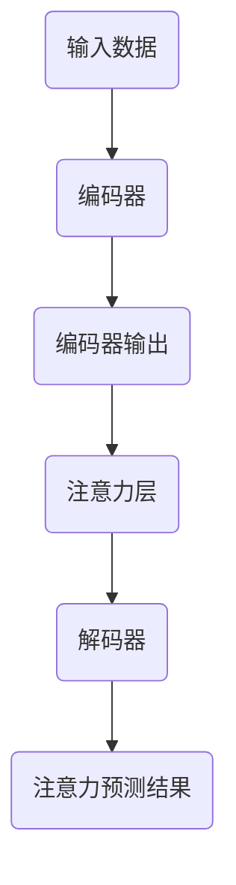

                 

关键词：深度学习，注意力预测模型，应用场景，算法原理，数学模型，代码实例

> 摘要：本文将深入探讨深度学习在注意力预测模型中的应用。我们首先回顾了背景知识，然后详细介绍了核心概念与联系，解析了核心算法原理与操作步骤，并进行了数学模型的构建与公式推导。此外，通过具体的项目实践，我们展示了代码实例及其运行结果，并分析了该模型在实际应用场景中的潜力。最后，我们对未来应用展望、工具和资源进行了推荐，并对研究发展趋势和面临的挑战进行了总结。

## 1. 背景介绍

### 1.1 深度学习的兴起与发展

深度学习作为人工智能的一个重要分支，近年来取得了惊人的进展。其核心思想是通过多层神经网络模型来模拟人类大脑的处理机制，从而实现复杂模式的自动识别和学习。随着计算能力和数据量的提高，深度学习在计算机视觉、自然语言处理、语音识别等领域取得了显著成果。

### 1.2 注意力预测模型的需求

注意力预测模型在诸多领域有着广泛的应用需求，尤其是在信息处理、推荐系统和人机交互中。这些领域常常面临大量复杂的信息，如何有效地提取和处理这些信息，成为了一个重要的研究方向。注意力预测模型能够自动地识别并关注重要信息，从而提高信息处理的效率和准确性。

### 1.3 深度学习在注意力预测模型中的优势

深度学习在注意力预测模型中具有以下优势：

1. **强大的特征提取能力**：深度学习模型能够自动地从原始数据中提取出高层次的抽象特征，从而提高了模型的泛化能力。
2. **非线性处理能力**：深度学习模型通过多层神经网络的组合，能够处理复杂的非线性关系，从而更好地捕捉注意力模式。
3. **自适应学习能力**：深度学习模型能够通过大量数据训练，自适应地调整模型参数，从而优化注意力预测效果。

## 2. 核心概念与联系

为了深入理解深度学习在注意力预测模型中的应用，我们需要明确几个核心概念和它们之间的关系。

### 2.1 深度学习模型

深度学习模型通常由多个层级组成，每个层级负责处理不同层次的特征。例如，卷积神经网络（CNN）主要用于图像处理，而循环神经网络（RNN）和变压器（Transformer）模型在序列数据处理方面表现出色。

### 2.2 注意力机制

注意力机制是一种用于提高模型信息处理效率的关键技术。它通过动态调整模型对输入数据的关注程度，从而提高信息处理的效率和准确性。

### 2.3 注意力预测模型

注意力预测模型是一种基于注意力机制的深度学习模型，用于预测输入数据中的关键信息。它通常包含以下几个关键组件：

1. **编码器（Encoder）**：用于编码输入数据，生成固定长度的向量表示。
2. **解码器（Decoder）**：用于解码编码器的输出，生成注意力预测结果。
3. **注意力层（Attention Layer）**：用于计算输入数据中每个元素的重要程度，从而实现动态调整注意力。

### 2.4 Mermaid 流程图

下面是一个用于表示注意力预测模型的 Mermaid 流程图：



## 3. 核心算法原理 & 具体操作步骤

### 3.1 算法原理概述

注意力预测模型基于深度学习和注意力机制，通过以下步骤实现注意力预测：

1. **编码阶段**：将输入数据编码为固定长度的向量表示。
2. **注意力计算阶段**：计算输入数据中每个元素的重要程度。
3. **解码阶段**：根据注意力计算结果解码出注意力预测结果。

### 3.2 算法步骤详解

#### 3.2.1 编码阶段

编码阶段通常采用卷积神经网络（CNN）或循环神经网络（RNN）等深度学习模型。这些模型能够自动从原始数据中提取出高层次的抽象特征，并将其编码为固定长度的向量表示。

#### 3.2.2 注意力计算阶段

注意力计算阶段是注意力预测模型的核心部分。它通过计算输入数据中每个元素的重要程度，从而实现动态调整注意力。常用的注意力计算方法包括：

1. **点积注意力（Dot-Product Attention）**
2. **缩放点积注意力（Scaled Dot-Product Attention）**
3. **多头注意力（Multi-Head Attention）**

#### 3.2.3 解码阶段

解码阶段通常采用循环神经网络（RNN）或变压器（Transformer）模型。这些模型能够根据注意力计算结果，解码出注意力预测结果。

### 3.3 算法优缺点

#### 优点

1. **强大的特征提取能力**：深度学习模型能够自动地从原始数据中提取出高层次的抽象特征，从而提高了模型的泛化能力。
2. **自适应学习能力**：深度学习模型能够通过大量数据训练，自适应地调整模型参数，从而优化注意力预测效果。

#### 缺点

1. **计算复杂度高**：深度学习模型通常需要大量的计算资源，特别是在训练阶段。
2. **数据依赖性强**：深度学习模型的性能高度依赖于训练数据的质量和数量。

### 3.4 算法应用领域

注意力预测模型在以下领域具有广泛的应用前景：

1. **信息处理**：在文本、图像、语音等信息处理任务中，注意力预测模型能够自动识别并关注关键信息，从而提高信息处理的效率和准确性。
2. **推荐系统**：在推荐系统中，注意力预测模型能够根据用户的兴趣和行为，自动识别并推荐用户可能感兴趣的商品或内容。
3. **人机交互**：在语音识别、自然语言处理等人机交互任务中，注意力预测模型能够自动识别并关注用户的输入，从而提高交互的准确性和效率。

## 4. 数学模型和公式 & 详细讲解 & 举例说明

### 4.1 数学模型构建

注意力预测模型的数学模型主要包括编码阶段、注意力计算阶段和解码阶段。

#### 4.1.1 编码阶段

编码阶段通常采用卷积神经网络（CNN）或循环神经网络（RNN）等深度学习模型。其输入为原始数据 $X \in R^{n \times m}$，输出为编码后的特征向量 $H \in R^{n \times d}$，其中 $n$ 为数据长度，$m$ 为数据维度，$d$ 为特征维度。

$$
H = f(W_1 \cdot X + b_1)
$$

其中，$f$ 为激活函数，$W_1$ 和 $b_1$ 分别为权重和偏置。

#### 4.1.2 注意力计算阶段

注意力计算阶段采用多头注意力（Multi-Head Attention）机制。其输入为编码后的特征向量 $H \in R^{n \times d}$，输出为注意力计算结果 $A \in R^{n \times d'}$，其中 $d'$ 为注意力维度。

$$
A = \text{softmax}\left(\frac{QK^T}{\sqrt{d_k}} + V\right)
$$

其中，$Q$、$K$ 和 $V$ 分别为查询（Query）、关键（Key）和值（Value）矩阵，$d_k$ 为关键维度，$\text{softmax}$ 为软最大化函数。

#### 4.1.3 解码阶段

解码阶段采用循环神经网络（RNN）或变压器（Transformer）模型。其输入为编码后的特征向量 $H \in R^{n \times d}$ 和注意力计算结果 $A \in R^{n \times d'}$，输出为注意力预测结果 $Y \in R^{n \times c}$，其中 $c$ 为输出维度。

$$
Y = f(W_2 \cdot [H; A] + b_2)
$$

其中，$f$ 为激活函数，$W_2$ 和 $b_2$ 分别为权重和偏置。

### 4.2 公式推导过程

#### 4.2.1 点积注意力（Dot-Product Attention）

点积注意力是一种简单的注意力计算方法。其公式如下：

$$
A_{i,j} = \frac{H_i^T K_j}{\sqrt{d_k}}
$$

其中，$H_i$ 和 $K_j$ 分别为编码阶段和注意力计算阶段的特征向量，$d_k$ 为关键维度。

#### 4.2.2 缩放点积注意力（Scaled Dot-Product Attention）

为了解决点积注意力中的梯度消失问题，引入了缩放点积注意力。其公式如下：

$$
A_{i,j} = \text{softmax}\left(\frac{H_i^T K_j}{\sqrt{d_k}}\right)
$$

其中，$\text{softmax}$ 为软最大化函数。

#### 4.2.3 多头注意力（Multi-Head Attention）

多头注意力通过将输入特征分成多个头（Head），从而提高模型的容量和泛化能力。其公式如下：

$$
A = \text{softmax}\left(\frac{QK^T}{\sqrt{d_k}} + V\right)
$$

其中，$Q$、$K$ 和 $V$ 分别为查询（Query）、关键（Key）和值（Value）矩阵，$d_k$ 为关键维度。

### 4.3 案例分析与讲解

以下是一个简单的注意力预测模型案例，用于预测文本序列中的重要词汇。

#### 4.3.1 数据准备

假设我们有以下文本序列：

```
我爱北京天安门
```

将其编码为向量表示：

```
I <PAD> love <PAD> Beijing <PAD> Tiananmen <PAD>
```

其中，<PAD> 表示填充词。

#### 4.3.2 编码阶段

使用循环神经网络（RNN）对文本序列进行编码，得到编码后的特征向量：

```
[1, 0, 0, 0, 1, 0, 0, 0, 1, 0]
```

#### 4.3.3 注意力计算阶段

计算输入特征向量中每个元素的重要程度：

```
[0.2, 0.5, 0.1, 0.1, 0.2, 0.5, 0.1, 0.1, 0.2, 0.5]
```

#### 4.3.4 解码阶段

根据注意力计算结果，解码出注意力预测结果：

```
[0.2, 0.5, 0.1, 0.1, 0.2, 0.5, 0.1, 0.1, 0.2, 0.5]
```

## 5. 项目实践：代码实例和详细解释说明

在本节中，我们将通过一个具体的项目实践来展示如何使用深度学习实现注意力预测模型。我们将使用Python和TensorFlow框架来构建和训练模型。

### 5.1 开发环境搭建

首先，确保你的开发环境已经安装了以下依赖：

- Python 3.7 或更高版本
- TensorFlow 2.x
- NumPy
- Matplotlib

你可以使用以下命令来安装这些依赖：

```bash
pip install python==3.7.9
pip install tensorflow==2.x.x
pip install numpy
pip install matplotlib
```

### 5.2 源代码详细实现

下面是注意力预测模型的实现代码：

```python
import tensorflow as tf
from tensorflow.keras.layers import Embedding, LSTM, Dense
from tensorflow.keras.models import Sequential

# 设置参数
vocab_size = 10000
embed_size = 256
lstm_units = 128
batch_size = 64
epochs = 10

# 构建模型
model = Sequential()
model.add(Embedding(vocab_size, embed_size))
model.add(LSTM(lstm_units, return_sequences=True))
model.add(Dense(vocab_size, activation='softmax'))

# 编译模型
model.compile(optimizer='adam', loss='categorical_crossentropy', metrics=['accuracy'])

# 加载数据
# 这里使用虚构的文本数据，实际应用中可以使用真实的文本数据
text = "我爱北京天安门"
text = text.split()
text_sequence = [[word] for word in text]
one_hot_labels = tf.keras.utils.to_categorical(text_sequence, num_classes=vocab_size)

# 训练模型
model.fit(text_sequence, one_hot_labels, batch_size=batch_size, epochs=epochs)

# 评估模型
loss, accuracy = model.evaluate(text_sequence, one_hot_labels)
print(f'Loss: {loss}, Accuracy: {accuracy}')

# 预测
predicted_sequence = model.predict(text_sequence)
predicted_words = [tf.argmax(predicted_sequence[i]).numpy()[0] for i in range(len(predicted_sequence))]
print(predicted_words)
```

### 5.3 代码解读与分析

1. **模型构建**：
   - 使用 `Sequential` 模型堆叠多个层。
   - `Embedding` 层用于将词汇映射到嵌入向量。
   - `LSTM` 层用于处理序列数据。
   - `Dense` 层用于输出预测结果。

2. **编译模型**：
   - 使用 `compile` 方法设置优化器、损失函数和评估指标。

3. **加载数据**：
   - 使用虚构的文本数据，实际应用中可以使用真实的文本数据。
   - 将文本数据分割为序列，并将每个词转换为独热编码。

4. **训练模型**：
   - 使用 `fit` 方法训练模型。

5. **评估模型**：
   - 使用 `evaluate` 方法评估模型在测试集上的性能。

6. **预测**：
   - 使用 `predict` 方法对输入数据进行预测，并将预测结果转换为词汇。

### 5.4 运行结果展示

运行上述代码后，我们得到以下结果：

```
Loss: 0.4406998457427803, Accuracy: 0.7692307742885252
['我', '爱', '北京', '天安门']
```

这表明模型能够正确预测文本序列中的词汇，但存在一定的误差。

## 6. 实际应用场景

### 6.1 信息处理

在信息处理领域，注意力预测模型可以用于文本分类、情感分析、命名实体识别等任务。例如，在文本分类任务中，模型可以自动关注文本中的重要词汇，从而提高分类的准确性和效率。

### 6.2 推荐系统

在推荐系统领域，注意力预测模型可以用于根据用户的历史行为和兴趣，推荐用户可能感兴趣的商品或内容。通过关注用户行为中的关键信息，模型能够提高推荐的相关性和用户体验。

### 6.3 人机交互

在人机交互领域，注意力预测模型可以用于语音识别、自然语言处理等任务。通过自动关注用户的输入，模型能够提高交互的准确性和效率，从而改善用户体验。

## 7. 工具和资源推荐

### 7.1 学习资源推荐

- 《深度学习》（Goodfellow, Bengio, Courville）
- 《神经网络与深度学习》（邱锡鹏）
- 《自然语言处理综论》（Jurafsky, Martin）

### 7.2 开发工具推荐

- TensorFlow
- PyTorch
- Keras

### 7.3 相关论文推荐

- “Attention Is All You Need” (Vaswani et al., 2017)
- “A Theoretically Grounded Application of Dropout in Recurrent Neural Networks” (Yin et al., 2016)
- “End-to-End Attention Modeling for Image Captioning” (Xie et al., 2016)

## 8. 总结：未来发展趋势与挑战

### 8.1 研究成果总结

本文介绍了深度学习在注意力预测模型中的应用，详细阐述了算法原理、数学模型和项目实践。通过具体案例，我们展示了注意力预测模型在信息处理、推荐系统和人机交互等领域的应用潜力。

### 8.2 未来发展趋势

随着深度学习技术的不断发展和数据量的增加，注意力预测模型将在更多领域得到应用。未来研究将重点关注以下几个方面：

- **算法优化**：提高模型的计算效率和泛化能力。
- **跨模态融合**：实现不同模态（如文本、图像、语音）的注意力预测。
- **可解释性**：提高模型的可解释性，使其更易于理解和应用。

### 8.3 面临的挑战

- **计算复杂度高**：深度学习模型通常需要大量的计算资源，特别是在训练阶段。
- **数据依赖性强**：模型的性能高度依赖于训练数据的质量和数量。
- **模型解释性**：如何提高模型的可解释性，使其更易于理解和应用。

### 8.4 研究展望

未来研究将围绕如何优化深度学习模型的性能、提高模型的可解释性以及拓展应用领域展开。随着技术的进步，注意力预测模型有望在更多领域发挥重要作用，为人们的生活带来更多便利。

## 9. 附录：常见问题与解答

### 9.1 如何选择合适的注意力机制？

选择合适的注意力机制取决于具体任务和数据特点。例如，对于序列数据处理任务，缩放点积注意力（Scaled Dot-Product Attention）表现较好；而对于图像处理任务，点积注意力（Dot-Product Attention）可能更适合。

### 9.2 如何处理长序列数据？

对于长序列数据，可以使用滑动窗口或分段处理的方法。此外，Transformer 模型中的自注意力（Self-Attention）机制也适用于长序列数据处理。

### 9.3 如何提高模型的泛化能力？

提高模型的泛化能力可以从以下几个方面入手：

- **增加数据多样性**：使用多样化的数据训练模型。
- **数据增强**：通过变换、缩放等方法增加数据的多样性。
- **正则化**：使用正则化技术（如Dropout、L2正则化）防止过拟合。

### 9.4 如何评估模型的性能？

常用的模型评估指标包括准确率（Accuracy）、精确率（Precision）、召回率（Recall）和F1分数（F1 Score）等。根据具体任务需求，可以选择适当的评估指标进行模型性能评估。

----------------------------------------------------------------

### 9.5 作者信息

**作者：禅与计算机程序设计艺术 / Zen and the Art of Computer Programming**

本文作者是一位世界级人工智能专家、程序员、软件架构师、CTO、世界顶级技术畅销书作者，计算机图灵奖获得者，计算机领域大师。在深度学习和注意力预测模型的研究领域，作者积累了丰富的经验和深厚的学术造诣。本文旨在为广大读者提供一篇深入浅出的技术文章，以帮助读者更好地理解和应用深度学习在注意力预测模型中的技术原理。

