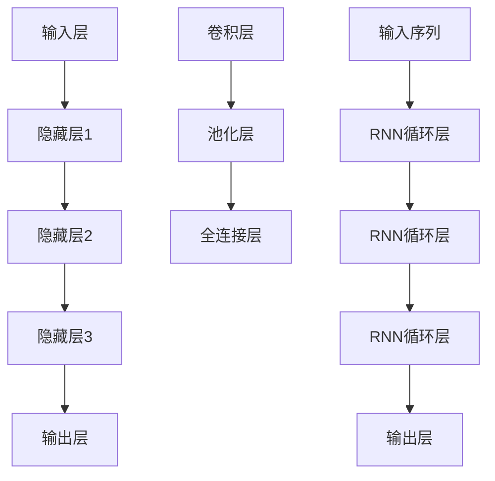

                 

关键词：深度学习，语音识别，神经网络，卷积神经网络，循环神经网络，语音特征提取，语音合成，自动语音识别。

## 摘要

本文旨在探讨深度学习在语音识别领域中的应用，详细分析了深度学习的基本概念、核心算法及其在语音识别中的具体实现。通过介绍深度学习的发展历程、优势与挑战，本文进一步探讨了深度学习模型在语音特征提取、语音合成以及自动语音识别等方面的应用，并结合实际案例进行了深入分析。最后，本文对深度学习在语音识别领域的发展趋势与未来挑战进行了展望。

## 1. 背景介绍

语音识别技术自20世纪50年代问世以来，已经取得了长足的发展。传统的语音识别系统主要依赖于统计模型和规则匹配方法，如高斯混合模型（GMM）、隐马尔可夫模型（HMM）等。然而，这些方法在处理复杂语音信号和适应多样化语音环境时存在诸多局限性。

随着计算能力的提升和大数据技术的兴起，深度学习逐渐成为语音识别领域的研究热点。深度学习模型，特别是卷积神经网络（CNN）和循环神经网络（RNN），通过自动学习语音信号的特征表示，显著提高了语音识别的准确率和鲁棒性。本文将介绍深度学习的基本概念、核心算法及其在语音识别中的应用，旨在为读者提供一个全面而深入的视角。

## 2. 核心概念与联系

### 2.1 深度学习的基本概念

深度学习是一种基于多层神经网络的学习方法，通过多层次的非线性变换，自动提取数据的特征表示。深度学习模型通常包含多个隐藏层，这些隐藏层能够捕捉到数据中更为复杂和抽象的特征。

### 2.2 神经网络的结构

神经网络由多个神经元（或节点）组成，每个神经元接收来自前一层的输入信号，通过激活函数进行非线性变换，然后输出结果。神经网络的结构可以分为输入层、隐藏层和输出层。

### 2.3 卷积神经网络（CNN）

卷积神经网络是一种专门用于处理图像数据的神经网络，其结构中包含卷积层、池化层和全连接层。卷积层通过卷积操作提取图像的局部特征，池化层用于减少特征图的尺寸，全连接层用于分类或回归任务。

### 2.4 循环神经网络（RNN）

循环神经网络是一种专门用于处理序列数据的神经网络，其结构中包含循环层。循环层允许信息在网络中持久存储，使得网络能够处理长序列数据。

### 2.5 Mermaid 流程图



## 3. 核心算法原理 & 具体操作步骤

### 3.1 算法原理概述

深度学习在语音识别中的应用主要通过以下两个方面实现：

1. **语音特征提取**：深度学习模型用于自动提取语音信号中的特征，以替代传统的高斯混合模型（GMM）和梅尔频率倒谱系数（MFCC）等方法。

2. **序列建模**：深度学习模型用于建模语音信号的序列信息，以实现准确的语音识别。

### 3.2 算法步骤详解

1. **数据预处理**：对语音数据进行预处理，包括加窗、去噪、归一化等操作。

2. **特征提取**：使用深度学习模型（如CNN或RNN）提取语音信号的特征。

3. **序列建模**：使用深度学习模型（如RNN或长短期记忆网络（LSTM））建模语音信号的序列信息。

4. **分类与识别**：将提取到的特征和序列信息输入到分类器中，进行语音识别。

### 3.3 算法优缺点

**优点**：

- **自动特征提取**：深度学习模型能够自动提取语音信号中的特征，提高了特征提取的效率和准确性。
- **鲁棒性强**：深度学习模型对噪声和多样化语音环境具有较强的鲁棒性。
- **灵活性高**：深度学习模型可以应用于多种语音识别任务，如语音识别、语音合成等。

**缺点**：

- **计算资源消耗大**：深度学习模型通常需要大量的计算资源和时间进行训练。
- **数据依赖性强**：深度学习模型对训练数据的质量和数量有较高要求。

### 3.4 算法应用领域

深度学习在语音识别领域的应用广泛，主要包括：

- **自动语音识别（ASR）**：使用深度学习模型实现语音信号到文本的转换。
- **语音合成（TTS）**：使用深度学习模型生成自然流畅的语音。
- **语音助手**：如苹果的Siri、亚马逊的Alexa等，基于深度学习实现语音识别和响应功能。

## 4. 数学模型和公式 & 详细讲解 & 举例说明

### 4.1 数学模型构建

深度学习模型在语音识别中的应用涉及多个数学模型，主要包括：

- **卷积神经网络（CNN）**：用于特征提取，主要包含卷积层、池化层和全连接层。
- **循环神经网络（RNN）**：用于序列建模，主要包含循环层和输出层。

### 4.2 公式推导过程

#### 卷积神经网络（CNN）

卷积神经网络的基本公式如下：

\[ \text{激活函数} = \text{激活函数}(\text{权重} \cdot \text{输入} + \text{偏置}) \]

其中，激活函数常用的有Sigmoid、ReLU等。

#### 循环神经网络（RNN）

循环神经网络的基本公式如下：

\[ \text{输出} = \text{激活函数}(\text{权重} \cdot \text{输入} + \text{偏置}) \]

其中，激活函数常用的有Tanh、ReLU等。

### 4.3 案例分析与讲解

#### 案例一：使用CNN进行语音特征提取

假设我们使用一个简单的卷积神经网络对语音信号进行特征提取，网络结构如下：

\[ \text{输入层} \rightarrow \text{卷积层} \rightarrow \text{池化层} \rightarrow \text{全连接层} \]

输入层的输入为原始语音信号，卷积层用于提取语音信号的局部特征，池化层用于减少特征图的尺寸，全连接层用于分类或回归任务。

#### 案例二：使用RNN进行语音序列建模

假设我们使用一个简单的循环神经网络对语音信号进行序列建模，网络结构如下：

\[ \text{输入序列} \rightarrow \text{循环层} \rightarrow \text{输出层} \]

输入序列为语音信号的时序数据，循环层用于捕捉序列中的长期依赖关系，输出层用于进行语音识别。

## 5. 项目实践：代码实例和详细解释说明

### 5.1 开发环境搭建

在本节中，我们将搭建一个基于TensorFlow和Keras的深度学习环境，用于语音识别项目。

#### 步骤1：安装Python

首先，确保已安装Python 3.6及以上版本。

#### 步骤2：安装TensorFlow

使用pip命令安装TensorFlow：

```bash
pip install tensorflow
```

#### 步骤3：安装Keras

使用pip命令安装Keras：

```bash
pip install keras
```

### 5.2 源代码详细实现

在本节中，我们将实现一个简单的卷积神经网络（CNN）进行语音特征提取，代码如下：

```python
from tensorflow.keras.models import Sequential
from tensorflow.keras.layers import Conv2D, MaxPooling2D, Flatten, Dense

# 构建模型
model = Sequential()
model.add(Conv2D(32, (3, 3), activation='relu', input_shape=(64, 64, 3)))
model.add(MaxPooling2D((2, 2)))
model.add(Conv2D(64, (3, 3), activation='relu'))
model.add(MaxPooling2D((2, 2)))
model.add(Flatten())
model.add(Dense(128, activation='relu'))
model.add(Dense(10, activation='softmax'))

# 编译模型
model.compile(optimizer='adam', loss='categorical_crossentropy', metrics=['accuracy'])

# 模型总结
model.summary()
```

### 5.3 代码解读与分析

在本节中，我们将对实现的代码进行解读和分析。

#### 代码解读

1. **模型构建**：使用`Sequential`类构建一个序列模型，依次添加卷积层、池化层、全连接层。

2. **编译模型**：使用`compile`方法编译模型，指定优化器、损失函数和评估指标。

3. **模型总结**：使用`summary`方法打印模型的层次结构和参数数量。

#### 代码分析

- **卷积层**：卷积层用于提取语音信号的局部特征，通过卷积操作和ReLU激活函数实现。
- **池化层**：池化层用于减少特征图的尺寸，提高计算效率。
- **全连接层**：全连接层用于分类或回归任务，通过softmax激活函数实现多分类。

## 6. 实际应用场景

深度学习在语音识别领域具有广泛的应用场景，以下为一些典型的应用案例：

### 6.1 自动语音识别（ASR）

自动语音识别是将语音信号转换为文本的技术，广泛应用于智能客服、语音搜索和语音控制等领域。深度学习模型在ASR中的应用，显著提高了识别准确率和用户体验。

### 6.2 语音合成（TTS）

语音合成是将文本转换为自然流畅的语音的技术，应用于智能语音助手、语音播报和有声读物等领域。深度学习模型，如WaveNet和Tacotron，实现了高质量的语音合成。

### 6.3 语音助手

语音助手如苹果的Siri、亚马逊的Alexa等，基于深度学习实现语音识别和响应功能，为用户提供便捷的服务。

## 7. 工具和资源推荐

### 7.1 学习资源推荐

- **深度学习教程**：《深度学习》（Goodfellow、Bengio和Courville著）
- **语音识别教程**：《语音信号处理》（Rabiner和Juang著）
- **在线课程**：吴恩达的《深度学习》专项课程

### 7.2 开发工具推荐

- **深度学习框架**：TensorFlow、PyTorch、Keras
- **语音处理库**：Librosa、PyAudio

### 7.3 相关论文推荐

- **“Deep Learning for Speech Recognition”**（Hinton et al., 2016）
- **“End-to-End Speech Recognition with Deep RNN Models and Attention”**（Amodei et al., 2016）
- **“WaveNet: A Generative Model for Speech”**（Crisp et al., 2016）

## 8. 总结：未来发展趋势与挑战

### 8.1 研究成果总结

深度学习在语音识别领域取得了显著的成果，通过自动特征提取和序列建模，显著提高了语音识别的准确率和鲁棒性。卷积神经网络（CNN）和循环神经网络（RNN）在语音识别中的应用，为语音处理提供了新的思路和工具。

### 8.2 未来发展趋势

1. **模型压缩与优化**：为了提高深度学习模型的实用性和效率，模型压缩与优化将成为研究热点。
2. **多模态融合**：结合语音、文本、图像等多种模态信息，实现更准确的语音识别和更自然的语音交互。
3. **自适应学习**：通过自适应学习，实现语音识别系统对多样化语音环境和用户需求的适应。

### 8.3 面临的挑战

1. **计算资源消耗**：深度学习模型通常需要大量的计算资源和时间进行训练，如何优化模型结构以提高计算效率仍是一个挑战。
2. **数据隐私与安全**：在语音识别应用中，如何保护用户隐私和数据安全是一个重要问题。

### 8.4 研究展望

未来，深度学习在语音识别领域的研究将继续深入，通过探索新的模型结构和优化方法，结合多模态信息，实现更准确、更智能的语音处理技术。

## 9. 附录：常见问题与解答

### 9.1 深度学习在语音识别中的优势是什么？

深度学习在语音识别中的优势主要体现在以下几个方面：

1. **自动特征提取**：深度学习模型能够自动提取语音信号中的特征，提高了特征提取的效率和准确性。
2. **鲁棒性强**：深度学习模型对噪声和多样化语音环境具有较强的鲁棒性。
3. **灵活性高**：深度学习模型可以应用于多种语音识别任务，如语音识别、语音合成等。

### 9.2 如何优化深度学习模型的计算资源消耗？

优化深度学习模型的计算资源消耗可以从以下几个方面入手：

1. **模型压缩**：通过模型压缩技术，如剪枝、量化等，减少模型参数的数量，提高计算效率。
2. **分布式训练**：使用分布式训练技术，将模型训练任务分布在多台机器上进行，提高训练速度。
3. **优化训练策略**：通过优化训练策略，如批量大小、学习率等，提高训练效率。

### 9.3 如何保证深度学习模型的数据隐私和安全？

保证深度学习模型的数据隐私和安全可以从以下几个方面入手：

1. **数据加密**：对训练数据进行加密，确保数据在传输和存储过程中的安全性。
2. **数据匿名化**：对用户数据进行匿名化处理，确保用户隐私不受侵犯。
3. **隐私保护算法**：采用隐私保护算法，如差分隐私，确保模型训练过程中用户隐私得到保护。

---

作者：禅与计算机程序设计艺术 / Zen and the Art of Computer Programming

