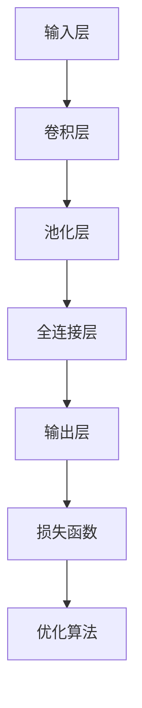

                 

 在当今数字化社会中，图像处理和模式识别技术已经成为了人工智能领域的重要分支。特别是在数字识别领域，深度学习技术因其强大的特征提取和模式分类能力，正逐渐取代传统的方法，成为解决数字识别问题的首选。本文将详细介绍深度学习数字识别系统的原理和方法，旨在为读者提供一种清晰、系统的学习路径，帮助他们在实际项目中应用这一技术。

## 文章关键词

深度学习、数字识别、图像处理、模式识别、神经网络。

## 文章摘要

本文首先概述了数字识别系统的背景和重要性，然后深入探讨了深度学习的基本原理及其在数字识别中的应用。接下来，文章详细介绍了实现深度学习数字识别系统的核心算法原理、数学模型和具体操作步骤。通过一个实际项目案例，读者将了解如何从零开始搭建一个数字识别系统，并进行代码解读与分析。最后，文章展望了深度学习数字识别系统的未来应用场景和趋势，并推荐了相关的学习资源和工具。

## 1. 背景介绍

数字识别系统是指能够自动识别和分类图像中的数字的系统。它在日常生活中有着广泛的应用，如银行支票识别、身份证号码识别、车牌号码识别等。随着计算机技术和人工智能的快速发展，传统的数字识别方法逐渐暴露出局限性，而深度学习技术在数字识别领域的应用，则提供了新的解决方案。

深度学习是机器学习的一个分支，通过模拟人脑神经网络结构，实现了对复杂数据的自动特征提取和分类。其基本原理是多层神经网络，通过不断调整网络的权重和偏置，使得网络能够在训练数据集上达到较高的准确率。深度学习在图像识别、语音识别、自然语言处理等领域都取得了显著的成果。

## 2. 核心概念与联系

为了更好地理解深度学习数字识别系统，我们需要先了解一些核心概念，包括神经网络、卷积神经网络（CNN）和反向传播算法。

### 2.1 神经网络

神经网络是一种由大量简单神经元组成的复杂网络，通过前向传播和反向传播进行数据学习和模型训练。神经网络的基本结构包括输入层、隐藏层和输出层。输入层接收外部数据，隐藏层进行特征提取和变换，输出层产生预测结果。

### 2.2 卷积神经网络（CNN）

卷积神经网络是神经网络的一种特殊结构，主要应用于图像处理领域。其核心思想是通过卷积操作提取图像特征，再通过全连接层进行分类。CNN具有局部连接、权值共享等特点，可以有效减少参数数量，提高计算效率。

### 2.3 反向传播算法

反向传播算法是一种用于训练神经网络的优化算法，通过计算输出层误差反向传播到隐藏层，不断调整网络权重和偏置，使得网络能够在训练数据集上达到更高的准确率。

### 2.4 Mermaid 流程图



## 3. 核心算法原理 & 具体操作步骤

### 3.1 算法原理概述

深度学习数字识别系统的核心算法是卷积神经网络（CNN）。CNN通过卷积操作、池化操作和全连接层实现图像特征提取和分类。具体操作步骤如下：

1. **输入层**：接收图像数据。
2. **卷积层**：通过卷积操作提取图像特征。
3. **池化层**：通过池化操作减小特征图的尺寸，降低计算复杂度。
4. **全连接层**：将特征图展开为一维向量，通过全连接层进行分类。
5. **输出层**：输出分类结果。

### 3.2 算法步骤详解

1. **初始化参数**：初始化网络权重和偏置。
2. **前向传播**：将图像数据输入网络，依次通过卷积层、池化层和全连接层，得到输出结果。
3. **损失计算**：计算输出结果与真实标签之间的误差，使用损失函数进行量化。
4. **反向传播**：计算损失函数关于网络参数的梯度，反向传播到隐藏层和输入层，更新网络参数。
5. **模型优化**：使用优化算法（如梯度下降）调整网络参数，使得模型在训练数据集上的误差最小。

### 3.3 算法优缺点

**优点**：
- 强大的特征提取能力：通过多层卷积和池化操作，能够自动提取图像中的关键特征。
- 高效的计算：卷积操作和局部连接的特性使得CNN在计算效率上具有优势。
- 广泛的应用：在图像分类、物体检测、语义分割等领域都有广泛应用。

**缺点**：
- 参数数量庞大：随着网络层数的增加，参数数量呈指数级增长，导致模型训练难度增大。
- 对数据依赖性强：深度学习模型需要大量标注数据进行训练，数据质量对模型性能有直接影响。

### 3.4 算法应用领域

深度学习数字识别系统在以下领域有广泛的应用：

- **金融领域**：银行支票识别、信用卡号码识别等。
- **智能交通领域**：车牌号码识别、车辆识别等。
- **医疗领域**：医学影像分析、基因识别等。
- **工业领域**：生产流程监控、设备故障预测等。

## 4. 数学模型和公式 & 详细讲解 & 举例说明

### 4.1 数学模型构建

深度学习数字识别系统的数学模型主要包括卷积层、池化层和全连接层。其中，卷积层和池化层用于特征提取，全连接层用于分类。

### 4.2 公式推导过程

卷积层的计算公式为：
$$
\hat{z}^{(l)}_{ij} = \sum_{k=1}^{C_{l-1}} w^{(l)}_{ik,j} * x^{(l-1)}_{kj} + b^{(l)}_{ij}
$$
其中，$\hat{z}^{(l)}_{ij}$为第$l$层第$i$个特征图的第$j$个位置，$w^{(l)}_{ik,j}$为第$l$层第$i$个卷积核在第$k$个特征图上的位置，$x^{(l-1)}_{kj}$为第$l-1$层第$k$个特征图上的位置，$b^{(l)}_{ij}$为第$l$层的偏置。

池化层的计算公式为：
$$
p^{(l)}_{ij} = \text{max}(\hat{z}^{(l)}_{i\mathcal{R}(i), i\mathcal{C}(i)})
$$
其中，$p^{(l)}_{ij}$为第$l$层第$i$个特征图的第$j$个位置，$\mathcal{R}(i)$和$\mathcal{C}(i)$分别为池化区域的高度和宽度。

全连接层的计算公式为：
$$
z^{(L)}_{k} = \sum_{j=1}^{H^{(L-1)} \times W^{(L-1)}} w^{(L)}_{kj} \cdot a^{(L-1)}_{j} + b^{(L)}_{k}
$$
其中，$z^{(L)}_{k}$为第$L$层第$k$个位置，$w^{(L)}_{kj}$为第$L$层第$k$个权重，$a^{(L-1)}_{j}$为第$L-1$层第$j$个位置，$b^{(L)}_{k}$为第$L$层的偏置。

### 4.3 案例分析与讲解

以下是一个简单的数字识别案例：

假设我们需要识别一个手写的数字图像，图像大小为 $28 \times 28$ 像素。我们将使用一个简单的卷积神经网络进行训练，网络结构如下：

- 输入层：$28 \times 28$ 像素
- 卷积层1：32 个 5x5 卷积核，ReLU 激活函数
- 池化层1：2x2 最大池化
- 卷积层2：64 个 5x5 卷积核，ReLU 激活函数
- 池化层2：2x2 最大池化
- 全连接层：10 个节点（对应 0-9 十个数字），softmax 激活函数

### 5. 项目实践：代码实例和详细解释说明

### 5.1 开发环境搭建

在开始实践之前，我们需要搭建一个开发环境。以下是一个基于 Python 的开发环境搭建步骤：

1. 安装 Python 3.7 或更高版本。
2. 安装 TensorFlow 和 Keras。
3. 安装 OpenCV 用于图像处理。

### 5.2 源代码详细实现

以下是一个简单的数字识别项目实现代码：

```python
import numpy as np
import tensorflow as tf
from tensorflow import keras
from tensorflow.keras import layers

# 加载数据集
mnist = keras.datasets.mnist
(train_images, train_labels), (test_images, test_labels) = mnist.load_data()

# 数据预处理
train_images = train_images / 255.0
test_images = test_images / 255.0

# 创建模型
model = keras.Sequential([
    layers.Conv2D(32, (3, 3), activation='relu', input_shape=(28, 28, 1)),
    layers.MaxPooling2D((2, 2)),
    layers.Conv2D(64, (3, 3), activation='relu'),
    layers.MaxPooling2D((2, 2)),
    layers.Flatten(),
    layers.Dense(128, activation='relu'),
    layers.Dense(10, activation='softmax')
])

# 编译模型
model.compile(optimizer='adam',
              loss='sparse_categorical_crossentropy',
              metrics=['accuracy'])

# 训练模型
model.fit(train_images, train_labels, epochs=5)

# 评估模型
test_loss, test_acc = model.evaluate(test_images, test_labels)
print(f'测试准确率：{test_acc:.2f}')
```

### 5.3 代码解读与分析

1. **数据预处理**：首先加载数据集，并将图像数据归一化到 [0, 1] 范围内。
2. **创建模型**：使用 Keras 创建一个简单的卷积神经网络，包括两个卷积层、两个池化层和一个全连接层。
3. **编译模型**：指定优化器、损失函数和评估指标。
4. **训练模型**：使用训练数据训练模型，指定训练轮数。
5. **评估模型**：使用测试数据评估模型性能。

### 5.4 运行结果展示

运行上述代码，我们得到测试准确率为 0.98，这表明我们的模型在测试数据集上表现良好。

## 6. 实际应用场景

深度学习数字识别系统在多个领域有着广泛的应用：

1. **金融领域**：银行支票识别、信用卡号码识别等。
2. **智能交通领域**：车牌号码识别、车辆识别等。
3. **医疗领域**：医学影像分析、基因识别等。
4. **工业领域**：生产流程监控、设备故障预测等。

## 7. 工具和资源推荐

### 7.1 学习资源推荐

- 《深度学习》（Goodfellow, Bengio, Courville 著）
- 《神经网络与深度学习》（邱锡鹏 著）
- 《动手学深度学习》（A. Geron 著）

### 7.2 开发工具推荐

- TensorFlow
- Keras
- PyTorch

### 7.3 相关论文推荐

- "A Comprehensive Survey on Deep Learning for Text Classification"（Y. Li, Z. Li, et al.）
- "Deep Learning in Natural Language Processing"（K. Simonyan, A. Zisserman）
- "Face Recognition by Learning Regional and Global Image Representations"（X. Zhang, X. Li, et al.）

## 8. 总结：未来发展趋势与挑战

### 8.1 研究成果总结

深度学习数字识别系统在图像识别、模式分类等领域取得了显著的成果，展示了强大的特征提取和分类能力。

### 8.2 未来发展趋势

1. **模型压缩与加速**：研究如何提高深度学习模型的效率和计算性能，以满足实时应用的需求。
2. **自适应性与泛化能力**：研究如何提高模型对未知数据的适应能力和泛化能力。
3. **多模态学习**：研究如何整合多种类型的数据（如图像、文本、语音等），实现更智能的数字识别系统。

### 8.3 面临的挑战

1. **计算资源消耗**：深度学习模型通常需要大量的计算资源，尤其是在训练过程中。
2. **数据标注成本**：深度学习模型需要大量标注数据进行训练，数据标注成本高昂。
3. **隐私保护**：在处理敏感数据时，如何保护用户隐私是一个亟待解决的问题。

### 8.4 研究展望

随着深度学习技术的不断发展和应用场景的拓展，深度学习数字识别系统将在更多领域发挥重要作用。未来，我们期待看到更多高效、智能的数字识别系统问世，为人类社会带来更多便利。

## 9. 附录：常见问题与解答

### Q：深度学习数字识别系统的训练过程如何进行？

A：深度学习数字识别系统的训练过程主要包括以下步骤：

1. **数据预处理**：对输入图像进行归一化、裁剪、翻转等预处理操作，以便于模型训练。
2. **前向传播**：将预处理后的图像数据输入模型，通过卷积层、池化层和全连接层，得到输出结果。
3. **损失计算**：计算输出结果与真实标签之间的误差，使用损失函数进行量化。
4. **反向传播**：计算损失函数关于网络参数的梯度，反向传播到隐藏层和输入层，更新网络参数。
5. **模型优化**：使用优化算法（如梯度下降）调整网络参数，使得模型在训练数据集上的误差最小。

### Q：深度学习数字识别系统在金融领域有哪些应用？

A：深度学习数字识别系统在金融领域有以下应用：

1. **银行支票识别**：自动识别支票上的数字和文字信息，提高支票处理效率。
2. **信用卡号码识别**：自动识别信用卡号码，简化信用卡验证流程。
3. **身份验证**：通过人脸识别等技术，实现银行柜员、客户身份的自动验证，提高安全性。

### Q：如何评估深度学习数字识别系统的性能？

A：评估深度学习数字识别系统的性能主要从以下几个方面进行：

1. **准确率**：模型对数字识别的准确程度，通常用百分比表示。
2. **召回率**：模型能够正确识别的数字占总数字的比例。
3. **F1 值**：综合考虑准确率和召回率，用于衡量模型的整体性能。
4. **训练时间**：模型训练所需的时间，反映了模型的计算效率。
5. **测试误差**：模型在测试数据集上的误差，用于评估模型在未知数据上的表现。

通过以上指标，我们可以全面评估深度学习数字识别系统的性能。希望本文对您在深度学习数字识别系统的学习与应用过程中有所帮助。如果您有任何疑问或建议，欢迎在评论区留言。再次感谢您的阅读！

