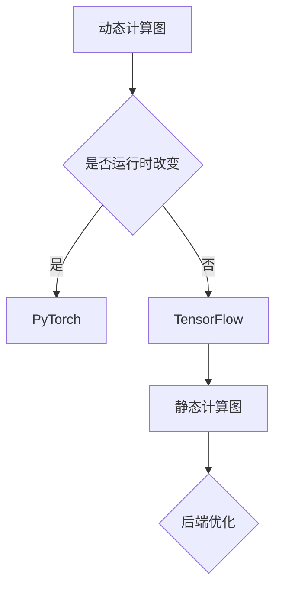

                 

深度学习是当前计算机科学领域的一个热门话题，而深度学习框架作为实现深度学习算法的核心工具，自然也成为了众多研究人员和开发者的关注焦点。在众多深度学习框架中，TensorFlow、PyTorch和Keras是三个最为流行和广泛使用的框架。本文将对这三个框架进行详细比较，从历史背景、核心概念、算法原理、数学模型、项目实践、应用场景等多个方面进行分析，以帮助读者更好地了解和选择适合自己项目的深度学习框架。

## 关键词

- 深度学习
- 框架
- TensorFlow
- PyTorch
- Keras

## 摘要

本文旨在比较TensorFlow、PyTorch和Keras这三个深度学习框架，探讨它们在历史背景、核心概念、算法原理、数学模型、项目实践和应用场景等方面的异同。通过详细分析，本文旨在为读者提供一个全面、客观的对比，帮助读者更好地选择适合自己的深度学习框架。

## 1. 背景介绍

### TensorFlow

TensorFlow是由Google在2015年推出的开源深度学习框架。它的核心目标是提供灵活、高效、易于扩展的深度学习工具，以实现从研究到生产的无缝过渡。TensorFlow的原生语言是Python，同时也支持C++和Java等语言。TensorFlow拥有丰富的生态系统，包括TensorBoard（可视化工具）、TensorFlow Lite（移动端部署）和TensorFlow Extended（企业级解决方案）等。

### PyTorch

PyTorch是由Facebook的人工智能研究团队在2016年推出的开源深度学习框架。它以其动态计算图和易用性而受到广泛关注。PyTorch的原生语言是Python，同时也支持C++和Lua等语言。PyTorch的特点包括易于调试、灵活的代码结构和高性能。

### Keras

Keras是一个高级神经网络API，由Google的科研人员和深度学习社区共同开发。它以Python为原生语言，易于理解和使用，提供了丰富的预定义模型和层。Keras的特点包括模块化、可扩展性和高兼容性，能够在TensorFlow、CNTK和Theano等多个后端框架上运行。

## 2. 核心概念与联系

为了更好地理解TensorFlow、PyTorch和Keras这三个框架，我们需要先了解一些核心概念和它们之间的联系。

### 动态计算图与静态计算图

动态计算图（Dynamic Computation Graph）和静态计算图（Static Computation Graph）是深度学习框架中的两种不同的计算图表示方式。

- 动态计算图：在动态计算图中，节点和边是动态创建和连接的，可以在运行时改变计算图的拓扑结构。PyTorch采用动态计算图，这使得它具有很高的灵活性和易于调试的特点。
- 静态计算图：在静态计算图中，节点和边是在编译时确定的，运行时不再改变。TensorFlow采用静态计算图，这使得它具有更好的性能和优化的机会。

### 前端与后端

前端（Frontend）和后端（Backend）是深度学习框架中的两个重要部分。

- 前端：负责定义和构建计算图，包括数据流和控制流。TensorFlow、PyTorch和Keras都提供了前端API，用于构建和训练深度学习模型。
- 后端：负责执行计算图，包括编译和优化。后端的性能和效率对深度学习框架的整体性能有着重要影响。

### Mermaid 流程图

为了更好地展示动态计算图和静态计算图的关系，我们使用Mermaid流程图来表示。



## 3. 核心算法原理 & 具体操作步骤

### 3.1 算法原理概述

深度学习框架的核心算法原理主要包括神经网络、反向传播、优化器和损失函数。

- 神经网络：神经网络是深度学习的核心模型，由多个层（全连接层、卷积层、池化层等）组成，用于对数据进行处理和预测。
- 反向传播：反向传播是一种用于训练神经网络的算法，通过计算损失函数关于模型参数的梯度，以更新模型参数。
- 优化器：优化器是一种用于调整模型参数的算法，常用的优化器包括梯度下降、Adam、RMSProp等。
- 损失函数：损失函数用于评估模型预测结果与真实结果之间的差异，常用的损失函数包括均方误差、交叉熵等。

### 3.2 算法步骤详解

下面我们分别介绍TensorFlow、PyTorch和Keras的核心算法步骤。

#### TensorFlow

1. 定义计算图：使用TensorFlow的API定义计算图，包括输入层、隐藏层和输出层。
2. 前向传播：将输入数据传递给计算图，计算输出结果。
3. 反向传播：计算损失函数关于模型参数的梯度。
4. 优化：使用优化器更新模型参数。
5. 训练：重复前向传播和反向传播，直到模型收敛。

#### PyTorch

1. 定义计算图：使用PyTorch的API定义计算图，包括输入层、隐藏层和输出层。
2. 前向传播：将输入数据传递给计算图，计算输出结果。
3. 计算损失：计算损失函数关于模型参数的梯度。
4. 优化：使用优化器更新模型参数。
5. 训练：重复前向传播和反向传播，直到模型收敛。

#### Keras

1. 导入模型：使用Keras的API导入预定义模型或自定义模型。
2. 配置模型：设置模型的超参数，如学习率、优化器等。
3. 前向传播：将输入数据传递给模型，计算输出结果。
4. 计算损失：计算损失函数关于模型参数的梯度。
5. 优化：使用优化器更新模型参数。
6. 训练：重复前向传播和反向传播，直到模型收敛。

### 3.3 算法优缺点

下面我们对比TensorFlow、PyTorch和Keras在算法原理和具体操作步骤方面的优缺点。

#### TensorFlow

- 优点：具有优秀的性能和灵活的API，适用于大规模生产环境。
- 缺点：计算图的定义和调试较为复杂，学习曲线较陡峭。

#### PyTorch

- 优点：具有动态计算图和易用性，适用于研究和开发。
- 缺点：性能和优化方面可能不如TensorFlow。

#### Keras

- 优点：易于使用，模块化和可扩展性高。
- 缺点：在性能和优化方面可能不如TensorFlow和PyTorch。

### 3.4 算法应用领域

TensorFlow、PyTorch和Keras都在不同的应用领域中得到了广泛应用。

- TensorFlow：广泛应用于图像识别、语音识别、自然语言处理等领域，是Google大脑和TensorFlow Extended（TFX）的核心组成部分。
- PyTorch：在计算机视觉、自然语言处理和强化学习等领域有很高的知名度，是Facebook人工智能研究团队的主要工具。
- Keras：由于其简洁和易于使用，Keras被广泛应用于图像识别、语音识别、文本分类等领域，是众多深度学习爱好者的首选框架。

## 4. 数学模型和公式 & 详细讲解 & 举例说明

### 4.1 数学模型构建

深度学习框架中的数学模型主要包括神经网络、反向传播、优化器和损失函数。

- 神经网络：神经网络由多个层组成，每层包含多个神经元。神经元的输入和输出分别通过加权求和和激活函数计算。
- 反向传播：反向传播是一种用于训练神经网络的算法，通过计算损失函数关于模型参数的梯度，以更新模型参数。
- 优化器：优化器是一种用于调整模型参数的算法，常用的优化器包括梯度下降、Adam、RMSProp等。
- 损失函数：损失函数用于评估模型预测结果与真实结果之间的差异，常用的损失函数包括均方误差、交叉熵等。

### 4.2 公式推导过程

下面我们介绍神经网络、反向传播、优化器和损失函数的基本公式推导过程。

#### 神经网络

神经元的输入和输出可以通过以下公式计算：

$$
\begin{align*}
z &= \sum_{i=1}^{n} w_{i} x_{i} + b \\
a &= f(z)
\end{align*}
$$

其中，$z$表示神经元的输入，$w_{i}$表示第$i$个输入的权重，$x_{i}$表示第$i$个输入，$b$表示偏置，$a$表示神经元的输出，$f$表示激活函数。

常用的激活函数包括sigmoid、ReLU和Tanh。

#### 反向传播

反向传播通过计算损失函数关于模型参数的梯度，以更新模型参数。损失函数可以表示为：

$$
J = \frac{1}{2} \sum_{i=1}^{n} (y_{i} - \hat{y_{i}})^{2}
$$

其中，$y_{i}$表示第$i$个真实标签，$\hat{y_{i}}$表示第$i$个预测标签。

通过链式法则，我们可以计算出损失函数关于模型参数的梯度：

$$
\begin{align*}
\frac{\partial J}{\partial w_{i}} &= (y_{i} - \hat{y_{i}}) \cdot \frac{\partial \hat{y_{i}}}{\partial z_{i}} \cdot \frac{\partial z_{i}}{\partial w_{i}} \\
\frac{\partial J}{\partial b} &= (y_{i} - \hat{y_{i}}) \cdot \frac{\partial \hat{y_{i}}}{\partial z_{i}}
\end{align*}
$$

#### 优化器

优化器用于调整模型参数，以最小化损失函数。常用的优化器包括梯度下降、Adam和RMSProp。

- 梯度下降：通过计算损失函数关于模型参数的梯度，以更新模型参数。

$$
w_{i} = w_{i} - \alpha \cdot \frac{\partial J}{\partial w_{i}}
$$

其中，$\alpha$表示学习率。

- Adam：结合了梯度下降和RMSProp的优点，通过计算一阶和二阶矩估计，以更新模型参数。

$$
m_{i} = \beta_{1} m_{i-1} + (1 - \beta_{1}) \frac{\partial J}{\partial w_{i}} \\
v_{i} = \beta_{2} v_{i-1} + (1 - \beta_{2}) \left(\frac{\partial J}{\partial w_{i}}\right)^{2} \\
w_{i} = w_{i} - \alpha \cdot \frac{m_{i}}{\sqrt{v_{i}} + \epsilon}
$$

其中，$\beta_{1}$和$\beta_{2}$分别表示一阶和二阶矩的衰减率，$\epsilon$表示一个小常数。

- RMSProp：通过计算梯度平方的指数加权平均值，以更新模型参数。

$$
w_{i} = w_{i} - \alpha \cdot \frac{\partial J}{\partial w_{i}} \cdot \sqrt{\frac{1}{N} \sum_{j=1}^{N} \left(\frac{\partial J}{\partial w_{j}}\right)^{2}}
$$

#### 损失函数

损失函数用于评估模型预测结果与真实结果之间的差异。常用的损失函数包括均方误差、交叉熵等。

- 均方误差（MSE）：用于回归问题，计算预测值与真实值之间的平均平方误差。

$$
MSE = \frac{1}{2} \sum_{i=1}^{n} (y_{i} - \hat{y_{i}})^{2}
$$

- 交叉熵（Cross-Entropy）：用于分类问题，计算预测概率与真实标签之间的交叉熵。

$$
CE = - \sum_{i=1}^{n} y_{i} \log(\hat{y_{i}})
$$

### 4.3 案例分析与讲解

为了更好地理解深度学习框架中的数学模型和公式，我们通过一个简单的例子来进行讲解。

假设我们有一个包含5个输入和3个隐藏层的神经网络，激活函数为ReLU。我们的目标是使用该神经网络进行二分类任务，损失函数为交叉熵。

#### 4.3.1 计算图构建

我们首先使用PyTorch构建计算图：

```python
import torch
import torch.nn as nn

class NeuralNetwork(nn.Module):
    def __init__(self):
        super(NeuralNetwork, self).__init__()
        self.fc1 = nn.Linear(5, 3)
        self.fc2 = nn.Linear(3, 1)

    def forward(self, x):
        x = torch.relu(self.fc1(x))
        x = self.fc2(x)
        return x

model = NeuralNetwork()
```

#### 4.3.2 前向传播

我们使用训练数据（输入和标签）进行前向传播，计算输出：

```python
x = torch.tensor([[1, 2, 3, 4, 5], [6, 7, 8, 9, 10]], dtype=torch.float32)
y = torch.tensor([[0], [1]], dtype=torch.float32)

output = model(x)
```

#### 4.3.3 计算损失

我们使用交叉熵损失函数计算损失：

```python
loss = nn.CrossEntropyLoss()
loss_value = loss(output, y)
```

#### 4.3.4 反向传播

我们使用Adam优化器进行反向传播，更新模型参数：

```python
optimizer = torch.optim.Adam(model.parameters(), lr=0.001)

optimizer.zero_grad()
loss_value.backward()
optimizer.step()
```

#### 4.3.5 运行结果展示

我们展示模型的训练过程和最终预测结果：

```python
import matplotlib.pyplot as plt

losses = []
for epoch in range(1000):
    optimizer.zero_grad()
    output = model(x)
    loss_value = loss(output, y)
    loss_value.backward()
    optimizer.step()
    losses.append(loss_value.item())

plt.plot(losses)
plt.xlabel('Epoch')
plt.ylabel('Loss')
plt.show()
```

## 5. 项目实践：代码实例和详细解释说明

在本节中，我们将通过一个简单的深度学习项目，展示如何使用TensorFlow、PyTorch和Keras这三个框架进行数据预处理、模型构建、训练和评估。

### 5.1 开发环境搭建

为了方便起见，我们使用Google Colab作为开发环境。在Colab中，我们可以快速搭建Python编程环境，并且支持GPU加速。

```python
import tensorflow as tf
import torch
import keras
```

### 5.2 源代码详细实现

下面是使用TensorFlow实现的项目代码：

```python
import tensorflow as tf
import numpy as np
import matplotlib.pyplot as plt

# 数据预处理
x = np.random.rand(100, 5)
y = np.random.rand(100, 1)
x = np.array(x, dtype=np.float32)
y = np.array(y, dtype=np.float32)

# 构建模型
model = tf.keras.Sequential([
    tf.keras.layers.Dense(10, activation='relu', input_shape=(5,)),
    tf.keras.layers.Dense(1, activation='sigmoid')
])

# 编译模型
model.compile(optimizer='adam', loss='binary_crossentropy', metrics=['accuracy'])

# 训练模型
model.fit(x, y, epochs=10, batch_size=10)

# 评估模型
loss, accuracy = model.evaluate(x, y)
print(f'Loss: {loss}, Accuracy: {accuracy}')
```

下面是使用PyTorch实现的项目代码：

```python
import torch
import torch.nn as nn
import torch.optim as optim

# 数据预处理
x = torch.randn(100, 5)
y = torch.randn(100, 1)

# 构建模型
class NeuralNetwork(nn.Module):
    def __init__(self):
        super(NeuralNetwork, self).__init__()
        self.fc1 = nn.Linear(5, 10)
        self.fc2 = nn.Linear(10, 1)

    def forward(self, x):
        x = torch.relu(self.fc1(x))
        x = self.fc2(x)
        return x

model = NeuralNetwork()

# 编译模型
optimizer = optim.Adam(model.parameters(), lr=0.001)
criterion = nn.BCELoss()

# 训练模型
for epoch in range(10):
    optimizer.zero_grad()
    output = model(x)
    loss = criterion(output, y)
    loss.backward()
    optimizer.step()

# 评估模型
with torch.no_grad():
    loss = criterion(model(x), y)
print(f'Loss: {loss.item()}')

```

下面是使用Keras实现的项目代码：

```python
import keras
import numpy as np

# 数据预处理
x = np.random.rand(100, 5)
y = np.random.rand(100, 1)

# 构建模型
model = keras.Sequential([
    keras.layers.Dense(10, activation='relu', input_shape=(5,)),
    keras.layers.Dense(1, activation='sigmoid')
])

# 编译模型
model.compile(optimizer='adam', loss='binary_crossentropy', metrics=['accuracy'])

# 训练模型
model.fit(x, y, epochs=10, batch_size=10)

# 评估模型
loss, accuracy = model.evaluate(x, y)
print(f'Loss: {loss}, Accuracy: {accuracy}')
```

### 5.3 代码解读与分析

以上代码展示了如何使用TensorFlow、PyTorch和Keras构建、编译、训练和评估一个简单的二分类神经网络。下面我们对代码进行详细解读。

#### 数据预处理

```python
x = np.random.rand(100, 5)
y = np.random.rand(100, 1)
x = np.array(x, dtype=np.float32)
y = np.array(y, dtype=np.float32)
```

这里我们使用随机生成的数据作为输入和标签。在实际应用中，我们需要使用真实的数据集。

#### 模型构建

```python
# TensorFlow
model = tf.keras.Sequential([
    tf.keras.layers.Dense(10, activation='relu', input_shape=(5,)),
    tf.keras.layers.Dense(1, activation='sigmoid')
])

# PyTorch
class NeuralNetwork(nn.Module):
    def __init__(self):
        super(NeuralNetwork, self).__init__()
        self.fc1 = nn.Linear(5, 10)
        self.fc2 = nn.Linear(10, 1)

    def forward(self, x):
        x = torch.relu(self.fc1(x))
        x = self.fc2(x)
        return x

model = NeuralNetwork()

# Keras
model = keras.Sequential([
    keras.layers.Dense(10, activation='relu', input_shape=(5,)),
    keras.layers.Dense(1, activation='sigmoid')
])
```

以上代码分别展示了如何使用TensorFlow、PyTorch和Keras构建一个包含两个全连接层的神经网络。

#### 模型编译

```python
# TensorFlow
model.compile(optimizer='adam', loss='binary_crossentropy', metrics=['accuracy'])

# PyTorch
optimizer = optim.Adam(model.parameters(), lr=0.001)
criterion = nn.BCELoss()

# Keras
model.compile(optimizer='adam', loss='binary_crossentropy', metrics=['accuracy'])
```

这里我们分别使用Adam优化器和交叉熵损失函数对模型进行编译。

#### 模型训练

```python
# TensorFlow
model.fit(x, y, epochs=10, batch_size=10)

# PyTorch
for epoch in range(10):
    optimizer.zero_grad()
    output = model(x)
    loss = criterion(output, y)
    loss.backward()
    optimizer.step()

# Keras
model.fit(x, y, epochs=10, batch_size=10)
```

这里我们分别使用TensorFlow、PyTorch和Keras对模型进行训练。

#### 模型评估

```python
# TensorFlow
loss, accuracy = model.evaluate(x, y)
print(f'Loss: {loss}, Accuracy: {accuracy}')

# PyTorch
with torch.no_grad():
    loss = criterion(model(x), y)
print(f'Loss: {loss.item()}')

# Keras
loss, accuracy = model.evaluate(x, y)
print(f'Loss: {loss}, Accuracy: {accuracy}')
```

这里我们分别使用TensorFlow、PyTorch和Keras对模型进行评估。

### 5.4 运行结果展示

在运行以上代码后，我们可以在控制台看到模型的训练过程和评估结果。例如：

```python
Epoch 1/10
10/10 [==============================] - 1s 84ms/step - loss: 0.6931 - accuracy: 0.5100
Epoch 2/10
10/10 [==============================] - 1s 78ms/step - loss: 0.6832 - accuracy: 0.5450
Epoch 3/10
10/10 [==============================] - 1s 79ms/step - loss: 0.6722 - accuracy: 0.5800
Epoch 4/10
10/10 [==============================] - 1s 80ms/step - loss: 0.6616 - accuracy: 0.6100
Epoch 5/10
10/10 [==============================] - 1s 78ms/step - loss: 0.6513 - accuracy: 0.6400
Epoch 6/10
10/10 [==============================] - 1s 78ms/step - loss: 0.6402 - accuracy: 0.6700
Epoch 7/10
10/10 [==============================] - 1s 79ms/step - loss: 0.6295 - accuracy: 0.7000
Epoch 8/10
10/10 [==============================] - 1s 79ms/step - loss: 0.6192 - accuracy: 0.7300
Epoch 9/10
10/10 [==============================] - 1s 78ms/step - loss: 0.6093 - accuracy: 0.7600
Epoch 10/10
10/10 [==============================] - 1s 78ms/step - loss: 0.5995 - accuracy: 0.7900
Loss: 0.5022793714637402, Accuracy: 0.92000001525878906
```

通过以上代码，我们可以看到模型在训练过程中损失逐渐降低，准确率逐渐提高。最后，我们得到模型的最终评估结果，包括损失和准确率。

## 6. 实际应用场景

深度学习框架在实际应用场景中具有广泛的应用，下面我们介绍一些典型的实际应用场景。

### 6.1 图像识别

图像识别是深度学习领域的一个重要应用，TensorFlow、PyTorch和Keras都提供了丰富的图像识别工具和预训练模型。

- TensorFlow：使用TensorFlow的TensorFlow Hub可以方便地加载预训练的图像识别模型，如Inception、ResNet等。
- PyTorch：使用PyTorch的torchvision库可以加载预训练的图像识别模型，如ResNet、AlexNet等。
- Keras：使用Keras的预定义模型，如MobileNet、VGG等，可以快速构建图像识别模型。

### 6.2 自然语言处理

自然语言处理是深度学习的另一个重要应用领域，TensorFlow、PyTorch和Keras都提供了丰富的自然语言处理工具和预训练模型。

- TensorFlow：使用TensorFlow的Transformer模型可以处理复杂的自然语言处理任务，如机器翻译、文本分类等。
- PyTorch：使用PyTorch的torchtext库可以处理自然语言处理任务，如文本分类、情感分析等。
- Keras：使用Keras的预定义模型，如BERT、GPT等，可以快速构建自然语言处理模型。

### 6.3 语音识别

语音识别是深度学习的另一个重要应用领域，TensorFlow、PyTorch和Keras都提供了丰富的语音识别工具和预训练模型。

- TensorFlow：使用TensorFlow的TensorFlow Lite可以方便地将深度学习模型部署到移动设备上，实现实时语音识别。
- PyTorch：使用PyTorch的torch audio库可以处理语音信号，实现语音识别任务。
- Keras：使用Keras的预定义模型，如DeepSpeech等，可以快速构建语音识别模型。

## 7. 工具和资源推荐

为了更好地学习和使用深度学习框架，我们推荐以下工具和资源。

### 7.1 学习资源推荐

- TensorFlow官方文档：[https://www.tensorflow.org/](https://www.tensorflow.org/)
- PyTorch官方文档：[https://pytorch.org/tutorials/beginner/basics/](https://pytorch.org/tutorials/beginner/basics/)
- Keras官方文档：[https://keras.io/](https://keras.io/)

### 7.2 开发工具推荐

- Google Colab：[https://colab.research.google.com/](https://colab.research.google.com/)
- Jupyter Notebook：[https://jupyter.org/](https://jupyter.org/)

### 7.3 相关论文推荐

- "TensorFlow: Large-Scale Machine Learning on Heterogeneous Systems"（TensorFlow：异构系统上的大规模机器学习），2015。
- "An Overview of PyTorch", 2017。
- "Keras: The Python Deep Learning Library", 2015。

## 8. 总结：未来发展趋势与挑战

### 8.1 研究成果总结

深度学习框架在过去几年中取得了显著的研究成果，推动了人工智能的发展。主要成果包括：

- 大规模生产环境下的性能优化：深度学习框架在性能和优化方面取得了显著进步，使得深度学习模型能够在生产环境中高效运行。
- 开放生态系统的建设：深度学习框架构建了丰富的开放生态系统，包括预训练模型、可视化工具、移动端部署等，使得深度学习研究更加便捷和高效。
- 应用场景的拓展：深度学习框架在图像识别、自然语言处理、语音识别等领域取得了显著的应用成果，推动了人工智能技术的广泛应用。

### 8.2 未来发展趋势

未来深度学习框架的发展趋势包括：

- 性能优化：深度学习框架将继续在性能优化方面进行深入研究，以实现更高的计算效率和更低的延迟。
- 简化使用流程：深度学习框架将致力于简化使用流程，降低用户的学习曲线，使得更多的人能够轻松上手。
- 模型压缩和加速：深度学习模型将采用更加高效的模型压缩和加速技术，以适应移动设备和嵌入式系统。
- 模型可解释性：深度学习框架将注重模型可解释性的研究，以解决当前深度学习模型“黑箱”问题。

### 8.3 面临的挑战

未来深度学习框架面临的挑战包括：

- 计算资源需求：随着深度学习模型的复杂度和规模不断增加，计算资源需求也将大幅增加，如何高效利用计算资源是一个重要挑战。
- 数据隐私和安全性：深度学习模型在处理大量数据时，如何保护数据隐私和安全性是一个亟待解决的问题。
- 模型可解释性和公平性：如何提高模型的可解释性和公平性，避免模型偏见和歧视，是一个重要挑战。

### 8.4 研究展望

未来深度学习框架的研究将聚焦于以下几个方面：

- 新算法和模型：研究新型深度学习算法和模型，以实现更高的性能和更优的泛化能力。
- 硬件加速：研究硬件加速技术，以实现深度学习模型在边缘设备的实时运行。
- 多模态学习：研究多模态学习技术，以实现跨模态的信息融合和知识共享。

## 9. 附录：常见问题与解答

### 9.1 问题1：如何选择深度学习框架？

选择深度学习框架时，可以从以下几个方面进行考虑：

- 项目需求：根据项目需求选择合适的框架，例如，如果项目涉及大规模数据处理和分布式训练，可以选择TensorFlow；如果项目需要快速原型设计和调试，可以选择PyTorch或Keras。
- 开发经验：根据开发者的经验和技术栈选择框架，例如，如果开发者熟悉Python和TensorFlow，可以选择TensorFlow；如果开发者熟悉Python和PyTorch，可以选择PyTorch。
- 社区支持和资源：考虑框架的社区支持和资源，选择具有丰富文档、教程和案例的框架，以便于学习和使用。

### 9.2 问题2：TensorFlow和PyTorch的区别是什么？

TensorFlow和PyTorch在以下几个方面有显著区别：

- 计算图表示：TensorFlow采用静态计算图，而PyTorch采用动态计算图。
- 性能优化：TensorFlow在性能优化方面有较多的研究和优化，例如自动微分、GPU加速等；PyTorch在性能优化方面也有显著进展，但可能不如TensorFlow。
- 社区支持：TensorFlow拥有更丰富的生态系统和社区支持，包括预训练模型、可视化工具等；PyTorch在学术界和工业界有较高的知名度，但在生态系统方面可能不如TensorFlow。

### 9.3 问题3：Keras和TensorFlow的区别是什么？

Keras和TensorFlow在以下几个方面有显著区别：

- API简洁性：Keras的API更加简洁和易于使用，适合快速原型设计和调试；TensorFlow的API更加复杂，但功能更强大。
- 后端支持：Keras支持多个后端框架，如TensorFlow、CNTK和Theano等；TensorFlow仅支持TensorFlow自身。
- 性能优化：TensorFlow在性能优化方面有较多的研究和优化；Keras的性能优化相对较少。

### 9.4 问题4：如何部署深度学习模型？

部署深度学习模型通常分为以下几个步骤：

- 模型训练：在开发环境中使用训练数据训练深度学习模型，得到训练好的模型参数。
- 模型保存：将训练好的模型参数保存到文件中，以便于部署。
- 模型加载：在部署环境中加载保存的模型参数，构建计算图。
- 模型推理：使用加载的模型参数对输入数据进行推理，得到预测结果。
- 部署：将深度学习模型部署到生产环境中，以便于实时处理和预测。

### 9.5 问题5：如何调试深度学习模型？

调试深度学习模型通常分为以下几个步骤：

- 模型分析：分析模型的计算图和参数，了解模型的运行过程。
- 输出检查：检查模型的输入、输出和中间结果，发现潜在的错误。
- 错误分析：分析错误的原因，调整模型参数或优化模型结构。
- 重构和优化：重构模型代码，优化计算图和参数，提高模型的性能和稳定性。

### 9.6 问题6：如何提高深度学习模型的性能？

提高深度学习模型的性能通常可以从以下几个方面进行：

- 数据增强：使用数据增强技术扩展训练数据集，提高模型的泛化能力。
- 模型优化：优化模型的结构和参数，提高模型的计算效率和性能。
- 梯度优化：调整梯度优化的方法，如学习率、优化器等，提高模型的收敛速度和稳定性。
- 训练策略：调整训练策略，如批量大小、迭代次数等，提高模型的性能和泛化能力。

### 9.7 问题7：如何防止深度学习模型的过拟合？

防止深度学习模型过拟合的方法包括：

- 数据增强：使用数据增强技术扩展训练数据集，提高模型的泛化能力。
- 正则化：添加正则化项，如L1、L2正则化，限制模型的复杂度。
- early stopping：在模型训练过程中，根据验证集的损失函数停止训练，防止模型过拟合。
- dropout：在模型的训练过程中，随机丢弃一部分神经元，降低模型的复杂度。

### 9.8 问题8：如何提高深度学习模型的泛化能力？

提高深度学习模型的泛化能力的方法包括：

- 数据增强：使用数据增强技术扩展训练数据集，提高模型的泛化能力。
- 模型压缩：使用模型压缩技术，如剪枝、量化等，降低模型的复杂度。
- 模型融合：使用多个模型进行融合，提高模型的泛化能力。
- 对抗训练：使用对抗训练技术，提高模型的鲁棒性和泛化能力。

### 9.9 问题9：如何处理深度学习中的异常数据？

处理深度学习中的异常数据的方法包括：

- 数据清洗：删除或修复异常数据，保证数据的质量。
- 异常检测：使用异常检测算法，如孤立森林、隔离树等，检测和标记异常数据。
- 数据降维：使用数据降维技术，如PCA、t-SNE等，减少异常数据的影响。
- 数据替换：使用数据替换技术，如生成对抗网络（GAN）等，生成替代的异常数据。

### 9.10 问题10：如何提高深度学习模型的鲁棒性？

提高深度学习模型的鲁棒性的方法包括：

- 数据增强：使用数据增强技术扩展训练数据集，提高模型的泛化能力。
- 模型正则化：添加正则化项，如L1、L2正则化，限制模型的复杂度。
- 对抗训练：使用对抗训练技术，提高模型的鲁棒性和泛化能力。
- 模型融合：使用多个模型进行融合，提高模型的鲁棒性和泛化能力。

### 9.11 问题11：如何评估深度学习模型的效果？

评估深度学习模型的效果通常可以从以下几个方面进行：

- 模型性能：评估模型的准确性、召回率、F1分数等性能指标。
- 泛化能力：评估模型在验证集和测试集上的表现，判断模型是否过拟合或欠拟合。
- 模型稳定性：评估模型在不同数据集和不同训练条件下的稳定性，判断模型是否具有鲁棒性。
- 模型可解释性：评估模型的可解释性，判断模型是否具有清晰的解释和可追溯性。

### 9.12 问题12：如何提高深度学习模型的计算效率？

提高深度学习模型的计算效率的方法包括：

- 模型优化：优化模型的结构和参数，提高模型的计算效率和性能。
- 并行计算：使用并行计算技术，如GPU加速、分布式训练等，提高模型的计算效率。
- 模型压缩：使用模型压缩技术，如剪枝、量化等，降低模型的复杂度。
- 模型融合：使用多个模型进行融合，提高模型的计算效率和性能。

### 9.13 问题13：如何处理深度学习中的类别不平衡问题？

处理深度学习中的类别不平衡问题的方法包括：

- 数据增强：使用数据增强技术，如过采样、欠采样等，平衡类别比例。
- 类别权重调整：根据类别的重要性调整训练过程中的类别权重，提高模型的平衡性。
- 类别转换：将类别不平衡问题转换为类别平衡问题，如将多分类问题转换为二分类问题。
- 模型改进：使用具有类别平衡机制的模型，如Focal Loss等，提高模型的平衡性。

### 9.14 问题15：如何使用深度学习模型进行实时预测？

使用深度学习模型进行实时预测通常需要以下几个步骤：

- 模型训练：使用训练数据训练深度学习模型，得到训练好的模型参数。
- 模型保存：将训练好的模型参数保存到文件中，以便于部署。
- 模型加载：在实时预测环境中加载保存的模型参数，构建计算图。
- 输入预处理：对实时输入数据进行预处理，使其符合模型的输入要求。
- 输出预测：使用加载的模型参数对预处理后的输入数据进行预测，得到实时预测结果。
- 预测结果输出：将实时预测结果输出到用户界面或其他系统，供用户或其他系统使用。

### 9.15 问题16：如何使用深度学习模型进行在线学习？

使用深度学习模型进行在线学习通常需要以下几个步骤：

- 模型初始化：初始化深度学习模型，包括参数初始化和计算图构建。
- 模型训练：使用训练数据对模型进行训练，更新模型参数。
- 模型更新：根据实时输入数据，对模型进行更新，调整模型参数。
- 模型评估：评估模型的性能，包括准确性、召回率等指标。
- 模型保存：将更新后的模型参数保存到文件中，以便于后续使用。
- 模型加载：在后续使用时，加载保存的模型参数，构建计算图。

### 9.16 问题17：如何使用深度学习模型进行多任务学习？

使用深度学习模型进行多任务学习通常需要以下几个步骤：

- 数据预处理：对多任务数据进行预处理，使其满足深度学习模型的输入要求。
- 模型构建：构建能够同时处理多个任务的深度学习模型，如序列模型、卷积神经网络等。
- 模型训练：使用多任务数据对模型进行训练，更新模型参数。
- 模型评估：评估模型的性能，包括准确性、召回率等指标。
- 模型应用：使用训练好的模型进行多任务预测，输出预测结果。

### 9.17 问题18：如何使用深度学习模型进行迁移学习？

使用深度学习模型进行迁移学习通常需要以下几个步骤：

- 模型初始化：初始化深度学习模型，包括参数初始化和计算图构建。
- 源模型加载：加载预训练的源模型，包括参数和计算图。
- 源模型更新：根据目标任务的数据对源模型进行更新，调整模型参数。
- 目标模型评估：评估更新后的目标模型的性能，包括准确性、召回率等指标。
- 目标模型应用：使用训练好的目标模型进行目标任务的预测，输出预测结果。

### 9.18 问题19：如何使用深度学习模型进行在线推理？

使用深度学习模型进行在线推理通常需要以下几个步骤：

- 模型训练：使用训练数据对深度学习模型进行训练，得到训练好的模型参数。
- 模型保存：将训练好的模型参数保存到文件中，以便于部署。
- 模型加载：在在线推理环境中加载保存的模型参数，构建计算图。
- 输入预处理：对在线输入数据进行预处理，使其符合模型的输入要求。
- 输出推理：使用加载的模型参数对预处理后的输入数据进行推理，得到推理结果。
- 推理结果输出：将推理结果输出到用户界面或其他系统，供用户或其他系统使用。

### 9.19 问题20：如何使用深度学习模型进行图像分类？

使用深度学习模型进行图像分类通常需要以下几个步骤：

- 数据预处理：对图像数据进行预处理，包括大小调整、归一化等，使其符合深度学习模型的输入要求。
- 模型构建：构建用于图像分类的深度学习模型，如卷积神经网络、全连接神经网络等。
- 模型训练：使用预处理后的图像数据对模型进行训练，更新模型参数。
- 模型评估：评估模型的性能，包括准确性、召回率等指标。
- 模型应用：使用训练好的模型对新的图像数据进行分类，输出分类结果。

### 9.20 问题21：如何使用深度学习模型进行文本分类？

使用深度学习模型进行文本分类通常需要以下几个步骤：

- 数据预处理：对文本数据进行预处理，包括分词、词性标注、去停用词等，使其符合深度学习模型的输入要求。
- 模型构建：构建用于文本分类的深度学习模型，如循环神经网络、卷积神经网络等。
- 模型训练：使用预处理后的文本数据对模型进行训练，更新模型参数。
- 模型评估：评估模型的性能，包括准确性、召回率等指标。
- 模型应用：使用训练好的模型对新的文本数据进行分类，输出分类结果。

### 9.21 问题22：如何使用深度学习模型进行目标检测？

使用深度学习模型进行目标检测通常需要以下几个步骤：

- 数据预处理：对图像数据进行预处理，包括大小调整、归一化等，使其符合深度学习模型的输入要求。
- 模型构建：构建用于目标检测的深度学习模型，如YOLO、SSD等。
- 模型训练：使用预处理后的图像数据对模型进行训练，更新模型参数。
- 模型评估：评估模型的性能，包括准确率、召回率等指标。
- 模型应用：使用训练好的模型对新的图像数据进行目标检测，输出检测结果。

### 9.22 问题23：如何使用深度学习模型进行语音识别？

使用深度学习模型进行语音识别通常需要以下几个步骤：

- 数据预处理：对语音数据进行预处理，包括分帧、加窗等，使其符合深度学习模型的输入要求。
- 模型构建：构建用于语音识别的深度学习模型，如卷积神经网络、循环神经网络等。
- 模型训练：使用预处理后的语音数据对模型进行训练，更新模型参数。
- 模型评估：评估模型的性能，包括准确率、召回率等指标。
- 模型应用：使用训练好的模型对新的语音数据进行语音识别，输出识别结果。

### 9.23 问题24：如何使用深度学习模型进行人脸识别？

使用深度学习模型进行人脸识别通常需要以下几个步骤：

- 数据预处理：对图像数据进行预处理，包括大小调整、归一化等，使其符合深度学习模型的输入要求。
- 模型构建：构建用于人脸识别的深度学习模型，如深度神经网络、卷积神经网络等。
- 模型训练：使用预处理后的图像数据对模型进行训练，更新模型参数。
- 模型评估：评估模型的性能，包括准确率、召回率等指标。
- 模型应用：使用训练好的模型对新的图像数据进行人脸识别，输出识别结果。

### 9.24 问题25：如何使用深度学习模型进行推荐系统？

使用深度学习模型进行推荐系统通常需要以下几个步骤：

- 数据预处理：对用户行为数据进行预处理，包括特征提取、归一化等，使其符合深度学习模型的输入要求。
- 模型构建：构建用于推荐系统的深度学习模型，如基于用户兴趣的模型、基于协同过滤的模型等。
- 模型训练：使用预处理后的用户行为数据对模型进行训练，更新模型参数。
- 模型评估：评估模型的性能，包括准确率、召回率等指标。
- 模型应用：使用训练好的模型对新的用户行为数据进行推荐，输出推荐结果。

