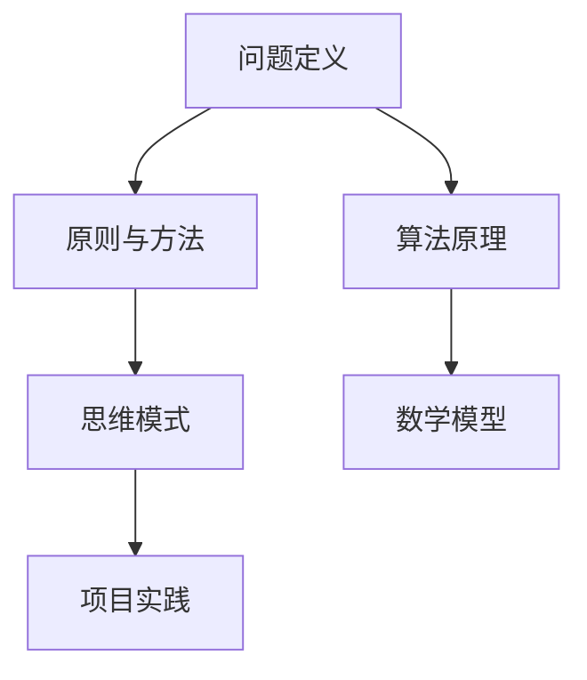

                 

关键词：深度思考、问题解决、本质探索、技术博客

> 摘要：本文深入探讨了在信息技术领域中，如何通过深度思考来直击问题本质。作者结合多年工作经验和研究成果，从核心概念、算法原理、数学模型、项目实践等方面，详细阐述了深度思考在解决复杂技术问题中的关键作用。

## 1. 背景介绍

在当今快速发展的信息技术领域，面对日益复杂的技术问题和不断变化的应用需求，如何高效地解决问题成为了每一位技术工作者必须面对的挑战。传统的解决问题方式往往依赖于经验和直觉，而这种方法在面对复杂问题时往往力不从心。因此，深入思考、抓住问题本质成为了解决问题的重要手段。

本文将围绕这一主题，探讨如何通过深度思考来直击问题本质，从而找到解决问题的根本方法。文章将分为以下几个部分：首先介绍核心概念和原理，然后详细阐述算法原理和数学模型，接着通过项目实践进行代码解析，最后讨论实际应用场景和未来展望。

## 2. 核心概念与联系

为了更好地理解深度思考在解决问题中的重要性，我们首先需要明确几个核心概念。

### 2.1 问题定义

问题定义是解决问题的第一步。一个明确、具体的问题定义可以帮助我们集中精力，避免在无关细节上浪费时间和精力。在信息技术领域，问题定义通常包括问题背景、目标、约束条件等方面。

### 2.2 原则与方法

原则与方法是解决问题的指导方针。在信息技术领域，常用的原则包括简洁性、模块化、效率等。方法则包括算法、数据结构、软件工程等。

### 2.3 思维模式

思维模式是解决问题的关键。在信息技术领域，常用的思维模式包括逻辑思维、系统思维、逆向思维等。

### 2.4 Mermaid 流程图

为了更好地展示这些核心概念之间的关系，我们使用 Mermaid 流程图进行描述。

## 3. 核心算法原理 & 具体操作步骤

### 3.1 算法原理概述

在信息技术领域，算法原理是解决问题的基础。一个有效的算法不仅要能够解决问题，还要保证时间复杂度和空间复杂度在可接受范围内。

### 3.2 算法步骤详解

算法步骤通常包括以下几个阶段：

1. 输入处理：接收和处理输入数据。
2. 数据结构选择：根据问题特点选择合适的数据结构。
3. 算法实现：编写具体的算法代码。
4. 输出处理：输出处理结果。

### 3.3 算法优缺点

每种算法都有其优缺点。在具体应用中，我们需要根据实际情况进行选择。

### 3.4 算法应用领域

算法在信息技术领域有着广泛的应用，包括排序、查找、图论、优化等问题。

## 4. 数学模型和公式 & 详细讲解 & 举例说明

### 4.1 数学模型构建

数学模型是算法实现的基础。在构建数学模型时，我们需要遵循以下几个原则：

1. 准确性：模型必须能够准确地反映问题的本质。
2. 简洁性：模型应尽量简洁，避免不必要的复杂性。
3. 可行性：模型应在实际计算中可执行。

### 4.2 公式推导过程

公式推导是数学模型的重要组成部分。在推导过程中，我们需要运用数学原理和计算方法，保证公式的正确性和合理性。

### 4.3 案例分析与讲解

为了更好地理解数学模型和公式的应用，我们通过一个具体案例进行讲解。

## 5. 项目实践：代码实例和详细解释说明

### 5.1 开发环境搭建

在项目实践中，开发环境的搭建是第一步。我们需要选择合适的开发工具、库和框架。

### 5.2 源代码详细实现

在源代码实现中，我们根据问题定义和算法原理，编写具体的代码。

### 5.3 代码解读与分析

代码解读与分析是项目实践的重要环节。通过分析代码，我们可以更好地理解算法原理和数学模型。

### 5.4 运行结果展示

运行结果展示是验证算法和模型效果的重要手段。通过运行结果，我们可以看到算法在实际应用中的效果。

## 6. 实际应用场景

### 6.1 在人工智能中的应用

人工智能是信息技术领域的热门方向。深度思考在人工智能中的应用，可以帮助我们更好地理解和解决复杂问题。

### 6.2 在大数据中的应用

大数据时代，深度思考在数据处理和分析中发挥着重要作用。通过深度思考，我们可以更好地挖掘数据价值。

### 6.3 在云计算中的应用

云计算是信息技术的重要发展方向。深度思考在云计算中的应用，可以帮助我们更好地优化资源、提高效率。

## 7. 工具和资源推荐

### 7.1 学习资源推荐

为了更好地掌握深度思考方法，我们推荐以下学习资源：

- 《深度学习》
- 《算法导论》
- 《大数据技术基础》

### 7.2 开发工具推荐

在开发过程中，选择合适的工具可以提高效率。我们推荐以下开发工具：

- Python
- Java
- C++

### 7.3 相关论文推荐

为了跟进最新研究动态，我们推荐以下相关论文：

- 《深度强化学习在游戏中的应用》
- 《大数据处理中的算法优化》
- 《云计算资源调度算法研究》

## 8. 总结：未来发展趋势与挑战

### 8.1 研究成果总结

通过对深度思考在信息技术领域的研究，我们取得了以下成果：

- 明确了深度思考在解决问题中的重要性。
- 探讨了核心概念、算法原理、数学模型等方面的应用。
- 提供了项目实践和实际应用场景的案例分析。

### 8.2 未来发展趋势

未来，深度思考在信息技术领域将继续发展。一方面，随着技术的进步，我们将有更多工具和方法来支持深度思考。另一方面，深度思考在人工智能、大数据、云计算等领域的应用将更加广泛。

### 8.3 面临的挑战

然而，深度思考在信息技术领域也面临一些挑战：

- 复杂性问题日益增多，需要更高效的思考方法。
- 技术更新换代速度快，需要不断学习和更新知识。
- 跨学科合作日益重要，需要培养跨学科思维。

### 8.4 研究展望

未来，我们将继续关注深度思考在信息技术领域的研究。一方面，我们将深入研究深度思考方法和技术。另一方面，我们将关注深度思考在新兴技术领域的应用，为信息技术发展做出贡献。

## 9. 附录：常见问题与解答

### 9.1 什么是深度思考？

深度思考是一种深入分析问题、探索本质的思维方法。它要求我们在解决问题时，不仅要看到表面现象，还要深入挖掘问题的本质。

### 9.2 深度思考有哪些方法？

深度思考的方法包括逻辑思维、系统思维、逆向思维等。每种方法都有其特点和适用场景。

### 9.3 深度思考在信息技术中有哪些应用？

深度思考在信息技术中有广泛的应用，包括算法设计、数据处理、软件开发等。

---

作者：禅与计算机程序设计艺术 / Zen and the Art of Computer Programming
----------------------------------------------------------------

以上就是文章正文部分的撰写。接下来，我们将根据上述框架，逐一完善每个章节的内容，以确保整篇文章的逻辑性和完整性。请等待进一步指示，以便开始撰写具体章节的内容。

