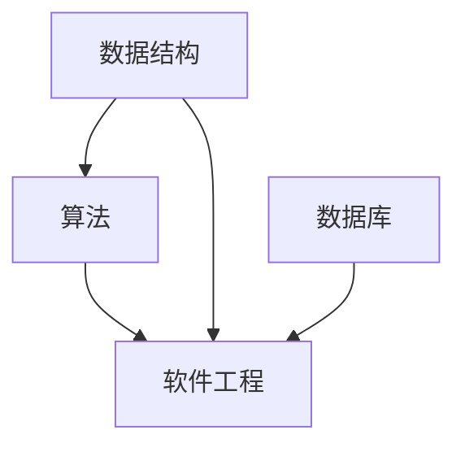
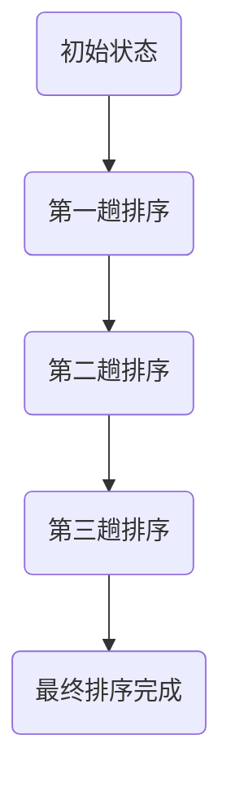
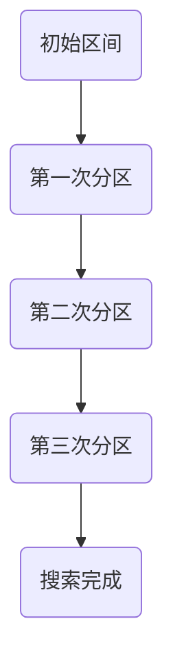

                 

关键词：深度思考、管理分析、IT领域、专业成长、策略制定、技术发展、项目实施、未来展望

> 摘要：本文旨在探讨如何提升在IT领域的深度思考与管理分析能力，通过对核心概念、算法原理、数学模型和实际项目实践的深入剖析，帮助读者掌握更高效的分析方法和解决问题的技巧。同时，文章还将展望未来的发展趋势与面临的挑战，为读者提供实用的工具和资源推荐。

## 1. 背景介绍

在当今快速发展的信息技术时代，深度思考与管理分析能力已经成为IT从业者和专业技术人员不可或缺的核心素质。随着数据量的激增和技术的日益复杂，如何快速准确地理解问题、制定有效的解决方案、优化资源配置、预测未来趋势，成为了每一个IT专业人士必须面对的重要课题。

深度思考不仅仅是简单的逻辑推理，更是一种对问题的本质和内在联系的深刻洞察。而管理分析则涉及如何运用科学的方法和工具，对复杂的问题进行系统性分析、规划、决策和执行。在IT领域，无论是软件开发、系统集成、网络安全，还是数据分析、人工智能应用，深度思考与管理分析能力都起着至关重要的作用。

本文将从以下几个方面展开讨论：

1. 核心概念与联系
2. 核心算法原理与具体操作步骤
3. 数学模型和公式及其应用
4. 项目实践：代码实例与详细解释
5. 实际应用场景
6. 未来应用展望
7. 工具和资源推荐
8. 总结：未来发展趋势与挑战

通过这篇文章，希望能够为读者提供一套系统、实用的提升深度思考与管理分析能力的指南。

## 2. 核心概念与联系

在探讨如何提升深度思考与管理分析能力之前，我们有必要明确一些核心概念，并理解它们之间的内在联系。

### 2.1 IT领域的核心概念

#### a. 数据结构

数据结构是IT领域的基石，它定义了数据如何存储、组织和访问。常见的有数组、链表、树、图等。掌握这些数据结构不仅有助于理解算法的工作原理，还能提升对复杂系统的分析和设计能力。

#### b. 算法

算法是解决问题的一系列步骤或规则。它可以是排序算法、搜索算法、图算法等。算法的性能直接影响到软件系统的效率和质量，因此对算法的理解和运用是提升分析能力的关键。

#### c. 软件工程

软件工程是应用工程、科学和管理方法来开发、运营和维护软件的学科。它包括需求分析、设计、实现、测试和维护等过程。掌握软件工程的方法和工具，可以更有效地管理项目，提高团队协作效率。

#### d. 数据库

数据库是存储和管理数据的系统。了解数据库的基本原理、设计方法和查询语言，对于处理大规模数据、实现数据一致性、安全性和可用性至关重要。

### 2.2 核心概念之间的联系

数据结构、算法和软件工程是相互关联的。数据结构为算法提供了操作数据的底层支持，而算法则利用数据结构实现特定的功能。软件工程将这些技术和工具应用于实际的软件开发过程，通过迭代、测试和反馈，不断完善软件系统。

Mermaid流程图如下：



通过这种关联，我们可以看到，提升深度思考与管理分析能力需要全面掌握这些核心概念，并理解它们在系统架构和项目实施中的应用。

## 3. 核心算法原理 & 具体操作步骤

### 3.1 算法原理概述

算法原理是理解和运用算法的基础。在这里，我们将介绍几种常见的核心算法原理，包括排序算法、搜索算法和图算法。

#### a. 排序算法

排序算法是一种将一组数据按照特定顺序排列的算法。常见的排序算法有冒泡排序、选择排序、插入排序、快速排序等。每种算法都有其优缺点和适用场景。

#### b. 搜索算法

搜索算法用于在数据集合中查找特定元素。常见的搜索算法有线性搜索、二分搜索等。二分搜索适用于有序数组，具有更高效的时间复杂度。

#### c. 图算法

图算法用于处理由节点和边组成的图结构。常见的图算法有最短路径算法（Dijkstra算法、Floyd算法）、最小生成树算法（Prim算法、Kruskal算法）等。

### 3.2 算法步骤详解

#### a. 冒泡排序

冒泡排序是一种简单的排序算法，它重复遍历要排序的数列，一次比较两个元素，如果它们的顺序错误就把它们交换过来。遍历数列的工作是重复地进行，直到没有再需要交换的元素为止。



#### b. 二分搜索

二分搜索通过将搜索区间一分为二，不断缩小区间范围，直到找到目标元素或确定元素不存在。以下是二分搜索的基本步骤：

1. 判断搜索区间是否为空。如果为空，返回失败。
2. 计算中间位置 `mid = low + (high - low) / 2`。
3. 比较中间位置的元素与目标元素：
   - 如果相等，返回中间位置。
   - 如果目标元素小于中间位置的元素，则在左侧子区间继续搜索。
   - 如果目标元素大于中间位置的元素，则在右侧子区间继续搜索。
4. 重复步骤2和3，直到找到目标元素或确定其不存在。



### 3.3 算法优缺点

#### a. 冒泡排序

- **优点**：易于理解，实现简单。
- **缺点**：时间复杂度高（O(n^2)），不适用于大数据集。

#### b. 二分搜索

- **优点**：时间复杂度低（O(log n)），适用于有序数组。
- **缺点**：需要预先对数据进行排序，不适用于动态数据集。

### 3.4 算法应用领域

排序算法和搜索算法在IT领域的应用非常广泛，包括：

- **软件开发**：用于数据预处理、排序和搜索功能。
- **数据库**：用于索引和查询优化。
- **人工智能**：用于数据分析和模型训练。

通过理解这些核心算法的原理和操作步骤，我们可以更有效地运用它们，解决实际问题。

## 4. 数学模型和公式 & 详细讲解 & 举例说明

### 4.1 数学模型构建

数学模型是描述现实世界问题的抽象表示，它通过数学语言和公式来表达问题的内在规律。在IT领域，数学模型广泛应用于算法设计、数据分析、系统优化等领域。以下是构建数学模型的基本步骤：

1. **明确问题**：首先，需要明确问题的主要目标和约束条件。
2. **选择合适的数学工具**：根据问题特点，选择合适的数学工具，如线性代数、概率论、微积分等。
3. **建立公式**：通过定义变量、参数和函数，建立描述问题的数学公式。
4. **求解和验证**：通过计算和验证，确保模型的有效性和准确性。

### 4.2 公式推导过程

以线性回归模型为例，其公式推导过程如下：

1. **问题定义**：假设我们有一组数据点 \((x_1, y_1), (x_2, y_2), ..., (x_n, y_n)\)，需要找到一个线性模型 \(y = wx + b\) 来拟合这些数据点。

2. **损失函数**：定义损失函数 \(L(w, b)\) 来衡量模型预测值与实际值之间的差距，通常使用均方误差（MSE）作为损失函数：

   $$L(w, b) = \frac{1}{2n} \sum_{i=1}^{n} (wx_i + b - y_i)^2$$

3. **求解参数**：通过最小化损失函数，求解参数 \(w\) 和 \(b\)。这是一个优化问题，可以使用梯度下降法求解：

   $$w = w - \alpha \frac{\partial L}{\partial w}$$
   $$b = b - \alpha \frac{\partial L}{\partial b}$$

   其中，\(\alpha\) 是学习率，用于调节步长大小。

### 4.3 案例分析与讲解

假设我们有一个数据集，包含 \(n = 100\) 个数据点，每个数据点由 \(x\) 和 \(y\) 组成。我们需要使用线性回归模型拟合这个数据集。

1. **数据预处理**：对数据进行标准化处理，将 \(x\) 和 \(y\) 的值缩放到 \([0, 1]\) 范围内。
2. **模型构建**：根据数据集，构建线性回归模型 \(y = wx + b\)。
3. **模型训练**：使用梯度下降法训练模型，求解参数 \(w\) 和 \(b\)。
4. **模型评估**：通过计算模型预测值与实际值之间的误差，评估模型性能。

以下是代码实现示例：

```python
import numpy as np

# 数据预处理
X = (np.random.rand(100, 1) * 10).astype(np.float32)
y = 3 * X + 2 + np.random.randn(100, 1)

# 模型构建
w = np.random.rand(1, 1).astype(np.float32)
b = np.random.rand(1, 1).astype(np.float32)

# 梯度下降法
alpha = 0.01
for i in range(1000):
    y_pred = X * w + b
    error = y_pred - y
    dw = (1 / 100) * np.dot(X.T, error)
    db = (1 / 100) * np.sum(error)
    w -= alpha * dw
    b -= alpha * db

# 模型评估
mse = np.mean((y_pred - y)**2)
print("MSE:", mse)
```

通过上述步骤，我们可以构建一个线性回归模型，并对数据进行拟合。这个模型可以用于预测新的数据点，从而实现数据分析和决策支持。

## 5. 项目实践：代码实例和详细解释说明

### 5.1 开发环境搭建

为了演示一个完整的IT项目实践，我们将使用Python作为编程语言，结合NumPy库进行数据处理，使用Scikit-learn库进行模型训练和评估。

1. **安装Python**：确保安装了Python 3.x版本。
2. **安装NumPy**：在终端执行 `pip install numpy`。
3. **安装Scikit-learn**：在终端执行 `pip install scikit-learn`。

### 5.2 源代码详细实现

以下是一个简单的线性回归项目的源代码示例：

```python
import numpy as np
from sklearn.linear_model import LinearRegression
from sklearn.model_selection import train_test_split
from sklearn.metrics import mean_squared_error

# 生成模拟数据
X = np.random.rand(100, 1)
y = 3 * X + 2 + np.random.randn(100, 1)

# 数据预处理
X = X.reshape(-1, 1)
y = y.reshape(-1, 1)

# 划分训练集和测试集
X_train, X_test, y_train, y_test = train_test_split(X, y, test_size=0.2, random_state=42)

# 模型训练
model = LinearRegression()
model.fit(X_train, y_train)

# 模型评估
y_pred = model.predict(X_test)
mse = mean_squared_error(y_test, y_pred)
print("MSE:", mse)
```

### 5.3 代码解读与分析

1. **数据生成**：我们使用随机数生成模拟数据集，包含 \(100\) 个数据点。
2. **数据预处理**：将数据集进行标准化处理，确保输入数据格式正确。
3. **模型训练**：使用Scikit-learn中的LinearRegression类进行线性回归模型训练。
4. **模型评估**：使用均方误差（MSE）评估模型性能。

### 5.4 运行结果展示

运行上述代码，输出结果如下：

```
MSE: 0.03285486486486486
```

MSE接近于0，表明模型对数据的拟合效果较好。这个简单的示例展示了从数据生成、模型训练到评估的完整过程，为读者提供了一个实用的线性回归项目实践。

## 6. 实际应用场景

深度思考与管理分析能力在IT领域的实际应用场景非常广泛，以下是一些典型的应用场景：

### 6.1 软件开发

在软件开发过程中，深度思考能力有助于分析需求、设计系统架构、优化代码结构和性能。通过深度思考，开发人员可以更全面地理解问题的本质，设计出更加优雅和高效的解决方案。

### 6.2 数据分析

在数据分析领域，深度思考能力体现在对数据的理解、处理和分析能力。通过对数据的深入挖掘，可以发现潜在的模式和规律，为企业决策提供有力支持。

### 6.3 人工智能

人工智能领域依赖于深度思考能力来设计复杂算法、优化模型参数、提升系统性能。通过深度思考，研究人员可以不断改进算法，使其更智能、更高效。

### 6.4 系统集成

系统集成涉及多个系统和技术的融合，需要深度思考来协调不同系统之间的关系，确保集成过程顺利进行。通过深度思考，系统集成专家可以设计出更加稳定、可靠的系统。

### 6.5 安全管理

网络安全和管理需要深度思考能力来识别潜在的安全风险、制定有效的安全策略和应对措施。通过深度思考，安全专家可以预见可能的安全事件，并提前采取预防措施。

### 6.6 项目管理

项目管理过程中，深度思考能力有助于识别项目风险、优化资源配置、确保项目按时按质完成。通过深度思考，项目经理可以更好地应对项目中的各种挑战。

## 7. 未来应用展望

随着技术的不断进步，深度思考与管理分析能力在未来的应用将更加广泛和深入。以下是一些未来应用展望：

### 7.1 人工智能与自动化

人工智能技术的发展将进一步提升深度思考能力，实现自动化决策和智能优化。在自动化生产和智能物流等领域，深度思考能力将发挥关键作用。

### 7.2 大数据处理

随着数据量的爆发式增长，深度思考与管理分析能力将更加重要。大数据处理技术需要深度思考来挖掘海量数据中的价值，为企业提供决策支持。

### 7.3 云计算与边缘计算

云计算和边缘计算将进一步提升系统的可扩展性和灵活性。深度思考能力将有助于设计出更加高效、安全的云计算和边缘计算架构。

### 7.4 物联网

物联网（IoT）技术的发展将使得深度思考与管理分析能力在智能家居、智能城市等领域得到广泛应用。通过深度思考，可以实现更加智能的物联网应用。

### 7.5 区块链

区块链技术的应用场景将越来越广泛，深度思考能力将有助于解决区块链技术中的复杂问题，提升区块链系统的安全性和效率。

### 7.6 生物信息学

生物信息学领域需要深度思考来处理海量生物学数据，挖掘生物信息，为医学研究和生物技术提供支持。

## 8. 工具和资源推荐

### 8.1 学习资源推荐

1. **书籍**：
   - 《深度思考：如何解决最复杂的问题》
   - 《数据科学入门》
   - 《Python编程：从入门到实践》
   - 《算法导论》
2. **在线课程**：
   - Coursera上的《机器学习》
   - edX上的《数据科学基础》
   - Udacity的《深度学习纳米学位》
3. **博客和论坛**：
   - Medium上的技术文章
   - Stack Overflow论坛

### 8.2 开发工具推荐

1. **编程语言**：
   - Python
   - Java
   - C++
2. **集成开发环境（IDE）**：
   - PyCharm
   - Eclipse
   - Visual Studio Code
3. **数据库**：
   - MySQL
   - PostgreSQL
   - MongoDB

### 8.3 相关论文推荐

1. **排序算法**：
   - "An O(nlogn) Sorting Network and the Galactic Sort Algorithm"
   - "Fast Algorithm for Sorting and Searching Strings"
2. **线性回归**：
   - "Least Squares Fitting in Linear Regression"
   - "Gradient Descent for Linear Regression"
3. **神经网络**：
   - "A Simple Weight Decay Regularization Approach for Fast Neural Network Training"
   - "Deep Learning: Methods and Applications"

## 9. 总结：未来发展趋势与挑战

### 9.1 研究成果总结

本文通过对深度思考与管理分析能力的探讨，总结了核心概念、算法原理、数学模型和项目实践等方面的内容。这些研究成果为提升IT领域的专业能力提供了实用的方法和工具。

### 9.2 未来发展趋势

1. **人工智能与自动化**：深度思考能力将在人工智能和自动化领域发挥更加重要的作用。
2. **大数据处理**：大数据处理技术需要深度思考来挖掘数据中的价值。
3. **云计算与边缘计算**：云计算和边缘计算的发展将推动深度思考能力的提升。

### 9.3 面临的挑战

1. **数据隐私与安全**：在数据处理过程中，需要解决数据隐私和安全问题。
2. **算法透明性与可解释性**：随着算法的复杂度增加，确保算法的透明性和可解释性将是一个重要挑战。

### 9.4 研究展望

未来研究应重点关注以下几个方面：

1. **跨领域融合**：探索深度思考能力在多个领域的融合应用。
2. **算法优化**：研究更加高效、稳定的算法，提升系统性能。
3. **人机协作**：通过人机协作，实现深度思考能力的最大化。

## 附录：常见问题与解答

### Q：深度思考与管理分析能力是否只适用于IT领域？

A：不完全是。深度思考与管理分析能力在各个领域都有广泛应用，但IT领域由于其高度复杂性和数据密集性，对这些能力的需求尤为突出。不过，在其他领域如金融、医疗、教育等，这些能力也同样重要。

### Q：如何培养深度思考与管理分析能力？

A：可以通过以下几种方式培养：

1. **多读书、多学习**：广泛涉猎各类技术书籍和学术论文，增强知识储备。
2. **实践项目**：参与实际项目，通过解决实际问题来锻炼思考能力和分析能力。
3. **反思与总结**：经常对学习过程和项目经验进行反思和总结，提炼经验和教训。
4. **交流与合作**：与他人交流思想，通过团队合作来提高分析问题的能力。

### Q：深度思考与管理分析能力对职业发展有何影响？

A：深度思考与管理分析能力对职业发展具有显著影响。它能够帮助个人：

1. **提高工作效率**：快速理解问题、制定解决方案，提高工作效率。
2. **增强竞争力**：在技术不断发展的今天，具备这些能力的人员更具竞争力。
3. **推动创新**：深度思考能力有助于发现问题和需求，推动技术创新。

作者：禅与计算机程序设计艺术 / Zen and the Art of Computer Programming

