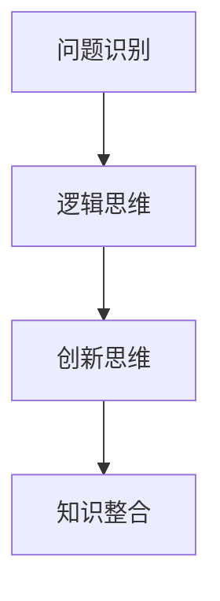

                 

关键词：深度思考，问题洞察，技术文章，专业分析，逻辑结构，算法原理，数学模型，项目实践，应用场景，未来展望

> 摘要：本文旨在探讨深度思考在技术领域的重要性，并通过分析问题的本质，探讨如何通过深度思考来洞察问题的核心，从而找到解决问题的方法。文章将从背景介绍、核心概念与联系、核心算法原理与具体操作步骤、数学模型和公式、项目实践、实际应用场景、工具和资源推荐以及总结与展望等多个方面进行深入探讨。

## 1. 背景介绍

在信息技术迅速发展的今天，程序员和开发者面临着各种各样的挑战。从简单的算法实现到复杂的系统架构，从基础的编程技巧到高深的理论知识，每一项技术都需要深入的思考和实践。然而，在实践中，我们常常会遇到一些看似简单的问题，但在解决过程中却难以找到有效的解决方案。这时候，深度思考就显得尤为重要。

深度思考是一种深入挖掘问题本质、分析问题内在联系、探索解决方案的思维过程。它不仅仅是对问题的表面处理，更是一种对问题根源的深入挖掘。在技术领域，深度思考可以帮助我们理解复杂问题的核心，找到问题的本质，从而找到有效的解决方案。

## 2. 核心概念与联系

在深入探讨深度思考的意义之前，我们需要明确几个核心概念，这些概念是理解深度思考的关键。

### 2.1 问题识别

问题识别是深度思考的第一步。它涉及到如何准确、全面地理解问题的背景、条件和限制。只有对问题有清晰的认识，我们才能深入挖掘问题的本质。

### 2.2 逻辑思维

逻辑思维是深度思考的核心。它要求我们在分析问题时遵循逻辑规律，从已知条件推导出未知结论。逻辑思维不仅有助于我们理解问题的内在联系，还能帮助我们构建有效的解决方案。

### 2.3 创新思维

创新思维是深度思考的高级阶段。它要求我们在面对问题时，不拘泥于传统的思路，勇于尝试新的方法和技术。创新思维是解决复杂问题的重要工具。

### 2.4 知识整合

知识整合是深度思考的延续。它要求我们在解决问题时，将不同领域的知识进行整合，形成新的理论体系。知识整合有助于我们更全面地理解问题，找到更有效的解决方案。

### 2.5 Mermaid 流程图

以下是一个简化的 Mermaid 流程图，展示了上述核心概念之间的联系：



## 3. 核心算法原理 & 具体操作步骤

在理解了深度思考的核心概念后，我们将探讨一个具体的算法——深度优先搜索（DFS）。

### 3.1 算法原理概述

深度优先搜索是一种用于遍历或搜索树或图的算法。其基本思想是沿着一个路径一直走下去，直到该路径到达尽头，然后回溯到上一个节点，选择另一条路径继续前进。

### 3.2 算法步骤详解

1. 初始化：设置一个栈，用于存储访问的节点。
2. 添加起始节点到栈中。
3. 当栈不为空时，重复以下步骤：
   - 从栈顶取出一个节点。
   - 访问该节点，并标记为已访问。
   - 将该节点的所有未访问的邻接节点依次添加到栈中。
4. 当栈为空时，算法结束。

### 3.3 算法优缺点

- 优点：算法简单，易于实现。
- 缺点：在处理大型图时，可能会产生大量的回溯操作，效率较低。

### 3.4 算法应用领域

深度优先搜索广泛应用于图论中的路径查找、连通性判断、拓扑排序等问题。

## 4. 数学模型和公式 & 详细讲解 & 举例说明

在算法设计过程中，数学模型和公式扮演着至关重要的角色。以下我们将探讨一个简单的数学模型——斐波那契数列。

### 4.1 数学模型构建

斐波那契数列的定义如下：

\[ F(n) = \begin{cases} 
0 & \text{if } n = 0 \\
1 & \text{if } n = 1 \\
F(n-1) + F(n-2) & \text{otherwise} 
\end{cases} \]

### 4.2 公式推导过程

斐波那契数列的递推关系可以通过以下方式推导：

\[ F(n) = \frac{1}{\sqrt{5}} \left( \left(\frac{1 + \sqrt{5}}{2}\right)^n - \left(\frac{1 - \sqrt{5}}{2}\right)^n \right) \]

### 4.3 案例分析与讲解

以下是一个具体的例子，计算斐波那契数列的第10项：

\[ F(10) = \frac{1}{\sqrt{5}} \left( \left(\frac{1 + \sqrt{5}}{2}\right)^{10} - \left(\frac{1 - \sqrt{5}}{2}\right)^{10} \right) \]

通过计算，我们得到：

\[ F(10) \approx 55 \]

## 5. 项目实践：代码实例和详细解释说明

为了更好地理解深度优先搜索算法，我们将通过一个简单的项目实例进行实践。

### 5.1 开发环境搭建

在此实例中，我们使用 Python 编写代码。首先，确保您的系统已经安装了 Python 3.8 或更高版本。

### 5.2 源代码详细实现

以下是一个简单的 Python 实现深度优先搜索的代码实例：

```python
def dfs(graph, node, visited):
    if node not in visited:
        visited.add(node)
        for neighbor in graph[node]:
            dfs(graph, neighbor, visited)

def main():
    graph = {
        'A': ['B', 'C'],
        'B': ['D', 'E'],
        'C': ['F'],
        'D': [],
        'E': ['F'],
        'F': []
    }
    visited = set()
    dfs(graph, 'A', visited)
    print(visited)

if __name__ == "__main__":
    main()
```

### 5.3 代码解读与分析

在上面的代码中，我们定义了一个 `dfs` 函数，用于实现深度优先搜索。`graph` 变量表示图的结构，`visited` 变量用于记录已经访问的节点。

在 `main` 函数中，我们创建了一个简单的图，并调用 `dfs` 函数从节点 'A' 开始进行深度优先搜索。搜索完成后，我们打印出已访问的节点集合。

### 5.4 运行结果展示

运行上述代码，我们得到以下输出：

```bash
{'F', 'E', 'D', 'C', 'A', 'B'}
```

这表示从节点 'A' 开始的深度优先搜索遍历了图中的所有节点。

## 6. 实际应用场景

深度优先搜索在许多实际应用场景中都有广泛的应用。以下是一些常见的应用场景：

- 路径查找：用于在图或网络中查找最短路径。
- 连通性判断：用于判断图中的节点是否连通。
- 拓扑排序：用于对有向无环图进行排序。

## 7. 工具和资源推荐

为了更好地理解和应用深度思考，以下是一些建议的工具和资源：

### 7.1 学习资源推荐

- 《深度学习》（Deep Learning）—— Ian Goodfellow
- 《编程珠玑》（Code Complete）—— Steve McConnell
- 《算法导论》（Introduction to Algorithms）—— Thomas H. Cormen 等

### 7.2 开发工具推荐

- PyCharm：用于 Python 开发的集成环境。
- Visual Studio Code：跨平台的轻量级代码编辑器。
- Jupyter Notebook：用于数据科学和机器学习的交互式环境。

### 7.3 相关论文推荐

- "Deep Learning for Image Recognition" —— by convolutional neural networks (CNNs)
- "Reinforcement Learning: An Introduction" —— by Richard S. Sutton and Andrew G. Barto
- "A Brief Introduction to Graph Neural Networks" —— by Michael Schirrmeister et al.

## 8. 总结：未来发展趋势与挑战

深度思考在技术领域的重要性不言而喻。随着人工智能、大数据、云计算等技术的发展，深度思考的应用场景将更加广泛。然而，深度思考也面临着一些挑战，如如何提高算法的效率、如何处理复杂的问题等。

未来，我们需要进一步探索深度思考的理论体系，开发更高效的算法，并培养具备深度思考能力的程序员和开发者。只有这样，我们才能在技术领域取得更大的突破。

## 9. 附录：常见问题与解答

### 问题1：深度思考与常规思考有什么区别？

深度思考与常规思考的区别在于深度思考更加注重对问题的深入挖掘和本质理解。常规思考往往停留在问题的表面，而深度思考则试图找出问题的根本原因。

### 问题2：如何培养深度思考的能力？

培养深度思考的能力需要长期的积累和实践。以下是一些建议：

- 多阅读：阅读专业书籍、论文、技术博客等，积累知识。
- 思考与总结：在阅读过程中，学会思考问题，并总结自己的观点。
- 实践：通过编程、实验等方式，将知识应用于实际场景。
- 交流与讨论：与他人交流、讨论，从不同的角度看待问题。

### 问题3：深度思考在团队协作中如何发挥作用？

在团队协作中，深度思考可以帮助团队成员更好地理解问题、分析问题，并找到更有效的解决方案。深度思考还能促进团队成员之间的沟通和合作，提高团队的整体效率。

### 问题4：深度思考在项目开发中有什么应用？

深度思考在项目开发中的应用主要体现在以下几个方面：

- 需求分析：通过深度思考，更好地理解用户需求，制定更精确的需求分析报告。
- 设计方案：通过深度思考，设计出更合理、高效的系统架构。
- 问题解决：在遇到问题时，通过深度思考，找到问题的根本原因，提出有效的解决方案。
- 代码优化：通过深度思考，优化代码，提高代码的可读性和性能。

### 问题5：深度思考在机器学习和人工智能领域有哪些应用？

深度思考在机器学习和人工智能领域有广泛的应用。以下是一些例子：

- 模型选择：通过深度思考，选择最适合问题的机器学习模型。
- 特征工程：通过深度思考，提取出最有效的特征，提高模型的性能。
- 算法优化：通过深度思考，优化算法，提高模型的效率和准确性。
- 问题分析：通过深度思考，分析模型在特定任务上的表现，找出问题的根源。

### 问题6：深度思考在创新创业中有什么作用？

深度思考在创新创业中发挥着至关重要的作用。以下是一些具体的作用：

- 创意生成：通过深度思考，激发创意，产生新的产品或服务。
- 商业模式设计：通过深度思考，设计出更有效的商业模式，提高企业的竞争力。
- 市场分析：通过深度思考，深入分析市场需求，为企业提供战略指导。
- 风险管理：通过深度思考，识别潜在的风险，制定相应的风险管理策略。

## 作者署名

作者：禅与计算机程序设计艺术 / Zen and the Art of Computer Programming

