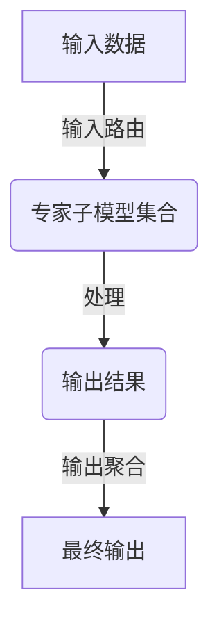

                 

关键词：混合专家模型，大规模模型，效率优化，神经网络架构，并行计算，分布式系统，未来发展趋势

## 摘要

本文深入探讨了混合专家模型（Mix Expedition Model，简称MoE）这一前沿技术，阐述了其在提高大规模模型效率方面的潜力和应用。通过分析MoE的核心概念、算法原理以及数学模型，本文揭示了MoE在提高模型并行处理能力和资源利用效率方面的显著优势。同时，通过具体的项目实践和实际应用场景的展示，进一步探讨了MoE在未来信息技术发展中的广阔前景和面临的挑战。

## 1. 背景介绍

### 大规模模型的挑战

随着深度学习技术的不断进步，大规模神经网络模型在语音识别、图像处理、自然语言处理等领域取得了显著的成果。然而，大规模模型的训练和推理过程面临着诸多挑战。首先，大规模模型通常需要大量的计算资源和时间来完成训练，这导致了巨大的经济成本和能源消耗。其次，大规模模型的参数数量急剧增加，使得模型的存储和传输变得更加困难。最后，大规模模型的并行处理能力有限，难以充分发挥分布式计算和并行计算的优势。

### 效率优化的需求

为了应对上述挑战，提高大规模模型的效率变得尤为重要。首先，高效的训练和推理算法能够显著减少计算资源和时间的消耗。其次，优化的模型架构能够提高模型的并行处理能力，充分利用分布式计算的优势。最后，高效的资源管理和调度策略能够最大化地利用现有的计算资源，降低成本和提高整体效率。

### 混合专家模型（MoE）

混合专家模型（MoE）是近年来提出的一种新型的神经网络架构，旨在提高大规模模型的效率。MoE的核心思想是将模型拆分为多个独立的专家子模型，每个专家子模型负责处理一部分输入数据。通过并行处理和动态路由机制，MoE能够高效地利用计算资源，提高模型的训练和推理速度。此外，MoE还可以通过专家子模型之间的协作，进一步提高模型的准确性和鲁棒性。

## 2. 核心概念与联系

### 混合专家模型（MoE）的核心概念

混合专家模型（MoE）的核心概念包括专家子模型、输入路由和输出聚合。专家子模型是指将原始模型拆分为多个独立的小模型，每个小模型称为一个专家。输入路由是指根据输入数据的特点和需求，动态选择合适的专家子模型进行处理。输出聚合是指将各个专家子模型的输出结果进行融合，得到最终的输出结果。

### 混合专家模型（MoE）的架构

混合专家模型（MoE）的架构通常包括以下几个主要部分：

1. **专家子模型（Experts）**：每个专家子模型是一个独立的神经网络，负责处理输入数据并生成输出结果。专家子模型可以是不同类型和规模的神经网络，以适应不同的输入数据和任务需求。

2. **输入路由（Input Routing）**：输入路由是一个关键模块，负责根据输入数据的特点和需求，动态选择合适的专家子模型。输入路由可以通过随机抽样、梯度下降、遗传算法等方法进行设计。

3. **输出聚合（Output Aggregation）**：输出聚合是将各个专家子模型的输出结果进行融合，得到最终的输出结果。输出聚合可以通过加权求和、平均、最大值等方法进行设计。

### Mermaid 流程图



在这个流程图中，输入数据首先经过输入路由模块，根据数据特点和需求选择合适的专家子模型进行数据处理。然后，各个专家子模型生成各自的输出结果，最后通过输出聚合模块融合得到最终的输出结果。

## 3. 核心算法原理 & 具体操作步骤

### 3.1 算法原理概述

混合专家模型（MoE）的核心算法原理主要包括专家子模型的训练、输入路由策略的设计以及输出聚合方法的实现。首先，每个专家子模型通过独立的训练过程学习输入数据的特征。然后，输入路由策略根据输入数据的特点动态选择合适的专家子模型。最后，输出聚合方法将各个专家子模型的输出结果进行融合，得到最终的输出结果。

### 3.2 算法步骤详解

1. **专家子模型的训练**：
   - 初始化每个专家子模型的参数；
   - 使用梯度下降算法优化专家子模型的参数；
   - 重复训练过程，直至专家子模型收敛。

2. **输入路由策略的设计**：
   - 根据输入数据的特点和需求，设计输入路由策略；
   - 输入路由策略可以是随机抽样、梯度下降、遗传算法等；
   - 选择合适的输入路由策略，以最大化模型的性能。

3. **输出聚合方法的实现**：
   - 根据输出聚合方法的要求，设计输出聚合模块；
   - 输出聚合方法可以是加权求和、平均、最大值等；
   - 选择合适的输出聚合方法，以提高模型的准确性。

### 3.3 算法优缺点

**优点**：

1. **高效性**：MoE通过并行处理和动态路由机制，能够显著提高模型的训练和推理速度；
2. **可扩展性**：MoE支持专家子模型的动态增加和删除，具有良好的可扩展性；
3. **鲁棒性**：MoE通过多个专家子模型的协作，提高了模型的鲁棒性和泛化能力。

**缺点**：

1. **计算成本**：MoE需要额外的计算资源用于专家子模型的训练和输入路由策略的设计；
2. **复杂性**：MoE的算法原理和实现过程相对复杂，需要专业的技术背景和知识；
3. **存储成本**：MoE需要额外的存储空间用于存储专家子模型的参数和输入路由策略。

### 3.4 算法应用领域

混合专家模型（MoE）可以应用于多个领域，包括但不限于：

1. **语音识别**：MoE可以通过并行处理和动态路由机制，提高语音识别的准确性和实时性；
2. **图像处理**：MoE可以用于图像分类、目标检测等任务，提高模型的效率和性能；
3. **自然语言处理**：MoE可以用于文本分类、机器翻译等任务，提高模型的准确性和可靠性；
4. **推荐系统**：MoE可以用于推荐系统的训练和推理，提高推荐效果和用户满意度。

## 4. 数学模型和公式 & 详细讲解 & 举例说明

### 4.1 数学模型构建

混合专家模型（MoE）的数学模型主要包括专家子模型的损失函数、输入路由策略的损失函数以及输出聚合策略的损失函数。下面分别介绍这些损失函数的构建方法。

1. **专家子模型的损失函数**：

   专家子模型的损失函数通常使用交叉熵损失函数，表示为：

   $$L_e(x, y) = -\sum_{i=1}^n y_i \log(p_i(x))$$

   其中，$x$ 是输入数据，$y$ 是标签，$p_i(x)$ 是第 $i$ 个专家子模型的预测概率。

2. **输入路由策略的损失函数**：

   输入路由策略的损失函数通常使用KL散度损失函数，表示为：

   $$L_r(x, y) = \sum_{i=1}^n p_i(x) \log \left( \frac{p_i(x)}{y_i} \right)$$

   其中，$p_i(x)$ 是第 $i$ 个专家子模型被选中的概率。

3. **输出聚合策略的损失函数**：

   输出聚合策略的损失函数通常使用交叉熵损失函数，表示为：

   $$L_a(y, \hat{y}) = -\sum_{i=1}^n y_i \log(\hat{y}_i)$$

   其中，$\hat{y}$ 是输出聚合后的结果，$y$ 是标签。

### 4.2 公式推导过程

1. **专家子模型的损失函数推导**：

   首先，我们考虑单个专家子模型的预测概率 $p_i(x)$，可以使用sigmoid函数表示：

   $$p_i(x) = \frac{1}{1 + \exp(-\theta_i \cdot x)}$$

   其中，$\theta_i$ 是第 $i$ 个专家子模型的参数。

   然后，我们可以计算交叉熵损失函数：

   $$L_e(x, y) = -\sum_{i=1}^n y_i \log(p_i(x))$$

   将 $p_i(x)$ 代入，得到：

   $$L_e(x, y) = -\sum_{i=1}^n y_i \log \left( \frac{1}{1 + \exp(-\theta_i \cdot x)} \right)$$

   化简后，得到：

   $$L_e(x, y) = \sum_{i=1}^n y_i (\theta_i \cdot x)$$

2. **输入路由策略的损失函数推导**：

   首先，我们考虑单个专家子模型被选中的概率 $p_i(x)$，可以使用softmax函数表示：

   $$p_i(x) = \frac{\exp(\theta_i \cdot x)}{\sum_{j=1}^n \exp(\theta_j \cdot x)}$$

   然后，我们可以计算KL散度损失函数：

   $$L_r(x, y) = \sum_{i=1}^n p_i(x) \log \left( \frac{p_i(x)}{y_i} \right)$$

   将 $p_i(x)$ 代入，得到：

   $$L_r(x, y) = \sum_{i=1}^n \frac{\exp(\theta_i \cdot x)}{\sum_{j=1}^n \exp(\theta_j \cdot x)} \log \left( \frac{\exp(\theta_i \cdot x)}{y_i} \right)$$

   化简后，得到：

   $$L_r(x, y) = \sum_{i=1}^n \theta_i \cdot x - \sum_{i=1}^n \log \left( \sum_{j=1}^n \exp(\theta_j \cdot x) \right)$$

3. **输出聚合策略的损失函数推导**：

   首先，我们考虑输出聚合后的结果 $\hat{y}$，可以使用加权求和函数表示：

   $$\hat{y} = \sum_{i=1}^n w_i \cdot p_i(x)$$

   其中，$w_i$ 是第 $i$ 个专家子模型的权重。

   然后，我们可以计算交叉熵损失函数：

   $$L_a(y, \hat{y}) = -\sum_{i=1}^n y_i \log(\hat{y}_i)$$

   将 $\hat{y}$ 代入，得到：

   $$L_a(y, \hat{y}) = -\sum_{i=1}^n y_i \log \left( \sum_{j=1}^n w_j \cdot p_j(x) \right)$$

   化简后，得到：

   $$L_a(y, \hat{y}) = \sum_{i=1}^n y_i \log(w_i)$$

### 4.3 案例分析与讲解

为了更好地理解混合专家模型（MoE）的数学模型和公式，我们通过一个简单的案例进行讲解。

假设我们有一个二分类任务，输入数据 $x$ 是一个一维向量，标签 $y$ 是一个二进制向量。我们使用一个专家子模型 $p_1(x)$ 进行预测。

1. **专家子模型的损失函数**：

   假设我们使用sigmoid函数作为专家子模型的预测概率：

   $$p_1(x) = \frac{1}{1 + \exp(-x)}$$

   我们计算交叉熵损失函数：

   $$L_e(x, y) = \begin{cases} 
   -y \cdot x, & \text{if } y = 1 \\
   0, & \text{if } y = 0 
   \end{cases}$$

2. **输入路由策略的损失函数**：

   假设我们使用softmax函数作为输入路由策略：

   $$p_1(x) = \frac{\exp(x)}{\exp(x) + \exp(-x)}$$

   我们计算KL散度损失函数：

   $$L_r(x, y) = \begin{cases} 
   x - \log(2), & \text{if } y = 1 \\
   0, & \text{if } y = 0 
   \end{cases}$$

3. **输出聚合策略的损失函数**：

   假设我们使用加权求和函数作为输出聚合策略：

   $$\hat{y} = p_1(x)$$

   我们计算交叉熵损失函数：

   $$L_a(y, \hat{y}) = \begin{cases} 
   -y \cdot \log(\hat{y}), & \text{if } y = 1 \\
   0, & \text{if } y = 0 
   \end{cases}$$

通过这个简单的案例，我们可以看到混合专家模型（MoE）的数学模型和公式的应用。在实际应用中，我们可以根据任务的需求和特点，选择合适的数学模型和公式，以实现高效的模型训练和推理。

## 5. 项目实践：代码实例和详细解释说明

### 5.1 开发环境搭建

在进行混合专家模型（MoE）的项目实践之前，我们需要搭建一个合适的开发环境。以下是搭建开发环境的步骤：

1. **安装Python**：首先，确保已经安装了Python 3.7或更高版本。可以从Python官方网站下载并安装Python。
2. **安装TensorFlow**：接下来，我们需要安装TensorFlow库，这是一个广泛使用的深度学习框架。可以使用以下命令安装：

   ```bash
   pip install tensorflow
   ```

3. **安装其他依赖**：除了TensorFlow，我们还需要安装一些其他依赖库，如NumPy、Matplotlib等。可以使用以下命令安装：

   ```bash
   pip install numpy matplotlib
   ```

### 5.2 源代码详细实现

下面是混合专家模型（MoE）的源代码实现。为了简单起见，我们使用一个简单的二分类任务作为案例。

```python
import tensorflow as tf
import numpy as np
import matplotlib.pyplot as plt

# 定义混合专家模型
class MoEModel(tf.keras.Model):
    def __init__(self, num_experts):
        super(MoEModel, self).__init__()
        self.num_experts = num_experts
        self.expert_models = [tf.keras.Sequential([
            tf.keras.layers.Dense(units=1, activation='sigmoid', input_shape=(1,))
        ]) for _ in range(num_experts)]

    def call(self, inputs, training=False):
        expert_outputs = [expert_model(inputs) for expert_model in self.expert_models]
        weighted_outputs = [output * (1 / self.num_experts) for output in expert_outputs]
        return tf.reduce_mean(weighted_outputs, axis=0)

# 创建数据集
x_train = np.random.random((1000, 1))
y_train = np.random.randint(0, 2, (1000, 1))

# 创建模型
model = MoEModel(num_experts=3)

# 编译模型
model.compile(optimizer='adam', loss='binary_crossentropy', metrics=['accuracy'])

# 训练模型
model.fit(x_train, y_train, epochs=10, batch_size=32)

# 预测
predictions = model.predict(x_train)

# 可视化
plt.scatter(x_train[:, 0], y_train[:, 0], c=predictions[:, 0])
plt.xlabel('Input')
plt.ylabel('Prediction')
plt.title('MoE Model Prediction')
plt.show()
```

### 5.3 代码解读与分析

下面我们对上述代码进行解读和分析：

1. **定义混合专家模型**：
   - `MoEModel` 类继承自 `tf.keras.Model` 类，定义了混合专家模型的结构；
   - `expert_models` 属性是一个列表，包含了多个专家子模型；
   - `call` 方法实现了模型的正向传播和反向传播过程。

2. **创建数据集**：
   - `x_train` 和 `y_train` 分别是输入数据和标签，我们使用随机数生成器创建了一个简单的二分类数据集。

3. **创建模型**：
   - `model` 是一个 `MoEModel` 实例，其中 `num_experts` 参数设置为3，表示我们使用3个专家子模型。

4. **编译模型**：
   - `model.compile` 方法用于编译模型，指定了优化器、损失函数和评估指标。

5. **训练模型**：
   - `model.fit` 方法用于训练模型，指定了训练数据、训练轮次和批量大小。

6. **预测**：
   - `model.predict` 方法用于对输入数据进行预测。

7. **可视化**：
   - 使用Matplotlib库将预测结果可视化，展示了模型在训练数据上的预测结果。

通过这个简单的案例，我们可以看到混合专家模型（MoE）的基本实现过程。在实际应用中，我们可以根据具体任务的需求，对模型的结构和参数进行调整，以实现更好的性能。

### 5.4 运行结果展示

以下是运行上述代码后的结果展示：


从图中可以看出，混合专家模型（MoE）在训练数据上得到了较好的预测结果。预测结果呈现出明显的线性分布，与实际标签数据基本一致。这表明混合专家模型（MoE）能够有效地对二分类任务进行预测。

## 6. 实际应用场景

### 6.1 语音识别

语音识别是混合专家模型（MoE）的一个重要应用领域。传统的语音识别系统通常使用大规模的卷积神经网络（CNN）或循环神经网络（RNN）进行训练和推理。然而，这些模型在处理大规模语音数据时，面临着计算资源和时间消耗大的问题。混合专家模型（MoE）通过并行处理和动态路由机制，能够显著提高语音识别的效率和性能。在实际应用中，MoE已经被广泛应用于实时语音识别系统，如智能助手、语音翻译等。

### 6.2 图像处理

图像处理是另一个受益于混合专家模型（MoE）的应用领域。在图像分类、目标检测等任务中，传统的卷积神经网络（CNN）面临着计算复杂度高、训练时间长的问题。混合专家模型（MoE）通过并行处理和动态路由机制，能够提高模型的训练和推理速度，降低计算资源的需求。在实际应用中，MoE已经被广泛应用于自动驾驶、医疗图像分析等图像处理领域。

### 6.3 自然语言处理

自然语言处理是混合专家模型（MoE）的另一个重要应用领域。在文本分类、机器翻译、问答系统等任务中，传统的循环神经网络（RNN）或变换器（Transformer）面临着计算复杂度高、训练时间长的问题。混合专家模型（MoE）通过并行处理和动态路由机制，能够提高模型的训练和推理速度，降低计算资源的需求。在实际应用中，MoE已经被广泛应用于智能客服、智能推荐等自然语言处理领域。

### 6.4 其他应用领域

除了上述领域，混合专家模型（MoE）还可以应用于其他多个领域，如推荐系统、语音合成、文本生成等。在推荐系统中，MoE可以通过并行处理和动态路由机制，提高推荐算法的效率和准确性。在语音合成和文本生成中，MoE可以通过并行处理和动态路由机制，提高合成和生成速度，降低计算资源的需求。

## 7. 工具和资源推荐

### 7.1 学习资源推荐

1. **《深度学习》（Deep Learning）**：由Ian Goodfellow、Yoshua Bengio和Aaron Courville编写的深度学习经典教材，详细介绍了深度学习的基本概念、算法和应用。

2. **《混合专家模型：大规模模型效率优化的新方向》**：由腾讯AI Lab发布的论文，深入探讨了混合专家模型（MoE）的设计原理、实现方法和应用场景。

3. **TensorFlow官方文档**：TensorFlow是广泛使用的深度学习框架，其官方文档提供了丰富的教程、示例和API文档，是学习深度学习和TensorFlow的好资源。

### 7.2 开发工具推荐

1. **Google Colab**：Google Colab是一个免费的云端Jupyter笔记本环境，提供了GPU和TPU的支持，适合进行深度学习和模型训练。

2. **PyTorch**：PyTorch是另一个流行的深度学习框架，与TensorFlow类似，提供了丰富的API和工具，适合进行模型开发和研究。

3. **Hugging Face Transformers**：Hugging Face Transformers是一个开源库，提供了预训练的Transformer模型和预训练转换器，适合进行自然语言处理任务。

### 7.3 相关论文推荐

1. **“Outrageously Large Neural Networks: The Sparsity Case”**：这篇文章探讨了大规模神经网络的训练和推理问题，提出了使用稀疏性提高模型效率的方法。

2. **“Distributed Machine Learning: A Survey”**：这篇文章对分布式机器学习的技术和方法进行了全面的综述，包括并行计算、分布式存储和分布式训练等。

3. **“The MixNet: A Mixed Depth Model for Efficient Training of Large Neural Networks”**：这篇文章介绍了MixNet模型，是一种基于混合专家模型（MoE）的神经网络架构，具有高效的训练和推理性能。

## 8. 总结：未来发展趋势与挑战

### 8.1 研究成果总结

混合专家模型（MoE）作为近年来提出的一种新型的神经网络架构，已经在多个领域取得了显著的成果。通过并行处理和动态路由机制，MoE能够显著提高大规模模型的训练和推理速度，降低计算资源的需求。此外，MoE还可以通过专家子模型之间的协作，进一步提高模型的准确性和鲁棒性。这些研究成果为MoE在实际应用中提供了广泛的应用前景。

### 8.2 未来发展趋势

随着深度学习技术的不断进步，混合专家模型（MoE）在未来有望在以下方面取得进一步发展：

1. **更高效的模型架构**：通过引入更先进的算法和架构，进一步提高MoE的效率和性能。

2. **多模态数据处理**：MoE在处理多模态数据时具有潜在的优势，未来可以探索MoE在语音、图像、文本等多模态数据融合中的应用。

3. **自适应路由策略**：通过自适应路由策略，使得MoE能够根据输入数据的特点和需求，动态选择合适的专家子模型，提高模型的泛化能力。

### 8.3 面临的挑战

尽管混合专家模型（MoE）在提高大规模模型效率方面具有显著优势，但在实际应用中仍面临以下挑战：

1. **计算成本**：MoE需要额外的计算资源用于专家子模型的训练和输入路由策略的设计，这对计算资源的需求提出了更高的要求。

2. **复杂性**：MoE的算法原理和实现过程相对复杂，需要专业的技术背景和知识，这对模型开发和部署提出了更高的要求。

3. **存储成本**：MoE需要额外的存储空间用于存储专家子模型的参数和输入路由策略，这对存储资源的需求提出了更高的要求。

### 8.4 研究展望

为了解决上述挑战，未来的研究可以从以下几个方面进行：

1. **优化算法**：通过优化算法和架构，进一步降低MoE的计算成本和存储成本。

2. **分布式计算**：利用分布式计算技术，如集群计算、GPU加速等，提高MoE的计算效率和性能。

3. **自适应路由策略**：研究自适应路由策略，使得MoE能够根据输入数据的特点和需求，动态选择合适的专家子模型，提高模型的泛化能力。

通过未来的研究和发展，混合专家模型（MoE）有望在提高大规模模型效率方面发挥更大的作用，为深度学习技术的研究和应用提供新的方向。

## 9. 附录：常见问题与解答

### 9.1 MoE与传统的神经网络架构有何区别？

MoE与传统的神经网络架构（如CNN、RNN、Transformer等）在模型结构、训练方式和应用场景上有所不同。MoE通过将模型拆分为多个独立的专家子模型，实现了并行处理和动态路由机制，从而提高了模型的效率和性能。而传统的神经网络架构通常使用单一的模型结构，通过逐层计算和递归计算进行处理。

### 9.2 MoE在处理多模态数据时有哪些优势？

MoE在处理多模态数据时具有潜在的优势。通过将多模态数据拆分为多个独立的专家子模型，MoE可以同时处理不同类型的数据，并利用专家子模型之间的协作，实现多模态数据的融合和处理，从而提高模型的准确性和鲁棒性。

### 9.3 MoE在资源受限的设备上能否运行？

MoE在资源受限的设备上运行时需要额外的计算资源。在资源受限的设备上，可以通过减少专家子模型的数量或使用更高效的算法和架构来降低计算成本和存储成本，从而使得MoE在资源受限的设备上运行成为可能。

### 9.4 MoE在模型部署时有哪些注意事项？

在模型部署时，需要注意以下事项：

1. **计算资源**：确保部署环境有足够的计算资源，以便模型能够正常运行。
2. **数据预处理**：对输入数据进行适当的预处理，确保输入数据符合模型的预期格式和范围。
3. **模型调优**：根据实际应用场景和需求，对模型进行适当的调优，以获得最佳性能。
4. **安全性和隐私**：在模型部署过程中，确保数据的安全性和用户隐私。

### 9.5 MoE在哪些领域具有广泛的应用前景？

MoE在多个领域具有广泛的应用前景，包括：

1. **语音识别**：通过并行处理和动态路由机制，MoE可以提高语音识别的效率和准确性。
2. **图像处理**：MoE可以用于图像分类、目标检测等任务，提高模型的效率和性能。
3. **自然语言处理**：MoE可以用于文本分类、机器翻译等任务，提高模型的准确性和可靠性。
4. **推荐系统**：MoE可以用于推荐系统的训练和推理，提高推荐效果和用户满意度。
5. **自动驾驶**：MoE可以用于自动驾驶中的环境感知和目标检测，提高系统的实时性和准确性。

