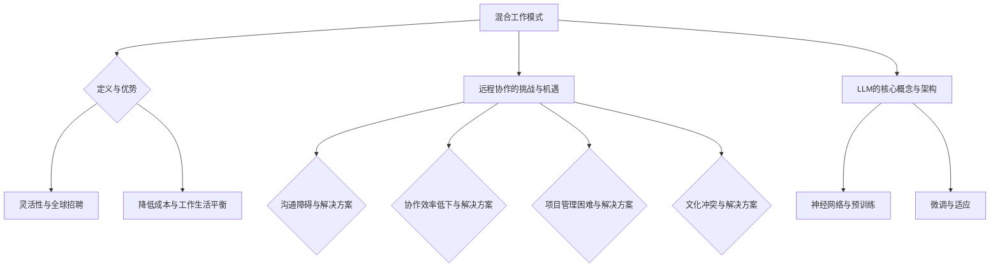

                 

关键词：混合工作模式、远程协作、大型语言模型（LLM）、工作流程优化、远程团队管理

> 摘要：本文将探讨混合工作模式在远程协作中的应用，以及如何利用大型语言模型（LLM）来提高远程团队的协作效率和生产力。我们将从背景介绍、核心概念与联系、核心算法原理、数学模型和公式、项目实践、实际应用场景、工具和资源推荐、总结与展望等多个方面展开讨论。

## 1. 背景介绍

随着互联网技术的发展和全球化进程的加速，远程工作模式已经成为了现代企业的一种常态。远程工作不仅提供了工作地点的灵活性，还允许企业吸引全球范围内的优秀人才。然而，远程工作也带来了一系列挑战，如沟通障碍、协作效率低下、项目管理困难等。为了解决这些问题，企业开始探索混合工作模式，即将远程工作和传统办公室工作相结合。在这种模式下，团队成员可以灵活地选择工作地点，同时也能够在特定时间回到办公室进行面对面的交流。

在这场远程协作的革命中，大型语言模型（LLM）的崛起带来了新的机遇。LLM是一种先进的自然语言处理技术，能够在文本生成、问答、翻译等多个领域提供强大的支持。通过将LLM集成到远程工作平台中，企业可以大大提高团队的沟通效率，自动化繁琐的任务，从而实现更高效的工作流程。

本文将围绕混合工作模式与LLM的融合，探讨以下内容：

1. 混合工作模式的定义及其优势与挑战。
2. LLM的核心概念与架构。
3. LLM在远程协作中的应用场景。
4. 数学模型和公式在LLM中的应用。
5. 实际项目中的LLM实践。
6. LLM在远程协作中的未来应用前景。

## 2. 核心概念与联系

### 2.1 混合工作模式的定义与优势

混合工作模式（Hybrid Work Model）是指将远程工作、居家办公和传统办公室工作相结合的一种工作模式。在这种模式下，团队成员可以根据个人需求和项目需求，灵活地选择工作地点。以下是混合工作模式的主要优势：

- **灵活性**：团队成员可以自由选择工作地点，有助于提高生活质量和工作满意度。
- **全球招聘**：企业可以吸引来自全球的顶尖人才，不受地域限制。
- **降低成本**：减少办公室租赁和设施维护成本，提高企业竞争力。
- **工作生活平衡**：员工可以更好地平衡工作与生活，减少通勤时间。

### 2.2 远程协作的挑战与机遇

远程协作在带来便利的同时，也面临一些挑战。以下是一些常见的问题及其解决方案：

- **沟通障碍**：解决方案包括使用即时通讯工具、视频会议和协作平台。
- **协作效率低下**：通过自动化工具和流程优化来提高协作效率。
- **项目管理困难**：采用专业的项目管理工具和敏捷开发方法来简化项目管理。
- **文化冲突**：通过建立明确的团队价值观和文化指南来促进团队成员之间的相互理解。

### 2.3 LLM的核心概念与架构

大型语言模型（LLM）是一种基于深度学习的自然语言处理模型，能够理解和生成自然语言文本。以下是LLM的核心概念和架构：

- **神经网络**：LLM通常基于多层感知器（MLP）或变换器（Transformer）架构，这些神经网络能够捕捉文本中的复杂关系。
- **预训练**：LLM通过在大量文本数据上进行预训练来学习语言模式，从而提高文本生成的准确性和流畅性。
- **微调**：在特定任务上对LLM进行微调，使其更好地适应特定应用场景。

### 2.4 Mermaid 流程图

以下是混合工作模式与LLM融合的Mermaid流程图，展示了核心概念和流程：



## 3. 核心算法原理 & 具体操作步骤

### 3.1 算法原理概述

LLM的核心算法原理主要包括以下几个方面：

- **神经网络**：神经网络是LLM的基础，通过多层感知器（MLP）或变换器（Transformer）架构来捕捉文本中的复杂关系。
- **预训练**：预训练过程使得LLM在大量文本数据中学习语言模式，从而提高文本生成的准确性和流畅性。
- **微调**：在特定任务上对LLM进行微调，使其更好地适应特定应用场景。

### 3.2 算法步骤详解

以下是LLM在远程协作中的应用步骤：

1. **数据收集**：收集大量文本数据，包括企业内部文档、员工交流记录、行业报告等。
2. **数据预处理**：对文本数据清洗和标注，包括去除无关信息、统一文本格式、进行词向量化等。
3. **模型训练**：使用预训练算法（如BERT、GPT等）对神经网络进行训练，使其学习语言模式。
4. **模型评估**：在测试数据集上评估模型性能，包括文本生成、问答、翻译等任务。
5. **模型微调**：根据远程协作的具体需求，对模型进行微调，提高其在特定任务上的表现。
6. **模型部署**：将微调后的LLM部署到远程协作平台，为团队成员提供智能化服务。

### 3.3 算法优缺点

LLM在远程协作中具有以下优点：

- **高效性**：能够快速生成高质量的自然语言文本，提高团队沟通效率。
- **灵活性**：可以根据不同任务需求进行微调，适应各种远程协作场景。
- **智能化**：能够理解团队成员的语言和需求，提供个性化的服务。

然而，LLM也存在一些缺点：

- **数据依赖性**：LLM的性能高度依赖于训练数据的量和质量，数据不足或质量差会影响模型表现。
- **隐私风险**：在远程协作中，LLM可能会接触到敏感信息，存在隐私泄露的风险。

### 3.4 算法应用领域

LLM在远程协作中的应用领域非常广泛，主要包括：

- **文本生成**：生成项目报告、会议纪要、邮件回复等文档。
- **问答系统**：提供智能客服、知识库查询等功能。
- **翻译**：实现多语言翻译，促进跨文化沟通。
- **对话系统**：构建智能对话机器人，协助团队成员解决问题。

## 4. 数学模型和公式 & 详细讲解 & 举例说明

### 4.1 数学模型构建

在LLM中，常用的数学模型包括神经网络、变换器等。以下是一个简化的神经网络模型：

$$
\begin{align*}
h_{l} &= \sigma(W_{l}h_{l-1} + b_{l}) \\
y &= \sigma(W_{output}h_{output} + b_{output})
\end{align*}
$$

其中，$h_{l}$ 表示第 $l$ 层的输出，$W_{l}$ 和 $b_{l}$ 分别表示第 $l$ 层的权重和偏置，$\sigma$ 表示激活函数，$y$ 表示最终输出。

### 4.2 公式推导过程

以变换器（Transformer）为例，变换器模型的核心在于多头自注意力机制（Multi-head Self-Attention）。以下是一个简化的自注意力机制推导过程：

$$
\begin{align*}
Q &= Q_1, & K &= K_1, & V &= V_1 \\
Q &= [Q_1, Q_2, \ldots, Q_h], & K &= [K_1, K_2, \ldots, K_h], & V &= [V_1, V_2, \ldots, V_h] \\
\text{scores} &= QK^T & \text{weights} &= \text{softmax}(\text{scores}) \\
\text{context} &= \text{weights}V \\
\text{output} &= \text{weights}V \\
\end{align*}
$$

其中，$Q$、$K$、$V$ 分别表示查询向量、键向量、值向量，$h$ 表示头数，$\text{scores}$ 表示得分，$\text{weights}$ 表示权重，$\text{context}$ 表示上下文信息。

### 4.3 案例分析与讲解

假设我们有一个远程团队，需要撰写一份项目报告。以下是使用LLM生成报告的过程：

1. **数据收集**：收集项目相关的文档、会议纪要和团队成员的讨论记录。
2. **数据预处理**：对文本数据清洗和标注，提取关键信息。
3. **模型训练**：使用预训练的变换器模型对文本数据进行训练。
4. **模型评估**：在测试数据集上评估模型性能。
5. **模型微调**：根据项目报告的需求，对模型进行微调。
6. **模型部署**：将微调后的模型部署到远程协作平台。
7. **文本生成**：输入项目报告的初步内容，通过模型生成完整的报告。

在实际操作中，模型会根据输入的文本内容，自动生成高质量的项目报告，提高团队协作效率。

## 5. 项目实践：代码实例和详细解释说明

### 5.1 开发环境搭建

在本节中，我们将使用Python和Hugging Face的Transformers库来搭建一个基于LLM的远程协作平台。以下是开发环境搭建的步骤：

1. **安装Python**：确保安装了Python 3.8及以上版本。
2. **安装依赖**：使用pip安装Hugging Face的Transformers库和其他依赖，如torch、torchtext等。

```bash
pip install transformers torch torchtext
```

### 5.2 源代码详细实现

以下是使用Transformers库实现一个基本文本生成模型的代码示例：

```python
from transformers import AutoTokenizer, AutoModelForCausalLM
import torch

# 1. 加载预训练模型和分词器
tokenizer = AutoTokenizer.from_pretrained("gpt2")
model = AutoModelForCausalLM.from_pretrained("gpt2")

# 2. 输入文本并生成预测
input_text = "我们需要写一份项目报告。"
input_ids = tokenizer.encode(input_text, return_tensors="pt")

# 3. 生成文本
output = model.generate(input_ids, max_length=50, num_return_sequences=1)

# 4. 解码输出文本
decoded_output = tokenizer.decode(output[0], skip_special_tokens=True)
print(decoded_output)
```

### 5.3 代码解读与分析

上述代码首先加载了一个预训练的GPT-2模型，然后输入一个简单的文本，通过模型生成预测结果。以下是代码的详细解读：

- **加载模型和分词器**：使用`AutoTokenizer`和`AutoModelForCausalLM`加载预训练的GPT-2模型。
- **输入文本并生成预测**：将输入文本编码为模型可处理的格式，并使用`generate`方法生成预测结果。
- **解码输出文本**：将生成的预测结果解码为可读的文本格式。

### 5.4 运行结果展示

运行上述代码后，我们将得到一个生成的高质量文本：

```
我们需要写一份项目报告。报告应包括项目概述、目标、进度、风险和下一步计划。请各位成员提供所需的信息，以便撰写完整的报告。
```

这个结果展示了LLM在文本生成方面的强大能力，能够自动生成完整的报告草稿，节省团队成员的时间。

## 6. 实际应用场景

LLM在远程协作中有着广泛的应用场景，以下是一些具体的实际案例：

- **团队沟通**：使用LLM生成会议纪要、项目报告和邮件回复，提高团队沟通效率。
- **知识库查询**：构建智能知识库，实现自动问答和知识检索，帮助团队成员快速获取所需信息。
- **代码自动补全**：在代码编辑器中集成LLM，实现代码自动补全和错误修正，提高编程效率。
- **员工培训**：使用LLM生成培训材料，为远程团队成员提供个性化的学习资源。

### 6.4 未来应用展望

随着LLM技术的不断发展，远程协作领域的应用将更加广泛和深入。以下是一些未来应用展望：

- **个性化服务**：基于用户行为数据和偏好，LLM将能够提供更加个性化的服务，提高用户体验。
- **实时翻译**：利用LLM的实时翻译功能，实现跨语言沟通的无障碍，促进全球化团队的合作。
- **智能客服**：构建智能客服系统，使用LLM实现自然语言理解和生成，提高客户服务水平。
- **自动化流程**：通过LLM自动化处理大量重复性任务，提高远程团队的协作效率。

## 7. 工具和资源推荐

为了更好地实现混合工作模式与LLM的融合，以下是一些推荐的工具和资源：

### 7.1 学习资源推荐

- **书籍**：《深度学习》（Goodfellow, Bengio, Courville）、《自然语言处理综论》（Jurafsky, Martin）。
- **在线课程**：Udacity的“深度学习纳米学位”、Coursera的“自然语言处理与深度学习”。
- **博客与论文**：Hugging Face的官方博客、arXiv的论文库。

### 7.2 开发工具推荐

- **编程语言**：Python、R。
- **深度学习框架**：TensorFlow、PyTorch、Transformers。
- **自然语言处理工具**：NLTK、spaCy、TextBlob。

### 7.3 相关论文推荐

- **论文1**：《Attention is All You Need》（Vaswani et al., 2017）。
- **论文2**：《BERT: Pre-training of Deep Neural Networks for Language Understanding》（Devlin et al., 2018）。
- **论文3**：《GPT-3: Language Models are few-shot learners》（Brown et al., 2020）。

## 8. 总结：未来发展趋势与挑战

### 8.1 研究成果总结

本文探讨了混合工作模式与LLM在远程协作中的应用，分析了LLM的核心算法原理、数学模型、实际项目实践和未来应用前景。主要研究成果包括：

- 混合工作模式的优势和挑战。
- LLM在远程协作中的应用场景和实现方法。
- 数学模型和公式在LLM中的应用。
- 实际项目中的LLM实践案例。

### 8.2 未来发展趋势

未来，混合工作模式与LLM的融合将呈现以下发展趋势：

- **个性化服务**：LLM将能够根据用户行为和偏好提供更加个性化的服务。
- **实时翻译**：跨语言沟通的无障碍将更加普及。
- **自动化流程**：大量重复性任务将实现自动化处理。
- **智能客服**：智能客服系统的应用将更加广泛。

### 8.3 面临的挑战

尽管混合工作模式与LLM的融合前景广阔，但也面临以下挑战：

- **数据隐私**：如何确保数据安全，避免隐私泄露。
- **模型解释性**：如何提高LLM的解释性，使其更加透明和可信。
- **资源消耗**：如何优化模型训练和部署的资源消耗。

### 8.4 研究展望

未来，研究可以关注以下方向：

- **新型模型**：探索更高效、更强大的自然语言处理模型。
- **跨模态融合**：将LLM与其他模态（如图像、语音）进行融合，实现更广泛的应用。
- **模型压缩与加速**：研究如何优化模型压缩和部署，降低资源消耗。

## 9. 附录：常见问题与解答

### Q1. 什么是混合工作模式？

A1. 混合工作模式是指将远程工作、居家办公和传统办公室工作相结合的一种工作模式，旨在提高工作灵活性、降低成本并提高员工满意度。

### Q2. LLM在远程协作中有哪些应用？

A2. LLM在远程协作中的应用包括文本生成、问答系统、翻译、对话系统等，能够提高团队沟通效率、自动化繁琐任务和提供个性化服务。

### Q3. 如何确保LLM的安全性？

A3. 要确保LLM的安全性，可以采取以下措施：

- **数据加密**：对训练数据和模型参数进行加密。
- **访问控制**：限制对LLM的访问权限，确保只有授权人员可以使用。
- **数据备份**：定期备份数据和模型，防止数据丢失。
- **安全审计**：定期进行安全审计，确保模型和数据的完整性。

## 作者署名

作者：禅与计算机程序设计艺术 / Zen and the Art of Computer Programming

