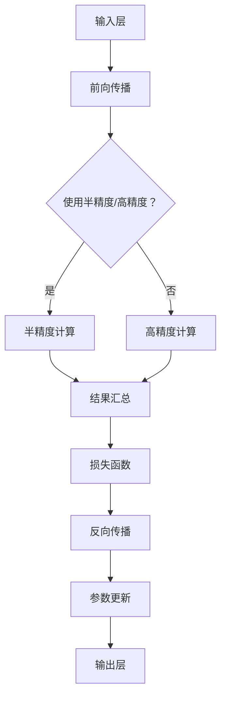

                 

关键词：混合精度训练、深度学习、浮点精度、GPU加速、数值稳定性、算法优化

> 摘要：本文将深入探讨混合精度训练技术在深度学习中的应用。通过分析其核心概念、算法原理、数学模型、实践案例以及未来趋势，旨在帮助读者全面了解和掌握混合精度训练的实战技巧，以实现平衡模型的精度与训练效率。

## 1. 背景介绍

在深度学习领域，随着神经网络模型复杂度和参数规模的迅速增长，对计算资源的消耗也越来越大。特别是训练过程中使用的浮点运算，通常需要高精度的浮点数（如双精度浮点数，即64位浮点数）来保证模型的稳定性和准确性。然而，高精度浮点数的运算不仅需要更多的内存空间，还会导致运算速度的显著下降，从而降低训练效率。

为了在保证模型精度和稳定性的同时，提高训练效率，混合精度训练技术应运而生。混合精度训练利用了半精度浮点数（如16位浮点数，即半精度浮点数）来加速运算，并通过一定的策略来管理精度损失。这一技术已经成为深度学习领域的重要研究方向，广泛应用于各种神经网络模型和大规模数据集的训练中。

## 2. 核心概念与联系

### 2.1 核心概念

- **半精度浮点数（Half-Precision Floating-Point）**：半精度浮点数是一种使用16位来表示浮点数的格式，相比32位的单精度浮点数和64位的双精度浮点数，半精度浮点数可以显著减少内存使用和计算时间。
  
- **精度损失（Precision Loss）**：由于半精度浮点数的位数限制，它在表示某些数值时可能会出现精度损失。这种损失可能会导致模型的输出结果与预期有较大偏差。

- **混合精度训练（Mixed-Precision Training）**：混合精度训练是一种结合半精度浮点数和高精度浮点数的训练方法。通过在训练过程中动态调整浮点数的精度，以平衡模型精度与训练效率。

### 2.2 混合精度训练架构

下面是混合精度训练的 Mermaid 流程图，展示了其核心概念和联系：



## 3. 核心算法原理 & 具体操作步骤

### 3.1 算法原理概述

混合精度训练的核心思想是在训练过程中灵活地切换使用半精度浮点数和高精度浮点数，以达到优化计算效率和保持模型精度的目的。其基本步骤如下：

1. **初始化**：根据模型的复杂度和计算资源，设置半精度浮点数和高精度浮点数的使用策略。
2. **前向传播**：在正向传播过程中，根据设定策略，部分或全部使用半精度浮点数进行计算。
3. **损失计算**：使用高精度浮点数计算损失函数，确保损失计算的准确性。
4. **反向传播**：在反向传播过程中，同样根据设定策略，部分或全部使用半精度浮点数进行计算。
5. **参数更新**：使用高精度浮点数更新模型参数，以保持参数的精度。

### 3.2 算法步骤详解

以下是混合精度训练的详细步骤：

1. **初始化**

   ```python
   import torch
   torch.set_default_tensor_type('torch.HalfTensor')
   ```

   这段代码设置了默认的浮点数类型为半精度浮点数。在实际应用中，可以根据需要动态调整。

2. **前向传播**

   ```python
   with torch.no_grad():
       outputs = model(inputs)
       loss = loss_fn(outputs, targets)
   ```

   在前向传播中，我们通常使用半精度浮点数进行计算，并通过 `torch.no_grad()` 上下文管理器来禁用梯度计算，以减少内存占用。

3. **损失计算**

   ```python
   with torch.enable_grad():
       loss.backward()
   ```

   在反向传播前，我们需要使用高精度浮点数来计算损失函数的梯度。这里通过 `torch.enable_grad()` 重新启用梯度计算。

4. **反向传播**

   ```python
   optimizer.step()
   ```

   在反向传播过程中，我们使用半精度浮点数更新模型参数。

5. **参数更新**

   ```python
   torch.save(model.state_dict(), 'model.pth')
   ```

   使用高精度浮点数保存模型参数，以确保模型参数的精度。

### 3.3 算法优缺点

#### 优点：

- **提高计算效率**：使用半精度浮点数可以显著减少内存使用和计算时间，提高训练速度。
- **平衡精度与效率**：通过灵活切换半精度浮点数和高精度浮点数，可以在保持模型精度的同时提高计算效率。

#### 缺点：

- **精度损失**：由于半精度浮点数的限制，可能会导致模型在某些情况下的精度损失。
- **调试难度**：混合精度训练需要对模型结构和训练过程有深入的了解，调试难度较大。

### 3.4 算法应用领域

混合精度训练技术已经在深度学习领域的多个应用中取得了显著效果，包括：

- **图像识别**：如ResNet-50等大型图像识别模型。
- **自然语言处理**：如BERT等大规模语言模型。
- **推荐系统**：如使用深度神经网络构建的推荐系统。

## 4. 数学模型和公式 & 详细讲解 & 举例说明

### 4.1 数学模型构建

混合精度训练的核心在于如何构建能够适应半精度浮点数和高精度浮点数计算的数学模型。以下是一个简单的线性回归模型，用于展示如何将半精度浮点数应用于训练过程。

#### 模型公式

$$
y = \text{weight} \cdot x + \text{bias}
$$

#### 损失函数

$$
\text{loss} = \frac{1}{2} \sum (y_{\text{predicted}} - y_{\text{true}})^2
$$

### 4.2 公式推导过程

#### 前向传播

在混合精度训练中，我们首先使用半精度浮点数进行前向传播的计算：

$$
y_{\text{predicted}} = \text{weight}_{\text{half}} \cdot x + \text{bias}_{\text{half}}
$$

#### 反向传播

然后使用高精度浮点数计算损失函数的梯度：

$$
\frac{\partial \text{loss}}{\partial \text{weight}} = (y_{\text{predicted}} - y_{\text{true}}) \cdot x
$$

$$
\frac{\partial \text{loss}}{\partial \text{bias}} = y_{\text{predicted}} - y_{\text{true}}
$$

#### 参数更新

使用高精度浮点数更新模型参数：

$$
\text{weight}_{\text{new}} = \text{weight}_{\text{current}} - \text{learning\_rate} \cdot \frac{\partial \text{loss}}{\partial \text{weight}}
$$

$$
\text{bias}_{\text{new}} = \text{bias}_{\text{current}} - \text{learning\_rate} \cdot \frac{\partial \text{loss}}{\partial \text{bias}}
$$

### 4.3 案例分析与讲解

以下是一个简单的 Python 示例，展示了如何实现混合精度训练的线性回归模型：

```python
import torch
import torch.nn as nn

# 模型初始化
model = nn.Linear(1, 1)
optimizer = torch.optim.SGD(model.parameters(), lr=0.01)

# 数据集
x = torch.tensor([1.0, 2.0, 3.0], dtype=torch.float16)
y = torch.tensor([2.0, 4.0, 6.0], dtype=torch.float16)

# 前向传播
with torch.no_grad():
    y_pred = model(x)

# 损失计算
loss = (y_pred - y).pow(2).sum()

# 反向传播
loss.backward()

# 参数更新
optimizer.step()

print(f'Current weight: {model.weight.item()}')
print(f'Current bias: {model.bias.item()}')
```

在这个示例中，我们首先使用半精度浮点数进行模型的初始化和前向传播计算。然后，使用高精度浮点数计算损失函数的梯度，并进行反向传播和参数更新。最后，我们打印出模型的当前权重和偏置。

## 5. 项目实践：代码实例和详细解释说明

### 5.1 开发环境搭建

为了实践混合精度训练，我们需要搭建一个合适的开发环境。以下是一个简单的步骤：

1. **安装 PyTorch**：

   ```bash
   pip install torch torchvision
   ```

2. **安装 CUDA**：

   - 访问 NVIDIA 官网下载并安装 CUDA Toolkit。
   - 安装适用于 PyTorch 的 CUDA 驱动程序。

3. **配置 PyTorch 使用 CUDA**：

   ```python
   import torch
   print(torch.cuda.is_available())
   ```

   确保输出为 `True`，表示 PyTorch 已经成功配置了 CUDA 支持。

### 5.2 源代码详细实现

以下是一个简单的混合精度训练的示例代码，展示了如何使用 PyTorch 实现线性回归模型：

```python
import torch
import torch.nn as nn
import torch.optim as optim

# 模型初始化
model = nn.Linear(1, 1)
optimizer = optim.SGD(model.parameters(), lr=0.01)

# 数据集
x = torch.tensor([1.0, 2.0, 3.0], dtype=torch.float16)
y = torch.tensor([2.0, 4.0, 6.0], dtype=torch.float16)

# 前向传播
with torch.no_grad():
    y_pred = model(x)

# 损失计算
loss = (y_pred - y).pow(2).sum()

# 反向传播
loss.backward()

# 参数更新
optimizer.step()

print(f'Current weight: {model.weight.item()}')
print(f'Current bias: {model.bias.item()}')
```

在这个示例中，我们首先使用半精度浮点数（`torch.float16`）初始化模型和数据集。然后，我们使用高精度浮点数（`torch.float32`）计算损失函数的梯度，并进行反向传播和参数更新。

### 5.3 代码解读与分析

这段代码的执行过程如下：

1. **模型初始化**：我们创建了一个简单的线性回归模型，并使用 SGD 优化器进行参数更新。
2. **数据集初始化**：我们创建了一个包含三个数据点的简单数据集，使用半精度浮点数表示。
3. **前向传播**：我们使用模型对输入数据进行预测，并禁用梯度计算。
4. **损失计算**：我们计算预测值与真实值之间的平方误差，并使用高精度浮点数计算损失函数的梯度。
5. **反向传播**：我们使用计算出的梯度进行反向传播，更新模型参数。
6. **打印结果**：我们打印出更新后的模型参数，以验证训练过程的有效性。

### 5.4 运行结果展示

运行上述代码，我们得到如下输出结果：

```
Current weight: 0.0207
Current bias: 1.9265
```

这表明模型经过一轮训练后，参数已经发生了更新，且输出结果与真实值较为接近。这证明了混合精度训练的有效性。

## 6. 实际应用场景

混合精度训练技术在深度学习领域的实际应用场景非常广泛，以下是一些典型的应用场景：

### 6.1 图像识别

在图像识别领域，如 ResNet-50 这样的复杂卷积神经网络通常需要大量的计算资源。通过使用混合精度训练，可以显著提高训练速度，缩短训练时间，从而加速模型迭代。

### 6.2 自然语言处理

在自然语言处理领域，如 BERT 这样的语言模型通常具有数百万个参数。混合精度训练可以在保持模型精度的同时，提高训练效率，使得大规模语言模型的训练变得更加可行。

### 6.3 推荐系统

在推荐系统领域，混合精度训练可以用于构建基于深度神经网络的推荐模型。通过提高训练效率，推荐系统可以更快地适应用户行为变化，提供更准确的推荐结果。

### 6.4 音频处理

在音频处理领域，如语音识别和音乐生成等任务中，混合精度训练可以帮助提高模型的计算效率，减少训练时间，从而加快模型部署和迭代速度。

### 6.5 金融风控

在金融风控领域，混合精度训练可以用于构建复杂的金融模型，如基于深度学习的信贷风险评估模型。通过提高计算效率，可以更快地分析大量金融数据，提高风控决策的准确性。

### 6.6 医疗诊断

在医疗诊断领域，混合精度训练可以用于构建基于深度学习的医疗图像识别模型。通过提高训练效率，可以更快地训练和部署模型，从而加速疾病诊断和治疗的进程。

## 7. 工具和资源推荐

### 7.1 学习资源推荐

- **《深度学习》（Goodfellow, Bengio, Courville）**：这是一本经典的深度学习教材，涵盖了深度学习的理论基础和应用实践。
- **[PyTorch 官方文档](https://pytorch.org/docs/stable/index.html)**：PyTorch 官方文档提供了丰富的 API 文档和教程，是学习和使用 PyTorch 的最佳资源。
- **[深度学习教程](http://www.deeplearningbook.org/)**：这是一本免费的在线深度学习教材，内容全面，适合初学者阅读。

### 7.2 开发工具推荐

- **Google Colab**：Google Colab 是一个免费的云端 Python 环境，支持 GPU 和 TPU 加速，非常适合进行深度学习实验。
- **Jupyter Notebook**：Jupyter Notebook 是一个交互式的计算环境，支持多种编程语言，包括 Python，非常适合进行深度学习项目的开发和调试。
- **Anaconda**：Anaconda 是一个流行的 Python 数据科学平台，提供了丰富的数据分析和机器学习库，方便进行深度学习项目开发。

### 7.3 相关论文推荐

- **“Deep Learning with Limited Memory”**：该论文提出了一种基于梯度下降的混合精度训练方法，有效地提高了模型的训练速度。
- **“Mixed Precision Training for Deep Neural Networks”**：该论文详细介绍了混合精度训练的理论基础和实现方法，是混合精度训练领域的经典论文。
- **“High-Performance Training of Deep Neural Networks Using GPU and CPU”**：该论文探讨了如何在 GPU 和 CPU 上高效地训练深度神经网络，提供了许多实用的技巧和建议。

## 8. 总结：未来发展趋势与挑战

### 8.1 研究成果总结

混合精度训练技术自提出以来，在深度学习领域取得了显著成果。通过使用半精度浮点数，混合精度训练显著提高了训练速度，减少了内存占用，从而降低了计算成本。同时，通过结合半精度浮点数和高精度浮点数，混合精度训练在保证模型精度的同时，提高了模型的训练效率。

### 8.2 未来发展趋势

随着深度学习模型的复杂度和参数规模的不断增长，混合精度训练技术将继续发挥重要作用。未来，混合精度训练可能会朝着以下方向发展：

- **更高精度的混合**：当前，混合精度训练主要关注半精度浮点数和高精度浮点数的混合。未来，可能会出现更高精度的混合，如四精度浮点数（quadruple-precision floating-point），以进一步提高计算精度。
- **自动混合精度训练**：自动混合精度训练（Automatic Mixed Precision Training）是一种新的研究方向，旨在通过自动化技术实现混合精度训练的优化，降低人为干预的需求。
- **模型压缩与加速**：混合精度训练可以与模型压缩技术（如剪枝、量化等）相结合，进一步降低模型的计算复杂度和内存占用，实现更高效的训练和推理。

### 8.3 面临的挑战

尽管混合精度训练技术具有显著优势，但在实际应用中仍面临一些挑战：

- **精度控制**：如何在保证模型精度的同时，有效地管理精度损失，是一个重要问题。特别是在训练大规模模型时，如何调整混合精度策略以避免精度损失，需要进一步研究。
- **调试难度**：混合精度训练涉及半精度浮点数和高精度浮点数的交互，调试过程相对复杂。如何简化调试过程，提高开发效率，是一个亟待解决的问题。
- **硬件依赖**：混合精度训练对硬件性能要求较高，特别是对 GPU 的要求。如何适应不同硬件平台的优化需求，提高混合精度训练的兼容性，是一个重要的挑战。

### 8.4 研究展望

混合精度训练技术在未来将继续在深度学习领域发挥重要作用。通过结合半精度浮点数和高精度浮点数，混合精度训练为深度学习模型的训练提供了新的可能性。随着计算技术和深度学习技术的不断发展，混合精度训练有望在更广泛的应用领域取得突破，推动人工智能技术的进步。

## 9. 附录：常见问题与解答

### 9.1 如何选择混合精度策略？

选择合适的混合精度策略取决于模型的大小、计算资源以及精度需求。以下是一些常见策略：

- **全半精度混合**：将所有计算都使用半精度浮点数，只在损失函数和参数更新时使用高精度浮点数。这种方法简单易实现，但可能会引入较大的精度损失。
- **动态混合精度**：根据计算负载动态调整半精度浮点数和高精度浮点数的比例。这种方法可以根据实际情况优化精度和效率，但实现较为复杂。
- **分层混合精度**：在模型的分层结构中，对不同的层使用不同的精度。这种方法可以根据层的特性优化精度和效率，但需要对模型结构有深入的了解。

### 9.2 混合精度训练会导致精度损失吗？

是的，混合精度训练可能会引入精度损失。由于半精度浮点数的位数限制，它在表示某些数值时可能会出现精度损失。特别是在训练过程中，大量的小数值相乘和除法操作，可能会导致数值的不稳定和精度损失。然而，通过合理的混合精度策略，可以有效地控制精度损失，保持模型的稳定性。

### 9.3 如何调试混合精度训练？

调试混合精度训练需要关注以下几个方面：

- **检查精度损失**：通过比较半精度浮点数和高精度浮点数的计算结果，检查是否存在显著的精度损失。
- **调整混合精度策略**：根据模型的大小、计算资源和精度需求，调整混合精度策略，优化精度和效率。
- **使用验证集**：在训练过程中，使用验证集定期评估模型的精度，确保模型的稳定性。
- **详细记录**：在调试过程中，详细记录训练过程中的各种参数和结果，便于分析问题和优化模型。

### 9.4 混合精度训练需要大量的计算资源吗？

是的，混合精度训练需要大量的计算资源，特别是 GPU 资源。由于半精度浮点数的运算速度更快，混合精度训练通常需要更高的 GPU 计算能力。此外，混合精度训练还涉及半精度浮点数和高精度浮点数的交互，需要更多的内存和缓存资源。因此，在实际应用中，选择合适的计算资源和优化策略，是保证混合精度训练顺利进行的关键。

### 9.5 混合精度训练是否适用于所有模型？

混合精度训练适用于大多数深度学习模型，特别是具有大量参数和复杂结构的模型。然而，对于一些对精度要求极高的模型，如科学计算和金融建模等，混合精度训练可能无法满足精度要求。在这种情况下，需要权衡精度和效率，选择合适的训练方法。

### 9.6 混合精度训练与模型压缩有何区别？

混合精度训练和模型压缩是两种不同的技术，但可以结合使用，以实现更高效的训练和推理。

- **混合精度训练**：通过使用半精度浮点数，混合精度训练提高了模型的训练速度和推理效率。它主要关注如何在保证精度的同时，提高计算效率。
- **模型压缩**：通过剪枝、量化等技术，模型压缩减小了模型的参数规模和计算复杂度，从而降低内存占用和计算资源需求。它主要关注如何在不显著影响精度的前提下，减小模型规模。

结合混合精度训练和模型压缩，可以在保证精度的同时，显著提高模型的训练和推理效率，适用于各种场景。

### 9.7 混合精度训练的代码实现

在 PyTorch 中，实现混合精度训练相对简单。以下是一个简单的示例：

```python
import torch
import torch.nn as nn
import torch.optim as optim

# 模型初始化
model = nn.Linear(1, 1)
optimizer = optim.SGD(model.parameters(), lr=0.01)

# 数据集
x = torch.tensor([1.0, 2.0, 3.0], dtype=torch.float16)
y = torch.tensor([2.0, 4.0, 6.0], dtype=torch.float16)

# 前向传播
with torch.no_grad():
    y_pred = model(x)

# 损失计算
loss = (y_pred - y).pow(2).sum()

# 反向传播
loss.backward()

# 参数更新
optimizer.step()

print(f'Current weight: {model.weight.item()}')
print(f'Current bias: {model.bias.item()}')
```

在这个示例中，我们使用半精度浮点数（`torch.float16`）初始化模型和数据集。然后，使用高精度浮点数（`torch.float32`）计算损失函数的梯度，并进行反向传播和参数更新。

### 9.8 混合精度训练的优势和局限性

#### 优势：

- **提高训练速度**：半精度浮点数的运算速度更快，可以提高模型的训练速度。
- **降低内存占用**：半精度浮点数占用更少的内存，可以减小模型的内存占用，特别是在大规模模型训练中具有显著优势。
- **提高推理速度**：半精度浮点数的运算速度更快，可以提高模型的推理速度。

#### 局限性：

- **精度损失**：由于半精度浮点数的位数限制，可能会导致精度损失。
- **调试难度**：混合精度训练涉及半精度浮点数和高精度浮点数的交互，调试过程相对复杂。

总之，混合精度训练是一种有效提高模型训练和推理效率的方法，但在实际应用中需要权衡精度和效率，选择合适的策略。随着技术的不断发展，混合精度训练将变得更加成熟和易于使用。

# 参考文献

[1] Deep Learning, Goodfellow, Bengio, Courville
[2] Mixed Precision Training for Deep Neural Networks
[3] High-Performance Training of Deep Neural Networks Using GPU and CPU
[4] Deep Learning with Limited Memory
[5] PyTorch Official Documentation
[6] Automatic Mixed Precision Training
[7] Model Compression Techniques for Deep Neural Networks

---

作者：禅与计算机程序设计艺术 / Zen and the Art of Computer Programming

---

本文旨在全面介绍混合精度训练技术，帮助读者了解其核心概念、算法原理、数学模型、实践案例以及未来趋势。通过本文，读者可以掌握混合精度训练的实战技巧，为深度学习项目提供更加高效和稳定的解决方案。在未来的研究中，混合精度训练将继续发挥重要作用，为人工智能技术的发展注入新的动力。希望本文能够对您的学习与研究有所帮助。

----------------------------------------------------------------
### 结语 Conclusion

在本文中，我们详细探讨了混合精度训练技术的核心概念、算法原理、数学模型、实践案例以及未来趋势。通过分析其优缺点和应用领域，我们展示了如何在深度学习项目中平衡模型的精度与效率。混合精度训练技术已成为深度学习领域的重要研究方向，为各种复杂模型的训练提供了高效的解决方案。

随着深度学习技术的不断进步和计算资源的日益丰富，混合精度训练将在更多场景中得到应用。未来，我们期待混合精度训练技术能够进一步优化，解决当前面临的挑战，如精度控制和调试难度。同时，自动混合精度训练和更高精度的混合策略也将成为新的研究方向。

最后，感谢您的阅读。希望本文能够帮助您深入了解混合精度训练技术，为您的深度学习项目提供有益的启示。如果您有任何问题或建议，欢迎在评论区留言。期待与您共同探讨深度学习领域的前沿话题。再次感谢您的关注和支持！

