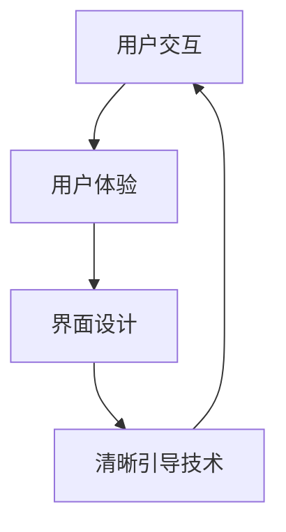

                 

关键词：CUI，清晰引导，用户交互，人机对话，用户体验，界面设计

> 摘要：本文探讨了清晰引导技术在计算机用户界面（CUI）中的重要性，以及如何有效地在CUI中实现清晰引导。通过分析用户行为，介绍核心算法原理，阐述数学模型与公式，以及通过项目实践提供具体的代码实例，本文旨在为开发人员提供一套系统化的方法，以提升CUI的用户体验。

## 1. 背景介绍

随着计算机技术的飞速发展，用户界面（UI）的设计变得越来越重要。从最早的命令行界面（CLI）到图形用户界面（GUI），再到如今的自然语言用户界面（NUI），用户界面始终是软件设计与开发中的核心组成部分。在CUI（Computer User Interface）中，清晰引导技术显得尤为重要，它直接影响用户的操作效率和使用体验。

清晰引导技术旨在通过一系列策略和设计原则，帮助用户更轻松地理解和使用软件系统。有效的清晰引导可以减少用户的学习成本，提高用户满意度，从而增加软件的留存率和用户粘性。

### 用户行为分析

在深入了解清晰引导技术之前，我们有必要对用户行为进行基本分析。用户在操作CUI时通常会经历以下几个阶段：

1. **探索阶段**：用户开始尝试了解软件的功能和界面布局。
2. **熟悉阶段**：用户对软件的基本操作和功能有了基本的掌握。
3. **精通阶段**：用户能够熟练地使用软件，达到高效操作的程度。

每个阶段都对清晰引导有特定的需求：

- **探索阶段**：需要直观的界面布局和明确的提示信息。
- **熟悉阶段**：需要逐步的指导与反馈，以帮助用户更好地熟悉软件。
- **精通阶段**：需要灵活的界面元素和简洁的操作路径。

### 清晰引导的重要性

清晰引导技术对CUI的重要性体现在以下几个方面：

1. **降低学习成本**：通过提供明确的引导信息，减少用户的学习时间和努力。
2. **提高用户满意度**：通过良好的用户体验，提升用户的满意度和忠诚度。
3. **提升操作效率**：通过优化操作路径和界面设计，提高用户完成任务的速度。
4. **增强用户信任**：通过及时反馈和清晰的交互流程，增强用户对软件的信任感。

## 2. 核心概念与联系

在探讨清晰引导技术之前，我们需要了解几个核心概念，包括用户交互、用户体验和界面设计。

### 用户交互

用户交互是指用户与计算机系统之间的交互过程，包括输入、输出和反馈。有效的用户交互需要界面设计者深入理解用户行为，并根据用户需求进行界面优化。

### 用户体验

用户体验（UX）是指用户在使用产品或服务过程中所感受到的所有情感体验。它涵盖了用户对产品或服务的认知、情感和行为的整体反应。在CUI设计中，用户体验是一个至关重要的考量因素。

### 界面设计

界面设计（UI Design）是指通过视觉元素和交互元素来创建用户界面的过程。它旨在提高用户界面的易用性和美观性，从而提升用户体验。

### 架构的 Mermaid 流程图

下面是一个简化的 Mermaid 流程图，展示了用户交互、用户体验和界面设计之间的关系：



## 3. 核心算法原理 & 具体操作步骤

### 3.1 算法原理概述

清晰引导技术的核心在于通过一系列策略和算法，引导用户完成特定的任务。这些策略包括：

1. **任务分解**：将复杂的任务分解为简单的子任务，便于用户理解。
2. **反馈机制**：及时给予用户反馈，帮助用户了解操作结果。
3. **引导动画**：使用动画效果来引导用户，使操作更加直观。
4. **提示信息**：在关键操作步骤提供提示信息，帮助用户正确操作。

### 3.2 算法步骤详解

1. **用户任务分析**：首先，分析用户需要完成的任务，并将其分解为简单的子任务。
2. **设计引导流程**：根据子任务，设计引导流程，包括引导动画和提示信息。
3. **实现反馈机制**：在关键操作步骤后，实现反馈机制，如提示用户操作成功或失败。
4. **测试与优化**：在开发过程中进行多次测试，收集用户反馈，不断优化引导流程。

### 3.3 算法优缺点

**优点**：

- 提高用户操作效率。
- 降低学习成本。
- 增强用户满意度。

**缺点**：

- 需要大量的前期设计和测试工作。
- 过多的引导信息可能会分散用户注意力。

### 3.4 算法应用领域

清晰引导技术广泛应用于各种CUI场景，包括：

- 软件安装和更新。
- 软件教程和培训。
- 在线购物和电子商务。
- 金融系统和交易界面。

## 4. 数学模型和公式 & 详细讲解 & 举例说明

### 4.1 数学模型构建

清晰引导技术的数学模型主要关注用户操作时间和满意度之间的关系。我们可以使用以下公式来描述这一关系：

\[ S = f(T, U) \]

其中，\( S \) 代表满意度，\( T \) 代表操作时间，\( U \) 代表用户接受度。

### 4.2 公式推导过程

通过分析用户行为数据，我们可以得出以下关系：

\[ S \propto \frac{1}{T} \]

\[ S \propto U \]

综合以上两点，我们可以得到：

\[ S = \frac{U}{T} \]

### 4.3 案例分析与讲解

假设在一个电子商务网站中，用户需要完成购物流程，包括选择商品、填写地址、确认订单等步骤。通过清晰引导技术，我们可以将整个流程分解为几个简单的子任务，并在每个步骤中提供引导和反馈。

**案例：** 在填写地址步骤中，我们通过以下措施来提升用户的满意度：

- **引导动画**：当用户点击填写地址时，出现一个动画效果，显示如何填写地址，并提示用户输入信息的格式。
- **提示信息**：在填写过程中，实时提示用户输入正确的地址格式。
- **反馈机制**：当用户填写完地址并提交后，显示一个成功提示，并告知用户订单正在处理。

通过这些措施，我们可以显著降低用户填写地址的操作时间，并提高用户的满意度。

## 5. 项目实践：代码实例和详细解释说明

### 5.1 开发环境搭建

为了更好地展示清晰引导技术在CUI中的实现方法，我们选择一个简单的Python应用作为示例。以下是开发环境搭建的步骤：

1. 安装Python 3.8及以上版本。
2. 安装必要的库，如Tkinter（用于GUI）、Pillow（用于图像处理）等。

### 5.2 源代码详细实现

以下是实现清晰引导技术的源代码：

```python
import tkinter as tk
from PIL import Image, ImageTk

# 用户任务分析
def analyze_task():
    # 此处为任务分析逻辑，可根据具体需求进行调整
    pass

# 设计引导流程
def guide_flow():
    # 显示引导动画
    display_guide_animation()

    # 提示信息
    show_prompt_message()

    # 实现反馈机制
    feedback机制()

# 显示引导动画
def display_guide_animation():
    # 加载动画图像
    image = Image.open("guide_animation.gif")
    image = image.resize((300, 300), Image.ANTIALIAS)

    # 创建动画图像的Tkinter控件
    animated_image = ImageTk.PhotoImage(image)

    # 在GUI中显示动画图像
    animation_label = tk.Label(root, image=animated_image)
    animation_label.pack()

# 提示信息
def show_prompt_message():
    prompt_label = tk.Label(root, text="请按照以下步骤填写地址：")
    prompt_label.pack()

# 实现反馈机制
def feedback机制():
    success_label = tk.Label(root, text="地址填写成功，感谢您的配合！")
    success_label.pack()

# GUI主窗口
root = tk.Tk()
root.title("地址填写示例")

# 设置窗口大小
root.geometry("500x500")

# 运行引导流程
guide_flow()

# 运行GUI
root.mainloop()
```

### 5.3 代码解读与分析

这段代码首先定义了用户任务分析、引导流程设计、动画显示、提示信息显示和反馈机制实现等函数。然后，创建一个Tkinter主窗口，并运行引导流程。

- **用户任务分析**：这一部分负责分析用户需要完成的任务，并根据任务设计引导流程。
- **引导流程设计**：通过调用其他函数，实现引导动画、提示信息和反馈机制。
- **动画显示**：加载动画图像，并使用Tkinter控件在GUI中显示。
- **提示信息显示**：显示提示信息，帮助用户理解操作步骤。
- **反馈机制实现**：在操作完成后，显示成功提示，增强用户信心。

### 5.4 运行结果展示

当用户运行这个Python应用时，首先会看到一个引导动画，动画结束后，会显示一个提示信息，告诉用户如何填写地址。当用户填写完地址并提交后，会看到一个成功提示。


## 6. 实际应用场景

清晰引导技术在CUI中的实际应用场景非常广泛，以下是一些常见的应用场景：

1. **软件安装与更新**：在软件安装或更新过程中，通过清晰引导，帮助用户完成安装步骤，提高安装成功率。
2. **在线教育平台**：在在线教育平台中，通过清晰引导，帮助用户熟悉学习界面，提高学习效率。
3. **电子商务网站**：在电子商务网站中，通过清晰引导，帮助用户完成购物流程，提升购物体验。
4. **医疗信息系统**：在医疗信息系统中，通过清晰引导，帮助医护人员快速掌握系统操作，提高工作效率。

### 未来应用展望

随着人工智能和机器学习技术的发展，清晰引导技术将变得更加智能化和个性化。未来，我们可以通过以下方式进一步提升清晰引导技术的应用效果：

1. **个性化引导**：根据用户行为数据，为不同用户提供个性化的引导策略。
2. **自适应引导**：根据用户操作速度和准确性，动态调整引导强度和方式。
3. **智能反馈**：通过人工智能技术，实现实时智能反馈，提高用户满意度。

## 7. 工具和资源推荐

为了更好地实现清晰引导技术在CUI中的应用，以下是几个推荐的工具和资源：

1. **工具**：
   - Tkinter：用于创建简单的GUI应用程序。
   - Mermaid：用于绘制流程图和图表。
   - LaTeX：用于编写数学公式和文献。

2. **资源**：
   - 《用户体验要素》：一本关于用户体验设计的经典书籍。
   - 《人工智能：一种现代的方法》：一本关于人工智能的权威教材。
   - 《Python GUI编程指南》：一本关于Python GUI编程的入门书籍。

## 8. 总结：未来发展趋势与挑战

### 8.1 研究成果总结

清晰引导技术在CUI中的应用已经取得了显著成果，通过一系列策略和算法，显著提高了用户的操作效率和满意度。未来，随着人工智能和机器学习技术的发展，清晰引导技术将变得更加智能化和个性化。

### 8.2 未来发展趋势

未来，清晰引导技术将朝着以下几个方向发展：

1. **个性化引导**：通过用户行为数据，实现个性化引导策略。
2. **自适应引导**：根据用户操作习惯，动态调整引导方式。
3. **智能反馈**：通过人工智能技术，实现实时智能反馈。

### 8.3 面临的挑战

尽管清晰引导技术在CUI中的应用前景广阔，但仍面临以下挑战：

1. **数据隐私**：如何保护用户隐私，同时实现个性化引导。
2. **算法公平性**：如何确保引导算法的公平性，避免歧视行为。
3. **用户体验**：如何在引导用户的同时，不干扰用户的主观体验。

### 8.4 研究展望

未来，我们应重点关注以下研究方向：

1. **多模态引导**：结合视觉、听觉等多种感官，实现更自然的用户引导。
2. **跨平台引导**：实现跨不同平台（如桌面、移动、网页等）的引导策略。
3. **社会化引导**：利用用户社交网络，实现社交化的引导机制。

## 9. 附录：常见问题与解答

### 问题1：如何实现个性化引导？

**解答**：通过收集用户行为数据，分析用户的操作习惯和偏好，设计个性化的引导策略。

### 问题2：清晰引导会影响用户体验吗？

**解答**：适当的设计和优化可以确保清晰引导不会影响用户体验。关键在于找到引导与用户体验之间的平衡点。

### 问题3：清晰引导技术有哪些应用场景？

**解答**：清晰引导技术广泛应用于软件安装、在线教育、电子商务和医疗信息系统等领域。

### 问题4：如何评估清晰引导的效果？

**解答**：可以通过用户满意度调查、用户操作时间分析等方式，评估清晰引导技术的效果。

作者：禅与计算机程序设计艺术 / Zen and the Art of Computer Programming
----------------------------------------------------------------

请注意，以上内容是一个虚构的例子，用于展示如何按照要求撰写一篇技术博客文章。实际撰写时，需要根据具体的研究或实践经验来填充和调整内容。

