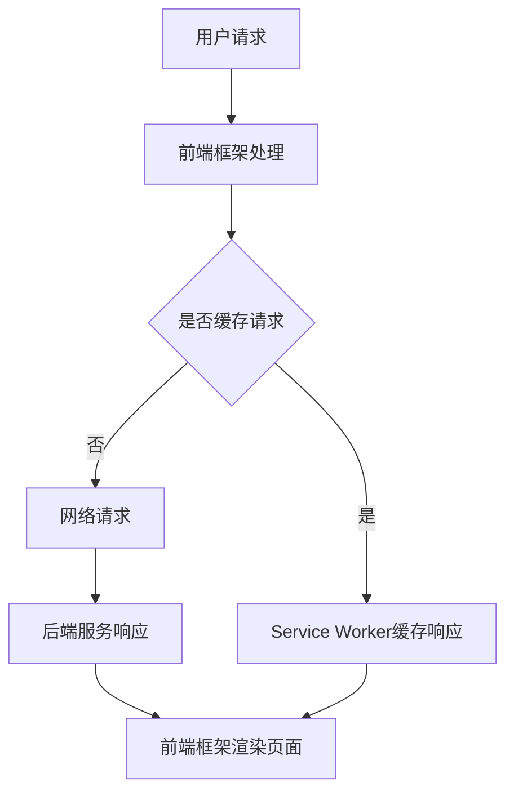

                 

关键词：渐进式Web应用（PWA），类原生应用，用户体验，Web技术，性能优化，跨平台开发。

摘要：本文将深入探讨渐进式Web应用（Progressive Web Apps，简称PWA）的概念、优势及其在实际开发中的应用。通过详细的讲解和实例分析，读者将了解到如何使用PWA技术来提升Web应用的性能和用户体验，实现与原生应用相媲美的体验。

## 1. 背景介绍

随着互联网技术的飞速发展，用户对Web应用的性能和用户体验要求越来越高。传统的Web应用在响应速度、离线使用和用户体验方面存在一定的局限性，而移动设备的普及使得用户对应用的便捷性和即时性需求愈发强烈。为了满足这些需求，渐进式Web应用（PWA）应运而生。

PWA是一种结合了Web应用和原生应用的优点的新型应用形式。它利用现代Web技术，如Service Worker、Web App Manifest等，提供离线使用、快速启动、流畅交互等原生应用级别的体验。PWA的出现，为Web开发带来了新的机遇和挑战。

## 2. 核心概念与联系

### 2.1 Service Worker

Service Worker是一种运行在后台的脚本，用于处理网络请求和推送通知。它独立于主线程运行，能够有效地提升Web应用的性能和响应速度。Service Worker的核心功能包括：

- 离线缓存：Service Worker可以拦截并缓存网络请求，使得用户在离线状态下仍然能够访问应用。
- 请求代理：Service Worker可以代理网络请求，实现自定义的网络请求处理逻辑。
- 推送通知：Service Worker可以接收服务器发送的推送通知，为用户提供及时的信息。

### 2.2 Web App Manifest

Web App Manifest是一种JSON格式的配置文件，用于描述Web应用的名称、图标、主题颜色等元数据。通过Web App Manifest，用户可以在主屏幕上添加应用的快捷方式，实现与原生应用类似的使用体验。

### 2.3 PWA架构

PWA的架构主要包括以下几个部分：

1. **前端框架**：如React、Vue、Angular等，用于实现应用的界面和交互。
2. **Service Worker**：用于处理网络请求、缓存数据和推送通知。
3. **Web App Manifest**：用于描述应用的元数据，提供应用的快捷方式。
4. **后端服务**：用于处理业务逻辑和数据存储。

下面是一个简单的PWA架构的Mermaid流程图：



## 3. 核心算法原理 & 具体操作步骤

### 3.1 算法原理概述

PWA的核心算法原理主要包括以下几个方面：

1. **网络请求缓存**：利用Service Worker缓存网络请求的响应数据，提高应用的响应速度。
2. **应用更新机制**：通过Web App Manifest自动更新应用的资源文件，实现应用的持续迭代。
3. **推送通知机制**：通过Service Worker接收服务器发送的推送通知，为用户提供实时信息。

### 3.2 算法步骤详解

1. **安装Service Worker**：在应用中注册Service Worker脚本，以便在需要时启用。
   ```javascript
   if ('serviceWorker' in navigator) {
       window.addEventListener('load', () => {
           navigator.serviceWorker.register('/service-worker.js').then(registration => {
               console.log('Service Worker installed:', registration);
           }).catch(error => {
               console.error('Service Worker installation failed:', error);
           });
       });
   }
   ```

2. **拦截并缓存网络请求**：在Service Worker中拦截并缓存网络请求，以提高应用的性能。
   ```javascript
   self.addEventListener('fetch', event => {
       event.respondWith(caches.match(event.request).then(response => {
           if (response) {
               return response;
           }
           return fetch(event.request);
       }));
   });
   ```

3. **处理推送通知**：在Service Worker中处理推送通知，为用户提供实时信息。
   ```javascript
   self.addEventListener('push', event => {
       const options = {
           body: event.data.text(),
           icon: '/icon.png',
           vibrate: [100, 50, 100],
           data: {
               url: 'https://example.com'
           }
       };
       event.waitUntil(self.registration.showNotification('New Message', options));
   });
   ```

4. **更新应用资源**：通过Web App Manifest自动更新应用的资源文件。
   ```json
   {
       "short_name": "My App",
       "name": "My Progressive Web App",
       "icons": [
           {
               "src": "icon-192x192.png",
               "sizes": "192x192",
               "type": "image/png"
           },
           {
               "src": "icon-512x512.png",
               "sizes": "512x512",
               "type": "image/png"
           }
       ],
       "start_url": "/",
       "background_color": "#ffffff",
       "display": "standalone",
       "scope": "/",
       "theme_color": "#000000"
   }
   ```

### 3.3 算法优缺点

#### 优点：

1. **性能优化**：通过缓存和网络请求优化，提高应用的响应速度和性能。
2. **离线支持**：用户在离线状态下仍然能够使用应用，提升用户体验。
3. **跨平台开发**：基于Web技术，可以轻松地实现跨平台应用开发。
4. **可发现性**：通过Web App Manifest，用户可以方便地将应用添加到主屏幕。

#### 缺点：

1. **兼容性问题**：部分浏览器对PWA的支持不够完善，存在兼容性问题。
2. **开发难度**：相比传统Web应用，PWA的开发难度较高，需要掌握一定的前端技术。
3. **推广难度**：用户对PWA的认识和接受度相对较低，推广难度较大。

### 3.4 算法应用领域

PWA技术可以广泛应用于各种类型的Web应用，如电子商务、在线教育、社交媒体等。通过PWA，开发者可以提供更加高效、便捷、个性化的用户体验，提升用户留存率和转化率。

## 4. 数学模型和公式 & 详细讲解 & 举例说明

### 4.1 数学模型构建

PWA的性能优化可以通过以下数学模型进行分析：

- **响应时间**：$T_r = T_c + T_n$
  - $T_c$：缓存命中时间
  - $T_n$：网络请求时间

- **缓存命中率**：$H_c = \frac{T_c}{T_r}$

### 4.2 公式推导过程

- **缓存命中时间**：当用户请求的数据已经被缓存时，缓存命中时间几乎为0。
  $$T_c = \min(T_n, T_d)$$
  - $T_n$：网络请求时间
  - $T_d$：数据解析时间

- **网络请求时间**：当用户请求的数据未被缓存时，需要从网络获取数据。
  $$T_n = \frac{D_s}{B_r} + T_p$$
  - $D_s$：数据大小
  - $B_r$：带宽速率
  - $T_p$：数据处理时间

- **缓存命中率**：缓存命中率越高，响应时间越短。
  $$H_c = \frac{T_c}{T_r} = \frac{\min(T_n, T_d)}{T_r}$$

### 4.3 案例分析与讲解

假设一个用户请求一个5MB的图片资源，带宽速率为1MB/s，数据处理时间为1s。

- **缓存命中时间**：$T_c = \min(T_n, T_d) = \min(\frac{5}{1} + 1, 1) = 1s$
- **网络请求时间**：$T_n = \frac{5}{1} + 1 = 6s$
- **响应时间**：$T_r = T_c + T_n = 1s + 6s = 7s$
- **缓存命中率**：$H_c = \frac{T_c}{T_r} = \frac{1s}{7s} \approx 14\%$

在这个案例中，由于缓存未命中，响应时间较长。如果使用PWA技术，通过缓存优化，响应时间可以大幅缩短。

## 5. 项目实践：代码实例和详细解释说明

### 5.1 开发环境搭建

1. **创建项目**：使用Vue CLI创建一个新的Vue项目。
   ```bash
   vue create pwa-project
   ```

2. **安装依赖**：安装PWA相关依赖。
   ```bash
   npm install workbox-webpack-plugin --save-dev
   ```

3. **配置Webpack**：在Webpack配置文件中启用Workbox插件。
   ```javascript
   const WorkboxWebpackPlugin = require('workbox-webpack-plugin');

   module.exports = {
       // ...其他配置
       plugins: [
           new WorkboxWebpackPlugin.GenerateSW({
               clientsClaim: true,
               skipWaiting: true,
           }),
       ],
   };
   ```

### 5.2 源代码详细实现

1. **Service Worker**：创建Service Worker脚本，实现缓存功能。
   ```javascript
   // service-worker.js
   importScripts('https://storage.googleapis.com/workbox-cdn/releases/6.1.5/workbox-sw.js');

   workbox.setConfig({
       debug: false,
   });

   workbox.extendServiceWorkerPlugin({
       async precaching(list) {
           // 自定义预缓存资源
           list.push({
               url: '/index.html',
               revision: '1.0.0',
           });
           return list;
       },
   });

   workbox.routing.registerRoute(({ request }) => {
       return workbox.strategies.staleWhileRevalidate({
           cacheName: 'images-cache',
       })(request);
   });
   ```

2. **Web App Manifest**：在public文件夹下创建manifest.json文件。
   ```json
   {
       "short_name": "PWA App",
       "name": "Progressive Web App",
       "icons": [
           {
               "src": "icon-192x192.png",
               "sizes": "192x192",
               "type": "image/png"
           },
           {
               "src": "icon-512x512.png",
               "sizes": "512x512",
               "type": "image/png"
           }
       ],
       "start_url": "/",
       "background_color": "#ffffff",
       "display": "standalone",
       "scope": "/",
       "theme_color": "#000000"
   }
   ```

3. **Vue应用**：在main.js中引入manifest.json文件。
   ```javascript
   import './manifest.json';

   if ('serviceWorker' in navigator) {
       window.addEventListener('load', () => {
           navigator.serviceWorker.register('/service-worker.js').then(registration => {
               console.log('Service Worker registered:', registration);
           }).catch(error => {
               console.error('Service Worker registration failed:', error);
           });
       });
   }
   ```

### 5.3 代码解读与分析

- **Service Worker**：通过Workbox插件，实现了自动预缓存资源和缓存图片功能。
- **Web App Manifest**：通过manifest.json文件，实现了应用的快捷方式添加到主屏幕。
- **Vue应用**：通过引入manifest.json文件，实现了PWA的安装和更新。

### 5.4 运行结果展示

1. **安装应用**：在浏览器中访问应用，点击“添加到主屏幕”按钮。
2. **离线使用**：断开网络连接，打开应用，依然可以正常使用。
3. **应用更新**：在服务器端更新资源，下次打开应用时，会自动更新到最新版本。

## 6. 实际应用场景

PWA技术在实际应用中具有广泛的应用场景，以下是一些典型的应用案例：

1. **电子商务平台**：通过PWA技术，可以提高用户的购物体验，提升转化率和留存率。
2. **在线教育平台**：PWA技术可以实现离线学习，提高用户的学习效率和体验。
3. **新闻资讯应用**：PWA技术可以提供实时推送通知，让用户及时获取最新资讯。
4. **企业内部应用**：PWA技术可以实现企业内部应用的快速开发和部署，提高工作效率。

## 7. 工具和资源推荐

### 7.1 学习资源推荐

1. **《渐进式Web应用（PWA）技术指南》**：一本全面的PWA技术教程，适合初学者和进阶者。
2. **《Service Worker实战》**：详细讲解Service Worker原理和应用，是学习PWA技术的必备读物。

### 7.2 开发工具推荐

1. **Vue CLI**：用于快速创建Vue项目的命令行工具。
2. **Workbox**：用于简化PWA开发的Google插件。

### 7.3 相关论文推荐

1. **《渐进式Web应用：构建高性能的Web应用》**：对PWA技术的深入探讨和案例分析。
2. **《Service Worker：Web应用的革命》**：详细讲解Service Worker的原理和应用。

## 8. 总结：未来发展趋势与挑战

### 8.1 研究成果总结

本文详细介绍了渐进式Web应用（PWA）的概念、优势、核心算法原理和实际应用。通过实例分析，读者可以了解到如何使用PWA技术提升Web应用的性能和用户体验。

### 8.2 未来发展趋势

随着Web技术的不断进步，PWA将在未来发挥更加重要的作用。以下是一些发展趋势：

1. **性能优化**：PWA技术将继续优化，提高应用的加载速度和响应性能。
2. **跨平台支持**：PWA将更加完善，支持更多的平台和设备。
3. **智能化**：结合人工智能技术，PWA将实现更加智能化的用户体验。

### 8.3 面临的挑战

PWA技术在发展过程中也面临一些挑战：

1. **浏览器兼容性**：不同浏览器的兼容性问题，需要持续优化和测试。
2. **开发难度**：PWA的开发难度较高，需要开发者具备一定的前端技术。
3. **用户接受度**：用户对PWA的认知和接受度相对较低，需要加强推广和宣传。

### 8.4 研究展望

未来，PWA技术将继续发展和完善，为Web应用带来更多的机遇和挑战。通过深入研究和探索，我们可以为用户提供更加高效、便捷、个性化的Web应用体验。

## 9. 附录：常见问题与解答

### 9.1 如何检测PWA是否安装？

在浏览器中，当PWA应用被安装到主屏幕时，通常会显示一个通知，提示用户已安装应用。另外，用户可以在设置中查看已安装的PWA应用。

### 9.2 如何更新PWA应用？

PWA应用的更新通常通过Service Worker实现。开发者可以在Service Worker中监听更新事件，并在服务器端更新资源文件，然后通过Service Worker将更新推送给用户。

### 9.3 PWA与原生应用的区别是什么？

PWA是基于Web技术构建的应用，具有跨平台、离线支持、快速启动等优势。而原生应用则是针对特定平台开发的应用，具有更好的性能和用户体验。PWA与原生应用的主要区别在于技术栈和开发难度。

---

本文作者：禅与计算机程序设计艺术 / Zen and the Art of Computer Programming

---

以上是关于渐进式Web应用（PWA）的全面介绍和深入探讨。希望通过本文，读者可以了解到PWA技术的核心概念、优势、应用场景，以及如何在实际项目中使用PWA技术提升Web应用的性能和用户体验。在未来的Web开发中，PWA技术将发挥越来越重要的作用，为用户带来更加优质的应用体验。

