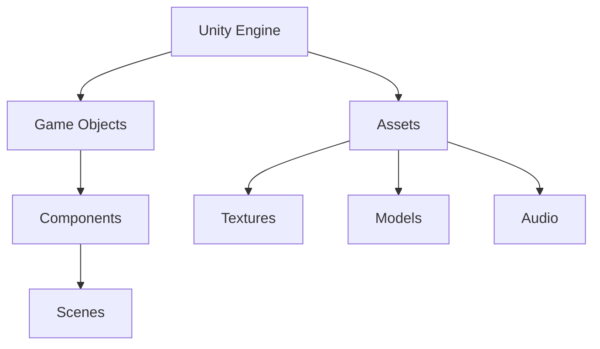
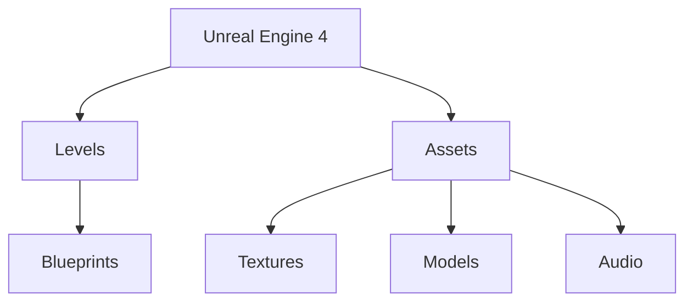

                 

 **关键词：** 游戏开发、游戏引擎、Unity、Unreal Engine 4、框架比较、核心算法、应用领域、数学模型、代码实例、未来展望

**摘要：** 本文详细探讨了两个顶级游戏开发框架——Unity 和 Unreal Engine 4 的演变、核心概念、算法原理以及实际应用。通过比较分析，揭示了各自的优势和局限性，并对未来的发展进行了展望。

## 1. 背景介绍

随着电子游戏的迅速发展，游戏引擎作为游戏开发的核心技术，正变得越来越重要。Unity 和 Unreal Engine 4 是当前市场上最受欢迎的两个游戏开发框架，它们在不同的方面都有着显著的成就。

Unity 是一个易于使用的游戏开发平台，自2005年发布以来，凭借其简单易学的编程模型和强大的生态系统，迅速赢得了广泛的用户群体。Unity 支持跨平台开发，适用于从简单的2D游戏到复杂的3D游戏的各种项目。

Unreal Engine 4（简称UE4）是由Epic Games开发的，自2014年发布以来，以其卓越的图形渲染能力、高效率和强大的编辑器功能，成为了高端游戏开发的首选工具。UE4 在游戏开发和电影制作领域都有广泛的应用。

## 2. 核心概念与联系

游戏引擎的核心在于提供一套完整的工具和资源，帮助开发者创建、管理和优化游戏。以下是Unity和UE4的核心概念及它们之间的联系。

### 2.1 Unity

Unity 的核心概念包括：

- **游戏对象（Game Object）：** 游戏中的所有实体，如角色、道具等，都是游戏对象。
- **组件（Component）：** 游戏对象附加的功能，如渲染器、物理模拟器等。
- **场景（Scene）：** 游戏世界中的一系列游戏对象的集合。
- **资产（Asset）：** 游戏中的各种资源，如纹理、模型、音频等。

Unity 的架构图如下（使用Mermaid流程图）：



### 2.2 Unreal Engine 4

UE4 的核心概念包括：

- **关卡（Level）：** 游戏世界的具体实现，包含场景、角色、道具等。
- **蓝图（Blueprint）：** 用于可视化编程的工具，不需要编写代码即可实现功能。
- **资产（Assets）：** 与Unity相同，是游戏开发中的各种资源。

UE4 的架构图如下：



### 2.3 核心概念的联系

虽然Unity和UE4的核心概念有所不同，但它们都在游戏开发中起到了至关重要的作用。两者都提供了丰富的组件和资产库，以及强大的编辑器功能。Unity的组件模型更偏向于面向对象编程，而UE4的蓝图系统则更接近于流程图编程。

## 3. 核心算法原理 & 具体操作步骤

### 3.1 算法原理概述

游戏引擎的核心算法主要包括：

- **渲染算法：** 用于计算和绘制游戏世界中的图像。
- **物理模拟：** 用于模拟游戏中物体的物理行为。
- **音频处理：** 用于处理游戏中音频的播放和效果。

### 3.2 算法步骤详解

#### 3.2.1 渲染算法

渲染算法的步骤包括：

1. **场景构建：** 构建场景中的所有对象。
2. **光照计算：** 计算场景中的光照效果。
3. **渲染输出：** 将计算出的图像输出到屏幕。

#### 3.2.2 物理模拟

物理模拟的步骤包括：

1. **碰撞检测：** 检测物体之间的碰撞。
2. **运动计算：** 根据物理定律计算物体的运动。
3. **更新场景：** 更新场景中的物体位置和状态。

#### 3.2.3 音频处理

音频处理的步骤包括：

1. **音频输入：** 接收音频信号。
2. **音频处理：** 对音频信号进行效果处理。
3. **音频输出：** 将处理后的音频信号输出到扬声器。

### 3.3 算法优缺点

#### 3.3.1 Unity

**优点：**

- **易用性高：** Unity的编程模型简单易学，适合初学者。
- **跨平台支持：** Unity支持多种平台，包括PC、移动设备和网页。

**缺点：**

- **性能限制：** 对于大型游戏，Unity的性能可能不如其他引擎。
- **图形效果：** Unity的图形渲染能力相对较弱。

#### 3.3.2 UE4

**优点：**

- **强大的图形渲染能力：** UE4的图形渲染效果非常出色，适合制作高端游戏。
- **高效的编辑器：** UE4的编辑器功能强大，可以快速迭代开发。

**缺点：**

- **学习曲线陡峭：** UE4的编程模型和概念较为复杂，初学者可能需要较长时间适应。
- **资源消耗大：** UE4的资源消耗较大，对硬件要求较高。

### 3.4 算法应用领域

**Unity：**

- **2D游戏：** Unity非常适合开发2D游戏，如《魂斗罗》、《超级马里奥》等。
- **移动游戏：** Unity支持多种移动平台，如iOS和Android，适合开发移动游戏。

**UE4：**

- **3D游戏：** UE4非常适合开发3D游戏，如《堡垒之夜》、《神秘海域》等。
- **电影制作：** UE4的图形渲染能力非常强大，可以用于电影制作。

## 4. 数学模型和公式 & 详细讲解 & 举例说明

### 4.1 数学模型构建

#### 4.1.1 渲染算法

渲染算法的核心数学模型是光线追踪。光线追踪的基本公式如下：

$$
\text{ray} = \text{origin} + \text{direction} \cdot t
$$

其中，ray代表光线路径，origin代表光源位置，direction代表光线方向，t代表时间。

#### 4.1.2 物理模拟

物理模拟的核心数学模型是牛顿运动定律。牛顿运动定律的公式如下：

$$
F = m \cdot a
$$

其中，F代表力，m代表质量，a代表加速度。

#### 4.1.3 音频处理

音频处理的核心数学模型是傅里叶变换。傅里叶变换的基本公式如下：

$$
X(f) = \int_{-\infty}^{\infty} x(t) \cdot e^{-i2\pi ft} dt
$$

其中，X(f)代表频谱，x(t)代表时间序列信号，f代表频率。

### 4.2 公式推导过程

#### 4.2.1 渲染算法

光线追踪的公式推导过程涉及几何和微积分。假设一个点光源在空间中发出光线，光线与场景中的物体相交，我们通过计算光线与物体的交点来确定光照效果。

#### 4.2.2 物理模拟

牛顿运动定律的推导过程基于经典力学。物体受到的力等于质量乘以加速度，这是物体运动的基本规律。

#### 4.2.3 音频处理

傅里叶变换的推导过程涉及复变函数和积分变换。傅里叶变换将时间序列信号转换为频谱，帮助我们理解信号的频率成分。

### 4.3 案例分析与讲解

#### 4.3.1 渲染算法

以Unity为例，假设我们有一个光源在场景中发出光线，光线方向为(1, 0, 0)。我们需要计算光线与场景中物体的交点。

$$
\text{ray} = (0, 0, 0) + (1, 0, 0) \cdot t
$$

当光线与物体相交时，我们有：

$$
\text{ray} = (x, y, z)
$$

通过解这个方程，我们可以得到交点坐标。

#### 4.3.2 物理模拟

以UE4为例，假设一个物体质量为5kg，受到10N的力，我们需要计算物体的加速度。

$$
F = m \cdot a \\
10N = 5kg \cdot a \\
a = 2m/s^2
$$

物体的加速度为2m/s^2。

#### 4.3.3 音频处理

以Unity为例，假设我们有一个音频信号，需要对其进行傅里叶变换。

$$
X(f) = \int_{-\infty}^{\infty} x(t) \cdot e^{-i2\pi ft} dt
$$

通过计算，我们可以得到音频信号的频谱。

## 5. 项目实践：代码实例和详细解释说明

### 5.1 开发环境搭建

以Unity为例，搭建开发环境的具体步骤如下：

1. 访问Unity官网（https://unity.com/），下载并安装Unity Hub。
2. 打开Unity Hub，点击创建新项目。
3. 选择合适的模板，如2D或3D游戏，点击“Create Project”。
4. 设置项目名称和位置，点击“Create”。
5. 安装必要的插件和包，如Unity Standard Assets。

### 5.2 源代码详细实现

以下是一个简单的Unity C#脚本，用于实现一个简单的2D游戏角色控制。

```csharp
using UnityEngine;

public class PlayerMovement : MonoBehaviour
{
    public float moveSpeed = 5.0f;

    private Rigidbody2D rigidbody2D;

    private void Start()
    {
        rigidbody2D = GetComponent<Rigidbody2D>();
    }

    private void Update()
    {
        float moveX = Input.GetAxis("Horizontal");
        float moveY = Input.GetAxis("Vertical");

        Vector2 moveDirection = new Vector2(moveX, moveY);
        rigidbody2D.velocity = moveDirection * moveSpeed;
    }
}
```

### 5.3 代码解读与分析

上述代码实现了一个简单的2D游戏角色控制。我们首先定义了一个名为`PlayerMovement`的C#脚本，它包含以下核心部分：

- **公有属性（public float moveSpeed = 5.0f）；** 定义了角色的移动速度。
- **私有成员（private Rigidbody2D rigidbody2D）；** 定义了角色的刚体组件。
- **Start方法（private void Start()）；** 初始化刚体组件。
- **Update方法（private void Update()）；** 处理角色的输入和移动。

### 5.4 运行结果展示

运行上述代码后，我们在Unity编辑器中可以看到一个简单的2D游戏角色。通过键盘上的方向键，我们可以控制角色在场景中移动。

## 6. 实际应用场景

### 6.1 Unity

Unity 在实际应用场景中非常广泛，以下是一些典型应用：

- **移动游戏开发：** Unity 支持多种移动平台，适用于开发移动游戏，如《糖果粉碎传奇》、《愤怒的小鸟》等。
- **网页游戏开发：** Unity 的 WebGL 支持，使开发者可以轻松地将游戏发布到网页上，如《马里奥卡丁车》等。
- **教育领域：** Unity 提供了丰富的教育资源，适用于教育类游戏开发，如《我的世界：教育版》等。

### 6.2 Unreal Engine 4

Unreal Engine 4 在实际应用场景中也具有广泛的用途，以下是一些典型应用：

- **高端游戏开发：** Unreal Engine 4 的卓越图形渲染能力，使其成为开发高端游戏的首选工具，如《堡垒之夜》、《战地V》等。
- **电影制作：** Unreal Engine 4 的图形渲染能力使其成为电影制作的重要工具，如《银翼杀手2049》等。
- **建筑可视化：** Unreal Engine 4 可以用于建筑可视化，如《城市：天际线》等。

## 6.4 未来应用展望

随着游戏技术的不断发展，Unity 和 Unreal Engine 4 将在更多领域得到应用。以下是一些未来应用展望：

- **虚拟现实（VR）和增强现实（AR）：** Unity 和 Unreal Engine 4 都在 VR 和 AR 领域有所布局，未来将看到更多基于这些技术的应用。
- **游戏化学习：** Unity 和 Unreal Engine 4 在教育领域的应用将更加深入，为游戏化学习提供更多可能性。
- **游戏引擎集成：** Unity 和 Unreal Engine 4 将与其他领域的技术集成，如人工智能、大数据等，为开发者提供更强大的开发工具。

## 7. 工具和资源推荐

### 7.1 学习资源推荐

- **Unity官方文档：** https://docs.unity.com/
- **Unreal Engine 官方文档：** https://docs.unrealengine.com/
- **游戏开发论坛：** GameDev.net（https://www.gamedev.net/）

### 7.2 开发工具推荐

- **Visual Studio Code：** 用于Unity和UE4开发的优秀代码编辑器。
- **Unity Hub：** Unity 的集成开发环境。
- **Unreal Editor：** Unreal Engine 4 的集成开发环境。

### 7.3 相关论文推荐

- **"Unreal Engine 4: What's new in 4.23"：** 详细介绍了UE4的新功能和改进。
- **"Real-Time Rendering":** 讨论了实时渲染的核心技术和算法。
- **"Game Engine Architecture":** 分析了游戏引擎的架构和设计。

## 8. 总结：未来发展趋势与挑战

### 8.1 研究成果总结

Unity 和 Unreal Engine 4 在游戏开发领域取得了显著成果。Unity 以其易用性和跨平台能力赢得了广泛用户，而 UE4 则以其强大的图形渲染能力和高效的编辑器功能成为高端游戏开发的首选。

### 8.2 未来发展趋势

- **技术融合：** Unity 和 UE4 将与其他领域的技术（如 VR、AR、人工智能等）融合，为开发者提供更强大的开发工具。
- **开源化：** Unity 和 UE4 可能会进一步开源，以吸引更多开发者参与，促进技术发展。

### 8.3 面临的挑战

- **性能优化：** 随着游戏复杂度的提高，Unity 和 UE4 需要不断优化性能，以应对大型游戏的需求。
- **生态系统建设：** Unity 和 UE4 需要不断完善其生态系统，包括教程、社区支持、插件等，以吸引更多开发者。

### 8.4 研究展望

未来，Unity 和 UE4 将在游戏开发、电影制作、虚拟现实等领域继续发挥重要作用。通过技术融合和开源化，这两个框架有望进一步推动游戏技术的进步。

## 9. 附录：常见问题与解答

### 9.1 Unity 和 Unreal Engine 4 的区别是什么？

Unity 和 Unreal Engine 4 在易用性、图形渲染能力、编辑器功能等方面有所不同。Unity 以其易用性和跨平台能力著称，而 Unreal Engine 4 则以其强大的图形渲染能力和高效的编辑器功能领先。

### 9.2 我应该选择哪个框架来开发我的游戏？

选择框架应根据你的项目需求和开发经验。如果你是初学者或需要快速开发简单的游戏，Unity 可能更适合你；如果你需要开发高端游戏或电影级画面，Unreal Engine 4 可能是更好的选择。

### 9.3 Unity 和 Unreal Engine 4 是否支持3D游戏开发？

是的，两者都支持3D游戏开发。Unity 和 Unreal Engine 4 提供了丰富的3D游戏开发工具和资源，使得开发者可以轻松创建复杂的3D游戏世界。

**作者：禅与计算机程序设计艺术 / Zen and the Art of Computer Programming**

