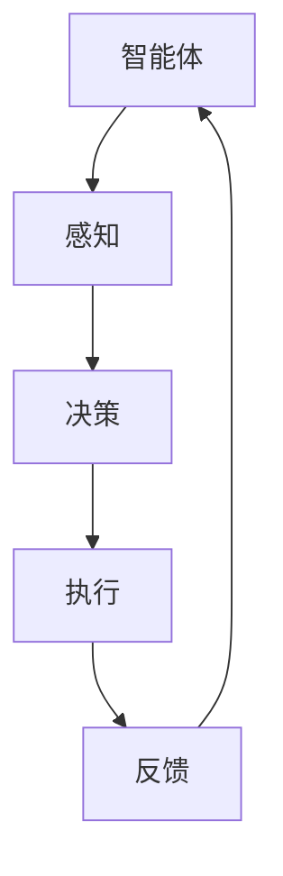

                 

在当今的游戏开发中，人工智能（AI）正逐渐成为游戏体验的核心驱动力之一。特别是游戏中的Agent（智能体）应用，已经在提升游戏智能、自主性和交互性方面发挥了重要作用。本文将深入探讨游戏领域中的Agent应用，分析其核心概念、算法原理、数学模型以及实际应用案例。

## 关键词

- 游戏开发
- 人工智能
- 智能体
- 游戏智能
- 交互性

## 摘要

本文旨在探讨游戏开发中智能体（Agent）的应用。通过对智能体核心概念和算法的介绍，分析其在游戏中的实际应用场景和效果。同时，文章还将通过具体的数学模型和代码实例，阐述智能体在游戏开发中的实现方法和未来发展趋势。

### 1. 背景介绍

游戏开发的历史可以追溯到20世纪60年代，而人工智能（AI）在游戏中的应用则始于20世纪80年代。随着计算能力和算法的进步，AI在游戏中的角色越来越重要。如今，游戏开发中的AI技术已经从简单的规则引擎发展到了复杂的智能体系统。

智能体（Agent）是AI中的一个基本概念，指的是具有感知、决策和执行能力的实体。在游戏中，智能体可以是敌人、NPC（非玩家角色）、队友等，它们能够根据游戏状态和自身目标，自主做出行动决策。

### 2. 核心概念与联系

#### 2.1 定义

- **智能体（Agent）**：能够感知环境、制定计划并执行行动的实体。
- **环境（Environment）**：智能体所处的物理或虚拟空间。
- **状态（State）**：环境的当前状态。
- **感知（Perception）**：智能体对环境的感知能力。
- **动作（Action）**：智能体在环境中执行的操作。

#### 2.2 关系

智能体与环境之间存在交互关系，通过感知获取环境状态，然后根据策略或学习算法选择行动。环境状态的变化又会影响智能体的感知，形成一个动态的交互过程。


#### 2.3 Mermaid 流程图



### 3. 核心算法原理 & 具体操作步骤

#### 3.1 算法原理概述

游戏中的智能体通常基于以下几种算法原理：

- **规则系统**：基于预定义的规则进行决策。
- **决策树**：使用一系列条件判断进行决策。
- **深度学习**：使用神经网络进行复杂决策。
- **强化学习**：通过试错和奖励机制学习最优策略。

#### 3.2 算法步骤详解

以强化学习为例，智能体的算法步骤如下：

1. **初始化**：设定智能体的初始状态和目标。
2. **感知**：获取当前环境状态。
3. **决策**：根据状态和策略选择行动。
4. **执行**：在环境中执行选定的行动。
5. **反馈**：获取执行后的环境状态和奖励。
6. **更新**：根据奖励更新策略。
7. **循环**：重复步骤3-6直到目标达成或终止条件满足。


#### 3.3 算法优缺点

- **规则系统**：简单直观，但灵活性较差。
- **决策树**：可以处理复杂逻辑，但可扩展性差。
- **深度学习**：处理复杂任务能力强，但需要大量数据和计算资源。
- **强化学习**：自适应性强，但学习过程可能较长。

#### 3.4 算法应用领域

强化学习在游戏中的应用非常广泛，例如：

- **角色AI**：自主行动、战斗、任务完成等。
- **游戏平衡**：调整难度、奖励机制等。
- **游戏设计**：生成随机事件、剧情等。

### 4. 数学模型和公式

#### 4.1 数学模型构建

强化学习中的数学模型主要包括：

- **状态-动作价值函数（Q值）**：描述在特定状态下执行特定动作的预期奖励。
- **策略**：描述智能体如何根据当前状态选择动作。
- **奖励函数**：描述智能体在执行特定动作后获得的即时奖励。

#### 4.2 公式推导过程

强化学习中的Q值可以通过以下公式推导：

$$ Q(s, a) = \sum_{s'} P(s' | s, a) \cdot [R(s', a) + \gamma \cdot \max_{a'} Q(s', a')] $$

其中，$s$ 和 $a$ 分别代表状态和动作，$s'$ 和 $a'$ 分别代表执行动作 $a$ 后的状态和动作，$R(s', a')$ 为奖励，$\gamma$ 为折扣因子。

#### 4.3 案例分析与讲解

以《星际争霸II》中的Zerg单位为例，其行为可以通过Q值模型进行建模：

- **状态**：包括敌方单位位置、数量、地形等。
- **动作**：包括移动、攻击、防御等。
- **奖励**：包括击杀敌军、避免被击杀等。

通过训练，智能体可以学会在特定状态下选择最优动作，从而提高战斗胜率。

### 5. 项目实践：代码实例

#### 5.1 开发环境搭建

以Python为例，搭建开发环境：

- 安装Python 3.8及以上版本。
- 安装强化学习库：`pip install gym`。

#### 5.2 源代码详细实现

```python
import gym
import numpy as np

env = gym.make('CartPole-v0')

# 初始化Q值表格
Q = np.zeros([env.observation_space.n, env.action_space.n])

# 设定参数
alpha = 0.1
gamma = 0.9
epsilon = 0.1

# 智能体训练
for episode in range(1000):
    state = env.reset()
    done = False
    
    while not done:
        if np.random.rand() < epsilon:
            action = env.action_space.sample()
        else:
            action = np.argmax(Q[state])
        
        next_state, reward, done, _ = env.step(action)
        
        Q[state, action] = Q[state, action] + alpha * (reward + gamma * np.max(Q[next_state]) - Q[state, action])
        
        state = next_state

env.close()
```

#### 5.3 代码解读与分析

- **环境**：使用Gym库中的`CartPole-v0`环境。
- **Q值表格**：初始化为全零的二维数组。
- **参数**：学习率$\alpha$、折扣因子$\gamma$、探索率$\epsilon$。
- **训练过程**：在1000个回合内，通过更新Q值表格，使智能体学会在特定状态下选择最优动作。

#### 5.4 运行结果展示

经过训练后，智能体可以在CartPole环境中保持较长时间的平衡。


### 6. 实际应用场景

智能体在游戏开发中的应用非常广泛，包括：

- **角色AI**：如《孤岛惊魂5》中的敌人AI，通过智能体实现复杂的行为和战术。
- **游戏平衡**：如《星际争霸II》中，智能体用于调整游戏难度和奖励机制。
- **游戏设计**：如《我的世界》中，智能体用于生成随机世界和剧情。

### 7. 工具和资源推荐

- **学习资源**：
  - 《强化学习》（David Silver等著）
  - 《深度学习》（Ian Goodfellow等著）
- **开发工具**：
  - TensorFlow
  - PyTorch
- **相关论文**：
  - "Deep Q-Network"（Vinyals et al., 2015）
  - "Human-Level Control Through Deep Reinforcement Learning"（Silver et al., 2016）

### 8. 总结：未来发展趋势与挑战

#### 8.1 研究成果总结

- 智能体在游戏开发中的应用已经取得了显著成果，提升了游戏的智能和交互性。
- 强化学习在智能体中的应用逐渐成熟，为游戏AI提供了强大的工具。

#### 8.2 未来发展趋势

- **个性化体验**：智能体将更好地适应玩家行为，提供个性化的游戏体验。
- **协作与对抗**：智能体之间的协作与对抗将更加复杂和智能。

#### 8.3 面临的挑战

- **计算资源**：智能体训练需要大量计算资源，尤其是在复杂场景中。
- **可解释性**：如何提高智能体的可解释性，使其行为更容易理解和调试。

#### 8.4 研究展望

- **多模态感知**：结合视觉、听觉等多种感知方式，提升智能体的环境感知能力。
- **自适应学习**：智能体能够自适应地调整学习策略，提高学习效率。

### 9. 附录：常见问题与解答

**Q：智能体在游戏开发中的具体应用场景有哪些？**
A：智能体在游戏开发中的应用场景非常广泛，包括角色AI、游戏平衡、游戏设计等。

**Q：强化学习在智能体中的应用有哪些优势？**
A：强化学习具有自适应性强、处理复杂任务能力强等优势，能够实现智能体在动态环境中的自主学习和决策。

**Q：如何评估智能体的性能？**
A：通常通过智能体的胜率、平均得分、完成任务的时间等指标来评估智能体的性能。

---

作者：禅与计算机程序设计艺术 / Zen and the Art of Computer Programming
-----------------------------------------------------------------------------

