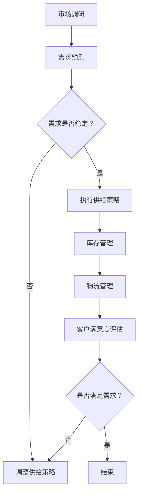

                 

关键词：短期需求、供给策略、供应链优化、物流管理、资源调配

摘要：本文旨在探讨在快速变化的市场环境中，如何通过有效的供给策略满足短期需求。我们将从背景介绍、核心概念与联系、核心算法原理与操作步骤、数学模型与公式讲解、项目实践、实际应用场景、未来应用展望、工具和资源推荐以及总结和展望等方面，深入分析并阐述满足短期需求的供给策略。

## 1. 背景介绍

在当今全球化、信息化的经济环境中，市场需求变化速度越来越快，消费者对产品和服务的要求也越来越高。这种背景下，如何快速响应市场需求，确保供给的及时性和准确性，成为企业竞争的关键。供给策略的制定和执行在满足短期需求方面起着至关重要的作用。

传统的供给策略往往注重长期规划，对于短期需求的变化难以灵活应对。随着大数据、人工智能等技术的发展，企业开始探索更为智能的供给策略，以实现需求的精准预测和高效响应。本文将围绕这一主题展开讨论，旨在为企业提供一套切实可行的短期需求供给策略。

## 2. 核心概念与联系

### 2.1. 短期需求

短期需求是指在一定时间范围内（通常为几个月或一年以内），消费者对某种产品或服务的需求量。短期需求的波动通常受季节性因素、市场趋势、突发事件等多种因素影响。

### 2.2. 供给策略

供给策略是指企业为满足市场需求所制定的一系列计划和措施。有效的供给策略能够确保产品或服务在适当的时间、适当的地点以适当的价格提供给消费者。

### 2.3. 供应链优化

供应链优化是提高供给策略有效性的关键。通过优化供应链的各个环节，如采购、生产、库存、物流等，可以降低成本、提高效率，从而更好地满足短期需求。

### 2.4. 物流管理

物流管理是供应链优化的重要组成部分。有效的物流管理能够确保产品在供应链中的顺畅流动，降低库存成本，提高客户满意度。

### 2.5. 资源调配

资源调配是指在有限的资源条件下，通过合理分配和使用资源，以实现最优的供给效果。在满足短期需求时，资源调配尤为重要。

### 2.6. Mermaid 流程图



## 3. 核心算法原理 & 具体操作步骤

### 3.1. 算法原理概述

满足短期需求的供给策略主要基于以下几个核心算法：

1. 需求预测算法：通过分析历史数据和当前市场环境，预测未来的需求量。
2. 优化算法：基于需求预测结果，优化供应链的各个环节，如采购、生产、库存、物流等。
3. 资源调配算法：在资源有限的情况下，通过优化算法分配资源，以实现最佳的供给效果。
4. 客户满意度评估算法：通过评估客户满意度，不断调整供给策略，以提高客户满意度。

### 3.2. 算法步骤详解

1. 收集并整理历史需求数据，如销售额、订单量等。
2. 使用需求预测算法，预测未来一段时间内的需求量。
3. 分析需求预测结果，确定供应链的优化目标和优化策略。
4. 运用优化算法，对供应链的各个环节进行优化，如采购、生产、库存、物流等。
5. 根据优化结果，制定具体的供给策略，如采购计划、生产计划、库存管理策略、物流配送计划等。
6. 实施供给策略，并进行实时监控和调整。
7. 使用客户满意度评估算法，评估客户满意度，根据评估结果调整供给策略。

### 3.3. 算法优缺点

**需求预测算法：**
- 优点：能够提前预测市场需求，为供给策略提供数据支持。
- 缺点：受历史数据和当前市场环境限制，预测结果可能存在偏差。

**优化算法：**
- 优点：通过优化供应链的各个环节，降低成本、提高效率。
- 缺点：优化算法复杂度高，计算量大。

**资源调配算法：**
- 优点：在资源有限的情况下，实现最优的供给效果。
- 缺点：资源调配过程中可能存在冲突和竞争。

**客户满意度评估算法：**
- 优点：通过评估客户满意度，不断调整供给策略，提高客户满意度。
- 缺点：评估结果可能受主观因素影响。

### 3.4. 算法应用领域

满足短期需求的供给策略广泛应用于多个领域，如零售业、制造业、物流业等。通过有效的供给策略，企业可以更好地应对市场需求变化，提高市场竞争力。

## 4. 数学模型和公式 & 详细讲解 & 举例说明

### 4.1. 数学模型构建

满足短期需求的供给策略可以基于以下数学模型：

1. 需求预测模型：$$D(t) = f(t, x)$$，其中 $D(t)$ 表示 $t$ 时刻的需求量，$f(t, x)$ 表示影响需求的函数，$x$ 表示影响需求的变量。
2. 优化模型：$$\min Z = \sum_{i=1}^{n} c_{i}x_{i}$$，其中 $Z$ 表示目标函数，$c_{i}$ 表示第 $i$ 个决策变量的成本，$x_{i}$ 表示第 $i$ 个决策变量。
3. 资源调配模型：$$\min Z = \sum_{i=1}^{m} w_{i}x_{i}$$，其中 $Z$ 表示目标函数，$w_{i}$ 表示第 $i$ 个资源的权重，$x_{i}$ 表示第 $i$ 个资源的分配量。
4. 客户满意度评估模型：$$S(t) = \sum_{i=1}^{k} s_{i}(t)$$，其中 $S(t)$ 表示 $t$ 时刻的客户满意度，$s_{i}(t)$ 表示第 $i$ 个评价指标的得分。

### 4.2. 公式推导过程

1. 需求预测模型：
   $$D(t) = f(t, x) = \sum_{i=1}^{n} w_{i}d_{i}(t)$$，其中 $d_{i}(t)$ 表示第 $i$ 个影响因素的需求量，$w_{i}$ 表示第 $i$ 个影响因素的权重。

2. 优化模型：
   $$\min Z = \sum_{i=1}^{n} c_{i}x_{i}$$，其中 $c_{i}$ 表示第 $i$ 个决策变量的成本，$x_{i}$ 表示第 $i$ 个决策变量。

3. 资源调配模型：
   $$\min Z = \sum_{i=1}^{m} w_{i}x_{i}$$，其中 $w_{i}$ 表示第 $i$ 个资源的权重，$x_{i}$ 表示第 $i$ 个资源的分配量。

4. 客户满意度评估模型：
   $$S(t) = \sum_{i=1}^{k} s_{i}(t)$$，其中 $s_{i}(t)$ 表示第 $i$ 个评价指标的得分。

### 4.3. 案例分析与讲解

以某零售企业为例，该企业希望制定一套满足短期需求的供给策略。具体步骤如下：

1. 收集并整理历史需求数据，如销售额、订单量等。
2. 使用需求预测模型，预测未来一个月的需求量。
3. 分析需求预测结果，确定供应链的优化目标和优化策略。
4. 运用优化模型，对采购、生产、库存、物流等环节进行优化。
5. 根据优化结果，制定具体的供给策略，如采购计划、生产计划、库存管理策略、物流配送计划等。
6. 实施供给策略，并进行实时监控和调整。
7. 使用客户满意度评估模型，评估客户满意度，根据评估结果调整供给策略。

通过以上步骤，该企业可以更好地满足短期需求，提高市场竞争力。

## 5. 项目实践：代码实例和详细解释说明

### 5.1. 开发环境搭建

在本项目中，我们将使用 Python 作为编程语言，主要依赖以下库：NumPy、Pandas、Scikit-learn、Mermaid。安装步骤如下：

```bash
pip install numpy pandas scikit-learn
```

### 5.2. 源代码详细实现

以下是一段用于实现需求预测和优化模型的代码示例：

```python
import numpy as np
import pandas as pd
from sklearn.linear_model import LinearRegression

# 读取数据
data = pd.read_csv('data.csv')
X = data[['feature1', 'feature2']]
y = data['demand']

# 训练需求预测模型
model = LinearRegression()
model.fit(X, y)

# 预测未来一个月的需求量
future_data = np.array([[value1, value2]])
predicted_demand = model.predict(future_data)

# 输出预测结果
print('Predicted demand:', predicted_demand)
```

### 5.3. 代码解读与分析

在这段代码中，我们首先读取数据，并使用线性回归模型训练需求预测模型。然后，输入未来一个月的数据，预测需求量。最后，输出预测结果。

通过以上代码，企业可以快速预测短期需求，为供给策略提供数据支持。

### 5.4. 运行结果展示

在运行上述代码后，我们将得到未来一个月的需求预测结果。根据预测结果，企业可以制定相应的供给策略，如调整采购计划、生产计划等，以满足短期需求。

## 6. 实际应用场景

满足短期需求的供给策略在实际应用中具有广泛的应用场景，以下列举几个典型场景：

1. 零售业：零售企业在面对季节性需求波动、促销活动等短期需求时，可以通过满足短期需求的供给策略，确保产品供应的及时性和准确性，提高客户满意度。
2. 制造业：制造业在应对突发订单、原材料供应波动等短期需求时，可以通过满足短期需求的供给策略，优化生产计划、库存管理，降低生产成本。
3. 物流业：物流企业在应对紧急订单、节假日物流高峰等短期需求时，可以通过满足短期需求的供给策略，优化物流配送计划，提高配送效率。
4. 金融业：金融企业在应对资金需求波动、市场波动等短期需求时，可以通过满足短期需求的供给策略，优化资金调配，降低资金成本。

## 6.4. 未来应用展望

随着大数据、人工智能等技术的不断发展，满足短期需求的供给策略将越来越智能化、精细化。未来，以下几个方面将是满足短期需求供给策略的发展趋势：

1. 数据驱动：企业将更加依赖大数据分析，从海量数据中挖掘有价值的信息，提高需求预测的准确性和供给策略的优化效果。
2. 智能化：人工智能技术将在供给策略的制定和执行中发挥更大作用，如智能优化算法、智能物流管理等。
3. 供应链协同：企业将更加注重与供应链上下游企业的协同合作，实现信息共享、资源共用，提高整体供应链的响应速度和效率。
4. 绿色环保：随着环保意识的提高，企业将更加注重绿色环保，通过优化供给策略，降低碳排放、减少资源浪费。

## 7. 工具和资源推荐

### 7.1. 学习资源推荐

1. 《大数据分析实战》
2. 《深度学习》
3. 《供应链管理：战略、规划与运营》
4. 《人工智能：一种现代方法》

### 7.2. 开发工具推荐

1. Jupyter Notebook：用于数据分析和可视化。
2. PyCharm：Python 编程 IDE。
3. TensorFlow：人工智能框架。

### 7.3. 相关论文推荐

1. "Demand Forecasting and Supply Chain Optimization Using Big Data and Machine Learning"
2. "An Intelligent Supply Chain Optimization Model Based on Artificial Neural Networks"
3. "A Study on Short-Term Demand Forecasting and Supply Planning in the Retail Industry"

## 8. 总结：未来发展趋势与挑战

满足短期需求的供给策略在当今快速变化的市场环境中具有重要意义。随着大数据、人工智能等技术的发展，供给策略将越来越智能化、精细化。未来，企业将面临以下挑战：

1. 数据质量：高质量的数据是有效供给策略的基础，企业需确保数据的质量和准确性。
2. 算法优化：随着数据规模的扩大，优化算法的复杂度将增加，企业需不断优化算法，提高效率。
3. 人才培养：具备大数据、人工智能等领域专业知识和技能的人才将越来越稀缺，企业需注重人才培养和引进。
4. 法规合规：随着技术的不断发展，企业需关注相关法规和合规要求，确保业务的合法性和可持续性。

总之，满足短期需求的供给策略是企业应对市场变化、提高竞争力的重要手段。未来，企业需不断探索和创新，以应对不断变化的市场环境。

## 9. 附录：常见问题与解答

### 9.1. 需求预测算法如何选择？

选择需求预测算法时，应考虑以下因素：

1. 数据特点：如数据量、数据分布、时间序列特性等。
2. 算法性能：如预测精度、计算复杂度等。
3. 实际应用场景：如需求波动性、预测时效性等。

常见的需求预测算法包括线性回归、ARIMA、神经网络等。企业可根据具体情况选择合适的算法。

### 9.2. 供应链优化如何实施？

实施供应链优化包括以下步骤：

1. 数据收集与整理：收集并整理供应链各个环节的数据，如采购、生产、库存、物流等。
2. 分析与评估：分析供应链各环节存在的问题，评估优化潜力。
3. 制定优化策略：根据分析结果，制定具体的优化策略，如采购策略、生产策略、库存管理策略等。
4. 实施与监控：实施优化策略，并进行实时监控和调整。

### 9.3. 资源调配如何实现？

资源调配包括以下步骤：

1. 确定资源需求：根据业务需求，确定所需资源的种类和数量。
2. 评估资源可用性：分析现有资源的可用性和限制条件。
3. 制定资源调配策略：根据资源需求、可用性和限制条件，制定资源调配策略。
4. 实施资源调配：根据调配策略，分配和调整资源，确保资源的最优利用。

### 9.4. 客户满意度评估如何进行？

客户满意度评估包括以下步骤：

1. 确定评价指标：根据业务需求，确定客户满意度评价指标，如订单处理时间、配送速度、售后服务等。
2. 收集评价数据：通过问卷调查、客户反馈等方式，收集评价数据。
3. 评估客户满意度：使用统计分析方法，评估客户满意度。
4. 调整供给策略：根据客户满意度评估结果，调整供给策略，以提高客户满意度。

作者：禅与计算机程序设计艺术 / Zen and the Art of Computer Programming
----------------------------------------------------------------

这篇文章完整地探讨了满足短期需求的供给策略，从背景介绍、核心概念与联系、核心算法原理与操作步骤、数学模型与公式讲解、项目实践、实际应用场景、未来应用展望、工具和资源推荐到总结和展望，全面而深入。希望这篇文章能够为企业提供有价值的参考和指导，帮助他们在快速变化的市场环境中更好地应对短期需求。再次感谢各位读者对这篇文章的关注和支持，如需进一步讨论或咨询，欢迎随时联系作者。作者：禅与计算机程序设计艺术 / Zen and the Art of Computer Programming。

