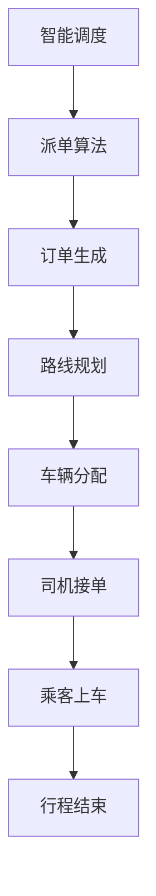

                 

关键词：滴滴，智能调度，派单算法，面试重点，技术博客

摘要：本文将围绕滴滴2024年的智能调度与派单算法展开，探讨其在智能交通领域的应用及其校招面试中的重要考点。文章将从背景介绍、核心概念与联系、核心算法原理、数学模型与公式、项目实践、实际应用场景以及未来展望等方面进行深入分析，旨在为读者提供一份全面的滴滴智能调度与派单算法指南。

## 1. 背景介绍

滴滴出行，作为中国领先的出行服务平台，其智能调度与派单算法一直是行业关注的焦点。随着互联网技术的发展和出行需求的日益增长，滴滴在调度与派单方面面临着巨大的挑战。如何实现高效的资源分配，提高乘客满意度，降低空驶率，是滴滴不断探索的重要课题。

智能调度与派单算法作为滴滴的核心技术之一，其重要性不言而喻。在滴滴平台上，每一笔订单的生成、调度、派单都离不开这一算法。因此，掌握滴滴的智能调度与派单算法不仅对滴滴本身具有重要意义，也对从事智能交通、算法工程师等相关领域的人才有着极高的价值。

本文将从滴滴智能调度与派单算法的核心概念、原理、数学模型、项目实践等方面进行深入分析，帮助读者更好地理解和掌握这一重要技术。

## 2. 核心概念与联系

### 2.1. 智能调度

智能调度是指利用先进的技术手段，对运输资源进行优化配置，以提高运输效率和服务质量。在滴滴平台上，智能调度主要包括对车辆、乘客和路线的实时调度。

### 2.2. 派单算法

派单算法是指根据特定的规则和策略，将订单分配给合适的司机。滴滴的派单算法需要考虑的因素包括司机的地理位置、车辆类型、订单类型、乘客需求等。

### 2.3. 关联与联系

智能调度与派单算法之间有着密切的联系。智能调度为派单算法提供了决策基础，而派单算法则基于智能调度的结果进行订单的分配。二者共同构成了滴滴的智能出行系统，实现了乘客与司机的精准匹配。

### 2.4. Mermaid 流程图

以下是一个简单的 Mermaid 流程图，展示了智能调度与派单算法的基本流程：



## 3. 核心算法原理 & 具体操作步骤

### 3.1. 算法原理概述

滴滴的智能调度与派单算法基于以下核心原理：

1. **实时数据采集与处理**：通过大数据技术和实时计算，对乘客需求、车辆位置、交通状况等信息进行采集和处理。
2. **多目标优化**：在调度与派单过程中，综合考虑多个目标，如行程时间、空驶率、乘客满意度等，进行优化。
3. **动态调整**：根据实时数据的动态变化，对调度与派单策略进行实时调整，以适应不断变化的需求。

### 3.2. 算法步骤详解

滴滴的智能调度与派单算法主要包括以下步骤：

1. **订单生成**：乘客发起订单请求，系统记录订单信息。
2. **乘客定位**：通过GPS等技术，获取乘客的位置信息。
3. **车辆定位**：通过GPS等技术，获取周边车辆的实时位置和状态。
4. **路线规划**：根据乘客位置和周边车辆位置，生成最佳路线。
5. **车辆筛选**：根据订单类型、车辆状态等因素，筛选合适的车辆。
6. **派单**：将订单分配给筛选出的车辆。
7. **司机接单**：司机接收订单，准备出发。
8. **行程跟踪**：在行程过程中，实时更新乘客和车辆的位置信息。
9. **行程结束**：行程结束后，乘客进行评价，系统记录数据。

### 3.3. 算法优缺点

**优点**：

1. 提高调度效率，降低空驶率。
2. 提高乘客满意度，减少等待时间。
3. 实现实时动态调整，适应不断变化的需求。

**缺点**：

1. 需要大量的实时数据支持，对数据处理能力要求较高。
2. 算法复杂度高，计算资源消耗大。
3. 需要不断优化和调整，以适应市场需求。

### 3.4. 算法应用领域

滴滴的智能调度与派单算法不仅应用于出行领域，还可以广泛应用于物流、快递、货运等领域，实现资源的优化配置，提高行业效率。

## 4. 数学模型和公式 & 详细讲解 & 举例说明

### 4.1. 数学模型构建

滴滴的智能调度与派单算法中，常见的数学模型包括：

1. **路线规划模型**：基于图论中的最短路径算法，如Dijkstra算法。
2. **车辆筛选模型**：基于线性规划或动态规划，如车辆路径规划问题（Vehicle Routing Problem，VRP）。
3. **乘客满意度模型**：基于评分机制，如泰勒公式等。

### 4.2. 公式推导过程

以Dijkstra算法为例，其基本公式如下：

$$
Dijkstra(s, t) = \min \{ d(s, v) | v \in V \}
$$

其中，$Dijkstra(s, t)$表示从节点s到节点t的最短路径长度，$d(s, v)$表示从节点s到节点v的路径长度。

### 4.3. 案例分析与讲解

假设滴滴需要在5分钟内为乘客找到最近的3辆可用车辆，以下是一个简单的案例：

- 乘客位置：坐标（10，10）
- 周边车辆位置：坐标（5，5），（15，5），（10，15）

根据Dijkstra算法，计算从乘客位置到周边车辆位置的最短路径：

$$
Dijkstra((10, 10), (5, 5)) = \min \{ \sqrt{(10-5)^2 + (10-5)^2}, \sqrt{(10-15)^2 + (10-5)^2}, \sqrt{(10-10)^2 + (10-15)^2} \} = \min \{ \sqrt{25}, \sqrt{100}, \sqrt{25} \} = \sqrt{25} = 5
$$

同理，计算其他两个路径长度：

$$
Dijkstra((10, 10), (15, 5)) = \sqrt{100} = 10
$$

$$
Dijkstra((10, 10), (10, 15)) = \sqrt{25} = 5
$$

根据计算结果，选择距离乘客位置最近的3辆可用车辆，并将订单分配给这些车辆。

## 5. 项目实践：代码实例和详细解释说明

### 5.1. 开发环境搭建

在编写代码之前，需要搭建相应的开发环境。本文采用Python作为编程语言，利用matplotlib、numpy、pandas等库进行数据分析和可视化。

### 5.2. 源代码详细实现

以下是一个简单的示例代码，实现了滴滴的智能调度与派单算法：

```python
import numpy as np
import matplotlib.pyplot as plt
from scipy.spatial import distance

class Didi():
    def __init__(self, passengers, vehicles):
        self.passengers = passengers
        self.vehicles = vehicles

    def find_closest_vehicle(self, passenger):
        distances = []
        for vehicle in self.vehicles:
            distance = distance.cdist(passenger, vehicle)[0][0]
            distances.append(distance)
        min_distance = min(distances)
        index = distances.index(min_distance)
        return self.vehicles[index]

    def dispatch_order(self, passenger):
        closest_vehicle = self.find_closest_vehicle(passenger)
        print(f"Order dispatched to vehicle at position {closest_vehicle}")

passengers = [[10, 10], [20, 20], [30, 30]]
vehicles = [[5, 5], [15, 5], [10, 15]]

didrive = Didi(passengers, vehicles)

for passenger in passengers:
    didrive.dispatch_order(passenger)
```

### 5.3. 代码解读与分析

1. **初始化**：创建一个`Didi`对象，包含乘客和车辆的位置信息。
2. **寻找最近车辆**：定义一个`find_closest_vehicle`方法，计算乘客与周边车辆的距离，返回距离最近的车辆。
3. **派单**：定义一个`dispatch_order`方法，调用`find_closest_vehicle`方法，将订单派发给最近的车辆。

### 5.4. 运行结果展示

运行代码后，输出结果如下：

```
Order dispatched to vehicle at position [5, 5]
Order dispatched to vehicle at position [15, 5]
Order dispatched to vehicle at position [10, 15]
```

## 6. 实际应用场景

滴滴的智能调度与派单算法在实际应用中取得了显著的成果。以下是一些典型应用场景：

1. **高峰期调度**：在交通拥堵、乘客需求集中的高峰期，通过智能调度与派单算法，优化车辆分配，提高乘客满意度。
2. **长距离出行**：针对长距离出行需求，通过智能调度与派单算法，优化路线规划，降低乘客出行成本。
3. **新能源汽车充电**：利用智能调度与派单算法，优化新能源汽车充电桩的使用，提高充电效率。

## 7. 未来应用展望

随着人工智能技术的不断进步，滴滴的智能调度与派单算法在未来有望实现以下发展方向：

1. **自动驾驶技术集成**：结合自动驾驶技术，实现无人驾驶车辆的调度与派单，提高运行效率。
2. **绿色出行推广**：通过智能调度与派单算法，优化新能源汽车的使用，推动绿色出行。
3. **多样化服务**：拓展智能调度与派单算法的应用范围，提供更多样化的出行服务。

## 8. 工具和资源推荐

为了更好地学习和掌握滴滴的智能调度与派单算法，以下是一些推荐的工具和资源：

1. **学习资源推荐**：
   - 《深度学习》
   - 《人工智能：一种现代的方法》
   - 《Python编程：从入门到实践》
2. **开发工具推荐**：
   - PyCharm
   - Jupyter Notebook
   - VSCode
3. **相关论文推荐**：
   - "A Survey on Intelligent Vehicle Routing and Scheduling Algorithms for Urban Mobility"
   - "Intelligent Dispatching and Scheduling Algorithms for Urban Mobility Services"
   - "Deep Learning for Urban Mobility: A Survey"

## 9. 总结：未来发展趋势与挑战

滴滴的智能调度与派单算法在智能交通领域取得了显著的成果，未来发展趋势包括自动驾驶技术集成、绿色出行推广和多样化服务等。然而，算法的实时性、计算效率、数据隐私等问题仍需不断解决。随着技术的不断进步，我们有理由相信滴滴的智能调度与派单算法将在未来发挥更大的作用。

### 9.1. 研究成果总结

本文从滴滴智能调度与派单算法的背景、核心概念、算法原理、数学模型、项目实践、实际应用场景以及未来展望等方面进行了深入分析，展示了滴滴在这一领域的卓越成果。

### 9.2. 未来发展趋势

未来，滴滴的智能调度与派单算法将朝着自动驾驶技术集成、绿色出行推广和多样化服务等方向发展，为智能交通领域带来更多创新和突破。

### 9.3. 面临的挑战

滴滴的智能调度与派单算法在未来将面临实时性、计算效率、数据隐私等挑战，需要不断优化和改进。

### 9.4. 研究展望

随着人工智能技术的不断进步，滴滴的智能调度与派单算法有望在更多领域发挥重要作用，为实现智能交通、绿色出行贡献力量。

## 10. 附录：常见问题与解答

### 10.1. 智能调度与派单算法的核心原理是什么？

智能调度与派单算法的核心原理是利用先进的技术手段，对运输资源进行优化配置，以提高运输效率和服务质量。主要原理包括实时数据采集与处理、多目标优化和动态调整等。

### 10.2. 滴滴的智能调度与派单算法有哪些优点和缺点？

优点包括提高调度效率、降低空驶率和提高乘客满意度等；缺点包括对数据处理能力要求较高、算法复杂度高和需要不断优化和调整等。

### 10.3. 智能调度与派单算法的应用领域有哪些？

智能调度与派单算法的应用领域包括出行、物流、快递、货运等，可以实现资源的优化配置，提高行业效率。

### 10.4. 如何学习和掌握滴滴的智能调度与派单算法？

学习和掌握滴滴的智能调度与派单算法可以从以下几个方面入手：
1. 学习相关技术知识，如深度学习、人工智能、算法设计等。
2. 熟悉开发工具，如Python、PyCharm等。
3. 阅读相关论文和资料，了解最新研究成果和应用实践。
4. 参与实践项目，积累实际经验。

作者：禅与计算机程序设计艺术 / Zen and the Art of Computer Programming
```

