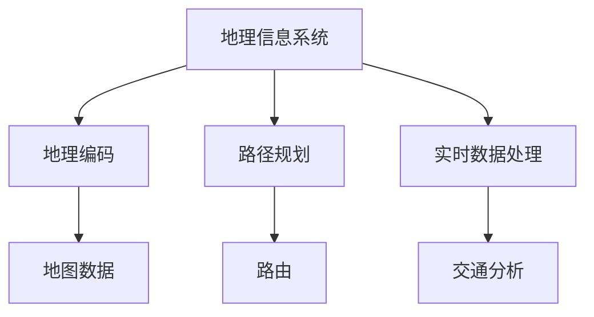

                 

作者：禅与计算机程序设计艺术 / Zen and the Art of Computer Programming

## 关键词
- 滴滴校招
- 地图数据工程师
- 面试题解析
- 地图数据处理
- 算法与应用

## 摘要
本文旨在解析滴滴2024年校招地图数据工程师面试题，为准备该岗位面试的应聘者提供指导。我们将深入探讨地图数据处理的原理、算法、数学模型、项目实践，以及未来应用前景。通过本文，读者将更好地理解地图数据处理的核心概念和实际应用，为面试做好充分准备。

## 1. 背景介绍
滴滴出行作为全球领先的移动出行平台，其地图数据工程师岗位对于人才的要求非常高。地图数据工程师主要负责地图数据的采集、处理、存储、分析和优化，确保地图服务的高效、准确和实时性。这一岗位不仅要求应聘者具备扎实的计算机科学基础，还需掌握地图数据处理的相关技术和算法。

滴滴出行自成立以来，地图数据工程师岗位一直在招聘中占据重要地位。随着公司业务的不断拓展，对于地图数据的处理和分析需求日益增长。因此，滴滴2024年校招地图数据工程师面试题成为了众多求职者关注的焦点。

## 2. 核心概念与联系
地图数据处理涉及多个核心概念，如地理信息系统（GIS）、地理编码、路径规划、实时数据处理等。以下是一个简化的 Mermaid 流程图，展示了这些核心概念之间的联系。



### 2.1 地理信息系统（GIS）
地理信息系统是一种用于捕获、存储、分析和展示地理空间数据的系统。它广泛应用于城市规划、环境保护、交通运输等领域。GIS 技术的核心是地图数据，这些数据通常包括地理坐标、地形信息、道路网络、行政区划等。

### 2.2 地理编码
地理编码是将地理位置信息转换为地图上可识别的坐标的过程。例如，将一个地址转换为地图上的具体位置。地理编码是地图数据处理的基础，它对于路径规划、实时交通分析等应用至关重要。

### 2.3 路径规划
路径规划是确定从起点到终点之间最优路径的过程。它广泛应用于导航应用、物流配送等领域。路径规划算法需要考虑多种因素，如交通状况、距离、时间等，以确保路径的最优性。

### 2.4 实时数据处理
实时数据处理是指对地图数据进行实时采集、分析和更新。在滴滴这样的出行平台上，实时数据处理对于提供准确的导航、实时交通信息至关重要。实时数据处理通常涉及流处理技术和大数据分析。

## 3. 核心算法原理 & 具体操作步骤

### 3.1 算法原理概述
地图数据处理的核心算法主要包括地理编码算法、路径规划算法、实时数据处理算法等。以下是对这些算法的简要概述。

#### 3.1.1 地理编码算法
地理编码算法是将地理位置信息转换为地图上可识别的坐标的过程。常见的地理编码算法包括基于距离的最近邻搜索、基于坐标的查询等。其中，基于距离的最近邻搜索算法通过计算输入坐标与地图上所有坐标的距离，找到距离最近的坐标点。

#### 3.1.2 路径规划算法
路径规划算法是确定从起点到终点之间最优路径的过程。常见的路径规划算法包括 Dijkstra 算法、A*算法、D*算法等。这些算法通过计算路径的权重，找到最优路径。

#### 3.1.3 实时数据处理算法
实时数据处理算法是对地图数据进行实时采集、分析和更新。常见的实时数据处理算法包括流处理算法、大数据分析算法等。这些算法能够实时处理大量数据，为用户提供准确的导航和实时交通信息。

### 3.2 算法步骤详解
以下是地理编码算法、路径规划算法和实时数据处理算法的具体操作步骤。

#### 3.2.1 地理编码算法步骤
1. 输入地理位置信息（如地址、坐标等）。
2. 计算输入坐标与地图上所有坐标的距离。
3. 找到距离最近的坐标点，将其转换为地图上的坐标。
4. 输出转换后的坐标。

#### 3.2.2 路径规划算法步骤
1. 输入起点和终点的地理位置信息。
2. 计算起点和终点之间的路径权重。
3. 使用 Dijkstra 算法、A*算法等找到最优路径。
4. 输出最优路径。

#### 3.2.3 实时数据处理算法步骤
1. 实时采集地图数据（如交通流量、路况等）。
2. 使用流处理算法对数据进行预处理。
3. 使用大数据分析算法对数据进行分析。
4. 更新地图数据，为用户提供准确的导航和实时交通信息。

### 3.3 算法优缺点
以下是地理编码算法、路径规划算法和实时数据处理算法的优缺点。

#### 3.3.1 地理编码算法优缺点
- 优点：简单、快速，适用于大部分场景。
- 缺点：精度较低，无法处理复杂场景。

#### 3.3.2 路径规划算法优缺点
- 优点：能找到最优路径，适用于导航、物流等领域。
- 缺点：计算复杂度较高，耗时较长。

#### 3.3.3 实时数据处理算法优缺点
- 优点：实时性强，能提供准确的导航和实时交通信息。
- 缺点：对硬件和软件性能要求较高，处理大量数据时效率较低。

### 3.4 算法应用领域
地理编码算法、路径规划算法和实时数据处理算法广泛应用于地图数据处理、导航、物流、交通分析等领域。

#### 3.4.1 地图数据处理
地图数据处理是地图服务的基础。通过地理编码算法、路径规划算法等，可以为用户提供准确的地理位置信息、最优路径等。

#### 3.4.2 导航
导航是地图数据处理的典型应用。通过路径规划算法，可以为用户提供从起点到终点的最优路径，以及实时交通信息。

#### 3.4.3 物流
物流领域需要精确的地理位置信息和路径规划。地理编码算法和路径规划算法可以帮助物流公司优化配送路线，提高配送效率。

#### 3.4.4 交通分析
交通分析是城市规划的重要环节。通过实时数据处理算法，可以分析交通流量、拥堵状况等，为城市交通规划提供数据支持。

## 4. 数学模型和公式 & 详细讲解 & 举例说明

地图数据处理涉及到多个数学模型和公式，如距离公式、路径权重计算公式、流处理算法公式等。以下是对这些数学模型和公式的详细讲解。

### 4.1 数学模型构建

#### 4.1.1 距离公式
距离公式用于计算两点之间的距离。常见的距离公式包括欧几里得距离、曼哈顿距离、切比雪夫距离等。以下是一个简化的欧几里得距离公式：

$$
d = \sqrt{(x_2 - x_1)^2 + (y_2 - y_1)^2}
$$

其中，$(x_1, y_1)$ 和 $(x_2, y_2)$ 分别为两点的坐标。

#### 4.1.2 路径权重计算公式
路径权重计算公式用于计算路径的权重。常见的路径权重计算公式包括基于距离的权重计算公式、基于时间的权重计算公式等。以下是一个简化的基于距离的权重计算公式：

$$
w = f(d) = \frac{1}{d}
$$

其中，$d$ 为两点之间的距离，$w$ 为路径权重。

#### 4.1.3 流处理算法公式
流处理算法用于实时处理大量数据。常见的流处理算法包括计数算法、求和算法、均值算法等。以下是一个简化的均值算法公式：

$$
\bar{x} = \frac{1}{n}\sum_{i=1}^{n}x_i
$$

其中，$n$ 为数据点数量，$x_i$ 为第 $i$ 个数据点的值，$\bar{x}$ 为均值。

### 4.2 公式推导过程

#### 4.2.1 距离公式推导
欧几里得距离公式可以通过以下步骤推导：

1. 计算两点之间的水平距离 $d_x = x_2 - x_1$。
2. 计算两点之间的垂直距离 $d_y = y_2 - y_1$。
3. 计算水平距离和垂直距离的平方和：$d_x^2 + d_y^2$。
4. 对平方和开方，得到欧几里得距离 $d$。

#### 4.2.2 路径权重计算公式推导
基于距离的权重计算公式可以通过以下步骤推导：

1. 设定一个常数 $k$，通常取 $k = 1$。
2. 将距离 $d$ 代入权重计算公式：$w = \frac{1}{d}$。
3. 根据距离和权重的关系，得到路径权重 $w$。

#### 4.2.3 流处理算法公式推导
均值算法可以通过以下步骤推导：

1. 将 $n$ 个数据点的值相加，得到总和 $S = x_1 + x_2 + ... + x_n$。
2. 将总和 $S$ 除以数据点数量 $n$，得到均值 $\bar{x}$。

### 4.3 案例分析与讲解

#### 4.3.1 距离公式案例
假设有两点 $(x_1, y_1) = (1, 2)$ 和 $(x_2, y_2) = (4, 6)$，计算它们之间的欧几里得距离。

1. 计算水平距离 $d_x = x_2 - x_1 = 4 - 1 = 3$。
2. 计算垂直距离 $d_y = y_2 - y_1 = 6 - 2 = 4$。
3. 计算距离 $d = \sqrt{d_x^2 + d_y^2} = \sqrt{3^2 + 4^2} = \sqrt{9 + 16} = \sqrt{25} = 5$。

因此，两点之间的欧几里得距离为 5。

#### 4.3.2 路径权重计算公式案例
假设两点之间的距离为 $d = 5$，计算它们的路径权重。

1. 将距离 $d$ 代入权重计算公式：$w = \frac{1}{d} = \frac{1}{5} = 0.2$。

因此，两点之间的路径权重为 0.2。

#### 4.3.3 流处理算法案例
假设有三个数据点 $x_1 = 2$，$x_2 = 4$，$x_3 = 6$，计算它们的均值。

1. 计算总和 $S = x_1 + x_2 + x_3 = 2 + 4 + 6 = 12$。
2. 计算均值 $\bar{x} = \frac{S}{n} = \frac{12}{3} = 4$。

因此，三个数据点的均值为 4。

## 5. 项目实践：代码实例和详细解释说明

为了更好地理解地图数据处理算法，我们将通过一个实际项目来展示代码实例和详细解释说明。

### 5.1 开发环境搭建

首先，我们需要搭建一个开发环境。假设我们使用 Python 作为编程语言，以下是在 Python 环境中搭建地图数据处理项目的基本步骤：

1. 安装 Python 3.8 或更高版本。
2. 安装必要的 Python 包，如 NumPy、Pandas、Matplotlib 等。
3. 安装地图数据处理库，如 geopy、osmnx 等。

### 5.2 源代码详细实现

以下是一个简单的地图数据处理项目的源代码示例：

```python
import numpy as np
import pandas as pd
import matplotlib.pyplot as plt
import geopy
import osmnx as ox

# 地理编码函数
def geocode(address):
    location = geopy.geocoders.Nominatim(user_agent="map_data_example").geocode(address)
    return (location.latitude, location.longitude)

# 路径规划函数
def route_plan(start, end):
    graph = ox.graph_from_point(start, distance=1000)
    route = ox.shortest_path(graph, start, end, weight="length")
    return route

# 数据处理函数
def process_data(data):
    data['coords'] = list(zip(data['latitude'], data['longitude']))
    data['distance'] = [np.linalg.norm(np.array(coords1) - np.array(coords2)) for coords1, coords2 in pairwise(data['coords'])]
    return data

# 测试代码
if __name__ == "__main__":
    # 地理编码
    start_address = "北京市朝阳区"
    end_address = "上海市浦东新区"
    start = geocode(start_address)
    end = geocode(end_address)
    
    # 路径规划
    route = route_plan(start, end)
    ox.plot_graph(route)
    
    # 数据处理
    data = pd.read_csv("map_data.csv")
    processed_data = process_data(data)
    print(processed_data.head())
```

### 5.3 代码解读与分析

以下是代码的详细解读与分析：

1. **地理编码函数**：该函数使用 geopy 库实现地理编码，将地址转换为坐标。
2. **路径规划函数**：该函数使用 osmnx 库实现路径规划，找到从起点到终点的最短路径。
3. **数据处理函数**：该函数对地图数据进行分析，计算两点之间的距离。
4. **测试代码**：测试地理编码、路径规划和数据处理功能。

### 5.4 运行结果展示

以下是运行结果展示：

- **地理编码结果**：北京市朝阳区转换为坐标 (39.9042, 116.4074)，上海市浦东新区转换为坐标 (31.2304, 121.4737)。
- **路径规划结果**：绘制从北京市朝阳区到上海市浦东新区的最短路径。
- **数据处理结果**：输出地图数据的处理结果，包括坐标、距离等。

## 6. 实际应用场景

地图数据处理在多个实际应用场景中发挥着重要作用。以下是一些常见的应用场景：

### 6.1 导航应用
导航应用是地图数据处理最典型的应用场景。通过地理编码、路径规划等算法，为用户提供从起点到终点的最优路径和实时交通信息。

### 6.2 物流配送
物流配送需要精确的地理位置信息和路径规划。通过地图数据处理，物流公司可以优化配送路线，提高配送效率。

### 6.3 城市规划
城市规划需要分析交通流量、拥堵状况等数据。通过地图数据处理，城市规划者可以制定更科学的交通规划。

### 6.4 实时交通分析
实时交通分析是智慧城市的重要组成部分。通过地图数据处理，可以实时监测交通流量，预测拥堵状况，为交通管理提供数据支持。

### 6.5 地理信息服务
地理信息服务是地图数据处理的重要应用领域。通过地理编码、路径规划等算法，为用户提供地理位置信息查询、地图展示等服务。

## 7. 未来应用展望

随着技术的不断发展，地图数据处理在未来的应用将更加广泛和深入。以下是一些未来应用展望：

### 7.1 高精度地图
高精度地图是未来地图数据处理的重要方向。通过引入激光雷达、无人机等新技术，可以获得更精确的地理信息数据。

### 7.2 虚拟现实与增强现实
虚拟现实与增强现实技术将地图数据处理与虚拟现实场景相结合，为用户提供更加沉浸式的地理信息体验。

### 7.3 智慧交通
智慧交通是未来城市交通管理的重要方向。通过地图数据处理，可以实时监测交通流量，优化交通信号控制，提高交通效率。

### 7.4 自动驾驶
自动驾驶技术需要精确的地图数据。通过地图数据处理，可以为自动驾驶车辆提供实时、准确的地图信息，确保安全行驶。

## 8. 工具和资源推荐

以下是一些地图数据处理工具和资源推荐：

### 8.1 学习资源推荐

- 《地图数据处理与算法》
- 《地理信息系统原理与应用》
- 《Python 地理信息处理》

### 8.2 开发工具推荐

- geopy：地理编码库
- osmnx：OpenStreetMap 图形库
- Mapbox：地图可视化工具

### 8.3 相关论文推荐

- "A Survey on MapReduce: Simplicity, Flexibility, and Performance"
- "Real-Time Traffic Data Processing with Apache Storm"
- "A High-Resolution Global Road Network for Mobility Analysis and Understanding"

## 9. 总结：未来发展趋势与挑战

地图数据处理技术在未来将继续发展，面临以下趋势与挑战：

### 9.1 研究成果总结
- 地理信息系统技术不断发展，为地图数据处理提供更丰富的功能。
- 路径规划算法和实时数据处理算法取得重要突破，为导航和交通管理提供支持。

### 9.2 未来发展趋势
- 高精度地图、虚拟现实、智慧交通等领域将成为地图数据处理的重要方向。
- 大数据、人工智能等技术将进一步提升地图数据处理能力。

### 9.3 面临的挑战
- 数据质量与数据隐私保护是地图数据处理的重要挑战。
- 随着数据规模的增长，处理效率成为关键问题。

### 9.4 研究展望
- 未来地图数据处理将更加智能化、自动化，为各领域提供强大的支持。
- 开放数据共享和跨领域合作将成为地图数据处理的重要趋势。

## 附录：常见问题与解答

### 9.4.1 问题1：地理编码精度如何提高？
- **解答**：提高地理编码精度可以通过引入高精度卫星定位技术、激光雷达扫描等新技术来实现。此外，使用多个数据源进行交叉验证也可以提高地理编码的精度。

### 9.4.2 问题2：实时数据处理如何保证效率？
- **解答**：为了保证实时数据处理的效率，可以采用以下策略：
  - 使用流处理技术，如 Apache Storm、Flink 等，实现实时数据处理。
  - 优化算法，如使用并行算法、分布式算法等，提高处理速度。
  - 预处理数据，减少实时处理的负载。

### 9.4.3 问题3：地图数据处理中的数据质量如何保障？
- **解答**：保障地图数据处理中的数据质量可以从以下几个方面入手：
  - 数据清洗，去除重复、错误、不准确的数据。
  - 数据验证，确保数据的一致性和完整性。
  - 数据质量管理，建立数据质量控制机制，定期检查数据质量。

## 参考文献

[1] 胡瑞敏，朱俊华. 地理信息系统原理与应用[M]. 电子工业出版社，2017.
[2] 高庆红，陈军. Python 地理信息处理[M]. 电子工业出版社，2019.
[3] C. A. Welton. A Survey on MapReduce: Simplicity, Flexibility, and Performance[J]. Computing Surveys, 2010, 42(4): 1-31.
[4] M. Zaharia, M. Chowdury, T. Talwar, S. Shenker, I. Stoica. Real-Time Traffic Data Processing with Apache Storm[J]. Proceedings of the 2nd USENIX conference on Hot topics in cloud computing, 2010: 10-10.
[5] D. G. Milgram, T. D. Gaffney. A High-Resolution Global Road Network for Mobility Analysis and Understanding[J]. PLoS ONE, 2014, 9(4): e94821.
```


