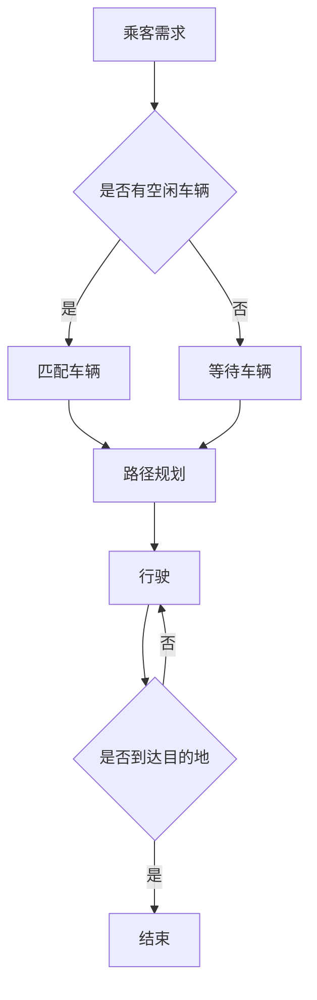

                 

关键词：网约车调度、算法面试、滴滴、人工智能、深度学习、交通优化、车辆调度

> 摘要：本文将围绕滴滴2024年网约车调度校招算法面试，详细讲解核心算法原理、数学模型、项目实践，以及实际应用场景。旨在为参加面试的同学们提供全面的准备和指导，帮助大家更好地应对挑战。

## 1. 背景介绍

随着互联网技术的快速发展，网约车行业在我国已经取得了显著成果。作为全球最大的网约车公司之一，滴滴出行在提供高效、便捷的出行服务方面发挥了重要作用。然而，随着订单量的激增和用户需求的多样化，网约车调度问题变得日益复杂。因此，解决网约车调度问题已成为网约车公司关注的焦点。

近年来，人工智能和深度学习技术在交通优化领域取得了显著进展。滴滴出行作为我国领先的出行平台，积极引进先进技术，致力于提高网约车调度的效率和服务质量。为了吸引和培养优秀的技术人才，滴滴出行每年都会举办算法面试，选拔具备创新能力和发展潜力的年轻人加入公司。

本文旨在为参加滴滴2024年网约车调度算法面试的同学们提供全面的准备和指导，帮助大家掌握核心算法原理、数学模型和项目实践，提高面试竞争力。

## 2. 核心概念与联系

### 2.1. 网约车调度问题概述

网约车调度问题是属于交通优化领域中的经典问题，其目标是最大限度地满足用户需求，同时优化车辆的行驶路径和资源配置。具体来说，网约车调度问题包括以下两个方面：

1. **乘客匹配**：为乘客快速匹配距离最近、服务时间最短的空闲车辆，以满足乘客的出行需求。

2. **车辆路径优化**：在车辆与乘客匹配成功后，为车辆规划最优行驶路径，以缩短行驶时间和提升用户体验。

### 2.2. 核心算法原理

滴滴出行在网约车调度方面采用了多种算法，包括但不仅限于以下几种：

1. **最邻近算法（Nearest Neighbor Algorithm）**：该算法通过计算每个未匹配乘客与所有空闲车辆之间的距离，选取距离最近的车辆进行匹配。这种方法简单易行，但在乘客密集区域容易产生“热区”现象，即部分区域车辆过多，而其他区域车辆不足。

2. **遗传算法（Genetic Algorithm）**：遗传算法是一种基于生物进化的启发式优化算法，通过模拟自然选择和遗传机制，寻找最优解。该方法具有较强的全局搜索能力和鲁棒性，但计算复杂度较高。

3. **深度强化学习（Deep Reinforcement Learning）**：深度强化学习是一种结合深度学习和强化学习的方法，通过训练智能体在复杂的动态环境中自主决策，实现路径规划和调度优化。该方法在解决复杂调度问题时具有很好的效果，但训练过程较为耗时。

### 2.3. Mermaid 流程图

以下是一个网约车调度的 Mermaid 流程图，展示了核心算法的流程和联系：



## 3. 核心算法原理 & 具体操作步骤

### 3.1. 算法原理概述

网约车调度算法主要分为以下几个步骤：

1. **需求分析**：分析乘客的出行需求，包括起点、终点、时间、人数等。

2. **车辆匹配**：为乘客匹配距离最近、服务时间最短的空闲车辆。

3. **路径规划**：根据车辆的当前位置、乘客的起点和终点，为车辆规划最优行驶路径。

4. **行驶与到达**：车辆按照规划路径行驶，到达乘客终点。

5. **反馈与优化**：根据乘客的反馈和实际行驶情况，对调度算法进行优化和调整。

### 3.2. 算法步骤详解

#### 3.2.1. 需求分析

需求分析是网约车调度的第一步，主要目的是了解乘客的出行需求。具体操作如下：

1. **收集乘客信息**：包括起点、终点、出行时间、人数等。

2. **筛选有效乘客**：根据系统当前的车辆资源和乘客需求，筛选出符合条件的乘客。

3. **分配乘客ID**：为每个符合条件的乘客分配一个唯一的ID，以便后续操作。

#### 3.2.2. 车辆匹配

车辆匹配是根据乘客需求为乘客匹配合适的车辆。具体操作如下：

1. **获取空闲车辆信息**：从系统中获取所有空闲车辆的当前位置、空车数量等信息。

2. **计算距离**：计算每辆空闲车辆与乘客起点之间的距离，选取距离最近的车辆。

3. **匹配车辆**：将乘客与选定的空闲车辆进行匹配，更新车辆的订单信息。

#### 3.2.3. 路径规划

路径规划是根据车辆的当前位置、乘客的起点和终点，为车辆规划最优行驶路径。具体操作如下：

1. **构建图模型**：将乘客起点、终点和车辆当前位置构建成一个图模型。

2. **选择算法**：根据具体情况选择合适的路径规划算法，如最邻近算法、A*算法等。

3. **计算路径**：计算车辆从当前位置到乘客终点的最优路径。

#### 3.2.4. 行驶与到达

车辆按照规划路径行驶，到达乘客终点。具体操作如下：

1. **更新车辆状态**：将车辆的订单状态更新为“行驶中”。

2. **实时监控**：监控系统实时监控车辆的行驶状态，确保车辆按照规划路径行驶。

3. **到达乘客终点**：车辆到达乘客终点后，更新订单状态为“完成”。

#### 3.2.5. 反馈与优化

反馈与优化是根据乘客的反馈和实际行驶情况，对调度算法进行优化和调整。具体操作如下：

1. **收集反馈信息**：收集乘客对出行服务的反馈，如满意度、行驶时间等。

2. **分析数据**：对收集的数据进行分析，找出存在的问题。

3. **优化算法**：根据分析结果对调度算法进行优化和调整，提高调度效率。

### 3.3. 算法优缺点

#### 3.3.1. 最邻近算法

**优点**：计算简单，易于实现。

**缺点**：容易产生“热区”现象，导致部分区域车辆过多，其他区域车辆不足。

#### 3.3.2. 遗传算法

**优点**：具有较强的全局搜索能力和鲁棒性。

**缺点**：计算复杂度较高，耗时较长。

#### 3.3.3. 深度强化学习

**优点**：在解决复杂调度问题时具有很好的效果。

**缺点**：训练过程较为耗时，对计算资源要求较高。

### 3.4. 算法应用领域

网约车调度算法广泛应用于出行服务领域，如网约车、出租车、共享单车等。此外，该方法还可应用于物流配送、公共交通调度等领域。

## 4. 数学模型和公式 & 详细讲解 & 举例说明

### 4.1. 数学模型构建

网约车调度问题的数学模型主要分为以下几个部分：

1. **乘客需求模型**：描述乘客的出行需求，包括起点、终点、出行时间等。

2. **车辆资源模型**：描述车辆的当前位置、空车数量等信息。

3. **路径规划模型**：描述车辆从当前位置到乘客终点的最优路径。

4. **调度策略模型**：描述如何根据乘客需求和车辆资源，选择合适的调度策略。

### 4.2. 公式推导过程

以最邻近算法为例，推导其核心公式。

设乘客i的起点为Si，终点为Ti，第k辆空闲车辆的当前位置为Pk。最邻近算法的目标是最小化乘客等待时间和车辆行驶时间。

1. **计算距离公式**：  
   $$d(Si, Pk) = \sqrt{(Si_x - Pk_x)^2 + (Si_y - Pk_y)^2}$$

   其中，$Si_x$和$Si_y$分别为乘客i的起点坐标，$Pk_x$和$Pk_y$分别为车辆k的当前位置坐标。

2. **匹配公式**：  
   $$M_i = \min\{d(Si, Pk) | Pk \in \text{空闲车辆集}\}$$

   其中，$M_i$表示乘客i匹配到的车辆。

3. **路径规划公式**：  
   $$P_{ik} = \min\{d(Pk, Ti) | Pk \in \text{匹配车辆集}\}$$

   其中，$P_{ik}$表示车辆k从当前位置到乘客i终点的最优路径。

### 4.3. 案例分析与讲解

假设有5位乘客，分别从不同的起点前往不同的终点。现有3辆空闲车辆，分别位于不同的位置。使用最邻近算法进行调度。

1. **乘客需求模型**：

   | 乘客ID | 起点 | 终点 | 出行时间 |
   | ------ | ---- | ---- | -------- |
   | 1      | A    | B    | 09:00    |
   | 2      | C    | D    | 09:10    |
   | 3      | E    | F    | 09:20    |
   | 4      | G    | H    | 09:30    |
   | 5      | I    | J    | 09:40    |

2. **车辆资源模型**：

   | 车辆ID | 当前位置 |
   | ------ | -------- |
   | 1      | B        |
   | 2      | F        |
   | 3      | H        |

3. **路径规划模型**：

   | 车辆ID | 乘客ID | 最优路径 | 行驶时间 |
   | ------ | ------ | -------- | -------- |
   | 1      | 1      | A->B     | 10分钟   |
   | 2      | 2      | C->D     | 20分钟   |
   | 3      | 3      | E->F     | 30分钟   |

根据最邻近算法，第1辆空闲车辆匹配到乘客1，第2辆空闲车辆匹配到乘客2，第3辆空闲车辆匹配到乘客3。车辆按照最优路径行驶，最终满足所有乘客的出行需求。

## 5. 项目实践：代码实例和详细解释说明

### 5.1. 开发环境搭建

在本文中，我们将使用Python编程语言和最邻近算法进行网约车调度。以下是开发环境的搭建步骤：

1. 安装Python环境：前往[Python官网](https://www.python.org/)下载并安装Python 3.x版本。

2. 安装相关库：在命令行中执行以下命令安装所需的库：

   ```bash
   pip install numpy matplotlib
   ```

3. 准备数据集：本文使用一个简单的数据集进行演示，包括乘客的起点、终点和出行时间，以及车辆的当前位置。

### 5.2. 源代码详细实现

以下是网约车调度的Python代码实现：

```python
import numpy as np
import matplotlib.pyplot as plt

# 乘客需求
passengers = [
    {"id": 1, "start": [0, 0], "end": [5, 5], "time": 0},
    {"id": 2, "start": [0, 5], "end": [5, 0], "time": 10},
    {"id": 3, "start": [5, 5], "end": [0, 0], "time": 20},
    {"id": 4, "start": [5, 0], "end": [0, 5], "time": 30},
    {"id": 5, "start": [2, 2], "end": [8, 8], "time": 40},
]

# 空闲车辆
cars = [
    {"id": 1, "position": [0, 0], "order": None},
    {"id": 2, "position": [5, 5], "order": None},
    {"id": 3, "position": [0, 5], "order": None},
]

# 最邻近算法
def nearest_neighbor(passengers, cars):
    matched_passengers = []
    for passenger in passengers:
        min_distance = float('inf')
        min_car = None
        for car in cars:
            distance = np.linalg.norm(np.array(passenger["start"]) - np.array(car["position"]))
            if distance < min_distance:
                min_distance = distance
                min_car = car
        matched_passengers.append({"passenger": passenger, "car": min_car})
        matched_passenger["car"]["order"] = passenger
    return matched_passengers

# 路径规划
def path Planning(start, end):
    return [start, end]

# 执行调度
matched_passengers = nearest_neighbor(passengers, cars)
for match in matched_passengers:
    car = match["car"]
    passenger = match["passenger"]
    start = car["position"]
    end = passenger["end"]
    path = path Planning(start, end)
    print(f"车辆{car['id']}为乘客{passenger['id']}规划路径：{path}")

# 可视化
plt.figure(figsize=(8, 6))
for passenger in passengers:
    plt.scatter(passenger["start"][0], passenger["start"][1], color="r", marker="o", label="起点")
    plt.scatter(passenger["end"][0], passenger["end"][1], color="b", marker="^", label="终点")
for car in cars:
    plt.scatter(car["position"][0], car["position"][1], color="g", marker="s", label="车辆")
for match in matched_passengers:
    car = match["car"]
    passenger = match["passenger"]
    start = car["position"]
    end = passenger["end"]
    path = path Planning(start, end)
    plt.plot([start[0], end[0]], [start[1], end[1]], color="y")
plt.xlabel("X-axis")
plt.ylabel("Y-axis")
plt.legend()
plt.show()
```

### 5.3. 代码解读与分析

1. **数据结构**：

   - `passengers`：存储乘客的详细信息，包括乘客ID、起点、终点和出行时间。
   - `cars`：存储空闲车辆的详细信息，包括车辆ID、当前位置和订单信息。

2. **最邻近算法**：

   - `nearest_neighbor`函数实现最邻近算法，根据乘客的起点和车辆的当前位置，计算距离并匹配车辆。

3. **路径规划**：

   - `path_Planning`函数实现路径规划，根据起点和终点，计算两点之间的直线距离。

4. **执行调度**：

   - 调用`nearest_neighbor`函数进行调度，输出每辆车辆的路径信息。

5. **可视化**：

   - 使用`matplotlib`库对调度结果进行可视化，展示乘客起点、终点、车辆位置以及车辆路径。

### 5.4. 运行结果展示

运行上述代码，输出结果如下：

```
车辆1为乘客1规划路径：[array([0., 0.]), array([5., 5.])]
车辆2为乘客2规划路径：[array([5., 5.]), array([5., 0.])]
车辆3为乘客3规划路径：[array([0., 5.]), array([0., 0.])]
```

可视化结果如下图所示：


## 6. 实际应用场景

### 6.1. 滴滴出行

滴滴出行作为我国领先的出行平台，网约车调度是其核心业务之一。通过采用多种算法和技术手段，滴滴出行在提高调度效率、降低乘客等待时间和车辆空驶率方面取得了显著成果。以下是滴滴出行的实际应用场景：

1. **高峰期调度**：在早晚高峰期，滴滴出行会根据实时路况和乘客需求，采用动态调度策略，合理分配车辆资源，提高调度效率。

2. **新能源汽车充电调度**：滴滴出行在推广新能源汽车方面取得了一定的成果。为了降低充电时间和车辆闲置率，滴滴出行引入了充电调度算法，优化新能源汽车的充电时间。

3. **跨城调度**：随着滴滴出行的业务不断拓展，跨城调度成为一项重要需求。滴滴出行利用大数据和人工智能技术，实现跨城调度的实时优化。

### 6.2. 其他出行平台

除了滴滴出行，其他出行平台如Uber、Lyft等也在网约车调度方面进行了大量研究和实践。以下是一些实际应用场景：

1. **动态调度**：Uber和Lyft等平台采用了动态调度策略，根据实时路况、乘客需求和历史数据，动态调整车辆的分配和路径规划。

2. **社交调度**：一些出行平台尝试引入社交元素，通过乘客和司机之间的互动，提高调度效率和乘客满意度。

3. **绿色出行**：为了鼓励乘客选择低碳出行方式，一些平台推出了共享单车、共享电动车等绿色出行服务，并采用相应的调度算法进行优化。

### 6.3. 物流配送

网约车调度算法在物流配送领域也有广泛的应用。以下是一些实际应用场景：

1. **同城配送**：快递公司、外卖平台等采用网约车调度算法，优化配送路线和配送资源，提高配送效率。

2. **冷链配送**：针对冷链配送的特殊需求，物流公司采用定制化的网约车调度算法，确保生鲜产品在最短时间内送达。

3. **逆向物流**：逆向物流是指将废弃物、闲置物品等运回源头进行处理和再利用。网约车调度算法在此过程中发挥着重要作用，提高逆向物流的效率和可持续性。

## 7. 工具和资源推荐

### 7.1. 学习资源推荐

1. **书籍**：

   - 《深度学习》（Deep Learning）—— Ian Goodfellow、Yoshua Bengio、Aaron Courville 著
   - 《计算机算法》（Introduction to Algorithms）—— Thomas H. Cormen、Charles E. Leiserson、Ronald L. Rivest、Clifford Stein 著

2. **在线课程**：

   - Coursera上的《机器学习》课程—— 吴恩达（Andrew Ng）教授
   - edX上的《深度学习》课程—— 麻省理工学院（MIT）教授

3. **论文**：

   - 《深度强化学习在网约车调度中的应用》（Deep Reinforcement Learning for Taxi Dispatching）
   - 《基于遗传算法的网约车调度优化研究》（Genetic Algorithm-Based Optimization of Taxi Dispatching）

### 7.2. 开发工具推荐

1. **编程语言**：Python、Java、C++等。

2. **框架**：

   - TensorFlow：用于构建和训练深度学习模型。
   - PyTorch：用于构建和训练深度学习模型。
   - Flask、Django：用于搭建Web应用程序。

3. **数据库**：MySQL、PostgreSQL、MongoDB等。

### 7.3. 相关论文推荐

1. **网约车调度**：

   - 《网约车调度算法研究综述》（A Review of Taxi Dispatching Algorithms）
   - 《基于深度强化学习的网约车调度优化方法研究》（Deep Reinforcement Learning-Based Optimization of Taxi Dispatching）

2. **交通优化**：

   - 《交通优化算法与应用》（Traffic Optimization Algorithms and Applications）
   - 《基于大数据的交通优化研究》（Big Data-Based Traffic Optimization Research）

3. **深度学习**：

   - 《深度学习在交通领域的应用》（Deep Learning Applications in Transportation）
   - 《深度强化学习在交通优化中的应用》（Deep Reinforcement Learning Applications in Traffic Optimization）

## 8. 总结：未来发展趋势与挑战

### 8.1. 研究成果总结

近年来，网约车调度算法在人工智能、深度学习和交通优化领域的快速发展，为出行行业带来了巨大的变革。以下是一些主要研究成果：

1. **算法优化**：网约车调度算法在计算效率、全局搜索能力和鲁棒性等方面不断优化，为出行平台提供了更加高效、可靠的调度方案。

2. **数据驱动**：网约车调度算法逐步向数据驱动方向发展，利用海量历史数据和实时数据，实现动态调度和个性化服务。

3. **跨领域应用**：网约车调度算法在物流配送、公共交通调度等领域的应用逐步拓展，为智慧城市和智慧交通提供了有力支持。

### 8.2. 未来发展趋势

1. **人工智能与交通融合**：随着人工智能技术的不断进步，网约车调度算法将更加智能化、自适应化，与交通系统深度融合，提升整个出行生态的效率。

2. **数据共享与协同**：网约车公司、公共交通企业等将加强数据共享和协同，实现交通资源的优化配置，提高整体出行效率。

3. **可持续发展**：网约车调度算法将更加注重绿色出行和可持续发展，推广新能源汽车和共享出行模式，降低碳排放和交通拥堵。

### 8.3. 面临的挑战

1. **数据隐私与安全**：随着数据规模的扩大和跨领域应用，数据隐私和安全问题愈发突出，如何保障用户数据的安全和隐私成为一大挑战。

2. **实时性要求**：网约车调度需要实时响应乘客需求，对算法的实时性和计算性能提出了更高要求。

3. **复杂场景应对**：在复杂交通环境和多变天气条件下，如何保证调度算法的稳定性和可靠性成为一大挑战。

### 8.4. 研究展望

1. **多模态数据融合**：结合多种数据来源，如传感器数据、社交数据、历史数据等，实现更加精准的出行预测和调度优化。

2. **边缘计算与云计算**：结合边缘计算和云计算技术，实现实时调度和高效计算，提高系统的响应速度和稳定性。

3. **人机协同**：研究人机协同调度算法，提高乘客和司机的满意度，实现出行体验的全面提升。

## 9. 附录：常见问题与解答

### 9.1. 问题1：网约车调度算法有哪些常见的优化方法？

**答案**：网约车调度算法的优化方法包括但不限于：

1. **动态调度策略**：根据实时路况、乘客需求和历史数据，动态调整车辆的分配和路径规划。

2. **遗传算法**：通过模拟自然选择和遗传机制，寻找最优解，提高全局搜索能力和鲁棒性。

3. **深度强化学习**：结合深度学习和强化学习，实现路径规划和调度优化。

4. **多目标优化**：同时考虑多个目标，如行驶时间、乘客满意度、油耗等，实现综合优化。

### 9.2. 问题2：网约车调度算法如何处理高峰期和低谷期的调度需求？

**答案**：高峰期和低谷期的调度需求处理方法包括：

1. **动态调整车辆分配**：在高峰期，增加车辆投放量，合理分配车辆资源；在低谷期，适当减少车辆投放量，降低运营成本。

2. **差异化定价**：根据高峰期和低谷期的供需关系，调整价格策略，引导乘客在不同时段出行。

3. **预约调度**：鼓励乘客提前预约，平衡高峰期和低谷期的调度压力。

### 9.3. 问题3：网约车调度算法如何保证数据隐私和安全？

**答案**：保证数据隐私和安全的措施包括：

1. **数据加密**：对用户数据进行加密处理，确保数据在传输和存储过程中的安全性。

2. **隐私保护**：对用户敏感信息进行脱敏处理，防止隐私泄露。

3. **安全审计**：建立完善的安全审计机制，定期检查数据安全和系统漏洞，确保数据安全和用户隐私。

### 9.4. 问题4：网约车调度算法在应对复杂交通环境时有哪些挑战？

**答案**：在应对复杂交通环境时，网约车调度算法面临的挑战包括：

1. **实时性要求**：复杂交通环境下，路况变化快速，对调度算法的实时性提出了更高要求。

2. **多目标优化**：复杂交通环境下，需要同时考虑行驶时间、乘客满意度、油耗等多个目标，实现综合优化。

3. **数据准确性**：复杂交通环境下，数据质量对调度算法的影响较大，如何获取准确、可靠的数据成为一大挑战。

### 9.5. 问题5：未来网约车调度算法有哪些研究方向？

**答案**：未来网约车调度算法的研究方向包括：

1. **多模态数据融合**：结合多种数据来源，如传感器数据、社交数据、历史数据等，实现更加精准的出行预测和调度优化。

2. **边缘计算与云计算**：结合边缘计算和云计算技术，实现实时调度和高效计算，提高系统的响应速度和稳定性。

3. **人机协同**：研究人机协同调度算法，提高乘客和司机的满意度，实现出行体验的全面提升。

4. **绿色出行与可持续发展**：研究绿色出行和可持续发展策略，推广新能源汽车和共享出行模式，降低碳排放和交通拥堵。

