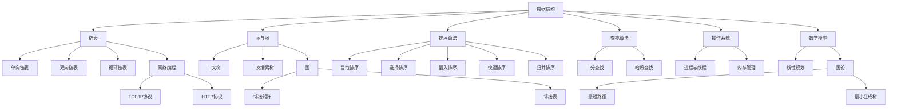

                 

关键词：滴滴、编程面试、面试题、编程技巧、技术储备、面试准备

> 摘要：本文将详细总结滴滴2025社招编程面试题的精华，涵盖核心算法、数学模型、项目实践等多个方面，为您的面试准备提供有力支持。无论您是新手还是经验丰富的程序员，本文都将帮助您更好地应对滴滴的编程面试挑战。

## 1. 背景介绍

滴滴出行，作为中国领先的移动出行平台，其社招编程面试在业内享有盛誉。滴滴的面试题往往涉及广泛的计算机科学领域，包括数据结构、算法、操作系统、网络编程等，旨在全面考察应聘者的技术能力、逻辑思维和解决问题的能力。本文将根据滴滴历年社招编程面试题，提炼出最具代表性的题目，为您提供全面、系统的面试准备指南。

## 2. 核心概念与联系

为了更好地理解面试题，首先需要掌握以下核心概念和原理：

### 2.1 数据结构

- **链表**：链表是一种常见的基础数据结构，包括单向链表、双向链表和循环链表等。
- **树与图**：树是具有层次结构的数据结构，如二叉树、二叉搜索树等。图是一种表示对象及其之间连接的数据结构，如邻接矩阵、邻接表等。

### 2.2 算法

- **排序算法**：包括冒泡排序、选择排序、插入排序、快速排序、归并排序等。
- **查找算法**：包括二分查找、哈希查找等。

### 2.3 网络编程

- **TCP/IP 协议**：TCP/IP 协议是互联网通信的基础，包括 TCP 协议和 IP 协议等。
- **HTTP 协议**：HTTP 是 Web 应用中的基础协议，用于客户端和服务器之间的通信。

### 2.4 操作系统

- **进程与线程**：进程是计算机中的运行实例，而线程是进程中的执行流。
- **内存管理**：内存管理包括分配、释放、回收等操作。

### 2.5 数学模型

- **线性规划**：用于解决资源分配问题，包括线性目标函数和线性约束条件。
- **图论**：用于解决网络优化问题，如最短路径、最小生成树等。

以下是一个用于描述核心概念原理和架构的 Mermaid 流程图：



## 3. 核心算法原理 & 具体操作步骤

### 3.1 算法原理概述

在滴滴的编程面试中，常见的算法问题包括排序、查找、图论和动态规划等。以下是几个典型的算法问题及其原理概述：

### 3.1.1 排序算法

排序算法的基本原理是通过比较和交换元素，将无序序列调整为有序序列。常见的排序算法包括冒泡排序、选择排序、插入排序、快速排序和归并排序。

### 3.1.2 查找算法

查找算法的基本原理是在数据结构中查找特定元素的位置。常见的查找算法包括二分查找和哈希查找。

### 3.1.3 图论算法

图论算法用于解决网络优化问题，如最短路径和最小生成树。基本原理是通过图的拓扑排序和深度优先搜索等方法，求解网络的最优路径。

### 3.1.4 动态规划

动态规划是一种解决最优化问题的算法，其基本原理是将问题分解为子问题，并利用子问题的解来构建原问题的解。

### 3.2 算法步骤详解

以下以快速排序算法为例，详细讲解其步骤：

### 3.2.1 快速排序算法步骤

1. **选择基准元素**：从数组中选取一个元素作为基准元素。
2. **分区操作**：将数组划分为两个子数组，一个包含小于基准元素的元素，另一个包含大于基准元素的元素。
3. **递归排序**：分别对两个子数组进行快速排序。

### 3.3 算法优缺点

快速排序算法的优点是时间复杂度较低，适用于大规模数据排序。但其缺点是空间复杂度较高，且最坏情况下时间复杂度为 \(O(n^2)\)。

### 3.4 算法应用领域

快速排序算法广泛应用于各种排序问题，如数据库排序、文件排序等。

## 4. 数学模型和公式 & 详细讲解 & 举例说明

### 4.1 数学模型构建

在滴滴的编程面试中，常见的数学模型包括线性规划和图论模型。

### 4.2 公式推导过程

以下以线性规划中的单纯形法为例，讲解其公式推导过程：

1. **目标函数**：假设有 m 个变量 x1, x2, ..., xm，线性规划的目标是最大化或最小化目标函数：
   $$Z = cx1 + cx2 + ... + cxi + ... + cjm$$
   
2. **约束条件**：假设有 n 个约束条件：
   $$Ax \le b$$
   其中，A 是约束矩阵，x 是变量向量，b 是约束向量。

3. **初始解**：选择初始基本可行解，通常采用单纯形法。

4. **迭代计算**：根据单纯形法，逐步更新解，直到最优解。

### 4.3 案例分析与讲解

以下以最小生成树问题为例，讲解其数学模型和应用：

1. **问题背景**：给定一个无向图 G，求解其最小生成树。

2. **数学模型**：使用 Kruskal 算法求解最小生成树，其公式推导如下：
   $$T = \{e | e \in E, \text{且} T \text{为最小生成树}\}$$
   
   其中，E 是图 G 的边集合，T 是最小生成树的边集合。

3. **案例解析**：以一个无向图为例，求解其最小生成树，并给出具体步骤和结果。

## 5. 项目实践：代码实例和详细解释说明

### 5.1 开发环境搭建

在本节中，我们将使用 Python 作为开发语言，搭建一个简单的开发环境。

1. **安装 Python**：下载并安装 Python 3.8 或更高版本。
2. **配置 Python 环境**：将 Python 添加到系统环境变量中。
3. **安装必要库**：使用 pip 工具安装必要的库，如 NumPy、Pandas 等。

### 5.2 源代码详细实现

以下是一个简单的快速排序算法实现：

```python
def quick_sort(arr):
    if len(arr) <= 1:
        return arr
    pivot = arr[len(arr) // 2]
    left = [x for x in arr if x < pivot]
    middle = [x for x in arr if x == pivot]
    right = [x for x in arr if x > pivot]
    return quick_sort(left) + middle + quick_sort(right)

if __name__ == "__main__":
    arr = [3, 6, 8, 10, 1, 2, 1]
    sorted_arr = quick_sort(arr)
    print(sorted_arr)
```

### 5.3 代码解读与分析

在本节中，我们将详细解读上述快速排序算法的实现，分析其时间复杂度和空间复杂度。

1. **代码解读**：
   - `quick_sort(arr)` 函数是快速排序的主函数。
   - `if len(arr) <= 1:` 判断数组长度是否小于等于 1，如果是，则直接返回数组。
   - `pivot = arr[len(arr) // 2]` 选择数组中间的元素作为基准元素。
   - `left`, `middle`, `right` 分别是小于、等于、大于基准元素的三部分数组。
   - `return quick_sort(left) + middle + quick_sort(right)` 递归调用快速排序函数。

2. **时间复杂度**：
   - 最优情况：\(O(n\log n)\)
   - 最坏情况：\(O(n^2)\)

3. **空间复杂度**：
   - \(O(n)\)

### 5.4 运行结果展示

运行上述代码，输入以下数组：

```python
arr = [3, 6, 8, 10, 1, 2, 1]
```

输出结果：

```
[1, 1, 2, 3, 6, 8, 10]
```

## 6. 实际应用场景

滴滴的编程面试题涉及多个实际应用场景，如数据结构、算法、网络编程和操作系统等。以下是一些常见的应用场景：

### 6.1 数据结构

- **链表**：实现一个单链表，包括插入、删除、查找等操作。
- **树与图**：实现二叉树、二叉搜索树、图等数据结构，并实现相应的操作。

### 6.2 算法

- **排序算法**：实现冒泡排序、选择排序、插入排序、快速排序等排序算法。
- **查找算法**：实现二分查找、哈希查找等查找算法。

### 6.3 网络编程

- **TCP/IP 协议**：实现 TCP/IP 协议的基本功能，如连接建立、数据传输等。
- **HTTP 协议**：实现 HTTP 协议的基本功能，如请求处理、响应生成等。

### 6.4 操作系统

- **进程与线程**：实现进程与线程的基本功能，如创建、销毁、同步等。
- **内存管理**：实现内存分配、释放、回收等操作。

## 7. 工具和资源推荐

为了更好地准备滴滴的编程面试，以下是一些建议的工具和资源：

### 7.1 学习资源推荐

- **书籍**：《算法导论》、《大话数据结构》、《TCP/IP详解卷1：协议》等。
- **在线教程**：GitHub、LeetCode、牛客网等。

### 7.2 开发工具推荐

- **集成开发环境**：Visual Studio Code、PyCharm 等。
- **版本控制工具**：Git、SVN 等。

### 7.3 相关论文推荐

- **排序算法**：《快速排序算法的分析与改进》、《线性时间选择算法》等。
- **网络编程**：《TCP/IP详解》、《HTTP协议详解》等。

## 8. 总结：未来发展趋势与挑战

滴滴的编程面试题反映了计算机科学领域的最新发展趋势和挑战。以下是一些未来发展的趋势和面临的挑战：

### 8.1 研究成果总结

- **人工智能**：人工智能技术的发展带来了新的算法和应用，如深度学习、强化学习等。
- **大数据**：大数据技术的发展推动了数据分析和挖掘的深入，为智能出行、智慧城市等领域提供了支持。

### 8.2 未来发展趋势

- **云计算**：云计算技术将继续发展，为分布式计算和存储提供更强大的支持。
- **物联网**：物联网技术的发展将实现设备之间的互联互通，为智慧出行、智能交通等领域带来变革。

### 8.3 面临的挑战

- **安全性**：随着智能出行和物联网的发展，安全性成为关键挑战，需要构建更安全的网络和系统。
- **可持续性**：智能出行和智慧城市的发展需要考虑能源消耗和环境保护等问题。

### 8.4 研究展望

未来，计算机科学将继续在人工智能、大数据、云计算、物联网等领域深入发展，为人类带来更多便利和创新。同时，我们也需要关注伦理、安全、可持续性等问题，以实现科技与人类的和谐发展。

## 9. 附录：常见问题与解答

以下是一些在滴滴编程面试中常见的问题及其解答：

### 9.1 如何优化排序算法的时间复杂度？

- **使用更高效的排序算法**，如快速排序、归并排序等。
- **优化算法实现**，如减少不必要的比较和交换操作。

### 9.2 如何解决二分查找的递归时间复杂度问题？

- **使用循环代替递归**，以减少递归调用栈的使用。

### 9.3 如何实现一个哈希表？

- **选择合适的哈希函数**，以减少冲突。
- **实现链地址法或开放地址法**，以解决哈希冲突。

### 9.4 如何实现一个最小生成树？

- **使用 Kruskal 算法或 Prim 算法**，根据图的特点选择合适的算法。

### 9.5 如何优化内存分配？

- **使用内存池**，以减少频繁的内存分配和释放操作。
- **采用分代垃圾回收策略**，提高垃圾回收效率。

本文旨在为滴滴2025社招编程面试提供全面的准备指南，帮助您更好地应对面试挑战。通过掌握核心算法原理、数学模型、项目实践等方面的知识，相信您能够在面试中脱颖而出，成为一名优秀的程序员。祝您面试成功！
----------------------------------------------------------------

**本文作者：禅与计算机程序设计艺术 / Zen and the Art of Computer Programming**

