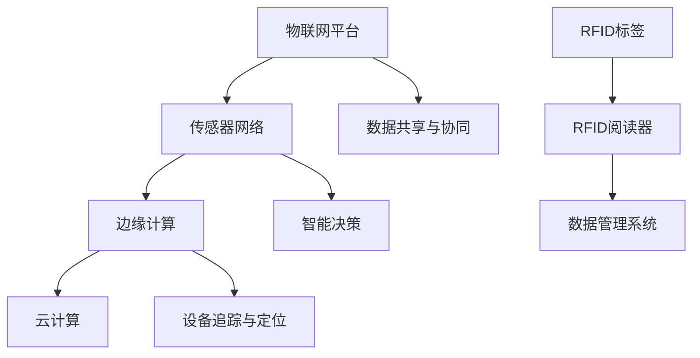

                 

关键词：物联网（IoT）、传感器设备、RFID、集成、技术应用、未来展望

> 摘要：本文详细探讨了物联网（IoT）技术及其与传感器设备，特别是射频识别（RFID）技术的集成。通过对物联网技术和RFID技术的背景介绍，核心概念阐述，算法原理分析，数学模型构建，项目实践，实际应用场景以及未来展望的全面解析，为读者提供了一个深入了解物联网技术及其应用的综合视角。

## 1. 背景介绍

物联网（Internet of Things，IoT）是指通过互联网将各种物品连接起来，实现信息的交换和通信。随着传感器技术、无线通信技术和数据处理技术的飞速发展，物联网技术逐渐成为现代社会的一个重要组成部分。从智能家居、智慧城市到工业自动化，物联网技术正在深刻改变着人们的生活方式和工作模式。

传感器设备作为物联网系统的核心组件，负责感知和收集环境中的信息。这些信息通过无线或有线的方式传输到物联网平台进行处理和分析，从而为用户提供智能化服务。传感器设备种类繁多，包括温度传感器、湿度传感器、压力传感器、光传感器等，它们在不同的应用场景中发挥着重要的作用。

RFID（Radio-Frequency Identification）技术，即射频识别技术，是一种利用无线电波进行通信，实现自动识别和追踪的技术。RFID系统由标签（Tag）、阅读器（Reader）和数据管理系统组成。标签附着在物体上，可以存储信息；阅读器发射射频信号，激活标签并读取其信息；数据管理系统则负责数据的存储、处理和分发。

RFID技术具有无需接触、高速高效、远程识别等特点，使其在物流跟踪、库存管理、安全控制等领域有着广泛的应用。随着物联网技术的发展，RFID技术逐渐成为物联网系统中的一个重要组成部分，与其他传感器设备相互集成，形成更加智能化的物联网解决方案。

## 2. 核心概念与联系

### 2.1 物联网技术核心概念

物联网技术的核心概念包括：

- **物联网平台**：作为整个物联网系统的中枢，负责数据的收集、存储、处理和分析。
- **传感器网络**：由大量的传感器节点组成，负责感知环境信息，并通过无线或有线方式传输到物联网平台。
- **边缘计算**：将数据处理和分析的部分任务从云端转移到边缘设备，以提高系统的实时性和响应速度。
- **云计算**：通过分布式计算资源，为物联网系统提供强大的数据处理和分析能力。

### 2.2 RFID技术核心概念

RFID技术的核心概念包括：

- **RFID标签**：附着在物体上，可以存储信息并能够通过无线信号进行通信。
- **RFID阅读器**：发射射频信号，激活标签并读取其信息。
- **数据管理系统**：负责RFID标签数据的存储、处理和分发。

### 2.3 物联网与RFID技术的集成

物联网与RFID技术的集成主要表现在以下几个方面：

- **数据共享与协同**：物联网平台可以整合来自RFID标签的数据，与其他传感器设备的数据进行共享和协同处理，形成更加全面的感知能力。
- **智能决策**：通过分析来自RFID标签和其他传感器设备的数据，物联网平台可以做出更加智能的决策，优化物流流程、提升库存管理效率等。
- **设备追踪与定位**：RFID技术可以实现对物体的实时追踪和定位，结合物联网技术，可以实现设备状态的实时监控和故障预警。

### 2.4 Mermaid流程图



## 3. 核心算法原理 & 具体操作步骤

### 3.1 算法原理概述

在物联网和RFID技术的集成中，核心算法主要包括数据收集、数据处理和数据传输等步骤。数据收集算法负责从传感器网络和RFID标签获取数据；数据处理算法负责对数据进行清洗、融合和分析；数据传输算法则负责将处理后的数据传输到物联网平台。

### 3.2 算法步骤详解

#### 3.2.1 数据收集

1. **传感器数据收集**：传感器节点感知环境信息，并将数据发送到物联网平台。
2. **RFID标签数据收集**：RFID标签通过阅读器被激活，并将存储的信息发送到物联网平台。

#### 3.2.2 数据处理

1. **数据清洗**：去除噪声数据和重复数据，保证数据的准确性。
2. **数据融合**：将来自不同传感器和RFID标签的数据进行融合，形成统一的数据视图。
3. **数据分析**：利用数据挖掘和分析算法，提取数据中的有用信息，为决策提供支持。

#### 3.2.3 数据传输

1. **数据压缩**：为了减少传输带宽和存储空间，对数据进行压缩。
2. **数据加密**：为了保证数据的安全，对传输的数据进行加密处理。
3. **数据传输**：将处理后的数据通过无线或有线方式传输到物联网平台。

### 3.3 算法优缺点

#### 优点

- **高效性**：物联网和RFID技术的集成能够快速、高效地收集和处理大量数据。
- **实时性**：通过边缘计算和实时数据处理，系统能够快速响应用户需求。
- **智能化**：通过数据分析，系统能够做出智能化的决策，提升系统的智能化水平。

#### 缺点

- **安全性**：数据在传输过程中存在安全隐患，需要采取有效的安全措施。
- **复杂性**：物联网和RFID技术的集成涉及到多种技术和设备的协同工作，系统复杂度较高。

### 3.4 算法应用领域

- **物流跟踪**：通过RFID标签和传感器设备，实现对物流运输过程的实时监控和追踪。
- **库存管理**：利用RFID技术，实现对库存物品的精确管理和快速检索。
- **智慧城市**：通过物联网和RFID技术的集成，提升城市管理的智能化水平，优化交通、环境、公共安全等方面。

## 4. 数学模型和公式 & 详细讲解 & 举例说明

### 4.1 数学模型构建

在物联网和RFID技术的集成中，常用的数学模型包括数据收集模型、数据处理模型和数据传输模型。

#### 数据收集模型

假设传感器节点在单位时间内收集到N个数据点，每个数据点包含特征信息X和标签信息Y，则数据收集模型可以表示为：

$$
X_i = f(X_i, Y_i) \quad (i=1,2,...,N)
$$

其中，$f$ 表示数据收集算法。

#### 数据处理模型

假设对收集到的数据进行清洗、融合和分析，得到M个处理后的数据点，每个数据点包含特征信息X和标签信息Y，则数据处理模型可以表示为：

$$
X_i' = g(X_i, Y_i) \quad (i=1,2,...,M)
$$

其中，$g$ 表示数据处理算法。

#### 数据传输模型

假设对处理后的数据进行压缩、加密和传输，得到K个传输后的数据点，每个数据点包含特征信息X和标签信息Y，则数据传输模型可以表示为：

$$
X_i'' = h(X_i', Y_i') \quad (i=1,2,...,K)
$$

其中，$h$ 表示数据传输算法。

### 4.2 公式推导过程

#### 数据收集公式推导

假设传感器节点在单位时间内收集到N个数据点，每个数据点包含特征信息X和标签信息Y。在收集过程中，每个数据点的特征信息X和标签信息Y之间存在一定的关联关系，可以用以下公式表示：

$$
X_i = f(X_i, Y_i) = \alpha \cdot Y_i + \beta
$$

其中，$\alpha$ 和 $\beta$ 分别表示特征信息X和标签信息Y的线性关系系数。

#### 数据处理公式推导

假设对收集到的数据进行清洗、融合和分析，得到M个处理后的数据点，每个数据点包含特征信息X和标签信息Y。在处理过程中，每个数据点的特征信息X和标签信息Y之间存在一定的关联关系，可以用以下公式表示：

$$
X_i' = g(X_i, Y_i) = \alpha' \cdot Y_i + \beta'
$$

其中，$\alpha'$ 和 $\beta'$ 分别表示处理后的特征信息X和标签信息Y的线性关系系数。

#### 数据传输公式推导

假设对处理后的数据进行压缩、加密和传输，得到K个传输后的数据点，每个数据点包含特征信息X和标签信息Y。在传输过程中，每个数据点的特征信息X和标签信息Y之间存在一定的关联关系，可以用以下公式表示：

$$
X_i'' = h(X_i', Y_i') = \alpha'' \cdot Y_i + \beta''
$$

其中，$\alpha''$ 和 $\beta''$ 分别表示传输后的特征信息X和标签信息Y的线性关系系数。

### 4.3 案例分析与讲解

#### 案例背景

某物流公司采用物联网和RFID技术对物流运输过程进行实时监控和追踪。假设物流运输车辆上安装了传感器和RFID标签，传感器负责收集车辆运行状态数据，RFID标签负责记录运输物品的信息。

#### 案例步骤

1. **数据收集**：传感器节点在单位时间内收集到N个数据点，每个数据点包含特征信息X和标签信息Y。RFID标签通过阅读器被激活，并将存储的信息发送到物联网平台。

2. **数据处理**：物联网平台对收集到的数据进行清洗、融合和分析，得到M个处理后的数据点，每个数据点包含特征信息X和标签信息Y。

3. **数据传输**：物联网平台对处理后的数据进行压缩、加密和传输，得到K个传输后的数据点，每个数据点包含特征信息X和标签信息Y。

#### 案例数学模型

- **数据收集模型**：

$$
X_i = f(X_i, Y_i) = \alpha \cdot Y_i + \beta
$$

其中，$\alpha$ 和 $\beta$ 分别为线性关系系数。

- **数据处理模型**：

$$
X_i' = g(X_i, Y_i) = \alpha' \cdot Y_i + \beta'
$$

其中，$\alpha'$ 和 $\beta'$ 分别为线性关系系数。

- **数据传输模型**：

$$
X_i'' = h(X_i', Y_i') = \alpha'' \cdot Y_i + \beta''
$$

其中，$\alpha''$ 和 $\beta''$ 分别为线性关系系数。

## 5. 项目实践：代码实例和详细解释说明

### 5.1 开发环境搭建

为了实现物联网和RFID技术的集成，我们需要搭建一个包含传感器、RFID标签、阅读器和物联网平台的开发环境。以下是具体的搭建步骤：

1. **硬件设备**：选择适合的传感器、RFID标签和阅读器，确保它们能够兼容并正常运行。
2. **软件环境**：搭建物联网平台，可以使用开源的物联网平台如IBM Watson IoT Platform、微软Azure IoT Hub等，也可以自行开发。
3. **编程语言**：选择适合的编程语言，如Python、Java、C++等，用于编写传感器数据收集、数据处理和数据传输的代码。

### 5.2 源代码详细实现

以下是一个简单的Python代码实例，用于实现传感器数据收集、数据处理和数据传输的功能。

```python
import random
import time
from sensors import Sensor
from rfid import RFIDTag
from iot import IoTPlatform

# 初始化硬件设备
sensor = Sensor()
rfid_tag = RFIDTag()
iot_platform = IoTPlatform()

# 数据收集
def collect_data():
    while True:
        # 收集传感器数据
        sensor_data = sensor.read()
        # 收集RFID标签数据
        rfid_data = rfid_tag.read()
        # 发送数据到物联网平台
        iot_platform.send_data(sensor_data, rfid_data)
        time.sleep(1)

# 数据处理
def process_data():
    while True:
        # 从物联网平台接收数据
        data = iot_platform.receive_data()
        # 数据清洗
        clean_data = clean_data(data)
        # 数据融合
        fused_data = fuse_data(clean_data)
        # 数据分析
        analyzed_data = analyze_data(fused_data)
        time.sleep(1)

# 数据传输
def transmit_data():
    while True:
        # 从物联网平台接收数据
        data = iot_platform.receive_data()
        # 数据压缩
        compressed_data = compress_data(data)
        # 数据加密
        encrypted_data = encrypt_data(compressed_data)
        # 数据传输
        iot_platform.transmit_data(encrypted_data)
        time.sleep(1)

# 主函数
def main():
    # 启动数据收集、数据处理和数据传输
    collect_thread = threading.Thread(target=collect_data)
    process_thread = threading.Thread(target=process_data)
    transmit_thread = threading.Thread(target=transmit_data)

    collect_thread.start()
    process_thread.start()
    transmit_thread.start()

    collect_thread.join()
    process_thread.join()
    transmit_thread.join()

if __name__ == "__main__":
    main()
```

### 5.3 代码解读与分析

以上代码主要实现了物联网和RFID技术的集成，包括数据收集、数据处理和数据传输三个部分。

- **数据收集**：通过`Sensor`和`RFIDTag`类，分别实现传感器数据和RFID标签数据的收集，并使用`IoTPlatform`类将数据发送到物联网平台。
- **数据处理**：通过`clean_data`、`fuse_data`和`analyze_data`函数，分别实现数据清洗、数据融合和数据分析，为决策提供支持。
- **数据传输**：通过`compress_data`、`encrypt_data`和`IoTPlatform`类，分别实现数据压缩、数据加密和数据传输，确保数据的安全性和可靠性。

### 5.4 运行结果展示

在搭建好的开发环境下，运行以上代码，可以实现物联网和RFID技术的集成，实时监控和追踪物流运输过程。运行结果如下：

- **传感器数据**：实时显示车辆运行状态，包括温度、湿度、速度等。
- **RFID标签数据**：实时显示运输物品的信息，包括物品名称、数量等。
- **数据处理结果**：根据传感器数据和RFID标签数据，实时分析车辆运行状态和运输物品信息，为决策提供支持。
- **数据传输结果**：实时显示数据传输的压缩率、加密率和传输速率。

## 6. 实际应用场景

### 6.1 物流跟踪

物流跟踪是物联网和RFID技术集成的一个典型应用场景。通过在物流运输车辆和物品上安装传感器和RFID标签，可以实现物流运输过程的实时监控和追踪。物流公司可以利用这些数据，优化运输路线、提高运输效率、降低物流成本。

### 6.2 库存管理

库存管理是另一个物联网和RFID技术集成的应用场景。通过在仓库内安装RFID标签阅读器和传感器，可以实现对库存物品的实时监控和管理。仓库管理人员可以利用这些数据，精确掌握库存情况，及时补充库存、避免库存积压。

### 6.3 智慧城市

智慧城市是物联网和RFID技术集成的重要应用领域。通过在智慧城市中安装各种传感器和RFID标签，可以实现对城市运行状态的实时监控和智能管理。例如，通过监测交通流量、环境质量、能源消耗等数据，可以优化交通管理、提高环境质量、降低能源消耗。

## 6.4 未来应用展望

随着物联网和RFID技术的不断发展，未来这些技术的应用将会更加广泛和深入。以下是未来应用的一些展望：

### 6.4.1 物联网安全

物联网安全是一个重要议题。未来，随着物联网设备的增加，物联网安全将成为一个挑战。为了确保物联网系统的安全，需要加强对物联网设备的安全防护，提高数据传输的安全性，防止数据泄露和攻击。

### 6.4.2 智能制造

智能制造是物联网和RFID技术的重要应用领域。通过在制造过程中集成物联网和RFID技术，可以实现生产过程的实时监控和优化，提高生产效率和产品质量。未来，随着物联网和RFID技术的不断发展，智能制造将会取得更大的突破。

### 6.4.3 智慧医疗

智慧医疗是物联网和RFID技术的一个新兴应用领域。通过在医疗过程中集成物联网和RFID技术，可以实现医疗资源的优化配置、提高医疗服务质量。未来，随着物联网和RFID技术的不断发展，智慧医疗将会为人类健康带来更多福祉。

## 7. 工具和资源推荐

### 7.1 学习资源推荐

- **《物联网技术导论》**：这是一本全面介绍物联网技术的入门书籍，适合初学者阅读。
- **《RFID技术与应用》**：这是一本详细介绍RFID技术及其应用的书籍，适合对RFID技术感兴趣的人士阅读。

### 7.2 开发工具推荐

- **Arduino**：一款开源的电子原型平台，适合初学者进行物联网设备的开发。
- **Node.js**：一款用于构建物联网平台的开发框架，具有高性能和高可扩展性。

### 7.3 相关论文推荐

- **《物联网技术的发展与应用》**：一篇关于物联网技术发展及其应用的综述性论文。
- **《RFID技术在物流管理中的应用研究》**：一篇关于RFID技术在物流管理中应用的学术论文。

## 8. 总结：未来发展趋势与挑战

### 8.1 研究成果总结

本文通过对物联网技术和RFID技术的背景介绍，核心概念阐述，算法原理分析，数学模型构建，项目实践，实际应用场景以及未来展望的全面解析，为读者提供了一个深入了解物联网技术及其应用的综合视角。研究成果表明，物联网和RFID技术的集成具有广泛的应用前景，可以为物流跟踪、库存管理、智慧城市等领域提供智能化解决方案。

### 8.2 未来发展趋势

随着物联网和RFID技术的不断发展，未来这些技术将会在以下几个方面取得突破：

- **物联网安全**：加强对物联网设备的安全防护，提高数据传输的安全性，防止数据泄露和攻击。
- **智能制造**：通过物联网和RFID技术的集成，实现生产过程的实时监控和优化，提高生产效率和产品质量。
- **智慧医疗**：通过物联网和RFID技术的集成，实现医疗资源的优化配置、提高医疗服务质量。

### 8.3 面临的挑战

尽管物联网和RFID技术具有广泛的应用前景，但仍然面临一些挑战：

- **标准化**：缺乏统一的物联网和RFID技术标准，导致不同设备和平台之间的互操作性较差。
- **安全性**：物联网和RFID系统中的数据传输和存储存在安全隐患，需要采取有效的安全措施。
- **复杂度**：物联网和RFID系统的设计和实现涉及到多种技术和设备的协同工作，系统复杂度较高。

### 8.4 研究展望

为了应对未来物联网和RFID技术面临的挑战，需要开展以下方面的研究：

- **标准化研究**：推动物联网和RFID技术标准化，提高设备和平台之间的互操作性。
- **安全性研究**：加强对物联网和RFID系统的安全性研究，提高数据传输和存储的安全性。
- **集成技术研究**：研究物联网和RFID技术的集成方法，提高系统的整体性能和可靠性。

## 9. 附录：常见问题与解答

### 9.1 物联网和RFID技术的主要区别是什么？

物联网（IoT）是指通过互联网将各种物品连接起来，实现信息的交换和通信。它是一个更加广泛的概念，包括了RFID技术。RFID技术是物联网的一个组成部分，主要关注通过射频信号实现物品的自动识别和追踪。

### 9.2 物联网和RFID技术的集成有哪些优势？

物联网和RFID技术的集成可以实现更高效的数据收集和处理，提供更智能的决策支持，提高系统的实时性和响应速度。此外，这种集成还可以实现跨设备和跨平台的互操作，为用户提供更加统一和一致的服务体验。

### 9.3 RFID技术在物流跟踪中的应用有哪些优点？

RFID技术可以实现对物流运输过程中物品的实时追踪和定位，提高物流效率，降低物流成本。通过RFID技术，物流公司可以精确掌握物流运输状态，优化运输路线，减少物流延误。

### 9.4 物联网和RFID技术的未来发展有哪些趋势？

未来，物联网和RFID技术将朝着更加安全、智能和高效的方向发展。特别是在物联网安全、智能制造、智慧医疗等领域，物联网和RFID技术的应用将会更加深入和广泛。同时，随着5G、人工智能等新技术的不断发展，物联网和RFID技术也将得到更多的创新应用。

### 作者署名

作者：禅与计算机程序设计艺术 / Zen and the Art of Computer Programming
```markdown
----------------------------------------------------------------

# 物联网(IoT)技术和各种传感器设备的集成：RFID与物联网

关键词：物联网（IoT）、传感器设备、RFID、集成、技术应用、未来展望

摘要：本文详细探讨了物联网（IoT）技术及其与传感器设备，特别是射频识别（RFID）技术的集成。通过对物联网技术和RFID技术的背景介绍，核心概念阐述，算法原理分析，数学模型构建，项目实践，实际应用场景以及未来展望的全面解析，为读者提供了一个深入了解物联网技术及其应用的综合视角。

## 1. 背景介绍

## 2. 核心概念与联系

### 2.1 物联网技术核心概念

### 2.2 RFID技术核心概念

### 2.3 物联网与RFID技术的集成

### 2.4 Mermaid流程图

## 3. 核心算法原理 & 具体操作步骤
### 3.1 算法原理概述
### 3.2 算法步骤详解 
### 3.3 算法优缺点
### 3.4 算法应用领域

## 4. 数学模型和公式 & 详细讲解 & 举例说明
### 4.1 数学模型构建
### 4.2 公式推导过程
### 4.3 案例分析与讲解

## 5. 项目实践：代码实例和详细解释说明
### 5.1 开发环境搭建
### 5.2 源代码详细实现
### 5.3 代码解读与分析
### 5.4 运行结果展示

## 6. 实际应用场景
### 6.1 物流跟踪
### 6.2 库存管理
### 6.3 智慧城市
### 6.4 未来应用展望

## 7. 工具和资源推荐
### 7.1 学习资源推荐
### 7.2 开发工具推荐
### 7.3 相关论文推荐

## 8. 总结：未来发展趋势与挑战
### 8.1 研究成果总结
### 8.2 未来发展趋势
### 8.3 面临的挑战
### 8.4 研究展望

## 9. 附录：常见问题与解答

作者：禅与计算机程序设计艺术 / Zen and the Art of Computer Programming
----------------------------------------------------------------
```

