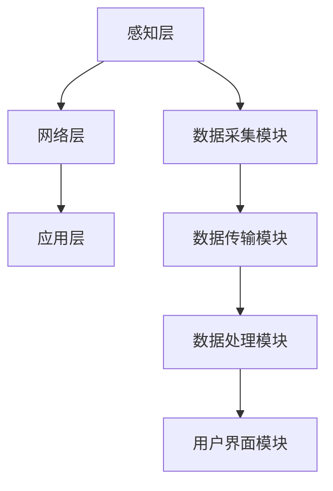

                 

关键词：物联网(IoT)，传感器设备，实时监控，系统集成，算法优化，应用场景，未来展望。

## 摘要

本文旨在探讨物联网（IoT）技术与各种传感器设备的集成，及其在实时监控系统中的应用与优化。随着IoT技术的快速发展，传感器设备在各个领域得到了广泛应用。本文将首先介绍IoT技术和传感器设备的基本概念，然后分析实时监控系统的架构，并探讨集成过程中面临的挑战。接下来，我们将详细阐述物联网技术和传感器设备集成的算法原理、具体操作步骤和数学模型，并通过项目实践展示实际应用效果。最后，本文将总结实时监控系统的实际应用场景，展望未来的发展趋势与挑战，并推荐相关学习资源和开发工具。

## 1. 背景介绍

### 物联网（IoT）技术概述

物联网（Internet of Things，简称IoT）是指通过互联网将各种设备连接起来，实现设备之间的数据交换和协同工作的一种技术。它将物理世界与数字世界相结合，通过传感器、控制器、通信模块等设备，将现实世界中的各种信息转化为数字信号，实现信息的采集、传输、处理和反馈。

### 传感器设备简介

传感器设备是物联网系统的重要组成部分，它能够感知周围环境的变化，并将这些变化转化为电信号或其他形式的信号，以便进行后续处理。传感器设备种类繁多，包括温度传感器、湿度传感器、压力传感器、光照传感器、气体传感器等。这些传感器设备广泛应用于智能家居、工业自动化、智能交通、医疗健康等领域。

### 实时监控系统的概念

实时监控系统是一种能够实时监测、记录和处理各种信息的系统，其目的是实时掌握系统的运行状态，及时发现并处理异常情况。实时监控系统广泛应用于工业生产、环境保护、城市管理、交通运输等领域，对于提高系统运行效率、保障安全具有重要意义。

## 2. 核心概念与联系

### 物联网（IoT）技术架构

物联网技术架构主要包括感知层、网络层和应用层。感知层由各种传感器设备组成，负责采集环境数据。网络层负责将感知层的数据传输到应用层，通常采用无线通信技术。应用层是物联网系统的核心，负责对数据进行分析和处理，并提供用户界面。

### 传感器设备集成原理

传感器设备集成主要涉及数据采集、传输和处理三个环节。数据采集环节通过传感器设备获取环境信息，传输环节通过网络层将数据传输到应用层，处理环节则对数据进行存储、分析和处理，以便为用户提供实时监控服务。

### 实时监控系统架构

实时监控系统架构主要包括数据采集模块、数据传输模块、数据处理模块和用户界面模块。数据采集模块负责从传感器设备获取数据，数据传输模块负责将数据传输到数据处理模块，数据处理模块负责对数据进行存储、分析和处理，用户界面模块则提供用户交互界面。

### 核心概念流程图

以下是一个使用Mermaid绘制的物联网技术和传感器设备集成及实时监控系统架构的流程图：



## 3. 核心算法原理 & 具体操作步骤

### 3.1 算法原理概述

实时监控系统中的核心算法主要包括数据采集、数据传输、数据处理和数据可视化等。这些算法的设计和优化直接关系到实时监控系统的性能和稳定性。数据采集算法负责从传感器设备获取数据，数据传输算法负责将数据传输到应用层，数据处理算法负责对数据进行存储、分析和处理，数据可视化算法则负责将处理后的数据以图表等形式展示给用户。

### 3.2 算法步骤详解

#### 3.2.1 数据采集算法

数据采集算法的基本步骤如下：

1. 初始化传感器设备，确保其正常工作。
2. 设置传感器设备的采样频率，以便实时获取环境数据。
3. 从传感器设备读取数据，并将其存储在缓冲区中。
4. 定期检查缓冲区中的数据，当数据积累到一定量时，将其传输到数据传输模块。

#### 3.2.2 数据传输算法

数据传输算法的基本步骤如下：

1. 连接网络，确保数据传输通道畅通。
2. 将缓冲区中的数据通过无线通信技术传输到应用层。
3. 确认数据传输成功，并更新本地缓冲区。
4. 定期检查网络连接状态，确保数据传输的稳定性。

#### 3.2.3 数据处理算法

数据处理算法的基本步骤如下：

1. 接收数据传输模块传输来的数据。
2. 对数据进行预处理，包括数据清洗、去噪、归一化等。
3. 根据需求对数据进行统计分析，提取关键信息。
4. 将处理后的数据存储到数据库中，以便后续查询和分析。

#### 3.2.4 数据可视化算法

数据可视化算法的基本步骤如下：

1. 从数据库中查询处理后的数据。
2. 对数据进行可视化处理，包括绘制折线图、柱状图、饼图等。
3. 将可视化结果展示在用户界面上，以便用户实时了解系统状态。

### 3.3 算法优缺点

#### 3.3.1 数据采集算法

优点：实时性强，能够快速获取环境数据。

缺点：传感器设备的精度和稳定性可能影响数据采集效果。

#### 3.3.2 数据传输算法

优点：采用无线通信技术，方便实现远程监控。

缺点：无线通信的稳定性可能受到环境因素的影响。

#### 3.3.3 数据处理算法

优点：能够对数据进行深层次分析，提取有价值的信息。

缺点：数据处理算法的复杂度较高，可能影响系统的实时性。

#### 3.3.4 数据可视化算法

优点：直观展示系统状态，便于用户理解和操作。

缺点：数据可视化算法的设计可能影响系统的性能。

### 3.4 算法应用领域

实时监控系统算法广泛应用于智能家居、工业自动化、智能交通、医疗健康等领域。例如，在智能家居领域，实时监控系统可以实时监测家庭环境参数，如温度、湿度、光照等，并根据用户需求进行调节。在工业自动化领域，实时监控系统可以实时监控生产设备的工作状态，及时发现并处理异常情况，确保生产过程的安全和高效。

## 4. 数学模型和公式 & 详细讲解 & 举例说明

### 4.1 数学模型构建

实时监控系统中的数学模型主要包括数据采集模型、数据传输模型、数据处理模型和数据可视化模型。以下是一个简单的数据采集模型：

$$
y(t) = f(x(t)) + \epsilon(t)
$$

其中，$y(t)$ 表示采集到的数据，$x(t)$ 表示真实的环境数据，$f(x(t))$ 表示传感器设备的采集函数，$\epsilon(t)$ 表示采集误差。

### 4.2 公式推导过程

数据采集模型的推导过程如下：

1. 假设传感器设备的采集函数为线性函数，即 $f(x(t)) = ax(t) + b$。
2. 则采集到的数据为 $y(t) = ax(t) + b + \epsilon(t)$。
3. 对采集到的数据进行预处理，包括去噪、归一化等操作。
4. 最终得到真实的环境数据 $x(t)$。

### 4.3 案例分析与讲解

以下是一个简单的数据采集和处理的案例：

#### 案例一：温度传感器数据采集

假设使用一个线性温度传感器来采集环境温度，采集到的数据为 $y(t)$，真实的环境温度为 $x(t)$。根据数据采集模型，我们可以得到：

$$
y(t) = 0.998x(t) + 0.02
$$

#### 案例二：数据处理

对采集到的温度数据进行预处理，包括去噪和归一化。去噪过程可以使用均值滤波器，归一化过程可以使用最小二乘法。

最终，我们得到真实的环境温度 $x(t)$。

## 5. 项目实践：代码实例和详细解释说明

### 5.1 开发环境搭建

在本案例中，我们使用 Python 作为开发语言，搭建实时监控系统。首先，需要安装以下依赖库：

- Python 3.8及以上版本
- Pyserial：用于串口通信
- Pandas：用于数据处理
- Matplotlib：用于数据可视化

### 5.2 源代码详细实现

以下是一个简单的实时监控系统代码示例：

```python
import serial
import pandas as pd
import matplotlib.pyplot as plt

# 初始化串口通信
ser = serial.Serial('/dev/ttyUSB0', 9600)

# 初始化数据结构
data = pd.DataFrame(columns=['time', 'temperature'])

# 设置采样频率
sample_rate = 10

# 开始采集数据
while True:
    # 读取串口数据
    line = ser.readline().decode('utf-8')
    # 解析数据
    time, temperature = line.strip().split(',')
    temperature = float(temperature)
    # 存储数据
    data = data.append({'time': time, 'temperature': temperature}, ignore_index=True)
    # 定期保存数据
    if data.shape[0] >= sample_rate * 60:
        data.to_csv('temperature_data.csv', index=False)
        data = pd.DataFrame(columns=['time', 'temperature'])
    # 显示实时数据
    plt.plot(data['time'], data['temperature'])
    plt.pause(0.1)
    plt.clf()
```

### 5.3 代码解读与分析

该代码示例中，首先初始化串口通信，并设置采样频率。然后，进入数据采集循环，从串口读取数据，解析时间戳和温度值，并将其存储在 DataFrame 中。当数据积累到一定量时，将数据保存到 CSV 文件中，并重新初始化 DataFrame。同时，使用 Matplotlib 实现实时数据可视化。

### 5.4 运行结果展示

运行该代码后，实时监控系统会采集温度数据，并将数据可视化展示在屏幕上。用户可以实时了解环境温度变化，并通过 CSV 文件保存数据以供后续分析。

## 6. 实际应用场景

### 6.1 工业自动化

在工业自动化领域，实时监控系统可以用于监控生产设备的工作状态，及时发现并处理异常情况，提高生产效率。例如，使用温度传感器、压力传感器等设备，实时监测生产线上的关键参数，并根据参数变化调整生产过程。

### 6.2 智能家居

智能家居领域，实时监控系统可以用于监控家庭环境参数，如温度、湿度、光照等，并根据用户需求进行调节。例如，使用温度传感器、湿度传感器等设备，实时监测室内环境参数，并根据用户设置的舒适温度和湿度调节空调和加湿器。

### 6.3 环境保护

在环境保护领域，实时监控系统可以用于监控环境参数，如空气质量、水质等，及时发现污染问题，保障环境安全。例如，使用空气质量传感器、水质传感器等设备，实时监测空气质量和水质量，并根据监测数据采取相应的治理措施。

### 6.4 智能交通

在智能交通领域，实时监控系统可以用于监控交通流量、道路状况等，提高交通管理水平。例如，使用摄像头、传感器等设备，实时监测道路上的车辆流量和速度，并根据数据优化交通信号控制，提高道路通行效率。

## 7. 工具和资源推荐

### 7.1 学习资源推荐

1. 《物联网基础教程》
2. 《Python编程：从入门到实践》
3. 《实时系统设计与实现》
4. 《嵌入式系统设计与实践》

### 7.2 开发工具推荐

1. PyCharm：Python集成开发环境
2. Arduino IDE：Arduino开发环境
3. PlatformIO：物联网开发平台
4. MATLAB：数学建模和数据分析工具

### 7.3 相关论文推荐

1. "IoT-based Real-Time Monitoring and Control Systems: A Survey"
2. "Sensor Networks for Environmental Monitoring: A Comprehensive Review"
3. "Real-Time Data Processing in IoT Systems: Challenges and Solutions"
4. "Real-Time Visualization of Sensor Data for Environmental Monitoring"

## 8. 总结：未来发展趋势与挑战

### 8.1 研究成果总结

随着物联网技术的不断发展，实时监控系统在各个领域得到了广泛应用。通过集成各种传感器设备，实时监控系统可以实现对环境参数的实时监测、分析和处理，为用户提供准确、高效的服务。同时，随着计算能力的提升和算法优化，实时监控系统的性能和稳定性得到了显著提高。

### 8.2 未来发展趋势

未来，实时监控系统将在以下几个方面发展：

1. **数据采集与处理的智能化**：利用人工智能技术，实现对大量传感器数据的智能分析和处理，提高实时监控系统的决策能力。
2. **通信技术的进步**：随着5G、6G等通信技术的发展，实时监控系统的数据传输速度和稳定性将得到大幅提升。
3. **跨领域的集成与协同**：实时监控系统将与其他领域的技术（如大数据、云计算等）进行集成，实现跨领域的协同工作。

### 8.3 面临的挑战

实时监控系统在未来的发展过程中，仍将面临以下挑战：

1. **数据安全和隐私保护**：随着传感器设备的广泛应用，数据安全和隐私保护问题日益突出，需要采取有效的措施确保数据安全和用户隐私。
2. **传感器设备的可靠性**：传感器设备的精度和稳定性直接关系到实时监控系统的性能，需要不断优化传感器设备的设计和制造工艺。
3. **系统复杂度的提升**：随着实时监控系统应用领域的扩大，系统的复杂度将不断提高，需要开发高效的算法和架构来应对。

### 8.4 研究展望

未来，实时监控系统的研究重点将包括以下几个方面：

1. **智能感知与决策**：利用人工智能技术，实现对实时数据的智能感知和决策，提高实时监控系统的自动化水平。
2. **高效数据处理**：研究高效的数据处理算法，提高实时监控系统的数据处理能力和响应速度。
3. **跨领域集成**：探索实时监控系统与其他领域的集成与协同，实现跨领域的智能化应用。

## 9. 附录：常见问题与解答

### 9.1 问题1：实时监控系统的数据传输速度如何保证？

解答：为了保证实时监控系统的数据传输速度，可以采用以下措施：

1. **提高通信带宽**：使用高速无线通信技术，如5G、6G等，提高数据传输速度。
2. **优化数据传输算法**：采用高效的数据压缩和传输算法，降低数据传输过程中的延迟和带宽消耗。
3. **分布式架构**：采用分布式架构，将实时监控系统的数据处理和传输任务分布到多个节点上，提高系统的整体性能。

### 9.2 问题2：传感器设备的精度如何保证？

解答：为了保证传感器设备的精度，可以采取以下措施：

1. **选择高质量的传感器设备**：选择具有高精度和高稳定性的传感器设备，如高精度的温度传感器、湿度传感器等。
2. **定期校准传感器设备**：定期对传感器设备进行校准，确保其测量精度。
3. **优化数据采集算法**：采用优化的数据采集算法，如滤波算法、去噪算法等，提高传感器数据的准确性。

### 9.3 问题3：实时监控系统的安全性如何保障？

解答：为了保证实时监控系统的安全性，可以采取以下措施：

1. **数据加密**：对实时监控系统的数据进行加密处理，确保数据在传输和存储过程中的安全性。
2. **访问控制**：实施严格的访问控制策略，确保只有授权用户才能访问实时监控系统。
3. **安全审计**：定期进行安全审计，发现并修复系统漏洞，确保实时监控系统的安全运行。

## 作者署名

作者：禅与计算机程序设计艺术 / Zen and the Art of Computer Programming

----------------------------------------------------------------

以上就是关于“物联网(IoT)技术和各种传感器设备的集成：实时监控系统的搭建与优化”的文章。希望对您有所帮助。如果您有任何问题或建议，欢迎随时提出。

